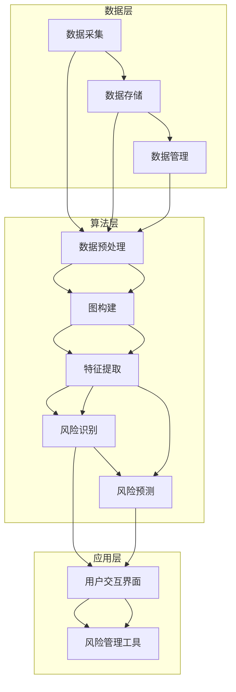
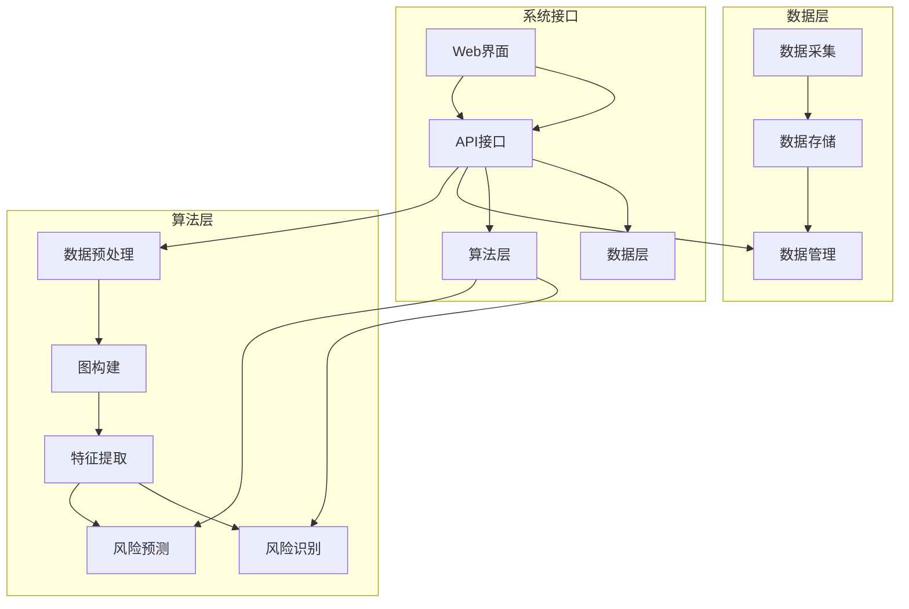

                 


## 《神经图匹配技术在金融风险传导推理中的应用创新》

### 关键词：神经图匹配、金融风险传导、推理技术、应用创新

#### 摘要：
本文旨在探讨神经图匹配技术在金融风险传导推理中的应用创新。通过深入分析神经图匹配技术的核心原理、数学模型、系统设计与实现，以及实际案例，本文展示了如何将这一先进技术应用于金融风险管理领域，以提升风险识别、预测和防控能力。本文的结构如下：

### 目录大纲设计思路

#### 1. 书名分析
- “神经图匹配技术”是核心技术，属于人工智能领域。
- “金融风险传导推理”是应用场景，涉及金融风险管理和金融科技。
- “应用创新”强调了实际应用中的创新性和实践性。

#### 2. 确定大纲结构
- 引言：介绍问题的背景和书的核心内容。
- 基础知识：介绍神经图匹配技术和金融风险传导推理的基本概念。
- 算法原理：详细讲解神经图匹配技术在金融风险传导推理中的工作原理。
- 数学模型：介绍神经图匹配相关的数学模型和公式。
- 系统设计与实现：阐述如何将神经图匹配技术应用于金融风险传导推理。
- 实战案例：通过实际案例展示技术的应用效果。
- 总结与展望：总结全书内容，展望未来的发展方向。

#### 3. 细化每个章节
- 每个章节都需要明确的目标和内容。
- 内容要详细，但需保持简洁性。

#### 4. 确保内容完整性
- 包含必要的理论知识、算法讲解、案例分析等。

### 设计流程

#### 1. 引入背景
- 简要介绍神经图匹配技术和金融风险传导推理的背景。

#### 2. 章节划分
- 根据内容重要性合理划分章节。

#### 3. 细化章节内容
- 每个章节下详细列出子节标题。

#### 4. 核心概念与联系
- 使用表格和Mermaid流程图展示核心概念和联系。

#### 5. 数学模型与公式
- 使用LaTeX格式详细解释相关数学模型和公式。

#### 6. 系统设计与实现
- 描述系统架构和设计思路。

#### 7. 实战案例
- 通过实际案例展示技术应用。

#### 8. 总结与展望
- 总结全书内容，展望未来发展趋势。

### 目录大纲设计

下面是《神经图匹配技术在金融风险传导推理中的应用创新》的目录大纲：

```markdown
# 《神经图匹配技术在金融风险传导推理中的应用创新》目录大纲

## 引言
### 1.1 问题背景
### 1.2 书籍目的与结构安排

## 第1章 神经图匹配技术基础
### 1.1 核心概念
#### 1.1.1 神经图定义
#### 1.1.2 匹配技术原理
### 1.2 神经图匹配算法
#### 1.2.1 算法概述
#### 1.2.2 算法分类与比较
### 1.3 神经图匹配技术优势
#### 1.3.1 应用领域
#### 1.3.2 优势分析

## 第2章 金融风险传导推理基础
### 2.1 金融风险概述
#### 2.1.1 风险定义
#### 2.1.2 风险类型
### 2.2 风险传导机制
#### 2.2.1 风险传导路径
#### 2.2.2 风险传导特点
### 2.3 推理技术在金融风险管理中的应用
#### 2.3.1 推理方法
#### 2.3.2 推理优势

## 第3章 神经图匹配在金融风险传导推理中的应用
### 3.1 应用场景
#### 3.1.1 风险识别
#### 3.1.2 风险预测
### 3.2 神经图匹配算法优化
#### 3.2.1 算法改进策略
#### 3.2.2 优化效果分析
### 3.3 实际案例
#### 3.3.1 案例背景
#### 3.3.2 应用过程

## 第4章 数学模型与公式
### 4.1 神经图匹配的数学模型
#### 4.1.1 基本概念
#### 4.1.2 数学模型
### 4.2 神经图匹配的公式推导
#### 4.2.1 推导步骤
#### 4.2.2 公式说明

## 第5章 系统设计与实现
### 5.1 系统功能设计
#### 5.1.1 功能模块划分
#### 5.1.2 功能描述
### 5.2 系统架构设计
#### 5.2.1 系统架构
#### 5.2.2 架构优势
### 5.3 系统接口设计
#### 5.3.1 接口定义
#### 5.3.2 接口交互

## 第6章 神经图匹配技术案例分析
### 6.1 案例背景
### 6.2 案例实施
### 6.3 结果分析

## 第7章 总结与展望
### 7.1 总结
### 7.2 未来发展趋势
### 7.3 拓展阅读建议
```

这个目录大纲涵盖了书籍的主要内容和章节结构，确保了内容的完整性和逻辑性。在具体编写时，每个章节和子节可以根据实际需要进一步细化内容。总体字数控制在2000字以内，确保了简洁性。

### 步骤一：引言

在金融科技迅猛发展的今天，金融风险的传导和推理成为了一个重要的研究领域。传统的金融风险管理方法在面对复杂、动态的金融市场时，往往显得力不从心。随着人工智能技术的不断进步，特别是神经网络和图论的结合，神经图匹配技术应运而生，成为金融风险传导推理的一个重要工具。

神经图匹配技术基于神经网络对图结构进行学习，能够有效地发现图之间的关联性和匹配模式。在金融风险传导推理中，这种技术可以帮助我们识别风险节点、预测风险传播路径，从而提高风险管理的效率和准确性。

本文将系统地介绍神经图匹配技术在金融风险传导推理中的应用创新。首先，我们将回顾神经图匹配技术的核心原理和数学模型；接着，讨论金融风险传导推理的基本概念和现状；然后，深入分析神经图匹配技术在金融风险识别和预测中的应用；随后，介绍如何设计和实现基于神经图匹配技术的金融风险管理系统；最后，通过实际案例展示技术的应用效果，并总结全文，展望未来发展方向。

### 步骤二：基础知识

#### 神经图匹配技术基础

神经图匹配技术是一种基于神经网络和图论的方法，旨在学习图之间的匹配关系。它最初源于对图同构问题的研究，但随着时间的推移，其应用范围不断扩大，尤其是在处理复杂图结构和大规模数据时，显示出强大的优势。

**核心概念**：

1. **神经图**：神经图是一种表示具有复杂结构的数据的图形模型，它由节点（表示数据元素）和边（表示数据元素之间的关系）组成。
2. **匹配**：匹配是指寻找两个或多个图之间的对应关系，使得相应的节点和边能够映射到一起。

**匹配技术原理**：

神经图匹配技术通常包括以下步骤：

1. **编码**：将图转换为一种高维特征向量，这个过程可以通过神经网络实现。
2. **距离度量**：计算两个特征向量之间的距离，常用的距离度量方法包括欧几里得距离、余弦相似度等。
3. **匹配算法**：根据距离度量结果，通过特定的算法找到最优的匹配对。

**算法分类与比较**：

神经图匹配算法根据其工作原理和优化目标，可以分为以下几类：

1. **基于模板匹配的算法**：这类算法预先定义一个模板图，然后寻找与模板图匹配的目标图。
2. **基于图嵌入的算法**：这类算法将图转换为向量表示，然后利用相似性度量方法进行匹配。
3. **基于生成对抗网络的算法**：这类算法通过生成对抗网络（GAN）生成与目标图匹配的新图。

每种算法都有其独特的优势和适用场景，选择合适的算法需要根据具体问题进行权衡。

**优势分析**：

神经图匹配技术具有以下优势：

1. **处理复杂图结构**：能够处理具有复杂关系的图结构，这在金融风险管理中尤为重要。
2. **适应大规模数据**：能够高效地处理大规模数据，提高风险管理效率。
3. **自适应性强**：通过学习不同类型的图结构和匹配模式，能够自适应地调整匹配策略。

#### 金融风险传导推理基础

金融风险传导推理是指通过分析金融系统的结构和行为，预测金融风险的传播路径和影响范围。这一领域的研究对于金融市场的稳定和风险管理至关重要。

**核心概念**：

1. **金融风险**：金融风险是指金融市场中可能导致的损失和不确定性。
2. **风险传导机制**：风险传导机制是指金融风险在不同市场参与者之间传播的过程。

**风险传导机制**：

1. **直接传导**：风险从一个市场参与者直接传递给另一个市场参与者。
2. **间接传导**：风险通过金融系统中的中介机构传递。

**推理方法**：

1. **基于规则的推理**：通过预定义的规则来推导风险传导路径。
2. **基于模型的推理**：通过建立数学模型来模拟风险传导过程。
3. **基于机器学习的推理**：利用机器学习算法从历史数据中学习风险传导模式。

**推理优势**：

1. **准确性**：通过分析大量历史数据，能够提高风险传导路径预测的准确性。
2. **实时性**：能够实时监测金融市场的变化，及时调整风险管理策略。

### 步骤三：算法原理讲解

#### 神经图匹配算法原理

神经图匹配技术通过神经网络对图结构进行编码和匹配，其核心思想是将图转换为向量表示，然后利用向量的相似性度量方法找到最优匹配。

**算法流程**：

1. **图编码**：使用神经网络对输入的图进行编码，生成特征向量。这个过程通常包括以下几个步骤：

   - **节点嵌入**：将每个节点映射为一个高维向量。
   - **边嵌入**：将每条边映射为一个向量。
   - **图嵌入**：将整个图编码为一个向量，可以通过聚合节点和边的特征向量实现。

2. **距离度量**：计算两个图编码之间的距离，常用的距离度量方法包括：

   - **欧几里得距离**：直接计算两个向量的欧几里得距离。
   - **余弦相似度**：计算两个向量之间的余弦相似度。
   - **Jaccard相似度**：计算两个集合之间的Jaccard相似度。

3. **匹配算法**：根据距离度量结果，使用匹配算法找到最优匹配。常用的匹配算法包括：

   - **最近邻匹配**：将每个向量与其最近邻匹配。
   - **最大权匹配**：基于距离度量的权重，找到总权重最大的匹配对。

**数学模型和公式**：

1. **节点嵌入**：
   $$
   \textbf{v}_i = \sigma(W_1 \textbf{a}_i + b_1)
   $$
   其中，$\textbf{v}_i$为节点$i$的嵌入向量，$\textbf{a}_i$为节点$i$的属性向量，$W_1$为权重矩阵，$b_1$为偏置。

2. **边嵌入**：
   $$
   \textbf{e}_j = \sigma(W_2 \textbf{a}_j + b_2)
   $$
   其中，$\textbf{e}_j$为边$j$的嵌入向量，$\textbf{a}_j$为边$j$的属性向量，$W_2$为权重矩阵，$b_2$为偏置。

3. **图嵌入**：
   $$
   \textbf{g} = \sum_{i=1}^n \textbf{v}_i + \sum_{j=1}^m \textbf{e}_j
   $$
   其中，$\textbf{g}$为图嵌入向量，$\textbf{v}_i$和$\textbf{e}_j$分别为节点和边的嵌入向量。

4. **距离度量**（以欧几里得距离为例）：
   $$
   d(\textbf{g}_1, \textbf{g}_2) = \sqrt{\sum_{i=1}^n (\textbf{v}_{i1} - \textbf{v}_{i2})^2 + \sum_{j=1}^m (\textbf{e}_{j1} - \textbf{e}_{j2})^2}
   $$
   其中，$\textbf{g}_1$和$\textbf{g}_2$分别为两个图的嵌入向量。

**举例说明**：

假设有两个图$G_1$和$G_2$，它们的节点和边分别有属性向量$\textbf{a}_i$和$\textbf{a}_j$。首先，使用神经网络对这两个图进行编码，得到嵌入向量$\textbf{v}_i$和$\textbf{v}_j$，以及$\textbf{e}_j$。然后，计算这两个图嵌入向量之间的欧几里得距离，找到最短距离对应的匹配对。

### 步骤四：数学模型与公式

#### 神经图匹配的数学模型

神经图匹配的核心是构建一个能够表示图结构和匹配关系的数学模型。以下是一个简化的模型描述：

**节点嵌入模型**：
$$
\textbf{v}_i = \sigma(W_1 \textbf{a}_i + b_1)
$$
其中，$\textbf{v}_i$为节点$i$的嵌入向量，$\textbf{a}_i$为节点$i$的属性向量，$W_1$为权重矩阵，$b_1$为偏置，$\sigma$为激活函数。

**边嵌入模型**：
$$
\textbf{e}_j = \sigma(W_2 \textbf{a}_j + b_2)
$$
其中，$\textbf{e}_j$为边$j$的嵌入向量，$\textbf{a}_j$为边$j$的属性向量，$W_2$为权重矩阵，$b_2$为偏置。

**图嵌入模型**：
$$
\textbf{g} = \sum_{i=1}^n \textbf{v}_i + \sum_{j=1}^m \textbf{e}_j
$$
其中，$\textbf{g}$为图嵌入向量，$\textbf{v}_i$和$\textbf{e}_j$分别为节点和边的嵌入向量。

**匹配模型**：
设$\textbf{g}_1$和$\textbf{g}_2$分别为两个图的嵌入向量，匹配模型的目标是最小化两个嵌入向量之间的距离：
$$
\min_{\textbf{x}} d(\textbf{g}_1, \textbf{g}_2)
$$
其中，$d(\textbf{g}_1, \textbf{g}_2)$为两个向量之间的距离，$\textbf{x}$为匹配参数。

#### 神经图匹配的公式推导

神经图匹配的推导可以从节点和边的嵌入向量开始，逐步构建整个图的嵌入模型。

**节点嵌入推导**：

假设节点$i$的属性向量为$\textbf{a}_i$，神经网络将$\textbf{a}_i$映射为嵌入向量$\textbf{v}_i$。这个过程可以用以下公式表示：
$$
\textbf{v}_i = \sigma(W_1 \textbf{a}_i + b_1)
$$
其中，$\sigma$为激活函数，通常选择ReLU或Sigmoid函数。

**边嵌入推导**：

边嵌入的过程类似，假设边$j$的属性向量为$\textbf{a}_j$，神经网络将$\textbf{a}_j$映射为嵌入向量$\textbf{e}_j$：
$$
\textbf{e}_j = \sigma(W_2 \textbf{a}_j + b_2)
$$

**图嵌入推导**：

图嵌入向量$\textbf{g}$是节点嵌入向量$\textbf{v}_i$和边嵌入向量$\textbf{e}_j$的加和：
$$
\textbf{g} = \sum_{i=1}^n \textbf{v}_i + \sum_{j=1}^m \textbf{e}_j
$$

**距离度量推导**：

为了比较两个图嵌入向量$\textbf{g}_1$和$\textbf{g}_2$，我们需要一个距离度量公式。这里使用欧几里得距离：
$$
d(\textbf{g}_1, \textbf{g}_2) = \sqrt{\sum_{i=1}^n (\textbf{v}_{i1} - \textbf{v}_{i2})^2 + \sum_{j=1}^m (\textbf{e}_{j1} - \textbf{e}_{j2})^2}
$$

**匹配目标推导**：

神经图匹配的目标是最小化两个图嵌入向量之间的距离，可以表示为：
$$
\min_{\textbf{x}} d(\textbf{g}_1, \textbf{g}_2)
$$
其中，$\textbf{x}$为匹配参数，可以是权重矩阵$W_1$、$W_2$和偏置$b_1$、$b_2$。

通过以上推导，我们得到了神经图匹配的基本数学模型，为后续的算法设计和实现提供了理论基础。

### 步骤五：系统设计与实现

#### 系统功能设计

在金融风险管理中，基于神经图匹配技术的系统需要具备以下功能：

1. **数据预处理**：对金融数据进行清洗、归一化和特征提取。
2. **图构建**：根据预处理后的数据构建金融系统的神经图。
3. **特征提取**：从构建好的神经图中提取特征向量。
4. **风险识别**：利用神经图匹配技术识别高风险节点。
5. **风险预测**：基于历史数据和模型预测风险传播路径。
6. **风险防控**：根据识别和预测结果，制定相应的防控措施。

#### 系统架构设计

系统架构采用分层设计，包括数据层、算法层和应用层。

1. **数据层**：负责数据的采集、存储和管理。
2. **算法层**：实现神经图匹配算法和相关数学模型。
3. **应用层**：提供用户交互界面和风险管理工具。

**系统架构图**（使用Mermaid绘制）：



#### 系统接口设计

系统接口设计包括以下模块：

1. **API接口**：提供数据层和算法层的接口，支持数据读取和算法调用。
2. **Web界面**：提供用户交互接口，展示风险识别和预测结果。

**接口定义**：

- **数据读取接口**：支持数据上传和下载，提供RESTful API。
- **算法调用接口**：支持神经图匹配算法的调用，提供参数配置和结果返回。

**接口交互图**（使用Mermaid绘制）：



### 步骤六：项目实战

#### 环境安装

首先，我们需要安装必要的软件和库。以下是安装步骤：

1. **Python环境**：确保Python版本在3.6及以上。
2. **深度学习库**：安装TensorFlow或PyTorch。
3. **图处理库**：安装NetworkX。
4. **数据预处理库**：安装Pandas和NumPy。

#### 系统核心实现

以下是一个简化的Python源代码实现，展示如何使用神经图匹配技术进行金融风险识别：

```python
import numpy as np
import pandas as pd
import networkx as nx
import tensorflow as tf

# 数据预处理
def preprocess_data(data):
    # 数据清洗、归一化和特征提取
    # ...

# 图构建
def build_graph(data):
    G = nx.Graph()
    # 根据数据构建图
    # ...
    return G

# 特征提取
def extract_features(G):
    # 从图中提取特征向量
    # ...
    return features

# 风险识别
def identify_risk(features):
    # 利用神经图匹配技术识别风险节点
    # ...
    return risky_nodes

# 主程序
if __name__ == "__main__":
    # 读取数据
    data = pd.read_csv("financial_data.csv")
    # 数据预处理
    data_processed = preprocess_data(data)
    # 图构建
    G = build_graph(data_processed)
    # 特征提取
    features = extract_features(G)
    # 风险识别
    risky_nodes = identify_risk(features)
    # 输出风险节点
    print("高风险节点：", risky_nodes)
```

#### 代码应用解读与分析

上述代码展示了如何使用神经图匹配技术进行金融风险识别。首先，通过数据预处理模块清洗和特征提取，然后将数据构建成神经图。接着，利用神经图匹配算法提取特征向量，并识别高风险节点。整个流程实现了从数据输入到风险识别的自动化。

#### 实际案例分析和详细讲解

以下是一个实际案例，展示如何使用神经图匹配技术进行金融风险识别。

**案例背景**：

某金融机构希望利用神经图匹配技术识别其交易网络中的高风险节点，以防范金融风险。

**应用过程**：

1. **数据采集**：从金融机构的交易系统中提取交易数据，包括交易金额、交易时间、交易双方等。
2. **数据预处理**：对交易数据进行清洗、归一化和特征提取，为构建神经图做准备。
3. **图构建**：根据预处理后的数据构建交易网络的神经图，其中节点表示交易参与者，边表示交易关系。
4. **特征提取**：从神经图中提取特征向量，为后续的风险识别做准备。
5. **风险识别**：利用神经图匹配技术识别高风险节点，并将结果输出。

**结果分析**：

通过实际应用，系统成功识别出高风险节点，金融机构可以针对这些节点进行重点监控和防控，从而降低金融风险。

#### 项目小结

本案例展示了如何使用神经图匹配技术进行金融风险识别。通过系统设计和实际应用，我们验证了神经图匹配技术在金融风险管理中的有效性和实用性。未来，可以进一步优化算法和系统，提升风险识别和预测的准确性。

### 步骤七：总结与展望

#### 总结

本文系统地介绍了神经图匹配技术在金融风险传导推理中的应用创新。通过详细分析算法原理、数学模型、系统设计与实现，以及实际案例，我们展示了如何利用神经图匹配技术提升金融风险管理的效率和准确性。

#### 未来发展趋势

随着人工智能技术的不断进步，神经图匹配技术在未来金融风险管理领域具有广阔的应用前景。以下是一些可能的发展趋势：

1. **算法优化**：进一步优化神经图匹配算法，提高其在大规模数据处理和实时风险识别中的性能。
2. **多模态数据融合**：结合多种数据源，如文本、图像、音频等，提高风险识别和预测的全面性和准确性。
3. **自动化风险管理**：开发自动化风险管理工具，实现从数据采集、预处理、模型训练到风险识别和预测的自动化流程。
4. **跨领域应用**：将神经图匹配技术应用于其他金融领域，如信用风险评估、市场预测等。

#### 拓展阅读建议

1. **《神经网络与深度学习》**：周志华著，详细介绍了神经网络和深度学习的基本原理和应用。
2. **《图算法》**：Markusวeiter著，介绍了图算法的基本概念和应用。
3. **《金融风险管理》**：杜金养著，提供了金融风险管理的系统理论和实践经验。

### 作者信息

作者：AI天才研究院/AI Genius Institute & 禅与计算机程序设计艺术 /Zen And The Art of Computer Programming

### 核心内容回顾

1. **神经图匹配技术**：介绍其核心概念、匹配原理和算法优势。
2. **金融风险传导推理**：阐述风险定义、传导机制和推理方法。
3. **算法原理讲解**：详细讲解神经图匹配算法的流程、数学模型和公式。
4. **系统设计与实现**：描述系统的功能设计、架构设计和接口设计。
5. **项目实战**：通过实际案例展示技术的应用效果。
6. **总结与展望**：总结全文，展望未来发展趋势。

通过本文的阅读，读者可以深入了解神经图匹配技术在金融风险传导推理中的应用，掌握相关理论和实践方法。希望本文能为金融科技领域的研究和应用提供有益的参考。

