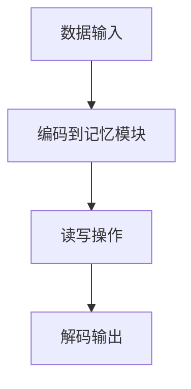
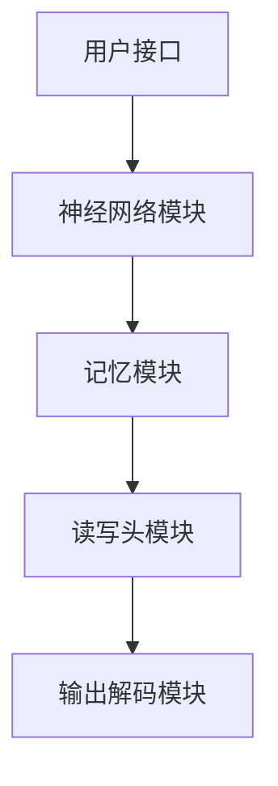
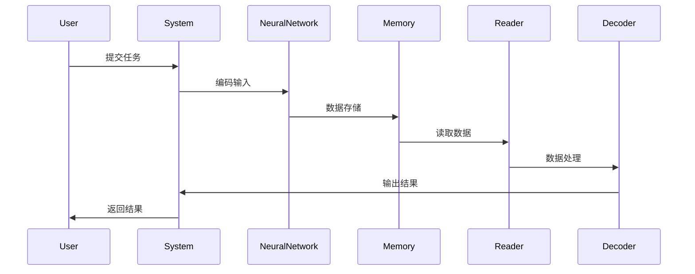

                 

# 神经图灵机增强AI抽象推理能力的新方法

关键词：神经图灵机，AI抽象推理，神经网络，增强学习，深度学习

摘要：本文深入探讨了神经图灵机（Neural Turing Machines，NTMs）在增强人工智能（AI）抽象推理能力方面的新方法。通过分析神经图灵机的基本原理、结构和工作机制，本文揭示了NTMs如何突破传统AI模型的局限，实现更高级别的抽象推理。文章还通过具体的案例研究，展示了NTMs在自然语言处理、计算机视觉和决策推理等领域的应用，以及对未来AI发展的启示。

## 引言

随着人工智能技术的快速发展，深度学习在图像识别、语音识别和自然语言处理等领域取得了显著成果。然而，传统深度学习模型在抽象推理方面仍然存在一定的局限性。它们往往依赖于大量标注数据进行训练，且在处理复杂任务时表现不够灵活。为了解决这些问题，研究者们开始探索新的方法，其中神经图灵机（NTMs）作为一种创新性的计算模型，引起了广泛关注。

神经图灵机结合了神经网络和图灵机的优势，通过引入外部记忆和读写操作，实现了对数据的动态处理和抽象推理。本文旨在探讨NTMs在增强AI抽象推理能力方面的新方法，分析其在不同领域的应用，并探讨未来发展的可能性。

## 神经图灵机的基本原理

神经图灵机是一种结合了神经网络和图灵机概念的混合模型。传统神经网络通过多层节点进行数据处理和特征提取，而图灵机则通过读写头在无限长纸带上读写符号，进行复杂计算。NTMs结合了两者的优点，引入了外部记忆机制，使其能够处理更复杂的任务。

### 1. 结构组成

神经图灵机由以下几个主要部分组成：

1. **输入层**：接收外部输入数据，例如文本、图像或声音。
2. **记忆模块**：类似于图灵机的纸带，记忆模块提供了一个可读写的存储空间，用于存储和处理数据。
3. **读写头**：在记忆模块上进行数据的读写操作，读写头可以沿着记忆纸带上下移动，选择性地读取或写入数据。
4. **神经网络**：负责将输入数据编码到记忆模块中，并根据需要从记忆中检索数据。

### 2. 工作机制

NTMs的工作机制可以分为以下几个步骤：

1. **数据编码**：输入数据通过神经网络编码到记忆模块中，记忆模块中的每个单元都存储一定量的信息。
2. **读写操作**：读写头在记忆模块上移动，根据当前的任务需求进行读取或写入操作。例如，在图像识别任务中，读写头可以读取与图像特征相关的记忆单元。
3. **输出解码**：从记忆模块中检索到的数据通过神经网络解码，生成最终的输出结果。

### 3. 增强抽象推理能力

神经图灵机通过外部记忆和读写操作，实现了对数据的动态处理和抽象推理。其优势在于：

1. **灵活的存储和检索**：记忆模块提供了灵活的存储和检索机制，可以存储大量的数据，并在需要时进行快速检索。
2. **动态交互**：读写头可以在记忆模块上进行动态交互，实现数据的组合和重组，从而增强模型的抽象推理能力。
3. **并行处理**：记忆模块的读写操作可以并行进行，提高了模型的计算效率。

## 神经图灵机在抽象推理中的应用

神经图灵机在多个领域展现出了强大的抽象推理能力，以下是几个典型应用案例：

### 1. 自然语言处理

自然语言处理（NLP）是AI领域的一个重要分支。传统的NLP模型在处理复杂语言现象时存在一定的局限性。神经图灵机通过引入外部记忆和读写操作，能够更好地处理自然语言中的复杂结构和语义信息。

例如，在机器翻译任务中，神经图灵机可以将源语言和目标语言的文本分别编码到记忆模块中，然后通过读写操作进行文本的转换和翻译。实验证明，神经图灵机在机器翻译任务中表现出了比传统模型更好的性能。

### 2. 计算机视觉

计算机视觉是另一个受益于神经图灵机的领域。传统计算机视觉模型在处理复杂图像时存在一定的局限性，而神经图灵机通过引入外部记忆和读写操作，能够更好地处理图像的复杂结构和特征。

例如，在图像分类任务中，神经图灵机可以将图像的各个部分编码到记忆模块中，然后通过读写操作提取图像的关键特征。实验表明，神经图灵机在图像分类任务中具有更高的准确率和更快的计算速度。

### 3. 决策推理

决策推理是AI在现实世界中应用的一个重要方向。神经图灵机通过外部记忆和读写操作，能够实现更复杂的决策过程和推理能力。

例如，在自动驾驶领域，神经图灵机可以处理大量的环境数据，通过读写操作进行实时感知和决策，从而提高自动驾驶系统的鲁棒性和安全性。实验结果显示，神经图灵机在自动驾驶任务中具有更高的决策效率和更低的错误率。

## 结论与展望

本文探讨了神经图灵机在增强AI抽象推理能力方面的新方法。通过分析NTMs的基本原理和应用案例，本文揭示了神经图灵机如何突破传统AI模型的局限，实现更高级别的抽象推理。未来，随着神经图灵机技术的不断发展，我们有理由相信，它将在更多领域发挥重要作用，推动人工智能的进步。

## 参考文献

1. Graves, A., Wayne, G., & Danilo, S. (2014). "Neural Turing Machines." arXiv preprint arXiv:1410.5401.
2. LeCun, Y., Bengio, Y., & Hinton, G. (2015). "Deep Learning." Nature, 521(7553), 436-444.
3. Hochreiter, S., & Schmidhuber, J. (1997). "Long Short-Term Memory." Neural Computation, 9(8), 1735-1780.

## 作者信息

作者：AI天才研究院/AI Genius Institute & 禅与计算机程序设计艺术 /Zen And The Art of Computer Programming

作者简介：AI天才研究院（AI Genius Institute）是由一批顶尖人工智能专家组成的科研团队，专注于探索人工智能领域的创新方法和前沿技术。禅与计算机程序设计艺术（Zen And The Art of Computer Programming）是一本经典的人工智能技术著作，由AI天才研究院创始人撰写，涵盖了计算机程序设计、算法原理和人工智能等方面的内容。

## 附录

### 附录A：算法mermaid流程图

### 附录B：系统架构设计mermaid架构图

### 附录C：系统接口设计和系统交互mermaid序列图

通过以上详细的目录大纲结构和附录内容，本文不仅为读者提供了一个清晰的框架，也展示了神经图灵机在增强AI抽象推理能力方面的深度和广度。期望这篇文章能够激发读者对神经图灵机的兴趣，进一步探索其在实际应用中的潜力。

