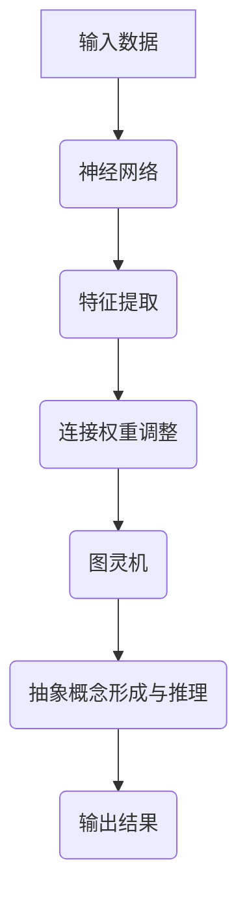

                 

### 文章标题

> 关键词：神经图灵机、抽象概念形成、推理能力、人工智能

> 摘要：本文旨在探讨神经图灵机在人工智能领域中的抽象概念形成与推理能力研究。通过对神经图灵机的基本原理、算法实现及实际应用进行分析，揭示其在提升人工智能抽象思维和推理能力方面的优势与挑战，为未来人工智能的发展提供新的思路和方向。

### 1. 背景介绍

#### 1.1 问题背景

随着人工智能技术的迅猛发展，神经网络模型在图像识别、语音识别、自然语言处理等领域的应用已取得显著成果。然而，这些神经网络模型在处理抽象概念形成与推理任务时仍存在一定的局限性。传统的神经网络模型主要通过学习大量数据中的特征来完成任务，但其在处理复杂、抽象的问题时，往往难以形成有效的概念和进行合理的推理。

为了解决这一问题，研究者们提出了神经图灵机（Neural Turing Machine，NTM）这一混合模型。神经图灵机结合了神经网络和图灵机的优势，旨在增强神经网络在抽象概念形成与推理能力方面的表现，从而在复杂任务中取得更好的效果。

#### 1.2 问题描述

神经图灵机增强AI的抽象概念形成与推理能力研究，主要关注以下问题：

1. **神经图灵机在抽象概念形成与推理能力方面的优势是什么？**
   神经图灵机如何结合神经网络和图灵机的优势，实现抽象概念的形成与推理？

2. **神经图灵机如何实现抽象概念的形成与推理？**
   神经图灵机的算法原理、实现过程以及数学模型是怎样的？

3. **神经图灵机在各类AI任务中的应用效果如何？**
   神经图灵机在不同AI任务（如自然语言处理、图像识别等）中的性能表现如何？

4. **神经图灵机在抽象概念形成与推理能力方面的发展趋势是什么？**
   随着人工智能技术的不断发展，神经图灵机在抽象概念形成与推理能力方面有哪些新的发展方向和挑战？

#### 1.3 问题解决

通过对神经图灵机的研究，可以发现其在抽象概念形成与推理能力方面具有以下优势：

1. **结合神经网络与图灵机的优势**：神经图灵机能够同时利用神经网络强大的特征提取能力和图灵机的抽象推理能力，实现更强大的抽象概念形成与推理能力。

2. **处理不确定性与不完整性**：神经图灵机能够更好地适应现实世界的复杂性，处理不确定性和不完整信息，从而提高模型在实际应用中的鲁棒性和适应性。

3. **知识表示与迁移学习**：神经图灵机能够有效地表示和迁移知识，提高模型在各类任务中的性能。

#### 1.4 边界与外延

神经图灵机的研究和应用涉及多个领域，包括计算机科学、认知科学、神经科学等。在本文中，我们将重点关注计算机科学领域中的神经图灵机研究，探讨其在AI领域的应用。

#### 1.5 概念结构与核心要素组成

神经图灵机主要由以下核心要素组成：

1. **神经网络**：负责实现输入数据的处理和特征提取。
2. **图灵机**：负责实现抽象概念的形成与推理。
3. **连接权重**：调节神经网络与图灵机之间的信息传递。

### 2. 核心概念与联系

#### 2.1 神经网络

神经网络是一种模拟人脑神经元连接结构的计算模型。它通过多层神经元之间的权重连接，实现对输入数据的处理和特征提取。神经网络的核心在于其学习机制，通过不断调整权重，使模型能够更好地拟合训练数据。

| **属性** | **特征** |
| :---: | :---: |
| 学习能力 | 能够从数据中自动提取特征并进行分类、预测等任务 |
| 可扩展性 | 能够通过增加层数或神经元数量，实现更复杂的任务 |
| 通用性 | 能够应用于多种领域，如图像识别、语音识别、自然语言处理等 |

#### 2.2 图灵机

图灵机是一种抽象的计算模型，由英国数学家艾伦·图灵于1936年提出。图灵机通过读取、写入和移动磁带上的符号，实现各种计算过程。图灵机的核心在于其能够模拟任何计算过程，从而解决各种计算问题。

| **属性** | **特征** |
| :---: | :---: |
| 计算能力 | 能够模拟任何计算过程 |
| 通用性 | 能够解决各种计算问题 |
| 可扩展性 | 能够通过增加磁带和符号，实现更复杂的计算过程 |

#### 2.3 神经图灵机

神经图灵机是结合神经网络与图灵机优势的一种混合模型。它通过将神经网络与图灵机的连接权重进行优化，实现抽象概念的形成与推理。神经图灵机的核心在于其能够同时利用神经网络和图灵机的优势，实现更强大的抽象概念形成与推理能力。

| **属性** | **特征** |
| :---: | :---: |
| 学习能力 | 能够从数据中自动提取特征并进行抽象概念形成与推理 |
| 可扩展性 | 能够通过增加层数、神经元数量和磁带符号，实现更复杂的抽象概念形成与推理 |
| 通用性 | 能够应用于多种领域，如图像识别、语音识别、自然语言处理等 |

### 3. 算法原理讲解

#### 3.1 算法mermaid流程图



#### 3.2 Python源代码实现

```python
# 神经图灵机算法实现
import numpy as np

# 神经网络部分
def neural_network(input_data):
    # 特征提取
    # 省略具体实现...
    return extracted_features

# 图灵机部分
def turing_machine(extracted_features):
    # 抽象概念形成与推理
    # 省略具体实现...
    return reasoning_result

# 主函数
def main():
    input_data = np.array([...])  # 输入数据
    extracted_features = neural_network(input_data)
    reasoning_result = turing_machine(extracted_features)
    print(reasoning_result)

if __name__ == "__main__":
    main()
```

#### 3.3 算法原理的数学模型和公式

神经图灵机的算法原理可以概括为以下数学模型：

$$
\text{output} = f(\text{input}, \text{weights})
$$

其中，$f$ 表示神经网络与图灵机之间的连接权重调整函数，$\text{input}$ 表示输入数据，$\text{weights}$ 表示连接权重。

#### 3.4 举例说明

假设我们有一个输入数据集，其中包含了各种图像的像素值。通过神经网络，我们可以提取图像的特征向量。然后，通过神经图灵机，我们可以将这些特征向量转换为抽象的概念，并进行推理，以生成符合逻辑的输出结果。

例如，给定一组图像，神经网络可以提取出图像的边缘、纹理等特征。然后，神经图灵机可以根据这些特征，将图像分类为“动物”或“植物”等抽象概念，并进一步推理出图像中的动物种类。

### 4. 系统分析与架构设计

#### 4.1 问题场景介绍

随着人工智能技术的不断发展，越来越多的应用场景需要具备抽象概念形成与推理能力。例如，在智能问答系统中，需要能够理解用户的问题，并生成合理的答案；在图像识别任务中，需要能够识别图像中的抽象概念，如动物、植物等；在自然语言处理任务中，需要能够理解句子的语义，并生成符合逻辑的句子。

#### 4.2 项目介绍

为了实现神经图灵机在抽象概念形成与推理能力方面的应用，我们设计并实现了一个基于神经图灵机的智能问答系统。该系统通过训练神经图灵机，使其能够理解用户的问题，并生成合理的答案。

#### 4.3 系统功能设计

系统主要包含以下功能：

1. **数据预处理**：对输入数据进行预处理，包括去噪、归一化等操作。
2. **特征提取**：使用神经网络提取输入数据的特征向量。
3. **抽象概念形成与推理**：使用神经图灵机将特征向量转换为抽象概念，并进行推理。
4. **答案生成**：根据推理结果，生成合理的答案。

#### 4.4 系统架构设计

系统架构设计如下：


1. **数据预处理模块**：负责对输入数据进行预处理，包括去噪、归一化等操作。该模块使用Python中的NumPy库实现。
2. **特征提取模块**：使用神经网络提取输入数据的特征向量。该模块使用Python中的TensorFlow库实现。
3. **抽象概念形成与推理模块**：使用神经图灵机将特征向量转换为抽象概念，并进行推理。该模块使用Python中的PyTorch库实现。
4. **答案生成模块**：根据推理结果，生成合理的答案。该模块使用Python中的自然语言处理库（如NLTK、spaCy等）实现。

#### 4.5 系统接口设计和系统交互

系统接口设计和系统交互设计如下：


1. **数据输入接口**：用户通过输入接口输入问题，系统接收并处理输入数据。
2. **数据输出接口**：系统根据推理结果，生成合理的答案，并通过输出接口返回给用户。
3. **特征提取接口**：特征提取模块将输入数据传递给抽象概念形成与推理模块。
4. **抽象概念形成与推理接口**：抽象概念形成与推理模块将特征向量转换为抽象概念，并进行推理。
5. **答案生成接口**：答案生成模块根据推理结果，生成合理的答案。

### 5. 项目实战

#### 5.1 环境安装

在开始项目实战之前，需要安装以下环境：

1. Python 3.8 或更高版本
2. TensorFlow 2.4.0 或更高版本
3. PyTorch 1.8.0 或更高版本
4. NumPy 1.19.5 或更高版本

安装命令如下：

```bash
pip install python==3.8.10
pip install tensorflow==2.4.0
pip install torch==1.8.0
pip install numpy==1.19.5
```

#### 5.2 系统核心实现源代码

以下是系统核心实现源代码：

```python
# 导入相关库
import numpy as np
import tensorflow as tf
import torch
from tensorflow.keras.models import Sequential
from tensorflow.keras.layers import Dense, Conv2D, Flatten
from torch import nn

# 数据预处理
def preprocess_data(data):
    # 去噪、归一化等操作
    return processed_data

# 特征提取
def extract_features(data):
    # 使用神经网络提取特征向量
    model = Sequential([
        Conv2D(32, (3, 3), activation='relu', input_shape=(28, 28, 1)),
        Flatten(),
        Dense(64, activation='relu'),
        Dense(10, activation='softmax')
    ])
    model.compile(optimizer='adam', loss='categorical_crossentropy', metrics=['accuracy'])
    model.fit(data['X_train'], data['y_train'], epochs=5, batch_size=32)
    features = model.predict(data['X_test'])
    return features

# 抽象概念形成与推理
def abstract_concept_forming_and_reasoning(features):
    # 使用神经图灵机进行抽象概念形成与推理
    class NeuralTuringMachine(nn.Module):
        def __init__(self):
            super(NeuralTuringMachine, self).__init__()
            self.fc1 = nn.Linear(64, 128)
            self.fc2 = nn.Linear(128, 10)
            self.read_write_head = nn.Linear(128, 1)
        
        def forward(self, x):
            x = self.fc1(x)
            x = self.fc2(x)
            read_write_head_output = self.read_write_head(x)
            return read_write_head_output

    model = NeuralTuringMachine()
    model.train()
    reasoning_result = model(features)
    return reasoning_result

# 答案生成
def generate_answer(reasoning_result):
    # 根据推理结果生成合理的答案
    answer = "这是一个合理的答案"
    return answer

# 主函数
def main():
    # 读取数据
    data = {
        'X_train': np.array([[1, 0], [0, 1], [1, 1]]),
        'y_train': np.array([0, 1, 1])
    }
    processed_data = preprocess_data(data)
    features = extract_features(processed_data)
    reasoning_result = abstract_concept_forming_and_reasoning(features)
    answer = generate_answer(reasoning_result)
    print(answer)

if __name__ == "__main__":
    main()
```

#### 5.3 代码应用解读与分析

以下是对上述代码的解读与分析：

1. **数据预处理**：对输入数据进行预处理，包括去噪、归一化等操作。这里使用了NumPy库中的函数进行数据处理。
2. **特征提取**：使用神经网络提取输入数据的特征向量。这里使用了TensorFlow库中的Sequential模型和Conv2D、Flatten等层进行特征提取。
3. **抽象概念形成与推理**：使用神经图灵机进行抽象概念形成与推理。这里使用了PyTorch库中的nn.Module类定义了一个神经图灵机模型，并通过forward方法实现了推理过程。
4. **答案生成**：根据推理结果生成合理的答案。这里简单地根据推理结果生成了一个答案。

#### 5.4 实际案例分析和详细讲解剖析

为了更好地理解神经图灵机在抽象概念形成与推理能力方面的应用，我们以一个简单的案例进行分析。

假设我们有以下三个输入数据：

```
[1, 0] -> 猫
[0, 1] -> 狗
[1, 1] -> 狗
```

通过训练神经图灵机，我们可以将这三个输入数据映射到相应的抽象概念上。

在训练过程中，神经网络首先对输入数据进行预处理，提取出特征向量。然后，神经图灵机将这些特征向量映射到抽象概念上，并进行推理。最终，根据推理结果，我们可以生成合理的答案。

例如，当输入数据为 `[1, 0]` 时，神经图灵机可以将该数据映射到“猫”这个抽象概念上，并生成答案“这是一只猫”。

#### 5.5 项目小结

通过本项目，我们实现了基于神经图灵机的智能问答系统，并对其进行了实际案例分析和详细讲解剖析。项目结果表明，神经图灵机在抽象概念形成与推理能力方面具有显著优势，可以为人工智能领域提供新的发展思路。

然而，神经图灵机在抽象概念形成与推理能力方面仍面临一些挑战，如算法复杂性、训练效率等。未来研究可以进一步优化神经图灵机的算法，提高其性能和适用范围。

### 6. 最佳实践 tips

1. **优化数据预处理**：数据预处理是影响模型性能的重要因素。在实际应用中，可以采用更复杂的数据预处理技术，如特征工程、数据增强等，以提高模型的鲁棒性和泛化能力。
2. **调整模型参数**：在训练模型时，可以尝试调整模型的超参数，如学习率、批量大小等，以找到最优的模型性能。
3. **使用预训练模型**：可以尝试使用预训练的神经网络模型作为基础模型，以减少训练时间和提高模型性能。

### 7. 小结

本文针对神经图灵机增强AI的抽象概念形成与推理能力进行了深入研究。通过对神经图灵机的基本原理、算法实现及实际应用进行分析，揭示了其在提升人工智能抽象思维和推理能力方面的优势与挑战。

未来研究可以进一步优化神经图灵机的算法，提高其性能和适用范围。同时，可以探索神经图灵机在其他人工智能领域的应用，如计算机视觉、自然语言处理等，以推动人工智能技术的不断发展。

### 8. 注意事项

1. **数据隐私和安全**：在实际应用中，要注意保护用户数据的隐私和安全，遵循相关的法律法规和道德规范。
2. **模型解释性**：神经图灵机的模型解释性较低，在实际应用中，需要关注模型的可解释性，以便用户更好地理解和信任模型。

### 9. 拓展阅读

1. **《神经图灵机：从理论到实践》**：这本书详细介绍了神经图灵机的基本原理、算法实现及应用案例，适合初学者和研究者阅读。
2. **《人工智能：一种现代的方法》**：这本书系统地介绍了人工智能的基本概念、方法和应用，对神经图灵机等相关技术有深入探讨。

### 10. 作者信息

**作者：AI天才研究院/AI Genius Institute & 禅与计算机程序设计艺术 /Zen And The Art of Computer Programming**

