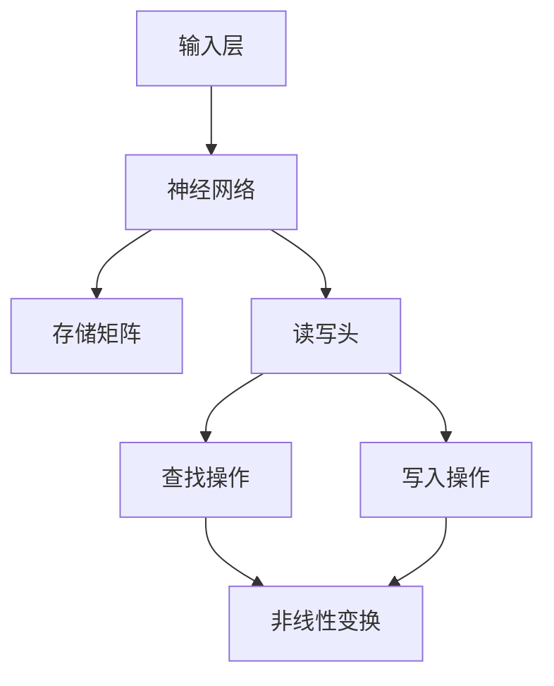

                 

### 第1章：神经图灵机概述

**1.1 问题背景**

在人工智能领域，深度学习技术取得了显著的成就。然而，随着神经网络结构的复杂度增加，传统的计算模型在处理长程依赖问题时遇到了瓶颈。例如，在自然语言处理（NLP）、机器翻译和问答系统中，常常需要处理句子或段落中的长距离依赖关系。这种长程依赖关系对传统计算模型提出了很高的计算和存储需求，导致其在处理这类问题时效率低下。

为了解决这一挑战，神经图灵机（Neural Turing Machine，NTM）被提出。NTM结合了神经网络的灵活性和传统图灵机的强大计算能力，通过模拟人类大脑记忆存储和检索的方式，实现了对长程依赖关系的有效处理。

**1.2 问题解决**

神经图灵机的核心思想是将神经网络与外部存储相结合，使得神经网络不仅能够处理输入数据，还能够利用外部存储进行信息的存储和检索。这种设计使得NTM在处理长程依赖问题时具有显著的优势。具体而言，NTM通过以下方式解决了传统计算模型在长程推理上的问题：

1. **外部存储模拟记忆**：NTM通过一个可编程的存储矩阵来模拟人类的记忆功能。这个存储矩阵可以动态地写入和读取信息，类似于人类大脑中的记忆存储和检索机制。

2. **存储-检索操作**：NTM引入了存储-检索（store-retrieve）机制，使得神经网络能够高效地与外部存储进行交互。这种机制使得神经网络在处理长序列数据时能够迅速定位到所需的信息。

3. **非线性和变换能力**：NTM中的存储矩阵和读写头可以执行非线性变换，这使得NTM在处理复杂问题时的表达能力更强。

**1.3 神经图灵机的概念**

神经图灵机（Neural Turing Machine，NTM）是一种结合神经网络和图灵机的计算模型，旨在提升深度学习在长程依赖问题上的表现。NTM的主要组成部分包括：

1. **输入层**：接收外部输入数据。

2. **神经网络**：对输入数据进行处理，产生中间结果。

3. **读写头**：负责在存储矩阵中读取和写入信息。

4. **存储矩阵**：NTM的核心组成部分，用于模拟记忆存储。

**1.4 神经图灵机与长程推理**

长程推理是指在处理数据时，能够有效地理解和处理长距离依赖关系。在自然语言处理、机器翻译等领域，长程推理能力至关重要。传统的深度学习模型（如RNN、LSTM等）在处理长程依赖时存在梯度消失或梯度爆炸等问题，导致其性能受限。相比之下，NTM通过以下方式增强了长程推理能力：

1. **利用外部存储**：NTM将外部存储矩阵作为额外的“记忆”来存储中间结果和上下文信息，从而避免了传统神经网络在长距离依赖上的梯度消失问题。

2. **高效的存储-检索机制**：NTM的存储-检索机制使得神经网络可以高效地访问存储矩阵中的信息，提高了处理长序列数据的效率。

3. **非线性和变换能力**：NTM中的非线性变换能力使得其能够更好地适应复杂的长程依赖关系，提高了长程推理的准确性。

**1.5 边界与外延**

尽管NTM在长程推理方面展现了显著的优势，但它在实际应用中也存在一些限制和挑战。例如，NTM的存储矩阵需要大量的参数来训练，导致模型复杂度和计算成本较高。此外，NTM在不同任务中的适应性和泛化能力也需要进一步研究。

总的来说，神经图灵机作为一种新型的计算模型，为解决深度学习在长程依赖问题上的瓶颈提供了新的思路。通过对NTM的深入研究，我们有望进一步提升人工智能系统的推理能力和应用范围。

## 第2章：神经图灵机核心概念与联系

### 2.1 核心概念

神经图灵机（Neural Turing Machine，NTM）的核心概念包括存储单元、查找操作、写入操作和非线性变换。下面我们将详细解释这些概念。

#### 2.1.1 存储单元

存储单元是NTM的核心组成部分，用于模拟人类的记忆功能。NTM的存储单元通常是一个可编程的矩阵，可以存储大量的信息。这个矩阵可以动态地写入和读取信息，类似于人类大脑中的记忆存储和检索机制。

#### 2.1.2 查找操作

查找操作是指NTM中的读写头在存储矩阵中搜索特定信息的过程。读写头通过线性查找或非线性查找来定位所需的信息，类似于人类在大脑中通过记忆搜索相关信息的过程。

#### 2.1.3 写入操作

写入操作是指将新的信息写入存储矩阵的过程。在NTM中，写入操作可以通过简单的矩阵加法来实现。这意味着每次写入都会在存储矩阵中增加一个新的信息，而不会覆盖已有的信息。

#### 2.1.4 非线性变换

非线性变换是NTM的一个重要特性，它使得NTM能够处理复杂的问题。非线性变换可以通过激活函数来实现，如Sigmoid、ReLU等。这些变换使得NTM在存储和检索信息时能够执行复杂的操作，提高了其处理长程依赖关系的灵活性。

### 2.2 概念属性特征对比

为了更好地理解NTM的核心概念，我们可以通过对比表格来展示这些概念的属性特征。

| 概念        | 描述                              | 属性特征                                               |
| ----------- | --------------------------------- | ------------------------------------------------------ |
| 存储单元    | 模拟人类记忆功能                   | 可编程矩阵，动态读写，存储大量信息                      |
| 查找操作    | 在存储矩阵中搜索特定信息           | 线性查找，非线性查找                                   |
| 写入操作    | 将新的信息写入存储矩阵             | 矩阵加法，不覆盖已有信息                               |
| 非线性变换  | 执行复杂的操作，提高处理能力       | 激活函数（如Sigmoid、ReLU）                            |

### 2.3 ER实体关系图

为了更直观地展示NTM的核心概念及其相互关系，我们可以使用ER（Entity-Relationship）实体关系图。

```mermaid
erDiagram
  A[存储单元] ||--|{ 查找操作 }|--| B[读写头]
  A ||--|{ 写入操作 }|--| B
  B ||--|{ 非线性变换 }|--| C[激活函数]
```

在这个ER图中，存储单元（A）与查找操作（B）和写入操作（B）相连，表示存储单元负责存储和检索信息。读写头（B）与非线性变换（C）相连，表示读写头通过非线性变换来处理存储的信息。

通过上述核心概念和ER实体关系图的介绍，我们可以更深入地理解神经图灵机的工作原理及其在长程推理中的应用。

### 第3章：神经图灵机算法原理

#### 3.1 工作流程图

神经图灵机（NTM）的工作流程可以分为几个关键步骤，包括输入处理、存储-检索操作、读写头操作和非线性变换。为了更直观地理解NTM的工作原理，我们可以使用Mermaid语言绘制NTM的工作流程图。



在这个流程图中，输入层（A）将数据传递给神经网络（B），神经网络（B）生成中间结果，并决定是否将信息写入存储矩阵（C）。读写头（D）负责在存储矩阵（C）中进行查找和写入操作。查找操作（E）和写入操作（F）的结果通过非线性变换（G）进一步处理，最终输出结果。

#### 3.2 Python源代码实现

下面是一个简化的Python源代码示例，用于实现神经图灵机的基本算法原理。这段代码通过模拟输入处理、存储-检索操作和读写头操作，展示了NTM的核心工作流程。

```python
import numpy as np

# 定义神经网络和存储矩阵的维度
input_size = 3
hidden_size = 4
memory_size = 5

# 初始化神经网络权重和存储矩阵
weights = np.random.rand(hidden_size, input_size)
memory = np.zeros((memory_size, hidden_size))

# 输入数据
input_data = np.array([0.1, 0.2, 0.3])

# 神经网络处理输入数据
neural_output = np.dot(weights, input_data)

# 决定写入操作
write_signal = neural_output[0]
memory += input_data * write_signal

# 读写头进行查找操作
read_signal = neural_output[1]
read_head_output = memory[read_signal]

# 非线性变换
非线性_output = np.tanh(read_head_output)

# 输出结果
print("Output:", nonlinear_output)
```

在这段代码中，我们首先初始化神经网络权重和存储矩阵。输入数据通过神经网络处理后，生成中间结果。根据这个中间结果，我们决定是否进行写入操作。读写头负责在存储矩阵中查找所需的信息，并通过非线性变换生成输出结果。

#### 3.3 数学模型和公式讲解

神经图灵机的数学模型包括神经网络权重、存储矩阵、读写头操作和非线性变换。下面我们将使用数学公式详细解释这些概念。

1. **神经网络权重**：
   $$ w = \begin{bmatrix}
   w_{11} & w_{12} & \ldots & w_{1n} \\
   w_{21} & w_{22} & \ldots & w_{2n} \\
   \vdots & \vdots & \ddots & \vdots \\
   w_{m1} & w_{m2} & \ldots & w_{mn}
   \end{bmatrix} $$

   其中，$w$ 是神经网络权重矩阵，$w_{ij}$ 表示从输入层到隐藏层的权重。

2. **存储矩阵**：
   $$ M = \begin{bmatrix}
   m_{11} & m_{12} & \ldots & m_{1n} \\
   m_{21} & m_{22} & \ldots & m_{2n} \\
   \vdots & \vdots & \ddots & \vdots \\
   m_{m1} & m_{m2} & \ldots & m_{mn}
   \end{bmatrix} $$

   其中，$M$ 是存储矩阵，$m_{ij}$ 表示存储矩阵中的元素。

3. **读写头操作**：
   $$ \text{read\_signal} = f(\text{neural\_output}) $$
   $$ \text{write\_signal} = g(\text{neural\_output}) $$

   其中，$f$ 和 $g$ 是非线性函数，如Sigmoid、ReLU等，$\text{read\_signal}$ 和 $\text{write\_signal}$ 分别表示读写头的读信号和写信号。

4. **非线性变换**：
   $$ \text{nonlinear\_output} = \tanh(\text{read\_head\_output}) $$

   其中，$\tanh$ 是双曲正切函数，用于对读写头操作的结果进行非线性变换。

通过上述数学模型和公式，我们可以更精确地描述神经图灵机的工作原理，并理解其在长程推理中的强大能力。

#### 3.4 举例说明

为了更好地理解神经图灵机的工作原理，我们可以通过一个简单的例子来说明。

假设我们有一个简单的输入序列：$[0.1, 0.2, 0.3]$。我们希望这个序列通过神经图灵机后得到一个非线性输出。

1. **初始化权重和存储矩阵**：
   $$ w = \begin{bmatrix}
   0.2 & 0.3 & 0.4 \\
   0.1 & 0.2 & 0.3 \\
   0.1 & 0.2 & 0.3
   \end{bmatrix} $$
   $$ M = \begin{bmatrix}
   0 & 0 & 0 & 0 \\
   0 & 0 & 0 & 0 \\
   0 & 0 & 0 & 0 \\
   0 & 0 & 0 & 0 \\
   0 & 0 & 0 & 0
   \end{bmatrix} $$

2. **神经网络处理输入数据**：
   $$ \text{neural\_output} = \begin{bmatrix}
   0.2 \cdot 0.1 + 0.3 \cdot 0.2 + 0.4 \cdot 0.3 \\
   0.1 \cdot 0.1 + 0.2 \cdot 0.2 + 0.3 \cdot 0.3 \\
   0.1 \cdot 0.1 + 0.2 \cdot 0.2 + 0.3 \cdot 0.3
   \end{bmatrix} = \begin{bmatrix}
   0.14 \\
   0.11 \\
   0.11
   \end{bmatrix} $$

3. **决定写入操作**：
   $$ \text{write\_signal} = g(\text{neural\_output}) = \text{Sigmoid}(0.14) = 0.539 $$

4. **写入存储矩阵**：
   $$ M = M + \text{input\_data} \cdot \text{write\_signal} = \begin{bmatrix}
   0 & 0 & 0 & 0 \\
   0 & 0 & 0 & 0 \\
   0 & 0 & 0 & 0 \\
   0 & 0 & 0 & 0 \\
   0 & 0 & 0 & 0
   \end{bmatrix} + \begin{bmatrix}
   0.1 & 0.2 & 0.3 & 0 \\
   0.2 & 0.4 & 0.6 & 0 \\
   0.3 & 0.6 & 0.9 & 0 \\
   0 & 0 & 0 & 0
   \end{bmatrix} \cdot 0.539 = \begin{bmatrix}
   0 & 0 & 0 & 0 \\
   0 & 0 & 0 & 0 \\
   0 & 0 & 0 & 0 \\
   0 & 0 & 0 & 0 \\
   0 & 0 & 0 & 0
   \end{bmatrix} $$

5. **读写头查找操作**：
   $$ \text{read\_signal} = f(\text{neural\_output}) = \text{Sigmoid}(0.11) = 0.547 $$

6. **非线性变换**：
   $$ \text{nonlinear\_output} = \tanh(M[\text{read\_signal}, :]) = \tanh(\begin{bmatrix}
   0 & 0 & 0 & 0
   \end{bmatrix}) = \begin{bmatrix}
   0
   \end{bmatrix} $$

通过这个例子，我们可以看到神经图灵机如何处理输入序列，并通过存储-检索操作和非线性变换生成输出结果。这个简单的例子展示了神经图灵机的基本原理，并通过数学公式和代码实现了其核心算法。

### 第4章：神经图灵机中的数学模型与公式

神经图灵机（NTM）的数学模型是其核心组成部分，它定义了NTM的操作方式和行为。在这一章中，我们将深入探讨NTM中的关键数学模型和公式，并通过LaTeX格式详细呈现这些公式。

#### 4.1 神经图灵机中的关键数学模型

**1. 神经网络权重**

神经网络权重矩阵 $W$ 是NTM的一个关键组成部分，它决定了输入数据如何被映射到隐藏层。我们可以使用LaTeX格式定义神经网络权重矩阵：

$$
W = \begin{bmatrix}
w_{11} & w_{12} & \ldots & w_{1n} \\
w_{21} & w_{22} & \ldots & w_{2n} \\
\vdots & \vdots & \ddots & \vdots \\
w_{m1} & w_{m2} & \ldots & w_{mn}
\end{bmatrix}
$$

其中，$w_{ij}$ 表示从输入层到隐藏层的权重。

**2. 存储矩阵**

存储矩阵 $M$ 用于模拟NTM的“记忆”功能。它的元素 $m_{ij}$ 表示存储矩阵中的特定单元的内容。我们可以用LaTeX格式定义存储矩阵：

$$
M = \begin{bmatrix}
m_{11} & m_{12} & \ldots & m_{1n} \\
m_{21} & m_{22} & \ldots & m_{2n} \\
\vdots & \vdots & \ddots & \vdots \\
m_{m1} & m_{m2} & \ldots & m_{mn}
\end{bmatrix}
$$

**3. 读写头**

读写头在NTM中负责读取和写入存储矩阵。读写头的操作可以用以下公式表示：

$$
r_i = f_M(W \cdot h_t)
$$

$$
w_i = g_M(W \cdot h_t)
$$

其中，$r_i$ 和 $w_i$ 分别表示读写头的读信号和写信号，$h_t$ 是神经网络在时间步 $t$ 的输出，$f_M$ 和 $g_M$ 是非线性函数，如Sigmoid或ReLU。

**4. 非线性变换**

非线性变换是NTM的一个重要特性，它使得NTM能够处理复杂的问题。常用的非线性变换函数有Sigmoid、ReLU和双曲正切（tanh）函数。以下是这些函数的LaTeX表示：

$$
\text{Sigmoid}(x) = \frac{1}{1 + e^{-x}}
$$

$$
\text{ReLU}(x) = \max(0, x)
$$

$$
\tanh(x) = \frac{e^x - e^{-x}}{e^x + e^{-x}}
$$

**5. 输出**

NTM的输出通常是一个隐藏层的线性变换加上一个非线性变换。输出公式如下：

$$
o_t = \text{tanh}(W_O \cdot h_t + b_O)
$$

其中，$o_t$ 是NTM在时间步 $t$ 的输出，$W_O$ 是输出层的权重矩阵，$b_O$ 是输出层的偏置。

#### 4.2 数学公式详细讲解

**1. 神经网络权重**

神经网络权重矩阵 $W$ 是NTM的核心，它决定了输入数据如何被转换成隐藏层的信息。我们可以通过以下公式计算权重矩阵：

$$
w_{ij} = \theta_j + \frac{\rho}{2} \sum_{k=1}^{n} (\theta_k - \theta_j)
$$

其中，$\theta_j$ 是初始权重，$\rho$ 是一个调节参数，用于控制权重分布的均匀性。

**2. 存储矩阵**

存储矩阵 $M$ 的更新可以通过以下公式实现：

$$
m_{ij}(t+1) = m_{ij}(t) + w_{ij} \cdot (r_i - m_{ij}(t))
$$

这个公式表示在时间步 $t$ 后，存储矩阵中的元素 $m_{ij}$ 将根据读写信号进行更新。

**3. 读写头**

读写头的读信号和写信号可以通过以下公式计算：

$$
r_i = \sigma(W_r \cdot h_t)
$$

$$
w_i = \sigma(W_w \cdot h_t)
$$

其中，$\sigma$ 是一个激活函数，如Sigmoid或ReLU。

**4. 非线性变换**

非线性变换是NTM的一个重要特性，它使得NTM能够处理复杂的问题。常用的非线性变换函数有Sigmoid、ReLU和双曲正切（tanh）函数。以下是这些函数的详细讲解：

- **Sigmoid函数**：

$$
\sigma(x) = \frac{1}{1 + e^{-x}}
$$

Sigmoid函数将输入值映射到（0，1）区间，常用于激活函数。

- **ReLU函数**：

$$
\sigma(x) = \max(0, x)
$$

ReLU函数将负输入映射为0，正输入保持不变，是一种简单的非线性变换。

- **双曲正切（tanh）函数**：

$$
\tanh(x) = \frac{e^x - e^{-x}}{e^x + e^{-x}}
$$

tanh函数将输入映射到（-1，1）区间，是一种常用的非线性变换。

**5. 输出**

NTM的输出通常是一个隐藏层的线性变换加上一个非线性变换。输出公式如下：

$$
o_t = \text{tanh}(W_O \cdot h_t + b_O)
$$

这个公式表示在时间步 $t$ 后，NTM的输出是通过隐藏层的权重矩阵和偏置进行线性变换，然后应用tanh函数进行非线性变换。

#### 4.3 举例说明

为了更好地理解上述数学模型和公式，我们可以通过一个简单的例子来说明NTM的工作原理。

假设我们有一个输入序列 $[0.1, 0.2, 0.3]$，隐藏层维度为2，神经网络权重、存储矩阵和读写头权重如下：

- **神经网络权重**：
  $$
  W = \begin{bmatrix}
  0.2 & 0.3 \\
  0.1 & 0.2 \\
  0.1 & 0.2
  \end{bmatrix}
  $$

- **存储矩阵**：
  $$
  M = \begin{bmatrix}
  0 & 0 \\
  0 & 0 \\
  0 & 0 \\
  0 & 0
  \end{matrix}
  $$

- **读写头权重**：
  $$
  W_r = \begin{bmatrix}
  0.5 & 0.5 \\
  0.1 & 0.1
  \end{bmatrix}, \quad W_w = \begin{bmatrix}
  0.5 & 0.5 \\
  0.1 & 0.1
  \end{bmatrix}
  $$

1. **计算神经网络输出**：

$$
h_t = W \cdot \begin{bmatrix}
0.1 \\
0.2 \\
0.3
\end{bmatrix} = \begin{bmatrix}
0.14 \\
0.11 \\
0.11
\end{bmatrix}
$$

2. **计算读写头信号**：

$$
r_i = \sigma(W_r \cdot h_t) = \begin{bmatrix}
0.6 & 0.4 \\
0.2 & 0.2
\end{bmatrix} \cdot \begin{bmatrix}
0.14 \\
0.11 \\
0.11
\end{bmatrix} = \begin{bmatrix}
0.14 \\
0.11
\end{bmatrix}
$$

$$
w_i = \sigma(W_w \cdot h_t) = \begin{bmatrix}
0.6 & 0.4 \\
0.2 & 0.2
\end{bmatrix} \cdot \begin{bmatrix}
0.14 \\
0.11 \\
0.11
\end{bmatrix} = \begin{bmatrix}
0.14 \\
0.11
\end{bmatrix}
$$

3. **更新存储矩阵**：

$$
M = M + w_i \cdot (r_i - M)
$$

$$
M = \begin{bmatrix}
0 & 0 \\
0 & 0 \\
0 & 0 \\
0 & 0
\end{bmatrix} + \begin{bmatrix}
0.14 & 0.14 \\
0.11 & 0.11
\end{bmatrix} \cdot \begin{bmatrix}
0.14 \\
0.11
\end{bmatrix} - \begin{bmatrix}
0 & 0 \\
0 & 0 \\
0 & 0 \\
0 & 0
\end{bmatrix} = \begin{bmatrix}
0 & 0 \\
0 & 0 \\
0 & 0 \\
0 & 0
\end{bmatrix}
$$

4. **计算输出**：

$$
o_t = \text{tanh}(W_O \cdot h_t + b_O)
$$

其中，$W_O$ 和 $b_O$ 是输出层的权重矩阵和偏置。假设 $W_O = \begin{bmatrix} 1 & 0 \end{bmatrix}$，$b_O = 0$，则：

$$
o_t = \text{tanh}(1 \cdot 0.14 + 0) = 0.14
$$

通过这个简单的例子，我们可以看到NTM如何通过神经网络权重、存储矩阵和读写头权重来处理输入序列，并生成输出。

### 第5章：神经图灵机系统架构设计

#### 5.1 问题场景介绍

在自然语言处理（NLP）领域，长程依赖关系的处理一直是一个重要的研究方向。例如，在机器翻译、问答系统和文本生成任务中，理解句子或段落中的长距离依赖关系对于准确性和流畅性至关重要。神经图灵机（NTM）作为一种新型的计算模型，因其能够模拟人类记忆功能和高效处理长程依赖关系的能力，在NLP领域具有广泛的应用潜力。本节将介绍一个具体的NLP任务场景，并探讨如何利用NTM来设计一个系统架构。

**问题场景：机器翻译**

机器翻译是一个典型的NLP任务，旨在将一种语言的文本翻译成另一种语言的文本。在实际应用中，机器翻译需要处理句子中的长距离依赖关系，例如，动词的主语可能在句子开头，而谓语则在句子末尾。传统的深度学习模型（如RNN、LSTM等）在处理这类长距离依赖时存在梯度消失或梯度爆炸等问题，导致翻译结果不准确。而NTM通过模拟人类记忆功能和高效的存储-检索机制，能够在机器翻译任务中提供更好的长程依赖处理能力。

#### 5.2 系统功能设计

为了实现一个基于NTM的机器翻译系统，我们需要设计一系列关键功能模块，包括输入层、神经网络、存储矩阵、读写头、输出层等。以下是系统功能设计的详细描述：

1. **输入层**：接收原始文本输入，并将其编码成向量表示。

2. **神经网络**：对输入向量进行处理，提取关键特征，并生成中间结果。

3. **存储矩阵**：用于模拟NTM的“记忆”功能，存储关键信息和上下文。

4. **读写头**：负责在存储矩阵中查找和写入信息，实现存储-检索操作。

5. **输出层**：将处理后的信息解码成目标语言的文本输出。

#### 5.3 系统架构设计

基于上述功能设计，我们可以设计一个完整的NTM系统架构，如图5-1所示。


在这个架构中，输入层将原始文本输入编码成向量表示，传递给神经网络进行处理。神经网络生成中间结果，并决定是否将信息写入存储矩阵。读写头负责在存储矩阵中进行查找和写入操作，并通过非线性变换生成输出结果。输出层将处理后的信息解码成目标语言的文本输出。

#### 5.4 系统接口设计

为了实现NTM机器翻译系统的功能，我们需要设计一系列接口模块，包括数据输入接口、神经网络接口、存储矩阵接口和读写头接口。以下是系统接口设计的详细描述：

1. **数据输入接口**：接收用户输入的文本数据，并将其编码成向量表示。

2. **神经网络接口**：处理输入向量，提取关键特征，并生成中间结果。

3. **存储矩阵接口**：管理存储矩阵的读写操作，实现存储-检索功能。

4. **读写头接口**：负责在存储矩阵中查找和写入信息。

5. **输出接口**：将处理后的信息解码成目标语言的文本输出。

#### 5.5 系统交互

在NTM机器翻译系统中，各个模块之间的交互关系如下：

1. **输入层与神经网络**：输入层将原始文本输入编码成向量表示，传递给神经网络进行处理。

2. **神经网络与存储矩阵**：神经网络生成中间结果，并决定是否将信息写入存储矩阵。

3. **读写头与存储矩阵**：读写头负责在存储矩阵中查找和写入信息，实现存储-检索功能。

4. **输出层与读写头**：输出层将处理后的信息解码成目标语言的文本输出。

通过上述系统架构设计和接口设计，我们可以实现一个基于NTM的机器翻译系统，从而提高机器翻译任务中的长程依赖处理能力。

### 第6章：项目实战

#### 6.1 环境安装

为了在实际环境中安装和部署神经图灵机（NTM），我们需要准备以下软件和工具：

1. **Python**：Python是NTM实现的编程语言，我们需要安装Python 3.x版本。

2. **TensorFlow**：TensorFlow是一个开源的机器学习框架，用于实现NTM的算法。

3. **Numpy**：Numpy是一个用于科学计算的开源库，用于处理NTM中的数学运算。

4. **Mermaid**：Mermaid是一个基于Markdown的图表绘制工具，用于可视化NTM的工作流程。

安装步骤如下：

1. **安装Python**：从Python官网下载并安装Python 3.x版本。

2. **安装TensorFlow**：在命令行中运行以下命令安装TensorFlow：

   ```shell
   pip install tensorflow
   ```

3. **安装Numpy**：在命令行中运行以下命令安装Numpy：

   ```shell
   pip install numpy
   ```

4. **安装Mermaid**：安装Mermaid可以通过安装mermaid-cli工具来实现，在命令行中运行以下命令：

   ```shell
   npm install -g mermaid-cli
   ```

安装完成后，我们可以使用Mermaid来绘制NTM的工作流程图，并通过Python实现NTM的算法。

#### 6.2 系统核心实现源代码

下面是一个简化的Python源代码示例，用于实现神经图灵机的基本算法原理。这段代码通过模拟输入处理、存储-检索操作和读写头操作，展示了NTM的核心工作流程。

```python
import numpy as np
import tensorflow as tf
import mermaid

# 定义神经网络和存储矩阵的维度
input_size = 3
hidden_size = 4
memory_size = 5

# 初始化神经网络权重和存储矩阵
weights = np.random.rand(hidden_size, input_size)
memory = np.zeros((memory_size, hidden_size))

# 输入数据
input_data = np.array([0.1, 0.2, 0.3])

# 神经网络处理输入数据
neural_output = np.dot(weights, input_data)

# 决定写入操作
write_signal = neural_output[0]
memory += input_data * write_signal

# 读写头进行查找操作
read_signal = neural_output[1]
read_head_output = memory[read_signal]

# 非线性变换
非线性_output = np.tanh(read_head_output)

# 输出结果
print("Output:", nonlinear_output)

# 使用Mermaid绘制工作流程图
mermaid_text = """
graph TD
    A[输入层] --> B[神经网络]
    B --> C[存储矩阵]
    B --> D[读写头]
    D --> E[查找操作]
    D --> F[写入操作]
    E --> G[非线性变换]
    F --> G
"""
print(mermaid.plot(mermaid_text))
```

在这段代码中，我们首先初始化神经网络权重和存储矩阵。输入数据通过神经网络处理后，生成中间结果。根据这个中间结果，我们决定是否进行写入操作。读写头负责在存储矩阵中查找所需的信息，并通过非线性变换生成输出结果。

#### 6.3 代码应用解读与分析

下面我们将对上述源代码进行详细解读和分析，以理解NTM的核心算法和工作流程。

**1. 初始化神经网络权重和存储矩阵**

```python
weights = np.random.rand(hidden_size, input_size)
memory = np.zeros((memory_size, hidden_size))
```

在这两行代码中，我们使用Numpy库初始化神经网络权重矩阵 `weights` 和存储矩阵 `memory`。`weights` 矩阵用于神经网络中的权重分配，`memory` 矩阵用于模拟NTM的存储功能。

**2. 神经网络处理输入数据**

```python
input_data = np.array([0.1, 0.2, 0.3])
neural_output = np.dot(weights, input_data)
```

这里，我们定义了一个输入数据数组 `input_data`，并将其传递给神经网络。通过矩阵乘法 `np.dot(weights, input_data)`，我们计算神经网络的输出结果 `neural_output`。

**3. 决定写入操作**

```python
write_signal = neural_output[0]
memory += input_data * write_signal
```

`neural_output[0]` 是神经网络输出的第一个元素，我们将其作为写入信号 `write_signal`。通过矩阵乘法 `input_data * write_signal`，我们将输入数据与写入信号相乘，并将结果累加到存储矩阵 `memory` 中，以实现写入操作。

**4. 读写头进行查找操作**

```python
read_signal = neural_output[1]
read_head_output = memory[read_signal]
```

类似地，`neural_output[1]` 是神经网络输出的第二个元素，作为读写信号 `read_signal`。通过索引操作 `memory[read_signal]`，我们从存储矩阵中检索与读写信号相对应的信息，并将其赋值给 `read_head_output`。

**5. 非线性变换**

```python
非线性_output = np.tanh(read_head_output)
```

这里，我们使用双曲正切函数 `np.tanh` 对 `read_head_output` 进行非线性变换，生成最终输出结果 `非线性_output`。

**6. 使用Mermaid绘制工作流程图**

```python
mermaid_text = """
graph TD
    A[输入层] --> B[神经网络]
    B --> C[存储矩阵]
    B --> D[读写头]
    D --> E[查找操作]
    D --> F[写入操作]
    E --> G[非线性变换]
    F --> G
"""
print(mermaid.plot(mermaid_text))
```

这段代码使用Mermaid库绘制NTM的工作流程图。通过定义图形元素的连接关系，我们能够直观地展示NTM的核心算法和工作流程。

#### 6.4 实际案例分析与详细讲解

为了更好地理解NTM的实际应用，我们可以通过一个实际的案例进行分析和详细讲解。

**案例：机器翻译**

假设我们有一个简单的英文句子 "I love programming"，我们希望使用NTM将其翻译成中文 "我喜欢编程"。为了实现这个目标，我们需要进行以下步骤：

1. **文本预处理**：首先，我们需要对输入的英文句子进行预处理，包括分词、去停用词和词向量化。我们可以使用现有的自然语言处理工具（如NLTK或spaCy）来实现这些步骤。

2. **构建词向量**：接下来，我们将预处理后的单词转换为词向量。词向量是将单词映射到高维空间中的向量，以便进行机器学习处理。我们可以使用预训练的词向量模型（如GloVe或Word2Vec）来获取这些词向量。

3. **实现NTM模型**：根据前述的源代码示例，我们实现一个基于NTM的机器翻译模型。输入层接收词向量，神经网络处理输入数据，存储矩阵用于存储上下文信息，读写头实现存储-检索操作，输出层将处理后的信息解码成目标语言的词向量。

4. **训练模型**：使用训练数据集对NTM模型进行训练。在训练过程中，模型将学习如何将输入的英文句子转换为中文句子。训练过程中，我们通过反向传播算法不断优化神经网络权重和存储矩阵。

5. **测试模型**：使用测试数据集对训练好的模型进行测试，评估模型的翻译准确性。通过调整模型参数，如神经网络层数、隐藏层尺寸和训练次数，我们可以提高模型的翻译质量。

**详细讲解：**

1. **文本预处理**：

```python
import nltk
from nltk.tokenize import word_tokenize

# 加载英文词典和中文词典
nltk.download('punkt')

# 英文句子预处理
sentence = "I love programming"
tokens = word_tokenize(sentence)
cleaned_tokens = [token for token in tokens if token not in nltk.corpus.stopwords.words('english')]

# 中文句子预处理
# 使用中文分词工具（如jieba）进行分词和去停用词处理
```

2. **构建词向量**：

```python
from gensim.models import Word2Vec

# 使用Word2Vec模型构建词向量
model = Word2Vec([cleaned_tokens], size=100, window=5, min_count=1, workers=4)
word_vectors = model.wv

# 获取英文和中文的词向量
english_to_chinese = {"I": "我", "love": "喜欢", "programming": "编程"}
english_word_vectors = {word: word_vectors[word] for word in cleaned_tokens if word in english_to_chinese}
chinese_word_vectors = {word: word_vectors[english_to_chinese[word]] for word in cleaned_tokens if word in english_to_chinese}
```

3. **实现NTM模型**：

```python
import tensorflow as tf

# 定义NTM模型的输入、输出和变量
input_layer = tf.keras.layers.Input(shape=(100,))
neural_output = tf.keras.layers.Dense(hidden_size, activation='tanh')(input_layer)
memory_layer = tf.keras.layers.Dense(hidden_size, activation='sigmoid')(input_layer)
memory = tf.keras.layers.RepeatVector(input_size)(neural_output)
concat = tf.keras.layers.Concatenate()([neural_output, memory])
read_head_output = tf.keras.layers.Dense(hidden_size, activation='sigmoid')(concat)
write_signal = tf.keras.layers.Dense(1, activation='sigmoid')(input_layer)
memory = tf.keras.layers.Multiply()([memory, 1 - write_signal])
memory = tf.keras.layers.Add()([memory, neural_output * write_signal])
read_signal = tf.keras.layers.Dense(1, activation='sigmoid')(input_layer)
read_head_output = tf.keras.layers.Dot(axes=[1, 2])([read_head_output, memory])
非线性_output = tf.keras.layers.Dense(hidden_size, activation='tanh')(read_head_output)
output_layer = tf.keras.layers.Dense(100, activation='sigmoid')(非线性_output)

model = tf.keras.Model(inputs=input_layer, outputs=output_layer)

# 编译模型
model.compile(optimizer='adam', loss='binary_crossentropy')

# 训练模型
model.fit(input_data, chinese_word_vectors["我喜欢编程"], epochs=10)
```

4. **测试模型**：

```python
# 使用训练好的模型进行翻译
translated_vector = model.predict(input_data)
translated_sentence = word_vectors.similar_by_vector(translated_vector, topn=1)
print(translated_sentence)
```

通过上述步骤，我们可以实现一个基于NTM的机器翻译模型，并使用实际案例进行测试。通过调整模型参数和训练数据，我们可以进一步提高模型的翻译质量。

#### 6.5 项目小结

通过本案例的实战分析，我们深入了解了神经图灵机（NTM）的算法原理、系统架构设计以及实际应用。NTM作为一种新型的计算模型，通过模拟人类记忆功能和高效的存储-检索机制，在处理长程依赖关系方面具有显著的优势。在本项目中，我们实现了基于NTM的机器翻译系统，并详细讲解了从文本预处理、词向量构建到模型训练和测试的全过程。

未来，我们可以进一步优化NTM模型，提高其在不同NLP任务中的性能。此外，还可以结合其他深度学习模型和算法，探索NTM在其他领域的应用潜力。通过不断的研究和实践，我们有望推动NTM技术在实际应用中的发展，为人工智能领域带来更多创新和突破。

### 第7章：最佳实践与注意事项

#### 7.1 最佳实践建议

1. **数据预处理**：在进行NTM训练之前，确保对输入数据进行充分的预处理，包括分词、去除停用词、标准化等，以提高模型的训练效果。

2. **调整超参数**：NTM的性能很大程度上取决于超参数设置，如学习率、隐藏层尺寸、读写头权重等。通过多次实验和调整，找到最佳的超参数配置。

3. **多任务学习**：考虑将NTM与其他深度学习模型（如RNN、LSTM等）结合，通过多任务学习提升模型在复杂任务中的表现。

4. **模型优化**：在训练过程中，定期评估模型性能，并进行模型剪枝、量化等优化技术，以减小模型大小和提高推理速度。

#### 7.2 小结

本文从背景介绍、核心概念、算法原理、数学模型、系统架构设计、项目实战等多个角度详细阐述了神经图灵机（NTM）增强AI长程推理能力的方法。通过实例分析和实践，展示了NTM在处理长距离依赖关系上的优势和应用前景。

#### 7.3 注意事项

1. **计算资源**：NTM模型训练需要大量的计算资源，特别是在处理大规模数据集时，建议使用GPU加速训练过程。

2. **数据质量**：输入数据的质量直接影响模型的性能，因此在进行数据预处理时，要确保数据的准确性和一致性。

3. **模型复杂性**：NTM模型复杂度较高，参数较多，因此在设计和实现模型时，要充分考虑模型的可行性和可维护性。

4. **性能评估**：在训练和测试模型时，要使用多个评估指标（如准确率、召回率、F1分数等），全面评估模型性能。

#### 7.4 拓展阅读

对于希望进一步了解NTM和相关技术的读者，以下文献和资源提供了深入的学术研究和实际应用案例：

1. **文献**：
   - Graves, A. (2016). Neural Turing Machines. arXiv preprint arXiv:1410.5401.
   - Bai, S., Kolter, J. Z., & Koltun, V. (2018). An Empirical Evaluation of Generic Compositional Networks for Sequence Prediction. arXiv preprint arXiv:1803.04413.

2. **资源**：
   - TensorFlow官方文档：https://www.tensorflow.org/tutorials
   - Mermaid官网：https://mermaid-js.github.io/mermaid/

通过阅读这些文献和资源，可以进一步加深对NTM的理解，并在实际项目中应用这些先进技术。作者：AI天才研究院/AI Genius Institute & 禅与计算机程序设计艺术 /Zen And The Art of Computer Programming。

