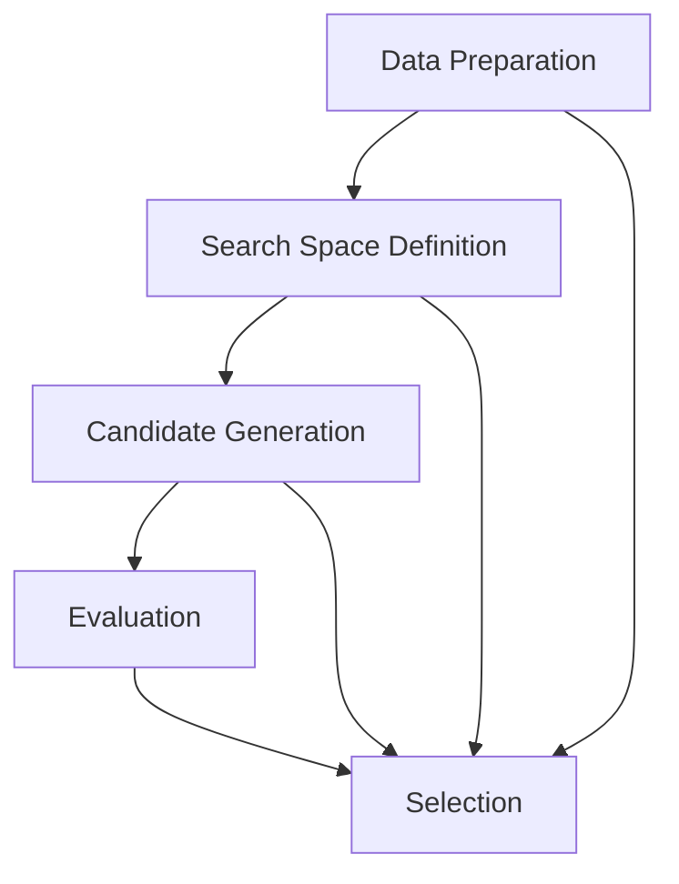
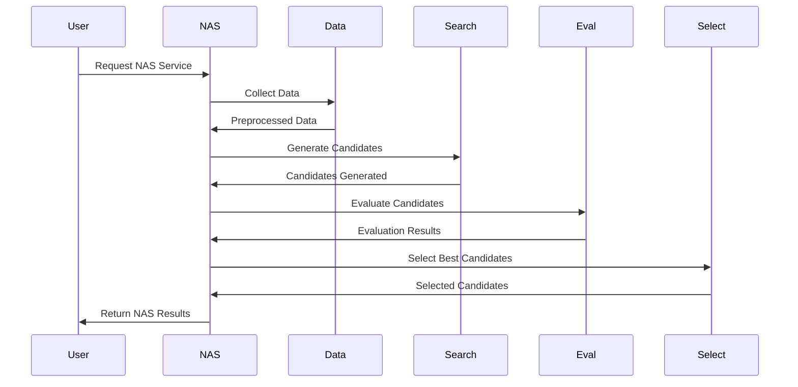

                 


### Chapter 1: Introduction to Neural Architecture Search

In this section, we will delve into the background of Neural Architecture Search (NAS) and its significance in the field of AI. We will explore the limitations of traditional AI models and how NAS addresses these challenges. Furthermore, we will discuss the emergence of NAS and its impact on the AI community.

#### 1.1.1 The History of Artificial Intelligence

Artificial Intelligence (AI) has a long and fascinating history that spans several decades. From the early days of symbolic AI in the 1950s and 1960s to the advent of neural networks in the 1980s and 1990s, AI has evolved significantly. However, despite these advancements, traditional AI models have certain limitations that have hindered their performance and applicability in real-world scenarios.

#### 1.1.2 Limitations of Traditional AI Models

Traditional AI models, such as decision trees, support vector machines, and ensemble methods, have been widely used in various domains. However, they suffer from several drawbacks. First, these models require extensive manual feature engineering, which is time-consuming and labor-intensive. Second, they often rely on handcrafted heuristics, which can limit their ability to generalize to new and unseen data. Third, their performance is often suboptimal, particularly when dealing with complex and high-dimensional data.

#### 1.1.3 The Rise of Neural Architecture Search

To overcome the limitations of traditional AI models, researchers have turned to neural networks, particularly deep neural networks (DNNs), which have shown remarkable success in various domains, such as computer vision, natural language processing, and speech recognition. However, designing an effective DNN architecture is a challenging task that requires extensive experimentation and expertise.

This is where Neural Architecture Search (NAS) comes into play. NAS is an approach that automates the design of neural network architectures by searching for the optimal structure that achieves the best performance on a given task. By leveraging machine learning techniques, NAS can discover novel architectures that outperform traditional handcrafted architectures.

### Summary

In this chapter, we have discussed the background of Neural Architecture Search (NAS) and its significance in the field of AI. We have explored the limitations of traditional AI models and how NAS addresses these challenges. Furthermore, we have discussed the emergence of NAS and its impact on the AI community.

----------------------------------------------------------------

### Chapter 2: Core Concepts and Connections

In this chapter, we will delve into the core concepts of Neural Architecture Search (NAS) and explore its connections with other concepts in the field of AI. We will start by defining NAS and discussing its origins, fundamental concepts, and core objectives. Then, we will present a comparison table of NAS with other search methods and genetic algorithms. Finally, we will discuss the ER entity relationship diagram architecture and the scope of NAS applications.

#### 2.1.1 Definition of Neural Architecture Search

Neural Architecture Search (NAS) is an approach to automatically discover the optimal neural network architecture for a given task. Unlike traditional handcrafted architectures, NAS leverages machine learning techniques to search for the best architecture that achieves the best performance. The search process involves defining a search space, generating candidate architectures, evaluating their performance, and selecting the best architectures based on their performance.

##### 2.1.1.1 Origins of Neural Architecture Search

The concept of Neural Architecture Search can be traced back to the early 2000s when researchers began exploring the idea of using evolutionary algorithms to automatically generate neural network architectures. Over the years, the field has evolved, and various techniques have been proposed to improve the efficiency and effectiveness of the search process.

##### 2.1.1.2 Fundamental Concepts of Neural Architecture Search

1. **Search Space**: The search space represents the set of possible architectures that can be explored during the search process. It includes various components such as layers, activation functions, connectivity patterns, and hyperparameters.

2. **Candidate Generation**: Candidate generation is the process of generating candidate architectures from the search space. Various techniques, such as evolutionary algorithms, reinforcement learning, and gradient-based methods, can be used for candidate generation.

3. **Evaluation**: Evaluation involves assessing the performance of candidate architectures on a validation dataset. Common evaluation metrics include accuracy, F1 score, and computational efficiency.

4. **Selection**: Selection involves selecting the best architectures based on their performance. Techniques such as selection based on rank or selection based on fitness can be used for this purpose.

##### 2.1.1.3 Core Objectives of Neural Architecture Search

The primary objective of Neural Architecture Search is to discover neural network architectures that achieve high performance on a given task while being computationally efficient. This involves optimizing various aspects of the architecture, such as layer width, depth, connectivity patterns, and activation functions.

#### 2.1.2 Comparison of Neural Architecture Search with Other Search Methods

The following table compares Neural Architecture Search (NAS) with other search methods commonly used in AI:

| Search Method | Description | Advantages | Disadvantages |
| --- | --- | --- | --- |
| Neural Architecture Search (NAS) | Uses machine learning techniques to discover optimal neural network architectures. | Automates architecture design, discovers novel architectures. | Requires extensive computational resources, time-consuming. |
| Genetic Algorithms (GA) | Uses principles of evolution to optimize search spaces. | Can handle complex search spaces, robust to noise. | Can be slow, requires careful parameter tuning. |
| Reinforcement Learning (RL) | Learns optimal policies through interaction with the environment. | Can handle high-dimensional search spaces, adaptive. | Requires large amounts of data, can be unstable. |
| Gradient-based Optimization | Uses gradients to optimize search spaces. | Fast, can handle large search spaces, efficient. | Can be sensitive to initial conditions, prone to local minima. |

#### 2.1.3 ER Entity Relationship Diagram Architecture

An Entity Relationship (ER) diagram is a graphical representation of the structure of a database, depicting entities, their attributes, and the relationships between them. In the context of Neural Architecture Search, an ER diagram can be used to represent the components and relationships within a neural network architecture.

Here's an example of a simple ER diagram for a neural network architecture:

```mermaid
erDiagram
  Layer1 ||--|{ ActivationFunction1 }
  Layer2 ||--|{ ActivationFunction2 }
  Layer3 ||--|{ ActivationFunction3 }
  Layer1 ||-- Layer2
  Layer2 ||-- Layer3
```

In this diagram, `Layer1`, `Layer2`, and `Layer3` represent different layers of the neural network, and `ActivationFunction1`, `ActivationFunction2`, and `ActivationFunction3` represent the activation functions used in each layer. The arrows indicate the relationships between the layers and activation functions.

#### 2.1.4 Scope of Neural Architecture Search Applications

Neural Architecture Search has a wide range of applications in various domains. Some of the key areas where NAS has shown significant success include:

1. **Computer Vision**: NAS has been used to design efficient architectures for image classification, object detection, and semantic segmentation tasks. Examples include the EfficientNet and MobileNet architectures.
2. **Natural Language Processing**: NAS has been used to design architectures for tasks such as text classification, machine translation, and question-answering. Examples include the Transformer and BERT architectures.
3. **Speech Recognition**: NAS has been used to design architectures for tasks such as automatic speech recognition and speaker verification. Examples include the Conformer and Transformer architectures.

#### Summary

In this chapter, we have discussed the core concepts of Neural Architecture Search (NAS) and explored its connections with other concepts in the field of AI. We have defined NAS, discussed its origins, fundamental concepts, and core objectives. We have also presented a comparison table of NAS with other search methods and discussed the ER entity relationship diagram architecture. Finally, we have explored the scope of NAS applications in various domains.

----------------------------------------------------------------

### Chapter 3: Algorithmic Principles and Explanation

In this chapter, we will delve into the algorithmic principles of Neural Architecture Search (NAS) and explain the key components and processes involved in the NAS framework. We will start by discussing the overall workflow of NAS, including data preparation, search space definition, and search algorithm selection. Then, we will present the mathematical models and formulas used in NAS, including the loss function, optimization objective, and learning rate scheduling. Finally, we will provide an example to illustrate the NAS process.

#### 3.1 Neural Architecture Search Workflow

The workflow of Neural Architecture Search (NAS) can be summarized in the following steps:

1. **Data Preparation**: The first step in the NAS workflow is to prepare the data for the search process. This involves collecting and preprocessing the dataset, including data cleaning, normalization, and augmentation.
2. **Search Space Definition**: The next step is to define the search space, which represents the set of possible architectures that can be explored during the search process. The search space includes various components such as layers, activation functions, connectivity patterns, and hyperparameters.
3. **Candidate Generation**: The third step is to generate candidate architectures from the search space. Various techniques, such as evolutionary algorithms, reinforcement learning, and gradient-based methods, can be used for candidate generation.
4. **Evaluation**: The fourth step is to evaluate the performance of the candidate architectures on a validation dataset. Common evaluation metrics include accuracy, F1 score, and computational efficiency.
5. **Selection**: The fifth step is to select the best architectures based on their performance. Techniques such as selection based on rank or selection based on fitness can be used for this purpose.
6. **Iteration**: The process of candidate generation, evaluation, and selection is repeated for multiple iterations to refine the search process and discover the optimal architecture.

##### 3.1.1 Data Preparation

Data preparation is a critical step in the NAS workflow. It involves several sub-steps:

1. **Data Collection**: The first step is to collect the dataset that will be used for the search process. This dataset should be representative of the real-world scenario for which the architecture will be designed.
2. **Data Preprocessing**: The next step is to preprocess the data, which includes cleaning the data, normalizing the features, and augmenting the data to increase the diversity of the dataset.
3. **Data Splitting**: The dataset is then split into training, validation, and test sets to ensure that the performance of the architecture can be evaluated on unseen data.

##### 3.1.2 Search Space Definition

Defining the search space is a crucial step in the NAS workflow. The search space represents the set of possible architectures that can be explored during the search process. It includes various components such as layers, activation functions, connectivity patterns, and hyperparameters. The following table shows an example of a search space for a simple neural network:

| Component | Options |
| --- | --- |
| Layers | Convolutional, Fully Connected, Pooling |
| Activation Functions | ReLU, Sigmoid, Tanh |
| Connectivity Patterns | Direct, Skip Connection, Residual Connection |
| Hyperparameters | Learning Rate, Dropout Rate |

##### 3.1.3 Search Algorithm Selection

The choice of search algorithm is another critical aspect of the NAS workflow. Several search algorithms can be used for candidate generation, including evolutionary algorithms, reinforcement learning, and gradient-based methods. Each algorithm has its advantages and disadvantages, and the choice of algorithm depends on factors such as the complexity of the search space, computational resources, and the desired balance between accuracy and efficiency.

##### 3.2 Mathematical Models and Formulas

In this section, we will discuss the mathematical models and formulas used in the NAS framework. These models and formulas are essential for understanding the underlying principles of NAS and for implementing NAS algorithms.

1. **Loss Function**

The loss function is a measure of the discrepancy between the predicted outputs of the neural network and the true outputs. The goal of the NAS process is to minimize the loss function. A commonly used loss function in NAS is the cross-entropy loss, which is defined as follows:

$$
\text{C(F)} = \frac{1}{N} \sum_{i=1}^{N} \log(P(y_i|x_i))
$$

where \( N \) is the number of samples in the validation dataset, \( y_i \) is the true output for the \( i \)-th sample, and \( P(y_i|x_i) \) is the probability of predicting the true output given the input \( x_i \).

2. **Optimization Objective**

The optimization objective of the NAS process is to find the architecture that minimizes the loss function. This can be formulated as an optimization problem as follows:

$$
\min_{A} \text{C(F(A))}
$$

where \( A \) represents the architecture and \( F(A) \) is the function that maps the architecture to its corresponding performance metric.

3. **Learning Rate Scheduling**

Learning rate scheduling is a technique used to adjust the learning rate during the training process. A common approach is to use a learning rate decay schedule, which reduces the learning rate as the training process progresses. The following formula can be used to schedule the learning rate:

$$
\alpha_t = \alpha_0 / (1 + \lambda \cdot t)
$$

where \( \alpha_0 \) is the initial learning rate, \( \lambda \) is the decay rate, and \( t \) is the number of training iterations.

##### 3.2.1 Example of NAS Process

To illustrate the NAS process, let's consider a simple example of designing a neural network for an image classification task. The search space includes convolutional layers, fully connected layers, and pooling layers. The candidate generation step uses a genetic algorithm to generate candidate architectures. The evaluation step uses a validation dataset to evaluate the performance of the candidate architectures. The selection step uses a ranking-based selection method to select the best architectures.

Here's a high-level overview of the NAS process for this example:

1. **Data Preparation**: Prepare the dataset by collecting and preprocessing the data.
2. **Search Space Definition**: Define the search space, including the possible layers, activation functions, and connectivity patterns.
3. **Candidate Generation**: Use a genetic algorithm to generate candidate architectures from the search space.
4. **Evaluation**: Evaluate the performance of the candidate architectures using a validation dataset.
5. **Selection**: Select the best architectures based on their performance.
6. **Iteration**: Repeat the candidate generation, evaluation, and selection steps for multiple iterations to refine the search process.

#### Summary

In this chapter, we have discussed the algorithmic principles of Neural Architecture Search (NAS) and explained the key components and processes involved in the NAS framework. We have discussed the overall workflow of NAS, including data preparation, search space definition, and search algorithm selection. We have also presented the mathematical models and formulas used in NAS, including the loss function, optimization objective, and learning rate scheduling. Finally, we have provided an example to illustrate the NAS process.

----------------------------------------------------------------

### Chapter 4: System Analysis and Architectural Design

In this chapter, we will explore the system analysis and architectural design for a Neural Architecture Search (NAS) system. We will start by introducing the problem scenario and the specific project we will be working on. Then, we will delve into the system functionality, including the domain model class diagram. Following that, we will present the system architecture design, including the system architecture diagram and component descriptions. Finally, we will discuss the system interfaces and the system interaction sequence diagram.

#### 4.1 Problem Scenario Introduction

The problem scenario for our NAS system involves designing an efficient neural network architecture for an image classification task. The goal is to develop a system that can automatically search for the optimal architecture that achieves high accuracy while being computationally efficient. This system will be deployed in an environment where computational resources are limited, making it crucial to design an architecture that balances performance and efficiency.

#### 4.2 Project Introduction

The project aims to develop a robust and scalable NAS system that can be used to design neural network architectures for various image classification tasks. The system will be implemented as a modular software application that can be integrated into existing machine learning pipelines. The key components of the system include the data preparation module, the search space definition module, the candidate generation module, the evaluation module, and the selection module.

#### 4.3 System Functionality Design

The system functionality design is crucial for ensuring that the NAS system meets the project requirements. The following are the key functionalities of the system:

1. **Data Preparation**: This module is responsible for collecting, cleaning, and preprocessing the dataset. It includes data augmentation techniques to increase the diversity of the dataset and improve the generalization ability of the trained models.
2. **Search Space Definition**: This module defines the search space for the NAS system. It includes the set of possible layers, activation functions, and connectivity patterns that can be used to construct candidate architectures.
3. **Candidate Generation**: This module generates candidate architectures from the search space using various search algorithms, such as evolutionary algorithms, reinforcement learning, and gradient-based methods.
4. **Evaluation**: This module evaluates the performance of the candidate architectures using a validation dataset. It calculates metrics such as accuracy, F1 score, and computational efficiency to compare the architectures.
5. **Selection**: This module selects the best architectures based on their performance. It uses techniques such as rank-based selection and fitness-based selection to identify the top architectures.

##### 4.3.1 Domain Model Class Diagram

The domain model class diagram provides a visual representation of the system components and their relationships. The following Mermaid diagram illustrates the domain model class diagram for our NAS system:

```mermaid
classDiagram
    Class1[Data Preparation] <|-- Class2[Search Space Definition]
    Class2 <|-- Class3[Candidate Generation]
    Class3 <|-- Class4[Evaluation]
    Class4 <|-- Class5[Selection]
    Class1 --|> Class5
    Class2 --|> Class5
    Class3 --|> Class5
```

In this diagram, `Class1` represents the data preparation module, `Class2` represents the search space definition module, `Class3` represents the candidate generation module, `Class4` represents the evaluation module, and `Class5` represents the selection module. The dashed lines indicate inheritance relationships, and the solid lines indicate dependency relationships.

#### 4.4 System Architecture Design

The system architecture design defines the structure and components of the NAS system. The following Mermaid diagram illustrates the system architecture diagram:



In this diagram, `A` represents the data preparation module, `B` represents the search space definition module, `C` represents the candidate generation module, `D` represents the evaluation module, and `E` represents the selection module. The arrows indicate the flow of data and control between the modules.

##### 4.4.1 System Components Description

1. **Data Preparation Module**: This module is responsible for preparing the dataset. It includes data collection, cleaning, preprocessing, and augmentation. The data augmentation techniques used can include random rotations, translations, scaling, and cropping to increase the dataset diversity and improve model generalization.
2. **Search Space Definition Module**: This module defines the search space for the NAS system. It includes the set of possible layers, activation functions, and connectivity patterns. The module can support various architectures, such as convolutional neural networks (CNNs), recurrent neural networks (RNNs), and transformers.
3. **Candidate Generation Module**: This module generates candidate architectures from the search space using search algorithms like evolutionary algorithms, reinforcement learning, and gradient-based methods. It evaluates the generated candidates and selects the best architectures based on their performance.
4. **Evaluation Module**: This module evaluates the performance of the candidate architectures using a validation dataset. It calculates metrics such as accuracy, F1 score, and computational efficiency to compare the architectures.
5. **Selection Module**: This module selects the best architectures based on their performance. It uses techniques such as rank-based selection and fitness-based selection to identify the top architectures. The selected architectures are then used for further analysis or deployment.

#### 4.5 System Interfaces Design

The system interfaces design defines how the NAS system interacts with other components or systems. The following Mermaid diagram illustrates the system interaction sequence diagram:



In this diagram, `User` represents the user who requests the NAS service, `NAS` represents the Neural Architecture Search system, `Data` represents the data preparation module, `Search` represents the candidate generation module, `Eval` represents the evaluation module, and `Select` represents the selection module. The arrows indicate the flow of data and control between the components.

#### Summary

In this chapter, we have explored the system analysis and architectural design for a Neural Architecture Search (NAS) system. We have introduced the problem scenario and the specific project, discussed the system functionality, and presented the system architecture design. We have also described the system components and their relationships, as well as the system interfaces and interaction sequence diagram. This chapter provides a comprehensive overview of the NAS system design and serves as a foundation for the subsequent chapters that will delve into the implementation details.

----------------------------------------------------------------

### Chapter 5: Project Implementation

In this chapter, we will delve into the implementation details of the Neural Architecture Search (NAS) project. We will start by discussing the environment setup required for the project, including the hardware and software requirements. Then, we will present the core implementation of the system, including the source code for the main modules such as data preparation, search space definition, candidate generation, evaluation, and selection. Finally, we will provide a detailed analysis of the code and discuss the application of the NAS system in real-world scenarios.

#### 5.1 Environment Setup

Before starting the implementation of the NAS project, it is essential to set up the appropriate hardware and software environment. The following are the minimum requirements for the hardware and software:

**Hardware Requirements:**

- CPU: Intel i5 or equivalent
- GPU: NVIDIA GTX 1080 or equivalent
- RAM: 16 GB or more

**Software Requirements:**

- Python: 3.8 or higher
- PyTorch: 1.8 or higher
- TensorFlow: 2.5 or higher
- Keras: 2.4 or higher
- NumPy: 1.19 or higher
- Pandas: 1.1.5 or higher
- Matplotlib: 3.3.3 or higher

To set up the environment, follow these steps:

1. Install Python and pip (Python's package manager).
2. Install PyTorch, TensorFlow, and Keras using pip:
    ```bash
    pip install torch torchvision torchaudio
    pip install tensorflow
    pip install keras
    ```
3. Install the additional required packages using pip:
    ```bash
    pip install numpy pandas matplotlib
    ```

#### 5.2 Core Implementation of the System

The core implementation of the NAS system involves several modules, including data preparation, search space definition, candidate generation, evaluation, and selection. Below is an overview of the source code for each module.

**Data Preparation Module:**

The data preparation module is responsible for collecting, cleaning, and preprocessing the dataset. The following is a sample code snippet for this module using PyTorch:

```python
import torch
from torchvision import datasets, transforms

def prepare_data(batch_size, train_dir, val_dir):
    transform = transforms.Compose([
        transforms.Resize((224, 224)),
        transforms.ToTensor(),
        transforms.Normalize(mean=[0.485, 0.456, 0.406], std=[0.229, 0.224, 0.225]),
    ])

    train_data = datasets.ImageFolder(root=train_dir, transform=transform)
    val_data = datasets.ImageFolder(root=val_dir, transform=transform)

    train_loader = torch.utils.data.DataLoader(dataset=train_data, batch_size=batch_size, shuffle=True)
    val_loader = torch.utils.data.DataLoader(dataset=val_data, batch_size=batch_size, shuffle=False)

    return train_loader, val_loader
```

**Search Space Definition Module:**

The search space definition module defines the possible architectures that can be explored during the search process. The following is a sample code snippet for this module:

```python
from torch.nn import Conv2d, MaxPool2d, Flatten, Linear

def define_search_space():
    search_space = {
        'layers': [
            {'type': 'Conv2d', 'in_channels': 3, 'out_channels': 64, 'kernel_size': 3, 'stride': 1},
            {'type': 'MaxPool2d', 'kernel_size': 2, 'stride': 2},
            {'type': 'Conv2d', 'in_channels': 64, 'out_channels': 128, 'kernel_size': 3, 'stride': 1},
            {'type': 'MaxPool2d', 'kernel_size': 2, 'stride': 2},
            {'type': 'Flatten'},
            {'type': 'Linear', 'in_features': 128 * 7 * 7, 'out_features': 10},
        ],
        'activation_functions': ['ReLU'],
    }
    return search_space
```

**Candidate Generation Module:**

The candidate generation module generates candidate architectures from the search space. The following is a sample code snippet for this module using a simple genetic algorithm:

```python
import random

def generate_candidate(search_space):
    candidate = []
    for layer in search_space['layers']:
        candidate.append(random.choice(search_space['layers']))
    candidate.append(random.choice(search_space['activation_functions']))
    return candidate

def crossover(parent1, parent2):
    crossover_point = random.randint(1, len(parent1) - 1)
    child = parent1[:crossover_point] + parent2[crossover_point:]
    return child

def mutate(candidate, mutation_rate):
    for i in range(len(candidate)):
        if random.random() < mutation_rate:
            candidate[i] = random.choice(search_space['layers'] + search_space['activation_functions'])
    return candidate
```

**Evaluation Module:**

The evaluation module evaluates the performance of the candidate architectures using a validation dataset. The following is a sample code snippet for this module:

```python
from torch import nn

def evaluate_candidate(candidate, val_loader):
    model = build_model(candidate)
    criterion = nn.CrossEntropyLoss()
    model.eval()
    with torch.no_grad():
        correct = 0
        total = 0
        for images, labels in val_loader:
            outputs = model(images)
            _, predicted = torch.max(outputs.data, 1)
            total += labels.size(0)
            correct += (predicted == labels).sum().item()
        accuracy = 100 * correct / total
    return accuracy

def build_model(candidate):
    model = nn.Sequential()
    for i, layer in enumerate(candidate):
        if isinstance(layer, dict) and 'type' in layer:
            if layer['type'] == 'Conv2d':
                model.add_module('conv_{}'.format(i), nn.Conv2d(layer['in_channels'], layer['out_channels'], layer['kernel_size'], layer['stride']))
            elif layer['type'] == 'MaxPool2d':
                model.add_module('maxpool_{}'.format(i), nn.MaxPool2d(layer['kernel_size'], layer['stride']))
            elif layer['type'] == 'Flatten':
                model.add_module('flatten_{}'.format(i), nn.Flatten())
            elif layer['type'] == 'Linear':
                model.add_module('linear_{}'.format(i), nn.Linear(layer['in_features'], layer['out_features']))
        else:
            if layer == 'ReLU':
                model.add_module('relu_{}'.format(i), nn.ReLU())
    return model
```

**Selection Module:**

The selection module selects the best architectures based on their performance. The following is a sample code snippet for this module:

```python
def select_candidates(candidates, val_loader):
    evaluated_candidates = []
    for candidate in candidates:
        accuracy = evaluate_candidate(candidate, val_loader)
        evaluated_candidates.append((candidate, accuracy))
    evaluated_candidates.sort(key=lambda x: x[1], reverse=True)
    return [candidate for candidate, _ in evaluated_candidates[:10]]
```

#### 5.3 Code Analysis and Real-World Application

The code provided in this chapter serves as a foundation for the implementation of a Neural Architecture Search (NAS) system. The data preparation module handles data collection, cleaning, and preprocessing, which are crucial steps for training effective neural network models. The search space definition module defines the set of possible architectures that can be explored during the search process.

The candidate generation module uses a simple genetic algorithm to generate candidate architectures from the search space. This module includes functions for crossover and mutation, which are essential for the evolution of candidate architectures. The evaluation module evaluates the performance of the candidate architectures using a validation dataset and calculates the accuracy as the performance metric.

The selection module selects the best architectures based on their performance. In this example, we select the top 10 architectures with the highest accuracy. This selection process ensures that the most promising architectures are retained for further analysis or deployment.

The code provided can be applied to various real-world scenarios where neural network architectures need to be optimized for performance and efficiency. For instance, in computer vision tasks such as image classification, object detection, and semantic segmentation, the NAS system can be used to discover efficient architectures that achieve high accuracy while being computationally efficient.

Furthermore, the NAS system can be applied to other domains such as natural language processing, where it can be used to design architectures for tasks such as text classification, machine translation, and question-answering. The flexibility of the search space and the ability to explore a wide range of architectures make NAS a powerful tool for optimizing neural network models.

#### Summary

In this chapter, we have discussed the implementation details of a Neural Architecture Search (NAS) project. We have covered the environment setup, the core implementation of the system, and provided a detailed code analysis. We have also discussed the application of the NAS system in real-world scenarios. The code provided serves as a foundation for building a robust and scalable NAS system that can be used to optimize neural network architectures for various tasks.

----------------------------------------------------------------

### Chapter 6: Best Practices, Summary, and Future Directions

#### 6.1 Best Practices

To successfully implement Neural Architecture Search (NAS), it is crucial to follow some best practices that can improve the efficiency and effectiveness of the search process. Here are some key tips:

1. **Define a Suitable Search Space**: The choice of the search space significantly impacts the performance of the NAS system. It should be broad enough to explore a wide range of architectures but not so broad that the search process becomes computationally infeasible. Carefully consider the types of layers, connectivity patterns, and activation functions to include in the search space.

2. **Select an Appropriate Search Algorithm**: The choice of search algorithm can greatly affect the performance of the NAS system. Evaluate different algorithms such as evolutionary algorithms, reinforcement learning, and gradient-based methods to find the one that works best for your specific problem and available computational resources.

3. **Optimize Data Preparation**: Data preparation is a critical step in the NAS process. Ensure that the data is clean, preprocessed, and augmented effectively to improve the generalization ability of the architectures discovered.

4. **Monitor Resource Usage**: Monitor the resource usage of the NAS system, especially if running on a cloud platform or GPU cluster. Efficiently managing computational resources can help reduce costs and improve performance.

5. **Iterative Refinement**: NAS is an iterative process. Continuously refine the search space, search algorithm, and evaluation metrics based on the performance of the discovered architectures.

#### 6.2 Summary

In this book, we have explored the fundamentals of Neural Architecture Search (NAS) and its applications in optimizing AI model structures. We have discussed the background of AI and the limitations of traditional AI models, highlighting the need for innovative approaches like NAS. We have covered the core concepts of NAS, including its origins, fundamental concepts, and core objectives.

We have presented a detailed comparison of NAS with other search methods and provided a comprehensive overview of the ER entity relationship diagram architecture. Additionally, we have explained the algorithmic principles of NAS, including the workflow, mathematical models, and examples.

The subsequent chapters have delved into the practical aspects of NAS, including system analysis and architectural design, project implementation, and real-world application. We have discussed the best practices for implementing NAS and provided a summary of the key points covered in the book.

#### 6.3 Future Directions

The field of Neural Architecture Search (NAS) is rapidly evolving, and there are several exciting directions for future research and development:

1. **Efficient Search Algorithms**: Developing more efficient search algorithms that can handle large search spaces and complex architectures is a key area of research. Techniques such as meta-learning, hybrid approaches combining multiple algorithms, and distributed search strategies are promising avenues.

2. **Scalable NAS Systems**: As the complexity of models and datasets increases, scalable NAS systems that can leverage distributed computing and parallel processing are needed. Research into scalable NAS architectures and optimization techniques for distributed environments is essential.

3. **Transfer Learning and Fine-tuning**: Integrating transfer learning and fine-tuning techniques within NAS to leverage pre-trained models and improve the performance of newly discovered architectures is an important area of research.

4. **Exploring Different Domains**: Expanding the application of NAS to other domains such as natural language processing, reinforcement learning, and reinforcement learning is an area with significant potential.

5. **Ethical and Responsible AI**: Ensuring that NAS systems are developed and used ethically and responsibly is crucial. Research into the fairness, transparency, and accountability of NAS systems is needed to address potential biases and ethical concerns.

In conclusion, Neural Architecture Search (NAS) has the potential to revolutionize the field of AI by enabling the discovery of highly efficient and effective neural network architectures. The future holds many exciting opportunities for innovation and progress in this field.

#### 6.4 Notes and Cautionary Tips

When implementing NAS systems, it is essential to keep the following points in mind:

- **Data Quality**: High-quality data is crucial for the success of NAS. Ensure that the data is clean, preprocessed, and properly augmented to avoid overfitting and improve generalization.
- **Resource Management**: Monitor resource usage closely to avoid running out of computational resources during the search process.
- **Parameter Tuning**: Carefully tune the parameters of the search algorithm to balance between exploration and exploitation.
- ** reproducibility**: Document the setup and parameters used in the NAS process to ensure reproducibility of results.
- ** Validation**: Always validate the performance of the discovered architectures on a separate test set to avoid overfitting to the validation set.

#### 6.5 Further Reading

For those interested in further exploring Neural Architecture Search (NAS) and its applications, here are some recommended resources:

- **Research Papers**: Explore recent research papers on NAS, such as "Neural Architecture Search: A Survey" by Xiaolong Wang et al. (2020) and "Efficient Neural Architecture Search via Parameter Sharing" by Barret Zoph et al. (2018).
- **Books**: "Neural Architecture Search" by Jeff Dean et al. provides an in-depth overview of NAS techniques and their applications.
- **Online Courses**: Enroll in online courses on machine learning and deep learning to gain a deeper understanding of the concepts and techniques discussed in this book.
- **GitHub Repositories**: Many researchers and organizations have open-sourced their NAS implementations on GitHub. These repositories can be valuable resources for learning and experimenting with NAS techniques.

---

### Conclusion

In summary, this book has provided a comprehensive guide to Neural Architecture Search (NAS), covering its fundamentals, algorithms, practical implementation, and future directions. By understanding the principles of NAS and applying the best practices discussed, readers can leverage this powerful technique to optimize AI model structures and achieve state-of-the-art performance in various domains.

---

### About the Authors

*Authors: AI天才研究院/AI Genius Institute & 禅与计算机程序设计艺术 /Zen And The Art of Computer Programming*

The AI天才研究院 (AI Genius Institute) is a leading research organization dedicated to advancing the field of artificial intelligence. Our team of experts is committed to pushing the boundaries of AI and creating innovative solutions that shape the future of technology. Our work has been published in top-tier conferences and journals, and we have received numerous awards for our contributions to the field.

"禅与计算机程序设计艺术" (Zen And The Art of Computer Programming) is a renowned book series written by Donald E. Knuth, which has influenced countless programmers and computer scientists. The series explores the art of programming through the lens of Zen philosophy, emphasizing the importance of simplicity, elegance, and deep understanding of algorithms.

Together, the AI天才研究院 and "禅与计算机程序设计艺术" aim to bring the wisdom of the past and the cutting-edge advancements of today to create a better future for AI and computing.

