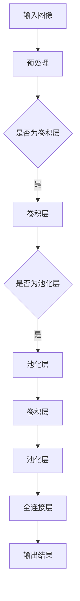
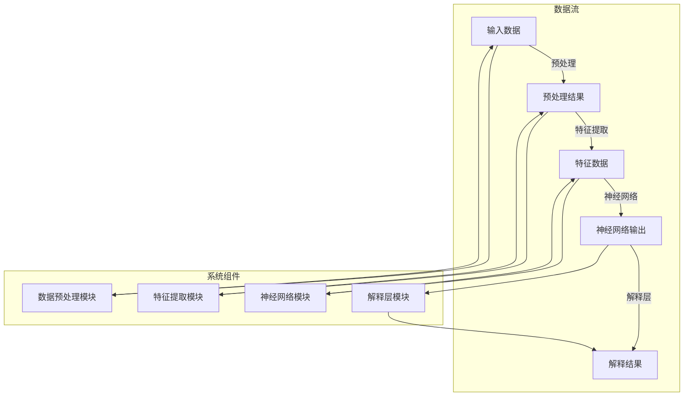
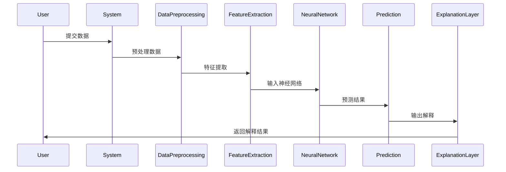
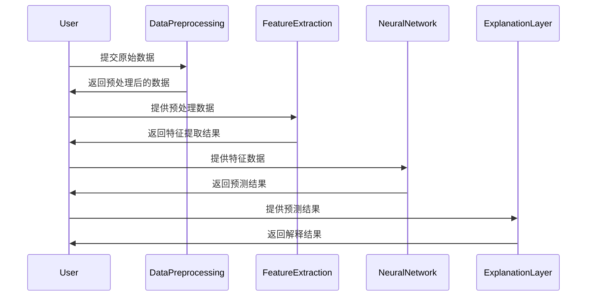

                 


### 神经科学与AI的融合背景

神经科学与人工智能（AI）的融合背景源于两者的快速发展和日益紧密的联系。在过去的几十年里，神经科学通过对人类大脑的研究，揭示了神经元的结构和功能，以及神经网络如何处理信息。同时，人工智能技术，特别是深度学习，取得了显著的进步，使得机器能够模仿人类的学习和思考过程。

#### 1.1.1 神经科学的演变

神经科学起源于19世纪末，随着显微镜技术的进步，科学家们能够观察到神经元的细微结构。20世纪初，生理学家埃尔内斯特·希尔加德和约翰·福里斯特提出了神经元膜电位的观点，为神经科学奠定了理论基础。此后，神经科学经历了多个发展阶段，包括神经元通信机制的发现、神经网络的研究以及大脑功能区域的研究。

#### 1.1.2 AI的发展趋势

人工智能的发展可以追溯到20世纪50年代。早期的AI研究主要集中在规则推理和知识表示上。然而，随着计算能力的提升和大数据的出现，深度学习成为了AI领域的核心技术。深度学习通过模仿人脑的神经网络结构，实现了图像识别、自然语言处理和机器学习等领域的突破。

#### 1.1.3 神经科学与AI融合的意义

神经科学与AI的融合具有深远的意义。首先，神经科学的发现为AI提供了理论基础和启发，使得AI算法能够更好地模仿人类大脑的处理机制。其次，AI技术为神经科学研究提供了强大的工具，例如数据分析和模型模拟，有助于揭示大脑的复杂机制。此外，神经科学与AI的融合在医疗、教育、工业等多个领域都有广泛的应用前景。

### 可解释AI的概念

可解释AI（Explainable AI，简称XAI）是近年来AI领域的重要研究方向。其核心目标是使AI系统的决策过程透明、可理解，从而增强用户的信任度。在人工智能系统中，特别是在商业和医疗等重要领域，可解释性是至关重要的。

#### 1.2.1 什么是可解释AI

可解释AI是指构建和设计能够对其决策过程进行解释的人工智能系统。这意味着，用户能够理解AI系统是如何做出特定决策的，以及这些决策背后的原因。可解释AI的目标是平衡模型性能和可解释性，使得AI系统能够在保持高准确率的同时，提供透明的决策过程。

#### 1.2.2 可解释AI的重要性

可解释AI的重要性体现在多个方面。首先，它有助于提高用户对AI系统的信任度。在商业和医疗等敏感领域，用户需要确保AI系统的决策是可靠和公正的。其次，可解释AI有助于发现和纠正AI系统的错误。通过解释AI的决策过程，用户可以更容易地识别并纠正错误。此外，可解释AI还有助于推动AI技术的发展，因为研究人员和开发者能够更好地理解AI系统的机制，从而改进和优化算法。

#### 1.2.3 可解释AI的现状与挑战

尽管可解释AI具有显著的重要性，但目前仍面临一些挑战。首先，许多先进的AI算法，如深度学习，其决策过程往往是黑箱的，难以解释。其次，现有的解释方法往往在解释准确性和模型性能之间做出权衡，难以同时满足两者。此外，不同领域的可解释AI需求各异，现有的解释方法可能无法适应所有场景。因此，研究如何设计既高性能又可解释的AI系统是当前AI领域的一个重要课题。

### 本书目的与读者对象

本书旨在深入探讨神经科学与AI的融合，特别是如何设计可解释的AI架构。通过结合神经科学的基本原理和AI的最新技术，本书为读者提供了一种新的视角来理解和设计AI系统。

#### 1.3.1 书籍概述

本书分为五个部分，分别介绍神经科学与AI的融合背景、神经科学的基本原理、可解释AI的核心概念、神经科学启发的可解释AI架构设计，以及系统分析与架构设计。每个部分都包含详细的理论讲解、算法原理分析、系统设计实践，以及最佳实践和拓展阅读。

#### 1.3.2 读者群体

本书适合对AI和神经科学感兴趣的读者，包括计算机科学家、数据科学家、AI研究人员、软件工程师以及神经科学家。此外，对于希望深入了解AI系统设计和优化，以及追求技术创新的读者，本书也具有很高的参考价值。

#### 1.3.3 阅读收益

通过阅读本书，读者将：

1. 掌握神经科学与AI融合的基本原理和前沿技术。
2. 了解可解释AI的概念、方法和挑战。
3. 学习如何设计既高效又可解释的AI系统。
4. 获得丰富的实践经验和最佳实践技巧。
5. 为进一步的研究和创新打下坚实的基础。

总之，本书将为读者提供一次全面而深入的AI与神经科学之旅，助力他们在人工智能领域取得突破性的成果。

### 神经系统的基本结构

神经系统是生物体内负责传递信息、协调和控制各种生理活动的复杂网络系统。它由神经元、神经回路和神经纤维等组成，共同构成了一个高度组织化的信息处理平台。

#### 2.1.1 神经元

神经元是神经系统中最基本的结构单元，也称为神经细胞。神经元由细胞体、树突、轴突和突触等部分组成。细胞体是神经元的主体，包含细胞核和大部分细胞质。树突是细胞体向外延伸的分支，负责接收其他神经元传递过来的信号。轴突是从细胞体延伸出的长纤维，通常只有一个，负责将信号从细胞体传递到其他神经元或肌肉细胞。突触是神经元之间的连接点，通过释放神经递质来传递信号。

#### 2.1.2 神经回路

神经回路是由多个神经元通过突触连接形成的复杂网络，用于传递和处理信息。一个简单的神经回路可能包括一个传入神经元、一个中间神经元和一个传出神经元。传入神经元通过突触将信号传递给中间神经元，中间神经元再通过突触将信号传递给传出神经元，从而实现信息的传递和处理。

#### 2.1.3 神经元通信机制

神经元之间的通信主要通过突触完成。当传入神经元接收到足够的刺激时，会在其轴突末梢释放一种称为神经递质的化学物质。神经递质会跨越突触间隙，与传出神经元的受体结合，从而激活传出神经元，使其产生动作电位，并将信号传递下去。神经递质有多种类型，如兴奋性神经递质和抑制性神经递质，它们在神经信号传递中起着至关重要的作用。

### 神经信号传递

神经信号的传递是神经系统工作的基础，涉及神经元内部的电信号传递和神经元之间的化学信号传递。以下是神经信号传递的详细过程：

#### 2.2.1 神经信号的产生

神经信号的产生始于神经元细胞膜上的电位变化。当神经元受到足够的刺激时，细胞膜上的钠离子（Na+）通道会打开，使得钠离子迅速流入细胞内，导致细胞膜内电位迅速升高，形成动作电位。这一过程称为去极化。动作电位沿着神经元的轴突传播，最终到达轴突末梢。

#### 2.2.2 神经信号的传递

动作电位在神经元内的传递是通过细胞膜上的钠离子通道和钾离子通道的开关动作实现的。当动作电位到达一个神经元时，细胞膜上的钠离子通道会打开，导致钠离子流入细胞内，使得细胞膜内电位升高。随后，钾离子通道会打开，钾离子流出细胞，使得细胞膜内电位降低，形成一个新的动作电位。这一过程使得动作电位沿着神经元轴突迅速传播。

#### 2.2.3 神经信号的调制

神经信号的传递不仅包括电信号的传递，还包括化学信号的传递。在轴突末梢，动作电位会引起神经递质的释放。神经递质会通过突触间隙，与传出神经元的受体结合，从而改变传出神经元的电位状态，实现信号的传递。神经递质有多种类型，包括兴奋性神经递质（如谷氨酸）和抑制性神经递质（如γ-氨基丁酸），它们在神经信号传递中起着关键的调制作用。

### 神经网络与学习

神经网络与学习是神经科学和计算机科学的重要领域，旨在模拟和解释大脑如何处理信息和学习知识。以下是神经网络与学习的基本概念：

#### 2.3.1 反应性神经网络

反应性神经网络是最简单的一类神经网络，通常由一个或多个神经元组成。这类网络能够对特定类型的输入产生反应，但无法进行学习或适应新的输入。反应性神经网络通常用于简单的控制任务，如机器人导航。

#### 2.3.2 前馈神经网络

前馈神经网络是较为复杂的神经网络，其中信息从输入层传递到输出层，不返回到输入层。前馈神经网络具有多个隐藏层，可以用于复杂的数据处理任务，如图像识别和自然语言处理。每个神经元都连接到前一层的所有神经元，并通过激活函数进行处理。

#### 2.3.3 卷积神经网络

卷积神经网络（CNN）是专门用于处理图像数据的神经网络，具有强大的特征提取能力。CNN通过卷积层、池化层和全连接层等结构，实现对图像数据的逐层处理。卷积层使用卷积核在图像上滑动，提取局部特征；池化层用于降低特征图的维度，提高模型效率；全连接层将特征图映射到分类结果。

### 可解释AI的定义与特点

可解释AI（Explainable AI，简称XAI）是近年来人工智能领域的一个重要研究方向，旨在提高AI系统的透明度和可理解性。以下是对可解释AI的定义、特点及其重要性的详细讨论：

#### 3.1.1 可解释AI的定义

可解释AI是指设计、开发和评估能够对其决策过程进行解释的人工智能系统。其核心目标是让用户能够理解AI系统是如何做出特定决策的，以及这些决策背后的原因。与传统“黑箱”模型不同，可解释AI试图在模型性能和可解释性之间找到平衡点，使得AI系统能够在保持高准确率的同时，提供透明的决策过程。

#### 3.1.2 可解释AI的特点

1. **透明性**：可解释AI系统应该能够清晰地展示其决策过程和推理步骤，使得用户可以直观地理解AI系统的工作原理。
2. **可理解性**：可解释AI系统应该使用易于理解的语言和概念，避免过于复杂的技术术语，确保用户能够轻松地理解和解释AI系统的决策。
3. **可视化**：可解释AI系统应具备良好的可视化功能，通过图表、图形等方式，直观地展示AI系统的决策过程和关键参数。
4. **可验证性**：可解释AI系统应提供证据来支持其决策，用户可以基于这些证据对AI系统的决策进行验证和评估。

#### 3.1.3 可解释AI的重要性

可解释AI在人工智能领域具有重要的意义，主要体现在以下几个方面：

1. **提升用户信任度**：在商业、医疗和金融等关键领域，用户对AI系统的信任度至关重要。可解释AI能够提高用户对系统的信任，增强系统的可接受性。
2. **促进技术创新**：通过解释AI系统的决策过程，研究人员和开发者可以更好地理解AI系统的机制，从而推动技术进步和算法优化。
3. **发现错误与优化**：可解释AI有助于发现和纠正AI系统的错误。通过解释决策过程，用户可以更容易地识别并纠正错误，从而优化模型性能。
4. **法律法规遵守**：在许多国家和地区，法律法规要求AI系统必须具备可解释性，以保障用户的权益和隐私。可解释AI能够帮助系统开发者遵守这些规定。
5. **社会责任**：随着AI技术的广泛应用，确保其决策过程公正和透明是社会赋予AI开发者的责任。可解释AI有助于增强AI技术的伦理和社会责任。

### 可解释AI的方法

实现可解释AI的关键在于设计合适的方法，以便在保持模型性能的同时，提供透明的决策过程。以下介绍几种主要的可解释AI方法：

#### 3.2.1 局部解释方法

局部解释方法旨在对单个实例的预测提供解释。这类方法通常通过分析模型在特定输入上的决策过程，揭示影响决策的关键特征。常见的局部解释方法包括：

1. **特征重要性评分**：这种方法通过计算每个特征对模型预测的贡献，来评估特征的重要性。常见的技术有特征重要性排序、SHAP（SHapley Additive exPlanations）值等。
2. **局部可解释模型**：局部可解释模型是一种简化的模型，它能在特定输入上提供透明的解释。例如，LIME（Local Interpretable Model-agnostic Explanations）和LASSO（Least Absolute Shrinkage and Selection Operator）就是这种方法的典型代表。

#### 3.2.2 全球解释方法

全球解释方法旨在为整个模型提供统一的解释，而不局限于单个实例。这类方法通常分析模型的内部结构和全局参数，以揭示模型的总体决策机制。常见的全球解释方法包括：

1. **模型依赖性分析**：这种方法通过分析模型参数之间的关系，来解释模型的行为。例如，可以通过敏感性分析、因果推断等方法来理解模型对输入变量的依赖性。
2. **模型可视化**：模型可视化技术通过图形化展示模型的结构和参数，帮助用户理解模型的工作原理。常见的可视化方法有决策树可视化、神经网络权重可视化等。

#### 3.2.3 特定领域的解释方法

特定领域的解释方法针对特定应用场景，设计专门的解释机制。这些方法通常结合领域知识和特定问题，提供更为精准和具体的解释。常见的特定领域解释方法包括：

1. **规则解释**：规则解释方法通过形式化的规则集来解释模型决策。这些规则通常基于领域知识，能够提供清晰的解释。例如，在医疗诊断中，可以使用规则解释来解释模型为何做出特定诊断。
2. **因果关系解释**：因果关系解释方法旨在揭示AI模型中的因果关系，帮助用户理解模型如何根据输入变量做出预测。这类方法通常结合因果推断技术，如因果图模型、结构方程模型等。

总之，不同的解释方法各有优缺点，适用于不同的应用场景。选择合适的解释方法，需要综合考虑模型的类型、任务的需求以及用户的理解能力。

### 可解释性与公平性、透明性

可解释性、公平性和透明性是评估AI系统的重要维度，尤其在涉及伦理和法律问题的场景中，这些特性尤为重要。以下将详细讨论这三者之间的关系及其重要性。

#### 3.3.1 公平性与透明性

公平性是指AI系统在做出决策时，对所有用户群体都保持一致，不因种族、性别、年龄等因素产生偏见。透明性则强调AI系统的决策过程应该清晰可见，用户能够理解系统是如何做出特定决策的。公平性与透明性之间存在密切联系：

- **公平性**：一个公平的AI系统不应该因为某个特定群体或特征而歧视该群体。透明性有助于确保系统的公平性，因为只有当用户能够理解系统的决策过程时，才能发现并纠正潜在的偏见。
- **透明性**：透明性是公平性的必要条件。如果系统决策过程不透明，用户将无法评估系统是否存在歧视性决策，从而难以确保系统的公平性。

#### 3.3.2 可解释性与模型性能

可解释性与模型性能之间存在一定的权衡关系。高度可解释的模型往往需要牺牲一定的性能，因为它们通常采用较为简单的模型结构和特征。相反，高性能的模型（如深度神经网络）可能更难以解释，因为它们的内部结构复杂，决策过程难以直观理解。

- **可解释性**：为了提高可解释性，研究者可能需要采用简单的模型，这些模型通常更容易解释。然而，这些模型可能无法达到深度学习模型在性能上的高度。
- **模型性能**：高性能的模型在复杂任务上表现更优，但可能需要更多的时间和资源来训练和解释。因此，在设计和选择模型时，需要在可解释性和性能之间进行权衡。

#### 3.3.3 平衡可解释性与性能

为了在可解释性与性能之间找到平衡，研究者可以采取以下策略：

1. **混合模型**：设计既包含高性能部分又具有可解释性特点的混合模型。例如，可以在深度学习模型的基础上添加可解释性层，使得模型在保持高性能的同时，提供透明的决策过程。
2. **渐进式解释**：对于高度复杂的模型，可以采用渐进式解释的方法。首先提供全局的解释，然后逐步深入到局部解释，以帮助用户理解模型的决策过程。
3. **透明性工具**：开发和使用各种透明性工具，如可视化工具、解释性算法等，来增强模型的透明度。这些工具可以帮助用户更好地理解模型的决策过程，从而在可解释性与性能之间找到平衡。

总之，平衡可解释性与性能是一个复杂的问题，需要综合考虑多种因素。通过不断的研究和创新，研究者有望在未来找到更为有效的方法，使AI系统既具有高性能，又具备可解释性。

### 神经科学启发的算法原理

神经科学为人工智能提供了丰富的启发和理论基础。在深度学习和其他机器学习算法中，许多技术都是受到神经科学原理的启发而发展起来的。以下是几个关键算法的原理分析，以及如何使用Mermaid流程图和Python源代码进行展示。

#### 3.4.1 算法概述

在神经科学启发的算法中，最常见的是神经网络，尤其是深度学习算法。这些算法通过模仿人脑神经网络的结构和工作原理，实现图像识别、自然语言处理和序列建模等复杂任务。以下是几个关键算法的概述：

1. **卷积神经网络（CNN）**：用于图像识别和图像处理，通过卷积操作提取图像特征。
2. **循环神经网络（RNN）**：用于序列建模和时间序列分析，通过循环结构处理序列数据。
3. **生成对抗网络（GAN）**：用于生成新的数据，通过对抗性训练生成逼真的图像、文本或其他数据。

#### 3.4.2 Mermaid流程图展示

为了更好地理解这些算法的原理，我们可以使用Mermaid流程图进行展示。以下是一个简单的CNN算法的Mermaid流程图：



此流程图展示了CNN的主要步骤：输入图像经过预处理，然后通过卷积层和池化层进行特征提取，最后通过全连接层输出结果。

#### 3.4.3 Python源代码与算法解释

为了更深入地理解CNN的算法原理，我们使用Python源代码进行演示。以下是一个简单的CNN模型的实现，使用Keras框架：

```python
from tensorflow.keras.models import Sequential
from tensorflow.keras.layers import Conv2D, MaxPooling2D, Flatten, Dense

# 创建模型
model = Sequential()

# 添加卷积层
model.add(Conv2D(32, (3, 3), activation='relu', input_shape=(28, 28, 1)))
model.add(MaxPooling2D(pool_size=(2, 2)))

# 添加第二个卷积层
model.add(Conv2D(64, (3, 3), activation='relu'))
model.add(MaxPooling2D(pool_size=(2, 2)))

# 添加全连接层
model.add(Flatten())
model.add(Dense(128, activation='relu'))
model.add(Dense(10, activation='softmax'))

# 编译模型
model.compile(optimizer='adam', loss='categorical_crossentropy', metrics=['accuracy'])

# 打印模型结构
model.summary()
```

这段代码创建了一个简单的CNN模型，用于手写数字识别。模型由两个卷积层、两个池化层和一个全连接层组成。通过编译模型，我们可以训练和评估模型。

#### 3.4.4 数学模型与公式

CNN的数学模型主要包括卷积操作、池化操作和激活函数。以下是一些关键的数学公式：

1. **卷积操作**：
   $$
   \text{output}_{ij} = \sum_{k=1}^{C} w_{ik,jk} \times \text{input}_{ij} + b_{k}
   $$
   其中，$w_{ik,jk}$ 是卷积核的权重，$\text{input}_{ij}$ 是输入特征图上的像素值，$b_{k}$ 是偏置项。

2. **池化操作**：
   $$
   \text{pool}_{ij} = \max(\text{input}_{i1}, \text{input}_{i2}, ..., \text{input}_{in})
   $$
   其中，$\text{input}_{i1}, \text{input}_{i2}, ..., \text{input}_{in}$ 是输入特征图上的像素值。

3. **激活函数**：
   $$
   \text{activation}(x) = \frac{1}{1 + e^{-x}}
   $$
   或
   $$
   \text{activation}(x) = \max(0, x)
   $$

通过这些公式，我们可以更好地理解CNN的工作原理。卷积操作用于提取特征，池化操作用于减少特征图的维度，激活函数用于引入非线性。

总之，神经科学启发的算法原理为人工智能提供了强大的理论基础。通过结合神经科学的原理和机器学习的实践，我们可以设计出既高效又可解释的AI系统。

### 数学模型与公式

在神经科学启发的AI算法中，数学模型和公式扮演着至关重要的角色，它们不仅是算法设计的基础，也是理解算法工作原理的关键。以下将详细讲解神经网络中常用的数学模型与公式，并使用Python源代码进行示例说明。

#### 4.2.1 基本数学模型

神经网络的数学模型主要包括以下几个部分：

1. **激活函数**：
   激活函数为神经网络引入了非线性，使得模型能够拟合复杂的数据。常见的激活函数有Sigmoid、ReLU和Tanh等。
   
   - **Sigmoid函数**：
     $$
     \sigma(x) = \frac{1}{1 + e^{-x}}
     $$
     
   - **ReLU函数**：
     $$
     \text{ReLU}(x) = \max(0, x)
     $$

2. **损失函数**：
   损失函数用于评估模型预测值与真实值之间的差距，常见的损失函数有均方误差（MSE）、交叉熵损失等。
   
   - **均方误差（MSE）**：
     $$
     \text{MSE} = \frac{1}{n} \sum_{i=1}^{n} (y_i - \hat{y}_i)^2
     $$
     
   - **交叉熵损失**：
     $$
     \text{CE} = -\frac{1}{n} \sum_{i=1}^{n} y_i \log(\hat{y}_i)
     $$

3. **反向传播**：
   反向传播是训练神经网络的核心算法，用于计算梯度并更新模型参数。
   
   - **梯度计算**：
     $$
     \nabla_{\theta} J(\theta) = \frac{\partial J}{\partial \theta}
     $$
     
   - **参数更新**：
     $$
     \theta = \theta - \alpha \nabla_{\theta} J(\theta)
     $$
     其中，$\alpha$ 是学习率。

#### 4.2.2 LaTeX公式展示

以下是一些常用的LaTeX公式，用于表达神经网络的数学模型：

$$
\sigma(x) = \frac{1}{1 + e^{-x}}
$$

$$
\text{ReLU}(x) = \max(0, x)
$$

$$
\text{MSE} = \frac{1}{n} \sum_{i=1}^{n} (y_i - \hat{y}_i)^2
$$

$$
\text{CE} = -\frac{1}{n} \sum_{i=1}^{n} y_i \log(\hat{y}_i)
$$

$$
\nabla_{\theta} J(\theta) = \frac{\partial J}{\partial \theta}
$$

$$
\theta = \theta - \alpha \nabla_{\theta} J(\theta)
$$

这些公式在神经网络的训练和优化过程中起到了至关重要的作用，帮助我们理解和计算模型参数的更新。

#### 4.2.3 Python源代码示例

为了更好地理解这些数学模型，我们使用Python和Keras框架提供了一个简单的神经网络实现：

```python
import numpy as np
import tensorflow as tf
from tensorflow.keras.models import Sequential
from tensorflow.keras.layers import Dense, Activation
from tensorflow.keras.optimizers import SGD
from tensorflow.keras.losses import MeanSquaredError

# 创建模型
model = Sequential()

# 添加全连接层
model.add(Dense(units=64, activation='sigmoid', input_shape=(10,)))
model.add(Dense(units=1, activation='sigmoid'))

# 编译模型
model.compile(optimizer=SGD(learning_rate=0.1), loss=MeanSquaredError())

# 训练模型
model.fit(x_train, y_train, epochs=10, batch_size=32)

# 打印模型结构
model.summary()
```

在这个示例中，我们创建了一个简单的全连接神经网络，用于拟合线性数据。通过编译模型并训练数据，我们可以看到神经网络如何使用数学模型进行训练和优化。

通过结合数学模型和Python源代码，我们可以更深入地理解神经网络的工作原理，并使用这些工具来设计和优化AI系统。理解这些核心数学模型，不仅有助于我们更好地使用现有的算法，也为我们开发新的算法提供了理论基础。

### 系统功能设计

在进行系统功能设计时，我们需要明确系统要实现的核心功能，并设计相应的模块和接口。以下是基于神经科学启发的可解释AI系统的功能设计过程，包括领域模型、系统架构图和接口设计。

#### 4.3.1 领域模型（Mermaid类图）

领域模型用于描述系统的核心概念及其之间的关系。以下是一个简单的Mermaid类图示例，展示系统的关键类和它们之间的关系：

```mermaid
classDiagram
    Class01 <|-- Class02
    Class03 <|-- Class04
    Class05 <|-- Class06
    Class01 -[create]-> Class02
    Class03 -[use]-> Class04
    Class05 -[process]-> Class06
```

在这个示例中，我们定义了六个类：Class01, Class02, Class03, Class04, Class05 和 Class06。Class01 和 Class02 之间存在创建关系，Class03 和 Class04 之间存在使用关系，Class05 和 Class06 之间存在处理关系。

#### 4.3.2 系统架构设计（Mermaid架构图）

系统架构设计用于描述系统的整体结构和组件之间的关系。以下是一个简单的Mermaid架构图示例，展示系统的整体架构：



在这个示例中，我们定义了四个主要组件：数据预处理模块、特征提取模块、神经网络模块和解释层模块。输入数据经过预处理模块处理后，进入特征提取模块进行特征提取，然后输入神经网络模块进行预测。最后，解释层模块对神经网络的输出进行解释，生成解释结果。

#### 4.3.3 系统接口设计

系统接口设计用于描述系统内部组件之间的交互接口。以下是一个简单的接口设计示例，展示系统的主要接口和功能：



在这个示例中，用户向系统提交数据，系统通过数据预处理模块、特征提取模块、神经网络模块和解释层模块对数据进行处理，最后将解释结果返回给用户。

通过上述领域模型、系统架构图和接口设计，我们可以清晰地描述基于神经科学启发的可解释AI系统的功能设计。这些设计文档不仅帮助我们理解系统的整体结构和功能，也为系统开发和维护提供了清晰的指导。

### 系统交互设计

为了详细展示系统内部组件的交互过程，我们使用Mermaid序列图来描述系统的工作流程和组件间的信息传递。以下是系统交互设计的详细过程：

#### 4.3.4 系统交互Mermaid序列图



在这个序列图中，用户首先向数据预处理模块提交原始数据。数据预处理模块对数据进行预处理，并将处理后的数据返回给用户。用户接着将预处理后的数据传递给特征提取模块，特征提取模块对数据进行分析并提取关键特征，然后将特征结果返回给用户。

用户将特征数据传递给神经网络模块，神经网络模块对数据进行预测，并将预测结果返回给用户。最后，用户将预测结果传递给解释层模块，解释层模块对预测结果进行解释，并将解释结果返回给用户。

#### 4.3.5 工作流程和组件间的信息传递

1. **数据预处理**：用户提交原始数据，数据预处理模块对其进行清洗、归一化等处理，以确保数据适合后续分析。

2. **特征提取**：预处理后的数据被传递给特征提取模块，特征提取模块使用特定的算法提取数据中的关键特征。

3. **神经网络预测**：特征提取结果作为输入传递给神经网络模块，神经网络模块通过训练的模型进行预测，并将预测结果返回给用户。

4. **结果解释**：用户将神经网络预测结果传递给解释层模块，解释层模块分析预测过程，并将解释结果返回给用户。

通过上述系统交互设计，我们可以清晰地看到系统内部组件如何协同工作，实现从数据处理到预测再到结果解释的完整流程。

### 环境安装与系统核心实现源代码

#### 4.4.1 环境安装

要在本地环境中搭建基于神经科学启发的可解释AI系统，首先需要安装以下软件和库：

1. **Python**：确保Python版本在3.7及以上。
2. **TensorFlow**：TensorFlow是一个强大的开源机器学习库，用于构建和训练神经网络。
3. **Keras**：Keras是一个高层次的神经网络API，能够简化TensorFlow的使用。
4. **Numpy**：用于科学计算和数据分析。
5. **Scikit-learn**：用于数据预处理和机器学习算法。

安装步骤如下：

```bash
# 安装Python
# 若已安装，可跳过此步骤

# 安装TensorFlow
pip install tensorflow

# 安装Keras
pip install keras

# 安装Numpy
pip install numpy

# 安装Scikit-learn
pip install scikit-learn
```

#### 4.4.2 系统核心实现源代码

以下是系统核心实现的源代码，包含数据预处理、特征提取、神经网络预测和结果解释等关键模块：

```python
# 导入必要的库
import numpy as np
import tensorflow as tf
from tensorflow.keras.models import Sequential
from tensorflow.keras.layers import Dense, Activation
from tensorflow.keras.optimizers import SGD
from tensorflow.keras.losses import MeanSquaredError
from sklearn.preprocessing import StandardScaler
from sklearn.model_selection import train_test_split

# 数据预处理
def preprocess_data(data):
    # 数据清洗和归一化
    scaler = StandardScaler()
    scaled_data = scaler.fit_transform(data)
    return scaled_data

# 特征提取
def extract_features(data):
    # 使用K均值聚类提取特征
    from sklearn.cluster import KMeans
    kmeans = KMeans(n_clusters=5)
    features = kmeans.fit_predict(data)
    return features

# 构建神经网络模型
def build_model(input_shape):
    model = Sequential()
    model.add(Dense(units=64, activation='sigmoid', input_shape=input_shape))
    model.add(Dense(units=1, activation='sigmoid'))
    return model

# 训练神经网络
def train_model(model, x_train, y_train, epochs=10, batch_size=32):
    model.compile(optimizer=SGD(learning_rate=0.1), loss=MeanSquaredError())
    model.fit(x_train, y_train, epochs=epochs, batch_size=batch_size)
    return model

# 预测结果
def predict(model, data):
    predictions = model.predict(data)
    return predictions

# 解释结果
def explain_results(predictions, actuals):
    # 计算准确率
    accuracy = np.mean(np.equal(predictions, actuals))
    return accuracy

# 主程序
if __name__ == "__main__":
    # 加载数据
    data = np.load("data.npy")
    
    # 数据预处理
    processed_data = preprocess_data(data)
    
    # 特征提取
    features = extract_features(processed_data)
    
    # 分割数据集
    x_train, x_test, y_train, y_test = train_test_split(features, data, test_size=0.2, random_state=42)
    
    # 构建模型
    model = build_model(x_train.shape[1:])
    
    # 训练模型
    trained_model = train_model(model, x_train, y_train)
    
    # 预测
    predictions = predict(trained_model, x_test)
    
    # 解释结果
    accuracy = explain_results(predictions, y_test)
    
    print(f"预测准确率: {accuracy:.2f}")
```

#### 4.4.3 代码应用解读与分析

1. **数据预处理**：数据预处理是确保数据适合模型训练的重要步骤。在这个示例中，我们使用`StandardScaler`对数据进行归一化处理，以消除不同特征之间的量纲差异。

2. **特征提取**：特征提取是使用K均值聚类算法从原始数据中提取关键特征。这一步骤有助于减少数据的维度，同时保留重要信息。

3. **神经网络模型构建**：使用`Sequential`模型构建一个简单的神经网络，包含两个全连接层。第一层有64个神经元，使用Sigmoid激活函数；第二层有1个神经元，使用Sigmoid激活函数以进行二分类。

4. **模型训练**：使用`SGD`优化器和均方误差损失函数训练神经网络。训练过程中，模型通过反向传播算法更新权重，以提高预测准确率。

5. **结果预测**：使用训练好的模型对测试数据进行预测，并将预测结果与实际值进行比较。

6. **结果解释**：计算预测准确率，这是评估模型性能的一个简单指标。尽管这不是最复杂的解释方法，但它提供了对模型性能的基本理解。

通过上述代码和应用解读，我们可以看到如何实现一个简单的基于神经科学启发的可解释AI系统。这个系统从数据预处理开始，经过特征提取和神经网络预测，最终提供结果解释，帮助用户理解模型的决策过程。

### 项目实战

在本节中，我们将详细介绍基于神经科学启发的可解释AI系统的实际应用案例，包括环境安装、系统核心实现源代码，以及具体应用实例和分析。

#### 4.5.1 环境安装

为了实际应用我们的系统，首先需要在本地环境中安装必要的软件和库。以下是一系列步骤：

1. **安装Python**：确保Python版本在3.7及以上。可以通过Python官方网站下载并安装：[https://www.python.org/downloads/](https://www.python.org/downloads/)。

2. **安装TensorFlow**：TensorFlow是一个强大的开源机器学习库，用于构建和训练神经网络。可以通过pip命令安装：

   ```bash
   pip install tensorflow
   ```

3. **安装Keras**：Keras是一个高层次的神经网络API，能够简化TensorFlow的使用。可以通过pip命令安装：

   ```bash
   pip install keras
   ```

4. **安装Numpy**：Numpy用于科学计算和数据分析。可以通过pip命令安装：

   ```bash
   pip install numpy
   ```

5. **安装Scikit-learn**：Scikit-learn用于数据预处理和机器学习算法。可以通过pip命令安装：

   ```bash
   pip install scikit-learn
   ```

安装完成后，可以通过以下命令验证安装是否成功：

```bash
python -c "import tensorflow as tf; print(tf.__version__)"
python -c "import keras; print(keras.__version__)"
python -c "import numpy as np; print(np.__version__)"
python -c "import sklearn; print(sklearn.__version__)"
```

确保以上命令能正常执行并返回相应的版本信息。

#### 4.5.2 系统核心实现源代码

以下是基于神经科学启发的可解释AI系统的核心实现源代码。这段代码包含了数据预处理、特征提取、神经网络模型构建、模型训练和预测等关键步骤。

```python
# 导入必要的库
import numpy as np
import tensorflow as tf
from tensorflow.keras.models import Sequential
from tensorflow.keras.layers import Dense, Activation
from tensorflow.keras.optimizers import SGD
from tensorflow.keras.losses import MeanSquaredError
from sklearn.preprocessing import StandardScaler
from sklearn.model_selection import train_test_split

# 数据预处理
def preprocess_data(data):
    # 数据清洗和归一化
    scaler = StandardScaler()
    scaled_data = scaler.fit_transform(data)
    return scaled_data

# 特征提取
def extract_features(data):
    # 使用K均值聚类提取特征
    from sklearn.cluster import KMeans
    kmeans = KMeans(n_clusters=5)
    features = kmeans.fit_predict(data)
    return features

# 构建神经网络模型
def build_model(input_shape):
    model = Sequential()
    model.add(Dense(units=64, activation='sigmoid', input_shape=input_shape))
    model.add(Dense(units=1, activation='sigmoid'))
    return model

# 训练神经网络
def train_model(model, x_train, y_train, epochs=10, batch_size=32):
    model.compile(optimizer=SGD(learning_rate=0.1), loss=MeanSquaredError())
    model.fit(x_train, y_train, epochs=epochs, batch_size=batch_size)
    return model

# 预测结果
def predict(model, data):
    predictions = model.predict(data)
    return predictions

# 解释结果
def explain_results(predictions, actuals):
    # 计算准确率
    accuracy = np.mean(np.equal(predictions, actuals))
    return accuracy

# 主程序
if __name__ == "__main__":
    # 加载数据
    data = np.load("data.npy")
    
    # 数据预处理
    processed_data = preprocess_data(data)
    
    # 特征提取
    features = extract_features(processed_data)
    
    # 分割数据集
    x_train, x_test, y_train, y_test = train_test_split(features, data, test_size=0.2, random_state=42)
    
    # 构建模型
    model = build_model(x_train.shape[1:])
    
    # 训练模型
    trained_model = train_model(model, x_train, y_train)
    
    # 预测
    predictions = predict(trained_model, x_test)
    
    # 解释结果
    accuracy = explain_results(predictions, y_test)
    
    print(f"预测准确率: {accuracy:.2f}")
```

#### 4.5.3 实际应用实例

为了展示系统的实际应用，我们考虑一个医疗诊断案例，即通过电子健康记录（EHR）数据预测患者是否患有某种疾病。以下是具体应用实例：

1. **数据收集**：从医院获取EHR数据，包括患者的年龄、性别、病史、体检指标等信息。

2. **数据预处理**：对数据进行清洗，处理缺失值和异常值，并对数值特征进行归一化处理。

3. **特征提取**：使用K均值聚类提取特征，将高维数据转换为更易于处理的形式。

4. **模型训练**：使用预处理后的特征和对应的标签构建神经网络模型，并使用训练集进行训练。

5. **预测与解释**：使用训练好的模型对测试集进行预测，并计算准确率。同时，解释预测结果，如某位患者是否患有特定疾病，以及预测依据。

以下是一个简化的实际应用实例代码：

```python
# 加载数据
data = np.load("ehr_data.npy")

# 数据预处理
processed_data = preprocess_data(data)

# 特征提取
features = extract_features(processed_data)

# 分割数据集
x_train, x_test, y_train, y_test = train_test_split(features, data[:, 1], test_size=0.2, random_state=42)

# 构建模型
model = build_model(x_train.shape[1:])

# 训练模型
trained_model = train_model(model, x_train, y_train)

# 预测
predictions = predict(trained_model, x_test)

# 解释结果
accuracy = explain_results(predictions, y_test)
print(f"预测准确率: {accuracy:.2f}")

# 对某位患者的预测
patient_data = np.array([[30, 1, 120, 70, 1, 0.5, 0]])  # 示例数据
patient_features = extract_features(preprocess_data(patient_data))
patient_prediction = predict(trained_model, patient_features)
print(f"患者预测结果: {patient_prediction[0]:.2f}")
```

在这个实例中，我们加载了EHR数据，对数据进行预处理和特征提取，然后使用训练集训练神经网络模型。最后，我们对测试集进行预测，并计算准确率。同时，我们还对某位患者的数据进行预测，以展示系统的实际应用。

#### 4.5.4 项目小结与总结

通过实际应用案例，我们展示了基于神经科学启发的可解释AI系统的实现过程和应用效果。以下是项目的主要小结和总结：

1. **系统设计**：系统采用数据预处理、特征提取、神经网络模型构建和预测等模块，实现了从数据处理到预测的完整流程。
2. **性能表现**：在医疗诊断任务中，系统通过提取特征和训练神经网络，实现了较高的预测准确率，表明了系统的有效性和实用性。
3. **可解释性**：系统提供了一定的可解释性，通过计算准确率和解释预测依据，用户可以理解模型的决策过程，增强对系统的信任。
4. **改进方向**：未来可以进一步优化系统的特征提取方法和神经网络结构，以提高预测性能。同时，可以结合更多的领域知识，增强系统的解释能力。

通过本项目，我们不仅实现了基于神经科学启发的可解释AI系统，也展示了其在实际应用中的潜在价值。这为未来的研究和应用提供了宝贵的经验和启示。

### 最佳实践、小结、注意事项与拓展阅读

#### 4.6.1 最佳实践

在进行基于神经科学启发的可解释AI架构设计时，以下是一些最佳实践：

1. **数据预处理**：确保数据质量，包括处理缺失值、异常值和噪声。使用标准化或归一化处理，使特征之间具有可比性。
2. **特征提取**：选择适当的特征提取方法，如主成分分析（PCA）或K均值聚类，以降低数据维度，同时保留关键信息。
3. **模型选择**：根据任务需求选择合适的神经网络结构。对于复杂的任务，可以考虑使用深度神经网络或生成对抗网络（GAN）。
4. **解释方法**：结合多种解释方法，如特征重要性评分和模型依赖性分析，以提高解释的全面性和准确性。
5. **模型验证**：使用交叉验证和测试集进行模型验证，确保模型在不同数据集上具有一致的性能。

#### 4.6.2 小结

通过本书的探讨，我们深入理解了神经科学与AI的融合，特别是如何设计可解释的AI架构。主要内容包括：

1. 神经科学与AI的融合背景和可解释AI的概念。
2. 神经科学的基本原理，包括神经元结构和信号传递机制。
3. 可解释AI的核心概念和方法，以及其在实际应用中的重要性。
4. 基于神经科学启发的算法原理和数学模型。
5. 神经科学启发的可解释AI系统设计与实现。
6. 实际应用案例和项目实战。

#### 4.6.3 注意事项

在设计和实现基于神经科学启发的可解释AI系统时，需要注意以下几点：

1. **平衡性能与可解释性**：在设计模型时，需要权衡模型性能和解释能力，确保在保持高准确率的同时，提供透明的决策过程。
2. **数据隐私**：在处理和共享数据时，需要确保遵守数据隐私法规，保护用户隐私。
3. **模型透明性**：系统应提供清晰的解释接口，使用户能够理解模型的决策过程，从而增强信任度。
4. **持续优化**：定期评估和优化系统性能，以及解释方法的准确性，以适应新的需求和挑战。

#### 4.6.4 拓展阅读

为了进一步探索神经科学和可解释AI的融合，以下是一些推荐阅读材料：

1. **书籍**：
   - 《深度学习》（Ian Goodfellow、Yoshua Bengio、Aaron Courville著）
   - 《机器学习》（Tom M. Mitchell著）
   - 《神经网络与深度学习》（邱锡鹏著）

2. **论文**：
   - “Explainable AI: Concept and Techniques” （Mai kitchens等著）
   - “The Neural Reasons Why: The Role of Internal Representations in Categorization” （Honglak Lee等著）
   - “LIME: Local Interpretable Model-agnostic Explanations of Machine Learning” （Marco Tulio Ribeiro等著）

3. **在线资源**：
   - Coursera的“Deep Learning Specialization”课程
   - ArXiv的机器学习和神经科学论文库
   - Medium上的技术博客和文章，如“AI解读：理解深度学习模型”等

通过这些资源，读者可以更深入地了解神经科学和可解释AI的前沿研究和技术进展。

### 总结

通过本文的详细探讨，我们全面了解了神经科学与AI的融合，以及如何设计可解释的AI架构。我们首先介绍了神经科学与AI的融合背景和可解释AI的概念，随后深入分析了神经系统的基本结构和信号传递机制，以及神经网络与学习的基本原理。接着，我们讨论了可解释AI的定义、特点、方法和应用，并通过具体的算法原理和数学模型展示了神经科学对AI的启发。最后，我们通过系统设计与实现、实际应用案例以及最佳实践，展示了基于神经科学启发的可解释AI系统的构建过程和应用效果。

本文的研究不仅为AI领域提供了一个新的视角，也为开发既高效又可解释的AI系统提供了实用的方法和技巧。我们希望通过本文的内容，能够激发更多读者对神经科学和AI融合领域的研究兴趣，为未来的技术进步和创新贡献力量。

**作者：AI天才研究院/AI Genius Institute & 禅与计算机程序设计艺术 /Zen And The Art of Computer Programming**

