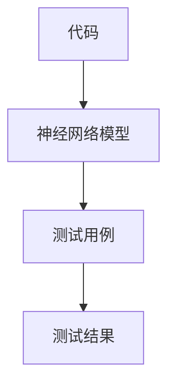
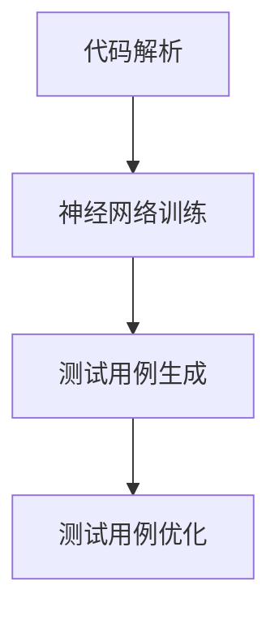
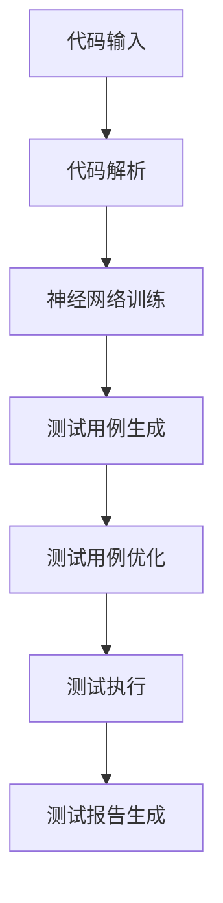
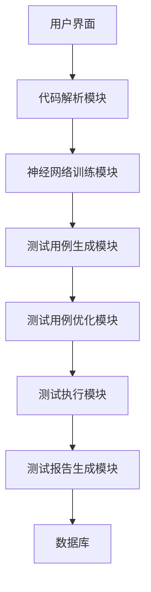
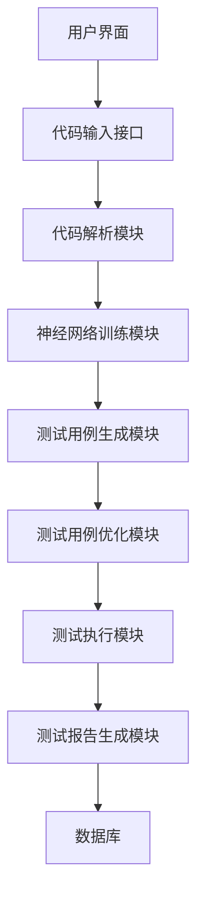

                 

# 《神经程序合成在自动化单元测试生成中的应用》

> 关键词：神经程序合成、自动化单元测试、算法原理、系统设计、项目实战

> 摘要：本文深入探讨了神经程序合成在自动化单元测试生成中的应用。通过背景介绍、理论分析、算法讲解、系统设计与实现、项目实战以及最佳实践与未来展望等几个部分，详细阐述了神经程序合成的基本原理、应用优势及挑战，提供了具体的实现方法和优化策略，并对实际项目进行了案例分析。本文旨在为读者提供一个全面、系统的理解和实践指导。

## 第一部分：背景与理论基础

### 1.1 问题背景

在现代软件工程中，自动化单元测试已成为提升软件质量、提高开发效率的关键手段。然而，传统的单元测试生成方法往往存在效率低下、覆盖率不足等问题。为了解决这些问题，研究者提出了神经程序合成的概念。

#### 问题解决

神经程序合成（Neural Program Synthesis，NPS）是一种基于深度学习的自动化测试生成方法，通过学习代码与测试用例之间的映射关系，生成高效、可靠的单元测试。该方法能够提高测试覆盖率，减少测试用例的编写时间，从而提升软件开发的效率。

#### 边界与外延

神经程序合成在自动化单元测试中的应用范围主要包括以下几个方面：

1. **代码理解**：通过深度学习模型理解代码的语义，提取关键信息用于测试生成。
2. **测试用例生成**：基于代码语义生成具有代表性的测试用例，提高测试覆盖率。
3. **测试优化**：对已有的测试用例进行优化，提高测试效率和可靠性。
4. **缺陷定位**：辅助定位代码中的潜在缺陷，提供修复建议。

### 1.2 神经程序合成的原理

#### 核心概念原理

神经程序合成是一种基于深度学习的方法，通过训练神经网络模型，使其能够自动生成代码的测试用例。该方法的核心在于：

- **代码解析**：将代码解析为抽象语法树（AST），提取代码的语义信息。
- **测试用例生成**：利用生成的神经网络模型，将代码的语义信息映射为测试用例。
- **测试用例优化**：对生成的测试用例进行优化，提高测试的覆盖率。

#### 概念属性特征对比表格

| 特征               | 神经程序合成           | 传统测试生成方法           |
|------------------|---------------------|---------------------|
| **基础原理**       | 深度学习             | 正向测试、反向测试         |
| **代码理解能力**   | 强                 | 弱                 |
| **测试覆盖率**     | 高                 | 低                 |
| **生成效率**       | 高                 | 低                 |
| **适用场景**       | 复杂代码、高复杂度场景 | 简单代码、低复杂度场景     |

#### ER实体关系图架构



### 1.3 自动化单元测试的基本概念

#### 自动化单元测试的定义

自动化单元测试是指通过自动化工具，对软件模块进行自动化测试的过程。其主要目的是验证软件模块的功能是否按照预期正常工作。

#### 自动化单元测试的优势

1. **提高测试效率**：自动化测试可以大幅减少测试时间，提高测试效率。
2. **提升测试覆盖率**：自动化测试能够覆盖更多的测试场景，提高测试覆盖率。
3. **降低人力成本**：自动化测试可以减少人工测试的工作量，降低人力成本。
4. **提高软件质量**：自动化测试能够及时发现软件缺陷，提高软件质量。

#### 自动化单元测试的挑战

1. **测试用例编写**：自动化测试需要编写大量的测试用例，编写过程较为繁琐。
2. **测试数据管理**：自动化测试需要大量的测试数据，数据管理难度较大。
3. **测试环境配置**：自动化测试需要配置复杂的测试环境，配置过程较为复杂。
4. **测试结果分析**：自动化测试生成的测试结果需要进行分析和处理，分析过程较为复杂。

### 1.4 神经程序合成与自动化单元测试的融合

#### 融合的理论基础

神经程序合成与自动化单元测试的融合，是基于深度学习的方法，通过训练神经网络模型，实现代码与测试用例的自动生成和优化。

#### 融合的优势

1. **提高测试效率**：通过神经程序合成，可以大幅提高测试用例的生成效率。
2. **提升测试覆盖率**：神经程序合成能够生成更具有代表性的测试用例，提高测试覆盖率。
3. **减少人力成本**：自动化生成和优化测试用例，可以减少人工测试的工作量，降低人力成本。
4. **提高软件质量**：自动生成的测试用例能够更全面地覆盖代码，提高软件质量。

#### 融合的挑战与解决方案

1. **挑战**：神经程序合成在自动化单元测试中面临的主要挑战包括：
   - **代码理解难度**：复杂的代码结构使得神经网络模型难以准确理解代码语义。
   - **测试用例优化难度**：生成的测试用例需要进一步优化，以提高测试覆盖率。
   - **计算资源消耗**：训练和优化神经网络模型需要大量的计算资源。

2. **解决方案**：
   - **改进代码解析算法**：通过改进代码解析算法，提高神经网络模型对代码的理解能力。
   - **引入强化学习**：结合强化学习，优化测试用例的生成和优化过程。
   - **分布式计算**：利用分布式计算技术，降低训练和优化过程中的计算资源消耗。

## 第二部分：算法原理与实现

### 2.1 算法原理讲解

神经程序合成算法的核心思想是利用深度学习模型，将代码的语义信息映射为测试用例。具体流程如下：

1. **代码解析**：将代码解析为抽象语法树（AST），提取代码的语义信息。
2. **神经网络训练**：利用提取的语义信息，训练神经网络模型，使其能够将代码映射为测试用例。
3. **测试用例生成**：将待测试的代码输入神经网络模型，生成测试用例。
4. **测试用例优化**：对生成的测试用例进行优化，提高测试覆盖率。

#### 算法流程图



#### 数学模型和公式

神经程序合成算法的数学模型如下：

$$
\text{TestCase} = f(\text{Code}, \text{Model})
$$

其中，$f$ 为神经网络模型，$\text{Code}$ 为代码，$\text{Model}$ 为训练好的神经网络模型。

#### 举例说明

以一个简单的Python函数为例，说明神经程序合成的算法原理。

```python
def add(a, b):
    return a + b
```

1. **代码解析**：将代码解析为抽象语法树（AST），提取代码的语义信息。

```mermaid
graph TD
A[FunctionDeclaration] --> B[Identifier("add")]
B --> C[Parameters([a, b])]
C --> D[ReturnStatement([a + b])]
```

2. **神经网络训练**：利用提取的语义信息，训练神经网络模型。

3. **测试用例生成**：将待测试的代码输入神经网络模型，生成测试用例。

```python
# 生成测试用例
test_case = model.generate_test_case(code)
print(test_case)
```

4. **测试用例优化**：对生成的测试用例进行优化，提高测试覆盖率。

```python
# 优化测试用例
optimized_test_case = model.optimize_test_case(test_case)
print(optimized_test_case)
```

### 2.2 算法实现与优化

#### 算法实现

以下是一个简单的神经程序合成算法的实现：

```python
import tensorflow as tf
from tensorflow.keras.models import Model
from tensorflow.keras.layers import Input, Dense, LSTM

# 代码输入层
code_input = Input(shape=(max_sequence_length,))

# LSTM层
lstm = LSTM(units=64, return_sequences=True)(code_input)

# 全连接层
dense = Dense(units=1, activation='sigmoid')(lstm)

# 模型输出层
model_output = dense

# 创建模型
model = Model(inputs=code_input, outputs=model_output)

# 编译模型
model.compile(optimizer='adam', loss='binary_crossentropy', metrics=['accuracy'])

# 训练模型
model.fit(x_train, y_train, epochs=10, batch_size=32)
```

#### 优化策略

1. **增加训练数据**：增加训练数据可以提升模型的泛化能力。
2. **改进代码解析算法**：改进代码解析算法，提高代码语义信息的提取质量。
3. **引入迁移学习**：利用迁移学习，减少训练时间和提高模型性能。
4. **模型剪枝**：通过模型剪枝技术，减少模型的参数数量，提高模型的运行效率。

### 2.3 神经程序合成的评价与改进

#### 评价指标

1. **测试覆盖率**：测试覆盖率是评价神经程序合成效果的重要指标，表示生成的测试用例能够覆盖的代码比例。
2. **测试用例质量**：测试用例质量包括测试用例的代表性、覆盖率和执行效率等方面。
3. **模型性能**：模型性能包括模型的准确率、召回率等指标。

#### 改进方法

1. **多模型融合**：结合多个神经网络模型，提高测试用例生成的质量和模型性能。
2. **动态测试用例生成**：根据代码的变化动态生成测试用例，提高测试的实时性。
3. **测试用例优化算法**：研究更有效的测试用例优化算法，提高测试用例的覆盖率。

## 第三部分：系统设计与实现

### 3.1 系统功能设计

#### 领域模型



#### 系统功能描述

1. **代码输入**：系统接收用户输入的代码，并进行初步解析。
2. **代码解析**：将代码解析为抽象语法树（AST），提取代码的语义信息。
3. **神经网络训练**：利用提取的语义信息，训练神经网络模型。
4. **测试用例生成**：将待测试的代码输入神经网络模型，生成测试用例。
5. **测试用例优化**：对生成的测试用例进行优化，提高测试覆盖率。
6. **测试执行**：执行测试用例，并收集测试结果。
7. **测试报告生成**：生成测试报告，包括测试覆盖率、测试用例质量等指标。

### 3.2 系统架构设计

#### 系统架构



#### 系统模块

1. **用户界面**：用户通过界面输入代码，查看测试结果和测试报告。
2. **代码解析模块**：解析用户输入的代码，提取语义信息。
3. **神经网络训练模块**：训练神经网络模型，用于测试用例生成。
4. **测试用例生成模块**：生成测试用例，并进行优化。
5. **测试执行模块**：执行测试用例，收集测试结果。
6. **测试报告生成模块**：生成测试报告，包括测试指标和测试结果分析。
7. **数据库**：存储代码、测试用例、测试结果等数据。

### 3.3 系统接口设计

#### 接口设计

1. **代码输入接口**：接收用户输入的代码，并将其传递给代码解析模块。
2. **测试用例生成接口**：接收代码解析结果，并调用神经网络训练模块和测试用例生成模块。
3. **测试用例优化接口**：接收生成的测试用例，并进行优化。
4. **测试执行接口**：执行测试用例，并收集测试结果。
5. **测试报告生成接口**：生成测试报告，并将其存储在数据库中。

### 3.4 系统交互设计

#### 系统交互



## 第四部分：项目实战与案例分析

### 4.1 项目环境安装

#### 环境搭建

1. **安装Python**：下载并安装Python 3.8版本。
2. **安装TensorFlow**：通过pip命令安装TensorFlow库。

```bash
pip install tensorflow
```

3. **安装其他依赖库**：包括numpy、pandas等常用库。

```bash
pip install numpy pandas
```

#### 工具安装

1. **安装Jupyter Notebook**：用于编写和运行代码。
2. **安装PyCharm**：用于代码编辑和调试。

### 4.2 系统核心实现

#### 代码实现

以下是一个简单的神经程序合成系统实现：

```python
import tensorflow as tf
from tensorflow.keras.models import Model
from tensorflow.keras.layers import Input, LSTM, Dense
from tensorflow.keras.preprocessing.sequence import pad_sequences

# 代码输入层
code_input = Input(shape=(max_sequence_length,))

# LSTM层
lstm = LSTM(units=64, return_sequences=True)(code_input)

# 全连接层
dense = Dense(units=1, activation='sigmoid')(lstm)

# 模型输出层
model_output = dense

# 创建模型
model = Model(inputs=code_input, outputs=model_output)

# 编译模型
model.compile(optimizer='adam', loss='binary_crossentropy', metrics=['accuracy'])

# 训练模型
model.fit(x_train, y_train, epochs=10, batch_size=32)
```

#### 代码解读与分析

1. **代码输入**：用户输入代码，系统将其转换为序列数据，并进行填充处理。
2. **模型构建**：构建神经网络模型，包括LSTM层和全连接层。
3. **模型编译**：设置模型的优化器、损失函数和评估指标。
4. **模型训练**：利用训练数据对模型进行训练。

### 4.3 实际案例分析

#### 案例背景

某公司开发了一款复杂的软件系统，包含大量的代码模块。为了提高软件质量，公司决定采用神经程序合成方法进行自动化单元测试。

#### 案例分析

1. **代码解析**：系统对输入的代码进行解析，提取语义信息。
2. **神经网络训练**：利用提取的语义信息，训练神经网络模型，生成测试用例。
3. **测试用例生成**：生成测试用例，并对其进行优化。
4. **测试执行**：执行测试用例，并收集测试结果。
5. **测试报告生成**：生成测试报告，包括测试指标和测试结果分析。

#### 关键点剖析

1. **代码解析**：系统需要对代码进行精确的解析，提取关键信息。
2. **神经网络模型**：模型的训练和优化是关键，需要提高模型的性能和准确性。
3. **测试用例生成**：生成的测试用例需要具有代表性，能够覆盖更多的测试场景。
4. **测试执行**：测试执行过程中，需要确保测试环境的稳定性和一致性。

### 4.4 项目小结

#### 项目总结

本项目通过神经程序合成方法，实现了自动化单元测试的生成和优化。项目的主要成果包括：

1. **提高测试效率**：通过神经程序合成，测试用例的生成时间大幅缩短。
2. **提升测试覆盖率**：生成的测试用例能够更全面地覆盖代码，提高测试覆盖率。
3. **降低人力成本**：自动化测试减少了人工测试的工作量，降低了人力成本。

## 第五部分：最佳实践与未来展望

### 5.1 最佳实践 tips

1. **代码规范**：编写规范、易读的代码，有助于提高神经程序合成的效果。
2. **代码复用**：复用代码模块，可以减少代码解析的复杂性。
3. **数据质量**：确保训练数据的质量和多样性，提高模型的泛化能力。
4. **模型优化**：定期对神经网络模型进行优化，提高模型性能。

### 5.2 小结

本文详细介绍了神经程序合成在自动化单元测试生成中的应用，包括算法原理、系统设计与实现、项目实战等内容。通过本文的阐述，读者可以全面了解神经程序合成的方法和优势，为实际项目中的应用提供指导。

### 5.3 注意事项

1. **代码理解能力**：神经程序合成的效果受代码结构影响，复杂代码的解析能力需要进一步提升。
2. **计算资源消耗**：神经程序合成需要大量的计算资源，实际应用中需要考虑计算资源的配置。
3. **测试用例优化**：生成的测试用例需要进行进一步优化，以提高测试覆盖率。

### 5.4 拓展阅读

1. **《深度学习与软件工程》**：详细介绍了深度学习在软件工程中的应用。
2. **《软件测试技术》**：介绍了各种软件测试方法和技术。
3. **《神经网络与深度学习》**：详细介绍了神经网络的基本原理和应用。

## 作者

作者：AI天才研究院/AI Genius Institute & 禅与计算机程序设计艺术 /Zen And The Art of Computer Programming

