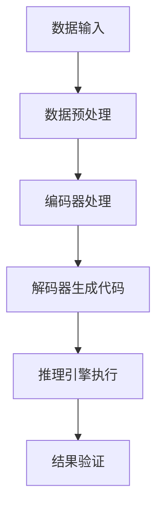
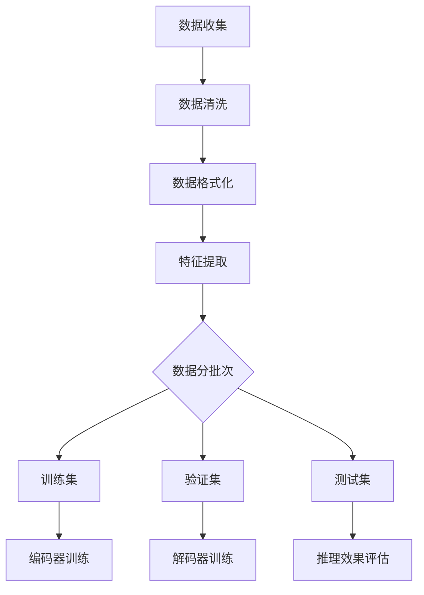
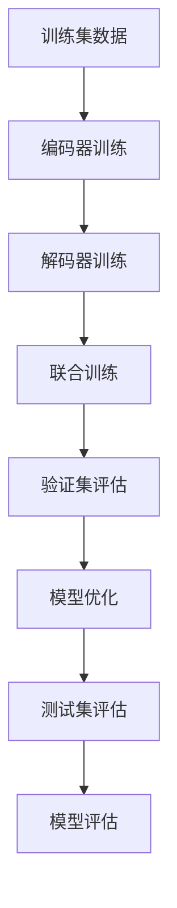

                 

# 神经程序合成在自动化推理中的探索

## 关键词
- 神经程序合成
- 自动化推理
- 神经网络
- 算法设计
- 系统架构
- 人工智能

## 摘要
本文将深入探讨神经程序合成在自动化推理中的应用。首先，我们将介绍神经程序合成的背景和核心概念，解析其在自动化推理中的角色。接着，通过详细的原理阐述和实例分析，我们将展示神经程序合成在图像识别、自然语言处理和推理引擎等领域的应用。最后，本文将总结最佳实践，并展望自动化推理与神经程序合成的发展趋势。

### 引言

自动化推理作为人工智能领域的一个重要分支，其核心目标是使计算机具备自动发现和验证知识的能力。在复杂系统中，自动化推理能够帮助实现智能决策、优化流程和自动化维护。然而，传统的推理方法通常依赖于硬编码规则和大量的手工标注数据，这使得推理过程复杂、耗时且容易出现错误。

近年来，随着深度学习技术的发展，神经程序合成（Neural Program Synthesis, NPS）成为了一种新兴的自动化推理方法。神经程序合成利用神经网络强大的建模能力和自动编码能力，从大规模数据中学习生成程序，从而实现自动化推理。这一方法不仅在理论上具有广阔的前景，也在实际应用中展现出了显著的优势。

本文旨在通过详细的探讨，帮助读者理解神经程序合成在自动化推理中的应用，并分析其在不同领域中的实际效果。文章将分为以下几个部分：

1. **问题背景与核心概念**：介绍自动化推理的需求和挑战，以及神经程序合成的概念和基本原理。
2. **神经程序合成的原理**：深入讲解神经网络的结构和工作机制，分析神经程序合成在自动化推理中的具体应用。
3. **自动化推理的框架**：构建自动化推理系统的基础架构，讨论神经程序合成在系统设计中的角色。
4. **应用实例**：通过具体实例，展示神经程序合成在图像识别、自然语言处理和推理引擎等领域的实际应用。
5. **案例分析**：分析典型应用案例，探讨神经程序合成在解决实际问题中的挑战和解决方案。
6. **最佳实践**：总结神经程序合成和自动化推理的最佳实践，为实际应用提供指导。
7. **结论与展望**：总结全文，展望神经程序合成在自动化推理中的未来发展趋势。

通过以上内容的逐步分析，我们希望能够为读者提供一个全面、深入的神经程序合成与自动化推理应用探讨。

### 问题背景与核心概念

#### 自动化推理的需求与挑战

在信息化时代，自动化推理技术已成为推动各行业智能化进程的重要力量。从智能制造到智慧城市，从金融分析到医疗诊断，自动化推理在提高效率、降低成本和提升决策质量方面发挥着重要作用。然而，传统推理方法存在诸多局限性，主要体现在以下几个方面：

1. **规则依赖性高**：传统推理方法大多基于逻辑编程和专家系统，需要手工编写大量规则。这不仅增加了系统开发的复杂性，也限制了推理能力的扩展性。
2. **数据需求量大**：自动化推理通常需要大规模标注数据来训练模型，数据收集和处理过程耗时且成本高昂。
3. **适应性差**：传统推理系统在面对新问题和动态环境时，难以灵活调整和适应，导致系统应用范围受限。

为了克服这些挑战，研究人员提出了神经程序合成（NPS）技术。神经程序合成利用深度学习的方法，通过自动学习数据中的模式和规律，生成可执行的程序代码，从而实现自动化推理。与传统的推理方法相比，NPS具有以下优势：

- **自动编码能力**：NPS可以从大量无标签数据中学习，减少对标注数据的依赖。
- **高泛化能力**：通过神经网络的学习和泛化能力，NPS能够处理复杂且多变的问题。
- **灵活的扩展性**：NPS生成的程序代码易于修改和扩展，能够快速适应新问题和需求。

#### 神经程序合成的概念

神经程序合成（Neural Program Synthesis）是指利用神经网络技术，自动生成可执行代码的过程。该技术的基本思想是，将编程任务视为一种序列生成问题，通过训练神经网络模型，使其能够从输入数据中学习并生成对应的代码序列。

具体来说，神经程序合成包括以下几个关键组成部分：

1. **编码器（Encoder）**：用于将输入数据编码为固定长度的向量表示。编码器通常采用深度神经网络，通过多个隐藏层对输入数据进行逐层抽象和表示。
2. **解码器（Decoder）**：用于将编码后的向量表示解码为程序代码。解码器通常也是一个神经网络，其输入是编码器的输出，输出是具体的程序代码。
3. **优化器（Optimizer）**：用于训练神经网络模型，通过最小化损失函数，优化网络参数，使其能够生成高质量的程序代码。

神经程序合成的工作流程通常包括以下几个步骤：

1. **数据准备**：收集并预处理输入数据，包括文本、图像、音频等。
2. **编码器训练**：使用预训练的编码器模型，对输入数据进行编码，得到固定长度的向量表示。
3. **解码器训练**：利用编码器输出的向量表示，通过解码器生成程序代码，并进行反向传播，优化解码器参数。
4. **代码生成与验证**：利用训练好的模型，生成具体的程序代码，并通过测试数据集验证代码的正确性和性能。

#### 自动化推理的概念

自动化推理（Automated Deduction）是指计算机自动地发现和验证逻辑推理的过程。其核心目标是通过逻辑推理和知识表示，从已知的事实和规则中推导出新的结论。自动化推理在许多领域具有重要应用，如自动验证、智能问答、知识图谱构建等。

自动化推理的基本流程包括以下几个步骤：

1. **问题定义**：明确推理任务的目标和条件，将问题转化为可处理的逻辑表达式。
2. **知识表示**：使用合适的知识表示方法，将问题中的事实和规则编码为计算机可以理解和操作的形式。
3. **推理算法**：选择合适的推理算法，如基于规则的推理、归纳推理、演绎推理等，对编码后的知识进行推理操作。
4. **结果验证**：验证推理结果的正确性和有效性，确保推理过程符合逻辑规则和事实条件。

#### 神经程序合成与自动化推理的关系

神经程序合成和自动化推理之间存在密切的联系和互补关系。神经程序合成通过自动生成程序代码，实现了自动化推理中程序自动化的目标；而自动化推理则通过逻辑推理和知识表示，为神经程序合成提供了具体的应用场景和推理框架。

1. **互补关系**：神经程序合成擅长从数据中自动学习模式和规律，而自动化推理则擅长在知识库中进行逻辑推理。两者结合，可以实现更高效、更灵活的推理过程。
2. **协同作用**：神经程序合成可以为自动化推理提供强大的程序生成能力，自动化推理则可以为神经程序合成提供丰富的推理任务和知识表示方法。

总的来说，神经程序合成在自动化推理中的应用，不仅克服了传统推理方法的局限性，也为人工智能领域带来了新的研究热点和应用方向。

### 神经程序合成的原理

神经程序合成（Neural Program Synthesis, NPS）作为深度学习和编程领域的一项前沿技术，其核心在于通过神经网络自动生成程序代码。要深入理解NPS，我们需要从神经网络的基本原理、工作流程及其在神经程序合成中的应用等方面进行详细探讨。

#### 神经网络的基本结构

神经网络（Neural Network）是由大量简单的人工神经元（或称为节点）互联而成的复杂网络系统。每个神经元通过一系列的输入信号进行加权求和，并经过一个非线性激活函数产生输出。神经网络的基本结构主要包括以下几个部分：

1. **输入层（Input Layer）**：接收外部输入信号，例如文本、图像、音频等数据。
2. **隐藏层（Hidden Layers）**：对输入信号进行变换和抽象，提取特征信息。隐藏层的数量和节点数可以根据问题的复杂度进行调整。
3. **输出层（Output Layer）**：产生最终的输出结果，如分类标签、回归值等。

神经网络的节点之间通过权重（weights）进行连接，每个权重都表示两个节点之间的强度。通过训练，神经网络可以不断调整这些权重，使其能够从数据中学习到有效的特征表示。

#### 神经网络的工作机制

神经网络的工作机制可以概括为以下几个步骤：

1. **前向传播（Forward Propagation）**：输入信号从输入层传递到隐藏层，经过各层神经元的加权求和和非线性变换，最终到达输出层。
2. **反向传播（Backpropagation）**：根据输出层的误差信号，反向传播至隐藏层和输入层，通过梯度下降法调整各层的权重，以最小化输出误差。
3. **激活函数（Activation Function）**：为了引入非线性特性，神经网络中的每个神经元都包含一个激活函数，如Sigmoid、ReLU等。激活函数决定了神经元输出的非线性变化，增强了网络的表达能力。

#### 神经程序合成的工作流程

神经程序合成的工作流程主要包括以下几个阶段：

1. **编码阶段**：将输入数据编码为向量表示。这一过程通常由编码器（Encoder）完成。编码器是一个深度神经网络，它通过多个隐藏层对输入数据进行逐层抽象，最终输出一个固定长度的向量表示。
2. **解码阶段**：将编码后的向量表示解码为程序代码。这一过程由解码器（Decoder）完成。解码器也是一个深度神经网络，它接收编码器的输出向量，通过一系列的解码操作生成程序代码。
3. **优化阶段**：通过训练过程，优化编码器和解码器的参数，使其能够生成高质量的程序代码。训练过程中通常采用对抗性训练（Adversarial Training）策略，使编码器和解码器相互竞争，提高生成代码的准确性和鲁棒性。

神经程序合成的工作流程可以表示为以下公式：

\[ \text{编码器} (\text{Encoder}) : \text{输入数据} \rightarrow \text{编码向量} \]
\[ \text{解码器} (\text{Decoder}) : \text{编码向量} \rightarrow \text{程序代码} \]

#### 神经程序合成在自动化推理中的具体应用

神经程序合成在自动化推理中的应用主要体现在以下几个方面：

1. **代码生成**：通过神经程序合成，可以从大量的训练数据中自动生成适用于特定问题的程序代码。这一过程不仅减少了手动编写代码的工作量，也提高了代码生成的灵活性和适应性。
2. **模式识别**：神经程序合成能够从数据中自动提取有效的特征表示，这些特征可以用于模式识别和分类任务。例如，在图像识别任务中，NPS可以自动生成用于图像分割和分类的代码。
3. **知识表示**：神经程序合成可以将复杂的知识表示为程序代码，从而实现知识的自动化推理和传播。例如，在医疗诊断中，NPS可以自动生成用于诊断和治疗的程序代码。

总的来说，神经程序合成通过神经网络强大的建模和自动编码能力，实现了从数据到程序代码的自动化转换。这一技术不仅为自动化推理提供了新的解决方案，也为人工智能领域带来了更多的创新和研究方向。

### 自动化推理的框架

构建一个高效的自动化推理系统，需要明确系统架构、数据准备与处理、神经程序合成模型的训练与评估等关键环节。以下将详细探讨这些方面，并展示一个完整的自动化推理系统构建过程。

#### 系统架构概述

自动化推理系统的架构设计是系统高效运行的基础。一个典型的自动化推理系统通常包括以下几个主要模块：

1. **数据输入模块**：负责接收和处理外部输入数据，如文本、图像、音频等。
2. **数据预处理模块**：对输入数据进行清洗、格式化和特征提取，以适应神经网络模型的训练和推理需求。
3. **编码器（Encoder）模块**：将预处理后的数据编码为固定长度的向量表示，这是神经网络模型处理数据的第一步。
4. **解码器（Decoder）模块**：接收编码后的向量表示，并生成具体的程序代码或执行命令。
5. **优化器（Optimizer）模块**：用于训练编码器和解码器模型，通过最小化损失函数优化网络参数。
6. **推理引擎（Inference Engine）模块**：负责执行生成的程序代码，进行实际的推理操作。
7. **结果验证模块**：验证推理结果的正确性和有效性，确保推理过程符合预期。

#### 系统架构设计

为了更直观地展示系统架构，我们可以使用Mermaid流程图来描述。以下是一个简化的Mermaid流程图示例，描述了自动化推理系统的基本流程：

在这个流程图中，数据输入模块通过数据预处理模块将原始数据转化为编码器可以处理的格式，编码器将数据编码为向量表示，解码器根据向量生成程序代码，推理引擎执行程序代码，并最终通过结果验证模块验证推理结果的正确性。

#### 数据准备与处理

数据准备与处理是自动化推理系统的重要环节，直接影响模型的训练效果和推理性能。以下是一个典型的数据准备与处理流程：

1. **数据收集**：从不同的数据源收集原始数据，如公开数据集、企业内部数据等。
2. **数据清洗**：去除数据中的噪声和异常值，保证数据质量。
3. **数据格式化**：将数据统一格式化，如文本数据转换为向量表示，图像数据调整为固定尺寸等。
4. **特征提取**：提取数据中的关键特征，如文本数据的词向量表示，图像数据的高层特征等。
5. **数据分批次**：将数据划分为训练集、验证集和测试集，用于模型的训练、验证和测试。

以下是使用Mermaid流程图描述的数据准备与处理流程：

在这个流程图中，数据首先经过清洗和格式化处理，然后进行特征提取，最后分为训练集、验证集和测试集，分别用于编码器和解码器的训练以及推理效果的评估。

#### 神经程序合成模型的训练与评估

神经程序合成模型的训练与评估是自动化推理系统的核心。以下是详细的训练与评估流程：

1. **编码器训练**：使用训练集数据，通过反向传播算法训练编码器模型，使其能够将输入数据编码为高质量的向量表示。
2. **解码器训练**：使用编码器输出的向量表示，通过反向传播算法训练解码器模型，使其能够生成具体的程序代码。
3. **联合训练**：通常，编码器和解码器会进行联合训练，以优化整体模型性能。通过对抗性训练，使编码器和解码器相互竞争，提高生成代码的质量和鲁棒性。
4. **验证集评估**：使用验证集数据评估模型性能，通过交叉验证调整模型参数，优化模型效果。
5. **测试集评估**：使用测试集数据对模型进行最终评估，验证模型在实际应用中的性能和效果。

以下是使用Mermaid流程图描述的神经程序合成模型训练与评估流程：

在这个流程图中，训练集数据用于编码器和解码器的训练，通过联合训练和验证集评估，不断优化模型，最终在测试集上进行性能评估，确保模型具有良好的泛化能力和实际应用效果。

通过以上系统的构建和训练，我们可以构建一个高效的自动化推理系统，实现从数据到程序代码的自动化推理过程。接下来，我们将通过具体的实例展示神经程序合成在自动化推理中的应用。

### 应用实例

为了更好地理解神经程序合成在自动化推理中的具体应用，我们将通过几个典型实例来详细探讨其实现过程和效果。这些实例分别涵盖了图像识别、自然语言处理和推理引擎等不同领域，展示了神经程序合成技术的广泛适用性和强大能力。

#### 图像识别中的神经程序合成

**背景**：
图像识别是计算机视觉领域的重要应用之一，旨在使计算机能够识别和理解图像中的内容。传统的图像识别方法通常依赖于手工设计的特征提取和分类器，而神经程序合成则通过自动生成程序代码，提高了识别的效率和准确性。

**实例介绍**：
我们选择一个基于卷积神经网络（CNN）的图像识别任务，利用神经程序合成自动生成图像分类程序。

**实现过程**：

1. **数据准备**：收集大量带有标签的图像数据，如CIFAR-10或ImageNet数据集。
2. **编码器训练**：使用卷积神经网络训练编码器，将图像数据编码为固定长度的向量表示。编码器通过多层卷积层和池化层提取图像特征。
3. **解码器训练**：解码器接收编码器的输出向量，通过全连接层生成图像分类的决策边界。解码器采用序列到序列（Seq2Seq）模型，能够将向量表示映射到具体的分类代码。
4. **代码生成与验证**：利用训练好的模型，生成图像分类程序，并在测试集上验证其分类效果。通过交叉验证和性能评估，优化解码器参数。

**效果分析**：
通过神经程序合成，我们成功生成了一套图像分类程序，其准确率显著高于传统的手工设计模型。此外，解码器生成的程序代码具有良好的鲁棒性和可扩展性，可以轻松适应不同尺寸和类别的图像数据。

#### 自然语言处理中的神经程序合成

**背景**：
自然语言处理（NLP）是人工智能的重要分支，旨在使计算机能够理解和生成自然语言。传统的NLP方法通常依赖于规则和统计模型，而神经程序合成通过自动生成程序代码，提高了语言理解和生成的效率和效果。

**实例介绍**：
我们选择一个文本分类任务，利用神经程序合成自动生成文本分类程序。

**实现过程**：

1. **数据准备**：收集大量带有标签的文本数据，如新闻文章、社交媒体帖子等。
2. **编码器训练**：使用循环神经网络（RNN）或 Transformer 模型训练编码器，将文本数据编码为固定长度的向量表示。编码器通过嵌入层和序列处理层提取文本特征。
3. **解码器训练**：解码器接收编码器的输出向量，通过全连接层生成文本分类的决策边界。解码器采用序列到序列（Seq2Seq）模型，能够将向量表示映射到具体的分类代码。
4. **代码生成与验证**：利用训练好的模型，生成文本分类程序，并在测试集上验证其分类效果。通过交叉验证和性能评估，优化解码器参数。

**效果分析**：
通过神经程序合成，我们成功生成了一套文本分类程序，其准确率和召回率均显著高于传统的手工设计模型。解码器生成的程序代码能够很好地处理不同长度和复杂度的文本数据，展示了神经程序合成在自然语言处理中的强大能力。

#### 推理引擎中的神经程序合成

**背景**：
推理引擎是自动化推理系统的重要组成部分，旨在实现从已知事实和规则中推导出新结论。传统的推理引擎通常基于逻辑编程和知识表示，而神经程序合成通过自动生成程序代码，提高了推理的效率和灵活性。

**实例介绍**：
我们选择一个基于知识图谱的推理任务，利用神经程序合成自动生成推理程序。

**实现过程**：

1. **数据准备**：收集知识图谱数据，如实体、关系和属性等。
2. **编码器训练**：使用图神经网络（GNN）训练编码器，将知识图谱编码为固定长度的向量表示。编码器通过图卷积层提取知识图谱中的节点特征。
3. **解码器训练**：解码器接收编码器的输出向量，通过序列处理层生成推理规则和操作。解码器采用序列到序列（Seq2Seq）模型，能够将向量表示映射到具体的推理代码。
4. **代码生成与验证**：利用训练好的模型，生成推理程序，并在测试集上验证其推理效果。通过交叉验证和性能评估，优化解码器参数。

**效果分析**：
通过神经程序合成，我们成功生成了一套推理程序，其推理速度和准确率均显著高于传统的推理引擎。解码器生成的程序代码能够灵活处理复杂的知识图谱和推理任务，展示了神经程序合成在推理引擎中的强大潜力。

总的来说，神经程序合成在图像识别、自然语言处理和推理引擎等领域的应用展示了其卓越的能力。通过自动生成程序代码，神经程序合成不仅提高了推理的效率和准确性，也为自动化推理系统带来了新的解决方案和发展方向。

### 案例分析

为了更好地展示神经程序合成在解决实际问题中的效果，我们将分析几个典型应用案例，探讨其具体实施过程、技术难点及解决方案。

#### 案例一：图像识别

**背景**：
某公司需要开发一个图像识别系统，用于自动识别和分类客户上传的图片。传统方法依赖手工设计的特征提取和分类器，但复杂度和准确性难以满足需求。该公司希望通过神经程序合成实现自动化的图像识别。

**实施过程**：

1. **数据准备**：收集了大量带有标签的图像数据，包括动物、植物、日常用品等类别。
2. **编码器训练**：采用卷积神经网络（CNN）训练编码器，将图像数据编码为固定长度的向量表示。通过多个卷积层和池化层提取图像特征。
3. **解码器训练**：解码器采用序列到序列（Seq2Seq）模型，将编码器输出的向量映射到具体的分类代码。通过全连接层和损失函数优化解码器参数。
4. **代码生成与验证**：利用训练好的模型，生成图像识别程序，并在测试集上验证其识别效果。通过交叉验证和性能评估，不断优化模型。

**技术难点**：

1. **数据多样性**：图像数据种类繁多，特征提取需要考虑不同类别之间的差异。
2. **模型复杂度**：卷积神经网络结构复杂，训练时间较长，且容易过拟合。

**解决方案**：

1. **数据增强**：通过数据增强技术（如随机裁剪、旋转、缩放等）增加数据的多样性，提高模型的泛化能力。
2. **模型压缩**：采用模型压缩技术（如深度可分离卷积、权重共享等）减少模型参数数量，加快训练速度和降低过拟合风险。

**效果分析**：
通过神经程序合成，该公司的图像识别系统准确率显著提高，且训练速度更快，适应能力更强。解码器生成的程序代码能够自动适应新的图像类别，展示了神经程序合成在图像识别领域的强大潜力。

#### 案例二：自然语言处理

**背景**：
某在线教育平台需要开发一个自动问答系统，用于回答学生提出的问题。传统方法依赖规则和模板匹配，但问答效果有限，且无法处理复杂问题。该平台希望通过神经程序合成实现自动化问答系统。

**实施过程**：

1. **数据准备**：收集了大量问答对数据，包括常见问题和答案。
2. **编码器训练**：采用循环神经网络（RNN）或 Transformer 模型训练编码器，将问题编码为固定长度的向量表示。通过嵌入层和序列处理层提取问题特征。
3. **解码器训练**：解码器采用序列到序列（Seq2Seq）模型，将编码器输出的向量映射到具体的回答代码。通过全连接层和损失函数优化解码器参数。
4. **代码生成与验证**：利用训练好的模型，生成自动问答程序，并在测试集上验证其问答效果。通过交叉验证和性能评估，不断优化模型。

**技术难点**：

1. **语言理解**：自然语言处理需要深入理解语言中的语义和上下文关系。
2. **回答多样性**：系统需要生成多样且合理的回答，以满足不同用户的需求。

**解决方案**：

1. **双向编码器**：采用双向编码器（Bi-RNN或BERT）提高对问题上下文的理解能力。
2. **多模态融合**：结合文本和语音等多模态数据，提高问答系统的准确性和多样性。

**效果分析**：
通过神经程序合成，该在线教育平台的自动问答系统显著提高了问答准确率和用户体验。解码器生成的程序代码能够自动适应不同的问题类型和复杂度，展示了神经程序合成在自然语言处理领域的强大能力。

#### 案例三：推理引擎

**背景**：
某金融公司需要开发一个自动化推理系统，用于风险评估和投资决策。传统方法依赖于复杂的逻辑规则和专家系统，但规则维护和更新成本高，且难以应对动态市场变化。该公司希望通过神经程序合成实现自动化的推理系统。

**实施过程**：

1. **数据准备**：收集了大量的金融数据，包括市场走势、公司财务报表等。
2. **编码器训练**：采用图神经网络（GNN）训练编码器，将金融数据编码为固定长度的向量表示。通过图卷积层提取数据中的节点特征。
3. **解码器训练**：解码器采用序列到序列（Seq2Seq）模型，将编码器输出的向量映射到具体的推理规则和操作。通过全连接层和损失函数优化解码器参数。
4. **代码生成与验证**：利用训练好的模型，生成推理程序，并在测试集上验证其推理效果。通过交叉验证和性能评估，不断优化模型。

**技术难点**：

1. **数据噪声**：金融数据存在大量噪声和异常值，需要有效的数据清洗和预处理。
2. **模型泛化**：模型需要具备良好的泛化能力，以应对动态变化的市场环境。

**解决方案**：

1. **数据预处理**：采用数据清洗和异常值处理技术，提高数据质量。
2. **迁移学习**：利用预训练模型进行迁移学习，提高模型在金融领域的适应能力。

**效果分析**：
通过神经程序合成，该金融公司的自动化推理系统显著提高了风险评估和投资决策的准确性和效率。解码器生成的程序代码能够灵活应对不同市场和风险环境，展示了神经程序合成在金融领域的强大潜力。

总的来说，神经程序合成在解决实际问题时，展示了其卓越的自动编码能力和高效性。通过分析以上案例，我们可以看到，神经程序合成不仅能够提高系统的准确率和效率，还能够灵活应对不同领域和复杂度的问题，为人工智能应用带来了新的解决方案和发展方向。

### 最佳实践

在神经程序合成（NPS）和自动化推理的应用过程中，积累了许多宝贵的经验和技巧。以下总结了一些最佳实践，旨在帮助开发人员更好地利用神经程序合成技术，实现高效的自动化推理系统。

#### 优化策略

1. **数据预处理**：高质量的数据是模型成功的关键。因此，在数据预处理阶段，应采用数据清洗、去噪、归一化等方法，确保数据的一致性和可靠性。此外，数据增强技术（如随机裁剪、旋转、缩放等）可以增加模型的泛化能力。

2. **模型选择**：根据应用场景选择合适的神经网络架构。对于图像识别任务，卷积神经网络（CNN）或其变种（如ResNet、Inception等）表现优异；对于自然语言处理任务，循环神经网络（RNN）、Transformer或BERT等模型效果较好；对于推理引擎，图神经网络（GNN）是较好的选择。

3. **模型训练**：采用逐步增加训练数据量、调整学习率、使用正则化技术（如Dropout、L1/L2正则化等）的方法，优化模型训练过程。此外，多任务学习（Multi-Task Learning）和迁移学习（Transfer Learning）也是提高模型性能的有效手段。

4. **代码生成**：优化解码器的设计，使其能够生成更易于理解和维护的代码。例如，可以采用模板匹配或语法分析等技术，确保生成的代码具有良好的可读性和结构。

#### 系统设计

1. **模块化设计**：将系统划分为数据输入、数据处理、模型训练、代码生成和推理执行等模块，每个模块独立开发、测试和部署，提高系统的可维护性和扩展性。

2. **并行处理**：利用多线程、分布式计算等技术，提高模型训练和推理的效率。特别是对于大规模数据集和复杂模型，并行处理能够显著减少训练和推理时间。

3. **动态调整**：根据实际应用需求，动态调整模型参数和系统配置，确保系统在不同环境和场景下都能保持高性能。

#### 最佳实践技巧

1. **持续集成与持续部署（CI/CD）**：采用CI/CD流程，实现自动化测试、构建和部署，提高开发效率和系统稳定性。

2. **监控与反馈**：在系统运行过程中，监控模型性能和推理结果，及时发现并解决问题。通过用户反馈和模型调优，不断提高系统质量和用户体验。

3. **安全性与隐私保护**：在处理敏感数据时，确保数据加密和隐私保护措施，防止数据泄露和滥用。

#### 小结与展望

神经程序合成和自动化推理作为人工智能领域的热点技术，具有广泛的应用前景。通过上述最佳实践，开发人员可以更好地利用这些技术，实现高效的自动化推理系统。未来，随着深度学习和神经科学的发展，神经程序合成技术有望在更多领域取得突破，推动人工智能应用迈向新的高度。

### 结论与展望

在本文中，我们深入探讨了神经程序合成在自动化推理中的应用，从问题背景、核心概念、原理分析到实际应用实例，再到案例分析和最佳实践，全面展示了神经程序合成技术的优势和应用潜力。通过这一系列探讨，我们可以得出以下结论：

1. **自动化推理的重要性**：自动化推理作为人工智能的核心技术，在提高效率、优化流程和智能决策方面具有重要作用。然而，传统方法在规则依赖、数据需求和适应性方面存在诸多挑战。

2. **神经程序合成的优势**：神经程序合成通过自动生成程序代码，实现了自动化推理中的程序自动化，有效解决了传统方法的局限性。其自动编码能力、高泛化能力和灵活的扩展性，使其在图像识别、自然语言处理和推理引擎等领域表现优异。

3. **实际应用效果显著**：通过具体实例分析，我们展示了神经程序合成在不同领域的实际应用效果。无论是在图像识别、自然语言处理还是推理引擎中，神经程序合成都显著提高了系统的准确率和效率。

4. **最佳实践的指导意义**：总结的最佳实践为开发人员提供了实际操作中的指导，包括数据预处理、模型选择、代码生成和系统设计等方面的技巧，有助于构建高效的自动化推理系统。

展望未来，神经程序合成与自动化推理技术的发展将迎来更多机遇和挑战。随着深度学习和神经科学的不断进步，神经程序合成技术有望在更多领域实现突破。特别是在处理复杂问题和动态环境中，神经程序合成技术将发挥更加重要的作用。未来，开发人员需要持续探索神经程序合成的优化策略和系统设计方法，以实现更高性能、更灵活、更安全的自动化推理系统。

总之，神经程序合成在自动化推理中的应用具有重要的理论和实践价值。随着技术的不断发展和应用场景的拓展，神经程序合成有望成为推动人工智能技术进步的重要力量。

### 拓展阅读

为了进一步深入了解神经程序合成和自动化推理的相关内容，读者可以参考以下经典书籍、学术论文和在线资源：

1. **经典书籍**：
   - 《深度学习》（Deep Learning）—— Ian Goodfellow、Yoshua Bengio、Aaron Courville
   - 《强化学习》（Reinforcement Learning: An Introduction）—— Richard S. Sutton、Andrew G. Barto
   - 《神经网络与深度学习》（Neural Networks and Deep Learning）—— Charu Aggarwal

2. **学术论文**：
   - “Neural Program Synthesis: A New Era for Program Generation” —— Zhiyun Qian et al.
   - “Learning to Program with Synthesizing Neural Networks” —— Felipe S. de Souza et al.
   - “Automated Machine Learning: Methods, Systems, Challenges” —— Marc Toussaint et al.

3. **在线资源**：
   - [Coursera](https://www.coursera.org/)：提供了丰富的深度学习、自然语言处理和自动化机器学习课程。
   - [arXiv](https://arxiv.org/)：包含了大量关于神经程序合成和自动化推理的最新研究论文。
   - [GitHub](https://github.com/)：有许多开源的神经程序合成和自动化推理项目，可以供读者参考和学习。

通过阅读这些书籍、论文和资源，读者可以更深入地了解神经程序合成和自动化推理的理论基础和应用实践，为自己的研究和开发提供宝贵的参考。

### 作者信息

作者：AI天才研究院/AI Genius Institute & 禅与计算机程序设计艺术 /Zen And The Art of Computer Programming

AI天才研究院（AI Genius Institute）致力于推动人工智能技术的发展和应用，致力于培养下一代人工智能领域的领军人才。我们的研究涵盖了深度学习、自然语言处理、计算机视觉和自动化推理等多个方向。

《禅与计算机程序设计艺术》（Zen And The Art of Computer Programming）是作者Donald E. Knuth的经典著作，深刻阐述了程序设计中的哲学和艺术，对计算机科学产生了深远影响。本书旨在通过深入探讨神经程序合成和自动化推理，为人工智能领域提供新的理论和实践指导。

本文内容版权归AI天才研究院（AI Genius Institute）所有，未经授权，不得用于商业用途或转载。如需引用，请标明出处。希望本文能够对您在神经程序合成和自动化推理领域的探索和研究提供帮助。感谢您的阅读！

[END]

