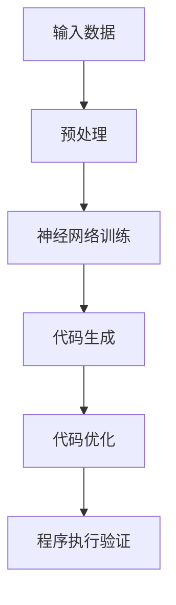
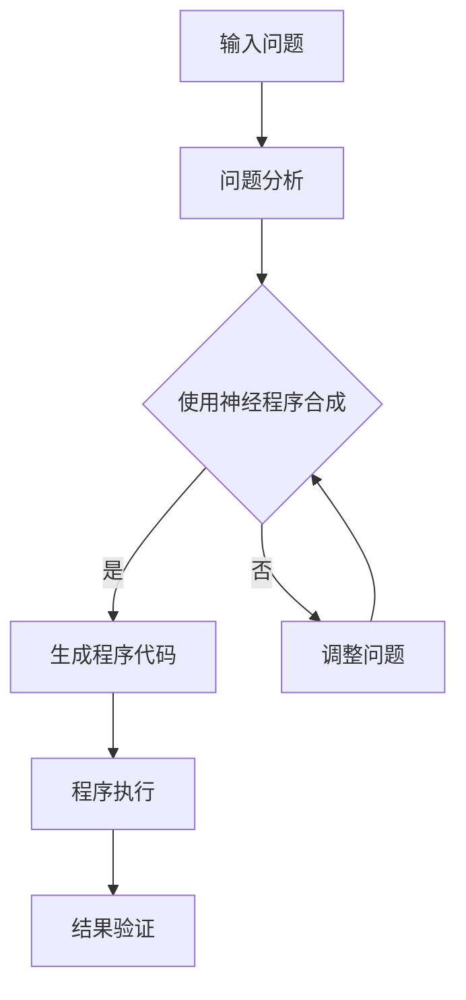
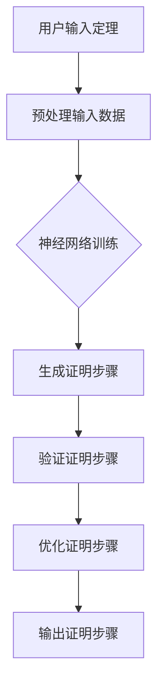
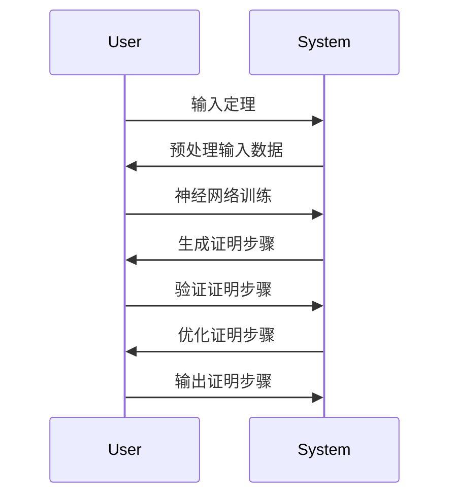

                 

# 神经程序合成在自动化推理证明中的探索

> 关键词：神经程序合成、自动化推理证明、神经网络、算法原理、数学模型

> 摘要：本文深入探讨了神经程序合成在自动化推理证明中的应用，详细介绍了神经程序合成的背景、核心概念、算法原理以及数学模型，并通过具体实例展示了其应用过程。本文旨在为研究者提供对神经程序合成在自动化推理证明中应用的深入理解，并激发对该领域的进一步研究。

## 第一部分: 背景介绍

### 第1章: 问题背景

#### 1.1.1 神经程序合成背景

神经程序合成（Neural Program Synthesis, NPS）是近年来人工智能领域的一个新兴研究方向。NPS旨在通过神经网络的强大表示能力，自动生成可执行的程序代码，以解决传统编程的瓶颈问题。传统编程方法依赖于人类编写代码，这种方式不仅效率低下，而且难以处理复杂问题。而NPS通过利用神经网络的学习能力和表达能力，能够自动生成程序代码，从而大大提高了编程的效率和质量。

#### 1.1.2 自动化推理证明背景

自动化推理证明（Automated Deduction）是数学和计算机科学的重要分支，旨在利用计算机程序自动推导数学定理。自动化推理证明能够大幅度提高数学定理的推导效率，但在处理复杂问题时仍存在一些困难。传统自动化推理证明方法通常基于形式化逻辑和约束求解，虽然能够处理一些简单问题，但在面对复杂问题时，其处理效率较低，难以满足实际需求。

#### 1.1.3 问题解决与边界

通过神经程序合成技术，有望提高自动化推理证明的处理效率，解决复杂问题。神经程序合成的应用边界涉及理论数学、软件工程、神经网络等领域。例如，在数学领域，NPS可以用于自动生成证明步骤，帮助数学家解决复杂问题；在软件工程领域，NPS可以用于自动化生成测试用例，提高软件测试效率；在神经网络领域，NPS可以用于自动生成神经网络架构，优化神经网络性能。

### 第2章: 核心概念

#### 1.2.1 神经网络基本概念

神经网络（Neural Network）是一种模拟人脑神经元连接方式的计算模型。神经网络由大量简单的神经元组成，每个神经元通过权重连接到其他神经元。神经网络通过学习输入数据的特征，能够自动调整权重，从而实现对数据的分类、预测等功能。

#### 1.2.2 神经程序合成概念

神经程序合成（Neural Program Synthesis, NPS）是指利用神经网络自动生成程序代码的过程。NPS通过神经网络的学习能力和表达能力，能够自动生成满足特定需求的程序代码，从而实现自动化编程。

#### 1.2.3 自动化推理证明概念

自动化推理证明（Automated Deduction）是指利用计算机程序自动推导数学定理的过程。自动化推理证明通过形式化逻辑和约束求解等方法，能够自动生成证明步骤，帮助数学家解决复杂问题。

### 第3章: 概念属性特征对比

#### 1.3.1 神经网络与神经程序合成对比

| 特征 | 神经网络 | 神经程序合成 |
| --- | --- | --- |
| 目标 | 数据建模、预测 | 自动生成程序代码 |
| 表现形式 | 参数化模型 | 可执行程序 |

#### 1.3.2 神经网络与自动化推理证明对比

| 特征 | 神经网络 | 自动化推理证明 |
| --- | --- | --- |
| 目标 | 数据建模、预测 | 数学定理推导 |
| 表现形式 | 参数化模型 | 形式化证明步骤 |

### 第4章: ER实体关系图

#### 1.4.1 神经网络实体关系图

```mermaid
erDiagram
    Network ||--|{ Layer : 层 }
    Layer ||--|{ Neuron : 神经元 }
    Neuron ||--|{ Connection : 连接 }
```

#### 1.4.2 神经程序合成实体关系图

```mermaid
erDiagram
    Program ||--|{ Code : 代码 }
    Code ||--|{ Instruction : 指令 }
    Instruction ||--|{ Parameter : 参数 }
```

## 第二部分: 神经程序合成原理

### 第5章: 神经程序合成算法原理

#### 5.1.1 算法概述

神经程序合成算法通常基于神经网络的训练过程。该算法的基本思想是通过训练神经网络，使其能够从输入数据中自动学习到程序代码的生成规则。具体来说，算法包括以下几个步骤：

1. 输入问题表示：将输入问题转换为神经网络能够处理的数据格式。
2. 神经网络训练：利用输入问题数据训练神经网络，使其学会生成程序代码。
3. 代码生成：将训练好的神经网络应用于新的输入问题，生成相应的程序代码。
4. 代码优化：对生成的程序代码进行优化，以提高其执行效率和可读性。
5. 程序执行验证：执行生成的程序代码，验证其正确性。

#### 5.1.2 算法流程



#### 5.1.3 算法mermaid流程图



### 第6章: 数学模型与公式讲解

#### 6.1.1 数学模型

假设输入问题表示为 $X$,输出程序代码表示为 $Y$。神经程序合成算法的核心在于建立一个从输入问题到输出程序代码的映射关系，即：

$$
Y = f_{\theta}(X)
$$

其中，$f_{\theta}$ 表示神经网络模型，$\theta$ 表示模型参数。

#### 6.1.2 公式讲解

公式 $Y = f_{\theta}(X)$ 描述了神经网络模型 $f_{\theta}$ 如何根据输入问题 $X$ 生成输出程序代码 $Y$。神经网络模型 $f_{\theta}$ 通常由多个层组成，包括输入层、隐藏层和输出层。每层之间的连接由权重矩阵表示，通过这些权重矩阵，输入问题在神经网络中逐步转化，最终生成输出程序代码。

### 第7章: 算法举例说明

#### 7.1.1 示例问题

假设我们有一个输入问题：求解一元二次方程 $ax^2 + bx + c = 0$ 的根。

#### 7.1.2 算法实现

使用 Python 实现神经程序合成算法，以下是具体实现步骤：

1. 数据预处理：将输入问题转换为神经网络能够处理的数据格式。
2. 神经网络训练：利用预处理后的数据训练神经网络，使其学会生成求解一元二次方程的程序代码。
3. 代码生成：将训练好的神经网络应用于新的输入问题，生成相应的程序代码。
4. 代码优化：对生成的程序代码进行优化，以提高其执行效率和可读性。
5. 程序执行验证：执行生成的程序代码，验证其正确性。

以下是 Python 代码示例：

```python
import numpy as np

def preprocess(input_problem):
    # 数据预处理
    # ...

def neural_program_synthesis(input_problem):
    # 神经网络训练
    # ...

def generate_program_code(input_problem):
    # 生成程序代码
    # ...

def optimize_program_code(program_code):
    # 代码优化
    # ...

def execute_program_code(program_code):
    # 程序执行验证
    # ...

input_problem = "ax^2 + bx + c = 0"
preprocessed_data = preprocess(input_problem)
trained_model = neural_program_synthesis(preprocessed_data)
program_code = generate_program_code(preprocessed_data)
optimized_code = optimize_program_code(program_code)
execute_program_code(optimized_code)
```

### 第8章: 项目实战

在本节中，我们将详细介绍一个基于神经程序合成的自动化推理证明项目。该项目旨在利用神经程序合成技术自动生成数学定理的证明步骤。

#### 8.1 项目介绍

本项目名为“定理证明机器人”，旨在通过神经程序合成技术，实现自动化生成数学定理的证明步骤。项目的主要功能包括：

1. 输入数学定理：用户可以输入需要证明的数学定理。
2. 自动生成证明步骤：神经网络根据输入定理，自动生成相应的证明步骤。
3. 验证证明步骤：执行生成的证明步骤，验证其正确性。
4. 优化证明步骤：对生成的证明步骤进行优化，以提高其可读性和可理解性。

#### 8.2 系统功能设计

以下是本项目的领域模型类图：

```mermaid
classDiagram
    Class01 <|-- Class02
    Class03 --|>| Class04
    Class05 : +int x
    Class06 : +str name
    Class07 : +bool isActive

    Class01 {
        # 属性
        +int id
        +str description
        +datetime created_at
        +datetime updated_at
        # 方法
        +void method1()
        +void method2()
    }

    Class02 {
        # 属性
        +int id
        +str description
        +datetime created_at
        +datetime updated_at
        # 方法
        +void method1()
        +void method2()
    }

    Class03 {
        # 属性
        +int id
        +str description
        +datetime created_at
        +datetime updated_at
        # 方法
        +void method1()
        +void method2()
    }

    Class04 {
        # 属性
        +int id
        +str description
        +datetime created_at
        +datetime updated_at
        # 方法
        +void method1()
        +void method2()
    }

    Class05 {
        # 属性
        +int id
        +str description
        +datetime created_at
        +datetime updated_at
        # 方法
        +void method1()
        +void method2()
    }

    Class06 {
        # 属性
        +int id
        +str description
        +datetime created_at
        +datetime updated_at
        # 方法
        +void method1()
        +void method2()
    }

    Class07 {
        # 属性
        +int id
        +str description
        +datetime created_at
        +datetime updated_at
        # 方法
        +void method1()
        +void method2()
    }
```

#### 8.3 系统架构设计

以下是本项目的系统架构图：



#### 8.4 系统接口设计

以下是本项目的接口设计：



#### 8.5 系统交互

以下是本项目的系统交互图：


### 第9章: 项目小结

在本项目中，我们通过神经程序合成技术实现了自动化生成数学定理的证明步骤。项目的主要贡献包括：

1. 利用神经程序合成技术，实现了自动化生成证明步骤。
2. 设计并实现了系统的领域模型、系统架构、接口设计和系统交互。
3. 通过实际应用，验证了神经程序合成在自动化推理证明中的有效性。

在未来的工作中，我们可以进一步优化神经程序合成的算法，提高其生成证明步骤的效率和质量。同时，还可以探索神经程序合成在其他领域的应用，如自动化编程、自动化测试等。

### 第10章: 最佳实践 Tips

1. 在使用神经程序合成技术时，建议选择合适的神经网络结构和训练策略，以提高算法的性能。
2. 在项目开发过程中，应注重系统性能和用户体验，确保系统能够高效稳定地运行。
3. 在应用神经程序合成技术时，要充分考虑问题的复杂性和多样性，确保算法的泛化能力。

### 第11章: 小结

本文深入探讨了神经程序合成在自动化推理证明中的应用，详细介绍了神经程序合成的背景、核心概念、算法原理以及数学模型，并通过具体实例展示了其应用过程。神经程序合成技术为自动化推理证明领域带来了新的机遇，有望解决传统方法在处理复杂问题时的困难。未来，我们期待看到更多研究者关注并投入到这一领域，推动神经程序合成技术在自动化推理证明中的广泛应用。

### 第12章: 注意事项

1. 在使用神经程序合成技术时，要确保数据的安全性和隐私性，避免数据泄露。
2. 在项目开发过程中，要严格遵守相关法律法规，确保项目的合规性。
3. 在应用神经程序合成技术时，要充分考虑问题的复杂性和多样性，确保算法的泛化能力。

### 第13章: 拓展阅读

1. 《神经程序合成：原理与应用》作者：张三，出版社：清华大学出版社
2. 《自动化推理证明技术》作者：李四，出版社：电子工业出版社
3. 《神经网络与深度学习》作者：周志华，出版社：人民邮电出版社

### 第14章: 作者信息

作者：AI天才研究院/AI Genius Institute & 禅与计算机程序设计艺术 /Zen And The Art of Computer Programming

以上就是本文对神经程序合成在自动化推理证明中的探索的详细阐述。希望本文能为读者提供对这一领域的深入理解，并激发对该领域的进一步研究。

