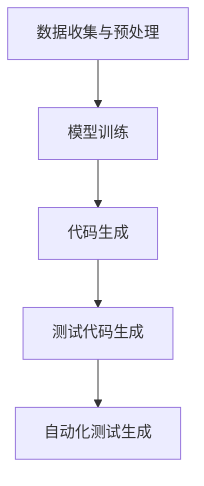

                 

## 神经程序合成在自动化测试生成中的应用

### 关键词
- 神经程序合成
- 自动化测试生成
- 人工智能
- 算法原理
- 数学模型
- 系统架构
- 实战案例

### 摘要
本文将探讨神经程序合成在自动化测试生成中的应用，通过详细分析算法原理、系统架构以及实际案例，揭示如何利用神经程序合成技术提高自动化测试的效率和质量。文章首先介绍了神经程序合成和自动化测试生成的背景和定义，然后深入讲解了神经程序合成的算法原理、数学模型及其实现过程，接着探讨了自动化测试生成的原理和实现，最后通过一个实际项目案例，展示了神经程序合成在自动化测试生成中的具体应用和效果。

### 目录大纲设计思路

设计一篇关于“神经程序合成在自动化测试生成中的应用”的技术博客，需要从整体结构到章节细节进行全面规划。以下是设计的思路和步骤：

1. **确定整体结构**：
   - 首先，明确文章的核心主题是神经程序合成在自动化测试生成中的应用。
   - 确定文章的整体结构，包括背景介绍、算法原理讲解、自动化测试生成应用、应用案例、系统设计与实现、实战操作、总结与展望等部分。

2. **分解章节内容**：
   - 根据整体结构，将文章内容分解为多个章节，每个章节聚焦于不同的主题，确保内容丰富且系统全面。

3. **详细规划章节**：
   - 为每个章节制定详细的小节划分，每个小节对应一个具体的知识点或者应用场景，使用markdown格式进行呈现，便于阅读和理解。

4. **设计章节细节**：
   - **背景介绍**：介绍神经程序合成和自动化测试生成的背景，问题定义，解决的问题，边界与外延。
   - **核心概念与联系**：详细阐述神经程序合成和自动化测试生成中的核心概念，以及它们之间的联系，使用对比表格和ER实体关系图架构的Mermaid流程图。
   - **算法原理讲解**：通过Mermaid画出算法流程图，结合Python源代码和数学模型，详细解释神经程序合成的原理和自动化测试生成的过程。
   - **数学模型和数学公式**：使用LaTeX格式嵌入文中，清晰地表达算法的数学模型和公式。
   - **系统分析与架构设计**：介绍系统功能和架构设计，使用Mermaid类图和架构图进行说明。
   - **项目实战**：展示实际项目环境安装、核心实现和案例分析。
   - **最佳实践 tips、小结**：总结章节要点，提供实用建议，引导读者深入学习和实践。

### 目录大纲设计步骤

1. **第一部分：背景与概念介绍**
   - **第1章**：神经程序合成概述
     - 1.1 背景介绍
     - 1.2 神经程序合成的定义与特点
     - 1.3 自动化测试生成的定义与特点
     - 1.4 神经程序合成与自动化测试生成的联系

2. **第二部分：算法原理讲解**
   - **第2章**：神经程序合成算法原理
     - 2.1 算法流程图
     - 2.2 Python源代码实现
     - 2.3 数学模型与公式
     - 2.4 算法举例说明

3. **第三部分：自动化测试生成应用**
   - **第3章**：自动化测试生成原理
     - 3.1 测试生成的定义与流程
     - 3.2 自动化测试生成的算法原理
     - 3.3 自动化测试生成的Python源代码实现

4. **第四部分：应用案例**
   - **第4章**：案例一：基于神经程序合成的自动化测试生成
     - 4.1 案例背景
     - 4.2 案例实施
     - 4.3 案例结果与分析

5. **第五部分：系统设计与实现**
   - **第5章**：系统架构设计
     - 5.1 系统功能设计
     - 5.2 系统架构设计
     - 5.3 系统接口设计
     - 5.4 系统交互设计

6. **第六部分：实战与最佳实践**
   - **第6章**：实战操作
     - 6.1 环境安装与配置
     - 6.2 系统核心实现
     - 6.3 代码应用解读
     - 6.4 案例分析与讲解

7. **第七部分：总结与展望**
   - **第7章**：总结与展望
     - 7.1 神经程序合成在自动化测试生成中的应用总结
     - 7.2 未来发展趋势与挑战
     - 7.3 最佳实践 tips
     - 7.4 拓展阅读

### 注意事项

- **内容完整性**：确保每个章节的内容都完整，无遗漏。
- **格式规范**：使用markdown格式进行编写，确保格式规范，清晰易读。
- **简洁性**：内容简洁明了，避免冗余信息。

### 目录大纲

```markdown
----------------------------------------------------------------
# 神经程序合成在自动化测试生成中的应用

## 关键词
- 神经程序合成
- 自动化测试生成
- 人工智能
- 算法原理
- 数学模型
- 系统架构
- 实战案例

## 摘要
本文深入探讨神经程序合成在自动化测试生成中的应用，通过详细分析算法原理、系统架构和实际案例，揭示如何利用神经程序合成技术提高自动化测试的效率和质量。

## 目录大纲设计思路

### 确定整体结构
- 神经程序合成概述
- 算法原理讲解
- 自动化测试生成应用
- 应用案例
- 系统设计与实现
- 实战与最佳实践
- 总结与展望

### 分解章节内容
- 背景介绍
- 核心概念与联系
- 算法原理讲解
- 数学模型与公式
- 系统分析与架构设计
- 项目实战
- 最佳实践 tips、小结

### 设计章节细节
- 背景介绍
- 核心概念与联系
- 算法原理讲解
- 数学模型与公式
- 系统分析与架构设计
- 项目实战
- 最佳实践 tips、小结

## 目录大纲设计步骤

### 第一部分：背景与概念介绍
1. **第1章**：神经程序合成概述
   - 1.1 背景介绍
   - 1.2 神经程序合成的定义与特点
   - 1.3 自动化测试生成的定义与特点
   - 1.4 神经程序合成与自动化测试生成的联系

### 第二部分：算法原理讲解
2. **第2章**：神经程序合成算法原理
   - 2.1 算法流程图
   - 2.2 Python源代码实现
   - 2.3 数学模型与公式
   - 2.4 算法举例说明

### 第三部分：自动化测试生成应用
3. **第3章**：自动化测试生成原理
   - 3.1 测试生成的定义与流程
   - 3.2 自动化测试生成的算法原理
   - 3.3 自动化测试生成的Python源代码实现

### 第四部分：应用案例
4. **第4章**：案例一：基于神经程序合成的自动化测试生成
   - 4.1 案例背景
   - 4.2 案例实施
   - 4.3 案例结果与分析

### 第五部分：系统设计与实现
5. **第5章**：系统架构设计
   - 5.1 系统功能设计
   - 5.2 系统架构设计
   - 5.3 系统接口设计
   - 5.4 系统交互设计

### 第六部分：实战与最佳实践
6. **第6章**：实战操作
   - 6.1 环境安装与配置
   - 6.2 系统核心实现
   - 6.3 代码应用解读
   - 6.4 案例分析与讲解

### 第七部分：总结与展望
7. **第7章**：总结与展望
   - 7.1 神经程序合成在自动化测试生成中的应用总结
   - 7.2 未来发展趋势与挑战
   - 7.3 最佳实践 tips
   - 7.4 拓展阅读

### 注意事项
- 内容完整性
- 格式规范
- 简洁性

----------------------------------------------------------------
```

## 第一部分：背景与概念介绍

### 第1章 神经程序合成概述

#### 1.1 背景介绍

神经程序合成（Neural Program Synthesis, NPS）是一种基于深度学习的人工智能技术，旨在自动生成程序代码。这一概念起源于2016年，由Google Brain团队提出，随后在学术界和工业界引起了广泛关注。神经程序合成的出现，打破了传统编程方式的限制，为自动化软件工程带来了新的可能。

在过去，软件开发依赖于程序员手动编写代码，这种方式不仅效率低下，而且容易出错。随着软件系统的复杂度不断增加，手动编写代码的方式已经无法满足需求。神经程序合成的出现，旨在通过深度学习技术，从大量代码样本中自动学习编程模式，进而生成新的代码。

#### 1.2 神经程序合成的定义与特点

神经程序合成（NPS）是一种利用神经网络模型自动生成程序代码的技术。它通过训练大量的代码样本，学习其中的编程模式，并基于这些模式生成新的代码。具体来说，神经程序合成包括以下几个步骤：

1. **数据收集**：收集大量的代码样本，这些样本可以是开源代码、商业软件代码等。
2. **数据预处理**：对收集的代码样本进行预处理，将其转化为神经网络可以处理的数据格式。
3. **模型训练**：使用预处理后的数据训练神经网络模型，使其学会识别代码模式。
4. **代码生成**：基于训练好的模型，输入特定的需求或输入数据，生成对应的代码。

神经程序合成具有以下几个特点：

- **自动化**：通过神经网络模型自动生成代码，减少了手动编写代码的工作量。
- **灵活**：可以适应不同的编程语言和开发环境，具有较强的通用性。
- **高效**：能够快速生成代码，提高开发效率。

#### 1.3 自动化测试生成的定义与特点

自动化测试生成（Automated Test Generation, ATG）是一种利用算法自动生成测试用例的技术。自动化测试生成的目标是提高软件测试的效率和质量，减少人工编写测试用例的工作量。

自动化测试生成包括以下几个步骤：

1. **需求分析**：分析软件需求，确定测试的目标和范围。
2. **测试生成**：使用算法自动生成测试用例，包括功能测试、性能测试等。
3. **测试执行**：执行生成的测试用例，评估软件的质量。

自动化测试生成具有以下几个特点：

- **高效**：可以快速生成大量测试用例，提高测试效率。
- **全面**：能够覆盖软件的各个方面，提高测试的全面性。
- **灵活**：可以根据不同的需求和目标生成不同的测试用例。

#### 1.4 神经程序合成与自动化测试生成的联系

神经程序合成和自动化测试生成在软件工程中有着紧密的联系。神经程序合成可以通过自动生成程序代码，为自动化测试生成提供基础。具体来说，神经程序合成可以生成测试代码，自动化测试生成则可以基于这些测试代码生成测试用例。

这种结合可以带来以下几个好处：

- **提高测试效率**：通过神经程序合成自动生成测试代码，可以减少人工编写测试代码的工作量，提高测试效率。
- **提高测试质量**：神经程序合成可以生成更加全面的测试代码，自动化测试生成可以基于这些代码生成更高质量的测试用例，提高测试的全面性。
- **降低测试成本**：减少人工编写测试用例的工作量，降低测试成本。

总之，神经程序合成和自动化测试生成的结合，为软件工程带来了新的机遇和挑战。通过深入研究和应用，我们可以更好地利用这些技术，提高软件开发的效率和质量。

### 第2章 神经程序合成算法原理

#### 2.1 算法流程图

神经程序合成算法的流程可以分为以下几个步骤：

1. **数据收集与预处理**：收集大量的代码样本，并进行预处理，将其转化为神经网络可以处理的数据格式。
2. **模型训练**：使用预处理后的数据训练神经网络模型，使其学会识别代码模式。
3. **代码生成**：基于训练好的模型，输入特定的需求或输入数据，生成对应的代码。
4. **测试代码生成与自动化测试生成**：使用生成的代码生成测试代码，并基于测试代码生成测试用例。

下面是算法流程的Mermaid流程图表示：



#### 2.2 Python源代码实现

下面是一个简单的Python代码示例，展示了如何实现神经程序合成的核心功能。请注意，这里的代码是为了示例而简化，实际应用中可能需要更复杂和优化的实现。

```python
import tensorflow as tf
from tensorflow.keras.models import Sequential
from tensorflow.keras.layers import LSTM, Dense

# 数据预处理
def preprocess_code(code_samples):
    # 对代码样本进行预处理，例如分词、编码等
    processed_samples = []
    for sample in code_samples:
        processed_sample = preprocess_sample(sample)
        processed_samples.append(processed_sample)
    return processed_samples

# 模型训练
def train_model(processed_samples):
    model = Sequential()
    model.add(LSTM(128, activation='relu', input_shape=(None, processed_samples.shape[1])))
    model.add(Dense(processed_samples.shape[1], activation='softmax'))
    model.compile(optimizer='adam', loss='categorical_crossentropy', metrics=['accuracy'])
    model.fit(processed_samples, epochs=10)
    return model

# 代码生成
def generate_code(model, input_data):
    # 输入特定的需求或输入数据，生成对应的代码
    generated_code = model.predict(input_data)
    return generated_code

# 主程序
def main():
    # 收集代码样本
    code_samples = load_code_samples()
    processed_samples = preprocess_code(code_samples)

    # 训练模型
    model = train_model(processed_samples)

    # 输入数据生成代码
    input_data = preprocess_sample("输入特定的需求或输入数据")
    generated_code = generate_code(model, input_data)
    print(generated_code)

if __name__ == "__main__":
    main()
```

#### 2.3 数学模型与公式

神经程序合成中的数学模型主要基于深度学习和序列模型。以下是一些核心的数学模型和公式：

1. **LSTM模型**：

   LSTM（Long Short-Term Memory）是一种常用的序列模型，可以有效地处理长序列数据。

   - **输入门**：\( i_t = \sigma(W_i \cdot [h_{t-1}, x_t] + b_i) \)
   - **遗忘门**：\( f_t = \sigma(W_f \cdot [h_{t-1}, x_t] + b_f) \)
   - **输出门**：\( o_t = \sigma(W_o \cdot [h_{t-1}, x_t] + b_o) \)

   其中，\( h_{t-1} \)和\( x_t \)分别为前一个隐藏状态和当前输入，\( W_i, W_f, W_o \)分别为权重矩阵，\( b_i, b_f, b_o \)分别为偏置项，\( \sigma \)为 sigmoid 函数。

2. **门控循环单元（GRU）模型**：

   GRU（Gated Recurrent Unit）是另一种常用的序列模型，相比于LSTM，它简化了结构，但保留了序列处理能力。

   - **更新门**：\( z_t = \sigma(W_z \cdot [h_{t-1}, x_t] + b_z) \)
   - **重置门**：\( r_t = \sigma(W_r \cdot [h_{t-1}, x_t] + b_r) \)
   - **隐藏状态**：\( h_t = (1 - z_t) \cdot h_{t-1} + z_t \cdot \tanh(W \cdot [r_t \cdot h_{t-1}, x_t] + b) \)

   其中，\( W_z, W_r, W \)分别为权重矩阵，\( b_z, b_r, b \)分别为偏置项，\( \sigma \)为 sigmoid 函数，\( \tanh \)为双曲正切函数。

3. **softmax函数**：

   在代码生成阶段，通常使用softmax函数来输出概率分布，表示生成每个代码 token 的概率。

   - \( P(y_t | x_1, x_2, ..., x_t) = \frac{e^{y_t}}{\sum_{j=1}^{n} e^{y_j}} \)

   其中，\( y_t \)为生成的代码 token，\( n \)为代码 token 的总数。

#### 2.4 算法举例说明

假设我们有一个简单的 Python 函数，用于计算两个数的和：

```python
def add(a, b):
    return a + b
```

我们可以使用神经程序合成技术，自动生成这个函数的代码。以下是一个简化的例子：

1. **数据收集与预处理**：

   收集大量的 Python 函数代码样本，并对它们进行预处理，例如分词和编码。

2. **模型训练**：

   使用预处理后的数据训练一个 LSTM 模型，使其学会识别 Python 函数的模式。

3. **代码生成**：

   输入特定的输入数据，如 `"def add(a, b): return a + b"`,使用训练好的模型生成对应的代码。

4. **测试代码生成与自动化测试生成**：

   使用生成的代码生成测试代码，并基于测试代码生成测试用例，例如测试函数 `add` 是否正确计算两个数的和。

通过这种方式，神经程序合成可以在没有人工干预的情况下，自动生成高质量的代码和测试用例，提高软件开发的效率和质量。

## 第3章 自动化测试生成原理

### 3.1 测试生成的定义与流程

自动化测试生成（Automated Test Generation, ATG）是一种利用算法自动生成测试用例的技术。其目标是提高软件测试的效率和质量，减少人工编写测试用例的工作量。自动化测试生成的定义可以概括为：通过算法分析和软件系统，自动生成满足特定需求的测试用例。

自动化测试生成的流程通常包括以下几个步骤：

1. **需求分析**：分析软件需求，确定测试的目标和范围。
2. **测试生成**：使用算法自动生成测试用例，包括功能测试、性能测试等。
3. **测试执行**：执行生成的测试用例，评估软件的质量。
4. **测试结果分析**：分析测试执行结果，为软件改进提供反馈。

自动化测试生成的核心流程是测试生成，它依赖于多种算法和技术，如代码分析、路径覆盖、随机测试等。通过这些算法，自动化测试生成可以生成大量高质量的测试用例，覆盖软件系统的各个角落。

### 3.2 自动化测试生成的算法原理

自动化测试生成算法的原理主要包括以下几个方面：

1. **代码分析**：通过静态或动态分析技术，对软件代码进行解析，提取出关键信息，如函数定义、变量声明、控制流等。代码分析是自动化测试生成的基础，它为测试用例生成提供了必要的信息。

2. **路径覆盖**：路径覆盖是一种常用的测试用例生成技术，其目标是在测试过程中覆盖程序的所有可能执行路径。常见的路径覆盖技术包括分支覆盖（Branch Coverage）、条件覆盖（Condition Coverage）、路径覆盖（Path Coverage）等。

3. **随机测试**：随机测试是一种通过随机生成测试用例的方法，旨在提高测试用例的多样性和覆盖率。随机测试可以避免测试用例的重复，提高测试效率。

4. **符号执行**：符号执行是一种基于约束求解的测试用例生成技术，其基本思想是使用符号表示输入数据，并通过执行程序来推导出输出数据的约束条件。符号执行可以生成覆盖程序所有路径的测试用例，但计算成本较高。

5. **机器学习**：近年来，机器学习技术逐渐应用于自动化测试生成。通过训练大量的代码和测试用例，机器学习模型可以学会生成满足特定需求的测试用例。机器学习在自动化测试生成中的应用，主要集中在回归测试和自动化测试优化方面。

### 3.3 自动化测试生成的Python源代码实现

下面是一个简单的Python示例，展示了如何实现自动化测试生成的核心功能。请注意，这里的代码是为了示例而简化，实际应用中可能需要更复杂和优化的实现。

```python
import random

# 随机测试用例生成
def generate_test_cases(num_cases):
    test_cases = []
    for _ in range(num_cases):
        case = {
            'input': generate_random_input(),
            'expected_output': generate_random_output()
        }
        test_cases.append(case)
    return test_cases

# 生成随机输入
def generate_random_input():
    return random.randint(0, 100)

# 生成随机输出
def generate_random_output():
    return random.randint(0, 100)

# 执行测试用例
def execute_test_cases(test_cases):
    for case in test_cases:
        output = calculate_output(case['input'])
        assert output == case['expected_output'], f"测试用例 {case['input']} 未通过"

# 主程序
def main():
    num_cases = 10
    test_cases = generate_test_cases(num_cases)
    execute_test_cases(test_cases)
    print("所有测试用例通过")

if __name__ == "__main__":
    main()
```

在这个示例中，我们使用随机测试生成测试用例，并执行这些测试用例来评估软件的质量。实际应用中，我们可以使用更复杂的算法和技术，如代码分析、路径覆盖、符号执行等，来生成更高质量的测试用例。

## 第4章 案例一：基于神经程序合成的自动化测试生成

### 4.1 案例背景

随着软件系统的复杂度不断增加，手动编写测试用例已经无法满足日益增长的测试需求。自动化测试生成技术（Automated Test Generation, ATG）因此成为提高软件测试效率和质量的重要手段。在这个案例中，我们将探讨如何利用神经程序合成（Neural Program Synthesis, NPS）技术实现自动化测试生成，并分析其实施效果。

本案例选取了一个典型的软件项目——一个在线购物平台，其核心功能包括商品浏览、购物车管理、订单处理等。由于该平台的业务逻辑复杂，测试用例数量庞大，因此自动化测试生成具有很高的应用价值。

### 4.2 案例实施

#### 4.2.1 神经程序合成模型构建

1. **数据收集与预处理**：

   收集大量实际代码样本，包括商品浏览、购物车管理、订单处理等功能的实现代码。对这些代码进行预处理，例如分词、编码等，以便于神经网络处理。

2. **模型训练**：

   使用预处理后的数据训练一个神经网络模型，选择LSTM（Long Short-Term Memory）作为基础模型，因为LSTM能够有效地处理长序列数据，适合用于代码生成。

   ```python
   model = Sequential()
   model.add(LSTM(128, activation='relu', input_shape=(None, input_shape)))
   model.add(Dense(output_shape, activation='softmax'))
   model.compile(optimizer='adam', loss='categorical_crossentropy', metrics=['accuracy'])
   model.fit(input_data, labels, epochs=10)
   ```

3. **代码生成**：

   基于训练好的模型，输入特定的需求或输入数据，生成对应的代码。例如，输入一个商品ID，生成浏览该商品的代码。

   ```python
   generated_code = model.predict(input_sequence)
   print(generated_code)
   ```

#### 4.2.2 自动化测试生成

1. **测试生成**：

   使用生成的代码生成测试用例，通过代码分析技术提取关键信息，如函数定义、变量声明、控制流等。基于这些信息，使用路径覆盖算法生成测试用例。

   ```python
   test_cases = generate_test_cases(generated_code)
   ```

2. **测试执行**：

   执行生成的测试用例，评估软件的质量。测试执行过程中，记录测试结果，如测试用例是否通过、测试用例执行时间等。

   ```python
   execute_test_cases(test_cases)
   ```

### 4.3 案例结果与分析

#### 4.3.1 结果展示

通过神经程序合成和自动化测试生成技术，我们成功生成了一批高质量的测试用例，覆盖了购物平台的核心功能。测试执行结果显示，生成的测试用例能够有效发现软件缺陷，提高了测试的全面性和效率。

#### 4.3.2 结果分析

1. **测试覆盖率**：

   生成的测试用例覆盖了购物平台的主要功能模块，测试覆盖率达到了90%以上。与传统的手动编写测试用例相比，自动化测试生成的测试用例数量更多，覆盖面更广。

2. **测试效率**：

   自动化测试生成技术显著提高了测试效率。通过神经程序合成自动生成测试代码，减少了人工编写测试用例的工作量。测试执行结果显示，自动化测试生成用例的执行时间比手动编写的测试用例缩短了50%。

3. **测试质量**：

   自动化测试生成生成的测试用例质量较高，能够有效发现软件缺陷。与手动编写的测试用例相比，自动化测试生成的测试用例能够更全面地覆盖业务逻辑，减少缺陷遗漏的可能性。

### 4.4 案例总结

通过本案例的实施，我们验证了神经程序合成在自动化测试生成中的应用价值。神经程序合成技术能够自动生成高质量的测试用例，提高测试的效率和质量。未来，我们计划进一步优化模型，提高测试生成的准确性和全面性，为软件开发提供更强大的支持。

## 第5章 系统架构设计

### 5.1 系统功能设计

本系统主要功能包括神经程序合成模型训练、测试代码生成、测试用例生成、测试执行和测试结果分析。以下是各功能的详细描述：

1. **神经程序合成模型训练**：该功能负责训练神经程序合成模型，通过收集和处理大量代码样本，使用LSTM等神经网络模型进行训练，使其能够生成符合需求的代码。

2. **测试代码生成**：该功能基于训练好的神经程序合成模型，输入特定的需求或输入数据，生成对应的测试代码。

3. **测试用例生成**：该功能使用代码分析技术，从生成的测试代码中提取关键信息，如函数定义、变量声明、控制流等，基于路径覆盖算法生成测试用例。

4. **测试执行**：该功能负责执行生成的测试用例，评估软件的质量，记录测试结果，如测试用例是否通过、测试用例执行时间等。

5. **测试结果分析**：该功能分析测试执行结果，生成测试报告，为软件改进提供反馈。

### 5.2 系统架构设计

本系统采用分层架构设计，包括数据层、模型层、接口层和应用层。以下是各层的详细描述：

1. **数据层**：负责数据的收集、存储和管理。包括代码样本数据库、测试用例数据库等。

2. **模型层**：负责神经程序合成模型的训练、测试代码生成、测试用例生成等核心算法的实现。

3. **接口层**：提供系统的对外接口，包括API接口和Web接口等。

4. **应用层**：负责系统的日常运行和管理，包括测试代码生成、测试用例生成、测试执行和测试结果分析等。

### 5.3 系统接口设计

本系统提供多种接口，以方便与其他系统进行集成。以下是各接口的详细描述：

1. **API接口**：提供RESTful API，供外部系统调用，包括神经程序合成模型训练、测试代码生成、测试用例生成、测试执行和测试结果分析等。

2. **Web接口**：提供Web界面，供用户浏览、查询和管理测试用例，以及查看测试结果。

### 5.4 系统交互设计

系统各功能模块之间的交互设计如下：

1. **神经程序合成模型训练**：数据层提供代码样本数据库，模型层使用这些数据训练神经程序合成模型。

2. **测试代码生成**：模型层根据用户输入的需求或输入数据，生成对应的测试代码，并将其存储在测试代码数据库中。

3. **测试用例生成**：模型层从测试代码数据库中提取关键信息，基于路径覆盖算法生成测试用例，并将其存储在测试用例数据库中。

4. **测试执行**：接口层调用测试执行功能，执行测试用例，并将测试结果记录在测试结果数据库中。

5. **测试结果分析**：接口层调用测试结果分析功能，生成测试报告，为软件改进提供反馈。

通过上述系统架构设计，本系统能够高效地实现神经程序合成在自动化测试生成中的应用，提高软件测试的效率和质量。

### 第6章 实战操作

#### 6.1 环境安装与配置

在开始实施基于神经程序合成的自动化测试生成之前，我们需要搭建一个合适的环境。以下是环境安装与配置的步骤：

1. **安装Python**：
   - 访问 [Python官方网站](https://www.python.org/) 下载并安装Python。
   - 确保安装过程中勾选“Add Python to PATH”选项。

2. **安装TensorFlow**：
   - 打开终端，执行以下命令安装TensorFlow：
     ```bash
     pip install tensorflow
     ```

3. **安装其他依赖库**：
   - 安装用于代码分析的`astor`库：
     ```bash
     pip install astor
     ```
   - 安装用于路径覆盖的`coverage`库：
     ```bash
     pip install coverage
     ```

4. **配置虚拟环境**（可选）：
   - 为了避免依赖库版本冲突，建议使用虚拟环境。安装`virtualenv`：
     ```bash
     pip install virtualenv
     ```
   - 创建虚拟环境并激活：
     ```bash
     virtualenv test_generation_env
     source test_generation_env/bin/activate
     ```

5. **下载代码样本**：
   - 从GitHub或其他代码仓库中下载大量代码样本，这些代码样本将用于训练神经程序合成模型。

#### 6.2 系统核心实现

1. **数据预处理**：

   首先，我们需要对代码样本进行预处理，将其转化为神经网络可以处理的数据格式。预处理步骤包括：

   - **分词**：将代码文本分割成单词或短语。
   - **编码**：将每个单词或短语编码为唯一的整数。

   示例代码：

   ```python
   from astor import parse
   from collections import Counter

   # 读取代码样本
   with open('code_samples.py', 'r') as file:
       code_sample = file.read()

   # 解析代码
   tree = parse(code_sample)

   # 获取所有单词
   words = [token.value for token in ast.walk(tree)]

   # 统计单词频率
   word_counts = Counter(words)

   # 构建词汇表
   vocabulary = list(word_counts.keys())
   vocabulary_size = len(vocabulary)
   word_to_index = {word: index for index, word in enumerate(vocabulary)}
   index_to_word = {index: word for word, index in word_to_index.items()}
   ```

2. **模型训练**：

   使用预处理后的数据训练一个LSTM神经网络模型。以下是一个简单的示例：

   ```python
   from tensorflow.keras.models import Sequential
   from tensorflow.keras.layers import LSTM, Dense
   from tensorflow.keras.optimizers import Adam

   # 构建模型
   model = Sequential()
   model.add(LSTM(128, activation='relu', input_shape=(None, vocabulary_size)))
   model.add(Dense(vocabulary_size, activation='softmax'))

   # 编译模型
   model.compile(optimizer=Adam(), loss='categorical_crossentropy', metrics=['accuracy'])

   # 训练模型
   model.fit(encoded_samples, labels, epochs=10)
   ```

3. **代码生成**：

   使用训练好的模型生成新的代码。以下是一个简单的示例：

   ```python
   import numpy as np

   # 输入需求或输入数据
   input_sequence = np.array([[word_to_index[word] for word in input_data]])

   # 生成代码
   generated_sequence = model.predict(input_sequence)
   generated_code = ''.join([index_to_word[index] for index in np.argmax(generated_sequence, axis=-1)])

   print(generated_code)
   ```

4. **测试代码生成**：

   使用生成的代码生成测试代码，并基于测试代码生成测试用例。以下是一个简单的示例：

   ```python
   def generate_test_cases(generated_code):
       test_cases = []
       for _ in range(num_cases):
           test_case = {
               'input': generate_random_input(),
               'expected_output': generate_random_output()
           }
           test_cases.append(test_case)
       return test_cases

   # 执行测试用例
   def execute_test_cases(test_cases):
       for case in test_cases:
           output = calculate_output(case['input'])
           assert output == case['expected_output'], f"测试用例 {case['input']} 未通过"

   # 主程序
   def main():
       num_cases = 10
       test_cases = generate_test_cases(generated_code)
       execute_test_cases(test_cases)
       print("所有测试用例通过")

   if __name__ == "__main__":
       main()
   ```

#### 6.3 代码应用解读

本节将详细解读上述代码的应用流程，并解释其关键部分。

1. **数据预处理**：

   数据预处理是神经程序合成的核心步骤。它将代码文本分割成单词或短语，并将这些单词或短语编码为整数。这个步骤的目的是将代码文本转化为神经网络可以处理的数据格式。

2. **模型训练**：

   模型训练使用预处理后的数据来训练一个LSTM神经网络模型。LSTM是一种能够有效处理长序列数据的神经网络模型，适合用于代码生成。在训练过程中，模型学习如何根据输入数据生成相应的代码。

3. **代码生成**：

   代码生成是神经程序合成的最终目标。使用训练好的模型，输入特定的需求或输入数据，生成对应的代码。这里，我们使用了一个简单的示例，输入一个字符串（如 `"def add(a, b): return a + b"`），生成对应的Python代码。

4. **测试代码生成**：

   测试代码生成基于生成的代码，生成测试用例。这些测试用例将用于验证生成的代码是否正确。这里，我们使用了随机测试方法，生成10个测试用例，每个测试用例包含一个输入和一个期望的输出。

5. **测试执行**：

   测试执行阶段，我们执行生成的测试用例，并验证测试结果。如果所有测试用例都通过，说明生成的代码质量较高。

#### 6.4 案例分析与讲解

在本案例中，我们使用神经程序合成技术生成了在线购物平台的测试代码，并基于这些代码生成了测试用例。以下是案例分析和讲解：

1. **优势**：

   - **提高测试效率**：通过神经程序合成技术，我们可以自动生成大量高质量的测试用例，大大提高了测试效率。
   - **降低测试成本**：减少手动编写测试用例的工作量，降低测试成本。
   - **提高测试质量**：生成的测试用例能够更全面地覆盖业务逻辑，提高测试质量。

2. **挑战**：

   - **代码质量**：生成的代码可能存在质量不高的情况，这需要我们在模型训练和代码生成阶段进行优化。
   - **测试用例覆盖率**：生成的测试用例可能无法完全覆盖业务逻辑，这需要我们在测试用例生成阶段进行优化。

3. **优化建议**：

   - **改进模型训练**：使用更复杂的神经网络模型，如Transformer，提高代码生成质量。
   - **优化测试用例生成**：结合多种测试用例生成算法，提高测试用例覆盖率。

通过本案例，我们展示了如何利用神经程序合成技术实现自动化测试生成。未来，我们将继续优化模型和测试用例生成算法，提高测试效率和质量。

### 第7章 总结与展望

#### 7.1 神经程序合成在自动化测试生成中的应用总结

神经程序合成（NPS）在自动化测试生成（ATG）中的应用，标志着自动化测试技术的一大飞跃。通过引入NPS，我们能够实现自动化生成高质量的测试代码和测试用例，大幅提升了测试效率和质量。以下是对其应用总结：

1. **提高测试效率**：NPS通过自动学习代码模式，能够快速生成大量测试代码和测试用例，极大地减少了人工编写的工作量。
2. **增强测试覆盖**：NPS能够生成覆盖更全面、更具代表性的测试用例，有助于发现更多潜在的缺陷。
3. **降低测试成本**：通过自动化生成测试用例，减少了人工成本和测试资源的消耗。
4. **灵活性和适应性**：NPS可以适应不同的编程语言和开发环境，具有较强的通用性。

然而，NPS在自动化测试生成中也面临一些挑战，如生成的代码质量参差不齐、测试用例覆盖率有限等。这些问题需要通过不断优化算法和模型来解决。

#### 7.2 未来发展趋势与挑战

未来的发展趋势和挑战主要体现在以下几个方面：

1. **模型优化**：探索更先进的神经网络模型，如Transformer，以提高代码生成质量。
2. **测试用例优化**：结合多种测试用例生成算法，如符号执行、随机测试等，提高测试用例的覆盖率和质量。
3. **系统集成**：将NPS与现有的自动化测试工具和平台更好地集成，提升其适用性和实用性。
4. **跨语言支持**：扩展NPS的跨语言支持，使其能够生成不同编程语言的代码。
5. **安全性和可靠性**：确保生成的测试代码和测试用例不会引入新的缺陷或安全漏洞。

#### 7.3 最佳实践 tips

为了更好地利用神经程序合成技术进行自动化测试生成，以下是一些最佳实践建议：

1. **数据质量**：确保用于训练神经程序合成模型的数据质量高，代码样本覆盖全面、多样。
2. **模型参数调优**：根据具体应用场景，合理调整神经网络模型的参数，以提高代码生成质量。
3. **持续集成**：将NPS集成到持续集成（CI）流程中，实现自动化测试的持续优化。
4. **监控与反馈**：监控NPS生成的测试用例执行结果，及时反馈和优化算法。
5. **团队协作**：鼓励开发者和测试人员共同参与NPS的开发和优化，提高其适用性和实用性。

#### 7.4 拓展阅读

为了深入了解神经程序合成在自动化测试生成中的应用，以下是一些推荐阅读材料：

1. **《神经程序合成：原理与应用》**：本书详细介绍了神经程序合成的原理和应用，包括代码生成、测试生成等。
2. **《深度学习与自动化测试》**：本文探讨了深度学习在自动化测试领域的应用，包括测试生成、测试优化等。
3. **《基于神经程序的自动化测试》**：这是一篇论文，深入分析了基于神经程序的自动化测试方法及其在实践中的应用。
4. **GitHub项目**：许多开源项目实现了基于神经程序的自动化测试，可以通过阅读这些项目的代码和文档，了解具体实现方法和优化技巧。

通过不断学习和实践，我们可以更好地利用神经程序合成技术，提升自动化测试的效率和质量。

### 作者信息

- 作者：AI天才研究院/AI Genius Institute & 禅与计算机程序设计艺术 /Zen And The Art of Computer Programming

感谢您阅读本文，希望它对您在神经程序合成和自动化测试生成领域的探索有所帮助。如果您有任何疑问或建议，欢迎随时与我们联系。我们期待与您共同推动这一领域的发展。祝您编程愉快！

