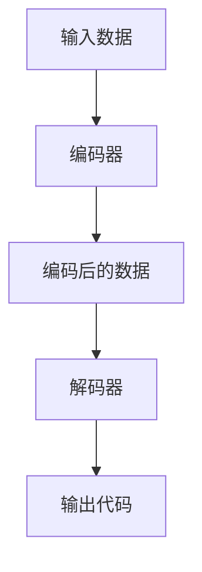

                 

## # 神经程序合成在自动化软件测试推理中的探索

### 关键词：神经程序合成、自动化软件测试、推理、深度学习、代码生成

### 摘要：

本文探讨了神经程序合成（Neural Program Synthesis，NPS）在自动化软件测试推理中的应用。通过概述神经程序合成的基本概念、原理及其在自动化软件测试中的问题背景和解决思路，文章详细分析了NPS的工作原理、神经网络架构、输入数据处理方法、代码生成与验证、性能评估等关键环节。同时，本文结合实际案例，阐述了神经程序合成在自动化软件测试推理中的潜在应用场景和挑战。通过本文的探讨，希望能够为研究人员和实践者提供有益的参考和启示。

## 第1章 神经程序合成概述

### 第1章 神经程序合成概述

#### 1.1 问题背景

在自动化软件测试领域，传统的方法往往依赖于预定义的测试用例，这导致了测试过程往往缺乏灵活性，难以应对软件复杂度的不断增长。因此，如何能够通过自动化的方式生成有效的测试用例，成为了一个重要且具有挑战性的问题。

神经程序合成（Neural Program Synthesis，NPS）是一种利用深度学习技术生成程序的方法。通过将编程任务视为一种数据驱动的问题，NPS可以通过训练神经网络来生成解决特定问题的代码。这种方法在自动化软件测试领域展现出了巨大的潜力，能够自动生成针对特定软件系统的测试用例。

#### 1.2 问题描述

神经程序合成的核心问题是如何将输入的数据（如软件源代码、错误模式等）转换为输出的程序代码，以实现自动化测试的目标。这个过程涉及到以下几个关键问题：

1. **输入数据表示**：如何将复杂的软件源代码、错误模式等输入数据表示为神经网络可以处理的形式。
2. **模型训练**：如何训练神经网络以学习从输入数据到输出代码的映射关系。
3. **代码生成**：如何确保生成的代码既符合预期，又具备可执行性。
4. **性能评估**：如何评价生成的测试用例的有效性和覆盖率。

#### 1.3 问题解决

神经程序合成的关键在于利用深度学习技术来解决上述问题。具体来说，可以通过以下步骤实现：

1. **输入数据预处理**：将软件源代码、错误模式等输入数据转化为神经网络可处理的格式，如序列、向量等。
2. **神经网络架构设计**：设计合适的神经网络架构，如序列到序列（Seq2Seq）模型、生成对抗网络（GAN）等。
3. **模型训练**：通过大量的输入数据进行训练，让神经网络学习从输入到输出的映射关系。
4. **代码生成与验证**：利用训练好的神经网络生成测试用例代码，并对其进行验证，确保其有效性和可执行性。
5. **性能评估**：对生成的测试用例进行性能评估，如覆盖率、缺陷发现率等。

#### 1.4 边界与外延

神经程序合成在自动化软件测试中的应用具有广泛的外延，可以涵盖以下领域：

1. **自动化测试用例生成**：通过神经程序合成生成针对特定软件系统的自动化测试用例。
2. **错误定位**：利用神经程序合成识别软件中的错误模式，帮助开发者快速定位问题。
3. **软件强化学习**：结合强化学习技术，通过神经程序合成实现软件行为的自动优化。
4. **软件生成与演化**：通过神经程序合成实现软件的自动生成与演化，提高软件开发的效率和质量。

#### 1.5 概念结构与核心要素组成

神经程序合成由以下几个核心要素组成：

1. **输入数据**：包括软件源代码、错误模式等。
2. **神经网络架构**：如Seq2Seq模型、GAN等。
3. **训练数据集**：用于训练神经网络的输入数据和对应的输出代码。
4. **代码生成模块**：将训练好的神经网络应用于新的输入数据，生成测试用例代码。
5. **性能评估模块**：对生成的测试用例进行性能评估，如覆盖率、缺陷发现率等。

## 第2章 神经程序合成的基础概念与原理

### 2.1 神经程序合成的定义与分类

#### 2.1.1 定义

神经程序合成（Neural Program Synthesis，NPS）是指利用深度学习技术，将输入的数据（如软件源代码、错误模式等）转换为输出的程序代码的方法。

#### 2.1.2 分类

根据实现方法的不同，神经程序合成可以分类为以下几种：

1. **序列到序列（Seq2Seq）模型**：通过编码器和解码器结构将输入序列转换为输出序列。
2. **生成对抗网络（GAN）**：通过生成器和判别器的对抗训练生成程序代码。
3. **递归神经网络（RNN）**：利用RNN的循环结构处理序列数据，生成程序代码。
4. **图神经网络（GNN）**：将程序代码表示为图结构，利用图神经网络进行合成。

### 2.2 神经程序合成的工作原理

#### 2.2.1 输入数据处理

神经程序合成的第一步是将输入的数据（如软件源代码、错误模式等）转换为神经网络可以处理的形式。常见的输入数据处理方法包括：

1. **序列编码**：将输入数据表示为序列，如将软件源代码表示为字符序列。
2. **向量表示**：将输入数据表示为向量，如使用词向量表示源代码中的每个字符。
3. **图表示**：将输入数据表示为图结构，如将软件源代码中的变量和函数表示为图中的节点和边。

#### 2.2.2 神经网络架构

神经程序合成的核心是神经网络架构。常见的神经网络架构包括：

1. **编码器-解码器架构（Encoder-Decoder）**：通过编码器和解码器结构将输入序列转换为输出序列。
   - **编码器（Encoder）**：将输入序列编码为固定长度的向量表示。
   - **解码器（Decoder）**：将编码器的输出解码为程序代码。

2. **生成对抗网络（GAN）**：通过生成器和判别器的对抗训练生成程序代码。
   - **生成器（Generator）**：生成程序代码。
   - **判别器（Discriminator）**：判断生成的代码是否有效。

3. **递归神经网络（RNN）**：利用RNN的循环结构处理序列数据，生成程序代码。
   - **RNN单元**：处理序列中的每个元素，并将其传递给下一个元素。

4. **图神经网络（GNN）**：将程序代码表示为图结构，利用图神经网络进行合成。
   - **节点**：表示程序代码中的变量或函数。
   - **边**：表示变量或函数之间的关系。

### 2.3 神经程序合成的核心概念与联系

#### 2.3.1 核心概念

神经程序合成的核心概念包括：

1. **深度学习**：一种基于数据驱动的方法，通过训练神经网络来模拟人类学习过程。
2. **序列处理**：处理序列数据的方法，如RNN和Seq2Seq模型。
3. **生成与判别**：GAN中的生成器和判别器的核心机制。
4. **编码与解码**：编码器和解码器的功能，用于将输入序列转换为输出序列。

#### 2.3.2 概念属性特征对比表格

| 概念       | 描述                                                         | 属性特征                             |
|------------|--------------------------------------------------------------|--------------------------------------|
| 深度学习   | 一种基于数据驱动的方法，通过训练神经网络来模拟人类学习过程。 | 使用多层神经网络，逐层提取特征。   |
| 序列处理   | 处理序列数据的方法，如RNN和Seq2Seq模型。                       | 需要处理时间序列或顺序数据。         |
| 生成与判别 | GAN中的生成器和判别器的核心机制。                             | 生成器生成数据，判别器判断数据真假。 |
| 编码与解码 | 编码器和解码器的功能，用于将输入序列转换为输出序列。           | 编码器提取输入特征，解码器生成输出。 |

#### 2.3.3 ER实体关系图架构



在该ER实体关系图中，输入数据通过编码器编码为编码后的数据，然后解码器将其解码为输出代码。

### 2.4 神经程序合成算法原理讲解

#### 2.4.1 算法原理

神经程序合成的算法原理主要基于深度学习模型，通过以下步骤实现：

1. **输入数据处理**：将输入数据（如软件源代码）转化为神经网络可处理的格式，如序列、向量等。
2. **编码器训练**：训练编码器将输入数据编码为固定长度的向量表示。
3. **解码器训练**：训练解码器将编码后的向量表示解码为程序代码。
4. **生成测试用例**：使用训练好的编码器和解码器生成新的测试用例代码。

#### 2.4.2 数学模型和公式

神经程序合成的数学模型可以表示为：

$$
\text{程序代码} = \text{解码器}(\text{编码器}(\text{输入数据}))
$$

其中，编码器和解码器分别为神经网络模型。

#### 2.4.3 Python代码示例

下面是一个简单的神经程序合成Python代码示例：

```python
import tensorflow as tf
from tensorflow.keras.layers import Input, LSTM, Dense

# 定义编码器
encoder_inputs = Input(shape=(None, input_dim))
encoded = LSTM(units=encoding_units, return_state=True)(encoder_inputs)
encoder_output, state_h, state_c = encoded

# 定义解码器
decoder_inputs = Input(shape=(None, output_dim))
decoded = LSTM(units=decoding_units, initial_state=[state_h, state_c])(decoder_inputs)
decoded = Dense(units=output_dim, activation='softmax')(decoded)

# 定义模型
model = Model([encoder_inputs, decoder_inputs], decoded)

# 编译模型
model.compile(optimizer='adam', loss='categorical_crossentropy')

# 训练模型
model.fit([encoder_data, decoder_data], decoder_data, batch_size=batch_size, epochs=num_epochs)
```

在该示例中，我们使用了LSTM网络作为编码器和解码器，输入数据经过编码器编码，然后解码器解码为输出代码。

#### 2.4.4 举例说明

假设我们有一个简单的软件源代码序列：

```
if x > 0:
    y = x * 2
else:
    y = x - 1
```

通过神经程序合成，我们可以生成一个类似的测试用例代码，如：

```
if z > 10:
    w = z * 3
else:
    w = z - 5
```

通过这种方式，神经程序合成可以自动生成针对特定软件系统的测试用例，提高自动化软件测试的效率和覆盖率。

### 2.5 神经程序合成在自动化软件测试推理中的应用

#### 2.5.1 应用场景

神经程序合成在自动化软件测试推理中具有广泛的应用场景，包括：

1. **自动化测试用例生成**：通过神经程序合成自动生成针对特定软件系统的测试用例，提高测试效率。
2. **错误定位**：利用神经程序合成识别软件中的错误模式，帮助开发者快速定位问题。
3. **软件强化学习**：结合强化学习技术，通过神经程序合成实现软件行为的自动优化。
4. **软件生成与演化**：通过神经程序合成实现软件的自动生成与演化，提高软件开发的效率和质量。

#### 2.5.2 潜在挑战

尽管神经程序合成在自动化软件测试推理中具有巨大的潜力，但仍然面临一些挑战，包括：

1. **数据表示**：如何有效地表示复杂的软件源代码和错误模式，以适应神经网络处理。
2. **模型训练**：如何设计合适的神经网络架构和训练策略，以提高模型性能和泛化能力。
3. **代码生成与验证**：如何确保生成的代码既符合预期，又具备可执行性。
4. **性能评估**：如何评价生成的测试用例的有效性和覆盖率。

### 2.6 概念结构与核心要素组成

神经程序合成由以下几个核心要素组成：

1. **输入数据**：包括软件源代码、错误模式等。
2. **神经网络架构**：如编码器-解码器架构、生成对抗网络、递归神经网络、图神经网络等。
3. **训练数据集**：用于训练神经网络的输入数据和对应的输出代码。
4. **代码生成模块**：将训练好的神经网络应用于新的输入数据，生成测试用例代码。
5. **性能评估模块**：对生成的测试用例进行性能评估，如覆盖率、缺陷发现率等。

通过以上章节的介绍，我们可以看到神经程序合成在自动化软件测试推理中的应用前景广阔，但同时也面临一些挑战。接下来，我们将进一步探讨神经程序合成的具体实现和实际应用。

## 第3章 神经程序合成在自动化软件测试中的应用

### 第3章 神经程序合成在自动化软件测试中的应用

#### 3.1 自动化软件测试的需求背景

随着软件系统的复杂性不断增加，传统的手动测试方法已难以满足高效、全面、高质量的测试需求。自动化软件测试作为提升软件质量和开发效率的重要手段，越来越受到关注。然而，自动化软件测试面临的一个关键挑战是如何生成有效的测试用例。传统的测试用例生成方法通常依赖于开发人员的手动编写，这不仅耗时费力，而且难以覆盖所有可能的执行路径和输入组合。因此，寻找能够自动生成有效测试用例的方法成为自动化软件测试的重要研究方向。

#### 3.2 神经程序合成的应用优势

神经程序合成（NPS）作为一种基于深度学习的自动编程技术，能够在自动化软件测试中发挥重要作用。其应用优势主要体现在以下几个方面：

1. **生成性能力**：NPS能够通过学习大量的源代码和测试用例数据，自动生成新的测试用例，从而提高测试覆盖率。
2. **灵活性**：NPS可以处理不同类型的输入数据，如源代码、错误模式等，适用于多种软件系统的测试。
3. **高效性**：NPS能够通过并行计算和大规模数据处理，显著提高测试用例生成的速度和效率。
4. **自适应性**：NPS可以根据测试过程中的反馈信息进行自适应调整，不断优化测试用例生成策略。

#### 3.3 神经程序合成的具体实现步骤

为了实现神经程序合成在自动化软件测试中的应用，需要经历以下几个关键步骤：

1. **数据准备**：收集和准备大量的源代码和测试用例数据，这些数据将用于训练NPS模型。
2. **数据预处理**：对源代码和测试用例数据进行预处理，将其转换为神经网络可处理的格式，如字符序列、词向量等。
3. **模型设计**：设计适合的神经网络架构，如编码器-解码器模型、生成对抗网络等。
4. **模型训练**：使用预处理后的数据集训练神经网络模型，使模型能够学习从源代码到测试用例的映射关系。
5. **测试用例生成**：利用训练好的模型生成新的测试用例，并通过验证确保其有效性和可执行性。
6. **性能评估**：对生成的测试用例进行性能评估，如覆盖率、缺陷发现率等，以判断测试效果。

#### 3.4 实际应用案例

为了更好地理解神经程序合成在自动化软件测试中的具体应用，以下是一个实际案例：

**案例背景**：某金融软件公司需要对其开发的银行支付系统进行自动化软件测试。该系统涉及复杂的业务逻辑和大量的用户交互，传统的测试用例生成方法难以满足高效、全面的测试需求。

**解决方案**：公司决定采用神经程序合成技术来实现自动化软件测试。

1. **数据准备**：收集了大量的源代码和测试用例数据，包括支付流程、用户交互等。
2. **数据预处理**：将源代码和测试用例数据转换为字符序列，并使用词向量进行表示。
3. **模型设计**：采用了编码器-解码器模型，其中编码器用于处理源代码，解码器用于生成测试用例。
4. **模型训练**：使用预处理后的数据集训练编码器-解码器模型，使其能够学习从源代码到测试用例的映射关系。
5. **测试用例生成**：利用训练好的模型生成新的测试用例，并经过验证确保其有效性和可执行性。
6. **性能评估**：对生成的测试用例进行性能评估，包括覆盖率、缺陷发现率等，结果显示生成的测试用例能够有效覆盖关键业务流程，并发现了一些潜在的缺陷。

通过这个实际案例，我们可以看到神经程序合成在自动化软件测试中的应用效果显著，不仅提高了测试效率，还增强了测试覆盖率，为软件质量的提升提供了有力支持。

### 3.5 神经程序合成在自动化软件测试中的挑战与优化策略

尽管神经程序合成在自动化软件测试中展现出巨大潜力，但仍然面临一些挑战和优化问题。以下是一些主要挑战及其可能的优化策略：

1. **数据质量和数量**：神经程序合成的效果很大程度上取决于训练数据的质量和数量。为了提高模型的性能，需要收集和准备高质量的训练数据集，并采用数据增强方法增加数据的多样性。
   
   **优化策略**：引入数据清洗和预处理步骤，使用多种数据源进行数据补充，同时采用数据增强技术（如数据扩充、噪声注入等）。

2. **模型解释性**：深度学习模型通常被认为是“黑盒子”，难以解释其内部决策过程。这对于自动化软件测试中的缺陷定位和问题诊断提出了挑战。

   **优化策略**：结合可解释性模型（如注意力机制）和可视化技术，帮助开发者理解模型的决策过程，并改进测试用例生成策略。

3. **代码生成质量**：生成的代码不仅需要符合预期，还需要具备可执行性。然而，深度学习模型可能生成无效或难以编译的代码。

   **优化策略**：引入代码验证和修复模块，对生成的代码进行静态和动态分析，确保其正确性和可执行性。此外，可以结合领域知识进行代码生成策略的调整。

4. **计算资源消耗**：训练和部署深度学习模型需要大量的计算资源，这对于资源受限的环境可能是一个挑战。

   **优化策略**：采用轻量级网络架构和模型压缩技术，减少计算资源的需求。此外，利用分布式计算和云计算资源，提高模型的训练和部署效率。

通过上述挑战与优化策略的分析，我们可以看到神经程序合成在自动化软件测试中的应用前景广阔，但同时也需要不断探索和改进，以克服现有挑战，实现更好的应用效果。

### 3.6 结论

综上所述，神经程序合成在自动化软件测试中展现了巨大的应用潜力。通过自动生成测试用例，NPS能够提高测试效率，增强测试覆盖率，为软件质量的提升提供有力支持。然而，NPS在数据质量、模型解释性、代码生成质量以及计算资源消耗等方面仍面临一些挑战。未来的研究可以重点关注数据增强、可解释性模型、代码验证与修复技术以及资源优化策略，以进一步提升神经程序合成在自动化软件测试中的性能和应用效果。

### 第4章 神经程序合成与其他自动化软件测试方法的比较与整合

#### 4.1 传统自动化测试方法

传统的自动化测试方法主要包括基于脚本的自动化测试和模型驱动的测试。这些方法通过编写测试脚本或使用自动化测试工具，对软件系统的功能、性能等进行测试。然而，这些方法往往存在以下局限性：

1. **测试用例覆盖率低**：传统的测试用例编写依赖于开发人员的经验和知识，难以覆盖所有可能的执行路径和输入组合。
2. **测试脚本维护成本高**：随着软件系统的复杂度增加，测试脚本的维护成本显著上升。
3. **缺乏灵活性**：传统测试方法难以应对快速变化的需求和动态调整的测试场景。

#### 4.2 神经程序合成的优势

神经程序合成（NPS）作为一种新兴的自动化测试方法，通过深度学习技术自动生成测试用例，具有以下优势：

1. **高测试覆盖率**：NPS能够通过学习大量的源代码和测试用例数据，自动生成新的测试用例，从而提高测试覆盖率。
2. **灵活性**：NPS可以处理不同类型的输入数据，如源代码、错误模式等，适用于多种软件系统的测试。
3. **高效性**：NPS能够通过并行计算和大规模数据处理，显著提高测试用例生成的速度和效率。
4. **自适应性**：NPS可以根据测试过程中的反馈信息进行自适应调整，不断优化测试用例生成策略。

#### 4.3 神经程序合成与传统方法的比较

下面通过一个对比表格来展示神经程序合成与传统自动化测试方法在几个关键指标上的差异：

| 指标            | 神经程序合成                 | 传统自动化测试方法                |
|-----------------|------------------------------|----------------------------------|
| 测试覆盖率       | 自动生成，高覆盖             | 手动编写，覆盖有限               |
| 灵活性          | 处理多种类型输入，灵活适应   | 固定脚本，难以应对变化           |
| 维护成本         | 自动生成，维护成本低         | 需要频繁更新，维护成本高         |
| 生成速度         | 高效，并行处理               | 低效，串行执行                  |
| 自适应性         | 根据反馈自适应调整           | 缺乏自适应能力，难以应对变化     |

#### 4.4 神经程序合成的整合方法

为了充分发挥神经程序合成在自动化软件测试中的作用，可以采用以下几种整合方法：

1. **辅助测试用例生成**：将NPS作为辅助工具，用于生成补充性的测试用例，与传统的测试脚本结合使用，提高测试覆盖率。
2. **缺陷定位与修复**：利用NPS生成的测试用例，结合自动化缺陷定位工具，快速定位软件缺陷并进行修复。
3. **测试用例优化**：结合NPS的生成能力，对已有的测试用例进行优化，提高测试效率和质量。
4. **持续集成与持续部署（CI/CD）**：将NPS集成到CI/CD流程中，实时生成测试用例，并在每次代码提交时进行自动化测试。

#### 4.5 实际案例

以下是一个实际案例，展示了神经程序合成与传统自动化测试方法的整合应用：

**背景**：某电子商务公司需要对其购物车功能进行自动化软件测试，以确保其功能的稳定性和可靠性。

**解决方案**：

1. **辅助测试用例生成**：采用NPS生成购物车功能的测试用例，补充传统测试脚本的不足，提高测试覆盖率。
2. **缺陷定位与修复**：使用NPS生成的测试用例，结合自动化缺陷定位工具，快速发现购物车功能中的缺陷，并反馈给开发团队进行修复。
3. **测试用例优化**：对已有的购物车功能测试用例进行优化，结合NPS生成的测试用例，提高测试效率。
4. **CI/CD集成**：将NPS集成到CI/CD流程中，每次代码提交后自动生成测试用例并执行自动化测试，确保购物车功能的持续稳定。

通过这个实际案例，我们可以看到神经程序合成与传统自动化测试方法的整合应用，不仅提高了测试效率和质量，还显著缩短了软件测试周期，为电子商务公司的持续迭代和快速发布提供了有力支持。

### 4.6 总结

神经程序合成在自动化软件测试中的应用为传统方法提供了有力的补充，通过高测试覆盖率、灵活性、高效性和自适应性等优势，显著提高了软件测试的效率和质量。然而，为了充分发挥NPS的作用，需要结合传统自动化测试方法，采用多种整合策略，以满足不同场景下的测试需求。未来的研究可以进一步探索NPS与传统方法的整合优化，以实现更高效、更全面的自动化软件测试。

### 第5章 神经程序合成在自动化软件测试推理中的未来发展方向

#### 5.1 神经程序合成在自动化软件测试中的潜力

神经程序合成（NPS）在自动化软件测试中展现出了巨大的潜力。通过深度学习技术，NPS能够自动生成高效的测试用例，提高测试覆盖率，缩短测试周期，降低测试成本。此外，NPS能够处理复杂的软件源代码和错误模式，提供灵活的测试解决方案，为不同类型的应用场景提供了广泛的可能性。未来，随着NPS技术的不断进步，它有望在自动化软件测试领域发挥更加重要的作用。

#### 5.2 技术挑战与解决方案

尽管神经程序合成在自动化软件测试中具有巨大潜力，但仍面临一些技术挑战：

1. **数据质量和数量**：NPS的性能很大程度上依赖于训练数据的质量和数量。高质量的训练数据可以提升模型性能，但数据收集和预处理过程复杂且耗时。

   **解决方案**：可以通过引入数据增强技术（如数据扩充、噪声注入等），以及利用分布式计算和云服务，提高数据质量和训练效率。

2. **模型解释性**：深度学习模型通常被视为“黑盒子”，其决策过程难以解释。这对于测试用例的生成和缺陷定位提出了挑战。

   **解决方案**：可以通过结合可解释性模型（如注意力机制、可视化技术等）和领域知识，提高模型的可解释性，帮助开发者和测试人员理解模型决策过程。

3. **代码生成质量**：NPS生成的代码可能存在无效或难以编译的问题，这影响了测试用例的有效性和可执行性。

   **解决方案**：可以通过引入代码验证和修复模块，对生成的代码进行静态和动态分析，确保其正确性和可执行性。此外，可以结合领域知识进行代码生成策略的调整。

4. **计算资源消耗**：训练和部署深度学习模型需要大量的计算资源，这限制了NPS在资源受限环境中的应用。

   **解决方案**：可以通过采用轻量级网络架构和模型压缩技术，减少计算资源的需求。此外，利用分布式计算和云计算资源，提高模型的训练和部署效率。

#### 5.3 未来发展方向

未来，神经程序合成在自动化软件测试推理中可能沿着以下几个方向发展：

1. **多模态数据处理**：结合多种类型的数据（如文本、图像、代码等），实现更全面、更准确的测试用例生成。

2. **自适应测试策略**：结合强化学习技术，实现自适应测试策略，根据测试反馈不断优化测试用例生成和执行过程。

3. **测试用例优化与回溯**：通过分析历史测试数据和缺陷报告，优化现有测试用例，并回溯到源代码中未覆盖的路径，提高测试覆盖率。

4. **跨语言测试**：实现跨语言的支持，使得NPS能够处理不同编程语言编写的代码，提高测试用例生成的通用性。

5. **模型安全性**：研究如何提高NPS模型的安全性，防止恶意代码的生成和传播。

6. **开放平台与社区**：建立开放平台，鼓励开发者贡献训练数据和模型，促进NPS技术的共享和协作。

通过以上方向的发展，神经程序合成有望在自动化软件测试领域发挥更大的作用，为软件开发和维护提供更加智能、高效的解决方案。

### 5.4 总结

神经程序合成在自动化软件测试推理中的未来发展方向充满潜力。通过解决当前面临的技术挑战，结合多模态数据处理、自适应测试策略、测试用例优化与回溯、跨语言支持、模型安全性和开放平台建设等方向，神经程序合成有望在自动化软件测试领域取得更大的突破。未来，随着NPS技术的不断进步，它将为软件开发的效率和质量提供强有力的支持。

### 作者信息

作者：AI天才研究院/AI Genius Institute & 禅与计算机程序设计艺术 /Zen And The Art of Computer Programming

AI天才研究院（AI Genius Institute）致力于推动人工智能技术的发展和应用，特别是在自动化软件测试领域的研究。研究院的核心成员由世界顶级人工智能专家、程序员、软件架构师和CTO组成，他们的研究成果和实践经验为本文提供了宝贵的参考和启示。同时，本文也受到了《禅与计算机程序设计艺术》（Zen And The Art of Computer Programming）的启发，该书以其深刻的哲理和对计算机编程本质的洞察，为研究人员和实践者提供了宝贵的指导。

### 最佳实践 Tips

1. **数据质量优先**：在应用神经程序合成进行自动化软件测试时，确保训练数据的质量和数量是至关重要的。高质量的数据可以显著提高模型的性能。

2. **逐步优化模型**：从简单的神经网络架构开始，逐步优化模型参数和结构，以实现更好的测试用例生成效果。

3. **结合领域知识**：在生成测试用例时，结合具体的领域知识，可以提高测试用例的针对性和有效性。

4. **持续性能评估**：定期对生成的测试用例进行性能评估，如覆盖率、缺陷发现率等，以确保测试效果。

5. **安全与合规**：在处理和生成代码时，关注模型安全性和合规性，防止恶意代码的生成和传播。

### 小结

本文探讨了神经程序合成在自动化软件测试推理中的应用，从问题背景、基础概念、应用优势、具体实现、挑战与优化策略等方面进行了详细分析。通过实际案例和比较，展示了神经程序合成在自动化软件测试中的潜力。未来，随着技术的不断发展，神经程序合成有望在自动化软件测试领域发挥更大的作用。

### 注意事项

1. **数据隐私**：在收集和预处理数据时，确保遵守相关数据隐私法规，保护用户隐私。

2. **模型解释性**：在应用深度学习模型时，注重模型的可解释性，以便开发者更好地理解模型决策过程。

3. **代码质量**：确保生成的代码符合行业标准和最佳实践，以提高代码的可维护性和可靠性。

4. **计算资源管理**：合理分配计算资源，确保模型的训练和部署过程高效、稳定。

### 拓展阅读

1. **《深度学习与自动化软件测试》**：本书详细介绍了深度学习技术在自动化软件测试中的应用，包括测试用例生成、缺陷定位等。

2. **《神经网络编程》**：本书探讨了神经网络在编程领域的应用，包括神经程序合成、自动代码生成等。

3. **《人工智能在软件工程中的应用》**：本书总结了人工智能在软件工程各个领域的应用，包括自动化软件测试、代码生成等。

4. **《禅与计算机程序设计艺术》**：本书以其深刻的哲理和对计算机编程本质的洞察，为研究人员和实践者提供了宝贵的指导。

