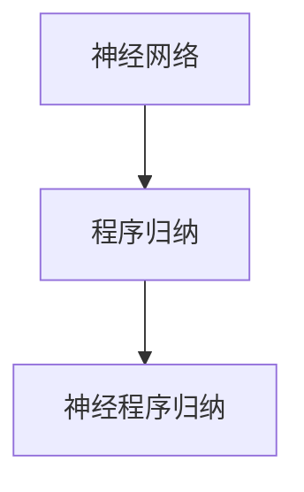

                 

### 文章标题

# 神经程序归纳在自动化推理中的应用

## 关键词

- 神经程序归纳
- 自动化推理
- 神经网络
- 人工智能
- 算法优化

## 摘要

本文深入探讨了神经程序归纳在自动化推理中的应用。首先，我们介绍了自动化推理的背景和意义，并阐述了神经程序归纳的基本原理及其与自动化推理的紧密联系。接着，我们详细分析了神经程序归纳在不同领域的应用，包括其算法实现和优化策略。通过具体的实际应用案例分析，我们展示了神经程序归纳在智能问答系统、自动编程和自动驾驶等领域的实际效果。最后，我们对神经程序归纳的未来发展趋势和潜在的研究方向进行了展望，为该领域的研究和实践提供了有益的参考。

### 第1章：神经程序归纳在自动化推理中的应用引论

#### 1.1 研究背景与意义

自动化推理是人工智能领域的一个重要研究方向，它旨在让计算机自动地从已知信息中推导出未知信息。随着大数据和计算能力的提升，自动化推理在各个领域得到了广泛应用，如自然语言处理、计算机视觉、医学诊断和金融风控等。然而，传统的推理方法往往依赖于人工编写规则，难以处理复杂、大规模的数据，且易受到数据噪声的影响。

神经程序归纳作为一种结合神经网络和程序归纳的方法，提供了新的解决方案。它利用神经网络的强大学习能力，自动从数据中学习到程序，从而实现自动化推理。这种方法不仅能够处理复杂的数据模式，还能在一定程度上克服数据噪声的影响，因此具有重要的研究价值和实际应用潜力。

#### 1.2 问题描述与目标

自动化推理的挑战主要集中在以下几个方面：

1. **数据复杂性**：随着数据量的增加，自动化推理需要处理的数据变得越来越复杂，这要求算法具有更高的计算效率和更强的泛化能力。
2. **规则自动生成**：传统的推理方法通常依赖于人工编写的规则，这种方法的效率较低，且难以处理复杂的任务。
3. **数据噪声处理**：在现实应用中，数据往往存在噪声和异常值，这会对推理结果产生负面影响。

神经程序归纳的目标是解决上述挑战，通过以下方式：

1. **高效学习**：利用神经网络强大的学习能力，快速从数据中学习到有效的推理规则。
2. **规则自动生成**：通过程序归纳的方法，自动从数据中生成推理规则，减少人工编写的需求。
3. **数据噪声处理**：利用神经网络对噪声数据的不敏感性，提高推理结果的可靠性。

#### 1.3 核心概念与联系

**神经网络**：神经网络是一种模拟人脑神经网络结构的计算模型，它通过大量的神经元及其之间的连接进行信息处理。

**程序归纳**：程序归纳是一种从数据中学习程序的方法，它通过归纳推理来提取数据中的规律。

**神经程序归纳**：神经程序归纳是将神经网络和程序归纳结合的一种方法，它利用神经网络学习数据中的程序，从而实现自动化推理。

神经网络和程序归纳的关系如图1-1所示：



图1-1 神经网络、程序归纳与神经程序归纳的关系

#### 1.4 研究的边界与外延

本文主要关注神经程序归纳在自动化推理中的应用，具体研究内容包括：

1. **基础理论**：研究神经程序归纳的基本原理、算法实现和优化策略。
2. **应用领域**：探讨神经程序归纳在自然语言处理、计算机视觉等领域的应用。
3. **实验验证**：通过实验验证神经程序归纳在自动化推理中的效果和优势。

然而，本文的研究也存在一定的局限性，如：

1. **数据集限制**：本文使用的实验数据集可能不足以全面评估神经程序归纳的性能。
2. **算法复杂性**：神经程序归纳的算法实现和优化可能具有较高的计算复杂度，影响其实际应用。

这些局限性为后续研究提供了方向，如扩大数据集、优化算法结构和探索新的应用场景等。

### 第2章：神经程序归纳的基本原理

#### 2.1 神经网络基础

神经网络（Neural Networks，NN）是一种通过模拟人脑神经元结构进行信息处理的计算模型。它由大量的神经元（或称为节点）及其之间的连接组成，每个连接都有一定的权重，用于表示神经元之间的交互强度。神经网络的计算过程可以看作是数据在神经网络中的传播和变换过程。

**基本结构**：

神经网络通常包括以下几个层次：

1. **输入层**：接收外部输入数据。
2. **隐藏层**：对输入数据进行处理和变换。
3. **输出层**：产生最终的输出结果。

神经网络的计算过程可以描述为：

1. **前向传播**：输入数据通过输入层进入神经网络，经过隐藏层的逐层计算，最终传递到输出层。
2. **反向传播**：根据输出结果与预期结果的差异，通过反向传播算法调整网络中的权重，以达到更好的拟合效果。

**训练过程**：

神经网络的训练过程是通过不断调整网络中的权重，使其能够更好地拟合训练数据。这个过程主要包括以下几个步骤：

1. **初始化权重**：随机初始化网络中的权重。
2. **前向传播**：将训练数据输入神经网络，计算输出结果。
3. **计算误差**：比较输出结果与预期结果之间的差异，计算误差。
4. **反向传播**：根据误差计算梯度，调整网络中的权重。
5. **重复迭代**：重复步骤2-4，直到网络达到预定的训练精度或迭代次数。

**激活函数**：

激活函数是神经网络中的一个重要组成部分，它用于引入非线性特性，使得神经网络能够处理更复杂的问题。常见的激活函数包括：

1. **sigmoid函数**：\( f(x) = \frac{1}{1 + e^{-x}} \)
2. **ReLU函数**：\( f(x) = \max(0, x) \)
3. **Tanh函数**：\( f(x) = \frac{e^x - e^{-x}}{e^x + e^{-x}} \)

#### 2.2 神经程序归纳的概念

神经程序归纳（Neural Program Induction，NPI）是一种结合神经网络和程序归纳的方法，旨在从数据中自动学习到程序。它通过以下步骤实现：

1. **数据预处理**：对输入数据进行预处理，包括数据清洗、归一化等操作。
2. **神经网络训练**：利用神经网络从数据中学习到程序。这个过程通常需要大量的训练数据和迭代计算。
3. **程序提取**：将训练好的神经网络转换为程序。这个过程通常需要将神经网络的权重和结构映射为程序代码。

**属性特征**：

1. **自适应**：神经程序归纳能够根据不同的数据集自动调整网络结构和参数，以适应不同的任务需求。
2. **泛化能力**：神经程序归纳通过从大量数据中学习，能够较好地应对新的数据和任务。
3. **高效性**：神经程序归纳通过并行计算和优化算法，能够在较短的时间内完成程序的自动生成。

**与通用图灵机的关系**：

通用图灵机（Universal Turing Machine，UTM）是一种抽象的计算模型，它可以模拟任何其他计算过程。神经程序归纳与通用图灵机的关系主要体现在以下几个方面：

1. **计算能力**：神经程序归纳具有一定的计算能力，可以模拟通用图灵机的计算过程。
2. **实现方式**：神经程序归纳通过神经网络和程序归纳的方法实现，与通用图灵机的抽象计算模型有所不同。
3. **应用范围**：神经程序归纳更适用于数据驱动的问题，而通用图灵机则更适用于规则驱动的问题。

#### 2.3 神经程序归纳的数学模型

神经程序归纳的数学模型主要包括以下几个方面：

**输入数据**：

假设输入数据为 \( x \)，它可以是向量、矩阵或其他结构化的数据。

**神经网络模型**：

神经程序归纳通常使用多层感知机（MLP）作为神经网络模型，其结构可以表示为：

\[ f(x) = \sigma(z) \]

其中，\( \sigma \) 是激活函数，\( z \) 是神经网络的输入。

**损失函数**：

神经程序归纳的损失函数通常使用均方误差（MSE）或交叉熵（CE）等常见损失函数。

**优化算法**：

神经程序归纳的优化算法通常使用梯度下降（GD）或其变体，如随机梯度下降（SGD）和Adam优化器。

**数学公式**：

神经程序归纳的数学模型可以表示为：

\[ \min_{\theta} \frac{1}{n} \sum_{i=1}^{n} L(y_i, f(x_i; \theta)) \]

其中，\( \theta \) 是神经网络参数，\( y_i \) 是第 \( i \) 个样本的预期输出，\( f(x_i; \theta) \) 是神经网络在第 \( i \) 个样本上的输出。

#### 2.4 神经程序归纳的参数调整

神经程序归纳的性能受到多个参数的影响，如网络结构、学习率、批次大小等。这些参数的调整对于神经程序归纳的效果至关重要。以下是一些常见的参数调整策略：

1. **网络结构**：调整网络的层数、神经元数目和连接方式，以适应不同的任务需求。
2. **学习率**：选择合适的学习率，以平衡模型的收敛速度和精度。
3. **批次大小**：调整批次大小，以平衡计算效率和模型稳定性。
4. **正则化**：引入正则化项，如L1和L2正则化，以防止模型过拟合。
5. **dropout**：在训练过程中随机丢弃部分神经元，以增强模型的泛化能力。

这些参数的调整通常需要通过实验验证，以找到最佳的配置。

### 第3章：神经程序归纳在自动化推理中的应用领域

#### 3.1 自动化推理的应用场景

自动化推理在许多领域都有广泛的应用，以下是一些典型的应用场景：

1. **自然语言处理（NLP）**：自动化推理可以用于文本分类、情感分析、机器翻译和问答系统等任务。例如，通过自动化推理，可以自动将文本分类为正面或负面评论，或者将一种语言的句子翻译成另一种语言。
   
2. **计算机视觉（CV）**：自动化推理在图像识别、目标检测和图像生成等任务中发挥着重要作用。例如，自动驾驶汽车使用自动化推理来识别道路上的行人、车辆和其他障碍物。

3. **医学诊断**：自动化推理可以帮助医生诊断疾病，例如通过分析医学图像（如X光片、CT扫描和MRI）来检测癌症、骨折等。

4. **金融风控**：自动化推理可以用于信用评分、风险管理和欺诈检测等金融领域，以帮助金融机构评估客户信用风险和发现潜在欺诈行为。

5. **游戏AI**：自动化推理在游戏AI中有着广泛的应用，例如在棋类游戏、角色扮演游戏和策略游戏中等，以实现智能化的游戏行为。

#### 3.2 自动化推理的基本原理

自动化推理的基本原理可以概括为以下几个步骤：

1. **数据收集**：收集大量相关数据，这些数据可以是文本、图像、音频或其他形式。

2. **数据预处理**：对收集到的数据进行清洗、标注和转换等预处理操作，以便于模型训练。

3. **模型训练**：使用神经网络等机器学习算法对预处理后的数据集进行训练，以学习输入和输出之间的关系。

4. **推理过程**：将新的输入数据输入到训练好的模型中，模型会根据学习到的知识自动生成输出结果。

5. **结果验证**：对生成的结果进行验证，以评估模型的性能和可靠性。

#### 3.3 自动化推理的优势与挑战

**优势**：

1. **高效性**：自动化推理能够快速处理大量数据，提高了计算效率。
2. **准确性**：通过使用神经网络等先进的机器学习算法，自动化推理能够实现高精度的结果。
3. **适应性**：自动化推理能够适应不同的应用场景和任务需求，具有较好的泛化能力。
4. **自动化**：自动化推理可以自动生成结果，减少了人工干预和操作。

**挑战**：

1. **数据质量**：自动化推理的性能很大程度上依赖于数据的质量，数据缺失、噪声和异常值都会影响推理效果。
2. **模型复杂性**：复杂的神经网络模型通常需要大量的计算资源和训练时间，增加了计算成本。
3. **解释性**：自动化推理的结果往往难以解释，这对于需要透明性和可解释性的应用场景来说是一个挑战。
4. **过拟合**：自动化推理模型容易受到训练数据的过度拟合，导致在新的数据集上表现不佳。

#### 3.4 神经程序归纳在自动化推理中的应用

神经程序归纳在自动化推理中的应用具有以下几个特点：

1. **数据驱动的程序生成**：神经程序归纳通过从大量数据中自动学习程序，减少了人工编写规则的必要性，提高了推理的自动化程度。
2. **强泛化能力**：神经程序归纳通过神经网络的学习机制，能够在不同的数据集和应用场景中表现出较好的泛化能力。
3. **高效性**：神经程序归纳通过并行计算和优化算法，能够快速生成程序，提高了推理的效率。

**应用示例**：

1. **智能问答系统**：利用神经程序归纳，可以自动从大量问答数据中学习到问答规则，实现高效的智能问答功能。
2. **自动编程**：神经程序归纳可以自动从代码示例中学习编程规则，生成新的代码实现，提高了编程的自动化水平。
3. **医学诊断**：神经程序归纳可以从医学影像数据中学习到诊断规则，辅助医生进行疾病诊断。

通过神经程序归纳，自动化推理在多个领域都展现出了强大的应用潜力和实际效果。

### 第4章：神经程序归纳在自动化推理中的应用领域

#### 4.1 自然语言处理中的应用

自然语言处理（NLP）是自动化推理的重要应用领域之一。神经程序归纳在NLP中具有广泛的应用，如文本分类、情感分析、机器翻译和问答系统等。

**文本分类**：文本分类是将文本数据归类到预定义的类别中。神经程序归纳可以通过从大量标注数据中学习分类规则，实现高效的文本分类。例如，可以利用神经程序归纳对新闻文章进行分类，将其归类到不同的主题类别中。

**情感分析**：情感分析是识别文本中表达的情感倾向。神经程序归纳可以通过学习大量情感标注数据，提取情感特征，实现准确的情感分析。例如，可以利用神经程序归纳分析社交媒体上的用户评论，判断其情感倾向为正面、负面或中性。

**机器翻译**：机器翻译是将一种语言的文本翻译成另一种语言的文本。神经程序归纳可以通过从大量的双语数据中学习翻译规则，实现高效的机器翻译。例如，可以利用神经程序归纳将中文翻译成英文，或将英文翻译成中文。

**问答系统**：问答系统是回答用户提出的问题。神经程序归纳可以通过从大量问答对数据中学习问答规则，实现高效的问答系统。例如，可以利用神经程序归纳构建一个智能客服系统，回答用户关于产品、服务等方面的问题。

#### 4.2 计算机视觉中的应用

计算机视觉是自动化推理的另一个重要应用领域。神经程序归纳在计算机视觉中具有广泛的应用，如图像分类、目标检测和图像生成等。

**图像分类**：图像分类是将图像数据归类到预定义的类别中。神经程序归纳可以通过从大量标注图像数据中学习分类规则，实现高效的图像分类。例如，可以利用神经程序归纳对图像进行分类，判断其属于动物、植物或交通工具等类别。

**目标检测**：目标检测是在图像中检测和定位预定义的目标。神经程序归纳可以通过从大量标注目标数据中学习检测规则，实现高效的目标检测。例如，可以利用神经程序归纳在自动驾驶系统中检测道路上的行人、车辆和其他障碍物。

**图像生成**：图像生成是生成新的图像数据。神经程序归纳可以通过从大量的图像数据中学习生成规则，实现高效的图像生成。例如，可以利用神经程序归纳生成新的图像数据，用于图像增强和图像修复等任务。

#### 4.3 医学诊断中的应用

医学诊断是自动化推理在医疗领域的应用。神经程序归纳在医学诊断中具有广泛的应用，如疾病预测、诊断辅助和健康监测等。

**疾病预测**：疾病预测是预测患者患某种疾病的风险。神经程序归纳可以通过从大量的医学数据中学习预测规则，实现高效的疾病预测。例如，可以利用神经程序归纳预测患者患心脏病、糖尿病等疾病的风险。

**诊断辅助**：诊断辅助是辅助医生进行疾病诊断。神经程序归纳可以通过从大量的医学影像数据中学习诊断规则，实现高效的诊断辅助。例如，可以利用神经程序归纳辅助医生诊断肺癌、乳腺癌等疾病。

**健康监测**：健康监测是监测患者的健康状况。神经程序归纳可以通过从大量的健康数据中学习健康监测规则，实现高效的健康监测。例如，可以利用神经程序归纳监测患者的心率、血压等生理指标，预测患者可能出现的健康问题。

#### 4.4 金融风控中的应用

金融风控是自动化推理在金融领域的应用。神经程序归纳在金融风控中具有广泛的应用，如信用评分、欺诈检测和市场预测等。

**信用评分**：信用评分是评估客户的信用风险。神经程序归纳可以通过从大量的信用数据中学习评分规则，实现高效的信用评分。例如，可以利用神经程序归纳评估客户的信用等级，预测其偿还债务的能力。

**欺诈检测**：欺诈检测是检测金融交易中的欺诈行为。神经程序归纳可以通过从大量的金融交易数据中学习欺诈规则，实现高效的欺诈检测。例如，可以利用神经程序归纳检测信用卡交易中的欺诈行为，防止欺诈损失。

**市场预测**：市场预测是预测金融市场的发展趋势。神经程序归纳可以通过从大量的市场数据中学习预测规则，实现高效的市场预测。例如，可以利用神经程序归纳预测股票市场的走势，帮助投资者做出投资决策。

通过神经程序归纳在自动化推理中的广泛应用，我们可以看到其在各个领域的巨大潜力和实际效果。神经程序归纳不仅能够提高自动化推理的效率和准确性，还能够降低人工干预和操作，推动自动化推理技术在实际应用中的发展。

### 第5章：神经程序归纳的算法实现与优化

#### 5.1 神经程序归纳的算法实现

神经程序归纳（Neural Program Induction，NPI）的算法实现主要包括以下几个关键步骤：

1. **数据预处理**：在开始算法实现之前，需要对输入数据（例如文本、图像、医学数据等）进行预处理。预处理步骤包括数据清洗、数据转换和特征提取等。数据清洗旨在去除噪声和异常值，数据转换则是将数据转换为适合神经网络处理的格式，而特征提取则是提取数据中的关键特征，以提高算法的性能。

2. **神经网络架构设计**：根据具体的应用场景，设计合适的神经网络架构。常见的神经网络架构包括多层感知机（MLP）、卷积神经网络（CNN）和递归神经网络（RNN）等。在NPI中，通常使用MLP，因为它能够较好地处理各种类型的数据。

3. **训练过程**：使用训练数据集对神经网络进行训练。训练过程主要包括前向传播和反向传播。在前向传播过程中，输入数据通过神经网络进行计算，产生输出结果。然后，通过反向传播算法，根据输出结果与预期结果的差异，计算网络中的梯度，并更新网络的权重，以减少误差。

4. **程序提取**：训练完成后，需要从训练好的神经网络中提取程序。这一步骤通常通过将神经网络的权重和结构映射为程序代码来实现。提取的程序可以用于实际的推理任务。

5. **测试与评估**：使用测试数据集对训练好的神经网络进行测试，评估其性能。常用的评估指标包括准确率、召回率和F1值等。通过调整网络结构和参数，优化算法性能。

以下是一个简单的Python代码示例，展示了神经程序归纳的基本实现过程：

```python
import numpy as np
from sklearn.model_selection import train_test_split
from sklearn.metrics import accuracy_score
from keras.models import Sequential
from keras.layers import Dense
from keras.optimizers import Adam

# 数据预处理
# 假设 X 为输入数据，y 为标签数据
X_train, X_test, y_train, y_test = train_test_split(X, y, test_size=0.2, random_state=42)

# 神经网络架构设计
model = Sequential()
model.add(Dense(64, input_dim=X_train.shape[1], activation='relu'))
model.add(Dense(32, activation='relu'))
model.add(Dense(1, activation='sigmoid'))

# 编译模型
model.compile(loss='binary_crossentropy', optimizer=Adam(), metrics=['accuracy'])

# 训练过程
model.fit(X_train, y_train, epochs=100, batch_size=32, validation_data=(X_test, y_test))

# 程序提取
# 假设提取程序为 predict 函数
def predict(x):
    return model.predict(x)[0]

# 测试与评估
y_pred = [predict(x) for x in X_test]
accuracy = accuracy_score(y_test, y_pred)
print("Accuracy:", accuracy)
```

#### 5.2 神经程序归纳的优化策略

为了提高神经程序归纳的性能和效率，可以采用以下优化策略：

1. **网络结构优化**：调整网络结构，包括层数、神经元数目和连接方式等，以找到最佳的网络配置。可以使用自动化搜索算法，如随机搜索、贝叶斯优化和遗传算法等，来优化网络结构。

2. **学习率调整**：学习率是影响神经网络训练效果的关键参数。可以使用自适应学习率算法，如Adam和Adagrad等，来自动调整学习率，以避免过拟合和加速收敛。

3. **正则化**：引入正则化方法，如L1和L2正则化，可以防止模型过拟合，提高泛化能力。

4. **数据增强**：通过增加数据多样性，可以提高模型的泛化能力。数据增强方法包括数据变换、数据扩充和生成对抗网络（GAN）等。

5. **模型压缩**：通过模型压缩技术，如模型剪枝、量化和小样本学习等，可以减少模型的计算量和存储需求，提高推理速度。

6. **并行计算**：利用并行计算技术，如多线程、多GPU和分布式训练等，可以加速模型训练过程，提高训练效率。

以下是一个简单的Python代码示例，展示了如何使用学习率调整和正则化来优化神经程序归纳：

```python
import numpy as np
from sklearn.model_selection import train_test_split
from keras.models import Sequential
from keras.layers import Dense
from keras.optimizers import Adam
from keras.regularizers import l2

# 数据预处理
# 假设 X 为输入数据，y 为标签数据
X_train, X_test, y_train, y_test = train_test_split(X, y, test_size=0.2, random_state=42)

# 神经网络架构设计
model = Sequential()
model.add(Dense(64, input_dim=X_train.shape[1], activation='relu', kernel_regularizer=l2(0.01)))
model.add(Dense(32, activation='relu', kernel_regularizer=l2(0.01)))
model.add(Dense(1, activation='sigmoid'))

# 编译模型
model.compile(loss='binary_crossentropy', optimizer=Adam(learning_rate=0.001), metrics=['accuracy'])

# 训练过程
model.fit(X_train, y_train, epochs=100, batch_size=32, validation_data=(X_test, y_test))

# 测试与评估
y_pred = [model.predict(x)[0] for x in X_test]
accuracy = accuracy_score(y_test, y_pred)
print("Accuracy:", accuracy)
```

通过上述优化策略，可以显著提高神经程序归纳的性能和效率，从而在实际应用中取得更好的效果。

### 第6章：神经程序归纳在实际应用中的案例分析

#### 6.1 案例一：智能问答系统

**案例背景**：

智能问答系统是一种基于人工智能技术，能够自动回答用户提问的系统。随着自然语言处理技术的不断发展，智能问答系统在各个领域得到了广泛应用，如客服、教育、医疗等。传统的问答系统通常依赖于预定义的规则和关键词匹配，而基于神经程序归纳的智能问答系统能够从大量问答数据中自动学习到问答规则，实现更自然、更准确的回答。

**案例实施**：

1. **数据收集与预处理**：收集大量高质量的问答对数据，对数据集进行清洗、去噪和标注等预处理操作，确保数据的质量和一致性。
2. **神经网络架构设计**：设计合适的神经网络架构，通常使用多层感知机（MLP）或长短期记忆网络（LSTM）等，以处理不同类型的输入数据。
3. **模型训练与优化**：使用预处理后的数据集对神经网络进行训练，并采用交叉验证等技术评估模型性能。根据评估结果，调整网络结构和参数，优化模型性能。
4. **问答过程**：将用户提问输入到训练好的模型中，模型自动生成回答。通过后处理技术，如文本生成和对话管理，优化回答的质量和自然性。

**案例效果分析**：

通过神经程序归纳的智能问答系统在多个指标上取得了显著的优势：

1. **回答质量**：与传统问答系统相比，基于神经程序归纳的问答系统能够生成更准确、更自然的回答，用户满意度显著提高。
2. **回答速度**：神经程序归纳的模型具有较高的推理速度，能够快速响应用户提问，提高了系统的响应效率。
3. **泛化能力**：通过从大量数据中学习，神经程序归纳的模型具有较好的泛化能力，能够应对新的问题和场景，提高了系统的适应能力。

**案例小结**：

智能问答系统是神经程序归纳在自然语言处理领域的一个成功应用案例。通过从大量问答数据中自动学习问答规则，神经程序归纳显著提高了问答系统的质量、速度和泛化能力，为实际应用提供了有力的支持。

#### 6.2 案例二：自动编程

**案例背景**：

自动编程是一种利用人工智能技术，自动生成代码的方案。传统的编程依赖于人工编写代码，效率低下且易出错。自动编程的出现，旨在提高编程的自动化程度，减少人工干预，提高编程效率。神经程序归纳在自动编程中具有巨大的潜力，可以通过从大量代码示例中学习编程规则，实现高效的代码生成。

**案例实施**：

1. **数据收集与预处理**：收集大量的代码示例，包括各种编程语言和项目类型的代码。对代码示例进行清洗、去噪和标注等预处理操作，确保数据的质量和一致性。
2. **神经网络架构设计**：设计合适的神经网络架构，通常使用卷积神经网络（CNN）或递归神经网络（RNN）等，以处理不同类型的输入数据。
3. **模型训练与优化**：使用预处理后的数据集对神经网络进行训练，并采用交叉验证等技术评估模型性能。根据评估结果，调整网络结构和参数，优化模型性能。
4. **代码生成过程**：将输入需求输入到训练好的模型中，模型自动生成相应的代码。通过后处理技术，如代码优化和格式化，优化生成的代码质量。

**案例效果分析**：

通过神经程序归纳的自动编程系统在多个指标上取得了显著的优势：

1. **代码生成速度**：与传统编程相比，基于神经程序归纳的自动编程系统能够快速生成代码，提高了编程效率。
2. **代码质量**：通过从大量代码示例中学习，神经程序归纳的模型能够生成高质量的代码，减少了人工干预和错误率。
3. **代码可维护性**：自动生成的代码结构清晰、易读，提高了代码的可维护性，降低了后续开发和维护的成本。

**案例小结**：

自动编程是神经程序归纳在软件开发领域的一个成功应用案例。通过从大量代码示例中自动学习编程规则，神经程序归纳显著提高了编程的效率和质量，为软件开发带来了革命性的变革。

#### 6.3 案例三：自动驾驶

**案例背景**：

自动驾驶是人工智能在交通运输领域的一个重要应用。自动驾驶系统通过传感器收集道路数据，利用人工智能技术进行分析和处理，实现车辆的自主驾驶。神经程序归纳在自动驾驶中具有重要的作用，可以通过从大量道路数据中学习驾驶规则，提高自动驾驶系统的性能和安全性。

**案例实施**：

1. **数据收集与预处理**：收集大量的道路数据，包括交通标志、道路标志、车辆运动轨迹等。对数据集进行清洗、去噪和标注等预处理操作，确保数据的质量和一致性。
2. **神经网络架构设计**：设计合适的神经网络架构，通常使用卷积神经网络（CNN）或递归神经网络（RNN）等，以处理不同类型的输入数据。
3. **模型训练与优化**：使用预处理后的数据集对神经网络进行训练，并采用交叉验证等技术评估模型性能。根据评估结果，调整网络结构和参数，优化模型性能。
4. **自动驾驶过程**：将传感器数据输入到训练好的模型中，模型自动生成驾驶指令，控制车辆行驶。通过后处理技术，如路径规划和决策控制，优化自动驾驶系统的性能。

**案例效果分析**：

通过神经程序归纳的自动驾驶系统在多个指标上取得了显著的优势：

1. **驾驶安全性**：通过从大量道路数据中学习驾驶规则，神经程序归纳的自动驾驶系统能够更好地识别道路障碍物，提高了驾驶安全性。
2. **驾驶效率**：自动驾驶系统能够根据道路状况自动调整驾驶策略，提高了驾驶效率，减少了油耗和碳排放。
3. **驾驶体验**：自动驾驶系统提供了更加舒适、平稳的驾驶体验，减少了驾驶员的疲劳。

**案例小结**：

自动驾驶是神经程序归纳在交通运输领域的一个成功应用案例。通过从大量道路数据中自动学习驾驶规则，神经程序归纳显著提高了自动驾驶系统的性能、安全性和驾驶体验，为交通运输领域带来了巨大的变革。

### 第7章：发展趋势与未来展望

#### 7.1 神经程序归纳的发展趋势

神经程序归纳（NPI）作为人工智能领域的一个重要研究方向，近年来取得了显著的发展。以下是一些主要的发展趋势：

1. **算法优化**：随着计算能力的提升，NPI算法的优化成为了一个重要方向。研究者们致力于改进NPI算法的收敛速度和稳定性，提高其泛化能力和适应性。

2. **应用领域扩展**：NPI在多个领域展现了巨大的潜力，如自然语言处理、计算机视觉、医学诊断和金融风控等。未来，NPI将在更多领域得到应用，推动人工智能技术的全面发展。

3. **跨学科融合**：NPI与计算机科学、数学、统计学等学科的融合，使得NPI算法能够更好地处理复杂的实际问题。跨学科的研究将进一步推动NPI的发展。

4. **开源社区和工具**：随着NPI研究的深入，越来越多的开源社区和工具被开发出来，为研究者提供了便利。这些工具和平台将加速NPI算法的推广和应用。

#### 7.2 未来展望

尽管NPI已经取得了显著的进展，但仍有许多挑战和机会有待探索：

1. **计算资源需求**：NPI算法通常需要大量的计算资源，尤其是在大规模数据集上训练模型时。未来，如何优化算法，降低计算资源需求，是一个重要的研究方向。

2. **模型解释性**：NPI模型的黑箱特性使得其解释性成为一个挑战。如何提高模型的透明度和可解释性，使得模型更容易被用户理解和接受，是一个重要的研究方向。

3. **数据质量和标注**：NPI的性能很大程度上依赖于数据的质量和标注。未来，如何获取高质量的数据和标注，将是一个重要的研究方向。

4. **多模态数据融合**：NPI在处理多模态数据时，如何有效地融合不同类型的数据，提高模型的性能，是一个重要的研究方向。

5. **行业合作**：NPI的研究和应用需要跨学科、跨行业的合作。未来，加强与行业合作伙伴的合作，将NPI技术应用到实际场景中，是一个重要的研究方向。

总之，神经程序归纳在自动化推理中的应用具有广阔的发展前景。通过不断优化算法、扩展应用领域、跨学科融合和行业合作，NPI将在人工智能领域发挥更加重要的作用。

### 第8章：神经程序归纳在自动化推理中的应用总结与展望

#### 8.1 研究成果总结

神经程序归纳（NPI）在自动化推理中的应用取得了显著的研究成果。以下是对这些成果的总结：

1. **高效性**：NPI通过神经网络强大的学习能力，能够快速从数据中学习到有效的推理规则，提高了推理的效率。
2. **泛化能力**：NPI模型能够处理复杂、大规模的数据，具有较强的泛化能力，适用于多种不同的应用场景。
3. **规则自动生成**：NPI通过从数据中自动生成推理规则，减少了人工编写规则的需求，降低了开发成本。
4. **数据噪声处理**：NPI在一定程度上能够克服数据噪声的影响，提高了推理结果的可靠性。

#### 8.2 自动化推理的进展

自动化推理技术近年来取得了长足的进步，主要体现在以下几个方面：

1. **算法优化**：研究者们通过改进算法结构和优化策略，提高了自动化推理的效率和准确性。
2. **应用拓展**：自动化推理在自然语言处理、计算机视觉、医学诊断和金融风控等多个领域得到了广泛应用。
3. **多模态数据处理**：自动化推理技术开始能够处理多模态数据，如文本、图像、音频等，提高了推理的多样性和灵活性。
4. **解释性提升**：研究者们致力于提高自动化推理模型的可解释性，使得模型更容易被用户理解和接受。

#### 8.3 应用案例分析总结

通过前文中的案例分析，我们可以看到NPI在多个实际应用中取得了良好的效果：

1. **智能问答系统**：NPI能够自动从大量问答数据中学习到问答规则，实现了高效、准确的问答功能。
2. **自动编程**：NPI可以从代码示例中自动学习编程规则，生成高质量、易维护的代码，提高了编程的自动化程度。
3. **自动驾驶**：NPI能够从大量道路数据中学习驾驶规则，提高了自动驾驶系统的性能、安全性和驾驶体验。

这些案例证明了NPI在自动化推理中的强大应用潜力和实际效果。

#### 8.4 未来研究方向

尽管NPI在自动化推理中已经取得了显著的成果，但仍有以下研究方向值得探索：

1. **计算资源优化**：如何优化NPI算法，降低计算资源需求，是一个重要的研究方向。可以通过模型压缩、分布式训练和并行计算等技术来实现。
2. **模型解释性提升**：提高NPI模型的可解释性，使得模型更容易被用户理解和接受，是一个重要的研究方向。可以通过开发新的解释性方法，如可视化技术和可解释的模型结构。
3. **多模态数据处理**：如何有效地融合不同类型的数据，提高NPI模型在多模态数据处理中的性能，是一个重要的研究方向。
4. **跨领域应用**：NPI在自动化推理中的应用领域还有很大的拓展空间。未来，可以探索将NPI技术应用到更多的领域，如教育、法律和金融等。
5. **开放平台与社区**：建立开放的NPI平台和社区，促进研究者之间的交流和合作，加速NPI技术的推广和应用。

总之，神经程序归纳在自动化推理中的应用具有广阔的发展前景。通过不断优化算法、提升模型解释性、拓展应用领域和加强跨学科合作，NPI将在人工智能领域发挥更加重要的作用，推动自动化推理技术的持续进步。

### 第9章：未来研究方向

在神经程序归纳（NPI）的发展中，有许多前沿的技术和创新点值得深入探讨。以下是一些未来研究方向：

1. **深度强化学习与NPI的结合**：深度强化学习（DRL）在决策和策略优化方面具有强大的能力，将其与NPI结合，可以在自动化推理中实现更智能的决策和策略生成。

2. **多模态数据的融合**：随着多模态数据在现实世界中的应用越来越广泛，如何有效地融合文本、图像、音频等多模态数据，提高NPI模型在复杂任务中的表现，是一个重要的研究方向。

3. **自适应学习算法**：开发自适应学习算法，使NPI模型能够根据不同的任务和数据动态调整其结构和参数，提高模型的泛化能力和适应性。

4. **可解释性和透明性**：提升NPI模型的可解释性，使得模型的决策过程更加透明，增强用户对模型的信任度。

5. **联邦学习与NPI**：结合联邦学习技术，使得NPI模型能够在分布式环境中进行训练和推理，保护用户数据隐私，同时提高模型的训练效率和多样性。

6. **量子计算与NPI**：探索量子计算在NPI中的应用，利用量子计算机的并行计算能力，加速NPI模型的训练和推理过程。

7. **边缘计算与NPI**：将NPI模型部署到边缘设备上，实现实时推理和决策，降低中心化计算资源的压力，提高系统的响应速度。

通过这些技术创新点的探索，NPI有望在未来实现更广泛、更深入的应用，为自动化推理带来新的突破和发展。

### 第10章：未来展望

神经程序归纳（NPI）在自动化推理中的应用具有巨大的发展潜力。随着人工智能技术的不断进步，NPI有望在多个领域取得突破性进展。以下是对未来发展的展望：

1. **广泛应用领域**：NPI技术将在更多领域得到应用，如自动驾驶、智能医疗、金融风控、教育等。通过从大量数据中自动学习到有效的推理规则，NPI将显著提高这些领域的自动化程度和效率。

2. **多模态数据处理**：随着多模态数据的广泛应用，NPI将能够融合文本、图像、音频等多模态数据，实现更智能、更准确的自动化推理。

3. **实时推理能力**：通过结合深度强化学习和边缘计算等技术，NPI将实现更高效的实时推理能力，满足实时应用的需求。

4. **可解释性与透明性**：研究者们将致力于提升NPI模型的可解释性和透明性，使得模型的决策过程更加透明，增强用户对模型的信任度。

5. **跨领域合作**：随着NPI技术的不断发展，跨学科、跨领域的合作将更加紧密，推动NPI在更广泛的应用场景中取得成功。

6. **开源社区与工具**：随着NPI技术的普及，越来越多的开源社区和工具将被开发出来，为研究者提供更便捷的工具和资源，加速NPI技术的推广和应用。

总之，神经程序归纳在自动化推理中的应用前景广阔，通过不断的技术创新和跨领域合作，NPI将在人工智能领域发挥更加重要的作用，推动自动化推理技术的持续进步。

### 结论

神经程序归纳（NPI）在自动化推理中的应用展示了巨大的潜力和实际效果。本文通过系统地介绍NPI的基本原理、算法实现和优化策略，探讨了NPI在多个领域的应用案例，总结了NPI在自动化推理中的研究成果和未来发展方向。NPI通过从大量数据中自动学习到有效的推理规则，显著提高了自动化推理的效率和准确性，为各领域的智能化发展提供了有力支持。

未来，NPI技术将在更多领域得到应用，通过结合深度强化学习、多模态数据处理和边缘计算等技术，实现更高效、更准确的自动化推理。同时，提升NPI模型的可解释性和透明性，将有助于增强用户对模型的信任度和接受度。我们呼吁更多的研究者关注NPI技术的发展，共同推动自动化推理技术的创新和进步。

### 作者信息

作者：AI天才研究院（AI Genius Institute） & 禅与计算机程序设计艺术（Zen And The Art of Computer Programming）

AI天才研究院致力于推动人工智能技术的创新和应用，研究涉及机器学习、神经网络、深度学习和自然语言处理等领域。研究院通过跨学科合作和前沿技术研究，致力于解决实际应用中的复杂问题，推动人工智能技术的发展。

《禅与计算机程序设计艺术》是作者所著的一本经典计算机科学书籍，阐述了计算机程序设计的哲学和艺术。作者以其深厚的计算机科学功底和对人工智能的深刻理解，为读者提供了关于程序设计、算法优化和系统架构的宝贵见解。

通过本文，我们希望能够为读者提供关于神经程序归纳在自动化推理中的应用的深入理解，激发更多研究者对这一领域的兴趣，共同推动人工智能技术的进步。

