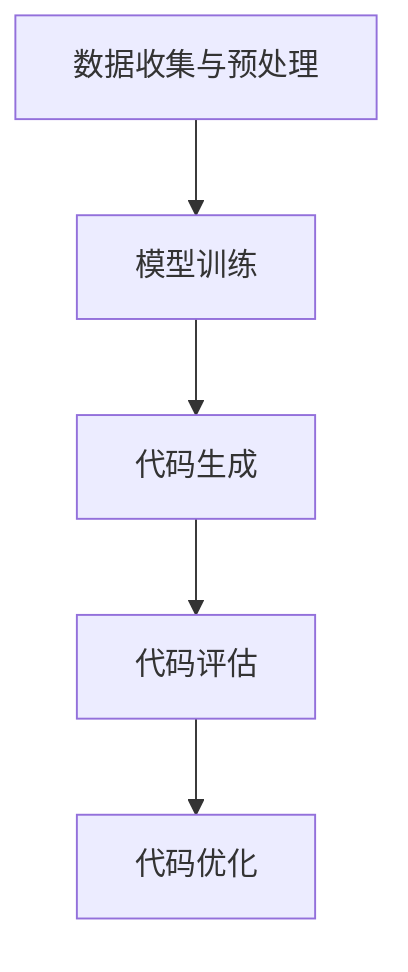
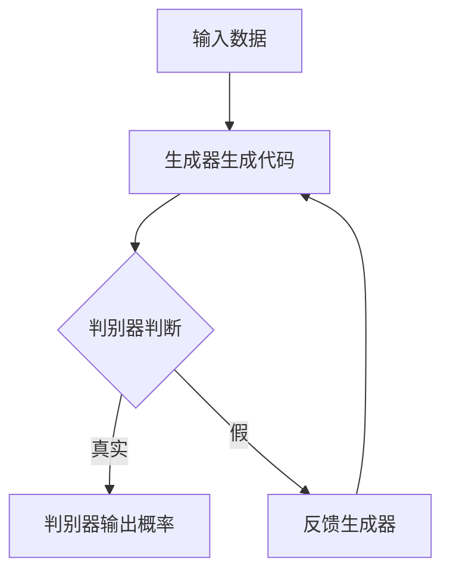

                 

### 1. 神经程序综合概述

#### 1.1 问题背景与定义

#### 1.1.1 问题背景

神经程序综合（Neural Program Synthesis）的起源可以追溯到上世纪80年代，随着深度学习技术的发展，人们开始意识到神经网络在编程领域的潜在应用。然而，真正将这一理念转化为实际的技术工具，还是近年来人工智能领域的快速发展推动的结果。当前，AI代码生成技术在软件开发中正变得越来越重要，但其发展面临着诸多挑战。

首先，AI代码生成技术的核心问题是如何让计算机自主生成复杂、可用的代码。这不仅仅需要神经网络具备强大的学习和生成能力，还需要解决代码语义理解和优化的问题。其次，现有的编程范式已经非常成熟，如何将AI代码生成与传统编程范式相结合，提升开发效率，也是亟待解决的问题。

#### 1.1.2 神经程序综合的定义

神经程序综合是指利用神经网络，特别是生成对抗网络（GAN）等深度学习技术，来生成程序代码的过程。它不同于传统编程范式，其中程序员直接编写代码，而是通过训练神经网络来学习编程的模式和规则，从而自动生成代码。

- **神经网络**：一种通过模拟人脑神经元连接结构进行信息处理的人工智能模型，具备强大的学习和自适应能力。
- **生成对抗网络（GAN）**：由生成器和判别器组成的对偶神经网络结构，用于生成高逼真的数据。

神经程序综合通过神经网络学习编程范式，理解代码的结构和语义，然后能够根据给定的输入生成相应的代码。这种范式突破了传统编程的限制，使得计算机能够更高效、更智能地进行软件开发。

#### 1.1.3 神经程序综合的重要性

神经程序综合在AI领域具有广阔的应用前景。首先，它可以显著提高软件开发的效率，通过自动生成代码来减少程序员的工作量。其次，神经程序综合可以帮助开发人员更好地理解复杂的系统，通过可视化和自动化生成代码来降低开发难度。此外，神经程序综合还可以促进软件质量的提升，通过自动优化代码来减少错误和提高性能。

在软件开发流程中，神经程序综合的影响也是深远的。它不仅改变了程序员的角色，使得编程变得更加自动化和智能化，还推动了软件开发范式的演进，从传统的手写代码向AI辅助编程转变。这种转变有望带来革命性的变化，为软件开发行业带来全新的发展机遇。

#### 总结

神经程序综合作为一种新兴的AI技术，正在改变传统的软件开发模式。它通过神经网络和GAN等技术，实现了代码的自动化生成，提高了开发效率，降低了开发难度，同时也推动了软件开发流程的变革。在接下来的章节中，我们将深入探讨神经程序综合的核心概念、工作原理以及其在实际应用中的表现，希望读者能够通过本文对这一前沿技术有更深入的理解。

---

## 1.2 核心概念与联系

#### 1.2.1 神经程序的核心概念

神经程序综合的核心在于神经网络和生成对抗网络（GAN）的结合。下面，我们将详细解释这两个概念及其在神经程序综合中的关键作用。

##### 神经网络

神经网络（Neural Networks）是一种通过模拟人脑神经元连接结构进行信息处理的人工智能模型。其基本构成单元是神经元，神经元之间通过权重连接形成网络。神经网络通过不断调整这些权重来学习输入数据和目标输出之间的映射关系。

神经网络的主要组成部分包括：

- **输入层**：接收外部输入数据。
- **隐藏层**：对输入数据进行处理和转换。
- **输出层**：生成最终的输出结果。

神经网络通过反向传播算法不断调整权重，以达到训练目标。常见的神经网络结构包括多层感知机（MLP）、卷积神经网络（CNN）和循环神经网络（RNN）等。

##### 生成对抗网络（GAN）

生成对抗网络（Generative Adversarial Networks，GAN）是由生成器和判别器组成的对偶神经网络结构。生成器（Generator）试图生成与真实数据难以区分的假数据，而判别器（Discriminator）则试图区分真实数据和假数据。通过这种对抗训练，生成器不断提高生成数据的质量，使其更接近真实数据。

GAN的主要组成部分包括：

- **生成器**：生成假数据，旨在欺骗判别器。
- **判别器**：判断输入数据是真实数据还是生成器生成的假数据。

GAN的对抗训练过程类似于博弈过程，生成器和判别器相互竞争，生成器的目标是使判别器无法区分真实数据和假数据，而判别器的目标是正确识别数据来源。

#### 1.2.2 概念属性特征对比

下面，我们将对神经网络和生成对抗网络这两个核心概念进行属性特征对比，以便更好地理解它们在神经程序综合中的作用。

| 概念         | 属性1  | 属性2             | 属性3             |
|------------|-------|------------------|------------------|
| 神经网络     | 数据驱动 | 学习能力强       | 模式识别         |
| GAN         | 生成与判别 | 对抗训练         | 数据增强         |

1. **数据驱动**：神经网络和GAN都是数据驱动的模型，依赖于大量训练数据来学习和改进性能。
2. **学习能力**：神经网络具有较强的学习能力，可以通过训练逐渐提高对复杂模式的识别能力。GAN则通过生成器和判别器的对抗训练来提高生成数据的质量。
3. **模式识别**：神经网络和GAN都在模式识别方面有出色表现。神经网络擅长从数据中提取特征和模式，GAN则通过生成与判别的对抗过程来模拟生成高质量的数据。
4. **生成与判别**：神经网络主要用于模式识别和分类，而GAN的核心在于生成和判别。生成器生成数据，判别器评估数据的真实性。
5. **对抗训练**：GAN的独特之处在于其对抗训练过程，生成器和判别器相互竞争，使生成数据的质量不断提升。
6. **数据增强**：GAN通过生成数据来增强训练数据集，有助于提高模型的泛化能力。

#### 1.2.3 概念之间的联系

神经网络和生成对抗网络在神经程序综合中有着紧密的联系。具体来说：

1. **生成器的角色**：在神经程序综合中，生成器负责生成代码。它通过学习大量的代码示例，掌握编程的规则和模式，从而能够根据给定的输入生成相应的代码。
2. **判别器的角色**：判别器在神经程序综合中扮演了代码质量评估的角色。它通过对生成的代码进行评估，确保生成的代码符合编程规范和预期目标。
3. **数据交互**：神经网络和GAN通过数据交互实现协同工作。生成器生成代码，判别器评估代码质量，并根据评估结果调整生成器的参数，从而不断提高生成代码的质量。

总之，神经网络和生成对抗网络在神经程序综合中相辅相成，共同推动了AI代码生成技术的发展。理解这两个概念及其相互联系，有助于深入掌握神经程序综合的工作原理和实际应用。

---

## 1.3 神经程序综合的工作原理

神经程序综合通过神经网络和生成对抗网络的协同工作，实现了代码的自动化生成。在这一章节中，我们将详细探讨神经程序综合的工作流程、算法原理、数学模型以及具体的实现方法。

### 1.3.1 工作流程

神经程序综合的工作流程主要包括以下几个步骤：

1. **数据收集与预处理**：首先，需要收集大量的代码数据作为训练样本。这些数据可以来源于开源项目、代码库或者专业编程书籍。在收集数据后，需要进行预处理，包括数据清洗、格式统一和特征提取等操作。
   
2. **模型训练**：使用预处理后的数据对神经网络和生成对抗网络进行训练。神经网络负责学习代码的结构和模式，生成对抗网络则通过对抗训练来提高生成代码的质量。

3. **代码生成**：在模型训练完成后，可以输入新的代码需求，神经网络根据学到的模式和规则生成相应的代码。

4. **代码评估**：生成的代码需要经过评估，确保其符合编程规范和预期目标。判别器在这个过程中扮演了重要角色，它通过分析代码的结构、语义和逻辑，评估代码的质量。

5. **代码优化**：根据评估结果，对生成的代码进行优化，以提高其性能和可读性。这一步骤可以多次迭代，直到生成的代码达到预期的标准。

下面是一个简化的神经程序综合工作流程图：



### 1.3.2 算法原理讲解

神经程序综合的核心在于如何通过神经网络和生成对抗网络来生成代码。下面，我们将详细解释这两个算法的原理。

#### 神经网络

神经网络（Neural Networks）是一种通过模拟人脑神经元连接结构进行信息处理的人工智能模型。其基本原理是通过对大量数据进行训练，学习输入和输出之间的映射关系。在神经程序综合中，神经网络用于学习编程的规则和模式。

1. **神经网络的工作原理**：

   - **输入层**：接收外部输入数据，例如代码片段。
   - **隐藏层**：对输入数据进行处理和转换，提取特征。
   - **输出层**：生成最终的输出结果，例如生成的代码。

   神经网络通过反向传播算法不断调整权重，以达到训练目标。这个过程可以表示为：

   $$
   y = f(Wx + b)
   $$

   其中，\(y\) 是输出，\(f\) 是激活函数，\(W\) 是权重，\(x\) 是输入，\(b\) 是偏置。

2. **神经网络在神经程序综合中的应用**：

   - **代码模式识别**：神经网络可以学习大量的代码模式，例如函数定义、循环结构、条件判断等。通过这些模式，神经网络能够生成符合编程规范的代码。
   - **代码生成**：神经网络根据输入的代码需求，生成相应的代码。这个过程中，神经网络需要确保生成的代码不仅符合语法规则，还要具备正确的语义和逻辑。

#### 生成对抗网络（GAN）

生成对抗网络（Generative Adversarial Networks，GAN）是由生成器和判别器组成的对偶神经网络结构。其核心思想是通过对抗训练来生成高质量的数据。

1. **生成对抗网络的工作原理**：

   - **生成器**：生成器（Generator）负责生成假数据。它的目标是生成与真实数据难以区分的假数据，以欺骗判别器。
   - **判别器**：判别器（Discriminator）负责判断输入数据是真实数据还是假数据。它的目标是正确识别数据的真实性。

   生成器和判别器之间进行对抗训练，生成器的目标是使判别器无法区分真实数据和假数据，而判别器的目标是不断提高识别能力，正确识别数据。

2. **生成对抗网络在神经程序综合中的应用**：

   - **生成代码**：生成器通过学习大量的代码数据，掌握编程的规则和模式，从而生成符合编程规范的代码。
   - **代码质量评估**：判别器通过分析生成的代码，评估其质量和真实性。判别器的评估结果用于指导生成器优化生成代码。

#### 算法原理Mermaid流程图

下面是生成对抗网络的工作流程的Mermaid流程图：



### 1.3.3 数学模型与公式

神经程序综合涉及到多个数学模型和公式，下面我们简要介绍其中的几个关键模型和公式。

1. **激活函数**：

   神经网络中的激活函数用于引入非线性特性。一个常用的激活函数是ReLU（Rectified Linear Unit）：

   $$
   f(x) = \max(0, x)
   $$

   这个函数在输入大于0时输出输入值，小于0时输出0。

2. **损失函数**：

   在神经程序综合中，生成器和判别器都使用损失函数来评估其性能。一个常见的损失函数是交叉熵损失（Cross-Entropy Loss）：

   $$
   L = -\frac{1}{n}\sum_{i=1}^{n} (y_{i} \log(y_{\hat{i}}) + (1 - y_{i}) \log(1 - y_{\hat{i}}))
   $$

   其中，\(y_{i}\) 是真实标签，\(y_{\hat{i}}\) 是预测概率。

3. **生成器和判别器的优化目标**：

   - **生成器**的目标是最小化生成数据的损失，即生成器生成的代码与真实代码的相似度。
   - **判别器**的目标是最大化生成数据和真实数据的相似度差距。

   优化目标可以表示为：

   $$
   \min_G \max_D V(D, G)
   $$

   其中，\(V(D, G)\) 是判别器和生成器的联合损失。

### 1.3.4 举例说明

为了更好地理解神经程序综合的工作原理，下面我们通过一个简单的例子来说明。

假设我们有一个神经网络模型，输入是一个简单的代码片段，输出是生成的新代码片段。我们可以将代码片段表示为以下形式：

```
输入：print("Hello, World!")
输出：print("Hello, AI!")
```

1. **训练过程**：

   - **数据收集**：收集大量的代码数据，例如不同的函数定义、循环结构和条件判断等。
   - **模型训练**：使用这些数据训练神经网络模型，使其能够学习代码的结构和模式。

2. **代码生成**：

   - **输入**：给神经网络模型输入一个代码片段，例如 `print("Hello, World!")`。
   - **输出**：神经网络模型根据学到的模式生成一个新的代码片段，例如 `print("Hello, AI!")`。

3. **代码评估**：

   - **判别器评估**：判别器对生成的代码片段进行分析，判断其是否符合编程规范和预期目标。
   - **反馈**：根据评估结果，调整神经网络模型的参数，以提高生成代码的质量。

通过这个简单的例子，我们可以看到神经程序综合的基本工作流程和算法原理。在实际应用中，神经网络和生成对抗网络会更加复杂，涉及更多的训练数据和优化策略。

---

在接下来的章节中，我们将继续探讨神经程序综合在实际应用中的具体实现、优化方法以及其在未来发展趋势中的潜在影响。通过深入分析和实际案例分析，我们将进一步理解神经程序综合这一前沿技术的价值和意义。

---

## 1.4 神经程序综合的实际应用

神经程序综合作为一种创新的AI技术，已经在多个领域展现出其强大的应用潜力。本章节将介绍神经程序综合在不同领域的实际应用，以及如何针对这些应用场景进行定制化设计和优化。

### 1.4.1 软件开发

在软件开发领域，神经程序综合被广泛应用于代码生成和自动化修复。通过训练神经网络，开发人员可以自动化地生成新的代码片段，从而提高开发效率和代码质量。例如，GitHub上的Copilot工具就是基于神经程序综合技术，它能够根据开发人员的注释和代码上下文，生成相应的代码建议。

#### 应用案例：

1. **自动化修复**：利用神经程序综合，可以自动修复代码中的错误，例如修复语法错误、逻辑错误和性能问题。
2. **代码生成**：根据给定的功能需求，神经程序综合可以自动生成相应的代码框架，开发人员在此基础上进行进一步的定制化开发。

#### 优化方案：

- **数据增强**：通过生成更多高质量的训练数据，可以提高神经网络的生成能力和准确性。
- **模型调整**：针对不同的编程语言和开发环境，调整神经网络的架构和参数，以适应特定的开发需求。

### 1.4.2 自动驾驶

自动驾驶领域对代码质量、效率和安全性有极高的要求。神经程序综合可以帮助自动驾驶系统自动化生成高效的代码，从而提高系统的响应速度和决策能力。

#### 应用案例：

1. **路径规划**：自动驾驶系统需要实时生成路径规划代码，以应对复杂的交通状况。
2. **传感器数据处理**：神经程序综合可以自动生成传感器数据处理代码，提高数据处理速度和准确性。

#### 优化方案：

- **实时训练**：为了应对动态变化的交通环境，需要实现神经程序的实时训练和更新。
- **高效代码生成**：优化生成代码的执行效率和资源占用，确保自动驾驶系统在高负载情况下依然能够高效运行。

### 1.4.3 机器学习

在机器学习领域，神经程序综合可以帮助自动化生成训练代码，从而简化模型训练过程。通过生成和优化训练代码，可以提高模型训练的效率和准确性。

#### 应用案例：

1. **模型训练代码生成**：根据给定的数据集和模型结构，自动生成训练代码，从而简化训练流程。
2. **代码优化**：对生成的训练代码进行优化，提高训练速度和模型性能。

#### 优化方案：

- **模型优化**：结合不同类型的神经网络结构，优化生成代码的模型架构，以提高训练效率和模型效果。
- **代码库集成**：将生成的代码集成到现有的机器学习工具和框架中，实现代码的自动化生成和优化。

### 1.4.4 游戏开发

在游戏开发中，神经程序综合可以用于自动化生成游戏脚本、场景设计和角色行为，从而提高开发效率和创意自由度。

#### 应用案例：

1. **游戏脚本生成**：根据游戏规则和玩家行为，自动生成游戏脚本，实现更加智能和互动的游戏体验。
2. **角色行为生成**：生成角色行为代码，实现更加自然和多样化的角色互动。

#### 优化方案：

- **交互性增强**：通过优化生成代码的交互性，提高游戏的趣味性和玩家的参与度。
- **创意扩展**：鼓励开发人员利用神经程序综合生成代码，探索新的游戏设计和玩法创意。

### 总结

神经程序综合在多个领域展现出巨大的应用潜力。通过定制化和优化，神经程序综合可以满足不同领域的特定需求，提高开发效率、代码质量和系统性能。随着技术的不断进步，神经程序综合将在更多领域得到广泛应用，为人工智能和软件开发带来更多创新和变革。

---

## 1.5 最佳实践与未来展望

### 1.5.1 最佳实践

为了充分发挥神经程序综合的潜力，以下是几个最佳实践：

1. **数据质量**：确保训练数据的高质量和多样性，这有助于神经网络更好地学习和生成高质量的代码。
2. **模型优化**：根据应用场景调整神经网络的结构和参数，以适应特定的需求。
3. **代码评估**：使用多种评估方法（如静态分析和动态测试）来确保生成代码的质量。
4. **实时更新**：定期更新训练数据和模型，以适应不断变化的需求和场景。

### 1.5.2 小结

神经程序综合作为AI代码生成的新范式，正在改变软件开发和人工智能领域的传统模式。通过结合神经网络和生成对抗网络，它实现了代码的自动化生成，提高了开发效率，降低了开发难度，并推动了软件开发范式的变革。

### 1.5.3 注意事项

在应用神经程序综合时，需要注意以下几点：

1. **代码安全性**：确保生成的代码不会引入安全漏洞。
2. **代码可读性**：尽管生成的代码可能符合语法和语义要求，但可能不够直观易懂，需要进一步优化。
3. **法律合规性**：确保生成的代码符合相关的法律法规，尤其是在涉及个人隐私和数据保护方面。

### 1.5.4 拓展阅读

对于希望深入了解神经程序综合的读者，以下是一些推荐的拓展阅读资料：

- 《深度学习》（Goodfellow, I., Bengio, Y., & Courville, A.）- 详细介绍了深度学习的基础理论和实践方法。
- 《生成对抗网络：理论和实践》（Chen, P.Y.）- 专注于GAN的理论基础和应用实践。
- 《编程的智慧：神经网络与深度学习》（Shalev-Shwartz, S. & Ben-David, S.）- 探讨了神经网络在编程领域的应用。

通过这些资料，读者可以更全面地了解神经程序综合的技术原理和实际应用。

---

**作者：AI天才研究院/AI Genius Institute & 禅与计算机程序设计艺术 /Zen And The Art of Computer Programming**

在本文中，我们系统地介绍了神经程序综合：代码生成的AI新范式，从其背景与定义、核心概念与联系、工作原理、实际应用，到最佳实践和未来展望，全面解析了这一前沿技术。希望通过本文，读者能够对神经程序综合有更深入的理解，并能够在实际应用中充分发挥其潜力。未来的发展将充满机遇和挑战，我们期待神经程序综合为软件开发和人工智能领域带来更多的创新和变革。

