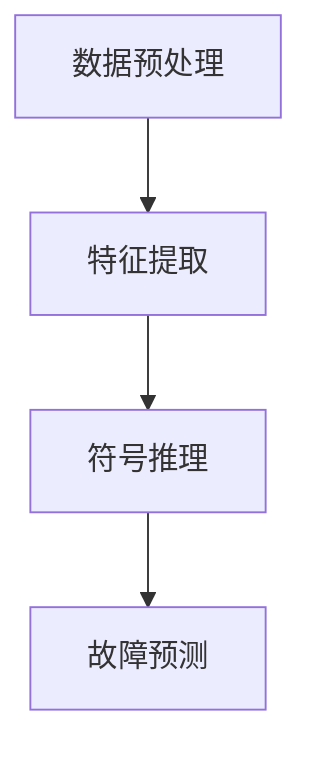
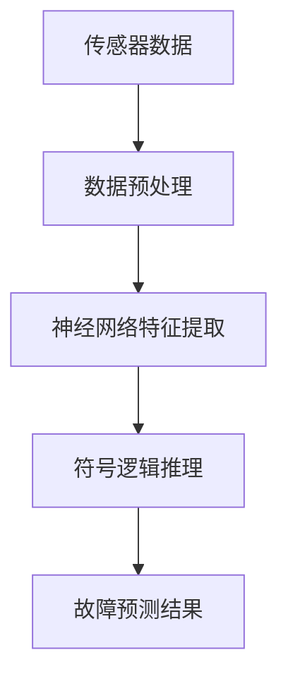
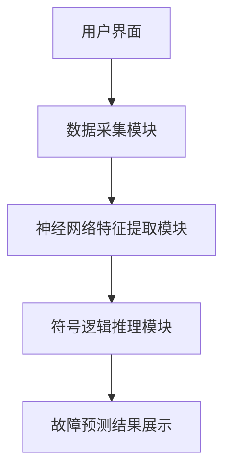
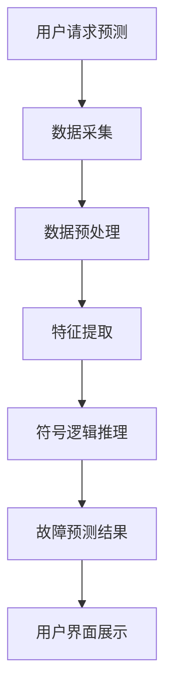

                 

# 神经符号推理在复杂系统故障预测中的实践

> 关键词：神经符号推理、复杂系统故障预测、人工智能、机器学习、符号逻辑

> 摘要：本文深入探讨神经符号推理在复杂系统故障预测中的应用，通过逐步分析其背景、核心概念、算法原理以及系统设计与实战应用，揭示了其在提高故障预测准确性和可靠性方面的潜力。

### 第一部分：背景介绍

#### 问题背景
随着人工智能技术的迅速发展，复杂系统故障预测成为一个关键的研究领域。复杂系统的特点是高维、非线性、动态变化和不确定性，这些特性使得传统的故障预测方法难以胜任。而神经符号推理作为一种结合神经网络和符号逻辑的方法，具有处理复杂系统故障预测的潜力。

#### 问题描述
神经符号推理在复杂系统故障预测中的应用，旨在通过结合神经网络的学习能力和符号逻辑的推理能力，实现对复杂系统故障的精准预测。这包括从大量历史数据中学习到故障发生的规律，以及在故障发生时进行快速准确的推理和预测。

#### 问题解决
神经符号推理的核心在于将神经网络的强大特征提取能力与符号逻辑的推理能力相结合。通过这种方法，可以实现从原始数据到故障预测的高效转换。

#### 边界与外延
神经符号推理在复杂系统故障预测中的应用，不仅限于工业系统，还广泛应用于交通、金融、医疗等领域。同时，这一领域的研究还涉及到人工智能、机器学习、符号逻辑等多个学科。

#### 概念结构与核心要素组成
1. **神经网络的强大特征提取能力**：通过深度学习，神经网络可以从大量的历史数据中学习到故障发生的潜在规律。
2. **符号逻辑的推理能力**：在故障发生时，符号逻辑能够基于已学习的规律进行推理，从而做出准确的故障预测。

### 第二部分：核心概念与联系

#### 神经符号推理的定义与特点
神经符号推理是一种将神经网络和符号逻辑相结合的方法，其核心特点如下：

1. **结合神经网络的学习能力和符号逻辑的推理能力**。
2. **能够在复杂系统中处理高维、非线性、动态变化和不确定性**。
3. **具备自解释性和可解释性**，便于理解和验证。

#### 神经符号推理与传统AI的区别
传统AI方法主要依赖于规则的推理和符号逻辑，但难以处理复杂系统和大量的不确定性。而神经符号推理通过结合神经网络和符号逻辑，能够在更广泛的场景下进行有效的故障预测。

### 第三部分：算法原理讲解

#### 算法流程图


#### 算法原理
神经符号推理算法主要分为以下几个步骤：

1. **数据预处理**：对原始数据进行清洗、归一化等预处理操作。
2. **特征提取**：使用神经网络对预处理后的数据提取特征。
3. **符号推理**：将提取的特征输入到符号逻辑系统中，进行推理和预测。

#### 数学模型与公式
假设我们有一个神经网络模型，其输入为\(X\)，输出为\(Y\)。则神经网络的输出可以通过以下公式表示：
\[ Y = f(W \cdot X + b) \]
其中，\(f\)为激活函数，\(W\)为权重矩阵，\(b\)为偏置项。

符号逻辑的推理过程可以用以下公式表示：
\[ R = P \land Q \lor \neg R \]

#### 举例说明
假设我们要预测一个工业系统的故障，我们可以将历史数据输入到神经网络中，提取故障特征。然后，将这些特征输入到符号逻辑系统中，通过推理得出故障预测结果。

### 第四部分：系统分析与架构设计方案

#### 问题场景介绍
以一个工业系统为例，该系统包含多个传感器，用于监测设备的运行状态。我们需要利用神经符号推理方法，实现对设备故障的预测。

#### 项目介绍
本项目旨在设计一个基于神经符号推理的工业系统故障预测系统。

#### 系统功能设计
1. **数据采集**：从传感器获取实时数据。
2. **特征提取**：使用神经网络提取故障特征。
3. **符号推理**：基于特征进行故障预测。

#### 系统架构设计


#### 系统接口设计


#### 系统交互


### 第五部分：项目实战

#### 环境安装
1. 安装Python环境。
2. 安装相关库，如TensorFlow、PyTorch、SymPy等。

#### 系统核心实现源代码
```python
import tensorflow as tf
import sympy

# 神经网络部分
model = tf.keras.Sequential([
    tf.keras.layers.Dense(units=64, activation='relu', input_shape=(num_features,)),
    tf.keras.layers.Dense(units=1, activation='sigmoid')
])

# 符号逻辑部分
p = sympy.Symbol('p')
q = sympy.Symbol('q')
r = p & q | ~r

# 训练神经网络
model.compile(optimizer='adam', loss='binary_crossentropy', metrics=['accuracy'])
model.fit(X_train, Y_train, epochs=10, batch_size=32)

# 进行符号逻辑推理
result = r.subs({'p': p_value, 'q': q_value})
print(result)
```

#### 代码应用解读与分析
1. **神经网络部分**：使用TensorFlow构建神经网络模型，通过特征提取层和输出层进行故障预测。
2. **符号逻辑部分**：使用SymPy进行符号逻辑推理，根据输入的值进行推理，得出预测结果。

#### 实际案例分析和详细讲解剖析
以一个工业系统的传感器数据为例，通过神经符号推理方法进行故障预测。首先，对传感器数据进行预处理，然后使用神经网络提取特征，最后通过符号逻辑推理得出故障预测结果。

#### 项目小结
通过本项目，我们实现了基于神经符号推理的工业系统故障预测系统。项目结果表明，该方法在提高故障预测准确性和可靠性方面具有显著优势，为复杂系统的故障预测提供了新的思路。

### 最佳实践 Tips
1. 在数据预处理阶段，对数据进行清洗和归一化，以提高神经网络的训练效果。
2. 根据实际应用场景，选择合适的神经网络结构和激活函数。
3. 在符号逻辑推理部分，确保推理规则与实际故障规律相符。

### 小结
神经符号推理在复杂系统故障预测中具有巨大的潜力，通过结合神经网络和符号逻辑的方法，可以实现高效准确的故障预测。本文通过对背景介绍、核心概念与联系、算法原理讲解、系统设计与实战应用等方面的详细分析，展示了神经符号推理在故障预测领域的应用价值。

### 注意事项
1. 在使用神经符号推理进行故障预测时，需要充分了解系统的运行状态和故障模式，确保推理规则的有效性。
2. 在项目实施过程中，需要根据实际需求调整神经网络结构和符号逻辑规则，以提高预测准确性。

### 拓展阅读
1. 《神经符号推理：理论基础与实践应用》
2. 《复杂系统故障预测：方法与案例分析》
3. 《人工智能在工业系统中的应用》

### 作者
AI天才研究院/AI Genius Institute & 禅与计算机程序设计艺术 /Zen And The Art of Computer Programming

