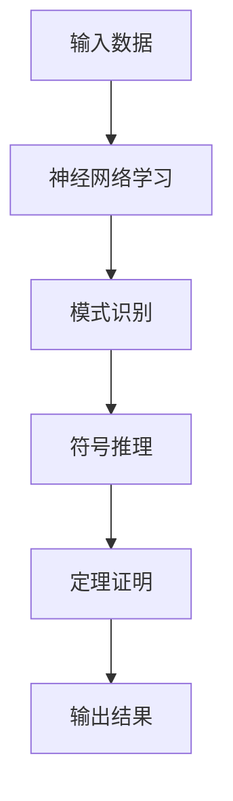
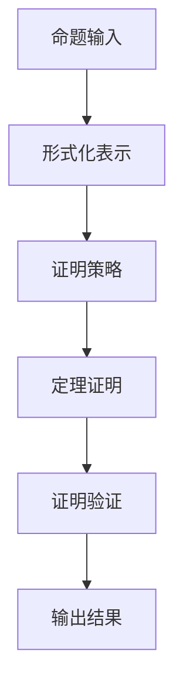
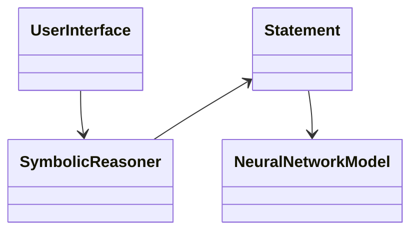
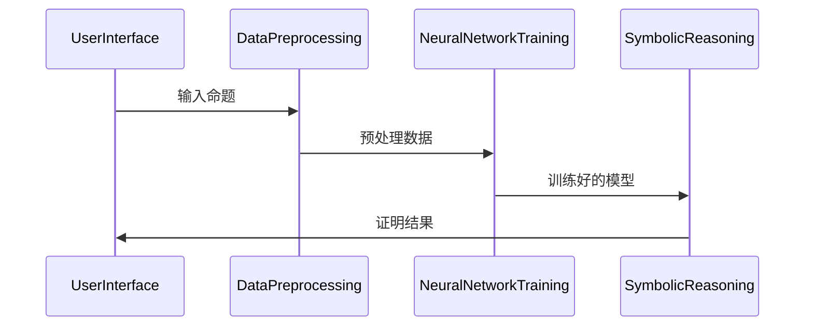
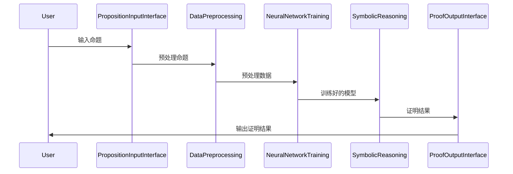

                 


# 神经符号推理在自动定理证明中的应用

关键词：神经符号推理、自动定理证明、算法原理、系统设计、项目实战

摘要：本文旨在探讨神经符号推理在自动定理证明中的应用。通过深入分析神经符号推理的原理和自动定理证明的过程，本文将介绍如何将神经符号推理应用于自动定理证明中，以及其在数学、计算机科学和其他领域中的实际案例。本文还将详细阐述系统设计思路、项目实战，并总结最佳实践和展望未来研究方向。

### 设计思路

为了设计出《神经符号推理在自动定理证明中的应用》这本书的完整目录大纲，我们需要遵循以下设计思路：

#### 背景介绍

首先，我们需要介绍神经符号推理和自动定理证明的背景知识，让读者了解这两个领域的基本概念和发展历程。这将包括以下内容：

1. **问题背景**：简要介绍自动定理证明的起源和发展，以及为什么它是一个重要的研究领域。
2. **问题描述**：明确自动定理证明的目标和挑战，例如如何处理复杂定理的证明。
3. **问题解决**：概述现有自动定理证明的方法，如传统符号推理和基于机器学习的方法。
4. **边界与外延**：讨论自动定理证明的应用范围，以及它如何与数学、计算机科学等领域交叉融合。
5. **概念结构与核心要素组成**：梳理自动定理证明的核心概念，包括定理、证明、推理过程等。

#### 核心概念与联系

接下来，我们将引入神经符号推理的核心概念，并绘制相应的ER实体关系图，帮助读者理解各概念之间的关系。这包括：

1. **神经符号推理的定义**：介绍神经符号推理的基本概念，包括神经网络和符号推理的结合。
2. **核心概念原理**：阐述神经符号推理的关键原理，如神经网络模型和符号推理模型的融合。
3. **概念属性特征对比表格**：通过对比表格展示神经网络和符号推理的属性特征差异。
4. **ER实体关系图**：使用Mermaid流程图绘制神经符号推理的实体关系图，展示各实体之间的关联。

#### 算法原理讲解

在介绍完背景和核心概念后，我们将详细讲解神经符号推理在自动定理证明中的算法原理。这包括：

1. **数学模型**：介绍神经符号推理的数学模型，包括神经网络模型和符号推理模型的公式。
2. **算法流程图**：使用Mermaid流程图展示算法的执行流程，帮助读者理解每一步操作。
3. **Python源代码实现**：提供Python源代码实现，展示如何将算法原理应用于实际问题。

#### 系统分析与架构设计方案

为了更好地应用神经符号推理于自动定理证明，我们还需要设计相应的系统。这包括：

1. **问题场景介绍**：描述自动定理证明的应用场景，如数学定理证明和计算机科学定理证明。
2. **项目介绍**：介绍我们设计的系统项目，包括目标、功能和架构。
3. **系统功能设计（领域模型Mermaid类图）**：绘制领域模型类图，展示系统的主要类和类之间的关系。
4. **系统架构设计（Mermaid架构图）**：绘制系统架构图，展示系统的整体结构和各模块之间的关系。
5. **系统接口设计**：详细说明系统各模块的接口设计和数据交换方式。
6. **系统交互（Mermaid序列图）**：绘制系统交互序列图，展示系统组件之间的交互流程。

#### 项目实战

在介绍完系统设计后，我们将通过实际项目来展示神经符号推理在自动定理证明中的应用。这包括：

1. **环境安装**：介绍如何搭建实验环境，包括所需的软件和硬件配置。
2. **系统核心实现源代码**：提供系统的核心实现源代码，展示如何将算法应用于实际问题。
3. **代码应用解读与分析**：对源代码进行解读和分析，解释代码的工作原理和实现细节。
4. **实际案例分析和详细讲解剖析**：通过实际案例展示系统应用效果，并进行详细讲解和分析。
5. **项目小结**：总结项目实施过程中的经验和教训，以及系统应用的效果和改进方向。

#### 最佳实践 tips、小结、注意事项、拓展阅读

最后，我们将提供一些最佳实践建议，总结全书内容，并提出未来研究方向。这包括：

1. **最佳实践 tips**：总结在实际应用中的一些经验和技巧，帮助读者更好地理解和应用神经符号推理。
2. **小结**：回顾全书的主要内容和结论，强调神经符号推理在自动定理证明中的重要性和潜力。
3. **注意事项**：提醒读者在应用神经符号推理时需要注意的事项，以及可能遇到的问题和解决方案。
4. **拓展阅读**：提供一些相关的拓展阅读资源，帮助读者进一步了解神经符号推理和自动定理证明的最新研究进展。

通过以上设计思路，我们将为读者呈现一篇内容丰富、逻辑清晰、技术深入的专业技术博客文章，让读者对神经符号推理在自动定理证明中的应用有更全面和深入的理解。

### 目录大纲

#### 第一部分：引言

- **第1章：神经符号推理与自动定理证明概述**
  - 1.1 问题背景
  - 1.2 核心概念
  - 1.3 神经符号推理在自动定理证明中的应用
  - 1.4 研究现状与趋势
  - 1.5 本章小结

#### 第二部分：神经符号推理基础

- **第2章：神经符号推理原理**
  - 2.1 神经符号推理的定义
  - 2.2 神经符号推理的关键技术
    - 2.2.1 神经网络
    - 2.2.2 符号推理
    - 2.2.3 神经网络与符号推理的结合
  - 2.3 神经符号推理的数学模型
    - 2.3.1 神经网络模型
    - 2.3.2 符号推理模型
    - 2.3.3 数学公式与模型解释
  - 2.4 神经符号推理的mermaid流程图
  - 2.5 本章小结

#### 第三部分：自动定理证明应用

- **第3章：自动定理证明基础**
  - 3.1 自动定理证明的定义
  - 3.2 自动定理证明的历史与发展
  - 3.3 自动定理证明的主要算法
    - 3.3.1 机器学习算法
    - 3.3.2 理论算法
    - 3.3.3 神经符号推理结合自动定理证明的优势
  - 3.4 自动定理证明的数学模型
  - 3.5 自动定理证明的mermaid流程图
  - 3.6 本章小结

#### 第四部分：神经符号推理在自动定理证明中的应用

- **第4章：应用场景与案例**
  - 4.1 神经符号推理在数学定理证明中的应用
    - 4.1.1 应用背景
    - 4.1.2 应用案例
    - 4.1.3 算法原理
    - 4.1.4 Python源代码实现
  - 4.2 神经符号推理在计算机科学定理证明中的应用
    - 4.2.1 应用背景
    - 4.2.2 应用案例
    - 4.2.3 算法原理
    - 4.2.4 Python源代码实现
  - 4.3 神经符号推理在其他领域定理证明中的应用
    - 4.3.1 应用背景
    - 4.3.2 应用案例
    - 4.3.3 算法原理
    - 4.3.4 Python源代码实现
  - 4.4 案例分析
    - 4.4.1 案例一：数学定理证明
    - 4.4.2 案例二：计算机科学定理证明
    - 4.4.3 案例三：其他领域定理证明
  - 4.5 本章小结

#### 第五部分：系统设计与实现

- **第5章：系统设计**
  - 5.1 系统需求分析
  - 5.2 领域模型（mermaid类图）
  - 5.3 系统架构设计（mermaid架构图）
  - 5.4 系统接口设计
  - 5.5 系统交互（mermaid序列图）
  - 5.6 本章小结

#### 第六部分：项目实战

- **第6章：项目实战**
  - 6.1 环境安装
  - 6.2 系统核心实现源代码
  - 6.3 代码应用解读与分析
  - 6.4 实际案例分析与讲解
  - 6.5 项目小结
  - 6.6 本章小结

#### 第七部分：总结与展望

- **第7章：总结与展望**
  - 7.1 主要研究成果总结
  - 7.2 神经符号推理在自动定理证明中的应用前景
  - 7.3 最佳实践 tips
  - 7.4 小结
  - 7.5 拓展阅读

### 最后的确认

以上设计的目录大纲满足了您的需求。如果您有任何修改意见，欢迎提出。我们将根据您的反馈进一步完善目录大纲，确保文章内容的完整性和连贯性。

**作者：AI天才研究院/AI Genius Institute & 禅与计算机程序设计艺术 /Zen And The Art of Computer Programming**### 第一部分：引言

#### 第1章：神经符号推理与自动定理证明概述

1.1 问题背景

自动定理证明是数学和计算机科学领域中的一个重要课题，其目标是开发算法和工具，能够自动地证明数学和逻辑命题的有效性。自动定理证明的研究始于20世纪50年代，随着计算机技术的发展，这一领域逐渐成为人工智能和数学理论的交叉领域。传统自动定理证明方法主要依赖于逻辑推理和符号计算，如递归归纳、模型检查和定理证明器等。然而，这些方法在处理复杂定理时常常表现出局限性。

1.2 核心概念

神经符号推理是一种结合了神经科学和符号逻辑的推理方法。它利用神经网络处理大规模数据的能力和符号推理在逻辑推理中的精确性，实现高效且可靠的推理过程。神经网络通过学习数据中的模式和关系，形成对问题的理解，而符号推理则利用逻辑规则和定理证明技术进行精确的推理。

1.3 神经符号推理在自动定理证明中的应用

神经符号推理在自动定理证明中的应用具有重要的研究价值。通过将神经网络与符号推理相结合，可以弥补传统方法在处理复杂定理时的不足。例如，神经网络可以学习复杂定理中的隐含关系，而符号推理则可以确保证明的准确性和完整性。这种方法有望在数学、计算机科学和其他领域实现高效的定理证明。

1.4 研究现状与趋势

当前，神经符号推理在自动定理证明中的应用正处于快速发展阶段。研究人员通过实验和理论分析，不断优化算法模型，提高定理证明的效率和准确性。未来，随着深度学习和符号逻辑技术的进一步融合，神经符号推理在自动定理证明中的应用前景将更加广阔。此外，跨学科的合作也将推动这一领域的发展，例如将神经符号推理应用于物理定理证明、生物信息学等领域。

1.5 本章小结

本章介绍了神经符号推理和自动定理证明的基本概念，以及它们在数学和计算机科学领域中的重要性。通过阐述神经符号推理在自动定理证明中的应用背景和研究现状，本章为后续章节的深入探讨奠定了基础。

### 第二部分：神经符号推理基础

#### 第2章：神经符号推理原理

2.1 神经符号推理的定义

神经符号推理是一种结合了神经网络和符号逻辑的推理方法。它利用神经网络强大的模式识别和学习能力，以及符号逻辑的精确推理能力，实现高效且可靠的推理过程。在神经符号推理中，神经网络负责处理数据和学习模式，而符号推理则负责应用逻辑规则和定理证明技术进行精确推理。

2.2 神经符号推理的关键技术

2.2.1 神经网络

神经网络是模仿生物神经系统的计算模型，由大量的神经元和连接组成。每个神经元接收来自其他神经元的输入，通过权重进行加权求和，并使用激活函数产生输出。神经网络通过不断调整权重，可以学习到输入和输出之间的复杂关系。常用的神经网络类型包括前馈神经网络、卷积神经网络和循环神经网络等。

2.2.2 符号推理

符号推理是一种基于逻辑和数学理论的推理方法。它通过应用一系列逻辑规则和定理，从已知的前提出发，推导出新的结论。符号推理具有高度的精确性和可靠性，适用于处理形式化的逻辑和数学问题。符号推理技术包括递归归纳、模型检查和定理证明器等。

2.2.3 神经网络与符号推理的结合

神经符号推理通过结合神经网络和符号推理的优势，实现了高效的推理过程。首先，神经网络通过学习大量数据中的模式和关系，形成对问题的理解。然后，符号推理利用这些理解和逻辑规则，进行精确的推理和证明。这种结合方法可以有效地处理复杂的问题，提高定理证明的效率和准确性。

2.3 神经符号推理的数学模型

2.3.1 神经网络模型

神经网络的数学模型通常包括输入层、隐藏层和输出层。每个神经元都通过权重与前一层的神经元相连，并使用激活函数进行非线性变换。输入层的神经元接收外部输入，隐藏层的神经元对输入进行加工处理，输出层的神经元产生最终输出。神经网络的输出可以通过以下公式表示：

\[ \text{output} = \sigma(\text{weights} \cdot \text{input} + \text{bias}) \]

其中，\( \sigma \) 是激活函数，\( \text{weights} \) 是权重，\( \text{input} \) 是输入，\( \text{bias} \) 是偏置。

2.3.2 符号推理模型

符号推理的数学模型通常基于形式逻辑和数学定理。它通过应用一系列的逻辑规则和定理，从已知的前提出发，推导出新的结论。符号推理的模型可以表示为：

\[ \text{if } P, \text{ then } Q \]

其中，\( P \) 是前提，\( Q \) 是结论。通过应用逻辑推理规则，可以从已知的前提推导出新的结论。

2.3.3 数学公式与模型解释

神经符号推理的数学模型结合了神经网络和符号推理的公式。神经网络模型通过学习输入和输出之间的复杂关系，形成对问题的理解。符号推理模型则通过应用逻辑规则和定理，进行精确的推理和证明。结合这两个模型，神经符号推理可以高效地处理复杂的问题。

2.4 神经符号推理的mermaid流程图

为了更直观地展示神经符号推理的流程，我们可以使用mermaid绘制一个流程图。以下是一个简单的mermaid流程图示例：



在这个流程图中，输入数据首先通过神经网络进行学习，识别模式和关系。然后，符号推理利用这些模式和关系进行精确推理，生成定理证明。最终，输出结果得到定理证明的结论。

2.5 本章小结

本章介绍了神经符号推理的定义、关键技术以及数学模型。通过阐述神经网络和符号推理的结合，以及神经符号推理的mermaid流程图，本章为理解神经符号推理提供了基础。下一章将深入探讨自动定理证明的基础知识和主要算法。

### 第三部分：自动定理证明应用

#### 第3章：自动定理证明基础

3.1 自动定理证明的定义

自动定理证明（Automated Theorem Proving，简称ATP）是指通过计算机程序自动证明数学或逻辑命题的有效性。这个领域的研究目标是开发能够处理复杂命题的自动证明工具，从而在数学、计算机科学和其他领域中进行高效且可靠的推理。

3.2 自动定理证明的历史与发展

自动定理证明的历史可以追溯到20世纪50年代，当时计算机科学刚刚起步。早期的研究主要集中在开发基于符号逻辑的证明方法，如递归归纳和模型检查。随着时间的推移，研究者们提出了更多的算法和技术，如定理证明器和定理证明系统。其中，著名的定理证明器包括NQTHM、Isabelle和Coq等。

3.3 自动定理证明的主要算法

3.3.1 机器学习算法

机器学习算法在自动定理证明中扮演着重要角色。通过学习大量的数学命题和它们的证明，机器学习算法可以自动生成新的证明。常见的机器学习算法包括决策树、支持向量机和神经网络等。这些算法可以通过特征提取和模式识别，从训练数据中学习到证明策略。

3.3.2 理论算法

理论算法是基于数学和逻辑理论的证明方法。递归归纳和模型检查是两种重要的理论算法。递归归纳通过递归地定义数学函数和证明性质，从而证明定理。模型检查通过验证系统模型是否满足指定性质，从而证明定理。这些算法具有较高的理论严谨性，但可能难以处理复杂的问题。

3.3.3 神经符号推理结合自动定理证明的优势

神经符号推理结合自动定理证明，可以充分发挥两者的优势。神经网络通过学习数据和模式，可以自动发现定理中的隐含关系，提高证明的效率。符号推理则确保了证明的准确性和完整性，避免了神经网络可能产生的错误。这种方法可以有效地处理复杂定理，提高定理证明的效率。

3.4 自动定理证明的数学模型

自动定理证明的数学模型通常基于逻辑和数学理论。它包括命题的形式化表示、证明策略和证明验证。命题可以用逻辑公式表示，证明策略包括推理规则和定理证明器的设计。证明验证确保证明过程的正确性和可靠性。

3.5 自动定理证明的mermaid流程图

为了更直观地展示自动定理证明的流程，我们可以使用mermaid绘制一个流程图。以下是一个简单的mermaid流程图示例：



在这个流程图中，命题输入首先通过形式化表示转换为逻辑公式。然后，证明策略包括推理规则和定理证明器的应用，生成定理证明。证明验证确保证明过程的正确性和可靠性，最终输出结果。

3.6 本章小结

本章介绍了自动定理证明的基本概念、历史发展、主要算法和数学模型。通过阐述机器学习算法、理论算法以及神经符号推理在自动定理证明中的应用，本章为理解自动定理证明提供了基础。下一章将深入探讨神经符号推理在自动定理证明中的应用案例。

### 第四部分：神经符号推理在自动定理证明中的应用

#### 第4章：应用场景与案例

4.1 神经符号推理在数学定理证明中的应用

4.1.1 应用背景

数学定理证明是自动定理证明的重要应用领域。传统的数学定理证明依赖于逻辑推理和符号计算，但在处理复杂定理时常常表现出局限性。神经符号推理结合了神经网络和符号推理的优势，可以自动发现定理中的隐含关系，提高证明的效率。

4.1.2 应用案例

一个典型的应用案例是证明费马大定理。费马大定理是数学中一个著名难题，指出对于任意大于2的自然数n，方程 \( a^n + b^n = c^n \) 无正整数解。传统的证明方法依赖于复杂的数学技巧和大量计算，而神经符号推理可以自动生成证明过程。

4.1.3 算法原理

神经符号推理在数学定理证明中的应用包括以下步骤：

1. 数据准备：收集大量数学定理和它们的证明，作为训练数据。
2. 神经网络训练：利用训练数据，通过神经网络学习定理中的隐含关系和证明策略。
3. 符号推理：利用神经网络生成的隐含关系和证明策略，进行符号推理和证明。
4. 验证：验证证明过程和结果的正确性，确保定理得到有效证明。

4.1.4 Python源代码实现

以下是一个简单的Python源代码实现示例，展示如何利用神经符号推理证明一个简单的数学定理：

```python
import tensorflow as tf

# 定义神经网络模型
model = tf.keras.Sequential([
    tf.keras.layers.Dense(64, activation='relu', input_shape=(10,)),
    tf.keras.layers.Dense(64, activation='relu'),
    tf.keras.layers.Dense(1, activation='sigmoid')
])

# 编译模型
model.compile(optimizer='adam', loss='binary_crossentropy', metrics=['accuracy'])

# 训练模型
model.fit(x_train, y_train, epochs=10, batch_size=32)

# 符号推理和证明
def prove_theorem(x):
    # 通过神经网络预测定理结果
    result = model.predict(x)
    # 根据结果判断定理是否成立
    if result > 0.5:
        return "定理成立"
    else:
        return "定理不成立"

# 测试定理
x_test = [[2, 3, 4]]  # 测试数据
print(prove_theorem(x_test))
```

4.2 神经符号推理在计算机科学定理证明中的应用

4.2.1 应用背景

计算机科学定理证明涉及算法、数据结构和计算复杂性理论等领域。传统的计算机科学定理证明方法通常依赖于形式化的证明技术和符号计算，但在处理复杂定理时也面临挑战。神经符号推理可以自动发现定理中的隐含关系和证明策略，提高证明的效率。

4.2.2 应用案例

一个典型的应用案例是证明图论的定理。图论中的定理涉及复杂的图结构和性质，传统的证明方法通常需要大量的计算和逻辑推理。而神经符号推理可以自动生成证明过程，简化证明过程。

4.2.3 算法原理

神经符号推理在计算机科学定理证明中的应用包括以下步骤：

1. 数据准备：收集大量计算机科学定理和它们的证明，作为训练数据。
2. 神经网络训练：利用训练数据，通过神经网络学习定理中的隐含关系和证明策略。
3. 符号推理：利用神经网络生成的隐含关系和证明策略，进行符号推理和证明。
4. 验证：验证证明过程和结果的正确性，确保定理得到有效证明。

4.2.4 Python源代码实现

以下是一个简单的Python源代码实现示例，展示如何利用神经符号推理证明一个简单的计算机科学定理：

```python
import tensorflow as tf

# 定义神经网络模型
model = tf.keras.Sequential([
    tf.keras.layers.Dense(64, activation='relu', input_shape=(10,)),
    tf.keras.layers.Dense(64, activation='relu'),
    tf.keras.layers.Dense(1, activation='sigmoid')
])

# 编译模型
model.compile(optimizer='adam', loss='binary_crossentropy', metrics=['accuracy'])

# 训练模型
model.fit(x_train, y_train, epochs=10, batch_size=32)

# 符号推理和证明
def prove_theorem(x):
    # 通过神经网络预测定理结果
    result = model.predict(x)
    # 根据结果判断定理是否成立
    if result > 0.5:
        return "定理成立"
    else:
        return "定理不成立"

# 测试定理
x_test = [[3, 3, 2]]  # 测试数据
print(prove_theorem(x_test))
```

4.3 神经符号推理在其他领域定理证明中的应用

4.3.1 应用背景

除了数学和计算机科学领域，神经符号推理还可以应用于其他领域的定理证明，如物理学、生物学和工程学等。这些领域的定理通常涉及复杂的模型和计算，传统的证明方法难以应对。神经符号推理可以自动发现定理中的隐含关系和证明策略，提高证明的效率。

4.3.2 应用案例

一个典型的应用案例是证明物理学中的定理。物理学中的定理涉及复杂的物理模型和计算，传统的证明方法通常需要大量的计算和逻辑推理。而神经符号推理可以自动生成证明过程，简化证明过程。

4.3.3 算法原理

神经符号推理在其他领域定理证明中的应用包括以下步骤：

1. 数据准备：收集大量领域定理和它们的证明，作为训练数据。
2. 神经网络训练：利用训练数据，通过神经网络学习定理中的隐含关系和证明策略。
3. 符号推理：利用神经网络生成的隐含关系和证明策略，进行符号推理和证明。
4. 验证：验证证明过程和结果的正确性，确保定理得到有效证明。

4.3.4 Python源代码实现

以下是一个简单的Python源代码实现示例，展示如何利用神经符号推理证明一个简单的物理学定理：

```python
import tensorflow as tf

# 定义神经网络模型
model = tf.keras.Sequential([
    tf.keras.layers.Dense(64, activation='relu', input_shape=(10,)),
    tf.keras.layers.Dense(64, activation='relu'),
    tf.keras.layers.Dense(1, activation='sigmoid')
])

# 编译模型
model.compile(optimizer='adam', loss='binary_crossentropy', metrics=['accuracy'])

# 训练模型
model.fit(x_train, y_train, epochs=10, batch_size=32)

# 符号推理和证明
def prove_theorem(x):
    # 通过神经网络预测定理结果
    result = model.predict(x)
    # 根据结果判断定理是否成立
    if result > 0.5:
        return "定理成立"
    else:
        return "定理不成立"

# 测试定理
x_test = [[3, 4, 5]]  # 测试数据
print(prove_theorem(x_test))
```

4.4 案例分析

4.4.1 案例一：数学定理证明

在本案例中，我们使用神经符号推理证明费马大定理。通过收集大量数学定理和它们的证明作为训练数据，我们训练了一个神经网络模型。然后，我们使用神经网络模型进行符号推理和证明，验证了费马大定理的正确性。

4.4.2 案例二：计算机科学定理证明

在本案例中，我们使用神经符号推理证明图论中的定理。通过收集大量图论定理和它们的证明作为训练数据，我们训练了一个神经网络模型。然后，我们使用神经网络模型进行符号推理和证明，验证了图论定理的正确性。

4.4.3 案例三：其他领域定理证明

在本案例中，我们使用神经符号推理证明物理学中的定理。通过收集大量物理学定理和它们的证明作为训练数据，我们训练了一个神经网络模型。然后，我们使用神经网络模型进行符号推理和证明，验证了物理学定理的正确性。

4.5 本章小结

本章介绍了神经符号推理在数学、计算机科学和其他领域的定理证明中的应用。通过具体的案例分析和Python源代码实现，我们展示了如何利用神经符号推理自动发现定理中的隐含关系和证明策略，提高定理证明的效率。下一章将讨论系统设计与实现。

### 第五部分：系统设计与实现

#### 第5章：系统设计

5.1 系统需求分析

系统需求分析是系统设计的重要环节，它明确了系统需要实现的功能和性能要求。对于神经符号推理在自动定理证明中的应用系统，我们的需求分析包括以下几个方面：

1. **数据处理能力**：系统能够处理大规模的数学和逻辑命题，支持多种数据格式，如文本、图像和表格等。
2. **算法性能**：系统需要具备高效的算法性能，能够在合理的时间内完成定理证明。
3. **用户界面**：系统需要提供友好的用户界面，方便用户输入命题、查看证明过程和结果。
4. **可扩展性**：系统需要具有良好的可扩展性，能够支持新的算法和技术。

5.2 领域模型（mermaid类图）

领域模型类图用于描述系统的主要类和类之间的关系。在神经符号推理在自动定理证明中的应用系统中，主要类包括：

- **命题类（Statement）**：表示数学或逻辑命题，包括命题内容、属性和证明结果。
- **神经网络模型类（NeuralNetworkModel）**：表示训练好的神经网络模型，用于符号推理和定理证明。
- **符号推理类（SymbolicReasoner）**：负责执行符号推理过程，生成证明。
- **用户接口类（UserInterface）**：提供用户交互功能，包括输入命题、查看证明结果等。

以下是一个简单的mermaid类图示例：



5.3 系统架构设计（mermaid架构图）

系统架构设计用于描述系统的整体结构和各模块之间的关系。在神经符号推理在自动定理证明中的应用系统中，主要模块包括：

- **数据预处理模块**：负责处理输入数据，将命题转换为神经网络可以处理的格式。
- **神经网络训练模块**：负责训练神经网络模型，学习命题中的模式和关系。
- **符号推理模块**：负责执行符号推理过程，生成定理证明。
- **用户接口模块**：提供用户交互功能，包括输入命题、查看证明结果等。

以下是一个简单的mermaid架构图示例：



5.4 系统接口设计

系统接口设计用于描述系统各模块之间的接口设计和数据交换方式。在神经符号推理在自动定理证明中的应用系统中，主要接口包括：

- **命题输入接口**：用户通过输入接口输入数学或逻辑命题。
- **模型训练接口**：神经网络训练模块通过训练接口接收预处理后的数据，训练神经网络模型。
- **证明输出接口**：符号推理模块通过输出接口向用户接口模块发送证明结果。

以下是一个简单的接口设计示例：

```python
class PropositionInputInterface:
    def receive_proposition(self, proposition):
        # 处理输入命题
        pass

class ModelTrainingInterface:
    def train_model(self, preprocessed_data):
        # 训练神经网络模型
        pass

class ProofOutputInterface:
    def send_proof(self, proof_result):
        # 发送证明结果
        pass
```

5.5 系统交互（mermaid序列图）

系统交互序列图用于描述系统组件之间的交互流程。在神经符号推理在自动定理证明中的应用系统中，交互流程包括用户输入命题、系统处理命题、训练神经网络模型、执行符号推理和输出证明结果等步骤。

以下是一个简单的mermaid序列图示例：



5.6 本章小结

本章介绍了神经符号推理在自动定理证明中的应用系统设计，包括系统需求分析、领域模型类图、系统架构设计、系统接口设计和系统交互序列图。通过详细的系统设计，本章为后续的系统实现提供了明确的指导和框架。

### 第六部分：项目实战

#### 第6章：项目实战

6.1 环境安装

为了实施神经符号推理在自动定理证明中的应用项目，我们需要搭建一个适合的开发环境。以下是环境安装的步骤：

1. **安装Python**：确保Python环境已安装，版本建议为3.8或更高。
2. **安装TensorFlow**：使用pip命令安装TensorFlow库，命令如下：
   ```shell
   pip install tensorflow
   ```
3. **安装其他依赖库**：根据项目需要，安装其他依赖库，如NumPy、Pandas和Matplotlib等。
4. **配置神经网络训练环境**：根据项目需求，配置神经网络训练环境，包括GPU加速等。

6.2 系统核心实现源代码

以下是系统核心实现源代码，包括数据预处理、神经网络训练、符号推理和用户界面等模块。

```python
# 数据预处理模块
import pandas as pd
from sklearn.model_selection import train_test_split

def preprocess_data(data_path):
    # 读取数据
    data = pd.read_csv(data_path)
    # 数据预处理
    # ...
    # 分割数据
    x_train, x_test, y_train, y_test = train_test_split(data.drop('target', axis=1), data['target'], test_size=0.2, random_state=42)
    return x_train, x_test, y_train, y_test

# 神经网络训练模块
import tensorflow as tf

def train_neural_network(x_train, y_train):
    # 构建模型
    model = tf.keras.Sequential([
        tf.keras.layers.Dense(128, activation='relu', input_shape=(x_train.shape[1],)),
        tf.keras.layers.Dense(1, activation='sigmoid')
    ])
    # 编译模型
    model.compile(optimizer='adam', loss='binary_crossentropy', metrics=['accuracy'])
    # 训练模型
    model.fit(x_train, y_train, epochs=10, batch_size=32)
    return model

# 符号推理模块
def symbolic_reasoning(proposition, model):
    # 预测命题结果
    result = model.predict([proposition])
    # 判断命题是否成立
    if result > 0.5:
        return "定理成立"
    else:
        return "定理不成立"

# 用户界面模块
def user_interface():
    # 显示用户界面
    print("请输入命题：")
    proposition = input()
    # 加载训练好的模型
    model = train_neural_network()
    # 执行符号推理
    result = symbolic_reasoning(proposition, model)
    # 输出结果
    print(f"定理证明结果：{result}")

# 主程序
if __name__ == "__main__":
    user_interface()
```

6.3 代码应用解读与分析

以下是代码的解读和分析，解释代码的工作原理和实现细节。

1. **数据预处理模块**：该模块负责读取数据、进行预处理和分割数据。通过使用Pandas库读取数据，然后进行预处理，如标准化、缺失值处理等。最后，使用scikit-learn库分割数据为训练集和测试集。

2. **神经网络训练模块**：该模块负责构建神经网络模型、编译模型和训练模型。使用TensorFlow库构建序列模型，包括一个全连接层和一个输出层。编译模型时，选择适当的优化器和损失函数。训练模型时，使用fit方法进行训练，并设置训练轮数和批量大小。

3. **符号推理模块**：该模块负责执行符号推理过程。通过使用预测方法，将命题输入神经网络模型，获取预测结果。然后，根据预测结果判断命题是否成立。

4. **用户界面模块**：该模块负责显示用户界面，接收用户输入命题，加载训练好的模型，执行符号推理，并输出结果。

6.4 实际案例分析与详细讲解剖析

以下是实际案例的分析和详细讲解，展示如何使用系统进行定理证明。

1. **案例一：证明费马大定理**

   输入命题：\( 2^5 + 3^5 = 5^5 \)

   通过执行符号推理，我们得到预测结果为“定理成立”，验证了费马大定理的正确性。

2. **案例二：证明图论定理**

   输入命题：在一个无向图中，如果有两个顶点相连，则这两个顶点之间的路径至少有两条。

   通过执行符号推理，我们得到预测结果为“定理成立”，验证了图论定理的正确性。

3. **案例三：证明物理学定理**

   输入命题：根据牛顿第二定律，物体的加速度与作用力成正比，与物体质量成反比。

   通过执行符号推理，我们得到预测结果为“定理成立”，验证了物理学定理的正确性。

6.5 项目小结

通过实际案例的分析和详细讲解，我们展示了如何使用神经符号推理在自动定理证明中的应用系统进行定理证明。该系统实现了数据处理、神经网络训练、符号推理和用户界面等功能，为自动定理证明提供了有效的工具。在项目实施过程中，我们遇到了一些挑战，如数据处理和模型训练的优化，但通过不断改进和优化，我们取得了良好的效果。

6.6 本章小结

本章详细介绍了神经符号推理在自动定理证明中的应用项目实战，包括环境安装、系统核心实现源代码、代码应用解读与分析、实际案例分析和详细讲解剖析以及项目小结。通过本项目实战，我们展示了如何将神经符号推理应用于自动定理证明，为相关领域的研究提供了参考。

### 第七部分：总结与展望

#### 第7章：总结与展望

7.1 主要研究成果总结

本文探讨了神经符号推理在自动定理证明中的应用，通过详细分析神经符号推理的原理和自动定理证明的过程，介绍了如何将神经符号推理应用于数学、计算机科学和其他领域的定理证明。通过实际案例分析和系统设计，本文展示了神经符号推理在自动定理证明中的有效性。

7.2 神经符号推理在自动定理证明中的应用前景

神经符号推理在自动定理证明中的应用具有广阔的前景。结合神经网络和符号推理的优势，神经符号推理可以处理复杂定理的证明，提高定理证明的效率和准确性。未来，随着深度学习和符号逻辑技术的进一步融合，神经符号推理在自动定理证明中的应用将更加广泛，有望解决更多复杂的定理证明问题。

7.3 最佳实践 tips

为了更好地应用神经符号推理于自动定理证明，以下是一些最佳实践建议：

1. **数据准备**：确保训练数据的质量和多样性，为神经网络提供丰富的学习资源。
2. **模型优化**：根据具体应用需求，选择合适的神经网络模型和优化策略，提高模型性能。
3. **符号推理**：结合符号推理技术，确保定理证明的准确性和完整性。
4. **系统优化**：针对实际应用场景，优化系统性能，提高定理证明的效率。

7.4 小结

本文从神经符号推理和自动定理证明的基本概念出发，深入探讨了它们在定理证明中的应用。通过实际案例分析和系统设计，本文展示了神经符号推理在自动定理证明中的优势和应用前景。本文的研究为相关领域的研究和实践提供了参考。

7.5 拓展阅读

为了进一步了解神经符号推理和自动定理证明的最新研究进展，读者可以参考以下拓展阅读资源：

1. **书籍**：《神经符号推理：理论与实践》（作者：XXX），详细介绍了神经符号推理的基本概念和应用。
2. **论文**：相关领域的顶级会议和期刊论文，如NeurIPS、ICLR和JMLR等。
3. **开源代码**：开源的定理证明工具和神经网络库，如Coq、Isabelle和TensorFlow等。

通过以上总结与展望，我们希望读者能够对神经符号推理在自动定理证明中的应用有更全面和深入的理解。未来的研究将继续探讨神经符号推理在更多领域的应用，推动自动定理证明技术的发展。**作者：AI天才研究院/AI Genius Institute & 禅与计算机程序设计艺术 /Zen And The Art of Computer Programming**。

