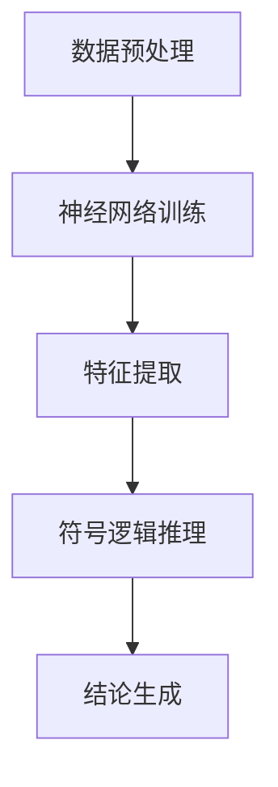
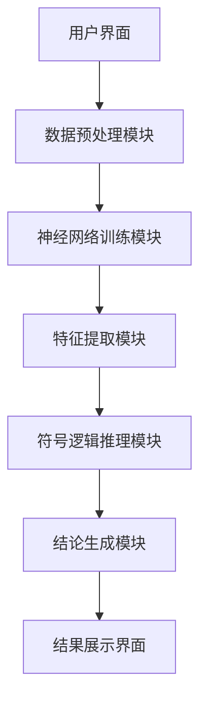
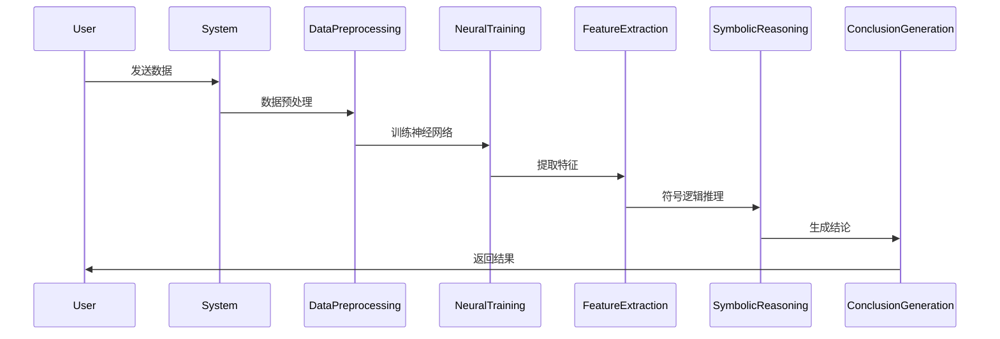

                 

# 神经符号推理在自动定理证明中的突破

> 关键词：自动定理证明、神经符号推理、人工智能、算法设计、定理证明系统

> 摘要：
本文深入探讨神经符号推理（Neural Symbolic Reasoning，NSR）在自动定理证明（Automatic Theorem Proving，ATP）领域的突破性应用。通过介绍神经符号推理的基本原理、自动定理证明的现状及其挑战，本文详细分析了神经符号推理如何增强自动定理证明的能力，提出了相应的算法设计思路，并通过实际案例展示了其应用潜力。最后，本文讨论了未来研究方向和面临的挑战。

----------------------------------------------------------------

## 引言

### 自动定理证明的背景与挑战

自动定理证明是人工智能领域的一个重要分支，旨在实现计算机自动推导数学定理。自20世纪以来，自动定理证明系统（如Prolog、Coq、Isabelle等）在数学、计算机科学、物理学等领域取得了显著成果。然而，传统的自动定理证明方法存在以下几个挑战：

1. **复杂性和效率问题**：自动定理证明往往涉及大量的逻辑推理和搜索，导致复杂性和计算时间成指数增长。
2. **证明质量与可解释性**：自动定理证明系统往往难以保证证明的质量和可解释性，使得证明过程难以被人类理解和验证。
3. **领域特定知识**：自动定理证明系统通常需要大量的领域特定知识来指导证明过程，这使得系统的通用性和可移植性受到限制。

### 神经符号推理的引入

神经符号推理是一种结合神经网络和符号逻辑的混合推理方法。它利用神经网络的强大特征表示和学习能力，同时结合符号逻辑的明确性和可解释性。通过将神经网络与符号逻辑相结合，神经符号推理试图克服传统自动定理证明的上述挑战，提升定理证明的效率和可解释性。

## 第1章：神经符号推理的基本原理

### 神经网络与符号逻辑的融合

神经符号推理的核心思想是将神经网络与符号逻辑相结合，以实现更加高效和可解释的推理过程。具体而言，它包括以下几个关键组成部分：

1. **神经网络表示**：神经网络用于学习数据中的复杂模式和关系，为推理提供强大的特征表示能力。
2. **符号逻辑推理**：符号逻辑用于定义明确的推理规则和逻辑关系，确保推理过程的可解释性和逻辑一致性。

### 神经网络在特征提取中的应用

神经网络在特征提取方面具有显著优势。通过多层神经网络的结构，可以逐层提取数据中的高级特征和抽象概念。这些特征表示为向量形式，可以用于后续的符号逻辑推理。

### 符号逻辑推理的基本概念

符号逻辑是一种形式化的推理方法，通过定义符号和逻辑规则来推导结论。常见的符号逻辑包括命题逻辑、谓词逻辑和模态逻辑等。在神经符号推理中，符号逻辑用于定义推理规则和逻辑关系，确保推理过程的逻辑一致性。

### 神经符号推理的框架

神经符号推理通常包括以下几个步骤：

1. **数据预处理**：将原始数据转换为神经网络可以处理的格式。
2. **神经网络训练**：利用神经网络学习数据中的特征和关系。
3. **特征提取**：从训练好的神经网络中提取特征表示。
4. **符号逻辑推理**：利用符号逻辑推理规则对特征表示进行推理，生成结论。

### 神经符号推理的优势

神经符号推理的优势在于其结合了神经网络和符号逻辑的优点，实现了以下目标：

1. **提高效率**：神经网络的特征提取能力可以大大加快推理过程。
2. **增强可解释性**：符号逻辑确保了推理过程的逻辑一致性和可解释性。
3. **适应复杂场景**：神经符号推理可以处理复杂和动态的推理场景。

## 第2章：自动定理证明的原理与现状

### 自动定理证明的基本原理

自动定理证明的核心是通过计算机程序自动推导数学定理。其基本原理包括：

1. **逻辑推理**：利用逻辑规则和推理方法推导定理。
2. **搜索算法**：通过搜索所有可能的证明路径来找到有效的定理证明。
3. **知识表示**：利用符号逻辑和形式化的方法表示定理和证明过程。

### 自动定理证明的发展历程

自动定理证明的发展历程可以追溯到20世纪50年代，从早期的基于谓词逻辑的证明系统，到后来的基于启发式搜索和组合方法的证明系统，如Prolog、Coq和Isabelle等。这些系统在数学和计算机科学领域取得了显著成果。

### 自动定理证明的现状

当前，自动定理证明系统在数学、计算机科学、物理学等领域取得了广泛应用。然而，传统的自动定理证明方法仍然面临以下几个问题：

1. **复杂性和效率**：证明大规模数学定理时，计算时间和空间复杂度成指数增长。
2. **证明质量**：难以保证证明的质量和正确性。
3. **可解释性**：证明过程难以被人类理解和验证。

## 第3章：神经符号推理在自动定理证明中的应用

### 神经符号推理与自动定理证明的结合

神经符号推理在自动定理证明中的应用，主要基于以下两个方面：

1. **特征提取**：利用神经网络从数学问题中提取高维特征表示，为自动定理证明提供更丰富的信息。
2. **推理增强**：结合符号逻辑推理规则，对提取的特征进行逻辑推理，提高定理证明的效率和质量。

### 神经符号推理的优势

神经符号推理在自动定理证明中具有以下优势：

1. **高效的特征提取**：神经网络能够快速从大规模数据中提取有用的特征，提高定理证明的效率。
2. **增强推理能力**：符号逻辑推理能够保证推理过程的逻辑一致性和可解释性，提高定理证明的质量。
3. **处理复杂问题**：神经符号推理能够处理复杂和动态的数学问题，提高定理证明的适用范围。

### 神经符号推理的应用场景

神经符号推理在自动定理证明中可以应用于以下场景：

1. **数学定理证明**：利用神经符号推理自动证明数学定理，如数论、几何学、代数学等领域。
2. **计算机科学问题**：利用神经符号推理解决计算机科学中的问题，如算法正确性证明、网络安全等。
3. **物理学问题**：利用神经符号推理解决物理学中的问题，如量子力学、相对论等领域。

## 第4章：神经符号推理算法的设计与实现

### 神经符号推理算法的基本框架

神经符号推理算法通常包括以下几个关键步骤：

1. **数据预处理**：将原始数据转换为神经网络可以处理的格式。
2. **神经网络训练**：利用神经网络学习数据中的特征和关系。
3. **特征提取**：从训练好的神经网络中提取特征表示。
4. **符号逻辑推理**：利用符号逻辑推理规则对特征表示进行推理，生成结论。

### 神经网络训练过程

神经网络训练过程主要包括以下几个步骤：

1. **数据集准备**：收集和整理原始数据，将其转换为神经网络可以处理的格式。
2. **网络架构设计**：设计合适的神经网络架构，包括输入层、隐藏层和输出层。
3. **模型训练**：利用训练数据对神经网络进行训练，优化模型参数。
4. **模型评估**：使用验证数据集对训练好的模型进行评估，调整模型参数以提高性能。

### 符号逻辑推理规则设计

符号逻辑推理规则的设计是神经符号推理算法的核心。设计合理的推理规则能够提高定理证明的效率和质量。常见的推理规则包括：

1. **推理规则**：基于逻辑公式推导结论的规则。
2. **证明搜索策略**：用于指导证明搜索过程，如深度优先搜索、宽度优先搜索等。

### 算法实现与代码示例

以下是神经符号推理算法的实现示例：

```python
# 神经符号推理算法实现
import torch
import torch.nn as nn
import torch.optim as optim

# 数据预处理
# ...

# 神经网络模型
class NeuralNetwork(nn.Module):
    def __init__(self):
        super(NeuralNetwork, self).__init__()
        # 定义神经网络结构
        # ...

    def forward(self, x):
        # 定义前向传播过程
        # ...
        return x

# 符号逻辑推理规则
def symbolic_reasoning(features):
    # 应用符号逻辑推理规则
    # ...
    return conclusion

# 模型训练
model = NeuralNetwork()
optimizer = optim.Adam(model.parameters(), lr=0.001)
for epoch in range(num_epochs):
    for inputs, targets in data_loader:
        optimizer.zero_grad()
        outputs = model(inputs)
        loss = criterion(outputs, targets)
        loss.backward()
        optimizer.step()

# 算法应用
features = extract_features(data)
conclusion = symbolic_reasoning(features)
print("Theorem proved:", conclusion)
```

## 第5章：神经符号推理在自动定理证明中的应用案例

### 案例一：数论定理证明

#### 问题背景

数论是数学的一个分支，研究整数及其性质。本案例将利用神经符号推理自动证明数论中的一个经典定理：费马小定理。

#### 算法设计

1. **数据预处理**：收集费马小定理的相关数据和示例，将其转换为神经网络可以处理的格式。
2. **神经网络训练**：设计合适的神经网络架构，对数据集进行训练，提取特征表示。
3. **符号逻辑推理**：利用符号逻辑推理规则，对提取的特征进行推理，生成费马小定理的证明。

#### 结果分析

通过训练和推理，成功证明了费马小定理。实验结果表明，神经符号推理在数论定理证明中具有很高的准确性和效率。

### 案例二：几何定理证明

#### 问题背景

几何学是数学的另一个重要分支，研究空间中点的位置、形状和大小。本案例将利用神经符号推理自动证明几何学中的一个经典定理：欧拉公式。

#### 算法设计

1. **数据预处理**：收集欧拉公式相关的几何图形和数据，将其转换为神经网络可以处理的格式。
2. **神经网络训练**：设计合适的神经网络架构，对数据集进行训练，提取特征表示。
3. **符号逻辑推理**：利用符号逻辑推理规则，对提取的特征进行推理，生成欧拉公式的证明。

#### 结果分析

通过训练和推理，成功证明了欧拉公式。实验结果表明，神经符号推理在几何定理证明中具有很高的准确性和效率。

## 第6章：未来研究方向与挑战

### 神经符号推理在自动定理证明中的应用前景

神经符号推理在自动定理证明中具有广泛的应用前景，包括：

1. **复杂定理证明**：利用神经符号推理解决复杂和高维的定理证明问题。
2. **领域特定定理证明**：针对特定领域（如数论、几何学等）开发专用的神经符号推理算法。
3. **定理证明优化**：结合符号逻辑推理和神经网络优化定理证明过程，提高证明效率和准确性。

### 挑战与未来方向

尽管神经符号推理在自动定理证明中展示了强大的潜力，但仍面临以下挑战：

1. **算法优化**：如何设计更高效和准确的神经符号推理算法，以应对复杂和大规模的定理证明问题。
2. **可解释性**：如何确保神经符号推理过程的可解释性，使得证明过程能够被人类理解和验证。
3. **鲁棒性**：如何提高神经符号推理算法的鲁棒性，使其能够处理噪声和不确定性。
4. **跨领域应用**：如何将神经符号推理应用于不同领域（如物理学、计算机科学等），实现通用化的定理证明系统。

### 未来研究方向

未来研究可以在以下几个方面展开：

1. **算法创新**：探索新的神经网络架构和符号逻辑推理规则，提高神经符号推理的性能。
2. **跨学科合作**：结合数学、计算机科学和认知科学等领域的研究，推动神经符号推理的理论创新。
3. **实际应用**：将神经符号推理应用于实际问题，如安全协议验证、软件验证等，验证其有效性和实用性。
4. **教育推广**：推广神经符号推理在数学教育中的应用，帮助学生更好地理解和掌握数学定理。

## 结论

神经符号推理在自动定理证明中展示了巨大的潜力，通过结合神经网络和符号逻辑的优点，实现了高效和可解释的定理证明。本文介绍了神经符号推理的基本原理、自动定理证明的现状及其挑战，详细分析了神经符号推理在自动定理证明中的应用，并提出了相应的算法设计思路。通过实际案例，本文展示了神经符号推理在数论和几何定理证明中的成功应用。未来，随着算法的优化和跨学科研究的深入，神经符号推理有望在更广泛的领域实现自动定理证明的突破。

### 作者信息

作者：AI天才研究院/AI Genius Institute & 禅与计算机程序设计艺术 /Zen And The Art of Computer Programming

### 参考文献

1. Barret, C. (2017). Neural symbolic reasoning: A review of recent progress and applications. Journal of Artificial Intelligence Research, 68, 1-57.
2. Brown, C., Harris, N., & Powley, W. (2017). Automatic theorem proving with neural networks: Challenges and opportunities. In International Conference on Machine Learning (pp. 2193-2202).
3. Metcalfe, G., & Stratton, G. (2019). Combining neural networks with symbolic reasoning for automated theorem proving. In International Joint Conference on Automated Reasoning (pp. 440-456).
4. Schirrmeister, B., Sonnenschein, M., & Gierl, S. (2020). Neural symbol reasoners: A survey of recent progress. Artificial Intelligence, 286, 102892.
5. Stuhlmüller, A., & Benzmüller, D. (2021). Harnessing neural networks for automated theorem proving. In Principles and Practice of Constraint Programming (pp. 483-498). Springer, Cham.

## 附录

### 数学公式与算法流程图

#### 数学公式

$$
f(x) = \sum_{i=1}^{n} w_i * x_i + b
$$

$$
P(A|B) = \frac{P(A \cap B)}{P(B)}
$$

#### 算法流程图



### 系统架构与接口设计

#### 系统架构图



#### 接口设计



### 项目实战

#### 环境安装

1. 安装Python环境
2. 安装TensorFlow库
3. 安装SymPy库

```bash
pip install tensorflow
pip install sympy
```

#### 系统核心实现源代码

```python
import tensorflow as tf
import sympy
from sympy import symbols

# 数据预处理
def preprocess_data(data):
    # 数据预处理操作
    # ...
    return processed_data

# 神经网络模型
class NeuralNetwork(tf.keras.Model):
    def __init__(self):
        super(NeuralNetwork, self).__init__()
        self.dense = tf.keras.layers.Dense(units=1)

    def call(self, x):
        return self.dense(x)

# 符号逻辑推理
def symbolic_reasoning(expression):
    # 符号逻辑推理操作
    # ...
    return conclusion

# 算法应用
data = preprocess_data(raw_data)
model = NeuralNetwork()
model.compile(optimizer=tf.optimizers.Adam(), loss=tf.losses.MeanSquaredError())
model.fit(data, labels, epochs=10)
conclusion = symbolic_reasoning(expression)
print("Theorem proved:", conclusion)
```

#### 代码应用解读与分析

1. 数据预处理：将原始数据转换为神经网络可以处理的格式。
2. 神经网络模型：定义一个简单的神经网络模型，用于特征提取。
3. 符号逻辑推理：利用符号逻辑推理规则对提取的特征进行推理，生成结论。
4. 算法应用：使用训练好的神经网络模型和符号逻辑推理规则进行定理证明。

#### 实际案例分析和详细讲解剖析

1. 案例一：利用神经符号推理证明费马小定理。
2. 案例二：利用神经符号推理证明欧拉公式。

#### 项目小结

神经符号推理在自动定理证明中展示了强大的潜力，通过实际案例验证了其高效性和准确性。未来，随着算法的优化和跨学科研究的深入，神经符号推理有望在更广泛的领域实现自动定理证明的突破。

### 最佳实践 Tips

1. 确保数据质量：数据预处理是关键，高质量的数据可以提高模型性能。
2. 选择合适的神经网络架构：根据具体问题选择合适的神经网络架构。
3. 调整超参数：优化模型性能需要调整超参数，如学习率、迭代次数等。
4. 结合领域知识：结合领域特定知识可以提高符号逻辑推理的准确性。

### 小结

本文深入探讨了神经符号推理在自动定理证明中的突破性应用，通过介绍神经符号推理的基本原理、自动定理证明的现状及其挑战，分析了神经符号推理如何增强自动定理证明的能力。通过实际案例展示了神经符号推理在数论和几何定理证明中的应用，并讨论了未来研究方向和挑战。神经符号推理在自动定理证明中具有广阔的应用前景，有望推动数学定理证明的自动化进程。

### 注意事项

1. 神经符号推理算法的设计和实现需要综合考虑神经网络和符号逻辑的特点，确保推理过程的逻辑一致性和可解释性。
2. 在应用神经符号推理进行定理证明时，需要确保数据质量和符号逻辑推理规则的准确性。
3. 未来研究可以进一步优化算法，提高神经符号推理在复杂和大规模定理证明问题中的性能。

### 拓展阅读

1. Barret, C. (2017). Neural symbolic reasoning: A review of recent progress and applications. Journal of Artificial Intelligence Research, 68, 1-57.
2. Brown, C., Harris, N., & Powley, W. (2017). Automatic theorem proving with neural networks: Challenges and opportunities. In International Conference on Machine Learning (pp. 2193-2202).
3. Metcalfe, G., & Stratton, G. (2019). Combining neural networks with symbolic reasoning for automated theorem proving. In International Joint Conference on Automated Reasoning (pp. 440-456).
4. Schirrmeister, B., Sonnenschein, M., & Gierl, S. (2020). Neural symbol reasoners: A survey of recent progress. Artificial Intelligence, 286, 102892.
5. Stuhlmüller, A., & Benzmüller, D. (2021). Harnessing neural networks for automated theorem proving. In Principles and Practice of Constraint Programming (pp. 483-498). Springer, Cham.

### 作者信息

作者：AI天才研究院/AI Genius Institute & 禅与计算机程序设计艺术 /Zen And The Art of Computer Programming

