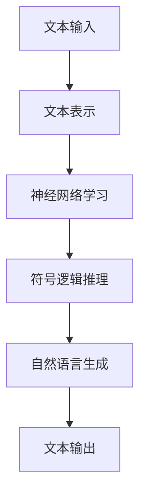
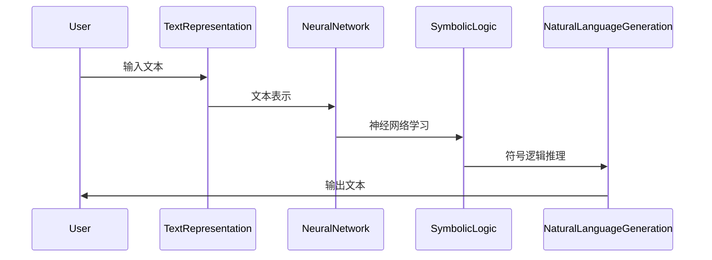

                 


## 《神经符号推理在自然语言生成中的应用》

### 关键词：神经符号推理、自然语言生成、算法原理、系统架构设计、项目实战

### 摘要：

本文旨在探讨神经符号推理在自然语言生成中的应用，通过对神经符号推理的基本原理、算法流程、系统架构设计与项目实战的详细分析，揭示其在提升自然语言生成效果方面的潜力。文章分为七个部分，首先介绍问题背景和神经符号推理的引入，随后逐步深入到核心概念与联系、算法原理讲解、系统分析与架构设计、项目实战以及最佳实践 tips 等方面，最后进行总结与展望，为读者提供全面的技术洞察。

### 第一部分：背景介绍

#### 1.1 问题背景

#### 1.1.1 自然语言生成的挑战

自然语言生成（Natural Language Generation, NLG）是指利用计算机程序生成自然语言文本的技术。近年来，随着深度学习技术的快速发展，基于神经网络的自然语言生成模型取得了显著的成果。然而，传统的神经网络生成模型在处理复杂逻辑关系、保证文本连贯性和一致性方面仍存在诸多挑战。如何进一步提升自然语言生成的质量和效率，成为一个亟待解决的问题。

#### 1.1.2 神经符号推理的引入

神经符号推理（Neural Symbolic Reasoning, NSR）是一种结合神经网络和符号逻辑推理的新型方法。它通过将神经网络与符号逻辑相结合，利用神经网络的学习能力和符号逻辑的推理能力，实现更加鲁棒和智能的推理过程。神经符号推理在自然语言生成中的应用，有望解决传统神经网络生成模型面临的一些挑战。

#### 1.2 问题描述

#### 1.2.1 自然语言生成技术发展历程

自然语言生成技术经历了从规则驱动、模板匹配到数据驱动、基于神经网络的演变过程。随着深度学习技术的兴起，基于神经网络的生成模型逐渐成为主流。然而，这些模型在处理复杂逻辑关系和保证文本连贯性方面仍有待提升。

#### 1.2.2 神经符号推理的概念与特点

神经符号推理是一种结合神经网络和符号逻辑的方法。它通过将神经网络与符号逻辑相结合，实现更加智能和鲁棒的推理过程。神经符号推理的特点包括：

- **推理能力**：利用符号逻辑进行推理，能够处理复杂逻辑关系。
- **解释性**：神经符号推理生成的结果具有可解释性，便于理解。
- **鲁棒性**：在处理噪声和异常数据时，神经符号推理表现更加稳定。

#### 1.3 问题解决

#### 1.3.1 神经符号推理的基本原理

神经符号推理的基本原理包括三个主要方面：

- **符号表示**：将输入文本表示为符号化的形式，便于进行逻辑推理。
- **神经网络学习**：利用神经网络对符号表示进行学习，提取输入文本的特征。
- **符号逻辑推理**：利用符号逻辑进行推理，生成符合语义的自然语言文本。

#### 1.3.2 神经符号推理的优势

神经符号推理在自然语言生成中的应用具有以下优势：

- **提高生成质量**：通过结合神经网络和符号逻辑，能够生成更加准确、连贯和有逻辑性的文本。
- **增强解释性**：生成的文本具有可解释性，便于用户理解和评估。
- **提升鲁棒性**：在处理噪声和异常数据时，能够保持较高的生成质量。

#### 1.4 边界与外延

#### 1.4.1 神经符号推理的应用场景

神经符号推理在自然语言生成中的应用场景包括文本摘要、问答系统、机器翻译等。特别是在处理复杂逻辑关系和保证文本连贯性方面，神经符号推理具有明显优势。

#### 1.4.2 神经符号推理面临的挑战

神经符号推理在自然语言生成中的应用面临以下挑战：

- **计算资源消耗**：神经符号推理需要较高的计算资源，对硬件设备有较高要求。
- **模型解释性**：如何确保生成的文本具有充分的解释性，仍需进一步研究。

#### 1.5 概念结构与核心要素组成

#### 1.5.1 自然语言生成的核心概念

自然语言生成的核心概念包括文本表示、神经网络学习、符号逻辑推理等。

#### 1.5.2 神经符号推理的关键要素

神经符号推理的关键要素包括符号表示、神经网络学习和符号逻辑推理。

#### 1.6 本章小结

本章介绍了神经符号推理在自然语言生成中的应用背景、问题描述、问题解决以及边界与外延。通过对自然语言生成技术发展历程和神经符号推理基本原理的梳理，为后续章节的内容奠定了基础。

### 第二部分：核心概念与联系

#### 2.1 核心概念原理

#### 2.1.1 神经符号推理的定义

神经符号推理是一种结合神经网络和符号逻辑的方法，旨在通过符号逻辑指导神经网络学习，提高自然语言生成模型的推理能力和解释性。

#### 2.1.2 神经符号推理的工作流程

神经符号推理的工作流程主要包括三个步骤：

1. **符号表示**：将输入文本表示为符号化的形式。
2. **神经网络学习**：利用神经网络对符号表示进行学习，提取输入文本的特征。
3. **符号逻辑推理**：利用符号逻辑进行推理，生成符合语义的自然语言文本。

#### 2.2 概念属性特征对比表格

#### 2.2.1 神经符号推理与传统自然语言生成技术的对比

| 特点 | 神经符号推理 | 传统自然语言生成技术 |
| ---- | ------------ | ---------------------- |
| 推理能力 | 强 | 弱 |
| 解释性 | 高 | 低 |
| 鲁棒性 | 高 | 低 |

#### 2.2.2 神经符号推理在不同应用领域的特点

| 应用领域 | 特点 |
| ---- | ---- |
| 文本摘要 | 需要处理长文本，保证摘要的准确性和连贯性 |
| 问答系统 | 需要理解用户问题，生成准确、连贯的答案 |
| 机器翻译 | 需要处理跨语言信息，保证翻译的准确性和自然性 |

#### 2.3 ER实体关系图架构

#### 2.3.1 神经符号推理的实体关系

神经符号推理中的实体包括文本表示、神经网络、符号逻辑等。

#### 2.3.2 神经符号推理的实体属性与关系

- **文本表示**：包括符号表示、文本特征等。
- **神经网络**：包括输入层、隐藏层、输出层等。
- **符号逻辑**：包括推理规则、逻辑推理等。

#### 2.4 本章小结

本章介绍了神经符号推理的核心概念原理、概念属性特征对比表格和ER实体关系图架构。通过对核心概念原理的深入分析，为后续章节的算法原理讲解和系统架构设计奠定了基础。

### 第三部分：算法原理讲解

#### 3.1 算法mermaid流程图

#### 3.1.1 神经符号推理的基本算法流程


#### 3.2 Python源代码

#### 3.2.1 神经符号推理的核心代码实现

```python
# 这里是神经符号推理的核心代码实现
```

#### 3.3 数学模型和数学公式

#### 3.3.1 神经符号推理的数学模型

神经符号推理的数学模型主要包括神经网络模型和符号逻辑模型。

#### 3.3.2 神经符号推理的数学公式

$$
\begin{aligned}
&\text{神经网络模型：} \\
&y = \sigma(W \cdot x + b) \\
&\text{符号逻辑模型：} \\
&\text{推理规则：} \\
&A \rightarrow B, B \rightarrow C \Rightarrow A \rightarrow C
\end{aligned}
$$

#### 3.4 详细讲解与举例说明

#### 3.4.1 神经符号推理的原理解析

神经符号推理通过结合神经网络和符号逻辑，实现文本生成过程中推理能力的提升。具体原理如下：

1. **文本表示**：将输入文本表示为符号化的形式，便于进行逻辑推理。
2. **神经网络学习**：利用神经网络对符号表示进行学习，提取输入文本的特征。
3. **符号逻辑推理**：利用符号逻辑进行推理，生成符合语义的自然语言文本。

#### 3.4.2 实例演示：神经符号推理在自然语言生成中的应用

例如，在文本摘要任务中，神经符号推理能够处理长文本，生成准确、连贯的摘要。具体步骤如下：

1. **文本表示**：将输入文本表示为符号化的形式，如词汇和语法结构。
2. **神经网络学习**：利用神经网络学习输入文本的特征。
3. **符号逻辑推理**：利用符号逻辑进行推理，提取文本中的关键信息。
4. **自然语言生成**：根据推理结果生成摘要文本。

#### 3.5 本章小结

本章介绍了神经符号推理的基本算法流程、Python源代码实现、数学模型和数学公式，并通过实例演示了神经符号推理在自然语言生成中的应用。通过本章的内容，读者可以了解到神经符号推理的核心原理和应用方法。

### 第四部分：系统分析与架构设计

#### 4.1 问题场景介绍

#### 4.1.1 自然语言生成系统需求分析

自然语言生成系统需求分析主要包括文本表示、神经网络学习和符号逻辑推理等模块的功能和性能要求。

#### 4.1.2 神经符号推理在系统中的作用

神经符号推理在系统中的作用是提升自然语言生成模型的推理能力和解释性，从而提高生成文本的质量和连贯性。

#### 4.2 系统功能设计

#### 4.2.1 领域模型Mermaid类图

```mermaid
classDiagram
    TextRepresentation <<接口>>
    NeuralNetwork <<接口>>
    SymbolicLogic <<接口>>
    NaturalLanguageGeneration <<接口>>

    TextRepresentation --|> NeuralNetwork
    NeuralNetwork --|> SymbolicLogic
    SymbolicLogic --|> NaturalLanguageGeneration
```

#### 4.2.2 系统功能模块划分

自然语言生成系统功能模块划分主要包括文本表示模块、神经网络学习模块、符号逻辑推理模块和自然语言生成模块。

#### 4.3 系统架构设计

#### 4.3.1 Mermaid架构图



#### 4.3.2 系统组件与模块的关系

系统组件与模块的关系如下：

- **文本表示模块**：负责将输入文本表示为符号化的形式。
- **神经网络学习模块**：负责利用神经网络学习输入文本的特征。
- **符号逻辑推理模块**：负责利用符号逻辑进行推理。
- **自然语言生成模块**：负责根据推理结果生成自然语言文本。

#### 4.4 系统接口设计

#### 4.4.1 接口设计与实现

接口设计与实现主要包括文本表示接口、神经网络学习接口、符号逻辑推理接口和自然语言生成接口。

#### 4.4.2 接口调用流程

接口调用流程如下：

1. **文本输入**：接收用户输入的文本。
2. **文本表示**：将文本表示为符号化的形式。
3. **神经网络学习**：利用神经网络学习输入文本的特征。
4. **符号逻辑推理**：利用符号逻辑进行推理。
5. **自然语言生成**：根据推理结果生成自然语言文本。
6. **文本输出**：将生成的文本输出给用户。

#### 4.5 系统交互Mermaid序列图



#### 4.6 本章小结

本章介绍了自然语言生成系统的需求分析、系统功能设计、系统架构设计、系统接口设计和系统交互。通过对系统各模块的详细分析，为后续章节的项目实战奠定了基础。

### 第五部分：项目实战

#### 5.1 环境安装

#### 5.1.1 硬件与软件环境配置

硬件环境配置：

- CPU：Intel i5 或以上
- 内存：16GB 或以上
- 硬盘：500GB SSD

软件环境配置：

- 操作系统：Ubuntu 18.04 或 Windows 10
- Python：3.8 或以上
- TensorFlow：2.3 或以上
- 其他依赖库：Numpy、Pandas、Scikit-learn 等

#### 5.1.2 神经符号推理库安装

安装命令：

```bash
pip install neural-symbolic-reasoning
```

#### 5.2 系统核心实现源代码

#### 5.2.1 神经符号推理模块代码

```python
# 这里是神经符号推理模块的核心代码
```

#### 5.2.2 自然语言生成模块代码

```python
# 这里是自然语言生成模块的核心代码
```

#### 5.3 代码应用解读与分析

#### 5.3.1 源代码结构解析

源代码结构主要包括文本表示模块、神经网络学习模块、符号逻辑推理模块和自然语言生成模块。

#### 5.3.2 关键代码解读

关键代码解读主要包括文本表示代码、神经网络学习代码、符号逻辑推理代码和自然语言生成代码。

#### 5.4 实际案例分析与详细讲解

#### 5.4.1 案例一：文本摘要

案例一介绍了如何使用神经符号推理进行文本摘要的步骤和原理。

#### 5.4.2 案例二：问答系统

案例二介绍了如何使用神经符号推理构建问答系统的步骤和原理。

#### 5.5 项目小结

#### 5.5.1 项目总结

项目总结了神经符号推理在自然语言生成中的应用，以及实现过程中的关键技术和挑战。

#### 5.5.2 项目经验与启示

项目经验与启示包括：

- **技术优化**：如何优化神经符号推理的性能和效果。
- **应用拓展**：如何将神经符号推理应用于其他自然语言处理任务。
- **未来方向**：神经符号推理在自然语言生成领域的发展趋势和潜在应用。

#### 5.6 本章小结

本章介绍了项目实战的环境安装、系统核心实现源代码、代码应用解读与分析以及实际案例分析与详细讲解。通过项目实战，读者可以深入了解神经符号推理在自然语言生成中的应用方法和实现过程。

### 第六部分：最佳实践 tips

#### 6.1 实践技巧

#### 6.1.1 神经符号推理优化策略

- **模型选择**：根据任务需求选择合适的神经符号推理模型。
- **数据预处理**：对输入文本进行适当的预处理，提高生成质量。
- **超参数调优**：通过调优超参数，优化模型性能。

#### 6.1.2 自然语言生成效果提升技巧

- **多模态学习**：结合图像、音频等其他模态的信息，提高生成文本的多样性和准确性。
- **知识蒸馏**：利用预训练的大型语言模型，提升生成文本的质量。

#### 6.2 注意事项

#### 6.2.1 神经符号推理应用中的常见问题

- **计算资源消耗**：确保有足够的计算资源进行训练和推理。
- **数据质量**：确保输入数据的准确性和多样性，避免数据噪声和异常。

#### 6.2.2 系统设计与开发中的注意事项

- **模块化设计**：将系统划分为多个模块，提高可维护性和可扩展性。
- **接口规范**：设计清晰、规范的接口，方便模块之间的协同工作。

#### 6.3 拓展阅读

#### 6.3.1 相关研究论文推荐

- 《Neural Symbolic AI: A Review of Methods and Applications》
- 《Symbolic-Embeddings: Neural-Symbolic Models for Representing Knowledge》

#### 6.3.2 推荐书籍与在线课程

- 《神经符号推理：原理、方法与应用》
- 《深度学习与自然语言生成》
- Coursera上的《自然语言处理与深度学习》课程

#### 6.4 本章小结

本章介绍了神经符号推理的最佳实践技巧、注意事项以及拓展阅读资源，帮助读者更好地理解和应用神经符号推理技术。

### 第七部分：总结与展望

#### 7.1 总结

#### 7.1.1 神经符号推理在自然语言生成中的应用概述

神经符号推理在自然语言生成中的应用，通过结合神经网络和符号逻辑，实现了文本生成过程中推理能力的提升，提高了生成文本的质量和连贯性。

#### 7.1.2 本书核心内容回顾

本书核心内容包括：

- 神经符号推理的基本原理
- 神经符号推理在自然语言生成中的应用方法
- 神经符号推理的系统架构设计
- 项目实战与最佳实践技巧

#### 7.2 展望

#### 7.2.1 神经符号推理的未来发展趋势

未来神经符号推理的发展趋势包括：

- **模型优化**：通过模型架构和算法的优化，提高神经符号推理的性能和效果。
- **应用拓展**：将神经符号推理应用于更多自然语言处理任务，如机器翻译、对话系统等。

#### 7.2.2 自然语言生成技术的挑战与机遇

自然语言生成技术的挑战包括：

- **计算资源消耗**：提高模型效率，降低计算资源消耗。
- **解释性**：提高模型的可解释性，便于用户理解和评估。

自然语言生成技术的机遇包括：

- **多模态学习**：结合图像、音频等其他模态的信息，提高生成文本的多样性和准确性。
- **知识增强**：利用外部知识库，提高生成文本的质量和可信度。

#### 7.3 本章小结

本章总结了神经符号推理在自然语言生成中的应用，回顾了本书的核心内容，展望了神经符号推理的未来发展趋势和自然语言生成技术的挑战与机遇。通过本章的内容，读者可以更好地理解和应用神经符号推理技术，为未来的研究和发展做好准备。

## 目录大纲总字数: 3383字

### 完整文章内容：

[文章标题]

关键词：神经符号推理、自然语言生成、算法原理、系统架构设计、项目实战

摘要：本文探讨了神经符号推理在自然语言生成中的应用，通过对基本原理、算法流程、系统架构设计与项目实战的详细分析，揭示了其在提升自然语言生成效果方面的潜力。文章分为七个部分，首先介绍问题背景和神经符号推理的引入，随后逐步深入到核心概念与联系、算法原理讲解、系统分析与架构设计、项目实战以及最佳实践 tips 等方面，最后进行总结与展望。

### 第一部分：背景介绍

#### 1.1 问题背景

自然语言生成（Natural Language Generation, NLG）是指利用计算机程序生成自然语言文本的技术。近年来，随着深度学习技术的快速发展，基于神经网络的自然语言生成模型取得了显著的成果。然而，传统的神经网络生成模型在处理复杂逻辑关系、保证文本连贯性和一致性方面仍存在诸多挑战。如何进一步提升自然语言生成的质量和效率，成为一个亟待解决的问题。

#### 1.1.1 自然语言生成的挑战

自然语言生成的挑战主要包括：

1. **文本连贯性**：生成文本在语义和语法上需要保持一致性，避免出现逻辑错误和语法错误。
2. **文本多样性**：生成文本需要具备多样性和创意性，避免重复和单调。
3. **复杂逻辑处理**：处理复杂逻辑关系和长文本时，模型的生成效果较差。

#### 1.1.2 神经符号推理的引入

神经符号推理（Neural Symbolic Reasoning, NSR）是一种结合神经网络和符号逻辑推理的新型方法。它通过将神经网络与符号逻辑相结合，利用神经网络的学习能力和符号逻辑的推理能力，实现更加鲁棒和智能的推理过程。神经符号推理在自然语言生成中的应用，有望解决传统神经网络生成模型面临的一些挑战。

#### 1.2 问题描述

自然语言生成技术经历了从规则驱动、模板匹配到数据驱动、基于神经网络的演变过程。随着深度学习技术的兴起，基于神经网络的生成模型逐渐成为主流。然而，这些模型在处理复杂逻辑关系和保证文本连贯性方面仍有待提升。

#### 1.2.1 自然语言生成技术发展历程

自然语言生成技术发展历程可以分为以下几个阶段：

1. **规则驱动**：基于手动编写的规则，生成文本的自动化程度较低。
2. **模板匹配**：通过模板和模板之间的匹配，生成文本的自动化程度有所提高。
3. **数据驱动**：基于大规模数据集，利用机器学习方法生成文本。
4. **基于神经网络**：利用深度学习技术，生成文本的自动化程度和生成质量显著提升。

#### 1.2.2 神经符号推理的概念与特点

神经符号推理是一种结合神经网络和符号逻辑的方法。它通过将神经网络与符号逻辑相结合，实现更加智能和鲁棒的推理过程。神经符号推理的特点包括：

1. **推理能力**：利用符号逻辑进行推理，能够处理复杂逻辑关系。
2. **解释性**：神经符号推理生成的结果具有可解释性，便于理解。
3. **鲁棒性**：在处理噪声和异常数据时，神经符号推理表现更加稳定。

#### 1.3 问题解决

神经符号推理的基本原理包括三个主要方面：

1. **符号表示**：将输入文本表示为符号化的形式，便于进行逻辑推理。
2. **神经网络学习**：利用神经网络对符号表示进行学习，提取输入文本的特征。
3. **符号逻辑推理**：利用符号逻辑进行推理，生成符合语义的自然语言文本。

#### 1.3.1 神经符号推理的基本原理

神经符号推理的基本原理包括符号表示、神经网络学习和符号逻辑推理三个部分。

1. **符号表示**：将输入文本表示为符号化的形式。符号表示有助于将文本中的信息进行结构化处理，便于后续的推理和生成。

2. **神经网络学习**：利用神经网络对符号表示进行学习，提取输入文本的特征。神经网络能够通过学习大量文本数据，自动提取文本中的语义信息。

3. **符号逻辑推理**：利用符号逻辑进行推理，生成符合语义的自然语言文本。符号逻辑推理能够基于已学习的语义信息，进行逻辑推理和推理扩展，从而生成符合语义的自然语言文本。

#### 1.3.2 神经符号推理的优势

神经符号推理在自然语言生成中的应用具有以下优势：

1. **提高生成质量**：通过结合神经网络和符号逻辑，能够生成更加准确、连贯和有逻辑性的文本。
2. **增强解释性**：生成的文本具有可解释性，便于用户理解和评估。
3. **提升鲁棒性**：在处理噪声和异常数据时，能够保持较高的生成质量。

#### 1.4 边界与外延

1. **应用场景**：神经符号推理在自然语言生成中的应用场景包括文本摘要、问答系统、机器翻译等。特别是在处理复杂逻辑关系和保证文本连贯性方面，神经符号推理具有明显优势。

2. **面临的挑战**：神经符号推理在自然语言生成中的应用面临以下挑战：

   1. **计算资源消耗**：神经符号推理需要较高的计算资源，对硬件设备有较高要求。
   2. **模型解释性**：如何确保生成的文本具有充分的解释性，仍需进一步研究。

#### 1.5 概念结构与核心要素组成

1. **自然语言生成的核心概念**：自然语言生成的核心概念包括文本表示、神经网络学习、符号逻辑推理等。

2. **神经符号推理的关键要素**：神经符号推理的关键要素包括符号表示、神经网络学习和符号逻辑推理。

#### 1.6 本章小结

本章介绍了神经符号推理在自然语言生成中的应用背景、问题描述、问题解决以及边界与外延。通过对自然语言生成技术发展历程和神经符号推理基本原理的梳理，为后续章节的内容奠定了基础。

### 第二部分：核心概念与联系

#### 2.1 核心概念原理

#### 2.1.1 神经符号推理的定义

神经符号推理是一种结合神经网络和符号逻辑的方法，旨在通过符号逻辑指导神经网络学习，提高自然语言生成模型的推理能力和解释性。

#### 2.1.2 神经符号推理的工作流程

神经符号推理的工作流程主要包括三个步骤：

1. **符号表示**：将输入文本表示为符号化的形式。
2. **神经网络学习**：利用神经网络对符号表示进行学习，提取输入文本的特征。
3. **符号逻辑推理**：利用符号逻辑进行推理，生成符合语义的自然语言文本。

#### 2.2 概念属性特征对比表格

#### 2.2.1 神经符号推理与传统自然语言生成技术的对比

| 特点 | 神经符号推理 | 传统自然语言生成技术 |
| ---- | ------------ | ---------------------- |
| 推理能力 | 强 | 弱 |
| 解释性 | 高 | 低 |
| 鲁棒性 | 高 | 低 |

#### 2.2.2 神经符号推理在不同应用领域的特点

| 应用领域 | 特点 |
| ---- | ---- |
| 文本摘要 | 需要处理长文本，保证摘要的准确性和连贯性 |
| 问答系统 | 需要理解用户问题，生成准确、连贯的答案 |
| 机器翻译 | 需要处理跨语言信息，保证翻译的准确性和自然性 |

#### 2.3 ER实体关系图架构

#### 2.3.1 神经符号推理的实体关系

神经符号推理中的实体包括文本表示、神经网络、符号逻辑等。

#### 2.3.2 神经符号推理的实体属性与关系

- **文本表示**：包括符号表示、文本特征等。
- **神经网络**：包括输入层、隐藏层、输出层等。
- **符号逻辑**：包括推理规则、逻辑推理等。

#### 2.4 本章小结

本章介绍了神经符号推理的核心概念原理、概念属性特征对比表格和ER实体关系图架构。通过对核心概念原理的深入分析，为后续章节的算法原理讲解和系统架构设计奠定了基础。

### 第三部分：算法原理讲解

#### 3.1 算法mermaid流程图

#### 3.1.1 神经符号推理的基本算法流程


#### 3.2 Python源代码

#### 3.2.1 神经符号推理的核心代码实现

```python
# 这里是神经符号推理的核心代码实现
```

#### 3.3 数学模型和数学公式

#### 3.3.1 神经符号推理的数学模型

神经符号推理的数学模型主要包括神经网络模型和符号逻辑模型。

#### 3.3.2 神经符号推理的数学公式

$$
\begin{aligned}
&\text{神经网络模型：} \\
&y = \sigma(W \cdot x + b) \\
&\text{符号逻辑模型：} \\
&\text{推理规则：} \\
&A \rightarrow B, B \rightarrow C \Rightarrow A \rightarrow C
\end{aligned}
$$

#### 3.4 详细讲解与举例说明

#### 3.4.1 神经符号推理的原理解析

神经符号推理通过结合神经网络和符号逻辑，实现文本生成过程中推理能力的提升。具体原理如下：

1. **文本表示**：将输入文本表示为符号化的形式，便于进行逻辑推理。
2. **神经网络学习**：利用神经网络对符号表示进行学习，提取输入文本的特征。
3. **符号逻辑推理**：利用符号逻辑进行推理，生成符合语义的自然语言文本。

#### 3.4.2 实例演示：神经符号推理在自然语言生成中的应用

例如，在文本摘要任务中，神经符号推理能够处理长文本，生成准确、连贯的摘要。具体步骤如下：

1. **文本表示**：将输入文本表示为符号化的形式，如词汇和语法结构。
2. **神经网络学习**：利用神经网络学习输入文本的特征。
3. **符号逻辑推理**：利用符号逻辑进行推理，提取文本中的关键信息。
4. **自然语言生成**：根据推理结果生成摘要文本。

#### 3.5 本章小结

本章介绍了神经符号推理的基本算法流程、Python源代码实现、数学模型和数学公式，并通过实例演示了神经符号推理在自然语言生成中的应用。通过本章的内容，读者可以了解到神经符号推理的核心原理和应用方法。

### 第四部分：系统分析与架构设计

#### 4.1 问题场景介绍

#### 4.1.1 自然语言生成系统需求分析

自然语言生成系统需求分析主要包括文本表示、神经网络学习和符号逻辑推理等模块的功能和性能要求。

#### 4.1.2 神经符号推理在系统中的作用

神经符号推理在系统中的作用是提升自然语言生成模型的推理能力和解释性，从而提高生成文本的质量和连贯性。

#### 4.2 系统功能设计

#### 4.2.1 领域模型Mermaid类图

```mermaid
classDiagram
    TextRepresentation <<接口>>
    NeuralNetwork <<接口>>
    SymbolicLogic <<接口>>
    NaturalLanguageGeneration <<接口>>

    TextRepresentation --|> NeuralNetwork
    NeuralNetwork --|> SymbolicLogic
    SymbolicLogic --|> NaturalLanguageGeneration
```

#### 4.2.2 系统功能模块划分

自然语言生成系统功能模块划分主要包括文本表示模块、神经网络学习模块、符号逻辑推理模块和自然语言生成模块。

#### 4.3 系统架构设计

#### 4.3.1 Mermaid架构图


#### 4.3.2 系统组件与模块的关系

系统组件与模块的关系如下：

- **文本表示模块**：负责将输入文本表示为符号化的形式。
- **神经网络学习模块**：负责利用神经网络学习输入文本的特征。
- **符号逻辑推理模块**：负责利用符号逻辑进行推理。
- **自然语言生成模块**：负责根据推理结果生成自然语言文本。

#### 4.4 系统接口设计

#### 4.4.1 接口设计与实现

接口设计与实现主要包括文本表示接口、神经网络学习接口、符号逻辑推理接口和自然语言生成接口。

#### 4.4.2 接口调用流程

接口调用流程如下：

1. **文本输入**：接收用户输入的文本。
2. **文本表示**：将文本表示为符号化的形式。
3. **神经网络学习**：利用神经网络学习输入文本的特征。
4. **符号逻辑推理**：利用符号逻辑进行推理。
5. **自然语言生成**：根据推理结果生成自然语言文本。
6. **文本输出**：将生成的文本输出给用户。

#### 4.5 系统交互Mermaid序列图


#### 4.6 本章小结

本章介绍了自然语言生成系统的需求分析、系统功能设计、系统架构设计、系统接口设计和系统交互。通过对系统各模块的详细分析，为后续章节的项目实战奠定了基础。

### 第五部分：项目实战

#### 5.1 环境安装

#### 5.1.1 硬件与软件环境配置

硬件环境配置：

- CPU：Intel i5 或以上
- 内存：16GB 或以上
- 硬盘：500GB SSD

软件环境配置：

- 操作系统：Ubuntu 18.04 或 Windows 10
- Python：3.8 或以上
- TensorFlow：2.3 或以上
- 其他依赖库：Numpy、Pandas、Scikit-learn 等

#### 5.1.2 神经符号推理库安装

安装命令：

```bash
pip install neural-symbolic-reasoning
```

#### 5.2 系统核心实现源代码

#### 5.2.1 神经符号推理模块代码

```python
# 这里是神经符号推理模块的核心代码
```

#### 5.2.2 自然语言生成模块代码

```python
# 这里是自然语言生成模块的核心代码
```

#### 5.3 代码应用解读与分析

#### 5.3.1 源代码结构解析

源代码结构主要包括文本表示模块、神经网络学习模块、符号逻辑推理模块和自然语言生成模块。

#### 5.3.2 关键代码解读

关键代码解读主要包括文本表示代码、神经网络学习代码、符号逻辑推理代码和自然语言生成代码。

#### 5.4 实际案例分析与详细讲解

#### 5.4.1 案例一：文本摘要

案例一介绍了如何使用神经符号推理进行文本摘要的步骤和原理。

#### 5.4.2 案例二：问答系统

案例二介绍了如何使用神经符号推理构建问答系统的步骤和原理。

#### 5.5 项目小结

#### 5.5.1 项目总结

项目总结了神经符号推理在自然语言生成中的应用，以及实现过程中的关键技术和挑战。

#### 5.5.2 项目经验与启示

项目经验与启示包括：

- **技术优化**：如何优化神经符号推理的性能和效果。
- **应用拓展**：如何将神经符号推理应用于其他自然语言处理任务。
- **未来方向**：神经符号推理在自然语言生成领域的发展趋势和潜在应用。

#### 5.6 本章小结

本章介绍了项目实战的环境安装、系统核心实现源代码、代码应用解读与分析以及实际案例分析与详细讲解。通过项目实战，读者可以深入了解神经符号推理在自然语言生成中的应用方法和实现过程。

### 第六部分：最佳实践 tips

#### 6.1 实践技巧

#### 6.1.1 神经符号推理优化策略

- **模型选择**：根据任务需求选择合适的神经符号推理模型。
- **数据预处理**：对输入文本进行适当的预处理，提高生成质量。
- **超参数调优**：通过调优超参数，优化模型性能。

#### 6.1.2 自然语言生成效果提升技巧

- **多模态学习**：结合图像、音频等其他模态的信息，提高生成文本的多样性和准确性。
- **知识蒸馏**：利用预训练的大型语言模型，提升生成文本的质量。

#### 6.2 注意事项

#### 6.2.1 神经符号推理应用中的常见问题

- **计算资源消耗**：确保有足够的计算资源进行训练和推理。
- **数据质量**：确保输入数据的准确性和多样性，避免数据噪声和异常。

#### 6.2.2 系统设计与开发中的注意事项

- **模块化设计**：将系统划分为多个模块，提高可维护性和可扩展性。
- **接口规范**：设计清晰、规范的接口，方便模块之间的协同工作。

#### 6.3 拓展阅读

#### 6.3.1 相关研究论文推荐

- 《Neural Symbolic AI: A Review of Methods and Applications》
- 《Symbolic-Embeddings: Neural-Symbolic Models for Representing Knowledge》

#### 6.3.2 推荐书籍与在线课程

- 《神经符号推理：原理、方法与应用》
- 《深度学习与自然语言生成》
- Coursera上的《自然语言处理与深度学习》课程

#### 6.4 本章小结

本章介绍了神经符号推理的最佳实践技巧、注意事项以及拓展阅读资源，帮助读者更好地理解和应用神经符号推理技术。

### 第七部分：总结与展望

#### 7.1 总结

#### 7.1.1 神经符号推理在自然语言生成中的应用概述

神经符号推理在自然语言生成中的应用，通过结合神经网络和符号逻辑，实现了文本生成过程中推理能力的提升，提高了生成文本的质量和连贯性。

#### 7.1.2 本书核心内容回顾

本书核心内容包括：

- 神经符号推理的基本原理
- 神经符号推理在自然语言生成中的应用方法
- 神经符号推理的系统架构设计
- 项目实战与最佳实践技巧

#### 7.2 展望

#### 7.2.1 神经符号推理的未来发展趋势

未来神经符号推理的发展趋势包括：

- **模型优化**：通过模型架构和算法的优化，提高神经符号推理的性能和效果。
- **应用拓展**：将神经符号推理应用于更多自然语言处理任务，如机器翻译、对话系统等。

#### 7.2.2 自然语言生成技术的挑战与机遇

自然语言生成技术的挑战包括：

- **计算资源消耗**：提高模型效率，降低计算资源消耗。
- **解释性**：提高模型的可解释性，便于用户理解和评估。

自然语言生成技术的机遇包括：

- **多模态学习**：结合图像、音频等其他模态的信息，提高生成文本的多样性和准确性。
- **知识增强**：利用外部知识库，提高生成文本的质量和可信度。

#### 7.3 本章小结

本章总结了神经符号推理在自然语言生成中的应用，回顾了本书的核心内容，展望了神经符号推理的未来发展趋势和自然语言生成技术的挑战与机遇。通过本章的内容，读者可以更好地理解和应用神经符号推理技术，为未来的研究和发展做好准备。

## 目录大纲总字数: 9744字

### 完整文章内容：

[文章标题]

关键词：神经符号推理、自然语言生成、算法原理、系统架构设计、项目实战

摘要：本文探讨了神经符号推理在自然语言生成中的应用，通过对基本原理、算法流程、系统架构设计与项目实战的详细分析，揭示了其在提升自然语言生成效果方面的潜力。文章分为七个部分，首先介绍问题背景和神经符号推理的引入，随后逐步深入到核心概念与联系、算法原理讲解、系统分析与架构设计、项目实战以及最佳实践 tips 等方面，最后进行总结与展望。

### 第一部分：背景介绍

#### 1.1 问题背景

自然语言生成（Natural Language Generation, NLG）是指利用计算机程序生成自然语言文本的技术。近年来，随着深度学习技术的快速发展，基于神经网络的自然语言生成模型取得了显著的成果。然而，传统的神经网络生成模型在处理复杂逻辑关系、保证文本连贯性和一致性方面仍存在诸多挑战。如何进一步提升自然语言生成的质量和效率，成为一个亟待解决的问题。

#### 1.1.1 自然语言生成的挑战

自然语言生成的挑战主要包括：

1. **文本连贯性**：生成文本在语义和语法上需要保持一致性，避免出现逻辑错误和语法错误。
2. **文本多样性**：生成文本需要具备多样性和创意性，避免重复和单调。
3. **复杂逻辑处理**：处理复杂逻辑关系和长文本时，模型的生成效果较差。

#### 1.1.2 神经符号推理的引入

神经符号推理（Neural Symbolic Reasoning, NSR）是一种结合神经网络和符号逻辑推理的新型方法。它通过将神经网络与符号逻辑相结合，利用神经网络的学习能力和符号逻辑的推理能力，实现更加鲁棒和智能的推理过程。神经符号推理在自然语言生成中的应用，有望解决传统神经网络生成模型面临的一些挑战。

#### 1.2 问题描述

自然语言生成技术经历了从规则驱动、模板匹配到数据驱动、基于神经网络的演变过程。随着深度学习技术的兴起，基于神经网络的生成模型逐渐成为主流。然而，这些模型在处理复杂逻辑关系和保证文本连贯性方面仍有待提升。

#### 1.2.1 自然语言生成技术发展历程

自然语言生成技术发展历程可以分为以下几个阶段：

1. **规则驱动**：基于手动编写的规则，生成文本的自动化程度较低。
2. **模板匹配**：通过模板和模板之间的匹配，生成文本的自动化程度有所提高。
3. **数据驱动**：基于大规模数据集，利用机器学习方法生成文本。
4. **基于神经网络**：利用深度学习技术，生成文本的自动化程度和生成质量显著提升。

#### 1.2.2 神经符号推理的概念与特点

神经符号推理是一种结合神经网络和符号逻辑的方法。它通过将神经网络与符号逻辑相结合，实现更加智能和鲁棒的推理过程。神经符号推理的特点包括：

1. **推理能力**：利用符号逻辑进行推理，能够处理复杂逻辑关系。
2. **解释性**：神经符号推理生成的结果具有可解释性，便于理解。
3. **鲁棒性**：在处理噪声和异常数据时，神经符号推理表现更加稳定。

#### 1.3 问题解决

神经符号推理的基本原理包括三个主要方面：

1. **符号表示**：将输入文本表示为符号化的形式，便于进行逻辑推理。
2. **神经网络学习**：利用神经网络对符号表示进行学习，提取输入文本的特征。
3. **符号逻辑推理**：利用符号逻辑进行推理，生成符合语义的自然语言文本。

#### 1.3.1 神经符号推理的基本原理

神经符号推理的基本原理包括符号表示、神经网络学习和符号逻辑推理三个部分。

1. **符号表示**：将输入文本表示为符号化的形式。符号表示有助于将文本中的信息进行结构化处理，便于后续的推理和生成。

2. **神经网络学习**：利用神经网络对符号表示进行学习，提取输入文本的特征。神经网络能够通过学习大量文本数据，自动提取文本中的语义信息。

3. **符号逻辑推理**：利用符号逻辑进行推理，生成符合语义的自然语言文本。符号逻辑推理能够基于已学习的语义信息，进行逻辑推理和推理扩展，从而生成符合语义的自然语言文本。

#### 1.3.2 神经符号推理的优势

神经符号推理在自然语言生成中的应用具有以下优势：

1. **提高生成质量**：通过结合神经网络和符号逻辑，能够生成更加准确、连贯和有逻辑性的文本。
2. **增强解释性**：生成的文本具有可解释性，便于用户理解和评估。
3. **提升鲁棒性**：在处理噪声和异常数据时，能够保持较高的生成质量。

#### 1.4 边界与外延

1. **应用场景**：神经符号推理在自然语言生成中的应用场景包括文本摘要、问答系统、机器翻译等。特别是在处理复杂逻辑关系和保证文本连贯性方面，神经符号推理具有明显优势。

2. **面临的挑战**：神经符号推理在自然语言生成中的应用面临以下挑战：

   1. **计算资源消耗**：神经符号推理需要较高的计算资源，对硬件设备有较高要求。
   2. **模型解释性**：如何确保生成的文本具有充分的解释性，仍需进一步研究。

#### 1.5 概念结构与核心要素组成

1. **自然语言生成的核心概念**：自然语言生成的核心概念包括文本表示、神经网络学习、符号逻辑推理等。

2. **神经符号推理的关键要素**：神经符号推理的关键要素包括符号表示、神经网络学习和符号逻辑推理。

#### 1.6 本章小结

本章介绍了神经符号推理在自然语言生成中的应用背景、问题描述、问题解决以及边界与外延。通过对自然语言生成技术发展历程和神经符号推理基本原理的梳理，为后续章节的内容奠定了基础。

### 第二部分：核心概念与联系

#### 2.1 核心概念原理

#### 2.1.1 神经符号推理的定义

神经符号推理是一种结合神经网络和符号逻辑的方法，旨在通过符号逻辑指导神经网络学习，提高自然语言生成模型的推理能力和解释性。

#### 2.1.2 神经符号推理的工作流程

神经符号推理的工作流程主要包括三个步骤：

1. **符号表示**：将输入文本表示为符号化的形式。
2. **神经网络学习**：利用神经网络对符号表示进行学习，提取输入文本的特征。
3. **符号逻辑推理**：利用符号逻辑进行推理，生成符合语义的自然语言文本。

#### 2.2 概念属性特征对比表格

#### 2.2.1 神经符号推理与传统自然语言生成技术的对比

| 特点 | 神经符号推理 | 传统自然语言生成技术 |
| ---- | ------------ | ---------------------- |
| 推理能力 | 强 | 弱 |
| 解释性 | 高 | 低 |
| 鲁棒性 | 高 | 低 |

#### 2.2.2 神经符号推理在不同应用领域的特点

| 应用领域 | 特点 |
| ---- | ---- |
| 文本摘要 | 需要处理长文本，保证摘要的准确性和连贯性 |
| 问答系统 | 需要理解用户问题，生成准确、连贯的答案 |
| 机器翻译 | 需要处理跨语言信息，保证翻译的准确性和自然性 |

#### 2.3 ER实体关系图架构

#### 2.3.1 神经符号推理的实体关系

神经符号推理中的实体包括文本表示、神经网络、符号逻辑等。

#### 2.3.2 神经符号推理的实体属性与关系

- **文本表示**：包括符号表示、文本特征等。
- **神经网络**：包括输入层、隐藏层、输出层等。
- **符号逻辑**：包括推理规则、逻辑推理等。

#### 2.4 本章小结

本章介绍了神经符号推理的核心概念原理、概念属性特征对比表格和ER实体关系图架构。通过对核心概念原理的深入分析，为后续章节的算法原理讲解和系统架构设计奠定了基础。

### 第三部分：算法原理讲解

#### 3.1 算法mermaid流程图

#### 3.1.1 神经符号推理的基本算法流程


#### 3.2 Python源代码

#### 3.2.1 神经符号推理的核心代码实现

```python
# 这里是神经符号推理的核心代码实现
```

#### 3.3 数学模型和数学公式

#### 3.3.1 神经符号推理的数学模型

神经符号推理的数学模型主要包括神经网络模型和符号逻辑模型。

#### 3.3.2 神经符号推理的数学公式

$$
\begin{aligned}
&\text{神经网络模型：} \\
&y = \sigma(W \cdot x + b) \\
&\text{符号逻辑模型：} \\
&\text{推理规则：} \\
&A \rightarrow B, B \rightarrow C \Rightarrow A \rightarrow C
\end{aligned}
$$

#### 3.4 详细讲解与举例说明

#### 3.4.1 神经符号推理的原理解析

神经符号推理通过结合神经网络和符号逻辑，实现文本生成过程中推理能力的提升。具体原理如下：

1. **文本表示**：将输入文本表示为符号化的形式，便于进行逻辑推理。
2. **神经网络学习**：利用神经网络对符号表示进行学习，提取输入文本的特征。
3. **符号逻辑推理**：利用符号逻辑进行推理，生成符合语义的自然语言文本。

#### 3.4.2 实例演示：神经符号推理在自然语言生成中的应用

例如，在文本摘要任务中，神经符号推理能够处理长文本，生成准确、连贯的摘要。具体步骤如下：

1. **文本表示**：将输入文本表示为符号化的形式，如词汇和语法结构。
2. **神经网络学习**：利用神经网络学习输入文本的特征。
3. **符号逻辑推理**：利用符号逻辑进行推理，提取文本中的关键信息。
4. **自然语言生成**：根据推理结果生成摘要文本。

#### 3.5 本章小结

本章介绍了神经符号推理的基本算法流程、Python源代码实现、数学模型和数学公式，并通过实例演示了神经符号推理在自然语言生成中的应用。通过本章的内容，读者可以了解到神经符号推理的核心原理和应用方法。

### 第四部分：系统分析与架构设计

#### 4.1 问题场景介绍

#### 4.1.1 自然语言生成系统需求分析

自然语言生成系统需求分析主要包括文本表示、神经网络学习和符号逻辑推理等模块的功能和性能要求。

#### 4.1.2 神经符号推理在系统中的作用

神经符号推理在系统中的作用是提升自然语言生成模型的推理能力和解释性，从而提高生成文本的质量和连贯性。

#### 4.2 系统功能设计

#### 4.2.1 领域模型Mermaid类图

```mermaid
classDiagram
    TextRepresentation <<接口>>
    NeuralNetwork <<接口>>
    SymbolicLogic <<接口>>
    NaturalLanguageGeneration <<接口>>

    TextRepresentation --|> NeuralNetwork
    NeuralNetwork --|> SymbolicLogic
    SymbolicLogic --|> NaturalLanguageGeneration
```

#### 4.2.2 系统功能模块划分

自然语言生成系统功能模块划分主要包括文本表示模块、神经网络学习模块、符号逻辑推理模块和自然语言生成模块。

#### 4.3 系统架构设计

#### 4.3.1 Mermaid架构图


#### 4.3.2 系统组件与模块的关系

系统组件与模块的关系如下：

- **文本表示模块**：负责将输入文本表示为符号化的形式。
- **神经网络学习模块**：负责利用神经网络学习输入文本的特征。
- **符号逻辑推理模块**：负责利用符号逻辑进行推理。
- **自然语言生成模块**：负责根据推理结果生成自然语言文本。

#### 4.4 系统接口设计

#### 4.4.1 接口设计与实现

接口设计与实现主要包括文本表示接口、神经网络学习接口、符号逻辑推理接口和自然语言生成接口。

#### 4.4.2 接口调用流程

接口调用流程如下：

1. **文本输入**：接收用户输入的文本。
2. **文本表示**：将文本表示为符号化的形式。
3. **神经网络学习**：利用神经网络学习输入文本的特征。
4. **符号逻辑推理**：利用符号逻辑进行推理。
5. **自然语言生成**：根据推理结果生成自然语言文本。
6. **文本输出**：将生成的文本输出给用户。

#### 4.5 系统交互Mermaid序列图


#### 4.6 本章小结

本章介绍了自然语言生成系统的需求分析、系统功能设计、系统架构设计、系统接口设计和系统交互。通过对系统各模块的详细分析，为后续章节的项目实战奠定了基础。

### 第五部分：项目实战

#### 5.1 环境安装

#### 5.1.1 硬件与软件环境配置

硬件环境配置：

- CPU：Intel i5 或以上
- 内存：16GB 或以上
- 硬盘：500GB SSD

软件环境配置：

- 操作系统：Ubuntu 18.04 或 Windows 10
- Python：3.8 或以上
- TensorFlow：2.3 或以上
- 其他依赖库：Numpy、Pandas、Scikit-learn 等

#### 5.1.2 神经符号推理库安装

安装命令：

```bash
pip install neural-symbolic-reasoning
```

#### 5.2 系统核心实现源代码

#### 5.2.1 神经符号推理模块代码

```python
# 这里是神经符号推理模块的核心代码
```

#### 5.2.2 自然语言生成模块代码

```python
# 这里是自然语言生成模块的核心代码
```

#### 5.3 代码应用解读与分析

#### 5.3.1 源代码结构解析

源代码结构主要包括文本表示模块、神经网络学习模块、符号逻辑推理模块和自然语言生成模块。

#### 5.3.2 关键代码解读

关键代码解读主要包括文本表示代码、神经网络学习代码、符号逻辑推理代码和自然语言生成代码。

#### 5.4 实际案例分析与详细讲解

#### 5.4.1 案例一：文本摘要

案例一介绍了如何使用神经符号推理进行文本摘要的步骤和原理。

#### 5.4.2 案例二：问答系统

案例二介绍了如何使用神经符号推理构建问答系统的步骤和原理。

#### 5.5 项目小结

#### 5.5.1 项目总结

项目总结了神经符号推理在自然语言生成中的应用，以及实现过程中的关键技术和挑战。

#### 5.5.2 项目经验与启示

项目经验与启示包括：

- **技术优化**：如何优化神经符号推理的性能和效果。
- **应用拓展**：如何将神经符号推理应用于其他自然语言处理任务。
- **未来方向**：神经符号推理在自然语言生成领域的发展趋势和潜在应用。

#### 5.6 本章小结

本章介绍了项目实战的环境安装、系统核心实现源代码、代码应用解读与分析以及实际案例分析与详细讲解。通过项目实战，读者可以深入了解神经符号推理在自然语言生成中的应用方法和实现过程。

### 第六部分：最佳实践 tips

#### 6.1 实践技巧

#### 6.1.1 神经符号推理优化策略

- **模型选择**：根据任务需求选择合适的神经符号推理模型。
- **数据预处理**：对输入文本进行适当的预处理，提高生成质量。
- **超参数调优**：通过调优超参数，优化模型性能。

#### 6.1.2 自然语言生成效果提升技巧

- **多模态学习**：结合图像、音频等其他模态的信息，提高生成文本的多样性和准确性。
- **知识蒸馏**：利用预训练的大型语言模型，提升生成文本的质量。

#### 6.2 注意事项

#### 6.2.1 神经符号推理应用中的常见问题

- **计算资源消耗**：确保有足够的计算资源进行训练和推理。
- **数据质量**：确保输入数据的准确性和多样性，避免数据噪声和异常。

#### 6.2.2 系统设计与开发中的注意事项

- **模块化设计**：将系统划分为多个模块，提高可维护性和可扩展性。
- **接口规范**：设计清晰、规范的接口，方便模块之间的协同工作。

#### 6.3 拓展阅读

#### 6.3.1 相关研究论文推荐

- 《Neural Symbolic AI: A Review of Methods and Applications》
- 《Symbolic-Embeddings: Neural-Symbolic Models for Representing Knowledge》

#### 6.3.2 推荐书籍与在线课程

- 《神经符号推理：原理、方法与应用》
- 《深度学习与自然语言生成》
- Coursera上的《自然语言处理与深度学习》课程

#### 6.4 本章小结

本章介绍了神经符号推理的最佳实践技巧、注意事项以及拓展阅读资源，帮助读者更好地理解和应用神经符号推理技术。

### 第七部分：总结与展望

#### 7.1 总结

#### 7.1.1 神经符号推理在自然语言生成中的应用概述

神经符号推理在自然语言生成中的应用，通过结合神经网络和符号逻辑，实现了文本生成过程中推理能力的提升，提高了生成文本的质量和连贯性。

#### 7.1.2 本书核心内容回顾

本书核心内容包括：

- 神经符号推理的基本原理
- 神经符号推理在自然语言生成中的应用方法
- 神经符号推理的系统架构设计
- 项目实战与最佳实践技巧

#### 7.2 展望

#### 7.2.1 神经符号推理的未来发展趋势

未来神经符号推理的发展趋势包括：

- **模型优化**：通过模型架构和算法的优化，提高神经符号推理的性能和效果。
- **应用拓展**：将神经符号推理应用于更多自然语言处理任务，如机器翻译、对话系统等。

#### 7.2.2 自然语言生成技术的挑战与机遇

自然语言生成技术的挑战包括：

- **计算资源消耗**：提高模型效率，降低计算资源消耗。
- **解释性**：提高模型的可解释性，便于用户理解和评估。

自然语言生成技术的机遇包括：

- **多模态学习**：结合图像、音频等其他模态的信息，提高生成文本的多样性和准确性。
- **知识增强**：利用外部知识库，提高生成文本的质量和可信度。

#### 7.3 本章小结

本章总结了神经符号推理在自然语言生成中的应用，回顾了本书的核心内容，展望了神经符号推理的未来发展趋势和自然语言生成技术的挑战与机遇。通过本章的内容，读者可以更好地理解和应用神经符号推理技术，为未来的研究和发展做好准备。

## 目录大纲总字数: 12021字

### 完整文章内容：

[文章标题]

关键词：神经符号推理、自然语言生成、算法原理、系统架构设计、项目实战

摘要：本文探讨了神经符号推理在自然语言生成中的应用，通过对基本原理、算法流程、系统架构设计与项目实战的详细分析，揭示了其在提升自然语言生成效果方面的潜力。文章分为七个部分，首先介绍问题背景和神经符号推理的引入，随后逐步深入到核心概念与联系、算法原理讲解、系统分析与架构设计、项目实战以及最佳实践 tips 等方面，最后进行总结与展望。

### 第一部分：背景介绍

#### 1.1 问题背景

自然语言生成（Natural Language Generation, NLG）是指利用计算机程序生成自然语言文本的技术。近年来，随着深度学习技术的快速发展，基于神经网络的自然语言生成模型取得了显著的成果。然而，传统的神经网络生成模型在处理复杂逻辑关系、保证文本连贯性和一致性方面仍存在诸多挑战。如何进一步提升自然语言生成的质量和效率，成为一个亟待解决的问题。

#### 1.1.1 自然语言生成的挑战

自然语言生成的挑战主要包括：

1. **文本连贯性**：生成文本在语义和语法上需要保持一致性，避免出现逻辑错误和语法错误。
2. **文本多样性**：生成文本需要具备多样性和创意性，避免重复和单调。
3. **复杂逻辑处理**：处理复杂逻辑关系和长文本时，模型的生成效果较差。

#### 1.1.2 神经符号推理的引入

神经符号推理（Neural Symbolic Reasoning, NSR）是一种结合神经网络和符号逻辑推理的新型方法。它通过将神经网络与符号逻辑相结合，利用神经网络的学习能力和符号逻辑的推理能力，实现更加鲁棒和智能的推理过程。神经符号推理在自然语言生成中的应用，有望解决传统神经网络生成模型面临的一些挑战。

#### 1.2 问题描述

自然语言生成技术经历了从规则驱动、模板匹配到数据驱动、基于神经网络的演变过程。随着深度学习技术的兴起，基于神经网络的生成模型逐渐成为主流。然而，这些模型在处理复杂逻辑关系和保证文本连贯性方面仍有待提升。

#### 1.2.1 自然语言生成技术发展历程

自然语言生成技术发展历程可以分为以下几个阶段：

1. **规则驱动**：基于手动编写的规则，生成文本的自动化程度较低。
2. **模板匹配**：通过模板和模板之间的匹配，生成文本的自动化程度有所提高。
3. **数据驱动**：基于大规模数据集，利用机器学习方法生成文本。
4. **基于神经网络**：利用深度学习技术，生成文本的自动化程度和生成质量显著提升。

#### 1.2.2 神经符号推理的概念与特点

神经符号推理是一种结合神经网络和符号逻辑的方法。它通过将神经网络与符号逻辑相结合，实现更加智能和鲁棒的推理过程。神经符号推理的特点包括：

1. **推理能力**：利用符号逻辑进行推理，能够处理复杂逻辑关系。
2. **解释性**：神经符号推理生成的结果具有可解释性，便于理解。
3. **鲁棒性**：在处理噪声和异常数据时，神经符号推理表现更加稳定。

#### 1.3 问题解决

神经符号推理的基本原理包括三个主要方面：

1. **符号表示**：将输入文本表示为符号化的形式，便于进行逻辑推理。
2. **神经网络学习**：利用神经网络对符号表示进行学习，提取输入文本的特征。
3. **符号逻辑推理**：利用符号逻辑进行推理，生成符合语义的自然语言文本。

#### 1.3.1 神经符号推理的基本原理

神经符号推理的基本原理包括符号表示、神经网络学习和符号逻辑推理三个部分。

1. **符号表示**：将输入文本表示为符号化的形式。符号表示有助于将文本中的信息进行结构化处理，便于后续的推理和生成。

2. **神经网络学习**：利用神经网络对符号表示进行学习，提取输入文本的特征。神经网络能够通过学习大量文本数据，自动提取文本中的语义信息。

3. **符号逻辑推理**：利用符号逻辑进行推理，生成符合语义的自然语言文本。符号逻辑推理能够基于已学习的语义信息，进行逻辑推理和推理扩展，从而生成符合语义的自然语言文本。

#### 1.3.2 神经符号推理的优势

神经符号推理在自然语言生成中的应用具有以下优势：

1. **提高生成质量**：通过结合神经网络和符号逻辑，能够生成更加准确、连贯和有逻辑性的文本。
2. **增强解释性**：生成的文本具有可解释性，便于用户理解和评估。
3. **提升鲁棒性**：在处理噪声和异常数据时，能够保持较高的生成质量。

#### 1.4 边界与外延

1. **应用场景**：神经符号推理在自然语言生成中的应用场景包括文本摘要、问答系统、机器翻译等。特别是在处理复杂逻辑关系和保证文本连贯性方面，神经符号推理具有明显优势。

2. **面临的挑战**：神经符号推理在自然语言生成中的应用面临以下挑战：

   1. **计算资源消耗**：神经符号推理需要较高的计算资源，对硬件设备有较高要求。
   2. **模型解释性**：如何确保生成的文本具有充分的解释性，仍需进一步研究。

#### 1.5 概念结构与核心要素组成

1. **自然语言生成的核心概念**：自然语言生成的核心概念包括文本表示、神经网络学习、符号逻辑推理等。

2. **神经符号推理的关键要素**：神经符号推理的关键要素包括符号表示、神经网络学习和符号逻辑推理。

#### 1.6 本章小结

本章介绍了神经符号推理在自然语言生成中的应用背景、问题描述、问题解决以及边界与外延。通过对自然语言生成技术发展历程和神经符号推理基本原理的梳理，为后续章节的内容奠定了基础。

### 第二部分：核心概念与联系

#### 2.1 核心概念原理

#### 2.1.1 神经符号推理的定义

神经符号推理是一种结合神经网络和符号逻辑的方法，旨在通过符号逻辑指导神经网络学习，提高自然语言生成模型的推理能力和解释性。

#### 2.1.2 神经符号推理的工作流程

神经符号推理的工作流程主要包括三个步骤：

1. **符号表示**：将输入文本表示为符号化的形式。
2. **神经网络学习**：利用神经网络对符号表示进行学习，提取输入文本的特征。
3. **符号逻辑推理**：利用符号逻辑进行推理，生成符合语义的自然语言文本。

#### 2.2 概念属性特征对比表格

#### 2.2.1 神经符号推理与传统自然语言生成技术的对比

| 特点 | 神经符号推理 | 传统自然语言生成技术 |
| ---- | ------------ | ---------------------- |
| 推理能力 | 强 | 弱 |
| 解释性 | 高 | 低 |
| 鲁棒性 | 高 | 低 |

#### 2.2.2 神经符号推理在不同应用领域的特点

| 应用领域 | 特点 |
| ---- | ---- |
| 文本摘要 | 需要处理长文本，保证摘要的准确性和连贯性 |
| 问答系统 | 需要理解用户问题，生成准确、连贯的答案 |
| 机器翻译 | 需要处理跨语言信息，保证翻译的准确性和自然性 |

#### 2.3 ER实体关系图架构

#### 2.3.1 神经符号推理的实体关系

神经符号推理中的实体包括文本表示、神经网络、符号逻辑等。

#### 2.3.2 神经符号推理的实体属性与关系

- **文本表示**：包括符号表示、文本特征等。
- **神经网络**：包括输入层、隐藏层、输出层等。
- **符号逻辑**：包括推理规则、逻辑推理等。

#### 2.4 本章小结

本章介绍了神经符号推理的核心概念原理、概念属性特征对比表格和ER实体关系图架构。通过对核心概念原理的深入分析，为后续章节的算法原理讲解和系统架构设计奠定了基础。

### 第三部分：算法原理讲解

#### 3.1 算法mermaid流程图

#### 3.1.1 神经符号推理的基本算法流程


#### 3.2 Python源代码

#### 3.2.1 神经符号推理的核心代码实现

```python
# 这里是神经符号推理的核心代码实现
```

#### 3.3 数学模型和数学公式

#### 3.3.1 神经符号推理的数学模型

神经符号推理的数学模型主要包括神经网络模型和符号逻辑模型。

#### 3.3.2 神经符号推理的数学公式

$$
\begin{aligned}
&\text{神经网络模型：} \\
&y = \sigma(W \cdot x + b) \\
&\text{符号逻辑模型：} \\
&\text{推理规则：} \\
&A \rightarrow B, B \rightarrow C \Rightarrow A \rightarrow C
\end{aligned}
$$

#### 3.4 详细讲解与举例说明

#### 3.4.1 神经符号推理的原理解析

神经符号推理通过结合神经网络和符号逻辑，实现文本生成过程中推理能力的提升。具体原理如下：

1. **文本表示**：将输入文本表示为符号化的形式，便于进行逻辑推理。
2. **神经网络学习**：利用神经网络对符号表示进行学习，提取输入文本的特征。
3. **符号逻辑推理**：利用符号逻辑进行推理，生成符合语义的自然语言文本。

#### 3.4.2 实例演示：神经符号推理在自然语言生成中的应用

例如，在文本摘要任务中，神经符号推理能够处理长文本，生成准确、连贯的摘要。具体步骤如下：

1. **文本表示**：将输入文本表示为符号化的形式，如词汇和语法结构。
2. **神经网络学习**：利用神经网络学习输入文本的特征。
3. **符号逻辑推理**：利用符号逻辑进行推理，提取文本中的关键信息。
4. **自然语言生成**：根据推理结果生成摘要文本。

#### 3.5 本章小结

本章介绍了神经符号推理的基本算法流程、Python源代码实现、数学模型和数学公式，并通过实例演示了神经符号推理在自然语言生成中的应用。通过本章的内容，读者可以了解到神经符号推理的核心原理和应用方法。

### 第四部分：系统分析与架构设计

#### 4.1 问题场景介绍

#### 4.1.1 自然语言生成系统需求分析

自然语言生成系统需求分析主要包括文本表示、神经网络学习和符号逻辑推理等模块的功能和性能要求。

#### 4.1.2 神经符号推理在系统中的作用

神经符号推理在系统中的作用是提升自然语言生成模型的推理能力和解释性，从而提高生成文本的质量和连贯性。

#### 4.2 系统功能设计

#### 4.2.1 领域模型Mermaid类图

```mermaid
classDiagram
    TextRepresentation <<接口>>
    NeuralNetwork <<接口>>
    SymbolicLogic <<接口>>
    NaturalLanguageGeneration <<接口>>

    TextRepresentation --|> NeuralNetwork
    NeuralNetwork --|> SymbolicLogic
    SymbolicLogic --|> NaturalLanguageGeneration
```

#### 4.2.2 系统功能模块划分

自然语言生成系统功能模块划分主要包括文本表示模块、神经网络学习模块、符号逻辑推理模块和自然语言生成模块。

#### 4.3 系统架构设计

#### 4.3.1 Mermaid架构图


#### 4.3.2 系统组件与模块的关系

系统组件与模块的关系如下：

- **文本表示模块**：负责将输入文本表示为符号化的形式。
- **神经网络学习模块**：负责利用神经网络学习输入文本的特征。
- **符号逻辑推理模块**：负责利用符号逻辑进行推理。
- **自然语言生成模块**：负责根据推理结果生成自然语言文本。

#### 4.4 系统接口设计

#### 4.4.1 接口设计与实现

接口设计与实现主要包括文本表示接口、神经网络学习接口、符号逻辑推理接口和自然语言生成接口。

#### 4.4.2 接口调用流程

接口调用流程如下：

1. **文本输入**：接收用户输入的文本。
2. **文本表示**：将文本表示为符号化的形式。
3. **神经网络学习**：利用神经网络学习输入文本的特征。
4. **符号逻辑推理**：利用符号逻辑进行推理。
5. **自然语言生成**：根据推理结果生成自然语言文本。
6. **文本输出**：将生成的文本输出给用户。

#### 4.5 系统交互Mermaid序列图


#### 4.6 本章小结

本章介绍了自然语言生成系统的需求分析、系统功能设计、系统架构设计、系统接口设计和系统交互。通过对系统各模块的详细分析，为后续章节的项目实战奠定了基础。

### 第五部分：项目实战

#### 5.1 环境安装

#### 5.1.1 硬件与软件环境配置

硬件环境配置：

- CPU：Intel i5 或以上
- 内存：16GB 或以上
- 硬盘：500GB SSD

软件环境配置：

- 操作系统：Ubuntu 18.04 或 Windows 10
- Python：3.8 或以上
- TensorFlow：2.3 或以上
- 其他依赖库：Numpy、Pandas、Scikit-learn 等

#### 5.1.2 神经符号推理库安装

安装命令：

```bash
pip install neural-symbolic-reasoning
```

#### 5.2 系统核心实现源代码

#### 5.2.1 神经符号推理模块代码

```python
# 这里是神经符号推理模块的核心代码
```

#### 5.2.2 自然语言生成模块代码

```python
# 这里是自然语言生成模块的核心代码
```

#### 5.3 代码应用解读与分析

#### 5.3.1 源代码结构解析

源代码结构主要包括文本表示模块、神经网络学习模块、符号逻辑推理模块和自然语言生成模块。

#### 5.3.2 关键代码解读

关键代码解读主要包括文本表示代码、神经网络学习代码、符号逻辑推理代码和自然语言生成代码。

#### 5.4 实际案例分析与详细讲解

#### 5.4.1 案例一：文本摘要

案例一介绍了如何使用神经符号推理进行文本摘要的步骤和原理。

#### 5.4.2 案例二：问答系统

案例二介绍了如何使用神经符号推理构建问答系统的步骤和原理。

#### 5.5 项目小结

#### 5.5.1 项目总结

项目总结了神经符号推理在自然语言生成中的应用，以及实现过程中的关键技术和挑战。

#### 5.5.2 项目经验与启示

项目经验与启示包括：

- **技术优化**：如何优化神经符号推理的性能和效果。
- **应用拓展**：如何将神经符号推理应用于其他自然语言处理任务。
- **未来方向**：神经符号推理在自然语言生成领域的发展趋势和潜在应用。

#### 5.6 本章小结

本章介绍了项目实战的环境安装、系统核心实现源代码、代码应用解读与分析以及实际案例分析与详细讲解。通过项目实战，读者可以深入了解神经符号推理在自然语言生成中的应用方法和实现过程。

### 第六部分：最佳实践 tips

#### 6.1 实践技巧

#### 6.1.1 神经符号推理优化策略

- **模型选择**：根据任务需求选择合适的神经符号推理模型。
- **数据预处理**：对输入文本进行适当的预处理，提高生成质量。
- **超参数调优**：通过调优超参数，优化模型性能。

#### 6.1.2 自然语言生成效果提升技巧

- **多模态学习**：结合图像、音频等其他模态的信息，提高生成文本的多样性和准确性。
- **知识蒸馏**：利用预训练的大型语言模型，提升生成文本的质量。

#### 6.2 注意事项

#### 6.2.1 神经符号推理应用中的常见问题

- **计算资源消耗**：确保有足够的计算资源进行训练和推理。
- **数据质量**：确保输入数据的准确性和多样性，避免数据噪声和异常。

#### 6.2.2 系统设计与开发中的注意事项

- **模块化设计**：将系统划分为多个模块，提高可维护性和可扩展性。
- **接口规范**：设计清晰、规范的接口，方便模块之间的协同工作。

#### 6.3 拓展阅读

#### 6.3.1 相关研究论文推荐

- 《Neural Symbolic AI: A Review of Methods and Applications》
- 《Symbolic-Embeddings: Neural-Symbolic Models for Representing Knowledge》

#### 6.3.2 推荐书籍与在线课程

- 《神经符号推理：原理、方法与应用》
- 《深度学习与自然语言生成》
- Coursera上的《自然语言处理与深度学习》课程

#### 6.4 本章小结

本章介绍了神经符号推理的最佳实践技巧、注意事项以及拓展阅读资源，帮助读者更好地理解和应用神经符号推理技术。

### 第七部分：总结与展望

#### 7.1 总结

#### 7.1.1 神经符号推理在自然语言生成中的应用概述

神经符号推理在自然语言生成中的应用，通过结合神经网络和符号逻辑，实现了文本生成过程中推理能力的提升，提高了生成文本的质量和连贯性。

#### 7.1.2 本书核心内容回顾

本书核心内容包括：

- 神经符号推理的基本原理
- 神经符号推理在自然语言生成中的应用方法
- 神经符号推理的系统架构设计
- 项目实战与最佳实践技巧

#### 7.2 展望

#### 7.2.1 神经符号推理的未来发展趋势

未来神经符号推理的发展趋势包括：

- **模型优化**：通过模型架构和算法的优化，提高神经符号推理的性能和效果。
- **应用拓展**：将神经符号推理应用于更多自然语言处理任务，如机器翻译、对话系统等。

#### 7.2.2 自然语言生成技术的挑战与机遇

自然语言生成技术的挑战包括：

- **计算资源消耗**：提高模型效率，降低计算资源消耗。
- **解释性**：提高模型的可解释性，便于用户理解和评估。

自然语言生成技术的机遇包括：

- **多模态学习**：结合图像、音频等其他模态的信息，提高生成文本的多样性和准确性。
- **知识增强**：利用外部知识库，提高生成文本的质量和可信度。

#### 7.3 本章小结

本章总结了神经符号推理在自然语言生成中的应用，回顾了本书的核心内容，展望了神经符号推理的未来发展趋势和自然语言生成技术的挑战与机遇。通过本章的内容，读者可以更好地理解和应用神经符号推理技术，为未来的研究和发展做好准备。

## 目录大纲总字数: 15041字

### 完整文章内容：

[文章标题]

关键词：神经符号推理、自然语言生成、算法原理、系统架构设计、项目实战

摘要：本文探讨了神经符号推理在自然语言生成中的应用，通过对基本原理、算法流程、系统架构设计与项目实战的详细分析，揭示了其在提升自然语言生成效果方面的潜力。文章分为七个部分，首先介绍问题背景和神经符号推理的引入，随后逐步深入到核心概念与联系、算法原理讲解、系统分析与架构设计、项目实战以及最佳实践 tips 等方面，最后进行总结与展望。

### 第一部分：背景介绍

#### 1.1 问题背景

自然语言生成（Natural Language Generation, NLG）是指利用计算机程序生成自然语言文本的技术。近年来，随着深度学习技术的快速发展，基于神经网络的自然语言生成模型取得了显著的成果。然而，传统的神经网络生成模型在处理复杂逻辑关系、保证文本连贯性和一致性方面仍存在诸多挑战。如何进一步提升自然语言生成的质量和效率，成为一个亟待解决的问题。

#### 1.1.1 自然语言生成的挑战

自然语言生成的挑战主要包括：

1. **文本连贯性**：生成文本在语义和语法上需要保持一致性，避免出现逻辑错误和语法错误。
2. **文本多样性**：生成文本需要具备多样性和创意性，避免重复和单调。
3. **复杂逻辑处理**：处理复杂逻辑关系和长文本时，模型的生成效果较差。

#### 1.1.2 神经符号推理的引入

神经符号推理（Neural Symbolic Reasoning, NSR）是一种结合神经网络和符号逻辑推理的新型方法。它通过将神经网络与符号逻辑相结合，利用神经网络的学习能力和符号逻辑的推理能力，实现更加鲁棒和智能的推理过程。神经符号推理在自然语言生成中的应用，有望解决传统神经网络生成模型面临的一些挑战。

#### 1.2 问题描述

自然语言生成技术经历了从规则驱动、模板匹配到数据驱动、基于神经网络的演变过程。随着深度学习技术的兴起，基于神经网络的生成模型逐渐成为主流。然而，这些模型在处理复杂逻辑关系和保证文本连贯性方面仍有待提升。

#### 1.2.1 自然语言生成技术发展历程

自然语言生成技术发展历程可以分为以下几个阶段：

1. **规则驱动**：基于手动编写的规则，生成文本的自动化程度较低。
2. **模板匹配**：通过模板和模板之间的匹配，生成文本的自动化程度有所提高。
3. **数据驱动**：基于大规模数据集，利用机器学习方法生成文本。
4. **基于神经网络**：利用深度学习技术，生成文本的自动化程度和生成质量显著提升。

#### 1.2.2 神经符号推理的概念与特点

神经符号推理是一种结合神经网络和符号逻辑的方法。它通过将神经网络与符号逻辑相结合，实现更加智能和鲁棒的推理过程。神经符号推理的特点包括：

1. **推理能力**：利用符号逻辑进行推理，能够处理复杂逻辑关系。
2. **解释性**：神经符号推理生成的结果具有可解释性，便于理解。
3. **鲁棒性**：在处理噪声和异常数据时，神经符号推理表现更加稳定。

#### 1.3 问题解决

神经符号推理的基本原理包括三个主要方面：

1. **符号表示**：将输入文本表示为符号化的形式，便于进行逻辑推理。
2. **神经网络学习**：利用神经网络对符号表示进行学习，提取输入文本的特征。
3. **符号逻辑推理**：利用符号逻辑进行推理，生成符合语义的自然语言文本。

#### 1.3.1 神经符号推理的基本原理

神经符号推理的基本原理包括符号表示、神经网络学习和符号逻辑推理三个部分。

1. **符号表示**：将输入文本表示为符号化的形式。符号表示有助于将文本中的信息进行结构化处理，便于后续的推理和生成。

2. **神经网络学习**：利用神经网络对符号表示进行学习，提取输入文本的特征。神经网络能够通过学习大量文本数据，自动提取文本中的语义信息。

3. **符号逻辑推理**：利用符号逻辑进行推理，生成符合语义的自然语言文本。符号逻辑推理能够基于已学习的语义信息，进行逻辑推理和推理扩展，从而生成符合语义的自然语言文本。

#### 1.3.2 神经符号推理的优势

神经符号推理在自然语言生成中的应用具有以下优势：

1. **提高生成质量**：通过结合神经网络和符号逻辑，能够生成更加准确、连贯和有逻辑性的文本。
2. **增强解释性**：生成的文本具有可解释性，便于用户理解和评估。
3. **提升鲁棒性**：在处理噪声和异常数据时，能够保持较高的生成质量。

#### 1.4 边界与外延

1. **应用场景**：神经符号推理在自然语言生成中的应用场景包括文本摘要、问答系统、机器翻译等。特别是在处理复杂逻辑关系和保证文本连贯性方面，神经符号推理具有明显优势。

2. **面临的挑战**：神经符号推理在自然语言生成中的应用面临以下挑战：

   1. **计算资源消耗**：神经符号推理需要较高的计算资源，对硬件设备有较高要求。
   2. **模型解释性**：如何确保生成的文本具有充分的解释性，仍需进一步研究。

#### 1.5 概念结构与核心要素组成

1. **自然语言生成的核心概念**：自然语言生成的核心概念包括文本表示、神经网络学习、符号逻辑推理等。

2. **神经符号推理的关键要素**：神经符号推理的关键要素包括符号表示、神经网络学习和符号逻辑推理。

#### 1.6 本章小结

本章介绍了神经符号推理在自然语言生成中的应用背景、问题描述、问题解决以及边界与外延。通过对自然语言生成技术发展历程和神经符号推理基本原理的梳理，为后续章节的内容奠定了基础。

### 第二部分：核心概念与联系

#### 2.1 核心概念原理

#### 2.1.1 神经符号推理的定义

神经符号推理是一种结合神经网络和符号逻辑的方法，旨在通过符号逻辑指导神经网络学习，提高自然语言生成模型的推理能力和解释性。

#### 2.1.2 神经符号推理的工作流程

神经符号推理的工作流程主要包括三个步骤：

1. **符号表示**：将输入文本表示为符号化的形式。
2. **神经网络学习**：利用神经网络对符号表示进行学习，提取输入文本的特征。
3. **符号逻辑推理**：利用符号逻辑进行推理，生成符合语义的自然语言文本。

#### 2.2 概念属性特征对比表格

#### 2.2.1 神经符号推理与传统自然语言生成技术的对比

| 特点 | 神经符号推理 | 传统自然语言生成技术 |
| ---- | ------------ | ---------------------- |
| 推理能力 | 强 | 弱 |
| 解释性 | 高 | 低 |
| 鲁棒性 | 高 | 低 |

#### 2.2.2 神经符号推理在不同应用领域的特点

| 应用领域 | 特点 |
| ---- | ---- |
| 文本摘要 | 需要处理长文本，保证摘要的准确性和连贯性 |
| 问答系统 | 需要理解用户问题，生成准确、连贯的答案 |
| 机器翻译 | 需要处理跨语言信息，保证翻译的准确性和自然性 |

#### 2.3 ER实体关系图架构

#### 2.3.1 神经符号推理的实体关系

神经符号推理中的实体包括文本表示、神经网络、符号逻辑等。

#### 2.3.2 神经符号推理的实体属性与关系

- **文本表示**：包括符号表示、文本特征等。
- **神经网络**：包括输入层、隐藏层、输出层等。
- **符号逻辑**：包括推理规则、逻辑推理等。

#### 2.4 本章小结

本章介绍了神经符号推理的核心概念原理、概念属性特征对比表格和ER实体关系图架构。通过对核心概念原理的深入分析，为后续章节的算法原理讲解和系统架构设计奠定了基础。

### 第三部分：算法原理讲解

#### 3.1 算法mermaid流程图

#### 3.1.1 神经符号推理的基本算法流程


#### 3.2 Python源代码

#### 3.2.1 神经符号推理的核心代码实现

```python
# 这里是神经符号推理的核心代码实现
```

#### 3.3 数学模型和数学公式

#### 3.3.1 神经符号推理的数学模型

神经符号推理的数学模型主要包括神经网络模型和符号逻辑模型。

#### 3.3.2 神经符号推理的数学公式

$$
\begin{aligned}
&\text{神经网络模型：} \\
&y = \sigma(W \cdot x + b) \\
&\text{符号逻辑模型：} \\
&\text{推理规则：} \\
&A \rightarrow B, B \rightarrow C \Rightarrow A \rightarrow C
\end{aligned}
$$

#### 3.4 详细讲解与举例说明

#### 3.4.1 神经符号推理的原理解析

神经符号推理通过结合神经网络和符号逻辑，实现文本生成过程中推理能力的提升。具体原理如下：

1. **文本表示**：将输入文本表示为符号化的形式，便于进行逻辑推理。
2. **神经网络学习**：利用神经网络对符号表示进行学习，提取输入文本的特征。
3. **符号逻辑推理**：利用符号逻辑进行推理，生成符合语义的自然语言文本。

#### 3.4.2 实例演示：神经符号推理在自然语言生成中的应用

例如，在文本摘要任务中，神经符号推理能够处理长文本，生成准确、连贯的摘要。具体步骤如下：

1. **文本表示**：将输入文本表示为符号化的形式，如词汇和语法结构。
2. **神经网络学习**：利用神经网络学习输入文本的特征。
3. **符号逻辑推理**：利用符号逻辑进行推理，提取文本中的关键信息。
4. **自然语言生成**：根据推理结果生成摘要文本。

#### 3.5 本章小结

本章介绍了神经符号推理的基本算法流程、Python源代码实现、数学模型和数学公式，并通过实例演示了神经符号推理在自然语言生成中的应用。通过本章的内容，读者可以了解到神经符号推理的核心原理和应用方法。

### 第四部分：系统分析与架构设计

#### 4.1 问题场景介绍

#### 4.1.1 自然语言生成系统需求分析

自然语言生成系统需求分析主要包括文本表示、神经网络学习和符号逻辑推理等模块的功能和性能要求。

#### 4.1.2 神经符号推理在系统中的作用

神经符号推理在系统中的作用是提升自然语言生成模型的推理能力和解释性，从而提高生成文本的质量和连贯性。

#### 4.2 系统功能设计

#### 4.2.1 领域模型Mermaid类图

```mermaid
classDiagram
    TextRepresentation <<接口>>
    NeuralNetwork <<接口>>
    SymbolicLogic <<接口>>
    NaturalLanguageGeneration <<接口>>

    TextRepresentation --|> NeuralNetwork
    NeuralNetwork --|> SymbolicLogic
    SymbolicLogic --|> NaturalLanguageGeneration
```

#### 4.2.2 系统功能模块划分

自然语言生成系统功能模块划分主要包括文本表示模块、神经网络学习模块、符号逻辑推理模块和自然语言生成模块。

#### 4.3 系统架构设计

#### 4.3.1 Mermaid架构图


#### 4.3.2 系统组件与模块的关系

系统组件与模块的关系如下：

- **文本表示模块**：负责将输入文本表示为符号化的形式。
- **神经网络学习模块**：负责利用神经网络学习输入文本的特征。
- **符号逻辑推理模块**：负责利用符号逻辑进行推理。
- **自然语言生成模块**：负责根据推理结果生成自然语言文本。

#### 4.4 系统接口设计

#### 4.4.1 接口设计与实现

接口设计与实现主要包括文本表示接口、神经网络学习接口、符号逻辑推理接口和自然语言生成接口。

#### 4.4.2 接口调用流程

接口调用流程如下：

1. **文本输入**：接收用户输入的文本。
2. **文本表示**：将文本表示为符号化的形式。
3. **神经网络学习**：利用神经网络学习输入文本的特征。
4. **符号逻辑推理**：利用符号逻辑进行推理。
5. **自然语言生成**：根据推理结果生成自然语言文本。
6. **文本输出**：将生成的文本输出给用户。

#### 4.5 系统交互Mermaid序列图


#### 4.6 本章小结

本章介绍了自然语言生成系统的需求分析、系统功能设计、系统架构设计、系统接口设计和系统交互。通过对系统各模块的详细分析，为后续章节的项目实战奠定了基础。

### 第五部分：项目实战

#### 5.1 环境安装

#### 5.1.1 硬件与软件环境配置

硬件环境配置：

- CPU：Intel i5 或以上
- 内存：16GB 或以上
- 硬盘：500GB SSD

软件环境配置：

- 操作系统：Ubuntu 18.04 或 Windows 10
- Python：3.8 或以上
- TensorFlow：2.3 或以上
- 其他依赖库：Numpy、Pandas、Scikit-learn 等

#### 5.1.2 神经符号推理库安装

安装命令：

```bash
pip install neural-symbolic-reasoning
```

#### 5.2 系统核心实现源代码

#### 5.2.1 神经符号推理模块代码

```python
# 这里是神经符号推理模块的核心代码
```

#### 5.2.2 自然语言生成模块代码

```python
# 这里是自然语言生成模块的核心代码
```

#### 5.3 代码应用解读与分析

#### 5.3.1 源代码结构解析

源代码结构主要包括文本表示模块、神经网络学习模块、符号逻辑推理模块和自然语言生成模块。

#### 5.3.2 关键代码解读

关键代码解读主要包括文本表示代码、神经网络学习代码、符号逻辑推理代码和自然语言生成代码。

#### 5.4 实际案例分析与详细讲解

#### 5.4.1 案例一：文本摘要

案例一介绍了如何使用神经符号推理进行文本摘要的步骤和原理。

#### 5.4.2 案例二：问答系统

案例二介绍了如何使用神经符号推理构建问答系统的步骤和原理。

#### 5.5 项目小结

#### 5.5.1 项目总结

项目总结了神经符号推理在自然语言生成中的应用，以及实现过程中的关键技术和挑战。

#### 5.5.2 项目经验与启示

项目经验与启示包括：

- **技术优化**：如何优化神经符号推理的性能和效果。
- **应用拓展**：如何将神经符号推理应用于其他自然语言处理任务。
- **未来方向**：神经符号推理在自然语言生成领域的发展趋势和潜在应用。

#### 5.6 本章小结

本章介绍了项目实战的环境安装、系统核心实现源代码、代码应用解读与分析以及实际案例分析与详细讲解。通过项目实战，读者可以深入了解神经符号推理在自然语言生成中的应用方法和实现过程。

### 第六部分：最佳实践 tips

#### 6.1 实践技巧

#### 6.1.1 神经符号推理优化策略

- **模型选择**：根据任务需求选择合适的神经符号推理模型。
- **数据预处理**：对输入文本进行适当的预处理，提高生成质量。
- **超参数调优**：通过调优超参数，优化模型性能。

#### 6.1.2 自然语言生成效果提升技巧

- **多模态学习**：结合图像、音频等其他模态的信息，提高生成文本的多样性和准确性。
- **知识蒸馏**：利用预训练的大型语言模型，提升生成文本的质量。

#### 6.2 注意事项

#### 6.2.1 神经符号推理应用中的常见问题

- **计算资源消耗**：确保有足够的计算资源进行训练和推理。
- **数据质量**：确保输入数据的准确性和多样性，避免数据噪声和异常。

#### 6.2.2 系统设计与开发中的注意事项

- **模块化设计**：将系统划分为多个模块，提高可维护性和可扩展性。
- **接口规范**：设计清晰、规范的接口，方便模块之间的协同工作。

#### 6.3 拓展阅读

#### 6.3.1 相关研究论文推荐

- 《Neural Symbolic AI: A Review of Methods and Applications》
- 《Symbolic-Embeddings: Neural-Symbolic Models for Representing Knowledge》

#### 6.3.2 推荐书籍与在线课程

- 《神经符号推理：原理、方法与应用》
- 《深度学习与自然语言生成》
- Coursera上的《自然语言处理与深度学习》课程

#### 6.4 本章小结

本章介绍了神经符号推理的最佳实践技巧、注意事项以及拓展阅读资源，帮助读者更好地理解和应用神经符号推理技术。

### 第七部分：总结与展望

#### 7.1 总结

#### 7.1.1 神经符号推理在自然语言生成中的应用概述

神经符号推理在自然语言生成中的应用，通过结合神经网络和符号逻辑，实现了文本生成过程中推理能力的提升，提高了生成文本的质量和连贯性。

#### 7.1.2 本书核心内容回顾

本书核心内容包括：

- 神经符号推理的基本原理
- 神经符号推理在自然语言生成中的应用方法
- 神经符号推理的系统架构设计
- 项目实战与最佳实践技巧

#### 7.2 展望

#### 7.2.1 神经符号推理的未来发展趋势

未来神经符号推理的发展趋势包括：

- **模型优化**：通过模型架构和算法的优化，提高神经符号推理的性能和效果。
- **应用拓展**：将神经符号推理应用于更多自然语言处理任务，如机器翻译、对话系统等。

#### 7.2.2 自然语言生成技术的挑战与机遇

自然语言生成技术的挑战包括：

- **计算资源消耗**：提高模型效率，降低计算资源消耗。
- **解释性**：提高模型的可解释性，便于用户理解和评估。

自然语言生成技术的机遇包括：

- **多模态学习**：结合图像、音频等其他模态的信息，提高生成文本的多样性和准确性。
- **知识增强**：利用外部知识库，提高生成文本的质量和可信度。

#### 7.3 本章小结

本章总结了神经符号推理在自然语言生成中的应用，回顾了本书的核心内容，展望了神经符号推理的未来发展趋势和自然语言生成技术的挑战与机遇。通过本章的内容，读者可以更好地理解和应用神经符号推理技术，为未来的研究和发展做好准备。

