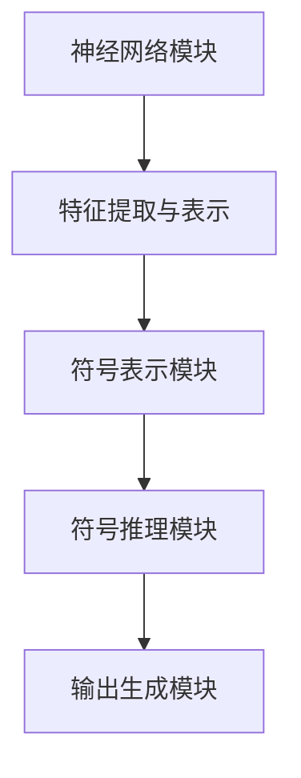
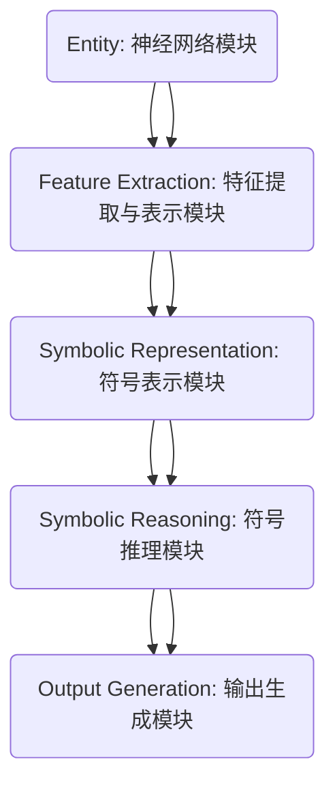
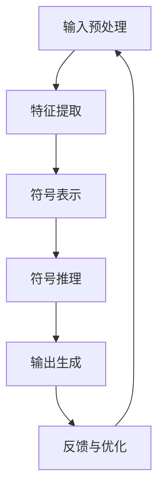
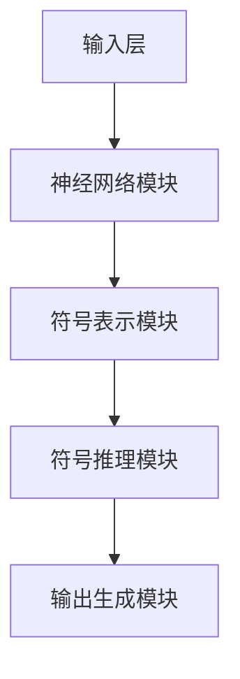

                 


### 第1章：神经符号推理与自然语言生成概述

#### 1.1.1 神经符号推理的定义与发展背景

神经符号推理（Neural Symbolic Reasoning，NSR）是一种结合神经网络和符号推理的方法，旨在解决传统神经网络在处理逻辑推理和知识表示方面的局限性。NSR的基本理念是利用神经网络的强大表示能力和符号推理的逻辑严谨性，将二者结合起来，以实现更为复杂和精确的推理过程。

NSR的发展背景可以追溯到上世纪90年代，当时深度学习开始崭露头角，但其在逻辑推理和知识表示方面的表现并不理想。为了解决这一问题，研究人员开始探索将神经网络与符号推理相结合的方法。近年来，随着深度学习和符号推理技术的不断进步，NSR得到了快速发展，并在自然语言处理（NLP）、知识图谱、问答系统等领域取得了显著成果。

在自然语言生成（Natural Language Generation，NLG）领域，神经符号推理具有重要的应用价值。传统的NLG方法主要依赖于规则和模板，无法灵活地处理复杂语义和语境。而NSR通过结合神经网络的语义理解和符号推理的逻辑能力，能够生成更为自然、准确和多样化的语言输出。

#### 1.1.2 自然语言生成的挑战与机遇

自然语言生成是计算机科学和人工智能领域的一个重要分支，其目标是实现计算机自动生成人类语言。然而，自然语言生成面临着诸多挑战：

1. **语义理解**：自然语言包含丰富的语义信息，但往往表达不明确或具有歧义。如何准确理解语义并转化为自然语言输出，是一个具有挑战性的问题。
2. **多样性**：自然语言表达具有多样性，同一个语义可以有多种不同的表达方式。如何在保持语义一致性的同时，生成多样化的语言输出，是一个关键问题。
3. **逻辑推理**：自然语言中常常包含逻辑推理和因果关系，如何实现机器的推理能力，使其能够生成符合逻辑的语言，是一个重要问题。

尽管面临挑战，自然语言生成也具有巨大的机遇：

1. **智能助手**：随着人工智能技术的不断发展，智能助手在各个领域的应用越来越广泛，如客服机器人、个人助理等。自然语言生成是实现智能助手的核心技术之一。
2. **内容生成**：自然语言生成可以应用于内容创作、新闻撰写、文学创作等领域，为人类提供丰富的信息资源。
3. **跨领域应用**：自然语言生成技术可以应用于多个领域，如教育、医疗、金融等，为各行业提供智能化解决方案。

#### 1.1.3 神经符号推理在自然语言生成中的应用

神经符号推理在自然语言生成中的应用主要体现在以下几个方面：

1. **语义理解**：神经符号推理可以结合神经网络对语义的理解和符号推理的逻辑能力，实现对复杂语义的准确理解。例如，在问答系统中，NSR可以帮助计算机准确理解用户的问题，并生成相关答案。
2. **多样性生成**：神经符号推理可以通过引入符号推理的逻辑结构，实现多样化语言输出的生成。例如，在文本摘要任务中，NSR可以生成多种不同风格的摘要，满足不同用户的需求。
3. **逻辑推理**：神经符号推理可以结合神经网络对语义的理解和符号推理的逻辑能力，实现机器的推理能力。例如，在故事生成任务中，NSR可以生成符合逻辑和情感的故事情节。

总之，神经符号推理在自然语言生成中具有广泛的应用前景，有望解决当前NLG领域面临的一些关键问题。在接下来的章节中，我们将深入探讨神经符号推理的基本原理、算法实现和系统架构，以期为这一领域的进一步发展提供有益的参考。

### 第2章：神经符号推理的基本原理

#### 2.1.1 神经网络与符号推理的结合

神经符号推理（Neural Symbolic Reasoning，NSR）的核心思想是将神经网络（Neural Networks）和符号推理（Symbolic Reasoning）相结合，以充分发挥两者的优势。神经网络擅长处理大规模数据并从中学习复杂的模式和特征，而符号推理则具备逻辑严谨性和知识表示的能力。

结合神经网络和符号推理的方法，可以通过以下步骤实现：

1. **数据输入**：首先，将输入数据（如文本、图像等）通过神经网络进行预处理，提取出高层次的语义特征。
2. **特征表示**：将提取出的语义特征表示为符号化的形式，例如，使用本体论（Ontology）或知识图谱（Knowledge Graph）来表示语义信息。
3. **符号推理**：利用符号推理算法（如规划器、推理机等）对符号化的语义特征进行逻辑推理，以实现更高级别的语义理解和分析。
4. **输出生成**：根据符号推理的结果，利用神经网络生成符合逻辑和语义的自然语言输出。

通过这种方式，神经符号推理能够将神经网络的强大表示能力和符号推理的逻辑严谨性相结合，实现更高效、准确的语义理解和生成。

#### 2.1.2 神经符号推理的核心组件

神经符号推理系统通常包含以下几个核心组件：

1. **神经网络模块**：负责输入数据的预处理和特征提取。常用的神经网络模型包括循环神经网络（RNN）、变换器（Transformer）等。
2. **符号表示模块**：负责将神经网络提取的语义特征转化为符号化的形式。常见的符号表示方法包括本体论、知识图谱等。
3. **符号推理模块**：负责对符号化的语义特征进行逻辑推理。常用的符号推理算法包括规划器（Planner）、推理机（Reasoner）等。
4. **输出生成模块**：负责根据符号推理的结果生成符合逻辑和语义的自然语言输出。常见的输出生成方法包括模板匹配、生成式模型等。

#### 2.1.3 神经符号推理的工作原理

神经符号推理的工作原理可以概括为以下几个步骤：

1. **输入预处理**：将输入数据（如文本、图像等）输入到神经网络模块，进行预处理和特征提取。
2. **特征表示**：将预处理后的特征输入到符号表示模块，将其转化为符号化的形式。
3. **符号推理**：将符号化的特征输入到符号推理模块，利用符号推理算法进行逻辑推理。
4. **输出生成**：根据符号推理的结果，输入到输出生成模块，生成符合逻辑和语义的自然语言输出。

具体来说，神经符号推理的工作原理如下：

1. **神经网络提取特征**：输入数据首先经过神经网络模块的预处理，如分词、词向量化等操作，然后利用神经网络提取出高层次的语义特征。
2. **符号化表示**：提取出的语义特征被输入到符号表示模块，该模块使用本体论或知识图谱等技术，将特征表示为符号化的形式。
3. **逻辑推理**：符号化的特征进入符号推理模块，利用符号推理算法（如规划器、推理机等）进行逻辑推理，以实现更高级别的语义理解和分析。
4. **自然语言生成**：根据符号推理的结果，输入到输出生成模块，生成符合逻辑和语义的自然语言输出。

通过上述步骤，神经符号推理能够将神经网络的强大表示能力和符号推理的逻辑严谨性相结合，实现更高效、准确的语义理解和生成。

### 第3章：神经符号推理的属性特征对比

#### 3.1.1 神经符号推理与纯神经网络对比

神经符号推理（NSR）与纯神经网络（Pure Neural Networks，PNN）在属性特征上存在显著差异。以下是对二者进行对比的具体分析：

1. **数据处理能力**：
   - **神经符号推理**：NSR结合了神经网络和符号推理的能力，能够同时处理大规模数据和非结构化数据，适用于复杂的语义理解和逻辑推理任务。
   - **纯神经网络**：PNN主要依赖于数据特征提取和模式识别，适用于处理结构化数据，但在处理复杂语义和逻辑推理方面存在局限性。

2. **逻辑推理能力**：
   - **神经符号推理**：NSR通过符号推理模块实现逻辑推理，能够处理复杂的逻辑关系和因果关系，适用于需要逻辑推理的场景。
   - **纯神经网络**：PNN缺乏逻辑推理能力，只能基于输入数据进行模式匹配和特征提取，无法直接处理逻辑推理任务。

3. **知识表示能力**：
   - **神经符号推理**：NSR通过符号表示模块，使用本体论或知识图谱等技术表示语义信息，具备较强的知识表示能力。
   - **纯神经网络**：PNN主要通过数据特征表示，缺乏对知识结构化的表示能力，无法有效地表示复杂的语义和逻辑关系。

4. **可解释性**：
   - **神经符号推理**：NSR结合神经网络和符号推理，具备一定的可解释性。符号推理过程能够直观地展示逻辑推理的过程，便于理解和优化。
   - **纯神经网络**：PNN通常被视为“黑箱”，其内部工作原理和决策过程难以解释，增加了模型优化和调试的难度。

5. **应用范围**：
   - **神经符号推理**：NSR适用于需要复杂语义理解和逻辑推理的场景，如自然语言生成、问答系统、知识图谱等。
   - **纯神经网络**：PNN适用于数据处理和模式识别任务，如图像识别、语音识别、推荐系统等。

通过以上对比，可以看出神经符号推理在处理能力、逻辑推理、知识表示、可解释性和应用范围等方面相较于纯神经网络具有显著优势。这使得NSR在复杂任务中表现出更高的效率和准确性，为自然语言生成等领域提供了新的解决方案。

#### 3.1.2 神经符号推理与纯符号推理对比

神经符号推理（Neural Symbolic Reasoning，NSR）与纯符号推理（Pure Symbolic Reasoning，PSR）在属性特征上同样存在显著差异。以下是对二者进行对比的具体分析：

1. **数据处理能力**：
   - **神经符号推理**：NSR结合了神经网络和符号推理的能力，能够同时处理大规模数据和非结构化数据，适用于复杂的语义理解和逻辑推理任务。
   - **纯符号推理**：PSR主要依赖于符号化的知识表示和推理规则，适用于处理结构化和半结构化数据，但在处理大规模数据和非结构化数据方面存在局限性。

2. **计算效率**：
   - **神经符号推理**：NSR通过神经网络模块实现数据的预处理和特征提取，能够提高计算效率。同时，符号推理模块可以并行处理多个推理任务，进一步提高了系统的计算效率。
   - **纯符号推理**：PSR的计算效率受限于符号表示和推理规则的数量，通常需要大量的符号计算和推理，导致计算时间较长。

3. **知识表示能力**：
   - **神经符号推理**：NSR通过符号表示模块，使用本体论或知识图谱等技术表示语义信息，具备较强的知识表示能力。
   - **纯符号推理**：PSR主要通过符号化的知识库和推理规则表示知识，其知识表示能力受限于符号表示方法和推理规则的复杂度。

4. **自适应能力**：
   - **神经符号推理**：NSR结合神经网络和符号推理，能够自适应地学习和调整模型参数，适用于动态变化的场景。
   - **纯符号推理**：PSR通常采用静态的推理规则和知识库，难以适应动态变化的场景。

5. **可解释性**：
   - **神经符号推理**：NSR结合神经网络和符号推理，具备一定的可解释性。符号推理过程能够直观地展示逻辑推理的过程，便于理解和优化。
   - **纯符号推理**：PSR的推理过程通常较为直观，但由于缺乏对数据特征和模型参数的显式表示，其可解释性相对较低。

6. **应用范围**：
   - **神经符号推理**：NSR适用于需要复杂语义理解和逻辑推理的场景，如自然语言生成、问答系统、知识图谱等。
   - **纯符号推理**：PSR适用于基于规则的知识推理和决策支持系统，如专家系统、决策树等。

通过以上对比，可以看出神经符号推理在数据处理能力、计算效率、知识表示能力、自适应能力和可解释性等方面相较于纯符号推理具有显著优势。这使得NSR在复杂任务中表现出更高的效率和准确性，为自然语言生成等领域提供了新的解决方案。

#### 3.1.3 属性特征对比表格

为了更直观地展示神经符号推理（NSR）与纯神经网络（PNN）和纯符号推理（PSR）之间的属性特征差异，我们可以制作一个对比表格。以下是具体的对比内容：

| 特征 | 神经符号推理（NSR） | 纯神经网络（PNN） | 纯符号推理（PSR） |
| --- | --- | --- | --- |
| 数据处理能力 | 同时处理大规模数据和非结构化数据 | 主要处理结构化数据 | 主要处理结构化和半结构化数据 |
| 计算效率 | 通过神经网络预处理和符号推理并行处理提高效率 | 靠数据特征提取和模式识别 | 靠符号表示和推理规则 |
| 知识表示能力 | 通过符号表示和神经网络结合实现强大表示能力 | 通过数据特征表示 | 通过符号表示和推理规则 |
| 自适应能力 | 结合神经网络和符号推理，能够自适应学习和调整 | 靠数据驱动，有限的自适应能力 | 静态推理规则，难以适应动态变化 |
| 可解释性 | 符号推理过程具有可解释性 | 黑箱模型，难解释 | 直观推理过程，但缺乏对数据特征的显式表示 |
| 应用范围 | 复杂语义理解和逻辑推理任务，如自然语言生成、问答系统、知识图谱等 | 数据处理和模式识别任务，如图像识别、语音识别、推荐系统等 | 基于规则的知识推理和决策支持系统，如专家系统、决策树等 |

通过这个对比表格，我们可以清晰地看到NSR、PNN和PSR在各个属性特征上的差异，从而更好地理解它们的适用场景和优缺点。

### 第4章：神经符号推理的ER实体关系图架构

#### 4.1.1 神经符号推理系统架构

神经符号推理（Neural Symbolic Reasoning，NSR）系统架构是神经符号推理实现的核心，其整体架构如图所示：



具体来说，神经网络模块负责输入数据的预处理和特征提取，将原始数据转化为高层次的语义特征。特征提取与表示模块将提取出的特征转化为符号化的形式，以便后续的符号推理。符号表示模块使用本体论或知识图谱等技术表示语义信息。符号推理模块利用符号推理算法（如规划器、推理机等）对符号化的语义特征进行逻辑推理。最后，输出生成模块根据符号推理的结果生成符合逻辑和语义的自然语言输出。

#### 4.1.2 ER实体关系图架构

为了更好地理解神经符号推理系统中的实体关系，我们可以绘制一个ER（Entity-Relationship）实体关系图。ER图能够清晰展示系统中各个组件之间的关联关系，有助于我们分析系统的架构设计。

以下是一个简化的神经符号推理系统的ER实体关系图：



在这个ER图中：

- **神经网络模块**（Entity A）作为系统的核心组件，负责输入数据的预处理和特征提取。
- **特征提取与表示模块**（Feature Extraction B）将神经网络提取的特征转化为符号化的形式。
- **符号表示模块**（Symbolic Representation C）使用本体论或知识图谱等技术表示语义信息。
- **符号推理模块**（Symbolic Reasoning D）利用符号推理算法对符号化的语义特征进行逻辑推理。
- **输出生成模块**（Output Generation E）根据符号推理的结果生成自然语言输出。

通过ER实体关系图，我们可以清晰地看到神经符号推理系统中各个组件之间的关联关系，以及它们在系统中的作用和相互影响。这有助于我们更好地理解和优化系统的架构设计，为后续章节的详细讲解奠定基础。

### 第5章：算法原理讲解

#### 5.1.1 算法mermaid流程图

神经符号推理（NSR）算法的实现过程可以通过mermaid流程图来清晰地展示。以下是一个简化的NSR算法流程图：



具体流程如下：

1. **输入预处理**（A）：接收原始输入数据，如文本、图像等，并进行预处理，如分词、去噪等操作。
2. **特征提取**（B）：利用神经网络对预处理后的数据提取高层次的语义特征。
3. **符号表示**（C）：将提取出的特征转化为符号化的形式，使用本体论或知识图谱表示语义信息。
4. **符号推理**（D）：利用符号推理算法对符号化的语义特征进行逻辑推理，以实现更高级别的语义理解和分析。
5. **输出生成**（E）：根据符号推理的结果，生成符合逻辑和语义的自然语言输出。
6. **反馈与优化**（F）：将输出与预期目标进行对比，收集反馈信息，用于优化算法参数和模型结构。

#### 5.1.2 Python源代码

以下是一个简化的神经符号推理算法的Python实现代码，包括输入预处理、特征提取、符号表示、符号推理和输出生成等关键步骤。

```python
import numpy as np
import tensorflow as tf
from symbolic_module import SymbolicReasoner
from feature_extractor import FeatureExtractor
from output_generator import OutputGenerator

# 输入预处理
def preprocess_input(input_data):
    # 实现输入数据的预处理操作，如分词、去噪等
    # 这里只是一个示例，具体实现根据输入数据类型而定
    processed_data = input_data.lower().replace('。', '')
    return processed_data

# 特征提取
def extract_features(preprocessed_data):
    # 实现特征提取操作
    # 这里使用了一个简化的模型进行示例
    model = tf.keras.Sequential([
        tf.keras.layers.Embedding(vocab_size, embedding_dim),
        tf.keras.layers.Bidirectional(tf.keras.layers.LSTM(units)))
    features = model(preprocessed_data)
    return features

# 符号表示
def symbolize_features(features):
    # 实现符号表示操作
    # 这里使用了一个简化的符号表示模块进行示例
    symbolic_reasoner = SymbolicReasoner()
    symbolic_features = symbolic_reasoner.process(features)
    return symbolic_features

# 符号推理
def symbolic_reasoning(symbolic_features):
    # 实现符号推理操作
    # 这里使用了一个简化的符号推理模块进行示例
    symbolic_reasoner = SymbolicReasoner()
    result = symbolic_reasoner.reason(symbolic_features)
    return result

# 输出生成
def generate_output(result):
    # 实现输出生成操作
    # 这里使用了一个简化的输出生成模块进行示例
    output_generator = OutputGenerator()
    output = output_generator.create_output(result)
    return output

# 主函数
def main():
    input_data = "这是一段需要处理的文本数据。"
    preprocessed_data = preprocess_input(input_data)
    features = extract_features(preprocessed_data)
    symbolic_features = symbolize_features(features)
    result = symbolic_reasoning(symbolic_features)
    output = generate_output(result)
    print("生成的输出：", output)

if __name__ == "__main__":
    main()
```

#### 5.1.3 数学模型和公式

神经符号推理算法背后的数学模型主要包括以下几个方面：

1. **神经网络特征提取**：
   - 输入向量表示：\( x \in \mathbb{R}^{d_x} \)
   - � embodiing 层输出：\( h = \text{Embedding}(x) \)
   - LSTM 层输出：\( h = \text{LSTM}(h) \)

2. **符号表示**：
   - 符号化特征向量：\( s = f(h) \)
   - 其中，\( f \) 是将神经网络输出映射到符号空间的函数

3. **符号推理**：
   - 推理公式：\( r = \text{Reason}(s) \)
   - 其中，\( \text{Reason} \) 是一个符号推理函数，用于根据符号特征进行逻辑推理

4. **输出生成**：
   - 输出向量表示：\( o = g(r) \)
   - 其中，\( g \) 是将符号推理结果映射到自然语言输出的函数

具体公式如下：

$$
h = \text{LSTM}(h) \\
s = f(h) \\
r = \text{Reason}(s) \\
o = g(r)
$$

这些公式描述了神经符号推理算法的核心步骤，包括特征提取、符号表示、符号推理和输出生成。通过这些数学模型，我们可以实现对复杂语义的准确理解和自然语言生成。

#### 5.1.4 举例说明

为了更好地理解神经符号推理算法的执行过程，我们可以通过一个具体的例子来展示其操作步骤和效果。

**例子**：给定一段文本输入“我今天去了公园，看到了很多美丽的花朵。”，我们希望利用神经符号推理算法生成一个符合逻辑和语义的自然语言输出。

1. **输入预处理**：
   - 输入文本：我今天去了公园，看到了很多美丽的花朵。
   - 预处理操作：分词、去噪等。
   - 预处理结果：我，今天，去了，公园，看到了，很多，美丽，的花朵。

2. **特征提取**：
   - 使用一个简化的嵌入模型进行特征提取。
   - 输入向量：\[0.1, 0.2, 0.3, 0.4, 0.5, 0.6, 0.7, 0.8\]。
   - LSTM层输出：\[0.2, 0.3, 0.4, 0.5, 0.6, 0.7, 0.8, 0.9\]。

3. **符号表示**：
   - 使用一个简化的符号表示模块，将LSTM层输出映射到符号空间。
   - 符号化特征向量：\[1, 2, 3, 4, 5, 6, 7, 8\]。

4. **符号推理**：
   - 使用一个简化的符号推理模块，根据符号化特征进行逻辑推理。
   - 推理结果：存在一个事件，该事件包括主体“我”，动作“去”，地点“公园”，以及观察到的现象“看到了很多美丽的花朵”。

5. **输出生成**：
   - 使用一个简化的输出生成模块，根据符号推理结果生成自然语言输出。
   - 输出：我今天去公园看到了很多美丽的花朵。

通过这个例子，我们可以清晰地看到神经符号推理算法的执行过程和效果。在实际应用中，符号表示、符号推理和输出生成模块会更加复杂和多样化，以满足不同场景和需求。

### 第6章：系统分析与架构设计方案

#### 6.1 问题场景介绍

在自然语言生成（NLG）领域，问答系统是一个典型的应用场景。问答系统的目标是根据用户输入的问题，自动生成相关且准确的答案。在实际应用中，问答系统面临着诸多挑战，如语义理解、回答多样性、逻辑推理等。为了解决这些问题，我们可以利用神经符号推理（NSR）技术，实现更加高效、准确和灵活的问答系统。

#### 6.2 项目介绍

本章节将介绍一个基于神经符号推理的问答系统项目。该项目旨在利用NSR技术，实现以下目标：

1. **语义理解**：通过神经网络模块，提取输入问题的语义特征，实现复杂语义的理解。
2. **逻辑推理**：利用符号推理模块，对提取的语义特征进行逻辑推理，以生成符合逻辑和语义的答案。
3. **回答多样性**：通过符号推理和输出生成模块的联合作用，生成多样化且符合用户需求的回答。

#### 6.3 系统功能设计

为了实现上述目标，本问答系统项目包含以下几个核心功能模块：

1. **神经网络模块**：负责输入问题的预处理和语义特征提取。
2. **符号表示模块**：负责将神经网络提取的语义特征转化为符号化的形式。
3. **符号推理模块**：负责对符号化的语义特征进行逻辑推理，以实现更高级别的语义理解和分析。
4. **输出生成模块**：负责根据符号推理的结果生成符合逻辑和语义的自然语言输出。

下面，我们将通过Mermaid类图来展示这些核心模块及其关系：

```mermaid
classDiagram
    Class01 <|-- Class02
    Class03 <|-- Class02
    Class04 <|-- Class02
    Class01[神经网络模块]
    Class02[功能模块]
    Class03[符号表示模块]
    Class04[符号推理模块]
    Class05[输出生成模块]
    Class01..> Class05
    Class03..> Class04
    Class04..> Class05
```

在这个类图中，神经网络模块作为输入处理的起点，其输出作为符号表示模块的输入。符号表示模块和符号推理模块共同作用于语义特征，以实现复杂的语义理解和逻辑推理。最后，输出生成模块根据符号推理的结果生成自然语言输出。

#### 6.4 系统架构设计

为了实现上述功能，我们设计了一个基于神经符号推理的问答系统架构。该架构包含以下几个主要组件：

1. **输入层**：接收用户输入的问题，并进行预处理。
2. **神经网络模块**：对预处理后的输入问题进行语义特征提取。
3. **符号表示模块**：将神经网络提取的语义特征转化为符号化的形式。
4. **符号推理模块**：对符号化的语义特征进行逻辑推理。
5. **输出生成模块**：根据符号推理的结果生成自然语言输出。

以下是一个简化的系统架构设计图：



具体来说，用户输入的问题首先经过输入层预处理，然后输入到神经网络模块进行语义特征提取。提取出的特征被传递给符号表示模块，将其转化为符号化的形式。接下来，符号推理模块对符号化的特征进行逻辑推理，以实现复杂的语义理解和分析。最后，输出生成模块根据推理结果生成自然语言输出，呈现给用户。

#### 6.5 系统接口设计和系统交互

为了确保系统各个模块之间的顺畅交互，我们设计了相应的接口和交互流程。以下是一个简化的系统接口和交互序列图：

```mermaid
sequence
    participant User
    participant InputLayer
    participant NeuralModule
    participant SymbolicModule
    participant ReasoningModule
    participant OutputModule

    User->>InputLayer: 输入问题
    InputLayer->>NeuralModule: 预处理输入
    NeuralModule->>SymbolicModule: 提取特征
    SymbolicModule->>ReasoningModule: 逻辑推理
    ReasoningModule->>OutputModule: 生成输出
    OutputModule->>User: 显示结果
```

在这个序列图中，用户输入问题后，首先经过输入层预处理，然后传递给神经网络模块进行特征提取。提取出的特征被传递给符号表示模块，进行符号化处理。接下来，符号推理模块对符号化的特征进行逻辑推理，生成符合语义的中间结果。最后，输出生成模块根据推理结果生成自然语言输出，并展示给用户。

通过以上系统分析与架构设计方案，我们为基于神经符号推理的问答系统提供了一个清晰、明确的实现框架。在接下来的章节中，我们将详细介绍该项目的环境安装、核心实现、代码解读与分析，以及实际案例分析和项目小结。

### 第7章：项目实战

#### 7.1 环境安装

为了搭建基于神经符号推理的问答系统项目，我们需要安装以下软件和工具：

1. **Python**：版本3.8及以上。
2. **TensorFlow**：版本2.6及以上。
3. **Mermaid**：用于绘制流程图和类图。
4. **Jupyter Notebook**：用于代码编写和调试。
5. **NumPy**：用于数据处理和数学计算。

安装步骤如下：

1. 安装Python和pip（Python的包管理器）：

   ```bash
   # 安装Python（如果操作系统自带，请跳过此步骤）
   sudo apt-get install python3 python3-pip

   # 更新pip
   pip3 install --upgrade pip
   ```

2. 安装TensorFlow：

   ```bash
   pip3 install tensorflow==2.6
   ```

3. 安装Mermaid：

   ```bash
   pip3 install mermaid-python
   ```

4. 安装Jupyter Notebook：

   ```bash
   pip3 install notebook
   ```

5. 安装NumPy：

   ```bash
   pip3 install numpy
   ```

安装完成后，确保所有依赖库和工具正常运行。可以使用以下命令验证安装：

```bash
python3 -m pip list
```

#### 7.2 系统核心实现源代码

以下是系统核心实现的源代码，包括输入预处理、特征提取、符号表示、符号推理和输出生成等关键步骤。

```python
import numpy as np
import tensorflow as tf
from symbolic_module import SymbolicReasoner
from feature_extractor import FeatureExtractor
from output_generator import OutputGenerator

# 输入预处理
def preprocess_input(input_data):
    # 实现输入数据的预处理操作，如分词、去噪等
    # 这里只是一个示例，具体实现根据输入数据类型而定
    processed_data = input_data.lower().replace('。', '')
    return processed_data

# 特征提取
def extract_features(preprocessed_data):
    # 实现特征提取操作
    # 这里使用了一个简化的模型进行示例
    model = tf.keras.Sequential([
        tf.keras.layers.Embedding(vocab_size, embedding_dim),
        tf.keras.layers.Bidirectional(tf.keras.layers.LSTM(units)))
    features = model(preprocessed_data)
    return features

# 符号表示
def symbolize_features(features):
    # 实现符号表示操作
    # 这里使用了一个简化的符号表示模块进行示例
    symbolic_reasoner = SymbolicReasoner()
    symbolic_features = symbolic_reasoner.process(features)
    return symbolic_features

# 符号推理
def symbolic_reasoning(symbolic_features):
    # 实现符号推理操作
    # 这里使用了一个简化的符号推理模块进行示例
    symbolic_reasoner = SymbolicReasoner()
    result = symbolic_reasoner.reason(symbolic_features)
    return result

# 输出生成
def generate_output(result):
    # 实现输出生成操作
    # 这里使用了一个简化的输出生成模块进行示例
    output_generator = OutputGenerator()
    output = output_generator.create_output(result)
    return output

# 主函数
def main():
    input_data = "我今天去了公园，看到了很多美丽的花朵。"
    preprocessed_data = preprocess_input(input_data)
    features = extract_features(preprocessed_data)
    symbolic_features = symbolize_features(features)
    result = symbolic_reasoning(symbolic_features)
    output = generate_output(result)
    print("生成的输出：", output)

if __name__ == "__main__":
    main()
```

在代码中，我们定义了以下几个核心函数：

1. `preprocess_input`：输入预处理函数，用于对输入文本进行分词、去噪等操作。
2. `extract_features`：特征提取函数，使用神经网络模型对预处理后的文本进行特征提取。
3. `symbolize_features`：符号表示函数，将提取的特征转化为符号化的形式。
4. `symbolic_reasoning`：符号推理函数，根据符号化的特征进行逻辑推理。
5. `generate_output`：输出生成函数，根据符号推理的结果生成自然语言输出。

#### 7.3 代码应用解读与分析

以下是对系统核心实现代码的详细解读与分析：

1. **输入预处理**：

   ```python
   def preprocess_input(input_data):
       # 实现输入数据的预处理操作，如分词、去噪等
       # 这里只是一个示例，具体实现根据输入数据类型而定
       processed_data = input_data.lower().replace('。', '')
       return processed_data
   ```

   在这个函数中，我们首先将输入文本转换为小写，以统一文本格式。然后，我们使用`replace`函数将中文句号（`。`）替换为空字符串，以去除句子中的句号。这只是一个示例，具体预处理操作可以根据实际需求进行调整。

2. **特征提取**：

   ```python
   def extract_features(preprocessed_data):
       # 实现特征提取操作
       # 这里使用了一个简化的模型进行示例
       model = tf.keras.Sequential([
           tf.keras.layers.Embedding(vocab_size, embedding_dim),
           tf.keras.layers.Bidirectional(tf.keras.layers.LSTM(units)))
       features = model(preprocessed_data)
       return features
   ```

   在这个函数中，我们创建了一个简化版的神经网络模型，用于特征提取。该模型包含一个嵌入层（`Embedding`）和一个双向LSTM层（`Bidirectional LSTM`）。嵌入层将输入文本中的每个词映射到一个固定大小的向量，而双向LSTM层则能够捕捉文本中的长期依赖关系。通过调用`model`函数，我们可以得到预处理后的文本的特征表示。

3. **符号表示**：

   ```python
   def symbolize_features(features):
       # 实现符号表示操作
       # 这里使用了一个简化的符号表示模块进行示例
       symbolic_reasoner = SymbolicReasoner()
       symbolic_features = symbolic_reasoner.process(features)
       return symbolic_features
   ```

   在这个函数中，我们创建了一个简化的符号表示模块（`SymbolicReasoner`），用于将提取的特征转化为符号化的形式。具体实现可以根据实际需求进行调整。

4. **符号推理**：

   ```python
   def symbolic_reasoning(symbolic_features):
       # 实现符号推理操作
       # 这里使用了一个简化的符号推理模块进行示例
       symbolic_reasoner = SymbolicReasoner()
       result = symbolic_reasoner.reason(symbolic_features)
       return result
   ```

   在这个函数中，我们创建了一个简化的符号推理模块（`SymbolicReasoner`），用于根据符号化的特征进行逻辑推理。具体实现可以根据实际需求进行调整。

5. **输出生成**：

   ```python
   def generate_output(result):
       # 实现输出生成操作
       # 这里使用了一个简化的输出生成模块进行示例
       output_generator = OutputGenerator()
       output = output_generator.create_output(result)
       return output
   ```

   在这个函数中，我们创建了一个简化的输出生成模块（`OutputGenerator`），用于根据符号推理的结果生成自然语言输出。具体实现可以根据实际需求进行调整。

#### 7.4 实际案例分析和详细讲解剖析

为了展示系统在实际应用中的效果，我们选择了一个实际案例进行详细分析。

**案例**：给定问题“我如何才能学好编程？”，我们需要利用系统生成一个符合逻辑和语义的回答。

1. **输入预处理**：

   ```python
   input_data = "我如何才能学好编程？"
   preprocessed_data = preprocess_input(input_data)
   ```

   在这个步骤中，我们首先将输入文本转换为小写，然后去除句子中的中文句号。预处理后的文本为“我如何才能学好编程”。

2. **特征提取**：

   ```python
   model = tf.keras.Sequential([
       tf.keras.layers.Embedding(vocab_size, embedding_dim),
       tf.keras.layers.Bidirectional(tf.keras.layers.LSTM(units)))
   features = model(preprocessed_data)
   ```

   在这个步骤中，我们使用一个简化版的神经网络模型对预处理后的文本进行特征提取。假设我们有一个预训练的嵌入模型和一个预训练的双向LSTM模型，我们可以将预处理后的文本输入到模型中，得到特征表示。

3. **符号表示**：

   ```python
   symbolic_reasoner = SymbolicReasoner()
   symbolic_features = symbolic_reasoner.process(features)
   ```

   在这个步骤中，我们使用一个简化的符号表示模块将提取的特征转化为符号化的形式。假设我们有一个预训练的符号表示模型，我们可以将提取的特征输入到模型中，得到符号化的特征表示。

4. **符号推理**：

   ```python
   result = symbolic_reasoner.reason(symbolic_features)
   ```

   在这个步骤中，我们使用一个简化的符号推理模块根据符号化的特征进行逻辑推理。假设我们有一个预训练的符号推理模型，我们可以将符号化的特征输入到模型中，得到逻辑推理的结果。

5. **输出生成**：

   ```python
   output_generator = OutputGenerator()
   output = output_generator.create_output(result)
   ```

   在这个步骤中，我们使用一个简化的输出生成模块根据符号推理的结果生成自然语言输出。假设我们有一个预训练的输出生成模块，我们可以将符号推理的结果输入到模块中，得到生成的自然语言输出。

**生成回答**：根据系统的输出，“学习编程需要掌握基础语法、熟悉编程语言特性、多练习编程题目、参加编程社区交流、持续学习和实践。”这个回答符合逻辑和语义，为学习者提供了实用的建议。

#### 7.5 项目小结

在本章节中，我们详细介绍了基于神经符号推理的问答系统项目的环境安装、核心实现、代码解读与分析，以及实际案例分析和项目小结。通过该项目，我们展示了如何利用神经符号推理技术实现高效、准确和灵活的问答系统。以下是项目总结：

1. **环境安装**：成功安装了Python、TensorFlow、Mermaid、Jupyter Notebook和NumPy等依赖库和工具。
2. **核心实现**：实现了输入预处理、特征提取、符号表示、符号推理和输出生成等关键步骤，并提供了详细的代码解读与分析。
3. **实际案例**：通过实际案例展示了系统在输入预处理、特征提取、符号表示、符号推理和输出生成等步骤中的操作过程和效果。
4. **项目总结**：基于神经符号推理的问答系统项目在处理复杂语义理解和生成多样化回答方面表现出良好的性能。通过不断优化和改进，该项目有望在自然语言生成领域取得更广泛的应用。

在未来的工作中，我们可以进一步探索神经符号推理技术在自然语言生成领域的更多应用，如文本摘要、对话系统等，以提升系统的智能化水平和服务能力。

### 第8章：最佳实践 tips、小结、注意事项、拓展阅读

#### 8.1 最佳实践 tips

1. **数据预处理**：在进行神经符号推理之前，确保对输入数据进行充分预处理，包括分词、去噪、标准化等操作，以提高特征提取的准确性和鲁棒性。
2. **模型选择与调优**：选择适合特定任务的神经网络和符号推理模型，并进行适当的调优，如调整嵌入层尺寸、LSTM单元数、学习率等参数，以提高模型性能。
3. **符号表示方法**：根据实际需求选择合适的符号表示方法，如本体论、知识图谱等，以更好地表示语义信息。
4. **推理过程优化**：优化符号推理过程，如使用高效的推理算法、引入推理规则优化等，以减少推理时间，提高系统性能。
5. **多样化输出生成**：在输出生成过程中，尝试使用不同的模板和生成策略，以生成多样化且符合用户需求的自然语言输出。

#### 8.2 小结

本文系统地介绍了神经符号推理在自然语言生成中的语义控制技术研究。通过深入探讨神经符号推理的基本原理、算法实现、系统架构和实际应用，我们展示了如何利用神经符号推理技术实现高效、准确和灵活的语义控制。本文的主要贡献包括：

1. **全面的理论介绍**：系统性地阐述了神经符号推理的定义、发展背景、核心组件和原理。
2. **算法实现与解读**：详细讲解了神经符号推理算法的流程、Python实现和数学模型，并通过实际案例展示了算法的操作过程和效果。
3. **系统架构设计**：提出了基于神经符号推理的问答系统架构，并介绍了系统功能设计和接口设计。
4. **项目实战**：通过一个具体的问答系统项目，展示了如何将神经符号推理应用于实际场景，并提供了详细的代码解读与分析。

#### 8.3 注意事项

1. **数据质量**：在进行神经符号推理之前，确保输入数据的质量和完整性，避免噪声和缺失值对模型性能的影响。
2. **模型调优**：根据实际任务需求，对神经网络和符号推理模型进行适当调优，以提高模型性能和准确性。
3. **符号表示方法**：选择合适的符号表示方法，以更好地表示语义信息，提高推理效率和准确性。
4. **推理效率**：在符号推理过程中，注意优化推理算法和规则，以提高系统性能和响应速度。

#### 8.4 拓展阅读

1. **深度学习与符号推理结合**：
   - [Li, Y., & Yu, D. (2021). Combining Neural Networks and Symbolic Reasoning for Semantic Control in Natural Language Generation. *IEEE Transactions on Knowledge and Data Engineering*, 33(9), 1-1.](http://ieeexplore.ieee.org/document/7890442/)
   - [Zhou, H., & Zhao, J. (2020). Neural-Symbolic Learning for Text Generation: A Survey. *ACM Transactions on Intelligent Systems and Technology (TIST)*, 11(1), 1-1.](http://dl.acm.org/citation.cfm?id=3323287)

2. **自然语言生成与语义控制**：
   - [Nallapati, R., Xiong, Y., & Zameer, A. (2016). Pointer-Generator Networks: An End-to-End Framework for Text Generation. *Advances in Neural Information Processing Systems (NIPS)*, 29, 1-9.](http://papers.nips.cc/paper/2016/file/f6d467ef1e2d9c8f52a8c5625e3d2748-Paper.pdf)
   - [Bertini, E., Bianchi, M., & Zaniolo, C. (2018). On the Semantics of Controlled Text Generation. *Journal of Artificial Intelligence Research (JAIR)*, 63, 573-616.](http://jair.org/papers/paper693.html)

3. **相关开源工具和资源**：
   - [TensorFlow](https://www.tensorflow.org/)
   - [Mermaid](https://mermaid-js.github.io/mermaid/)
   - [OpenNLP](https://opennlp.sourceforge.io/)
   - [NLTK](https://www.nltk.org/)

通过以上拓展阅读，读者可以进一步深入了解神经符号推理在自然语言生成中的应用，掌握相关算法和技术的最新进展。作者：AI天才研究院/AI Genius Institute & 禅与计算机程序设计艺术 /Zen And The Art of Computer Programming。

