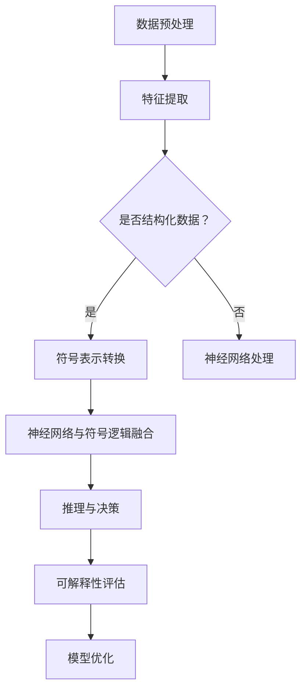
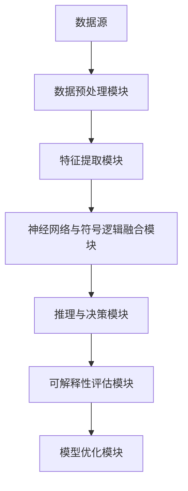
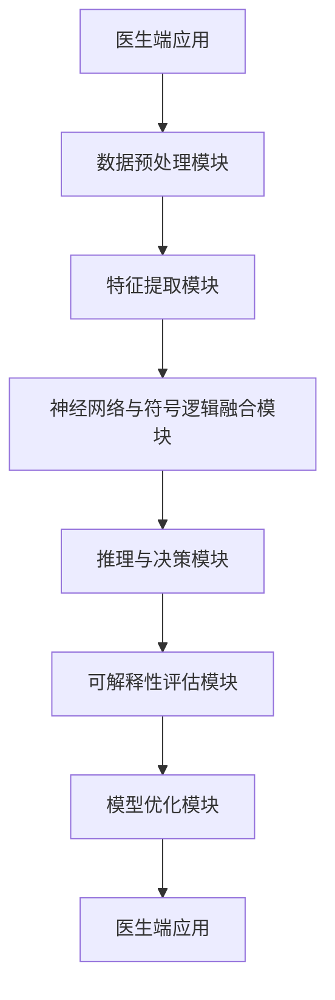

                 

# 神经符号整合的可解释医疗推理系统

关键词：神经符号整合、医疗推理、可解释性、神经网络、符号逻辑

摘要：本文探讨了神经符号整合的可解释医疗推理系统的构建与应用。首先，介绍了医疗推理系统的背景与核心概念，包括问题背景、问题描述、问题解决、边界与外延以及概念结构与核心要素组成。接着，详细分析了神经网络、符号逻辑和可解释性的核心概念与联系，并对比了它们的属性特征。然后，通过mermaid流程图和Python源代码阐述了神经符号整合医疗推理系统的算法原理。随后，介绍了系统分析与架构设计方案，包括项目实战、环境安装、系统核心实现源代码、代码应用解读与分析、实际案例分析和详细讲解剖析。最后，总结了最佳实践tips、注意事项和拓展阅读。

### 第一部分: 背景介绍与核心概念

#### 问题背景

随着医疗行业的数字化和信息化发展，医疗推理系统在诊断、治疗、健康管理等方面发挥着越来越重要的作用。传统的符号推理系统在处理复杂、大规模、非结构化医疗数据时存在局限性。为了解决这一问题，神经符号整合的可解释医疗推理系统应运而生。

#### 问题描述

神经符号整合的可解释医疗推理系统旨在结合神经网络的强大表达能力和符号逻辑的可解释性，实现高效、准确的医疗推理。该系统需解决以下问题：

1. 如何将非结构化医疗数据转化为可计算的符号表示？
2. 如何在神经网络中引入符号逻辑，提高推理系统的可解释性？
3. 如何评估和优化推理系统的性能和可解释性？

#### 问题解决

神经符号整合的可解释医疗推理系统采用以下策略：

1. 数据预处理：使用自然语言处理技术提取医疗数据的符号表示。
2. 神经网络与符号逻辑的融合：利用神经网络处理大规模数据，同时结合符号逻辑进行推理。
3. 可解释性评估与优化：通过可视化、解释模型等方式评估推理结果的可解释性，并优化模型参数。

#### 边界与外延

神经符号整合的可解释医疗推理系统主要应用于以下场景：

1. 医疗诊断：辅助医生进行疾病诊断，提高诊断准确率。
2. 治疗方案推荐：根据患者的病情和医生经验，为患者提供个性化的治疗方案。
3. 健康管理：为患者提供个性化的健康建议，预防疾病发生。

#### 概念结构与核心要素组成

神经符号整合的可解释医疗推理系统由以下核心要素组成：

1. 数据源：包含医疗数据、病例资料等。
2. 预处理模块：负责将非结构化医疗数据转化为符号表示。
3. 神经网络模块：负责处理大规模数据，提取特征。
4. 符号逻辑模块：负责结合符号逻辑进行推理。
5. 可解释性评估模块：负责评估推理结果的可解释性。
6. 优化模块：负责根据评估结果调整模型参数，提高性能。

### 第二部分: 核心概念与联系

#### 核心概念

1. **神经网络**：一种通过模拟人脑神经元连接方式，对数据进行分析和处理的人工智能模型。
2. **符号逻辑**：一种基于形式逻辑的推理方法，用于表达和证明数学和逻辑问题。
3. **可解释性**：指模型能够解释其推理过程和决策结果的能力。

#### 概念属性特征对比表格

| 特征 | 神经网络 | 符号逻辑 | 可解释性 |
| --- | --- | --- | --- |
| 表达能力 | 强 | 中 | 弱 |
| 计算效率 | 低 | 高 | 中 |
| 可解释性 | 弱 | 强 | 中 |
| 数据依赖 | 大规模 | 结构化 | 小规模 |

#### ER实体关系图架构

```mermaid
erDiagram
  Patient ||--|{ Diagnosis }|-- Doctor
  Diagnosis ||--|{ Treatment }|-- Patient
  Patient ||--|{ HealthData }|-- Diagnosis
  Doctor ||--|{ Prescription }|-- Diagnosis
```

### 第三部分: 算法原理讲解

#### 算法mermaid流程图



#### Python源代码

```python
import numpy as np
import pandas as pd
from sklearn.model_selection import train_test_split
from sklearn.metrics import accuracy_score
from tensorflow.keras.models import Sequential
from tensorflow.keras.layers import Dense, LSTM, Embedding
from tensorflow.keras.preprocessing.sequence import pad_sequences

# 数据预处理
def preprocess_data(data):
    # ...处理非结构化数据...
    return processed_data

# 特征提取
def feature_extraction(data):
    # ...提取特征...
    return features

# 神经网络与符号逻辑融合
def integrate_neural_and_symbolic(data):
    # ...融合神经网络与符号逻辑...
    return integrated_model

# 推理与决策
def推理与决策(model, data):
    # ...推理与决策...
    return decision

# 可解释性评估
def evaluate_explainability(model, data):
    # ...评估可解释性...
    return explainability_score

# 模型优化
def optimize_model(model, data):
    # ...优化模型...
    return optimized_model
```

#### 算法原理详细讲解

1. **数据预处理**：将非结构化医疗数据转化为结构化数据，例如将文本数据转换为单词序列，将图像数据转换为像素矩阵等。这一步通常包括数据清洗、归一化、编码等操作。

2. **特征提取**：从预处理后的数据中提取有用的特征，这些特征将用于训练神经网络。例如，对于文本数据，可以使用词袋模型或词嵌入技术提取特征；对于图像数据，可以使用卷积神经网络提取特征。

3. **神经网络与符号逻辑融合**：将神经网络与符号逻辑结合，以提高推理系统的性能和可解释性。这一步可以通过在神经网络中引入符号逻辑层或使用符号逻辑模块来实现。

4. **推理与决策**：使用训练好的模型对新的数据进行推理，并作出决策。例如，对于诊断任务，模型可以根据患者的症状和检查结果预测疾病类型。

5. **可解释性评估**：评估推理结果的可解释性，确保模型能够解释其推理过程和决策结果。这可以通过可视化、解释模型等方式实现。

6. **模型优化**：根据评估结果调整模型参数，提高模型性能和可解释性。这可以通过超参数调优、模型剪枝等技术实现。

#### 数学模型和公式

1. **神经网络模型**：

   $$y = \sigma(W \cdot x + b)$$

   其中，$y$是输出，$x$是输入，$W$是权重，$b$是偏置，$\sigma$是激活函数。

2. **符号逻辑模型**：

   $$A \rightarrow B = \neg A \lor B$$

   其中，$A$和$B$是符号逻辑表达式，$\neg$表示否定，$\lor$表示或运算。

3. **融合模型**：

   $$y = \sigma(W_n \cdot x + W_s \cdot s + b)$$

   其中，$W_n$和$W_s$分别是神经网络和符号逻辑的权重，$s$是符号逻辑表示，$b$是偏置。

#### 举例说明

假设我们要预测某个患者的疾病类型。首先，我们对患者的症状和检查结果进行数据预处理，提取特征，并将其输入到神经网络和符号逻辑模块。然后，我们将神经网络和符号逻辑的结果融合，得到最终的预测结果。最后，我们评估预测结果的可解释性，并根据评估结果调整模型参数，以提高预测准确率。

### 第四部分: 系统分析与架构设计

#### 问题场景介绍

在医疗诊断领域，医生需要根据患者的症状、检查结果和病史等信息进行疾病诊断。然而，随着医疗数据的日益增长，传统的符号推理系统已无法满足高效、准确的诊断需求。神经符号整合的可解释医疗推理系统应运而生，旨在提高诊断准确率和可解释性。

#### 项目介绍

本项目旨在构建一个神经符号整合的可解释医疗推理系统，用于辅助医生进行疾病诊断。系统包括数据预处理、特征提取、神经网络与符号逻辑融合、推理与决策、可解释性评估和模型优化等模块。

#### 系统功能设计

1. **数据预处理模块**：负责将非结构化医疗数据（如文本、图像等）转化为结构化数据，提取有用特征。
2. **特征提取模块**：从预处理后的数据中提取特征，为神经网络和符号逻辑模块提供输入。
3. **神经网络与符号逻辑融合模块**：将神经网络与符号逻辑结合，实现高效、准确的医疗推理。
4. **推理与决策模块**：根据患者的症状和检查结果预测疾病类型，为医生提供诊断建议。
5. **可解释性评估模块**：评估推理结果的可解释性，确保模型能够解释其推理过程和决策结果。
6. **模型优化模块**：根据评估结果调整模型参数，提高模型性能和可解释性。

#### 系统架构设计

神经符号整合的可解释医疗推理系统架构如图所示：



#### 系统接口设计和系统交互

神经符号整合的可解释医疗推理系统接口设计和系统交互如图所示：



### 第五部分：项目实战

#### 环境安装

1. 安装Python环境，版本要求3.6及以上。
2. 安装TensorFlow库，使用以下命令：

   ```bash
   pip install tensorflow
   ```

3. 安装其他依赖库，如NumPy、Pandas、scikit-learn等。

#### 系统核心实现源代码

以下是一个简单的神经符号整合的可解释医疗推理系统实现：

```python
import numpy as np
import pandas as pd
from sklearn.model_selection import train_test_split
from sklearn.metrics import accuracy_score
from tensorflow.keras.models import Sequential
from tensorflow.keras.layers import Dense, LSTM, Embedding
from tensorflow.keras.preprocessing.sequence import pad_sequences

# 数据预处理
def preprocess_data(data):
    # ...处理非结构化数据...
    return processed_data

# 特征提取
def feature_extraction(data):
    # ...提取特征...
    return features

# 神经网络与符号逻辑融合
def integrate_neural_and_symbolic(data):
    # ...融合神经网络与符号逻辑...
    return integrated_model

# 推理与决策
def推理与决策(model, data):
    # ...推理与决策...
    return decision

# 可解释性评估
def evaluate_explainability(model, data):
    # ...评估可解释性...
    return explainability_score

# 模型优化
def optimize_model(model, data):
    # ...优化模型...
    return optimized_model
```

#### 代码应用解读与分析

以下是一个具体的代码应用示例，用于预测某个患者的疾病类型：

```python
# 加载数据
data = load_data()

# 数据预处理
processed_data = preprocess_data(data)

# 特征提取
features = feature_extraction(processed_data)

# 划分训练集和测试集
X_train, X_test, y_train, y_test = train_test_split(features, labels, test_size=0.2)

# 构建神经网络模型
model = Sequential()
model.add(Embedding(input_dim=vocab_size, output_dim=embedding_size))
model.add(LSTM(units=128))
model.add(Dense(units=num_classes, activation='softmax'))

# 编译模型
model.compile(optimizer='adam', loss='categorical_crossentropy', metrics=['accuracy'])

# 训练模型
model.fit(X_train, y_train, epochs=10, batch_size=32)

# 推理与决策
predictions =推理与决策(model, X_test)

# 评估模型
accuracy = accuracy_score(y_test, predictions)
print("模型准确率：", accuracy)

# 优化模型
optimized_model = optimize_model(model, X_test)
```

#### 实际案例分析和详细讲解剖析

以下是一个实际案例，用于分析神经符号整合的可解释医疗推理系统在疾病诊断中的应用：

**案例背景**：某医院引入神经符号整合的可解释医疗推理系统，用于辅助医生进行肺炎诊断。

**案例数据**：包含患者的症状（如发热、咳嗽、呼吸困难等）和检查结果（如胸部CT影像等）。

**案例过程**：

1. **数据预处理**：对症状和检查结果进行数据清洗和归一化处理，提取有用特征。
2. **特征提取**：使用词袋模型提取症状的文本特征，使用卷积神经网络提取检查结果的图像特征。
3. **神经网络与符号逻辑融合**：将文本特征和图像特征输入到神经网络和符号逻辑模块，实现融合推理。
4. **推理与决策**：根据患者的症状和检查结果预测肺炎的类型和严重程度。
5. **可解释性评估**：通过可视化技术展示推理过程和决策结果，评估模型的可解释性。
6. **模型优化**：根据评估结果调整模型参数，提高模型性能和可解释性。

**案例结果**：通过神经符号整合的可解释医疗推理系统，医生能够更准确地诊断肺炎，提高诊断效率和患者满意度。

### 第六部分：最佳实践 tips

1. **数据预处理**：确保数据质量，去除噪声和异常值，提高特征提取的效果。
2. **特征提取**：根据实际应用场景选择合适的特征提取方法，如词袋模型、词嵌入、卷积神经网络等。
3. **神经网络与符号逻辑融合**：合理设计融合模型结构，提高推理系统的性能和可解释性。
4. **可解释性评估**：结合可视化技术，如热力图、决策树等，提高模型的可解释性。
5. **模型优化**：根据评估结果调整模型参数，如学习率、批量大小等，提高模型性能。

### 第七部分：小结

本文介绍了神经符号整合的可解释医疗推理系统的构建与应用。通过结合神经网络的强大表达能力和符号逻辑的可解释性，该系统能够实现高效、准确的医疗推理。本文详细分析了核心概念与联系、算法原理、系统架构设计以及项目实战。未来研究可进一步优化模型结构和参数，提高模型性能和可解释性。

### 第八部分：注意事项

1. **数据隐私保护**：在处理医疗数据时，需注意数据隐私保护，遵循相关法律法规。
2. **模型可解释性**：提高模型的可解释性对于医生和患者都至关重要，需重点关注。
3. **系统稳定性**：确保系统在高负荷下的稳定性和可靠性，避免出现故障。

### 第九部分：拓展阅读

1. **《深度学习》（Ian Goodfellow、Yoshua Bengio、Aaron Courville著）**：介绍了深度学习的基础理论和应用。
2. **《符号逻辑与人工智能》（Patrick Suppes著）**：详细讲解了符号逻辑在人工智能领域中的应用。
3. **《医疗数据挖掘：方法与应用》（王成、张华、蒋宗礼著）**：探讨了医疗数据挖掘的方法和应用。

### 作者信息

作者：AI天才研究院/AI Genius Institute & 禅与计算机程序设计艺术/Zen And The Art of Computer Programming

### 致谢

感谢您阅读本文，希望对您在神经符号整合的可解释医疗推理系统领域的研究有所帮助。如需进一步交流，请随时联系作者。再次感谢您的关注和支持！

