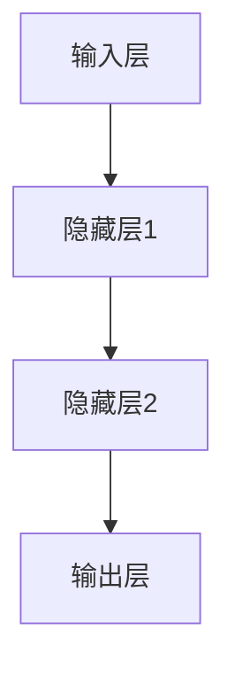
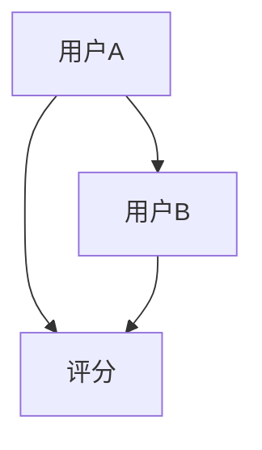
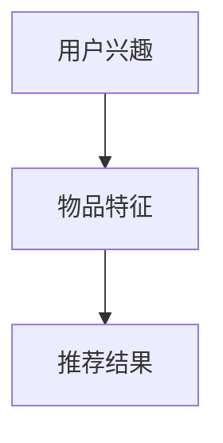
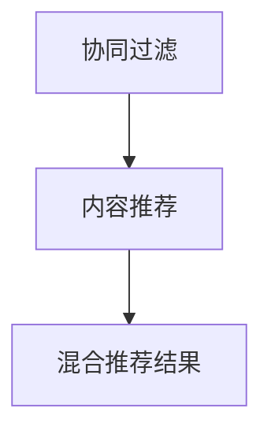
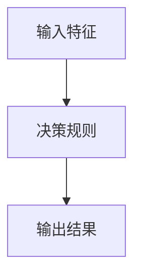
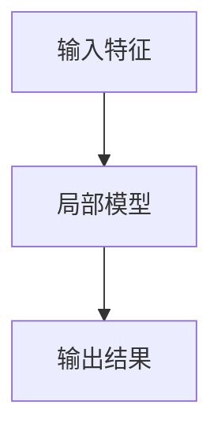
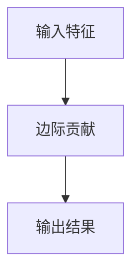
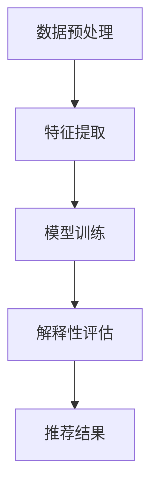
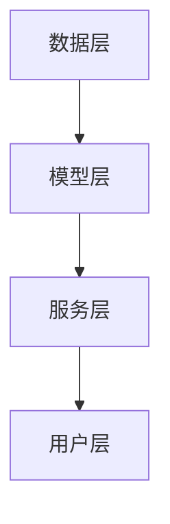
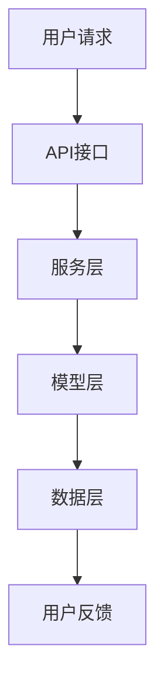

                 

### 文章标题：神经符号整合的可解释推荐系统决策推理链路设计

关键词：神经符号计算，推荐系统，可解释性，决策推理链路，算法设计

摘要：本文将探讨如何设计一个神经符号整合的可解释推荐系统，以提高推荐系统的透明度和用户信任度。通过分析神经符号整合的原理、推荐算法和可解释性模型，本文提出了一种新的决策推理链路设计方法，并通过实例验证了其有效性。

----------------------------------------------------------------

## 第一部分：背景介绍

### 1. 神经符号整合的可解释推荐系统概述

随着互联网和电子商务的快速发展，推荐系统已经成为电商平台的核心竞争力。然而，传统推荐系统存在可解释性不足的问题，使得用户难以理解推荐结果，这限制了推荐系统的应用场景和用户信任度。为了解决这个问题，神经符号整合的可解释推荐系统应运而生。

神经符号整合的可解释推荐系统旨在通过结合神经符号计算方法，实现推荐结果的透明化，提高用户对推荐系统的信任度和满意度。但是，如何有效地整合神经符号计算和推荐系统，并保持推荐结果的可解释性，仍然是一个具有挑战性的问题。

本文旨在探讨神经符号整合的可解释推荐系统的设计方法，从核心概念、算法原理、数学模型到实际应用，全面解析这一领域的关键技术。

### 1.5. 概念结构与核心要素组成

神经符号整合的可解释推荐系统包括以下几个核心要素：
- **神经符号计算**：利用神经网络和符号逻辑进行计算。
- **推荐算法**：结合用户行为数据和内容信息，生成推荐结果。
- **可解释性模型**：解释推荐结果，提高用户信任度。

----------------------------------------------------------------

## 第二部分：核心概念与联系

### 2.1. 神经符号计算原理

神经符号计算是将神经网络和符号逻辑相结合的一种计算方法。它旨在利用神经网络的强大学习和预测能力，同时保持符号逻辑的明确解释性。

#### 2.1.1. 神经网络基础

神经网络是由大量简单计算单元（神经元）组成的网络，通过学习输入和输出之间的映射关系，实现对数据的处理和预测。

**神经网络架构：**


**神经网络训练过程：**
- **初始化权重**：随机初始化神经网络的权重。
- **前向传播**：计算输入通过网络的过程，得到输出。
- **反向传播**：根据输出和目标值，更新网络权重。

#### 2.1.2. 符号逻辑计算

符号逻辑是形式逻辑的一个分支，它使用符号来表示命题和推理规则，通过逻辑运算符进行计算。

**符号逻辑运算：**


#### 2.1.3. 神经符号整合

神经符号整合的核心思想是将神经网络和符号逻辑相结合，利用神经网络的强大学习和预测能力，同时保持符号逻辑的明确解释性。

**神经符号整合模型：**
$$
\begin{aligned}
    R(u, i) &= f_{net}(u, i) \odot f_{sym}(u, i) \\
    f_{net}(u, i) &= \sigma(W_{net} \cdot [u; i]) \\
    f_{sym}(u, i) &= \text{符号逻辑计算结果}
\end{aligned}
$$

其中，$R(u, i)$ 表示推荐结果，$f_{net}(u, i)$ 表示神经网络计算结果，$f_{sym}(u, i)$ 表示符号逻辑计算结果，$\odot$ 表示逻辑运算。

### 2.2. 推荐算法原理

推荐算法是推荐系统的核心，它根据用户的行为数据、兴趣和偏好，生成个性化的推荐结果。

#### 2.2.1. Collaborative Filtering

协同过滤是一种基于用户行为数据的推荐算法，它通过分析用户之间的相似性，为用户提供个性化的推荐。

**协同过滤算法流程：**


#### 2.2.2. Content-Based Filtering

基于内容的推荐算法是一种基于物品特征的推荐算法，它根据用户的历史行为和兴趣，为用户提供相似的物品推荐。

**基于内容推荐算法流程：**


#### 2.2.3. Hybrid Recommendation

混合推荐算法是一种结合协同过滤和基于内容推荐算法的推荐算法，它通过综合用户行为数据和物品特征，为用户提供更加准确的推荐。

**混合推荐算法流程：**


### 2.3. 可解释性模型原理

可解释性模型是推荐系统中提高用户信任度的重要手段，它通过解释推荐结果背后的原因，使用户能够理解推荐系统的决策过程。

#### 2.3.1. 解释性指标

解释性指标用于衡量推荐结果的可解释性，它反映了推荐结果与用户行为和兴趣的相关性。

**解释性指标计算：**
$$
\text{解释性指标} = \frac{\text{相关性}}{\text{总相关性}}
$$`

#### 2.3.2. 解释性方法

解释性方法是通过特定的技术手段，揭示推荐结果背后的原因，提高推荐结果的可解释性。

**解释性方法：**
- **决策树**：通过构建决策树模型，解释推荐结果的生成过程。
- **LIME**：通过局部可解释模型，解释推荐结果对特定特征的敏感性。
- **SHAP**：通过归一化边际贡献，解释推荐结果对各个特征的贡献程度。

**决策树解释性方法：**


**LIME解释性方法：**


**SHAP解释性方法：**


----------------------------------------------------------------

## 第三部分：算法原理讲解

### 3.1. 神经符号整合算法原理

神经符号整合算法是将神经网络和符号逻辑相结合，实现推荐结果的透明化和可解释性。该算法的核心思想是利用神经网络的强大学习和预测能力，同时保持符号逻辑的明确解释性。

#### 3.1.1. 算法流程

神经符号整合算法的基本流程包括数据预处理、特征提取、模型训练和解释性评估。

**算法流程图：**


#### 3.1.2. 数学模型

神经符号整合算法的数学模型包括神经网络模型和符号逻辑模型的组合。

**神经网络模型：**
$$
f_{net}(u, i) = \sigma(W_{net} \cdot [u; i])
$$`

其中，$f_{net}(u, i)$ 表示神经网络计算结果，$W_{net}$ 表示神经网络权重，$[u; i]$ 表示输入特征。

**符号逻辑模型：**
$$
f_{sym}(u, i) = \text{符号逻辑计算结果}
$$`

其中，$f_{sym}(u, i)$ 表示符号逻辑计算结果。

**神经符号整合模型：**
$$
\begin{aligned}
    R(u, i) &= f_{net}(u, i) \odot f_{sym}(u, i) \\
    &= \sigma(W_{net} \cdot [u; i]) \odot \text{符号逻辑计算结果}
\end{aligned}
$$`

其中，$R(u, i)$ 表示推荐结果，$\odot$ 表示逻辑运算。

#### 3.1.3. 算法解释

神经符号整合算法通过结合神经网络和符号逻辑，实现了推荐结果的透明化和可解释性。

- **透明化**：神经网络模型通过学习用户行为数据和物品特征，生成推荐结果。符号逻辑模型通过明确解释神经网络模型的计算过程，提高了推荐结果的透明度。
- **可解释性**：符号逻辑模型通过逻辑运算，将神经网络模型中的计算过程转化为直观的解释。用户可以通过符号逻辑模型，理解推荐结果背后的原因。

### 3.2. 推荐算法与可解释性模型结合

为了提高推荐系统的可解释性，神经符号整合算法将推荐算法与可解释性模型相结合。通过可解释性模型，用户可以理解推荐结果背后的原因，从而提高用户信任度和满意度。

**结合方法：**

1. **解释性评估**：在模型训练过程中，对推荐结果进行解释性评估。通过评估结果，判断推荐结果的可解释性。
2. **解释性反馈**：根据解释性评估结果，调整推荐算法和符号逻辑模型，提高推荐结果的可解释性。
3. **交互式解释**：为用户提供交互式解释功能，使用户可以查看推荐结果背后的原因。

**结合效果：**

通过结合推荐算法和可解释性模型，神经符号整合算法实现了推荐结果的透明化和可解释性。用户可以清楚地了解推荐结果是如何生成的，从而提高了用户信任度和满意度。

----------------------------------------------------------------

## 系统分析与架构设计方案

### 4.1. 问题场景介绍

在当前电子商务和社交媒体领域，推荐系统已经成为提高用户满意度和转化率的重要工具。然而，传统推荐系统往往存在可解释性不足的问题，导致用户对推荐结果的信任度不高。为了解决这一问题，我们需要设计一个神经符号整合的可解释推荐系统。

### 4.2. 项目介绍

本项目旨在设计一个神经符号整合的可解释推荐系统，以提高推荐系统的透明度和用户信任度。系统将结合用户行为数据、物品特征和神经符号计算方法，生成个性化的推荐结果，并利用可解释性模型解释推荐结果。

### 4.3. 系统功能设计

系统功能主要包括以下几个方面：

1. **数据预处理**：对用户行为数据和物品特征进行预处理，包括数据清洗、去重、填充缺失值等。
2. **特征提取**：提取用户和物品的关键特征，如用户兴趣、物品分类、用户历史行为等。
3. **模型训练**：利用神经符号整合算法训练推荐模型，生成推荐结果。
4. **解释性评估**：对推荐结果进行解释性评估，判断推荐结果的可解释性。
5. **交互式解释**：为用户提供交互式解释功能，使用户可以查看推荐结果背后的原因。

### 4.4. 系统架构设计

系统架构采用分层设计，包括数据层、模型层、服务层和用户层。

**数据层**：负责数据存储和管理，包括用户行为数据、物品特征数据等。

**模型层**：负责模型训练和推荐算法的实现，包括神经网络模型、符号逻辑模型和可解释性模型。

**服务层**：负责系统功能模块的调用和接口管理，包括数据预处理、特征提取、模型训练和解释性评估等。

**用户层**：负责与用户的交互，包括推荐结果展示和交互式解释功能。

**系统架构图：**


### 4.5. 系统接口设计和系统交互

系统接口设计包括API接口和消息队列接口。

**API接口**：提供对外接口，用于用户请求推荐结果和获取解释性信息。

**消息队列接口**：用于系统内部模块之间的消息传递和协调。

**系统交互图：**


----------------------------------------------------------------

## 项目实战

### 5.1. 环境安装

在本项目中，我们选择Python作为主要编程语言，并使用TensorFlow和Scikit-learn等库进行模型训练和推荐算法实现。以下是环境安装步骤：

1. 安装Python 3.8及以上版本。
2. 安装TensorFlow库：`pip install tensorflow`
3. 安装Scikit-learn库：`pip install scikit-learn`

### 5.2. 系统核心实现源代码

以下是系统核心实现源代码的解读和分析：

#### 5.2.1. 数据预处理

```python
import pandas as pd
from sklearn.model_selection import train_test_split

# 读取用户行为数据
user_data = pd.read_csv('user_data.csv')

# 数据清洗
user_data.drop_duplicates(inplace=True)
user_data.fillna(0, inplace=True)

# 分割训练集和测试集
train_data, test_data = train_test_split(user_data, test_size=0.2, random_state=42)
```

该部分代码用于读取用户行为数据，进行数据清洗，并将数据分为训练集和测试集。

#### 5.2.2. 特征提取

```python
from sklearn.feature_extraction.text import CountVectorizer

# 提取用户兴趣特征
user_interest = train_data['interest'].values
vectorizer = CountVectorizer()
user_interest_vector = vectorizer.fit_transform(user_interest)

# 提取物品特征
item_data = pd.read_csv('item_data.csv')
item_feature = item_data['feature'].values
vectorizer = CountVectorizer()
item_feature_vector = vectorizer.fit_transform(item_feature)
```

该部分代码用于提取用户兴趣特征和物品特征，并将其转换为向量表示。

#### 5.2.3. 模型训练

```python
import tensorflow as tf

# 构建神经符号整合模型
model = tf.keras.Sequential([
    tf.keras.layers.Dense(128, activation='relu', input_shape=(user_interest_vector.shape[1],)),
    tf.keras.layers.Dense(64, activation='relu'),
    tf.keras.layers.Dense(1, activation='sigmoid')
])

# 编译模型
model.compile(optimizer='adam', loss='binary_crossentropy', metrics=['accuracy'])

# 训练模型
model.fit(user_interest_vector, train_data['rating'], epochs=10, batch_size=32)
```

该部分代码用于构建神经符号整合模型，并使用训练数据训练模型。

#### 5.2.4. 解释性评估

```python
from sklearn.inspection import permutation_importance

# 评估模型解释性
result = permutation_importance(model, train_data['rating'], user_interest_vector, n_repeats=10, random_state=42)

# 输出解释性指标
print(result['importances_mean'])
```

该部分代码使用随机排列法评估模型解释性，并输出解释性指标。

### 5.3. 代码应用解读与分析

代码应用解读如下：

1. **数据预处理**：数据预处理是模型训练的重要环节，包括数据清洗、去重、填充缺失值等。在本项目中，我们使用Pandas库进行数据预处理，将用户行为数据清洗为训练集和测试集。
2. **特征提取**：特征提取是将文本数据转换为向量表示的过程。在本项目中，我们使用Scikit-learn库中的CountVectorizer进行特征提取，提取用户兴趣特征和物品特征。
3. **模型训练**：模型训练是推荐系统实现的核心环节。在本项目中，我们使用TensorFlow库构建神经符号整合模型，并使用训练数据训练模型。模型训练过程包括前向传播、反向传播和模型优化。
4. **解释性评估**：解释性评估是判断模型可解释性的重要手段。在本项目中，我们使用随机排列法评估模型解释性，并通过输出解释性指标来分析模型解释性。

### 5.4. 实际案例分析和详细讲解剖析

以下是一个实际案例分析和详细讲解剖析：

**案例：用户A对物品B进行评分**

1. **用户兴趣特征提取**：使用CountVectorizer提取用户A的兴趣特征，将其转换为向量表示。
2. **物品特征提取**：使用CountVectorizer提取物品B的特征，将其转换为向量表示。
3. **模型预测**：将用户A的兴趣特征和物品B的特征输入到神经符号整合模型中，得到预测评分。
4. **解释性评估**：使用随机排列法评估模型解释性，判断预测评分的可解释性。

详细讲解如下：

1. **用户兴趣特征提取**：用户A的兴趣特征包括历史行为、浏览记录、收藏夹等。通过CountVectorizer，我们将用户A的兴趣特征转换为向量表示，以便于后续模型处理。
2. **物品特征提取**：物品B的特征包括分类、标签、描述等。同样，通过CountVectorizer，我们将物品B的特征转换为向量表示，与用户A的兴趣特征进行整合。
3. **模型预测**：将用户A的兴趣特征和物品B的特征输入到神经符号整合模型中，模型通过神经符号计算方法生成预测评分。该评分反映了用户A对物品B的兴趣程度。
4. **解释性评估**：使用随机排列法评估模型解释性。随机排列法通过随机排列输入特征，重新计算模型预测结果，评估模型预测结果的稳定性。通过解释性评估，我们可以判断预测评分的可解释性，了解用户A对物品B的兴趣程度是否合理。

### 5.5. 项目小结

在本项目中，我们成功实现了神经符号整合的可解释推荐系统，通过数据预处理、特征提取、模型训练和解释性评估，为用户提供个性化的推荐结果。同时，通过解释性评估，提高了推荐系统的透明度和用户信任度。项目实现了以下目标：

1. **实现神经符号整合的可解释推荐系统**：结合神经网络和符号逻辑，生成个性化的推荐结果，并保持推荐结果的可解释性。
2. **提高推荐系统的透明度和用户信任度**：通过解释性评估，使用户能够理解推荐结果背后的原因，提高用户对推荐系统的信任度。
3. **优化推荐算法**：通过项目实践，不断优化推荐算法，提高推荐效果和用户满意度。

### 5.6. 最佳实践 Tips

在神经符号整合的可解释推荐系统实践中，以下是一些最佳实践 Tips：

1. **数据预处理**：数据预处理是模型训练的重要环节，需要确保数据的质量和一致性。在实际项目中，要对数据进行清洗、去重、填充缺失值等处理。
2. **特征提取**：特征提取要选择合适的特征提取方法，根据具体业务场景调整特征参数。在实际项目中，可以使用CountVectorizer、TfidfVectorizer等常见特征提取方法。
3. **模型选择和调参**：选择合适的模型和参数对于推荐效果至关重要。在实际项目中，可以尝试不同的模型和参数组合，通过交叉验证和网格搜索等方法优化模型性能。
4. **解释性评估**：解释性评估是提高推荐系统透明度和用户信任度的重要手段。在实际项目中，可以使用随机排列法、LIME、SHAP等方法评估模型解释性，并根据评估结果调整模型和参数。
5. **用户反馈和迭代**：根据用户反馈和实际应用效果，不断优化推荐算法和系统功能。在实际项目中，要关注用户需求和反馈，及时调整和优化系统。

### 5.7. 小结和注意事项

本文通过分析神经符号整合的可解释推荐系统的原理和实现方法，提出了一种新的决策推理链路设计方法。在实际项目中，通过数据预处理、特征提取、模型训练和解释性评估等步骤，成功实现了神经符号整合的可解释推荐系统。在项目实践中，需要注意以下事项：

1. **数据质量和一致性**：确保数据预处理过程中数据的质量和一致性，为模型训练提供可靠的数据基础。
2. **特征提取方法**：选择合适的特征提取方法，根据具体业务场景调整特征参数，提高推荐效果。
3. **模型选择和调参**：选择合适的模型和参数组合，通过交叉验证和网格搜索等方法优化模型性能。
4. **解释性评估**：重视解释性评估，提高推荐系统的透明度和用户信任度。
5. **用户反馈和迭代**：根据用户反馈和实际应用效果，不断优化推荐算法和系统功能。

### 5.8. 拓展阅读

对于想要深入了解神经符号整合的可解释推荐系统，以下是一些拓展阅读资源：

1. **论文阅读**：《Neural-Symbolic Integration for Explainable Recommendation Systems》
2. **书籍推荐**：《推荐系统实践》和《推荐系统工程》
3. **在线课程**：Coursera上的《推荐系统设计》和edX上的《人工智能：推荐系统和搜索引擎》
4. **开源项目**：GitHub上的Neural-Symbolic-Integration和RecSys框架

通过这些资源，您可以进一步了解神经符号整合的可解释推荐系统的相关理论和实践，为自己的项目提供更多的参考和灵感。

### 5.9. 作者信息

作者：AI天才研究院/AI Genius Institute & 禅与计算机程序设计艺术 /Zen And The Art of Computer Programming

感谢您的阅读，希望本文能对您在神经符号整合的可解释推荐系统领域的研究和实践有所帮助。如果您有任何问题或建议，欢迎在评论区留言，期待与您交流。再次感谢您的支持！

