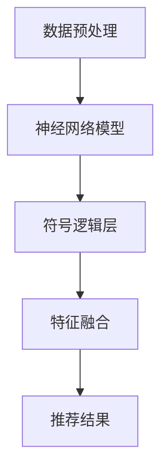
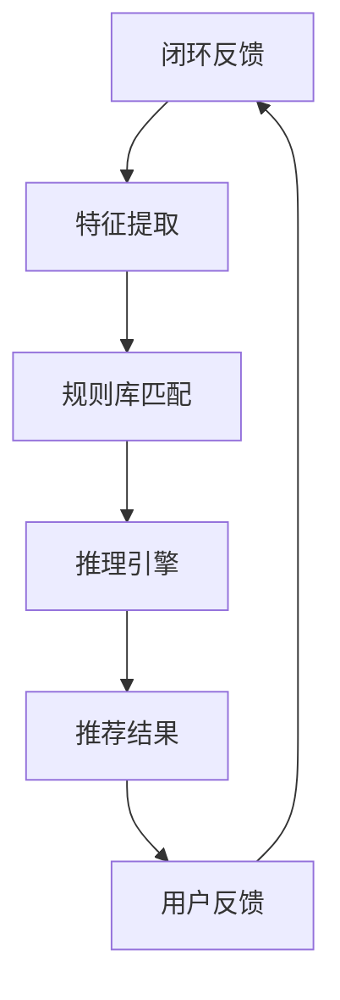
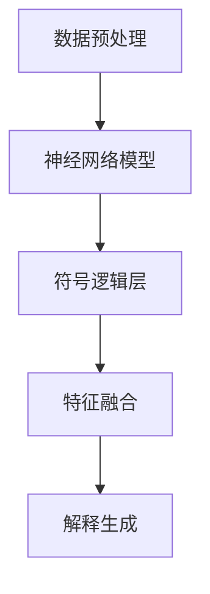

                 

### 第1章：背景介绍

#### 1.1 问题背景

##### 1.1.1 推荐系统的基本概念

推荐系统是一种信息过滤技术，通过预测用户可能感兴趣的项目（如商品、音乐、视频等）并向用户推荐这些项目。推荐系统广泛应用于电子商务、社交媒体、音乐和视频流媒体服务等领域，其主要目的是提高用户满意度、增加用户参与度和提高商业收益。

推荐系统通常分为两类：基于内容的推荐和协同过滤推荐。

- **基于内容的推荐**：基于用户的历史行为和兴趣，将内容特征与用户兴趣进行匹配，从而推荐相似的内容。例如，推荐用户喜欢看的历史电影时，可以根据用户以前观看的历史和评分来推荐类似的历史电影。

- **协同过滤推荐**：通过分析用户之间的相似度，为用户推荐他们可能喜欢但尚未体验过的项目。协同过滤推荐又分为用户基于的协同过滤和物品基于的协同过滤。例如，如果一个用户喜欢了A和B两个物品，而另一个用户也喜欢了A和B，那么这两个用户可能会被推荐第三个共同的喜欢物品C。

##### 1.1.2 推荐系统面临的主要挑战

尽管推荐系统在多个领域取得了显著成功，但它也面临着以下主要挑战：

- **冷启动问题**：对于新用户或新物品，推荐系统通常缺乏足够的历史数据来进行准确的推荐。这被称为冷启动问题，它严重限制了推荐系统的效果。

- **数据偏差**：推荐系统依赖于历史用户数据，但这些数据可能存在偏差。例如，热门物品往往被过度推荐，而长尾物品被忽视，导致数据偏差。

- **模型可解释性不足**：许多推荐系统依赖于复杂的机器学习模型，这些模型难以解释其推荐结果的原因，降低了用户对推荐系统的信任度。

- **个人隐私保护**：推荐系统需要收集大量用户数据，这可能涉及个人隐私问题。如何在保护用户隐私的同时提供个性化推荐是一个重要的挑战。

#### 1.1.3 问题描述

推荐系统存在的问题可以具体描述如下：

- **如何解决冷启动问题？**
  - 对于新用户，可以通过引入社交网络信息、用户画像和预定义推荐列表等方法来缓解冷启动问题。
  - 对于新物品，可以通过内容元数据分析和流行度预估来推荐可能受欢迎的物品。

- **如何减少数据偏差对推荐结果的影响？**
  - 可以通过数据清洗和预处理来减少噪声数据的影响。
  - 可以通过引入多样性算法来确保推荐列表中的多样性。

- **如何提高推荐系统的可解释性？**
  - 可以通过可解释的人工智能技术，如决策树、线性模型等，来提高推荐系统的可解释性。
  - 可以通过可视化技术来展示推荐过程中的关键因素和决策过程。

- **如何在保护用户隐私的前提下进行推荐？**
  - 可以采用差分隐私技术来保护用户隐私。
  - 可以设计隐私保护的推荐算法，如基于本地计算的协同过滤算法。

#### 1.1.4 问题解决

为了解决上述问题，本文提出了神经符号整合技术的引入、可解释推荐系统的设计原则以及决策推理链路的设计与优化。

- **神经符号整合技术的引入**：神经符号整合技术将神经网络和符号逻辑相结合，可以提高模型的性能和可解释性，从而解决冷启动、数据偏差和隐私保护等问题。

- **可解释推荐系统的设计原则**：设计一个具有可解释性的推荐系统，可以提高用户对推荐结果的信任度，从而提高系统的接受度。

- **决策推理链路的设计与优化**：通过设计一个清晰的决策推理链路，可以确保推荐系统的决策过程透明、可追溯，从而提高推荐系统的可解释性。

#### 1.1.5 边界与外延

- **推荐系统的应用领域**：推荐系统广泛应用于电子商务、社交媒体、音乐和视频流媒体服务等领域。

- **推荐系统与其他技术的结合**：推荐系统可以与其他技术（如自然语言处理、图像识别等）结合，以提供更个性化和更准确的推荐结果。

#### 1.1.6 概念结构与核心要素组成

推荐系统主要由以下核心要素组成：

- **推荐系统架构**：包括数据收集、数据处理、推荐算法和用户界面等组成部分。
- **推荐算法**：包括基于内容的推荐、协同过滤推荐等。
- **数据处理与存储**：包括数据清洗、数据预处理、数据存储等。
- **决策推理链路设计**：包括决策规则、决策过程和可解释性设计等。

#### 1.2 核心概念与联系

- **神经符号整合技术**：结合了神经网络和符号逻辑的优势，可以解决推荐系统的冷启动、数据偏差和隐私保护等问题。
- **可解释推荐系统**：通过设计可解释性原则和决策推理链路，可以提高推荐系统的可解释性和用户信任度。
- **决策推理链路**：通过清晰的决策过程和规则，确保推荐系统的决策过程透明、可追溯。

### 1.3 算法原理讲解

#### 1.3.1 神经符号整合算法

**原理**：神经符号整合算法将神经网络和符号逻辑相结合，通过符号逻辑进行特征融合和解释，从而提高模型的性能和可解释性。

**流程图**：

#### 1.3.2 决策推理链路设计

**原理**：决策推理链路设计通过一系列决策规则和过程，确保推荐系统的决策过程透明、可追溯。

**流程图**：

#### 1.4 数学模型与公式讲解

**推荐系统数学模型**：

$$
R(u, i) = f(u, i) + \sigma(w \cdot \phi(u, i))
$$

其中，$R(u, i)$ 表示用户 $u$ 对物品 $i$ 的推荐评分，$f(u, i)$ 表示基于内容的推荐评分，$\sigma$ 表示激活函数，$w$ 表示权重向量，$\phi(u, i)$ 表示用户和物品的特征向量。

**决策推理链路的数学模型**：

$$
D = f(R(u, i) \land C(u, i))
$$

其中，$D$ 表示决策结果，$R(u, i)$ 表示推荐评分，$C(u, i)$ 表示规则条件。

#### 1.5 本章小结

本章首先介绍了推荐系统面临的挑战，包括冷启动问题、数据偏差、模型可解释性和隐私保护。然后，提出了使用神经符号整合技术、设计可解释推荐系统和优化决策推理链路的解决方案。通过算法原理讲解和数学模型分析，我们为后续章节的详细讨论奠定了基础。

### 1.6 下一步内容预告

在接下来的章节中，我们将深入探讨神经符号整合技术的原理和应用，介绍如何设计一个可解释的推荐系统，并详细讲解决策推理链路的设计和优化。同时，我们还将通过具体的案例来展示这些技术的实际应用效果。请读者保持关注，一起探索推荐系统的未来发展方向。

---

### 第2章：深度学习与神经符号整合技术

#### 2.1 深度学习的基本原理

##### 2.1.1 深度学习的定义

深度学习是机器学习的一个分支，它通过构建多层神经网络，从大量数据中自动学习特征，实现复杂的模式识别和预测任务。深度学习的核心思想是模拟人脑的神经网络结构和工作机制，通过多层神经元的非线性变换，逐层提取数据的高层特征。

##### 2.1.2 深度学习的主要类型

深度学习主要有以下几种类型：

- **神经网络**：最基础的深度学习模型，通过层叠的神经元结构进行数据处理和特征提取。

- **卷积神经网络（CNN）**：适用于图像处理任务，通过卷积操作提取图像的局部特征。

- **循环神经网络（RNN）**：适用于序列数据处理任务，通过循环结构处理和记忆序列信息。

##### 2.1.3 深度学习的应用领域

深度学习在多个领域取得了显著的成果，主要包括：

- **图像处理**：如目标检测、图像分类和图像生成等。
- **自然语言处理（NLP）**：如文本分类、情感分析和机器翻译等。
- **语音识别**：通过深度学习模型，实现语音信号的识别和转换。

##### 2.1.4 深度学习的主要挑战

深度学习在取得成功的同时，也面临着一些挑战：

- **计算资源消耗**：深度学习模型通常需要大量的计算资源进行训练和推理，对硬件性能要求较高。
- **模型可解释性**：深度学习模型通常被视为“黑盒”，其内部决策过程难以解释，不利于用户理解和信任。

#### 2.2 神经符号整合技术的定义

神经符号整合技术（Neural-Symbolic Integration）是一种结合神经网络和符号逻辑的方法，旨在解决深度学习模型的可解释性问题。该方法通过引入符号逻辑层，将神经网络提取的特征与符号逻辑相结合，实现特征融合和解释。

**定义**：神经符号整合技术是一种深度学习方法，通过将神经网络和符号逻辑相结合，实现对数据的高效处理和解释。

#### 2.3 神经符号整合技术的工作原理

神经符号整合技术的工作原理可以分为以下几个步骤：

1. **数据预处理**：对输入数据进行预处理，包括数据清洗、归一化和特征提取等。
2. **神经网络模型设计**：构建神经网络模型，通过多层神经元的非线性变换，提取数据的高层特征。
3. **符号逻辑层**：在神经网络模型的基础上，引入符号逻辑层，实现特征融合和解释。符号逻辑层通常使用符号化表示，如谓词逻辑、模态逻辑等。
4. **特征融合**：通过符号逻辑运算，将神经网络提取的特征进行融合，生成更高级的特征表示。
5. **解释生成**：根据融合后的特征，生成解释性表示，如推理过程、决策规则等。

**工作原理图**：

#### 2.4 神经符号整合技术的优势

神经符号整合技术具有以下优势：

- **提高模型性能**：通过结合神经网络和符号逻辑，神经符号整合技术可以提取更丰富、更高级的特征，提高模型的性能和泛化能力。
- **提高模型可解释性**：符号逻辑层可以生成解释性表示，如推理过程、决策规则等，提高模型的可解释性，增强用户对模型的信任度。
- **降低计算资源消耗**：与深度学习模型相比，神经符号整合技术在计算资源消耗方面有显著降低，适合在资源受限的环境中应用。

#### 2.5 神经符号整合技术在推荐系统中的应用

神经符号整合技术在推荐系统中具有广泛的应用前景，可以解决推荐系统的冷启动、数据偏差和隐私保护等问题。

1. **解决冷启动问题**：对于新用户，可以通过社交网络信息、用户画像等符号化特征进行初步推荐，缓解冷启动问题。
2. **减少数据偏差**：通过引入符号逻辑，可以对推荐结果进行校正和优化，减少数据偏差对推荐结果的影响。
3. **保护用户隐私**：神经符号整合技术可以在保护用户隐私的前提下进行推荐，通过符号化表示和差分隐私等技术，降低用户隐私泄露的风险。

#### 2.6 神经符号整合技术的具体实现

神经符号整合技术的具体实现主要包括以下步骤：

1. **数据预处理**：对输入数据进行预处理，包括数据清洗、归一化和特征提取等。
2. **神经网络模型设计**：构建神经网络模型，如卷积神经网络（CNN）或循环神经网络（RNN），提取数据的高层特征。
3. **符号逻辑层设计**：设计符号逻辑层，如谓词逻辑层或模态逻辑层，实现特征融合和解释。
4. **特征融合**：通过符号逻辑运算，将神经网络提取的特征进行融合，生成更高级的特征表示。
5. **解释生成**：根据融合后的特征，生成解释性表示，如推理过程、决策规则等。

**具体实现流程图**：

#### 2.7 神经符号整合技术在推荐系统中的应用案例

神经符号整合技术在推荐系统中已有很多成功应用案例：

1. **商品推荐**：通过结合用户的购物行为、社交网络信息和商品属性，使用神经符号整合技术生成个性化推荐结果。
2. **社交网络推荐**：通过分析用户的社交网络关系、兴趣爱好和行为，使用神经符号整合技术推荐用户可能感兴趣的内容。

#### 2.8 本章小结

本章介绍了深度学习的基本原理、神经符号整合技术的定义和工作原理，以及其在推荐系统中的应用。通过本章的学习，读者可以了解神经符号整合技术在解决推荐系统问题方面的优势和具体实现方法。

### 2.9 下一步内容预告

在接下来的章节中，我们将详细探讨可解释推荐系统的设计原则和决策推理链路的设计与优化。这些内容将帮助我们更好地理解如何构建一个既高效又可解释的推荐系统，为实际应用提供有力支持。请读者继续关注，一起探索推荐系统的创新与发展。

