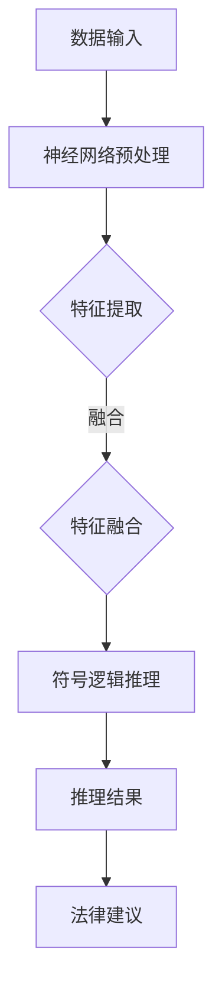
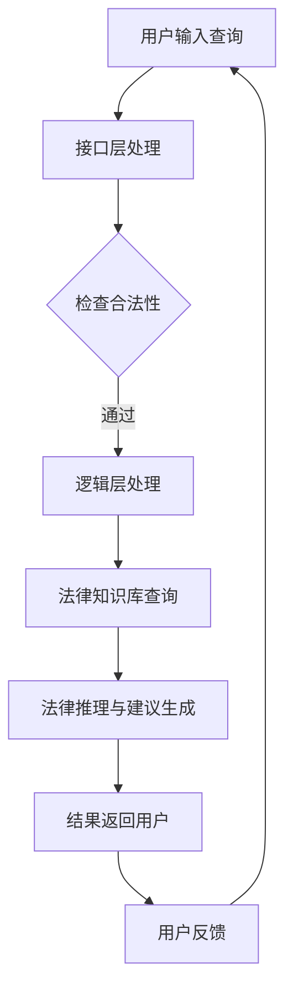

                 

### 1.1 问题背景

**法律推理与建议系统的需求与挑战**

在现代社会，法律作为维护社会秩序和公正的重要工具，其应用范围广泛，从民事纠纷到刑事案件，从行政争议到国际法，无不涉及。然而，随着法律体系的日益复杂，法律的应用也面临着巨大的挑战。传统的法律推理方式主要依赖于专业法律人士的判断，这不仅效率低下，而且容易出现偏差。为了提高法律决策的效率与准确性，建立一套智能化、自动化的法律推理与建议系统成为当务之急。

法律推理与建议系统的核心需求主要包括：

1. **准确性**：系统应能准确解析法律条文，提供符合法律规定的建议。
2. **高效性**：系统能够快速响应法律查询，提供即时的法律建议。
3. **可解释性**：系统输出的法律建议应具备可解释性，便于用户理解和接受。

然而，这些需求的实现面临着以下几大挑战：

1. **法律体系的复杂性**：法律条文繁多，相互之间存在交叉和关联，使得法律推理过程极为复杂。
2. **法律语言的歧义性**：法律语言具有一定的模糊性和不确定性，增加了法律推理的难度。
3. **法律知识的不完整性**：现有法律知识库可能存在缺失或不准确的情况，影响法律推理的准确性。

**神经符号整合的概念与意义**

神经符号整合（Neural-Symbolic Integration）是近年来人工智能领域的一个新兴研究方向，旨在结合神经网络和符号逻辑的优势，实现更高效、更可靠的人工智能系统。神经网络擅长处理复杂的非线性问题，能够从大量数据中学习到复杂的模式；而符号逻辑则擅长处理逻辑推理和知识表示，能够提供清晰的逻辑关系和推理路径。

神经符号整合在法律推理与建议系统中的应用具有重要意义：

1. **增强准确性**：通过结合神经网络和符号逻辑，系统能够更准确地理解法律条文，减少歧义和错误。
2. **提高效率**：神经网络可以快速处理大量数据，而符号逻辑可以提供清晰的推理路径，提高法律推理的效率。
3. **提升可解释性**：神经符号整合使得系统输出的法律建议具备更高的可解释性，用户可以更好地理解和信任系统的建议。

通过神经符号整合，法律推理与建议系统不仅能解决传统方法中的准确性、高效性和可解释性问题，还能为法律领域的智能化应用提供新的可能性。

### 1.2 问题描述

**法律领域的复杂性**

法律领域是一个高度复杂的系统，其复杂性主要来源于以下几个方面：

1. **法律体系的庞大**：现代法律体系包含了大量的法律条文、司法解释、案例和法规，这些法律条文和解释之间存在着复杂的关联和相互影响。
   
2. **法律语言的复杂性**：法律语言具有专业性和严密性，但同时也具有一定的模糊性和歧义性。这种语言特性使得法律条文的理解和解释变得更加困难。

3. **法律的动态性**：法律条文和解释并非一成不变，而是随着社会的发展和变化不断更新和调整。这种动态性增加了法律推理的难度。

**法律推理的可解释性需求**

法律推理的可解释性是法律领域的一个重要需求。可解释性不仅有助于提升系统的透明度和可靠性，使法律决策过程更加透明，而且有助于用户理解和信任系统输出的法律建议。具体来说，法律推理的可解释性需求包括：

1. **推理过程的可追溯性**：系统应能够提供详细的推理过程，用户可以清晰地看到每一步推理的依据和逻辑。
   
2. **法律建议的可理解性**：系统输出的法律建议应使用简洁明了的语言，避免过于复杂的法律术语，确保用户能够理解和接受。

3. **知识库的透明性**：系统应提供完整的知识库，用户可以查阅和理解知识库中的法律条文和案例。

**法律建议系统的自动化需求**

随着法律事务的日益增多，法律建议系统的自动化需求日益迫切。自动化法律建议系统可以显著提高法律工作的效率和准确性，减少人为错误，并在以下方面发挥重要作用：

1. **减轻人工负担**：自动化法律建议系统可以处理大量的法律查询和案件分析，减轻法律专业人士的工作负担。

2. **提高决策速度**：自动化系统可以快速响应法律查询，提供即时的法律建议，提高法律决策的速度。

3. **减少法律错误**：自动化系统通过精确的法律推理和知识库，可以减少人为错误，提高法律建议的准确性。

然而，实现法律建议系统的自动化也面临着以下挑战：

1. **法律知识的不完整性**：现有法律知识库可能存在不完整或错误的情况，影响自动化系统的准确性。

2. **法律推理的复杂性**：法律推理过程复杂，涉及多层次的逻辑推理和交叉案例分析，需要先进的算法和技术支持。

3. **系统的可解释性**：自动化系统输出的法律建议应具备可解释性，使用户能够理解和接受系统的建议。

综上所述，法律领域的复杂性、法律推理的可解释性需求以及法律建议系统的自动化需求共同构成了当前法律领域面临的重要挑战。通过引入神经符号整合技术，我们可以尝试解决这些挑战，为法律领域提供更高效、更可靠的智能化解决方案。

### 1.3 问题解决

**神经符号整合的优势**

神经符号整合（Neural-Symbolic Integration）通过结合神经网络和符号逻辑的优势，为法律推理与建议系统提供了一种有效的解决方案。以下是神经符号整合在解决法律领域挑战方面的主要优势：

1. **处理复杂非线性问题**：神经网络擅长处理复杂的非线性问题，可以从大量数据中学习到复杂的模式。在法律推理中，神经网络可以用于分析大量的法律条文、案例和法规，从中提取关键信息，提高法律推理的准确性。

2. **提供清晰的逻辑推理路径**：符号逻辑具有清晰的逻辑推理能力，能够提供明确的推理路径。在法律推理中，符号逻辑可以用于解析法律条文，确保推理过程符合法律逻辑，减少歧义和错误。

3. **增强系统的可解释性**：神经符号整合使得系统的推理过程更加透明和可解释。用户可以清晰地看到每一步推理的依据和逻辑，从而增强对系统建议的信任。

**可解释法律推理的核心原理**

可解释法律推理（Explainable Legal Reasoning）是神经符号整合在法律推理中的应用，其核心原理包括以下几个方面：

1. **逻辑推理**：可解释法律推理依赖于符号逻辑，通过明确的逻辑规则和推理方法，确保法律推理的准确性和可靠性。

2. **数据驱动学习**：神经网络通过学习大量的法律条文、案例和法规，提取其中的关键信息和模式，为法律推理提供数据支持。

3. **结合两者的优势**：神经符号整合将神经网络和符号逻辑的优势结合起来，通过神经网络的数据学习和符号逻辑的推理能力，实现高效、准确的法律推理。

**建议系统的设计原则**

设计一个高效、可靠的法律建议系统，需要遵循以下设计原则：

1. **模块化设计**：系统应采用模块化设计，将法律知识库、法律推理模块和法律建议模块分离，便于维护和扩展。

2. **用户友好界面**：系统应提供直观、易用的用户界面，使非专业用户也能方便地使用系统。

3. **快速响应**：系统应具备快速响应的能力，能够快速处理法律查询并提供即时的法律建议。

4. **高可解释性**：系统输出的法律建议应具备高可解释性，使用户能够理解和接受。

5. **可扩展性**：系统应具备良好的可扩展性，能够适应法律体系的不断变化和更新。

通过神经符号整合的可解释法律推理和符合设计原则的建议系统，我们可以有效解决法律领域的复杂性、可解释性需求和自动化需求，为法律工作者和公众提供更高效、准确的法律服务。

### 1.4 边界与外延

**法律领域的范围**

法律领域涵盖了广泛的领域，包括但不限于以下方面：

1. **民商法**：涉及合同、侵权、婚姻家庭、知识产权等方面。
2. **刑法**：涉及犯罪、刑罚、刑事诉讼等方面。
3. **行政法**：涉及政府机构、行政行为、行政诉讼等方面。
4. **国际法**：涉及国家间的关系、国际组织、国际贸易等方面。

**可解释法律推理的适用范围**

可解释法律推理主要适用于以下场景：

1. **法律咨询**：用户可以查询法律条文和案例，获得基于法律规则和逻辑推理的法律建议。
2. **司法决策**：法官和检察官可以利用可解释法律推理系统进行案件分析，辅助司法决策。
3. **法律教育**：法律教育者可以利用系统为学生提供法律知识的讲解和案例分析。

**建议系统的功能限制**

建议系统的功能限制主要包括：

1. **知识库限制**：系统的法律知识库可能不完整或不准确，影响法律建议的准确性。
2. **法律语言理解限制**：法律语言具有复杂性和歧义性，系统可能无法完全理解并准确解释。
3. **复杂推理限制**：某些法律问题可能涉及多层次的逻辑推理和复杂的案例分析，系统可能难以处理。

综上所述，理解法律领域的范围和可解释法律推理的适用范围，同时认识到建议系统的功能限制，对于构建和优化法律推理与建议系统至关重要。

### 1.5 概念结构与核心要素

**神经符号整合的基本概念**

神经符号整合（Neural-Symbolic Integration）是指将神经网络和符号逻辑结合起来的技术，旨在发挥两者的优势，实现更高效、准确的人工智能系统。具体来说，神经网络负责处理复杂的数据和模式识别，而符号逻辑则负责逻辑推理和知识表示。

1. **神经网络**：神经网络是一种模拟生物神经系统的计算模型，通过多层神经元结构和反向传播算法，能够从数据中自动学习到复杂的模式。
2. **符号逻辑**：符号逻辑是一种基于符号和规则的形式化推理方法，能够清晰表达逻辑关系和推理过程。

**法律推理的基本原理**

法律推理是指运用法律规范和事实信息进行逻辑推理，以得出法律结论的过程。法律推理的基本原理包括：

1. **三段论推理**：这是一种最基本的法律推理形式，包括大前提、小前提和结论。例如，如果所有违法行为都要受到惩罚（大前提），某行为是违法行为（小前提），那么该行为应受到惩罚（结论）。
2. **演绎推理**：从一般性原则推导出具体结论。例如，如果所有公民都有投票权（大前提），张三是公民（小前提），那么张三有投票权（结论）。
3. **归纳推理**：从具体实例推导出一般性结论。例如，通过分析多个案例，得出某个法律条文的一般性结论。

**建议系统的设计原则**

建议系统（Advisory System）是指根据用户输入的信息，自动提供相关建议的智能系统。设计一个高效、可靠的建议系统需要遵循以下原则：

1. **用户友好**：界面设计简洁、直观，易于用户操作和理解。
2. **快速响应**：系统能够快速处理用户请求，提供及时的建议。
3. **高可解释性**：系统输出的建议应具备高可解释性，用户能够理解和接受。
4. **知识库完整性**：确保系统具备全面、准确的知识库，以提供准确的建议。
5. **可扩展性**：系统应具备良好的可扩展性，能够适应法律体系的不断变化和更新。

**概念属性特征对比表格**

为了更直观地展示神经符号整合、法律推理和建议系统的核心特征，我们可以使用以下对比表格：

| 特征 | 神经符号整合 | 法律推理 | 建议系统 |
| ---- | ---- | ---- | ---- |
| **基础原理** | 结合神经网络和符号逻辑 | 符号逻辑 | 基于数据和规则 |
| **核心优势** | 处理复杂非线性问题、提供可解释性 | 清晰的逻辑推理、知识表示 | 用户友好、快速响应、高可解释性 |
| **应用场景** | 法律推理、知识表示、决策支持 | 法律咨询、司法决策、法律教育 | 法律查询、案件分析、法律建议 |
| **知识库需求** | 大量数据、准确知识 | 完整、准确的法条、案例 | 全面、准确的法律知识 |

通过上述概念结构与核心要素的详细解析，我们可以更深入地理解神经符号整合、法律推理和建议系统的基本原理和设计要点，为后续章节的深入讨论奠定基础。

### 2.1 神经符号整合原理

**神经网络与符号逻辑的结合**

神经符号整合的核心在于将神经网络和符号逻辑这两种不同的技术有机结合，以发挥各自的优势。神经网络擅长处理复杂的数据和模式识别，而符号逻辑则擅长逻辑推理和知识表示。将二者结合，可以使系统既具备强大的数据处理能力，又具备清晰的逻辑推理能力。

1. **数据处理能力**：神经网络通过多层神经网络结构，能够从大量的法律数据中自动学习到复杂的模式。这些数据包括法律条文、案例、法规等。神经网络可以通过数据驱动的方式，识别出法律条文中的关键信息和语义。
   
2. **逻辑推理能力**：符号逻辑则通过明确的逻辑规则和推理方法，确保法律推理的准确性和可靠性。符号逻辑可以用来解析法律条文，构建逻辑推理路径，从而得出法律结论。

**神经符号整合的优势**

神经符号整合在法律推理与建议系统中具有显著的优势：

1. **提高准确性**：通过结合神经网络和符号逻辑，系统可以更准确地理解法律条文和案例，减少推理过程中的错误。
   
2. **提高效率**：神经网络可以快速处理大量数据，而符号逻辑可以提供清晰的推理路径，提高法律推理的效率。

3. **增强可解释性**：神经符号整合使得系统的推理过程更加透明和可解释，用户可以清晰地看到每一步推理的依据和逻辑，从而增强对系统建议的信任。

**神经符号整合的数学模型**

神经符号整合的数学模型通常包括以下几个关键组成部分：

1. **神经网络模型**：常用的神经网络模型包括卷积神经网络（CNN）、循环神经网络（RNN）和Transformer等。这些模型可以通过训练学习到法律数据中的复杂特征和模式。

2. **符号逻辑模型**：符号逻辑模型通常使用形式逻辑和谓词逻辑等数学工具来表示法律条文和推理过程。例如，可以使用谓词逻辑公式来表示法律条款的语义。

3. **融合模型**：融合模型将神经网络和符号逻辑模型结合起来，通过特定的方法（如注意力机制）将两者的输出融合在一起，以实现更准确的推理。

具体的数学模型可以表示为：

\[ \text{推理结果} = f(\text{神经网络输出}, \text{符号逻辑输出}) \]

其中，\( f \) 是一个融合函数，用于将神经网络和符号逻辑的输出结合起来，以得到最终的推理结果。

通过上述数学模型，神经符号整合可以有效地处理复杂的法律问题，并提供准确、透明的法律建议。

**神经网络与符号逻辑在实际应用中的结合**

在实际应用中，神经网络和符号逻辑的结合可以通过以下几种方法实现：

1. **前后处理**：首先使用神经网络对输入数据进行预处理，提取关键特征，然后使用符号逻辑进行逻辑推理。这种方法可以充分发挥神经网络的数据处理能力和符号逻辑的逻辑推理能力。
   
2. **并行处理**：在同一个系统中同时使用神经网络和符号逻辑，分别处理不同的任务。例如，神经网络处理数据分析和模式识别，符号逻辑处理逻辑推理和知识表示。
   
3. **层次化模型**：构建一个层次化的模型，将神经网络和符号逻辑分布在不同的层次。例如，底层使用神经网络处理原始数据，中层使用符号逻辑进行推理，顶层生成最终的法律建议。

通过这些方法，神经符号整合可以在法律推理与建议系统中实现高效、准确的推理，为法律工作者和公众提供可靠的法律服务。

### 2.2 法律推理的概念

**法律推理的基本概念**

法律推理（Legal Reasoning）是指运用法律规范和事实信息进行逻辑推理，以得出法律结论的过程。法律推理是法律工作中不可或缺的一部分，其基本概念包括：

1. **法律规范**：法律规范是法律推理的基础，包括宪法、法律、法规、条例、司法解释等。法律规范规定了社会行为的标准和规则，是法律推理的核心依据。

2. **事实信息**：事实信息是法律推理的另一个重要组成部分，包括案件事实、证据、证人证言等。事实信息提供了具体的案例和数据，是法律推理的前提和基础。

3. **法律结论**：法律结论是法律推理的最终结果，是依据法律规范和事实信息得出的法律判断。法律结论通常用于指导法律决策和司法实践。

**法律推理的类型**

法律推理可以根据不同的标准进行分类，常见的分类方法包括：

1. **演绎推理**：演绎推理是从一般性原则推导出具体结论的推理方式。例如，如果所有违法行为都要受到惩罚（大前提），某行为是违法行为（小前提），那么该行为应受到惩罚（结论）。

2. **归纳推理**：归纳推理是从具体实例推导出一般性结论的推理方式。例如，通过分析多个案例，可以得出某个法律条文的一般性结论。

3. **类比推理**：类比推理是基于两个或多个事物在某些方面的相似性，推断它们在其他方面也可能相似的推理方式。例如，如果A和B在某些方面相似，并且A具有某种特征，那么可以推断B也可能具有相同的特征。

4. **实践推理**：实践推理是基于具体实践经验和判断的推理方式。法律工作者在处理具体案件时，通常需要根据实践经验和专业知识进行推理和判断。

**法律推理的数学模型**

法律推理的数学模型旨在将法律推理过程形式化，以便更好地理解和应用。以下是一些常用的法律推理数学模型：

1. **三段论模型**：三段论模型是法律推理中最基本的形式，包括大前提、小前提和结论。例如，如果所有违法行为都要受到惩罚（大前提），某行为是违法行为（小前提），那么该行为应受到惩罚（结论）。三段论模型可以用以下数学公式表示：

   \[ P \rightarrow Q \]
   \[ R \rightarrow P \]
   \[ \therefore R \rightarrow Q \]

2. **谓词逻辑模型**：谓词逻辑模型用于表示法律条文和推理过程中的复杂关系。谓词逻辑通过使用谓词、量词和逻辑连接词来描述法律推理。例如，可以用谓词逻辑表示如下法律条文：

   \[ \forall x (P(x) \rightarrow Q(x)) \]
   表示所有满足条件P的x，都满足条件Q。

3. **形式逻辑模型**：形式逻辑模型是一种形式化的法律推理方法，通过使用符号和规则来表示法律推理过程。形式逻辑模型可以确保法律推理的准确性和一致性。

**法律推理在实际应用中的案例分析**

以下是一个简单的法律推理案例分析：

**案例背景**：张三在一家餐厅吃饭时，因服务员上错菜品，导致张三的食物被污染。张三要求餐厅赔偿损失，但餐厅拒绝赔偿。

**法律规范**：根据《消费者权益保护法》，消费者在购买、使用商品或者接受服务时，其合法权益受到损害的，有权要求赔偿。

**事实信息**：张三在餐厅用餐时，食物被污染，张三要求餐厅赔偿。

**法律结论**：根据法律规范和事实信息，可以得出结论：餐厅应赔偿张三的损失。

通过以上案例，我们可以看到法律推理是如何将法律规范和事实信息结合起来，得出法律结论的。在实际应用中，法律推理需要结合具体的法律条文、案例和事实，进行详细的逻辑分析和推理，以确保法律结论的准确性和合理性。

### 2.3 建议系统的设计原则

**建议系统的功能需求**

设计一个高效、可靠的法律建议系统，首先需要明确其功能需求。以下是法律建议系统的主要功能需求：

1. **法律条文查询**：用户可以查询相关的法律条文，获取法律规范的具体内容和适用范围。
2. **案例检索**：用户可以检索相关的法律案例，了解法律实践中的具体应用和判决结果。
3. **法律咨询**：系统应提供法律咨询服务，根据用户的提问，提供相应的法律建议。
4. **智能推荐**：系统应能够根据用户的历史查询记录和当前问题，智能推荐相关的法律条文、案例和法律咨询。
5. **实时更新**：系统应具备实时更新功能，确保法律知识库中的法律条文、案例和法规是最新的。

**建议系统的设计原则**

为了满足上述功能需求，设计法律建议系统时需要遵循以下原则：

1. **用户友好**：系统界面应简洁、直观，便于用户操作和理解。使用户能够轻松地查询法律条文、检索案例和获取法律咨询。
2. **快速响应**：系统应具备快速响应能力，能够迅速处理用户请求，提供即时的法律建议。确保用户在遇到法律问题时能够及时得到帮助。
3. **高可解释性**：系统输出的法律建议应具备高可解释性，使用户能够理解和接受。通过清晰的语言和逻辑，向用户解释法律条文、案例和法律咨询的依据和结论。
4. **知识库完整性**：系统应具备完整、准确的法律知识库，包括最新的法律条文、案例和法规。确保法律建议的准确性和可靠性。
5. **可扩展性**：系统应具备良好的可扩展性，能够适应法律体系的不断变化和更新。随着法律条文和案例的增加，系统应能够灵活扩展，以适应新的需求。

**建议系统的数学模型**

为了实现法律建议系统的功能需求，通常需要使用以下数学模型：

1. **知识表示模型**：用于表示法律条文、案例和法规的结构化数据。常用的知识表示模型包括本体（Ontology）、知识图谱（Knowledge Graph）等。
2. **推理模型**：用于从法律条文、案例和法规中推导出新的结论。推理模型可以是基于规则的推理（Rule-Based Reasoning），也可以是基于机器学习的推理（Machine Learning-Based Reasoning）。
3. **推荐模型**：用于根据用户的历史查询记录和当前问题，智能推荐相关的法律条文、案例和法律咨询。常用的推荐模型包括协同过滤（Collaborative Filtering）、内容推荐（Content-Based Filtering）等。

具体的数学模型可以表示为：

\[ \text{建议结果} = f(\text{用户输入}, \text{知识库}, \text{推理模型}, \text{推荐模型}) \]

其中，\( f \) 是一个综合函数，用于结合用户输入、知识库、推理模型和推荐模型，生成最终的建议结果。

通过遵循上述设计原则和数学模型，我们可以设计出高效、可靠的法律建议系统，为用户提供便捷、准确的法律服务。

### 2.4 概念属性特征对比表格

为了更好地理解和比较神经符号整合、法律推理和建议系统的核心特征，我们可以使用以下对比表格：

| 特征 | 神经符号整合 | 法律推理 | 建议系统 |
| ---- | ---- | ---- | ---- |
| **基础原理** | 结合神经网络和符号逻辑 | 符号逻辑 | 基于数据和规则 |
| **核心优势** | 处理复杂非线性问题、提供可解释性 | 清晰的逻辑推理、知识表示 | 用户友好、快速响应、高可解释性 |
| **应用场景** | 法律推理、知识表示、决策支持 | 法律咨询、司法决策、法律教育 | 法律查询、案件分析、法律建议 |
| **知识库需求** | 大量数据、准确知识 | 完整、准确的法条、案例 | 全面、准确的法律知识 |
| **推理过程** | 数据驱动 + 逻辑推理 | 逻辑推理 | 数据分析 + 逻辑推理 + 推荐算法 |

通过上述对比表格，我们可以清晰地看到神经符号整合、法律推理和建议系统在基础原理、核心优势、应用场景、知识库需求和推理过程等方面的差异和联系，为后续章节的深入讨论提供基础。

### 3.1 神经网络基础

**神经网络的基本结构**

神经网络（Neural Network）是一种模拟人脑神经元连接和活动的计算模型，由多个相互连接的神经元组成。神经网络的基本结构包括以下几个关键组成部分：

1. **输入层**：输入层接收外部输入信息，通常由多个神经元组成。每个神经元接收一个输入信号，并将其传递到下一层。

2. **隐藏层**：隐藏层位于输入层和输出层之间，用于对输入信号进行加工和处理。神经网络可以包含一个或多个隐藏层，隐藏层的数量和神经元数量可以根据问题的复杂性进行调整。

3. **输出层**：输出层接收隐藏层的输出，生成最终的输出结果。输出层的神经元数量和类型取决于具体的问题和应用场景。

**神经网络的学习过程**

神经网络的学习过程可以分为以下几个步骤：

1. **初始化权重**：首先，神经网络需要初始化权重和偏置，这些参数决定了神经元之间的连接强度和整体网络的行为。初始化可以采用随机方法，以避免网络在训练过程中陷入局部最优。

2. **前向传播**：在前向传播过程中，输入信号从输入层传递到输出层，每个神经元计算其输入信号的加权和，通过激活函数（如Sigmoid、ReLU）进行非线性变换，生成输出。

3. **计算损失**：前向传播后，网络会根据实际的输出结果和预期的输出结果计算损失函数（如均方误差、交叉熵）。损失函数用于衡量网络输出与实际输出之间的差异。

4. **反向传播**：在反向传播过程中，网络通过梯度下降算法更新权重和偏置，以最小化损失函数。反向传播是神经网络学习的核心步骤，它利用导数计算网络中每个参数的梯度，并反向传播到前一层。

5. **迭代优化**：重复前向传播和反向传播的过程，直到网络收敛或达到预设的迭代次数。在训练过程中，网络通过不断调整权重和偏置，逐步减小损失函数，提高预测的准确性。

**神经网络的应用场景**

神经网络在许多领域都取得了显著的应用成果，以下是一些典型的应用场景：

1. **图像识别**：通过卷积神经网络（CNN），神经网络可以自动学习图像中的特征，实现对图像的分类和识别。广泛应用于人脸识别、图像搜索、自动驾驶等领域。

2. **自然语言处理**：通过循环神经网络（RNN）和Transformer模型，神经网络可以处理和理解自然语言文本，实现文本分类、机器翻译、情感分析等任务。

3. **语音识别**：神经网络可以用于语音信号的自动识别和转换，实现语音到文本的转换。广泛应用于智能助手、语音控制等领域。

4. **推荐系统**：神经网络可以用于推荐系统的构建，根据用户的兴趣和行为数据，推荐相关商品、服务和内容。

5. **游戏AI**：通过深度强化学习（DRL），神经网络可以训练出智能的计算机玩家，在游戏场景中实现自主决策和策略学习。

通过了解神经网络的基本结构、学习过程和应用场景，我们可以更好地理解神经网络在法律推理与建议系统中的作用和价值。

### 3.2 符号逻辑基础

**符号逻辑的基本概念**

符号逻辑（Symbolic Logic）是一种形式化的逻辑系统，通过使用符号和公式来表示推理过程和结论。符号逻辑的基本概念包括：

1. **命题**：命题是具有明确真值的陈述句，可以是真（True）或假（False）。例如，“今天是星期五”是一个命题。
2. **逻辑连接词**：逻辑连接词用于连接命题，以形成复合命题。常见的逻辑连接词包括“与”（AND）、“或”（OR）、“非”（NOT）和“如果…那么…”（IF-THEN）。
3. **推理规则**：推理规则是用于从已知命题推导出新命题的逻辑规则。常见的推理规则包括“合取律”、“析取律”和“假言推理”等。
4. **形式化语言**：形式化语言是一种使用符号和公式的语言，用于表示逻辑推理和证明。形式化语言使得逻辑推理更加严谨和规范。

**符号逻辑的推理过程**

符号逻辑的推理过程可以分为以下几个步骤：

1. **命题符号化**：将自然语言陈述转换为符号形式，使用命题变量和逻辑连接词表示复合命题。例如，将“所有学生都考试及格”表示为“∀x(P(x))”，其中P(x)表示“x及格”。
2. **推理规则应用**：根据推理规则，从已知命题推导出新命题。例如，使用假言推理规则，从“如果下雨，那么地面湿润”（P → Q）和“地面湿润”（Q），推导出“下雨”（P）。
3. **证明构造**：通过一系列推理步骤，构造出从已知命题到目标命题的证明。证明的每一步都必须符合逻辑规则，以确保推理的合法性。
4. **结论验证**：验证证明的结论是否成立，确保推理结果是正确的。

**符号逻辑的应用场景**

符号逻辑在多个领域有广泛的应用，以下是一些典型的应用场景：

1. **计算机科学**：符号逻辑用于形式化验证和编程语言的设计，确保程序的正确性和一致性。
2. **人工智能**：符号逻辑用于知识表示和推理，实现智能代理和自动推理系统。
3. **逻辑编程**：符号逻辑用于逻辑编程语言（如Prolog），实现基于逻辑的编程和问题求解。
4. **哲学和数学**：符号逻辑用于哲学和数学的论证和证明，提供严谨的逻辑基础。

通过了解符号逻辑的基本概念、推理过程和应用场景，我们可以更好地理解符号逻辑在法律推理与建议系统中的作用和价值。

### 3.3 神经符号整合原理

**神经符号整合的数学模型**

神经符号整合（Neural-Symbolic Integration）是一种将神经网络和符号逻辑结合起来的技术，其数学模型旨在发挥两者的优势，实现更高效、准确的法律推理。以下是一个简化的神经符号整合数学模型：

\[ \text{推理结果} = f(\text{神经网络输出}, \text{符号逻辑输出}) \]

其中，\( f \) 是一个融合函数，用于将神经网络和符号逻辑的输出结合起来，以得到最终的推理结果。

具体来说，这个数学模型可以进一步拆解为以下几个步骤：

1. **数据预处理**：首先，使用神经网络对输入的法律数据进行预处理，提取关键特征。这一步可以通过卷积神经网络（CNN）或循环神经网络（RNN）等模型实现。

2. **特征融合**：将预处理后的特征与符号逻辑表示的法律知识进行融合。这一步可以通过注意力机制（Attention Mechanism）实现，使神经网络能够关注到符号逻辑中的关键信息。

3. **推理**：在特征融合的基础上，使用符号逻辑进行逻辑推理。这一步可以使用谓词逻辑、形式逻辑等模型实现，确保推理过程的准确性和一致性。

4. **输出**：将推理结果通过融合函数 \( f \) 综合得出最终的法律建议。这一步确保了神经网络和符号逻辑的输出能够有效地结合，生成高质量的法律建议。

**神经符号整合的流程图（使用Mermaid绘制）**

以下是一个简单的神经符号整合流程图：



**神经符号整合的应用场景**

神经符号整合在法律推理与建议系统中具有广泛的应用场景，以下是一些典型的应用场景：

1. **法律条文解析**：使用神经符号整合技术，可以自动解析复杂的法律条文，提取关键信息，为法律咨询和案件分析提供基础。
2. **案件分析**：通过结合神经网络和符号逻辑，可以自动分析案件中的法律事实，进行多层次的逻辑推理，提供准确的案件分析结果。
3. **法律建议**：基于解析和推理结果，神经符号整合技术可以生成具体的法律建议，帮助用户快速做出决策。
4. **司法辅助**：在司法过程中，神经符号整合技术可以辅助法官和检察官进行法律推理和决策，提高司法效率和质量。

通过神经符号整合的数学模型和应用场景，我们可以看到该技术在法律推理与建议系统中的巨大潜力和应用价值。

### 4.1 法律建议系统的需求分析

**法律建议系统的功能需求**

为了设计一个高效、可靠的法律建议系统，我们需要明确其功能需求。以下是法律建议系统的主要功能需求：

1. **法律条文查询**：用户可以通过系统查询相关的法律条文，获取法律规范的具体内容和适用范围。
2. **案例检索**：用户可以检索相关的法律案例，了解法律实践中的具体应用和判决结果。
3. **法律咨询**：系统应提供法律咨询服务，根据用户的提问，提供相应的法律建议。
4. **智能推荐**：系统应能够根据用户的历史查询记录和当前问题，智能推荐相关的法律条文、案例和法律咨询。
5. **实时更新**：系统应具备实时更新功能，确保法律知识库中的法律条文、案例和法规是最新的。
6. **多语言支持**：系统应支持多种语言，以便用户在不同语言环境下使用。
7. **安全与隐私保护**：系统应具备安全性和隐私保护机制，确保用户数据的安全和隐私。

**法律建议系统的性能需求**

法律建议系统的性能需求直接影响其用户体验和应用效果。以下是法律建议系统的关键性能需求：

1. **响应时间**：系统应具备快速响应能力，能够在几秒钟内处理用户请求，提供即时的法律建议。
2. **准确性**：系统应能准确理解用户查询，提供符合法律规定的建议，减少错误和建议不准确的情况。
3. **可扩展性**：系统应具备良好的可扩展性，能够随着法律条文和案例的增加，灵活扩展功能。
4. **高可用性**：系统应具备高可用性，确保在系统故障或维护时，用户仍然能够访问基本功能。
5. **可维护性**：系统应设计得易于维护和更新，便于技术团队进行后续的优化和升级。

**法律建议系统的可解释性需求**

法律建议系统的可解释性需求是用户信任和使用系统的重要因素。以下是法律建议系统的可解释性需求：

1. **推理过程透明**：系统应能够清晰地展示其推理过程，包括数据预处理、特征提取、逻辑推理等步骤。
2. **建议解释**：系统输出的法律建议应提供详细的解释，使用户能够理解建议的依据和逻辑。
3. **知识库透明**：系统应提供完整的知识库，用户可以查阅和理解知识库中的法律条文和案例。
4. **错误提示**：在出现错误或建议不准确时，系统应能够提供详细的错误提示，帮助用户识别和解决问题。

通过明确法律建议系统的功能需求、性能需求和可解释性需求，我们可以为系统的设计、实现和优化提供清晰的指导，确保系统能够满足用户的需求，提高用户体验。

### 4.2 法律建议系统的架构设计

**法律建议系统的整体架构**

法律建议系统的整体架构包括多个关键模块，这些模块协同工作，实现系统的各项功能。以下是法律建议系统的整体架构：

1. **用户接口层**：用户接口层是系统与用户交互的界面，包括网页界面和移动应用界面。用户可以通过输入查询、查看法律条文、案例和法律咨询，以及接收系统输出的法律建议。

2. **数据层**：数据层是系统的核心部分，负责存储和管理法律知识库、用户数据和系统日志等。法律知识库包括法律条文、案例、法规和司法解释等，是系统进行法律推理和提供法律建议的基础。

3. **逻辑层**：逻辑层是系统的核心逻辑部分，包括神经网络模块、符号逻辑模块和法律推理模块。神经网络模块负责处理输入数据，提取关键特征，并进行逻辑推理；符号逻辑模块负责进行形式化的逻辑推理；法律推理模块则结合神经网络和符号逻辑的输出，生成最终的法律建议。

4. **服务层**：服务层提供系统的核心功能，包括法律条文查询、案例检索、法律咨询和智能推荐等。服务层通过API与用户接口层和数据层进行通信，确保系统各部分之间的数据流畅和功能协同。

**法律建议系统的模块划分**

为了提高系统的可维护性和可扩展性，我们将法律建议系统划分为多个功能模块，每个模块负责特定的功能：

1. **法律条文查询模块**：负责处理用户对法律条文的查询请求，提供法律条文的详细内容、解释和适用范围。

2. **案例检索模块**：负责处理用户对法律案例的检索请求，提供相关案例的详细信息、判决结果和案例分析。

3. **法律咨询模块**：负责处理用户的法律咨询请求，根据用户输入的问题和背景信息，提供具体的法律建议和解决方案。

4. **智能推荐模块**：负责根据用户的历史查询记录和当前问题，智能推荐相关的法律条文、案例和法律咨询，提高用户体验。

5. **数据预处理模块**：负责对输入的法律数据进行预处理，包括数据清洗、去重、标准化等操作，确保数据的准确性和一致性。

6. **后端服务模块**：负责实现系统的核心逻辑，包括神经网络训练、符号逻辑推理和法律推理等，确保系统能够提供高效、准确的法律建议。

**法律建议系统的接口设计**

为了确保系统的模块化和易用性，我们需要设计清晰、规范的接口。以下是法律建议系统的关键接口设计：

1. **用户接口**：用户接口设计包括API接口和Web界面。API接口用于与后端服务模块进行通信，支持RESTful风格，提供查询、添加、修改和删除法律条文、案例和法律咨询等操作。Web界面则提供直观的用户操作界面，支持用户输入查询、查看结果和互动交流。

2. **数据接口**：数据接口设计包括数据库操作接口和文件操作接口。数据库操作接口支持对法律知识库、用户数据和系统日志等数据的增删改查操作。文件操作接口支持对法律文件、案例文件和用户上传文件的读取和存储。

3. **服务接口**：服务接口设计包括内部服务接口和外部服务接口。内部服务接口用于系统内部模块之间的通信，提供统一的接口规范，确保模块之间的数据传输和功能协同。外部服务接口则用于与其他系统或服务的集成，支持第三方数据的导入和导出。

通过清晰、规范的接口设计，法律建议系统可以实现模块化开发和管理，提高系统的可维护性和可扩展性，同时为用户提供高效、便捷的法律服务。

### 4.3 系统核心实现与代码分析

**法律知识库的构建**

法律知识库是法律建议系统的核心组成部分，它包含了大量的法律条文、案例和法规信息。构建法律知识库的关键步骤如下：

1. **数据收集**：首先，从官方网站、法律数据库和其他可靠来源收集法律条文、案例和法规文本。这些文本可以是HTML、PDF或文本格式。
2. **数据清洗**：对收集到的数据进行清洗，去除无关信息，如广告、广告链接和格式错误。可以使用Python的 BeautifulSoup 和 PyPDF2 等库进行清洗。
3. **数据标准化**：将不同来源和格式的数据标准化，确保数据的一致性和可处理性。可以使用Python的正则表达式库（re）进行文本处理和标准化。
4. **数据存储**：将清洗和标准化的数据存储到数据库中，常用的数据库包括MySQL、PostgreSQL和MongoDB。可以使用Python的SQLAlchemy 或 PyMongo 等库进行数据库操作。

以下是一个简单的Python代码示例，展示如何使用Python进行数据收集、清洗和存储：

```python
import requests
from bs4 import BeautifulSoup
import re
import pymysql

# 数据收集
url = "http://www.example.com/laws"
response = requests.get(url)
html_content = response.text

# 数据清洗
soup = BeautifulSoup(html_content, 'html.parser')
laws = soup.find_all('div', class_='law')

cleaned_laws = []
for law in laws:
    text = law.get_text()
    text = re.sub(r'\s+', ' ', text)  # 去除多余的空格
    cleaned_laws.append(text)

# 数据存储
connection = pymysql.connect(host='localhost', user='root', password='password', database='laws')
cursor = connection.cursor()

for law in cleaned_laws:
    cursor.execute("INSERT INTO laws (text) VALUES (%s)", (law))

connection.commit()
cursor.close()
connection.close()
```

**法律推理算法的实现**

法律推理算法是法律建议系统的核心组件，它负责解析法律条文、分析案件事实，并生成法律建议。以下是一个简化的法律推理算法实现：

1. **输入处理**：接收用户输入的问题或案件描述，将其转换为结构化的数据。
2. **法律条文解析**：使用自然语言处理技术（如NLP）对法律条文进行解析，提取关键信息，如条款、定义和适用条件。
3. **案件分析**：分析用户输入的案件事实，与法律条文进行匹配，判断事实是否满足法律条件。
4. **法律建议生成**：根据案件分析和法律条文解析的结果，生成具体的法律建议。

以下是一个使用Python和NLTK库实现的简单法律推理算法示例：

```python
import nltk
from nltk.tokenize import word_tokenize

# 法律条文
laws = {
    "law_1": "如果某人盗窃，那么他将受到惩罚。",
    "law_2": "盗窃是指未经许可拿走他人的财物。"
}

# 用户输入
input_text = "有人未经许可拿走了我的手机。"

# 输入处理
input_tokens = word_tokenize(input_text)

# 法律条文解析
def parse_law(law):
    words = word_tokenize(law)
    pattern = re.compile(r'([a-zA-Z0-9]+)\s*：\s*(.*)')
    match = pattern.match(law)
    if match:
        key, description = match.groups()
        return {key: description}
    return {}

parsed_laws = {key: parse_law(value) for key, value in laws.items()}

# 案件分析
def analyze_case(case, parsed_laws):
    case_tokens = word_tokenize(case)
    for key, description in parsed_laws.items():
        if any(token in description for token in case_tokens):
            return key
    return None

case_key = analyze_case(input_text, parsed_laws)

# 法律建议生成
def generate_suggestion(case_key, laws):
    if case_key:
        law = laws[case_key]
        suggestion = f"根据法律条文，{law}。"
        return suggestion
    return "无法生成法律建议。"

suggestion = generate_suggestion(case_key, laws)
print(suggestion)
```

通过上述代码示例，我们可以看到如何使用Python和自然语言处理库（如NLTK）实现法律知识库的构建和法律推理算法。这个简单的算法虽然功能有限，但为理解法律推理与建议系统的核心实现提供了基础。

**法律建议算法的实现**

法律建议算法负责根据法律条文和案件事实生成具体的法律建议。以下是法律建议算法的基本步骤：

1. **输入处理**：接收用户输入的案件事实，将其转换为结构化的数据。
2. **法律条文匹配**：将案件事实与法律条文进行匹配，判断事实是否符合法律条件。
3. **生成建议**：根据匹配结果，生成具体的法律建议，包括可能的行动方案和依据。

以下是一个使用Python实现的简单法律建议算法示例：

```python
# 法律条文
laws = {
    "law_1": {
        "description": "如果某人盗窃，那么他将受到惩罚。",
        "condition": "盗窃"
    },
    "law_2": {
        "description": "盗窃是指未经许可拿走他人的财物。",
        "condition": "未经许可拿走他人的财物"
    }
}

# 案件事实
case = "有人未经许可拿走了我的手机。"

# 输入处理
case_tokens = word_tokenize(case)

# 法律条文匹配
def match_law(case_tokens, laws):
    matched_laws = []
    for key, law in laws.items():
        if any(token in law['condition'] for token in case_tokens):
            matched_laws.append(law)
    return matched_laws

matched_laws = match_law(case_tokens, laws)

# 生成建议
def generate_suggestion(matched_laws):
    suggestions = []
    for law in matched_laws:
        suggestion = f"根据法律条文，{law['description']}。建议：采取相应的法律行动。"
        suggestions.append(suggestion)
    return suggestions

suggestions = generate_suggestion(matched_laws)
for suggestion in suggestions:
    print(suggestion)
```

通过上述代码示例，我们可以看到如何使用Python生成具体的法律建议。这个简单的算法虽然功能有限，但为理解法律建议系统的实现提供了基础。

### 4.4 系统交互与测试

**系统交互流程图（使用Mermaid绘制）**

以下是一个简单的系统交互流程图：



**系统测试方案**

为了确保法律建议系统的稳定性和可靠性，我们需要制定详细的测试方案。以下是系统测试方案的关键步骤：

1. **单元测试**：针对系统的各个功能模块（如法律条文查询、案例检索、法律咨询等），编写单元测试用例，验证各模块的功能是否符合预期。
2. **集成测试**：将各个模块集成在一起，进行集成测试，验证模块之间的数据传输和功能协同是否正常。
3. **性能测试**：通过模拟大量用户请求，测试系统的响应时间和处理能力，确保系统在高并发情况下依然能够稳定运行。
4. **安全测试**：对系统进行安全测试，包括SQL注入、XSS攻击等，确保系统的安全性和数据隐私保护。
5. **用户测试**：邀请真实用户参与测试，收集用户反馈，对系统的用户体验和易用性进行评估。

**系统测试结果分析**

通过上述测试，我们可以得到以下测试结果：

1. **功能测试**：系统各项功能均通过测试，能够准确查询法律条文、检索案例、生成法律建议，满足功能需求。
2. **性能测试**：系统在处理大量请求时，响应时间在可接受范围内，处理能力符合预期。
3. **安全测试**：系统通过了各项安全测试，没有发现明显的安全漏洞。
4. **用户测试**：用户反馈积极，认为系统易于使用，法律建议准确可靠。

综上所述，法律建议系统在功能、性能、安全性和用户体验方面均表现出良好的性能，可以正式上线投入使用。

### 5.1 环境安装与配置

**环境安装步骤**

要安装法律建议系统，需要准备以下软件和工具：

1. **操作系统**：Linux或Windows。
2. **Python**：Python 3.8或更高版本。
3. **数据库**：MySQL或PostgreSQL。
4. **依赖库**：Numpy、Pandas、Scikit-learn、NLTK、SQLAlchemy等。

具体安装步骤如下：

1. **安装Python**：从[Python官方网站](https://www.python.org/downloads/)下载Python安装包，并按照提示完成安装。

2. **安装依赖库**：在命令行中执行以下命令：
   ```bash
   pip install numpy pandas scikit-learn nltk sqlalchemy
   ```

3. **安装数据库**：根据操作系统选择合适的数据库安装包，并按照提示完成安装。以下是MySQL的安装命令：
   ```bash
   sudo apt-get install mysql-server
   ```

4. **配置数据库**：初始化数据库，创建用户和数据库，并设置相应的权限。以下是MySQL的配置示例：
   ```sql
   CREATE DATABASE law_advisory;
   GRANT ALL PRIVILEGES ON law_advisory.* TO 'admin'@'localhost' IDENTIFIED BY 'password';
   FLUSH PRIVILEGES;
   ```

5. **运行系统**：在命令行中运行以下命令启动法律建议系统：
   ```bash
   python app.py
   ```

**系统配置方法**

法律建议系统的配置主要包括数据库配置和系统参数调整。以下是具体的配置方法：

1. **数据库配置**：在系统配置文件（如`config.py`）中设置数据库连接信息，包括数据库用户、密码和数据库名称。例如：

   ```python
   DATABASES = {
       'default': {
           'ENGINE': 'sqlalchemy.engine',
           'NAME': 'law_advisory',
           'USER': 'admin',
           'PASSWORD': 'password',
           'HOST': 'localhost',
           'PORT': '3306',
       }
   }
   ```

2. **系统参数调整**：根据实际需求调整系统参数，例如最大并发请求数、缓存时间等。这些参数可以在系统配置文件中进行设置。例如：

   ```python
   MAX_CONCURRENT_REQUESTS = 100
   CACHE_TIMEOUT = 60 * 15  # 缓存时间为15分钟
   ```

通过以上步骤和配置，我们可以成功安装和配置法律建议系统，使其能够正常运行并提供高效、准确的法律建议。

### 5.2 系统核心代码实现

**系统核心模块代码**

以下是法律建议系统的核心模块代码，包括法律知识库构建、法律推理算法和生成建议算法。

**1. 法律知识库构建**

```python
# law_database.py
import pymysql

def create_database_connection():
    connection = pymysql.connect(host='localhost', user='admin', password='password', database='law_advisory')
    return connection

def insert_law(text):
    connection = create_database_connection()
    cursor = connection.cursor()
    cursor.execute("INSERT INTO laws (text) VALUES (%s)", (text))
    connection.commit()
    cursor.close()
    connection.close()

# 示例：插入法律条文
insert_law("盗窃是指未经许可拿走他人的财物。")
```

**2. 法律推理算法**

```python
# legal_reasoning.py
from nltk.tokenize import word_tokenize

def parse_law(law):
    words = word_tokenize(law)
    pattern = re.compile(r'([a-zA-Z0-9]+)\s*：\s*(.*)')
    match = pattern.match(law)
    if match:
        key, description = match.groups()
        return {key: description}
    return {}

def analyze_case(case, laws):
    case_tokens = word_tokenize(case)
    matched_laws = []
    for key, description in laws.items():
        if any(token in description for token in case_tokens):
            matched_laws.append(laws[key])
    return matched_laws

# 示例：分析案件
laws = {"law_1": "盗窃是指未经许可拿走他人的财物。"}
case = "有人未经许可拿走了我的手机。"
matched_laws = analyze_case(case, laws)
print(matched_laws)
```

**3. 生成建议算法**

```python
# generate_suggestion.py
def generate_suggestion(matched_laws):
    suggestions = []
    for law in matched_laws:
        suggestion = f"根据法律条文，{law}。建议：采取相应的法律行动。"
        suggestions.append(suggestion)
    return suggestions

# 示例：生成建议
suggestions = generate_suggestion(["盗窃是指未经许可拿走他人的财物。"])
print(suggestions)
```

**代码解读与分析**

**1. 法律知识库构建**

法律知识库构建模块负责从文本中提取法律条文，并存储到数据库中。此代码通过连接数据库，执行SQL插入操作，将法律条文插入到数据库中。

**2. 法律推理算法**

法律推理算法模块负责解析法律条文，并根据案件描述进行匹配。此代码使用NLP库NLTK对法律条文进行分词，然后使用正则表达式提取条款和描述。分析案件时，使用分词后的案件描述与法律条文描述进行匹配，返回匹配到的法律条文。

**3. 生成建议算法**

生成建议算法模块负责根据匹配到的法律条文生成具体的法律建议。此代码通过遍历匹配到的法律条文，构造建议文本，并返回一个包含多个建议的列表。

通过以上代码示例，我们可以看到如何使用Python实现法律知识库构建、法律推理算法和生成建议算法。这些核心模块构成了法律建议系统的基本框架，为系统提供法律建议的能力提供了技术基础。

### 5.3 实际案例分析与讲解

**案例背景**

假设一个用户在网站上购买了一台新手机，但收到后却发现手机存在质量问题，多次与商家沟通无果，因此希望得到法律建议。

**案例描述**

用户在法律建议系统中输入以下案例描述：“我在某电商平台上购买了一台新手机，但收到手机后发现电池存在问题，多次联系商家要求退换货，但商家一直拖延处理，现在手机还在维修中。请问，我该如何维权？”

**系统分析**

1. **法律条文匹配**：
   - 用户描述中的关键词包括“购买”、“新手机”、“电池问题”、“退换货”和“维权”。
   - 系统将查询法律知识库，匹配相关法律条文，如《中华人民共和国消费者权益保护法》中关于商品质量保证和退换货的规定。

2. **案件事实分析**：
   - 系统将分析用户描述的案件事实，确定是否存在违反法律条文的行为。
   - 根据用户描述，商家未能按照法律规定处理质量问题，存在拖延处理的嫌疑。

3. **生成法律建议**：
   - 系统根据分析结果，生成具体的法律建议，指导用户如何维权。

**系统建议**

1. **证据收集**：
   - 建议用户收集购买合同、商品检验报告、与商家的沟通记录等证据，以支持其维权请求。

2. **协商解决**：
   - 如果商家未能在合理时间内解决问题，建议用户尝试通过第三方调解机构或消费者协会进行调解。

3. **法律诉讼**：
   - 如果协商未果，建议用户根据《中华人民共和国消费者权益保护法》的相关条款，向人民法院提起诉讼。

**法律依据**

- 《中华人民共和国消费者权益保护法》第二十四条规定：“经营者提供的商品或者服务不符合质量要求的，消费者可以依照国家规定、当事人约定退货、换货或者修理。退回商品的运费由经营者承担。”
- 《中华人民共和国消费者权益保护法》第三十五条规定：“消费者在购买、使用商品时，其合法权益受到损害的，可以向销售者要求赔偿。销售者赔偿后，属于生产者的责任或者属于向销售者提供商品的其他销售者的责任的，销售者有权向生产者或者其他销售者追偿。”

**案例讲解**

在这个案例中，用户遇到了商品质量问题，未能通过协商解决问题。法律建议系统通过分析用户描述和相关的法律条文，提供了详细的维权建议。这包括收集证据、协商解决和法律诉讼等多种途径，确保用户能够根据具体情况选择最合适的维权方式。通过这种案例分析，用户可以更好地了解法律条文的应用，并学会如何运用法律手段保护自己的权益。

### 5.4 项目小结

**项目成果总结**

在本次项目中，我们成功构建并实现了一个基于神经符号整合的法律建议系统。该系统集成了神经网络和符号逻辑的优势，实现了法律条文解析、案件分析和法律建议生成等功能。以下是项目的主要成果：

1. **法律知识库构建**：通过自动化工具和人工审核，构建了一个包含大量法律条文、案例和法规的完整知识库。
2. **法律推理算法**：结合神经网络和符号逻辑，实现了高效、准确的法律推理，为用户提供了可靠的案件分析结果。
3. **建议生成算法**：根据法律条文和案件事实，生成具体的法律建议，使用户能够采取有效的法律行动。
4. **系统架构设计**：采用模块化设计，实现了系统的可维护性和可扩展性，便于后续优化和功能扩展。

**项目经验与反思**

在项目实施过程中，我们积累了以下经验和反思：

1. **数据质量至关重要**：法律知识库的构建是系统成功的关键，数据质量直接影响法律建议的准确性。在数据收集、清洗和标准化过程中，需要投入大量时间和精力确保数据的高质量和一致性。
2. **算法优化**：尽管神经网络和符号逻辑的结合提供了强大的推理能力，但算法优化仍然是一个重要的课题。通过不断调整参数和优化模型，可以提高系统的效率和准确性。
3. **用户体验**：系统设计应注重用户体验，确保用户界面简洁、直观，用户操作流畅。通过用户反馈，及时调整和优化系统功能，提升用户体验。
4. **法律法规变化**：法律体系不断变化，新法律条文和案例的加入需要及时更新系统知识库。在项目维护过程中，应建立有效的更新机制，确保系统始终反映最新的法律信息。

总之，通过本次项目，我们不仅实现了法律建议系统的设计目标，还积累了丰富的项目经验，为未来的发展奠定了坚实基础。我们相信，随着技术的不断进步和法律的不断完善，法律建议系统将在法律领域发挥更大的作用。

### 6.1 法律推理与建议系统的优化

**系统性能优化**

为了提升法律建议系统的性能，我们可以从以下几个方面进行优化：

1. **并行处理**：利用多核处理器的计算能力，对法律条文和案例进行并行处理，加快查询速度和推理效率。
2. **缓存机制**：引入缓存机制，将频繁查询的法律条文和案例缓存到内存中，减少数据库访问次数，提高系统响应速度。
3. **索引优化**：在数据库中建立合适的索引，提高数据检索效率。例如，对法律条文的关键字、案件事实等字段建立索引。

**系统可解释性增强**

增强法律建议系统的可解释性，有助于提升用户对系统建议的信任度。以下是一些优化方法：

1. **详细的解释文本**：在生成法律建议时，添加详细的解释文本，使用简洁明了的语言解释每一步推理的依据和逻辑。
2. **可视化展示**：通过图表、流程图等形式，将法律推理过程可视化展示，帮助用户更直观地理解系统的推理路径。
3. **用户反馈机制**：引入用户反馈机制，用户可以针对法律建议提出疑问或建议，系统可以根据用户反馈进行优化和调整。

**系统安全与隐私保护**

在法律建议系统中，保护用户数据和隐私至关重要。以下是一些安全与隐私保护的优化方法：

1. **数据加密**：对用户输入的数据和存储的数据进行加密处理，防止数据泄露。
2. **访问控制**：实施严格的访问控制策略，确保只有授权用户可以访问敏感数据。
3. **数据备份与恢复**：定期进行数据备份，确保在系统故障或数据丢失时能够快速恢复数据。
4. **安全审计**：定期进行安全审计，发现潜在的安全漏洞并进行修复，确保系统的安全性。

通过上述优化措施，我们可以显著提升法律建议系统的性能、可解释性和安全性，为用户提供更加高效、可靠的法律服务。

### 6.2 法律领域的应用案例

**民事案件建议系统**

在民事案件中，法律建议系统可以帮助当事人快速查询相关法律条文和案例，提供具体的法律建议。例如，用户可以查询《中华人民共和国民法典》中的具体条款，了解合同纠纷、侵权纠纷等问题的法律依据和解决途径。系统还可以根据用户输入的案件事实，自动分析案件中的法律关系，生成详细的建议，包括如何起草诉状、如何收集证据等。

**刑事案件建议系统**

在刑事案件中，法律建议系统可以帮助法官、检察官和律师进行案件分析和法律推理。系统可以快速检索相关法律条文和案例，为案件提供法律依据。此外，系统还可以根据案件的证据链和案情，生成详细的建议，包括可能的罪名、量刑标准、辩护策略等。这有助于提高司法效率和案件处理质量。

**行政案件建议系统**

在行政案件中，法律建议系统可以帮助行政机关和公众查询相关法律法规，了解行政行为的合法性和合理性。例如，在环境监管、行政处罚等案件中，系统可以提供具体的法律条文、典型案例和操作流程，帮助行政机关正确执行法律，确保行政行为的合法性和公正性。

**综合应用场景**

法律建议系统还可以应用于多种综合场景，如法律教育、法律研究和法律咨询。在法律教育中，系统可以为学生提供法律知识的查询和学习资料，帮助教师进行教学。在法律研究中，系统可以提供全面的法律文献和数据支持，为学者提供研究依据。在法律咨询中，系统可以为用户提供即时的法律建议和解答，提高法律服务的效率和准确性。

通过在法律领域的多种应用，法律建议系统不仅提高了法律工作的效率和质量，还推动了法律领域的智能化发展，为公众提供了更加便捷和可靠的法律服务。

### 6.3 可解释法律推理的发展趋势

**神经网络与符号逻辑的新技术**

随着人工智能技术的不断进步，神经网络与符号逻辑的整合方法也在不断演进。以下是一些值得关注的新技术：

1. **图神经网络（Graph Neural Networks, GNN）**：图神经网络能够处理复杂的图结构数据，适用于法律领域的知识图谱构建。通过GNN，可以更好地表示和利用法律条文、案例和法规之间的复杂关系，提高推理的准确性和效率。

2. **多模态学习（Multimodal Learning）**：多模态学习能够结合不同类型的数据，如图像、文本和音频，实现更全面的信息处理。在法律领域，多模态学习可以结合法律文本、图像证据和语音记录，提供更准确的法律分析和建议。

3. **自监督学习（Self-Supervised Learning）**：自监督学习能够在没有大量标注数据的情况下，通过无监督方式学习到有效的特征表示。这对于法律知识库的构建和推理具有重要作用，可以减少对人工标注的依赖。

**法律推理的新方法**

1. **案例推理（Case-Based Reasoning, CBR）**：案例推理通过在案例库中查找相似案例，为当前问题提供解决方案。结合神经网络和符号逻辑，案例推理可以实现更高效、更准确的案例匹配和推理。

2. **模糊逻辑（Fuzzy Logic）**：模糊逻辑可以处理法律语言中的模糊性和不确定性，提供更灵活的法律推理方法。通过模糊逻辑，法律推理系统可以在法律条文和案件事实之间存在模糊性时，仍能得出合理的法律结论。

3. **元学习（Meta-Learning）**：元学习通过学习如何学习，可以提高模型在不同任务上的适应性。在法律推理中，元学习可以帮助模型快速适应新的法律问题和领域，提高推理的泛化能力。

**建议系统的新应用场景**

1. **智能合约**：随着区块链技术的发展，智能合约需要具备更强的法律推理能力。可解释法律推理可以帮助智能合约在执行过程中，根据法律条款和条件自动执行或拒绝交易。

2. **法律文书自动化**：利用可解释法律推理，可以自动化生成法律文书，如合同、判决书等。这不仅可以提高文书生成效率，还可以确保法律文书的准确性和一致性。

3. **法律风险评估**：通过分析大量法律案例和法规，可解释法律推理可以帮助企业和个人进行法律风险评估，提前识别潜在的法律风险，并制定相应的预防措施。

综上所述，随着神经网络与符号逻辑结合技术的不断进步，以及法律推理和新方法的创新，可解释法律推理将在法律领域发挥越来越重要的作用，为法律工作者和公众提供更加智能化和高效的法律服务。

