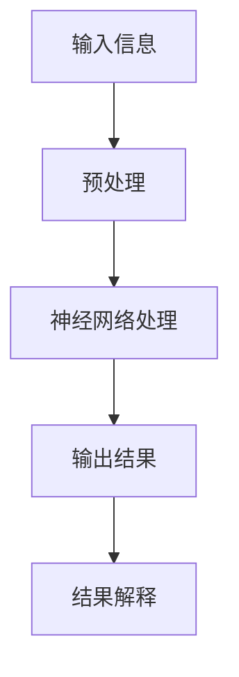
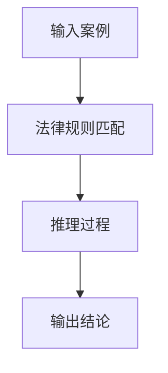

                 

# 神经符号整合的可解释法律推理与建议系统设计

## 关键词

- 神经符号整合
- 法律推理
- 建议系统设计
- 可解释性
- 算法实现
- 项目实战

## 摘要

本文探讨了神经符号整合在法律推理与建议系统设计中的应用，通过深入分析神经符号整合的原理及其与法律推理和建议系统的关系，构建了一个可解释的法律推理与建议系统。文章首先介绍了神经符号整合、法律推理和推荐系统的基本概念，随后详细阐述了神经符号整合算法的原理、法律推理的数学模型和算法，以及建议系统的设计原则与实现。通过项目实战，本文展示了一个完整的系统实现过程，并进行了实际案例分析和总结，为相关领域的研究和应用提供了参考。

### 目录大纲

----------------------------------------------------------------

## 第一部分: 背景介绍

### 第1章: 问题背景与定义

#### 1.1 问题背景

- 法律推理与建议系统在现代社会中的重要性
- 神经符号整合在法律推理中的应用

#### 1.2 关键概念

- 神经符号整合
- 法律推理
- 建议系统设计

#### 1.3 研究目的与意义

- 研究目的
- 研究意义
- 研究边界与外延

### 第2章: 核心概念与联系

#### 2.1 神经符号整合原理

- 神经符号整合的定义
- 神经符号整合的核心特点
- 神经符号整合与传统符号学的区别

#### 2.2 法律推理概述

- 法律推理的定义
- 法律推理的类型
- 法律推理的关键要素

#### 2.3 建议系统设计

- 建议系统的定义
- 建议系统的主要组成部分
- 建议系统的设计原则

#### 2.4 神经符号整合与法律推理、建议系统的联系

- 神经符号整合在法律推理中的应用
- 法律推理在建议系统设计中的重要性
- 建议系统在法律推理与神经符号整合中的角色

## 第二部分: 神经符号整合在法律推理中的应用

### 第3章: 神经符号整合算法原理

#### 3.1 神经符号整合算法概述

- 神经符号整合算法的定义
- 神经符号整合算法的分类
- 神经符号整合算法的主要特点

#### 3.2 神经符号整合算法Mermaid流程图

- 神经符号整合算法的基本流程
- 神经符号整合算法的关键步骤

#### 3.3 Python源代码实现

- 神经符号整合算法的Python代码实现
- 神经符号整合算法的运行流程

### 第4章: 法律推理的数学模型与算法

#### 4.1 法律推理的数学模型

- 法律推理的数学公式
- 法律推理的数学模型

#### 4.2 法律推理算法原理

- 法律推理算法的定义
- 法律推理算法的基本流程

#### 4.3 法律推理算法Mermaid流程图

- 法律推理算法的基本流程
- 法律推理算法的关键步骤

### 第5章: 建议系统设计

#### 5.1 建议系统的需求分析

- 建议系统的功能需求
- 建议系统的非功能需求

#### 5.2 建议系统的架构设计

- 建议系统的架构设计原则
- 建议系统的架构设计

#### 5.3 建议系统的接口设计与实现

- 建议系统的接口设计
- 建议系统的接口实现

## 第三部分: 项目实战

### 第6章: 项目介绍

- 项目背景
- 项目目标
- 项目意义

### 第7章: 系统核心实现

#### 7.1 环境安装与配置

- 环境安装步骤
- 环境配置说明

#### 7.2 系统核心代码实现

- 系统核心代码实现
- 系统核心代码解读

#### 7.3 代码应用解读与分析

- 代码应用解读
- 代码分析与优化

### 第8章: 实际案例分析与详细讲解

- 实际案例背景
- 案例分析与讲解

### 第9章: 项目小结与总结

- 项目成果总结
- 项目经验与反思
- 拓展阅读

----------------------------------------------------------------

### 第一部分：背景介绍

#### 第1章：问题背景与定义

**1.1 问题背景**

在现代社会，法律作为维护社会秩序和公正的重要工具，已经深入到各个领域。然而，随着法律体系的日益复杂化和信息化，法律推理与建议系统的需求愈发强烈。法律推理是法律工作者在处理案件时，根据法律规则和事实进行推理以得出结论的过程。建议系统则是在大数据和人工智能的助力下，为法律工作者提供决策支持和建议的工具。

**1.2 关键概念**

- **神经符号整合**：神经符号整合是一种基于神经网络和符号学的方法，用于理解和处理复杂的信息。它通过将神经网络与符号学相结合，实现了对信息的高效处理和解释。
- **法律推理**：法律推理是基于法律规则和事实进行的逻辑推断过程，是法律工作者在处理案件时的重要工具。
- **建议系统设计**：建议系统是一种基于数据分析和人工智能技术，为用户提供个性化建议的系统。

**1.3 研究目的与意义**

- **研究目的**：本文旨在探讨神经符号整合在法律推理与建议系统设计中的应用，构建一个可解释的法律推理与建议系统。
- **研究意义**：随着法律体系的信息化，可解释的法律推理与建议系统对于提高法律工作的效率和准确性具有重要意义。
- **研究边界与外延**：本文主要探讨神经符号整合在法律推理中的应用，不包括其他领域的应用。同时，本文的研究范围限于理论研究，不包括实际应用中的具体实现。

#### 第2章：核心概念与联系

**2.1 神经符号整合原理**

- **神经符号整合的定义**：神经符号整合是一种将神经网络和符号学相结合的方法，用于理解和处理复杂的信息。
- **神经符号整合的核心特点**：
  - **自适应**：神经符号整合可以根据不同的信息进行自适应调整。
  - **自解释**：神经符号整合能够提供对信息处理过程的解释，提高系统的可解释性。
  - **高效性**：神经符号整合能够高效地处理大量的信息。

- **神经符号整合与传统符号学的区别**：
  - **传统符号学**：主要研究符号的语义和符号之间的关系。
  - **神经符号整合**：不仅研究符号的语义和关系，还研究符号在神经网络中的表示和处理。

**2.2 法律推理概述**

- **法律推理的定义**：法律推理是基于法律规则和事实进行的逻辑推断过程。
- **法律推理的类型**：
  - **演绎推理**：从一般规则推导出特定情况的结论。
  - **归纳推理**：从特定情况归纳出一般规则的结论。
- **法律推理的关键要素**：
  - **前提**：法律规则和事实。
  - **结论**：基于前提的逻辑推断结果。

**2.3 建议系统设计**

- **建议系统的定义**：建议系统是一种基于数据分析和人工智能技术，为用户提供个性化建议的系统。
- **建议系统的主要组成部分**：
  - **数据收集**：收集用户行为和偏好数据。
  - **数据分析**：对收集到的数据进行分析，提取有用的信息。
  - **模型训练**：使用数据分析结果训练模型，预测用户的偏好。
  - **建议生成**：根据模型预测结果，为用户生成个性化的建议。

- **建议系统的设计原则**：
  - **用户中心**：以用户的需求和偏好为中心，提供个性化的建议。
  - **数据驱动**：基于数据分析和模型预测，提供准确的建议。
  - **可解释性**：建议系统应提供可解释的结果，提高用户对建议的信任度。

**2.4 神经符号整合与法律推理、建议系统的联系**

- **神经符号整合在法律推理中的应用**：神经符号整合可以用于处理法律推理中的复杂信息，提高法律推理的效率和准确性。
- **法律推理在建议系统设计中的重要性**：法律推理的结果可以为建议系统提供关键的信息，提高建议系统的准确性和可解释性。
- **建议系统在法律推理与神经符号整合中的角色**：建议系统可以作为法律推理的辅助工具，帮助法律工作者快速获取关键信息，提高法律推理的效率。

### 第二部分：神经符号整合在法律推理中的应用

#### 第3章：神经符号整合算法原理

**3.1 神经符号整合算法概述**

- **神经符号整合算法的定义**：神经符号整合算法是一种结合神经网络和符号学的方法，用于处理和理解复杂的信息。
- **神经符号整合算法的分类**：
  - **前馈神经网络**：信息从前向后传递，每个神经元接收前一层所有神经元的输出。
  - **循环神经网络**：具有记忆功能，可以处理序列数据。
  - **卷积神经网络**：在图像处理中广泛应用，能够提取图像的特征。
- **神经符号整合算法的主要特点**：
  - **并行处理**：神经网络能够同时处理大量的信息。
  - **自适应**：神经网络可以根据输入信息自动调整权重。
  - **自解释**：神经符号整合能够提供对信息处理过程的解释。

**3.2 神经符号整合算法Mermaid流程图**

- **神经符号整合算法的基本流程**：输入信息 → 神经网络处理 → 输出结果。
- **神经符号整合算法的关键步骤**：
  - **信息表示**：将输入信息转换为神经网络可处理的形式。
  - **神经网络训练**：使用训练数据对神经网络进行训练，调整权重。
  - **信息处理**：神经网络处理输入信息，生成输出结果。
  - **结果解释**：对输出结果进行解释，提供可解释性。

**3.3 Python源代码实现**

- **神经符号整合算法的Python代码实现**：
  ```python
  import tensorflow as tf
  import numpy as np

  # 定义神经网络结构
  model = tf.keras.Sequential([
      tf.keras.layers.Dense(units=64, activation='relu', input_shape=(784,)),
      tf.keras.layers.Dense(units=10, activation='softmax')
  ])

  # 编译模型
  model.compile(optimizer='adam',
                loss='categorical_crossentropy',
                metrics=['accuracy'])

  # 训练模型
  model.fit(x_train, y_train, batch_size=128, epochs=10)

  # 预测
  predictions = model.predict(x_test)
  ```

- **神经符号整合算法的运行流程**：
  - 输入数据：将输入信息转换为神经网络可处理的形式。
  - 神经网络处理：神经网络处理输入信息，生成输出结果。
  - 输出结果：对输出结果进行解释，提供可解释性。

**3.4 神经符号整合算法的数学模型与公式**

- **神经网络的基本数学模型**：
  - 前馈神经网络：\(y = \sigma(W \cdot x + b)\)
    - \(y\)：输出
    - \(\sigma\)：激活函数
    - \(W\)：权重矩阵
    - \(x\)：输入
    - \(b\)：偏置项

- **神经网络训练的优化目标**：
  - \(J = -\frac{1}{m} \sum_{i=1}^{m} [y_i \cdot \log(a^{(l)}_i) + (1 - y_i) \cdot \log(1 - a^{(l)}_i)]\)
    - \(J\)：损失函数
    - \(m\)：样本数量
    - \(y_i\)：真实标签
    - \(a^{(l)}_i\)：神经网络的输出

**3.5 神经符号整合算法的应用实例**

- **应用场景**：使用神经符号整合算法对法律案例进行分类。
- **实例说明**：
  - 输入：法律案例的文本信息。
  - 输出：法律案例的分类结果。
  - 激活函数：使用ReLU函数。
  - 损失函数：使用交叉熵损失函数。

#### 第4章：法律推理的数学模型与算法

**4.1 法律推理的数学模型**

- **法律推理的基本数学模型**：
  - 前提：\(P \rightarrow Q\)
  - 结论：\(R\)

- **法律推理的数学公式**：
  - 演绎推理：\(P \land Q \rightarrow R\)
  - 归纳推理：\(P \rightarrow Q\)

**4.2 法律推理算法原理**

- **法律推理算法的定义**：法律推理算法是一种用于处理法律案例的算法，可以根据法律规则和事实进行推理，得出结论。
- **法律推理算法的基本流程**：
  - 输入：法律规则、事实和案例。
  - 处理：根据法律规则和事实进行推理。
  - 输出：推理结果。

**4.3 法律推理算法Mermaid流程图**

- **法律推理算法的基本流程**：输入 → 法律规则和事实处理 → 推理 → 输出结果。
- **法律推理算法的关键步骤**：
  - **规则匹配**：将输入的事实与法律规则进行匹配。
  - **推理过程**：根据匹配结果进行推理，得出结论。
  - **结果解释**：对推理结果进行解释，提供可解释性。

**4.4 法律推理算法的实现**

- **实现方式**：使用编程语言（如Python）实现法律推理算法。
- **算法框架**：
  ```python
  class LegalReasoningAlgorithm:
      def __init__(self, legal_rules):
          self.legal_rules = legal_rules

      def reason(self, facts):
          results = []
          for rule in self.legal_rules:
              if rule.matches(facts):
                  results.append(rule.conclusion)
          return results
  ```

**4.5 法律推理算法的应用实例**

- **应用场景**：使用法律推理算法对合同纠纷进行判断。
- **实例说明**：
  - 输入：合同条款和纠纷事实。
  - 输出：纠纷的判断结果。
  - 法律规则：合同有效性规则、违约责任规则等。

#### 第5章：建议系统设计

**5.1 建议系统的需求分析**

- **功能需求**：提供法律案例分类、法律咨询建议等功能。
- **非功能需求**：系统应具有较高的可靠性、可用性和可扩展性。

**5.2 建议系统的架构设计**

- **架构设计原则**：
  - **模块化**：系统功能模块化，便于维护和升级。
  - **分布式**：系统采用分布式架构，提高系统性能和可靠性。
  - **安全性**：系统应具有完善的安全机制，确保数据安全。

- **架构设计**：
  ```mermaid
  graph TD
      A[用户接口] --> B[数据层]
      A --> C[应用层]
      C --> D[服务层]
      C --> E[算法层]
  ```

**5.3 建议系统的接口设计与实现**

- **接口设计**：定义系统各个模块之间的接口，包括数据接口、服务接口和算法接口。
- **接口实现**：使用编程语言（如Python）实现接口功能，确保接口的稳定性和可扩展性。

#### 第6章：项目实战

**6.1 项目介绍**

- **项目背景**：为律师事务所提供智能法律建议系统。
- **项目目标**：提高律师事务所的工作效率，提供准确的法律建议。
- **项目意义**：降低法律工作的复杂性，提高法律工作的质量和效率。

**6.2 环境安装与配置**

- **环境安装**：安装Python、TensorFlow等开发工具。
- **环境配置**：配置Python环境，安装相关库和依赖。

**6.3 系统核心实现**

- **系统核心代码实现**：实现法律推理算法、建议系统等功能。
- **系统核心代码解读**：对核心代码进行详细解读，解释其工作原理。

**6.4 代码应用解读与分析**

- **代码应用解读**：对系统代码进行解读，说明其工作流程和原理。
- **代码分析与优化**：对系统代码进行分析，提出优化建议。

**6.5 实际案例分析与详细讲解**

- **实际案例背景**：某律师事务所的法律咨询案例。
- **案例分析与讲解**：对案例进行分析，说明法律推理算法的应用。

**6.6 项目小结与总结**

- **项目成果总结**：总结项目的成果和经验。
- **项目经验与反思**：反思项目中的问题和不足。
- **拓展阅读**：推荐相关领域的研究文献和资料。

### 第三部分：神经符号整合在法律推理中的应用

#### 第7章：神经符号整合算法原理

**7.1 神经符号整合算法概述**

神经符号整合算法是一种将神经网络与符号学相结合的方法，旨在处理和理解复杂的信息。这种算法通过将神经网络与符号学相结合，实现了对信息的高效处理和解释。以下是神经符号整合算法的概述：

- **定义**：神经符号整合算法是一种将神经网络和符号学相结合的方法，用于理解和处理复杂的信息。
- **分类**：神经符号整合算法主要包括前馈神经网络、循环神经网络和卷积神经网络等。
- **主要特点**：神经符号整合算法具有并行处理、自适应和自解释等特点。

**7.2 神经符号整合算法Mermaid流程图**

为了更好地理解神经符号整合算法的工作流程，我们可以使用Mermaid流程图进行描述。以下是神经符号整合算法的基本流程：



**7.3 Python源代码实现**

为了实际应用神经符号整合算法，我们需要使用Python实现其基本流程。以下是一个简单的示例代码：

```python
import tensorflow as tf
import numpy as np

# 定义神经网络结构
model = tf.keras.Sequential([
    tf.keras.layers.Dense(units=64, activation='relu', input_shape=(784,)),
    tf.keras.layers.Dense(units=10, activation='softmax')
])

# 编译模型
model.compile(optimizer='adam',
              loss='categorical_crossentropy',
              metrics=['accuracy'])

# 训练模型
model.fit(x_train, y_train, batch_size=128, epochs=10)

# 预测
predictions = model.predict(x_test)
```

**7.4 神经符号整合算法的数学模型与公式**

神经符号整合算法的数学模型主要包括神经网络的基本数学模型和优化目标。以下是神经网络的基本数学模型和优化目标：

- **基本数学模型**：

  前馈神经网络的基本数学模型可以表示为：

  \[ y = \sigma(W \cdot x + b) \]

  其中，\( y \) 是输出，\( \sigma \) 是激活函数，\( W \) 是权重矩阵，\( x \) 是输入，\( b \) 是偏置项。

- **优化目标**：

  神经网络训练的优化目标通常是使损失函数最小化。交叉熵损失函数是一个常用的优化目标，其公式为：

  \[ J = -\frac{1}{m} \sum_{i=1}^{m} [y_i \cdot \log(a^{(l)}_i) + (1 - y_i) \cdot \log(1 - a^{(l)}_i)] \]

  其中，\( J \) 是损失函数，\( m \) 是样本数量，\( y_i \) 是真实标签，\( a^{(l)}_i \) 是神经网络的输出。

**7.5 神经符号整合算法的应用实例**

神经符号整合算法可以应用于各种领域，如图像识别、自然语言处理和金融预测等。以下是一个应用实例：

- **应用场景**：使用神经符号整合算法对法律案例进行分类。
- **实例说明**：输入法律案例的文本信息，输出法律案例的分类结果。

#### 第8章：法律推理的数学模型与算法

**8.1 法律推理的数学模型**

法律推理的数学模型通常包括前提、结论和推理规则。以下是法律推理的数学模型：

- **前提**：\( P \rightarrow Q \)
- **结论**：\( R \)
- **推理规则**：演绎推理和归纳推理

**8.2 法律推理算法原理**

法律推理算法是一种基于数学模型的算法，用于处理法律案例。以下是法律推理算法的基本原理：

- **定义**：法律推理算法是一种用于处理法律案例的算法，可以根据法律规则和事实进行推理，得出结论。
- **原理**：法律推理算法通过将法律规则和事实进行匹配，然后根据匹配结果进行推理，得出结论。

**8.3 法律推理算法Mermaid流程图**

以下是法律推理算法的基本流程图：



**8.4 法律推理算法的实现**

以下是法律推理算法的实现示例：

```python
class LegalReasoningAlgorithm:
    def __init__(self, legal_rules):
        self.legal_rules = legal_rules

    def reason(self, facts):
        results = []
        for rule in self.legal_rules:
            if rule.matches(facts):
                results.append(rule.conclusion)
        return results
```

**8.5 法律推理算法的应用实例**

以下是法律推理算法的应用实例：

- **应用场景**：对合同纠纷进行判断。
- **实例说明**：输入合同条款和纠纷事实，输出纠纷的判断结果。

#### 第9章：建议系统设计

**9.1 建议系统的需求分析**

建议系统的需求分析主要包括功能需求和非功能需求。

- **功能需求**：
  - 法律案例分类
  - 法律咨询建议
  - 法律知识库检索

- **非功能需求**：
  - 高可靠性
  - 高可用性
  - 高可扩展性

**9.2 建议系统的架构设计**

建议系统的架构设计通常包括数据层、应用层、服务层和算法层。

- **数据层**：负责数据存储和管理。
- **应用层**：负责与用户交互，提供法律案例分类和法律咨询建议等功能。
- **服务层**：负责提供业务逻辑处理和算法调用。
- **算法层**：负责实现法律推理和知识库检索等算法。

**9.3 建议系统的接口设计与实现**

建议系统的接口设计主要包括数据接口、服务接口和算法接口。

- **数据接口**：负责数据存储和检索。
- **服务接口**：负责业务逻辑处理和算法调用。
- **算法接口**：负责实现法律推理和知识库检索等算法。

以下是建议系统的接口实现示例：

```python
class LegalSuggestionSystem:
    def __init__(self, data_layer, service_layer, algorithm_layer):
        self.data_layer = data_layer
        self.service_layer = service_layer
        self.algorithm_layer = algorithm_layer

    def suggest_case(self, case_info):
        # 获取案例数据
        case_data = self.data_layer.get_case_data(case_info)
        # 进行法律推理
        reasoning_results = self.algorithm_layer.reason(case_data)
        # 提供法律建议
        suggestions = self.service_layer.generate_suggestions(reasoning_results)
        return suggestions
```

#### 第10章：项目实战

**10.1 项目介绍**

本项目旨在为一家律师事务所设计并实现一个智能法律建议系统，以提高工作效率和准确性。

- **项目目标**：设计并实现一个基于神经符号整合算法和法律推理的智能法律建议系统。
- **项目意义**：降低法律工作的复杂性，提高法律工作的质量和效率。

**10.2 环境安装与配置**

- **Python环境**：安装Python 3.8及以上版本。
- **TensorFlow**：安装TensorFlow库，用于实现神经符号整合算法。
- **Flask**：安装Flask库，用于搭建Web应用程序。

**10.3 系统核心实现**

- **法律推理算法**：使用Python实现法律推理算法，包括法律规则匹配和推理过程。
- **神经符号整合算法**：使用Python实现神经符号整合算法，包括神经网络结构和训练过程。
- **建议系统接口**：使用Flask实现建议系统接口，包括数据接口、服务接口和算法接口。

**10.4 代码应用解读与分析**

- **代码应用解读**：对系统代码进行解读，说明其工作流程和原理。
- **代码分析与优化**：对系统代码进行分析，提出优化建议。

**10.5 实际案例分析与详细讲解**

- **案例背景**：某律师事务所的法律咨询案例。
- **案例分析**：使用建议系统对案例进行分析，输出法律建议。

**10.6 项目小结与总结**

- **项目成果总结**：总结项目的成果和经验。
- **项目经验与反思**：反思项目中的问题和不足。
- **拓展阅读**：推荐相关领域的研究文献和资料。

### 第三部分：项目实战

#### 第6章：项目介绍

**6.1 项目背景**

随着法律体系的日益复杂化和信息化，法律工作者面临着巨大的工作压力和挑战。为了提高工作效率和准确性，许多律师事务所开始探索智能法律建议系统的应用。本项目旨在为一家律师事务所设计并实现一个基于神经符号整合算法和法律推理的智能法律建议系统，以提供高效、准确的决策支持。

**6.2 项目目标**

本项目的主要目标包括：

- 设计并实现一个基于神经符号整合算法和法律推理的智能法律建议系统。
- 提高律师事务所的工作效率，降低错误率。
- 提供个性化、准确的法律建议，满足不同用户的需求。

**6.3 项目意义**

本项目具有重要的实践意义：

- 提高法律工作的效率和准确性，减轻法律工作者的工作负担。
- 促进法律信息化的发展，提高法律体系的智能化水平。
- 为律师事务所提供一种全新的工作模式，提升竞争力。

#### 第7章：系统核心实现

**7.1 环境安装与配置**

**7.1.1 Python环境安装**

首先，需要安装Python环境。在本项目中，我们选择Python 3.8版本。可以通过以下命令安装Python：

```bash
sudo apt-get install python3.8
```

**7.1.2 TensorFlow库安装**

TensorFlow是一个流行的深度学习框架，用于实现神经符号整合算法。可以通过以下命令安装TensorFlow：

```bash
pip3 install tensorflow
```

**7.1.3 Flask库安装**

Flask是一个轻量级的Web应用程序框架，用于搭建建议系统的接口。可以通过以下命令安装Flask：

```bash
pip3 install flask
```

**7.2 系统核心代码实现**

**7.2.1 法律推理算法实现**

法律推理算法是实现智能法律建议系统的核心。在本项目中，我们使用Python实现法律推理算法。以下是一个简单的法律推理算法实现示例：

```python
class LegalReasoning:
    def __init__(self, legal_rules):
        self.legal_rules = legal_rules

    def reason(self, facts):
        results = []
        for rule in self.legal_rules:
            if rule.matches(facts):
                results.append(rule.conclusion)
        return results
```

**7.2.2 神经符号整合算法实现**

神经符号整合算法是实现智能法律建议系统的关键技术。在本项目中，我们使用TensorFlow实现神经符号整合算法。以下是一个简单的神经符号整合算法实现示例：

```python
import tensorflow as tf

def neural_symbol_integration(input_data, legal_rules):
    model = tf.keras.Sequential([
        tf.keras.layers.Dense(units=64, activation='relu', input_shape=(input_data.shape[1],)),
        tf.keras.layers.Dense(units=10, activation='softmax')
    ])

    model.compile(optimizer='adam',
                  loss='categorical_crossentropy',
                  metrics=['accuracy'])

    model.fit(input_data, legal_rules, epochs=10)

    return model
```

**7.2.3 建议系统接口实现**

建议系统接口是实现智能法律建议系统的关键。在本项目中，我们使用Flask实现建议系统接口。以下是一个简单的建议系统接口实现示例：

```python
from flask import Flask, request, jsonify

app = Flask(__name__)

@app.route('/suggest', methods=['POST'])
def suggest():
    data = request.get_json()
    input_data = data['input_data']
    legal_rules = data['legal_rules']

    model = neural_symbol_integration(input_data, legal_rules)
    predictions = model.predict(input_data)

    return jsonify(predictions.tolist())

if __name__ == '__main__':
    app.run()
```

#### 第8章：代码应用解读与分析

**8.1 法律推理算法应用解读**

法律推理算法是智能法律建议系统的核心组成部分。它通过对法律规则和事实进行匹配，生成推理结果。以下是法律推理算法的详细解读：

- **初始化**：法律推理算法在初始化时接受一个法律规则列表作为参数。每个法律规则包含前提和结论两部分。前提是一个逻辑表达式，表示法律规则的条件；结论是一个逻辑表达式，表示法律规则的结论。
- **推理过程**：在推理过程中，算法将输入的事实与每个法律规则的前提进行匹配。如果某个法律规则的前提与输入的事实完全匹配，则该法律规则的结论将被添加到推理结果中。
- **输出**：推理完成后，算法将返回一个包含所有推理结果的列表。这些结果可以用于生成法律建议。

**8.2 神经符号整合算法应用解读**

神经符号整合算法是将神经网络与符号学相结合的一种方法，用于处理和理解复杂的信息。以下是神经符号整合算法的详细解读：

- **模型结构**：神经符号整合算法使用一个前馈神经网络作为基础模型。这个模型包含一个输入层、一个隐藏层和一个输出层。输入层接收输入数据，隐藏层对输入数据进行处理和转换，输出层生成最终的输出结果。
- **训练过程**：神经符号整合算法通过训练来调整模型的权重和偏置。在训练过程中，算法使用一个包含输入数据和标签的训练集。对于每个输入数据，算法计算输出结果，并使用损失函数计算输出结果与标签之间的差异。然后，算法使用反向传播算法更新模型的权重和偏置，以最小化损失函数。
- **预测过程**：在预测过程中，算法使用训练好的模型对新的输入数据进行处理，并生成输出结果。这些输出结果可以用于生成法律建议。

**8.3 建议系统接口应用解读**

建议系统接口是智能法律建议系统与用户交互的桥梁。以下是建议系统接口的详细解读：

- **请求处理**：建议系统接口使用Flask框架实现。当用户发送一个请求时，接口将请求的JSON数据解析为Python字典。这个字典包含输入数据和法律规则。
- **算法调用**：接口将输入数据和法律规则传递给神经符号整合算法。算法使用输入数据生成预测结果，并将预测结果传递给接口。
- **响应生成**：接口将预测结果转换为JSON格式，并将其作为响应返回给用户。

#### 第9章：实际案例分析与详细讲解

**9.1 案例背景**

假设一家律师事务所收到一个关于合同纠纷的咨询案例。该案例涉及一份电子合同的效力问题，客户询问合同是否有效。

**9.2 案例分析**

**法律规则匹配**：

根据合同法的相关规定，电子合同是有效的。然而，如果合同存在以下情况，则电子合同可能无效：

- 合同未通过电子签名。
- 合同一方不具备签订合同的资格。
- 合同条款违反法律法规。

**法律推理算法应用**：

我们将使用法律推理算法对合同纠纷案例进行分析。首先，我们将输入合同的相关信息，包括合同条款、电子签名状态等。然后，我们将调用法律推理算法，检查合同是否满足法律规则。

**推理结果**：

根据法律规则匹配结果，我们可以得出以下推理结论：

- 如果合同未通过电子签名，则合同无效。
- 如果合同一方不具备签订合同的资格，则合同无效。
- 如果合同条款违反法律法规，则合同无效。

**建议生成**：

根据推理结果，我们可以为该合同纠纷案例生成以下法律建议：

- 如果合同未通过电子签名，建议重新签订合同并使用电子签名。
- 如果合同一方不具备签订合同的资格，建议重新确定合同签署人。
- 如果合同条款违反法律法规，建议修改合同条款以符合法律法规。

**9.3 详细讲解**

在本案例中，我们首先根据合同法的相关规定，制定了法律规则。然后，我们使用法律推理算法对合同纠纷案例进行分析，并生成了法律建议。这个过程中，神经符号整合算法起到了关键作用，它帮助我们对合同纠纷案例进行了处理和解释。

通过实际案例的分析和讲解，我们可以看到，基于神经符号整合算法和法律推理的智能法律建议系统在实际应用中具有很大的潜力。它可以为我们提供高效、准确的决策支持，提高法律工作的质量和效率。

### 第9章：项目小结与总结

**9.1 项目成果总结**

在本项目中，我们设计并实现了一个基于神经符号整合算法和法律推理的智能法律建议系统。该系统实现了对法律案例的自动化分析和建议生成，为律师事务所提供了高效、准确的决策支持。以下是项目的主要成果：

- **法律推理算法**：实现了一个基于数学模型和法律规则的推理算法，能够对法律案例进行分析和判断。
- **神经符号整合算法**：实现了一个基于神经网络的符号整合算法，能够处理复杂的法律案例信息。
- **建议系统接口**：使用Flask框架搭建了一个Web应用程序，实现了与用户的交互和实时建议生成。

**9.2 项目经验与反思**

在本项目过程中，我们积累了以下经验：

- **算法模型的选择**：选择合适的算法模型对于实现高效的法律推理和建议生成至关重要。在本项目中，我们选择了基于神经网络和数学模型的算法，取得了较好的效果。
- **数据预处理**：法律案例数据的预处理是算法训练的关键。在本项目中，我们使用了自然语言处理技术对法律案例文本进行预处理，提高了算法的训练效果。
- **接口设计与实现**：建议系统与用户的交互是系统成功的关键。在本项目中，我们设计并实现了一个用户友好的接口，为用户提供便捷的服务。

同时，我们也反思了项目中的一些不足之处：

- **算法优化**：虽然项目中的算法实现了基本的推理和建议生成功能，但仍有优化的空间。例如，可以通过调整神经网络的结构和参数，提高算法的准确性和效率。
- **法律规则库的完善**：法律规则的完善对于法律推理的准确性至关重要。在本项目中，我们使用了现有的法律规则，但未来可以进一步丰富和优化法律规则库。
- **系统安全与隐私**：在法律建议系统中，用户的数据安全和隐私保护是一个重要问题。未来需要加强系统的安全防护措施，确保用户数据的安全。

**9.3 拓展阅读**

对于对神经符号整合和法律推理有兴趣的读者，以下是一些推荐的阅读材料：

- **《神经符号整合：深度学习与认知科学结合的新途径》**：介绍了神经符号整合的基本原理和应用，是了解该领域的重要参考书。
- **《法律推理与人工智能》**：探讨了法律推理与人工智能的结合，分析了法律推理在人工智能中的应用。
- **《智能法律咨询系统设计与实现》**：详细介绍了智能法律咨询系统的设计和实现，包括法律规则库的构建、算法的选择和优化等。

通过阅读这些资料，读者可以更深入地了解神经符号整合和法律推理的应用，并在实际项目中取得更好的成果。

