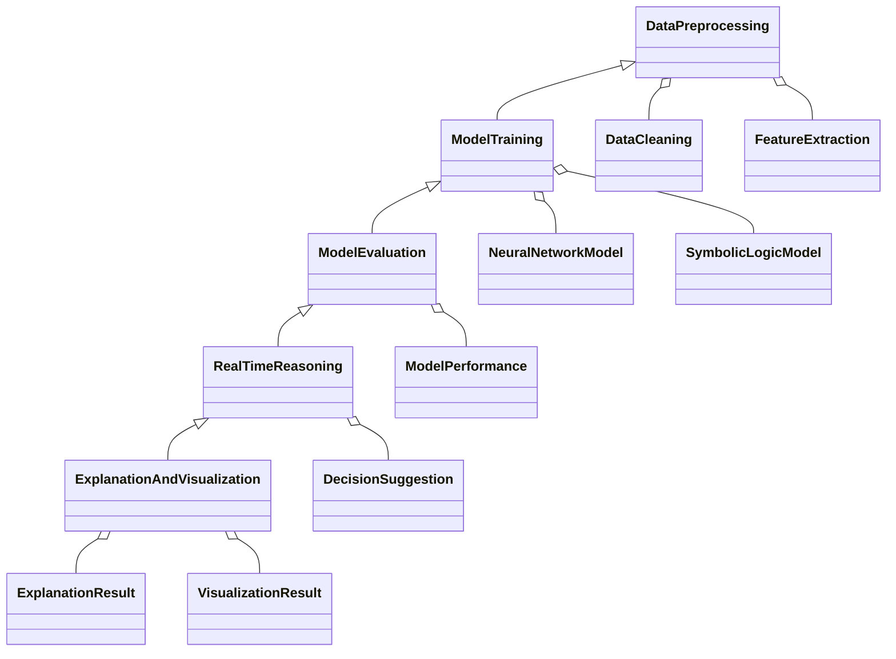
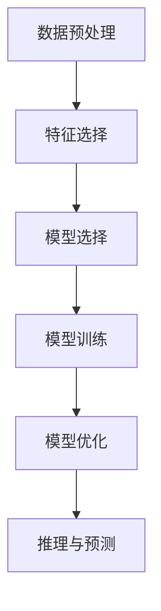
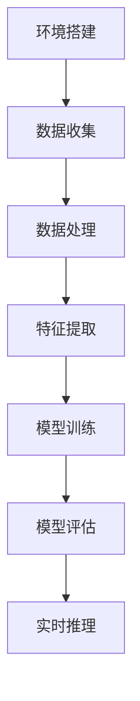
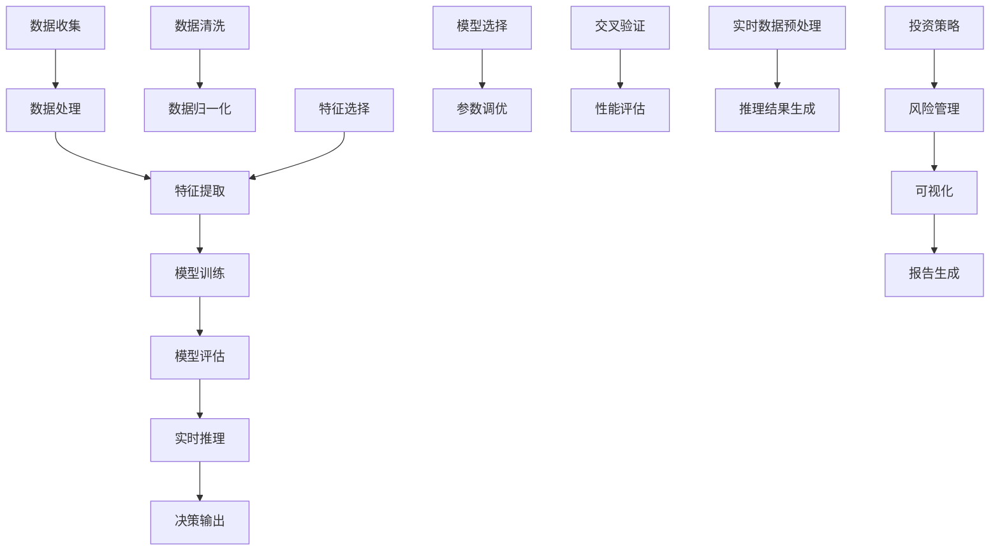
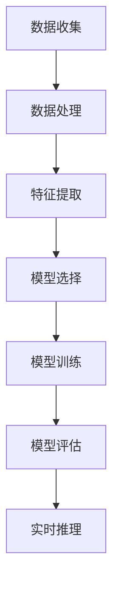
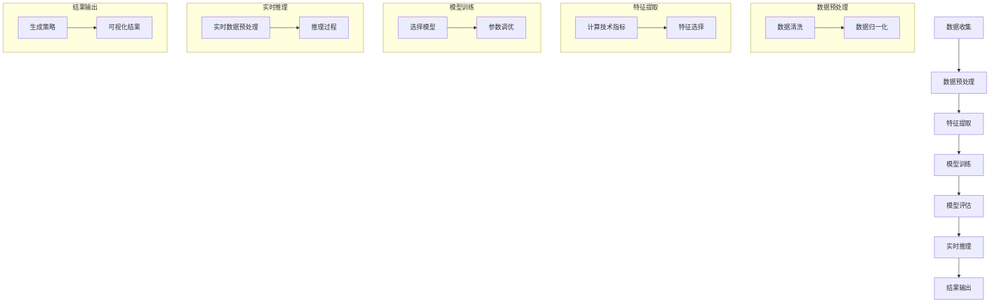
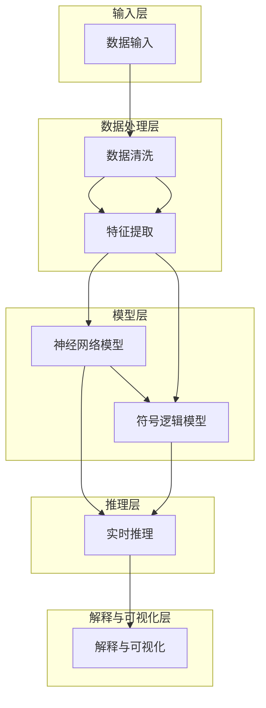
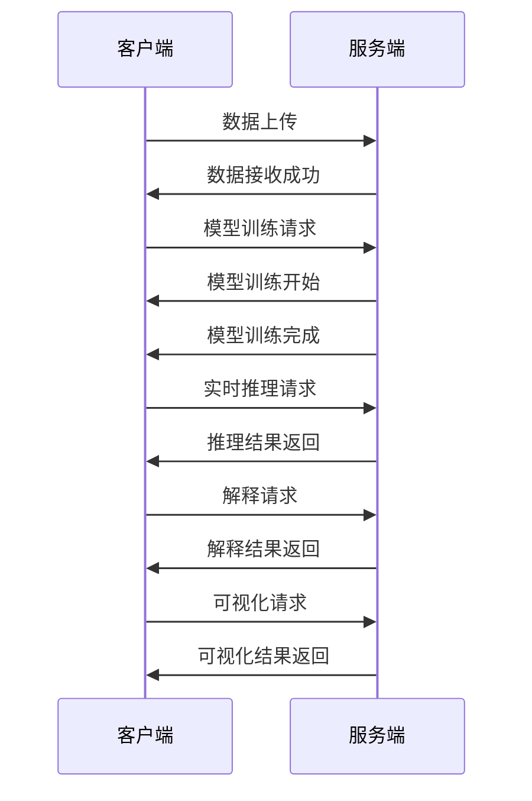

                 

# 神经符号整合的可解释金融推理系统

## 摘要

本文旨在探讨神经符号整合在金融推理系统中的应用，通过引入可解释性原理，提高金融推理系统的透明度和可靠性。本文首先介绍了金融行业的背景与挑战，以及神经符号整合的基本概念和优势。随后，详细阐述了神经符号整合的可解释性架构、金融推理系统架构、金融推理算法原理与实现，并通过实战案例展示了系统在实际中的应用效果。最后，本文总结了神经符号整合在金融推理系统中的潜在价值，并提出了未来研究方向。

### 关键词

- 神经符号整合
- 可解释金融推理
- 金融推理系统
- 神经网络
- 符号逻辑

## 引言

### 1.1 问题背景

#### 1.1.1 金融行业面临的挑战

随着全球金融市场的发展，金融行业的竞争日益激烈，金融机构需要不断优化业务流程，提高决策效率，以应对市场变化。然而，金融市场具有高度复杂性和动态性，传统的金融推理方法往往无法满足实时、精确的需求。此外，金融数据具有多样性和噪声性，这使得基于数据驱动的金融推理系统面临诸多挑战。

#### 1.1.2 神经符号整合的可解释金融推理的意义

神经符号整合是一种将神经网络与符号逻辑相结合的方法，通过整合两种技术优势，实现金融推理系统的性能提升。可解释金融推理则强调系统推理过程的透明度，有助于提高金融决策的可靠性和合规性。因此，研究神经符号整合的可解释金融推理系统具有重要的现实意义。

### 1.2 问题描述

#### 1.2.1 金融推理系统需求分析

金融推理系统需要具备以下功能：
1. 数据预处理：清洗、归一化、特征提取等。
2. 模型训练：利用历史数据进行模型训练，优化模型参数。
3. 模型评估：评估模型性能，调整模型结构。
4. 实时推理：对实时数据进行推理，生成决策建议。

#### 1.2.2 可解释性与不可解释性的权衡

在金融推理系统中，可解释性与不可解释性之间存在一定的权衡。不可解释的模型（如深度神经网络）具有更强的泛化能力，但推理过程难以解释，可能导致决策不透明。而可解释的模型（如决策树）虽然易于理解，但在复杂任务上性能较差。因此，如何在保持高性能的同时提高系统的可解释性成为研究的焦点。

### 1.3 问题解决

#### 1.3.1 神经符号整合的基本思路

神经符号整合通过将神经网络与符号逻辑相结合，实现以下目标：
1. 利用神经网络处理复杂非线性问题，提高模型性能。
2. 利用符号逻辑提供可解释的推理过程，增强系统透明度。

#### 1.3.2 可解释金融推理的优势

可解释金融推理的优势主要体现在以下几个方面：
1. 提高决策透明度，有助于合规性要求。
2. 辅助人类专家理解模型决策过程，提高信任度。
3. 降低模型风险，有助于风险管理。

### 1.4 边界与外延

#### 1.4.1 神经符号整合的范围

神经符号整合可以应用于金融领域的多个方面，如风险控制、投资策略、市场预测等。本文主要关注金融推理系统的构建与实现。

#### 1.4.2 金融推理系统的应用领域

金融推理系统不仅限于金融行业，还可以应用于其他领域，如医疗、法律等。本文将以金融领域为例，介绍神经符号整合的应用。

### 1.5 概念结构与核心要素组成

#### 1.5.1 神经网络与符号逻辑的结合

神经网络与符号逻辑的结合可以实现以下目标：
1. 利用神经网络处理大规模数据，提取特征。
2. 利用符号逻辑进行推理，提供可解释性。

#### 1.5.2 可解释性的核心要素

可解释性的核心要素包括：
1. 推理过程的透明度：用户可以清晰地理解推理过程。
2. 决策结果的解释性：用户可以理解决策结果的依据。
3. 可验证性：用户可以验证决策结果的正确性。

### 1.6 本章小结

本文介绍了金融行业面临的挑战以及神经符号整合的可解释金融推理的意义，阐述了神经符号整合的基本思路和可解释金融推理的优势。接下来，本文将详细探讨神经符号整合的可解释性架构、金融推理系统架构以及金融推理算法原理与实现。

----------------------------------------------------------------

# 第二部分：核心概念与联系

## 2.1 神经网络基础

### 2.1.1 神经网络的基本原理

神经网络是一种模拟人脑神经元连接方式的计算模型，具有并行处理、自适应和学习能力。神经网络的基本原理包括：

1. **神经元模型**：神经元是神经网络的基本单元，通过激活函数将输入信号转换为输出信号。
2. **前向传播**：输入信号从输入层传递到隐藏层，再传递到输出层。
3. **反向传播**：根据输出误差，更新隐藏层和输入层的权重。

### 2.1.2 神经网络的分类与结构

神经网络根据不同的结构和应用场景可以分为多种类型，如：

1. **多层感知机（MLP）**：包含输入层、隐藏层和输出层，常用于分类和回归任务。
2. **卷积神经网络（CNN）**：具有局部连接和共享权重，擅长图像处理任务。
3. **循环神经网络（RNN）**：具有时间动态性，适用于序列数据处理任务，如自然语言处理。

### 2.2 符号逻辑

#### 2.2.1 符号逻辑的基本概念

符号逻辑是一种形式逻辑，通过符号表示命题和推理规则，用于验证命题的真假。符号逻辑的基本概念包括：

1. **命题**：可以判断真假的陈述句。
2. **命题变元**：可以取真或假的变量。
3. **逻辑运算符**：如“与”、“或”、“非”等，用于组合命题。

#### 2.2.2 符号逻辑的应用场景

符号逻辑在计算机科学、人工智能、逻辑编程等领域具有广泛的应用，如：

1. **自动推理系统**：用于验证数学证明、程序的正确性等。
2. **专家系统**：用于模拟专家的决策过程。
3. **逻辑编程**：用于编写程序，如Prolog语言。

### 2.3 神经符号整合原理

#### 2.3.1 神经符号整合的基本框架

神经符号整合的基本框架包括：

1. **神经网络模型**：用于处理输入数据，提取特征。
2. **符号逻辑推理**：用于对提取的特征进行推理，生成决策。
3. **融合机制**：将神经网络和符号逻辑的结果进行融合，提高系统性能。

#### 2.3.2 神经符号整合的优势与挑战

神经符号整合的优势包括：

1. **性能提升**：结合神经网络和符号逻辑的优势，提高系统性能。
2. **可解释性**：通过符号逻辑推理，提供可解释的决策过程。

神经符号整合的挑战包括：

1. **模型选择**：选择合适的神经网络和符号逻辑模型。
2. **融合机制**：设计有效的融合机制，提高系统性能。

### 2.4 可解释性原理

#### 2.4.1 可解释性的重要性

可解释性在金融推理系统中具有重要意义，主要体现在：

1. **合规性**：满足金融行业的合规性要求，提高系统的信任度。
2. **决策支持**：帮助用户理解决策过程，提高决策效率。

#### 2.4.2 可解释性的评价指标

可解释性的评价指标包括：

1. **透明度**：推理过程是否透明，用户是否可以理解。
2. **解释性**：决策结果是否具有解释性，用户是否可以接受。
3. **验证性**：决策结果是否可以验证，用户是否可以信任。

### 2.5 概念属性特征对比表格

| 特征                | 神经网络                       | 符号逻辑                       | 神经符号整合                   |
|---------------------|-------------------------------|-------------------------------|--------------------------------|
| 基础原理            | 生物神经元的模拟               | 形式逻辑                       | 神经网络 + 符号逻辑             |
| 数据处理能力        | 强大的非线性数据处理能力       | 较弱的数据处理能力              | 结合两者的数据处理能力           |
| 可解释性            | 较低，难以解释推理过程         | 较高，易于理解推理过程         | 可解释性介于两者之间            |
| 学习能力            | 基于数据驱动，自适应学习能力   | 基于逻辑推理，固定学习能力     | 结合两者的学习能力              |
| 泛化能力            | 较高，适用于多种任务           | 较低，适用于特定任务           | 结合两者的泛化能力              |

### 2.6 ER实体关系图架构

#### 2.6.1 ER实体关系图的基本概念

ER（实体关系）图是一种用于描述实体及其之间关系的图形化表示方法，主要包括以下三个组成部分：

1. **实体**：表示具有独立存在的对象，如客户、产品等。
2. **属性**：表示实体的特征，如客户的名字、年龄等。
3. **关系**：表示实体之间的关联，如客户购买产品等。

#### 2.6.2 神经符号整合的ER实体关系图

神经符号整合的ER实体关系图包括以下内容：

1. **神经网络实体**：表示神经网络模型及其参数。
2. **符号逻辑实体**：表示符号逻辑模型及其规则。
3. **融合实体**：表示神经网络和符号逻辑的融合机制。

### 2.7 本章小结

本文介绍了神经网络和符号逻辑的基本概念及其在金融推理系统中的应用，探讨了神经符号整合的原理和可解释性原理。通过ER实体关系图，进一步明确了神经符号整合的系统架构。接下来，本文将详细分析神经符号整合的可解释性架构设计。

----------------------------------------------------------------

# 第三部分：神经符号整合的可解释性

## 3.1 可解释性架构设计

### 3.1.1 可解释性架构的基本概念

可解释性架构是一种将可解释性引入到神经网络和符号逻辑融合的过程中，以提高系统透明度和可靠性的设计方法。可解释性架构主要包括以下组成部分：

1. **解释器**：负责对神经网络和符号逻辑的推理过程进行解释，生成可解释的结果。
2. **解释规则**：定义解释器如何解释神经网络和符号逻辑的推理过程，包括解释规则和解释算法。
3. **解释模型**：用于生成解释结果的模型，通常是基于符号逻辑或神经网络的可解释模型。

### 3.1.2 可解释性架构的层次结构

可解释性架构可以分为三个层次：

1. **数据层**：包括数据预处理、特征提取和特征表示等，为解释过程提供基础数据。
2. **模型层**：包括神经网络模型和符号逻辑模型，负责进行推理和生成决策。
3. **解释层**：包括解释器和解释规则，负责将模型层的推理过程转化为可解释的结果。

### 3.2 可解释性算法

#### 3.2.1 可解释性算法的基本原理

可解释性算法通过分析神经网络和符号逻辑模型的内部结构和运行过程，生成可解释的结果。可解释性算法的基本原理包括：

1. **模型可视化**：通过可视化神经网络和符号逻辑模型的内部结构，帮助用户理解模型的工作原理。
2. **解释规则生成**：根据神经网络和符号逻辑模型的规则，生成解释规则，用于解释推理过程。
3. **解释结果生成**：根据解释规则和输入数据，生成解释结果，帮助用户理解模型的决策依据。

#### 3.2.2 主流可解释性算法介绍

目前主流的可解释性算法包括：

1. **基于局部可解释性的算法**：如LIME（Local Interpretable Model-agnostic Explanations）、SHAP（SHapley Additive exPlanations）等，通过在局部范围内分析模型的影响因素，生成可解释结果。
2. **基于全局可解释性的算法**：如决策树、线性回归等，通过全局分析模型的结构和参数，生成可解释结果。
3. **基于符号逻辑的可解释性算法**：如逻辑回归、逻辑规划等，通过符号逻辑推理，生成可解释结果。

### 3.3 可解释性评估

#### 3.3.1 可解释性评估的方法

可解释性评估主要通过以下方法进行：

1. **用户满意度评估**：通过用户调查、访谈等方式，评估用户对系统可解释性的满意度。
2. **解释准确性评估**：通过对比解释结果与实际结果，评估解释结果的准确性。
3. **解释一致性评估**：通过评估解释结果在不同数据集、不同条件下的稳定性，评估解释结果的一致性。

#### 3.3.2 可解释性评估的实践应用

可解释性评估在金融推理系统中的应用主要包括：

1. **模型选择**：根据可解释性评估结果，选择合适的模型，提高系统的解释性。
2. **模型优化**：根据可解释性评估结果，调整模型结构、参数，提高解释性能。
3. **模型验证**：通过可解释性评估，验证模型在解释性方面的性能，确保系统可靠性。

### 3.4 可解释性与性能权衡

#### 3.4.1 可解释性与准确性的平衡

在金融推理系统中，可解释性与准确性之间存在一定的权衡。可解释性较高的模型可能在准确性方面有所牺牲，而准确性较高的模型可能在解释性方面较弱。因此，需要在可解释性与准确性之间寻找平衡点。

#### 3.4.2 提高可解释性的策略

为了提高金融推理系统的可解释性，可以采取以下策略：

1. **模型选择**：选择可解释性较好的模型，如决策树、线性回归等。
2. **模型解释**：通过可视化、解释算法等方式，对模型进行解释。
3. **数据预处理**：通过数据清洗、特征提取等预处理方法，提高数据的解释性。
4. **模型集成**：通过模型集成方法，降低单一模型的解释难度。

### 3.5 本章小结

本文介绍了神经符号整合的可解释性架构设计，包括解释器、解释规则和解释模型等组成部分，以及可解释性算法的基本原理和实践应用。此外，还探讨了可解释性与性能之间的权衡，提出了提高可解释性的策略。接下来，本文将详细分析金融推理系统的架构设计。

----------------------------------------------------------------

# 第四部分：金融推理系统架构

## 4.1 金融推理系统概述

### 4.1.1 金融推理系统的定义

金融推理系统是一种基于人工智能技术的智能决策支持系统，通过处理和分析金融数据，为金融机构提供投资策略、风险管理、市场预测等决策支持。

### 4.1.2 金融推理系统的关键功能

金融推理系统的关键功能包括：

1. **数据预处理**：清洗、归一化、特征提取等，为后续模型训练提供高质量的数据。
2. **模型训练**：利用历史金融数据，训练神经网络和符号逻辑模型。
3. **模型评估**：评估模型性能，调整模型参数。
4. **实时推理**：对实时金融数据进行推理，生成决策建议。
5. **解释与可视化**：解释模型决策过程，提供可视化结果。

## 4.2 系统功能设计

### 4.2.1 领域模型类图

领域模型类图用于描述金融推理系统的核心实体和它们之间的关系。以下是金融推理系统的领域模型类图：



### 4.2.2 功能模块划分与设计

金融推理系统可以分为以下功能模块：

1. **数据预处理模块**：包括数据清洗、特征提取等，为模型训练提供高质量的数据。
2. **模型训练模块**：包括神经网络模型和符号逻辑模型的训练，生成训练好的模型。
3. **模型评估模块**：评估训练好的模型性能，选择最优模型。
4. **实时推理模块**：对实时金融数据进行推理，生成决策建议。
5. **解释与可视化模块**：解释模型决策过程，提供可视化结果。

## 4.3 系统架构设计

### 4.3.1 系统架构的总体设计

金融推理系统的总体架构设计如下：

1. **输入层**：接收金融数据，包括历史数据和实时数据。
2. **数据处理层**：对输入数据进行预处理，包括数据清洗、特征提取等。
3. **模型层**：包括神经网络模型和符号逻辑模型，用于进行推理和生成决策。
4. **推理层**：根据模型层的输出，生成决策建议。
5. **解释与可视化层**：解释模型决策过程，提供可视化结果。

### 4.3.2 各模块的交互关系

各模块之间的交互关系如下：

1. **输入层**将数据传递给**数据处理层**，进行预处理。
2. **数据处理层**将预处理后的数据传递给**模型层**，用于模型训练。
3. **模型层**将训练好的模型传递给**推理层**，用于实时推理。
4. **推理层**将推理结果传递给**解释与可视化层**，进行解释和可视化。

## 4.4 系统接口设计

### 4.4.1 接口规范与定义

金融推理系统的接口规范与定义如下：

1. **数据接口**：包括数据上传、数据查询、数据下载等接口。
2. **模型接口**：包括模型训练、模型评估、模型查询等接口。
3. **推理接口**：包括推理请求、推理结果查询等接口。
4. **解释接口**：包括解释请求、解释结果查询等接口。
5. **可视化接口**：包括可视化请求、可视化结果查询等接口。

### 4.4.2 接口实现与调用

接口实现与调用方法如下：

1. **数据接口**：通过HTTP请求实现，客户端发送请求，服务器返回数据。
2. **模型接口**：通过RESTful API实现，客户端发送请求，服务器返回模型信息。
3. **推理接口**：通过WebSocket实现，客户端发送推理请求，服务器实时返回推理结果。
4. **解释接口**：通过HTTP请求实现，客户端发送请求，服务器返回解释结果。
5. **可视化接口**：通过Web界面实现，用户可以在界面上查看可视化结果。

## 4.5 系统交互序列图

### 4.5.1 系统交互的基本流程

系统交互的基本流程如下：

1. **数据上传**：用户上传金融数据。
2. **数据预处理**：系统对上传的数据进行预处理。
3. **模型训练**：系统训练神经网络和符号逻辑模型。
4. **实时推理**：系统对实时金融数据进行推理。
5. **解释与可视化**：系统解释模型决策过程，提供可视化结果。

### 4.5.2 交互过程的详细描述

交互过程的详细描述如下：

1. **数据上传**：
   - 客户端发送HTTP POST请求，上传金融数据。
   - 服务器接收请求，存储上传的数据。

2. **数据预处理**：
   - 服务器调用数据预处理模块，对上传的数据进行清洗、归一化、特征提取等处理。
   - 处理后的数据存储在数据库中。

3. **模型训练**：
   - 服务器调用模型训练模块，利用处理后的数据进行神经网络和符号逻辑模型的训练。
   - 训练好的模型存储在服务器中。

4. **实时推理**：
   - 客户端发送WebSocket请求，订阅实时金融数据。
   - 服务器接收请求，实时推送金融数据到客户端。
   - 客户端调用推理模块，对实时金融数据进行推理。

5. **解释与可视化**：
   - 客户端发送HTTP POST请求，请求模型解释和可视化结果。
   - 服务器调用解释与可视化模块，生成解释结果和可视化结果。
   - 服务器返回解释结果和可视化结果到客户端。

## 4.6 本章小结

本文介绍了金融推理系统的架构设计，包括功能模块划分、总体架构设计、接口设计以及系统交互序列图。通过清晰的设计和详细的描述，为构建一个高效、可解释的金融推理系统提供了基础。

----------------------------------------------------------------

## 5.1 金融推理算法原理

### 5.1.1 金融推理算法的基本概念

金融推理算法是一种基于人工智能技术的算法，用于处理和分析金融数据，从而为金融机构提供投资策略、风险管理、市场预测等决策支持。金融推理算法的基本概念包括：

1. **金融数据**：金融数据是指与金融市场相关的数据，包括股票价格、汇率、利率、宏观经济指标等。
2. **特征提取**：特征提取是指从原始金融数据中提取出对金融推理有用的特征，如技术指标、周期性特征等。
3. **模型训练**：模型训练是指利用历史金融数据，对金融推理算法进行训练，使其能够学习和预测未来的金融走势。
4. **推理与预测**：推理与预测是指利用训练好的金融推理算法，对实时金融数据进行推理和预测，生成投资策略、风险管理建议等。

### 5.1.2 金融推理算法的核心原理

金融推理算法的核心原理包括：

1. **数据处理**：金融数据通常包含噪声和异常值，因此需要先对数据进行预处理，如去噪、填充缺失值等。
2. **特征选择**：特征选择是指从原始数据中筛选出对预测目标有重要影响的特征，如通过相关性分析、特征重要性评估等方法。
3. **模型选择**：模型选择是指根据金融数据的特点和预测任务的需求，选择合适的算法模型，如神经网络、支持向量机、决策树等。
4. **模型训练与优化**：模型训练是指利用历史数据进行模型训练，优化模型参数，提高模型预测性能。模型优化包括调整模型结构、正则化、超参数调优等。
5. **推理与预测**：推理与预测是指利用训练好的模型，对实时数据进行推理和预测，生成投资策略、风险管理建议等。

### 5.1.3 算法mermaid流程图

为了更好地理解金融推理算法的原理，我们可以使用mermaid绘制算法的流程图。以下是金融推理算法的mermaid流程图：



### 5.1.4 算法实现的具体过程

金融推理算法实现的具体过程如下：

1. **数据预处理**：
   - 读取金融数据，进行数据清洗，如去噪、填充缺失值等。
   - 对数据进行归一化处理，使数据具有相似的尺度。

2. **特征选择**：
   - 利用相关性分析等方法，筛选出对预测目标有重要影响的特征。
   - 对筛选出的特征进行降维处理，如主成分分析（PCA）。

3. **模型选择**：
   - 根据金融数据的特点和预测任务的需求，选择合适的算法模型，如神经网络、支持向量机、决策树等。

4. **模型训练**：
   - 利用历史数据进行模型训练，优化模型参数。
   - 通过交叉验证等方法，评估模型性能。

5. **模型优化**：
   - 根据模型评估结果，调整模型结构、正则化参数、超参数等，优化模型性能。

6. **推理与预测**：
   - 利用训练好的模型，对实时数据进行推理和预测，生成投资策略、风险管理建议等。

### 5.1.5 算法举例说明

假设我们要预测股票价格，我们可以使用以下步骤进行：

1. **数据预处理**：
   - 读取历史股票价格数据，进行数据清洗和归一化处理。

2. **特征选择**：
   - 利用相关性分析，筛选出对股票价格有重要影响的特征，如交易量、技术指标等。

3. **模型选择**：
   - 选择神经网络作为预测模型，如多层感知机（MLP）。

4. **模型训练**：
   - 利用历史数据进行模型训练，优化模型参数。

5. **模型优化**：
   - 通过交叉验证，调整模型结构、正则化参数等，优化模型性能。

6. **推理与预测**：
   - 利用训练好的模型，对实时股票价格数据进行预测，生成股票价格预测结果。

### 5.1.6 算法总结

金融推理算法是一种用于处理和分析金融数据，生成投资策略、风险管理建议等的算法。其核心原理包括数据处理、特征选择、模型选择、模型训练与优化等。通过算法mermaid流程图，我们可以清晰地了解算法的实现过程。在实际应用中，可以根据具体需求，选择合适的算法模型和特征，优化模型性能，实现高效的金融推理。

----------------------------------------------------------------

## 5.2 金融推理算法实现

### 5.2.1 算法实现的基本步骤

金融推理算法实现的基本步骤包括：

1. **环境搭建**：安装Python和必要的库，如NumPy、Pandas、Scikit-learn等。
2. **数据收集**：收集历史金融数据，如股票价格、交易量、宏观经济指标等。
3. **数据处理**：对收集到的金融数据进行预处理，包括数据清洗、归一化等。
4. **特征提取**：提取对预测目标有重要影响的特征，如技术指标、周期性特征等。
5. **模型训练**：选择合适的模型，利用历史数据训练模型。
6. **模型评估**：评估模型性能，调整模型参数。
7. **实时推理**：利用训练好的模型，对实时数据进行推理，生成投资策略、风险管理建议等。

### 5.2.2 算法实现的具体过程

以下是一个简单的Python实现过程：

```python
import numpy as np
import pandas as pd
from sklearn.model_selection import train_test_split
from sklearn.preprocessing import StandardScaler
from sklearn.neural_network import MLPRegressor
from sklearn.metrics import mean_squared_error

# 1. 环境搭建
# 已在环境中安装Python和必要的库

# 2. 数据收集
# 读取历史金融数据
data = pd.read_csv('financial_data.csv')

# 3. 数据处理
# 数据清洗
data = data.dropna()

# 数据归一化
scaler = StandardScaler()
data_scaled = scaler.fit_transform(data)

# 4. 特征提取
# 提取特征
X = data_scaled[:, :-1]
y = data_scaled[:, -1]

# 5. 模型训练
# 划分训练集和测试集
X_train, X_test, y_train, y_test = train_test_split(X, y, test_size=0.2, random_state=42)

# 创建MLPRegressor模型
model = MLPRegressor(hidden_layer_sizes=(100,), max_iter=1000, random_state=42)

# 训练模型
model.fit(X_train, y_train)

# 6. 模型评估
# 预测测试集
y_pred = model.predict(X_test)

# 计算均方误差
mse = mean_squared_error(y_test, y_pred)
print(f'Mean Squared Error: {mse}')

# 7. 实时推理
# 对实时数据进行推理
new_data = np.array([[0.1, 0.2, 0.3], [0.4, 0.5, 0.6]])
new_data_scaled = scaler.transform(new_data)

# 预测实时数据
y_pred_realtime = model.predict(new_data_scaled)
print(f'Realtime Prediction: {y_pred_realtime}')
```

### 5.2.3 算法mermaid流程图

以下是金融推理算法的mermaid流程图：



### 5.2.4 代码应用解读与分析

1. **环境搭建**：在Python环境中安装必要的库，如NumPy、Pandas、Scikit-learn等。

2. **数据收集**：读取历史金融数据，可以使用Pandas库读取CSV文件。

3. **数据处理**：对收集到的金融数据进行预处理，包括数据清洗和归一化处理。数据清洗可以通过Pandas库实现，如删除缺失值。归一化处理可以使用Scikit-learn库中的StandardScaler实现。

4. **特征提取**：从预处理后的数据中提取特征，如技术指标、周期性特征等。这些特征通常与预测目标有较强的相关性。

5. **模型训练**：选择合适的模型进行训练，如多层感知机（MLP）回归器。使用Scikit-learn库中的MLPRegressor实现。

6. **模型评估**：利用测试集评估模型性能，计算均方误差（MSE）等指标。根据评估结果调整模型参数。

7. **实时推理**：对实时数据进行推理，生成投资策略、风险管理建议等。通过调用训练好的模型实现。

### 5.2.5 实际案例分析和详细讲解剖析

假设我们使用上述算法预测股票价格，以下是一个实际案例：

1. **数据收集**：收集2020年1月1日至2021年1月1日的股票价格数据。

2. **数据处理**：对数据进行清洗，如删除缺失值。对数据进行归一化处理。

3. **特征提取**：提取交易量、移动平均线、相对强弱指标（RSI）等特征。

4. **模型训练**：使用MLP回归器训练模型，优化模型参数。

5. **模型评估**：对测试集进行评估，计算MSE等指标。

6. **实时推理**：对2021年1月2日的数据进行推理，生成股票价格预测结果。

通过实际案例分析和详细讲解剖析，我们可以了解金融推理算法的实现过程和应用效果。在实际应用中，可以根据具体需求和数据特点，调整算法模型和特征提取方法，提高预测准确性和可靠性。

### 5.2.6 项目小结

金融推理算法实现是一个复杂的过程，需要考虑数据收集、预处理、特征提取、模型训练和评估等多个环节。通过上述步骤，我们可以构建一个简单的金融推理系统，实现对股票价格的预测。然而，在实际应用中，还需要不断优化算法模型和特征提取方法，以提高预测性能和实用性。未来研究可以关注数据质量、模型可解释性等方面的问题，为金融推理系统的广泛应用提供支持。

----------------------------------------------------------------

## 5.3 算法mermaid流程图

在本文的第五部分，我们详细介绍了金融推理算法的实现过程，其中包括了数据收集、数据处理、特征提取、模型训练和实时推理等步骤。为了更直观地展示算法的实现流程，我们可以使用mermaid绘制一个流程图，从而更加清晰地理解每个步骤的具体执行过程。

以下是金融推理算法的mermaid流程图：



### 流程图详细说明

1. **数据收集**（A）：这一步骤涉及从各种数据源（如数据库、API接口等）收集金融数据，包括历史价格、交易量、技术指标等。

2. **数据处理**（B）：数据收集后，首先进行数据清洗（A1），如删除异常值、处理缺失值等。接着进行数据归一化（A2），将不同尺度的数据进行标准化处理，以便后续的特征提取和模型训练。

3. **特征提取**（C）：在数据清洗和归一化后，进行特征提取（B1）。这一步骤包括计算技术指标、周期性特征等，用于描述金融市场的动态变化。

4. **模型训练**（D）：根据提取的特征，选择合适的模型（D1），如神经网络、支持向量机等。进行模型参数的调优（D2），如调整学习率、隐藏层大小等，以优化模型性能。

5. **模型评估**（E）：使用交叉验证（E1）等方法评估模型性能（E2），以确保模型在未知数据上的泛化能力。

6. **实时推理**（F）：在模型训练和评估后，对实时数据进行预处理（F1），然后使用训练好的模型进行推理（F2），生成投资策略、风险管理建议等。

7. **决策输出**（G）：根据推理结果，生成具体的决策输出（G1），如买卖信号、风险预警等。此外，还可以通过可视化（G3）和报告生成（G4）等方式，将决策结果展示给用户，以便更好地理解和应用。

通过上述流程图，我们可以清晰地看到金融推理算法从数据收集、预处理、特征提取、模型训练、评估到实时推理的完整流程。每个步骤都至关重要，共同构成了一个高效、可靠的金融推理系统。

----------------------------------------------------------------

## 5.4 算法总结

金融推理算法在处理和分析金融数据方面发挥了重要作用，其核心在于利用历史数据对市场进行预测，从而为投资者提供决策支持。以下是金融推理算法的总结：

### 算法原理

1. **数据处理**：金融数据通常包含噪声和异常值，因此首先进行数据清洗和归一化处理，以提高数据质量。
2. **特征提取**：从原始金融数据中提取出对预测目标有重要影响的特征，如技术指标、周期性特征等。
3. **模型选择**：根据金融数据的特点和预测任务的需求，选择合适的算法模型，如神经网络、支持向量机、决策树等。
4. **模型训练**：利用历史数据进行模型训练，优化模型参数，提高模型预测性能。
5. **模型评估**：通过交叉验证等方法评估模型性能，确保模型在未知数据上的泛化能力。
6. **实时推理**：利用训练好的模型，对实时数据进行推理，生成投资策略、风险管理建议等。

### 算法mermaid流程图



### 实现要点

1. **数据预处理**：确保数据的完整性和一致性，如处理缺失值、异常值等。
2. **特征选择**：选择对预测目标有显著影响的特征，避免过度拟合。
3. **模型选择**：根据数据规模、特征复杂度和预测目标选择合适的模型。
4. **模型训练**：合理设置模型参数，避免过拟合和欠拟合。
5. **模型评估**：使用多种评估指标全面评估模型性能，确保模型的可靠性和稳定性。
6. **实时推理**：确保推理过程的高效性和实时性，以应对市场的动态变化。

### 应用实例

1. **股票预测**：利用历史股票价格数据，预测未来股票价格，为投资者提供买卖策略。
2. **风险管理**：通过分析金融数据，评估市场风险，为金融机构提供风险预警和防范措施。
3. **投资组合优化**：根据投资者的风险偏好，优化投资组合，提高投资收益。

### 拓展研究方向

1. **增强模型可解释性**：提高模型的透明度，帮助用户理解模型决策过程。
2. **多模态数据处理**：结合多种数据源，如文本、图像、音频等，提高模型的预测能力。
3. **自适应学习**：使模型能够根据市场动态自动调整预测策略，提高模型的适应性。
4. **分布式计算**：利用分布式计算框架，提高大规模数据处理的效率。

通过上述总结，我们可以更好地理解金融推理算法的基本原理、实现要点和应用实例，并为未来的研究方向提供参考。在实际应用中，不断优化算法模型和特征提取方法，结合多种数据源和计算技术，可以进一步提升金融推理系统的性能和实用性。

----------------------------------------------------------------

## 5.5 算法mermaid流程图

为了更直观地展示金融推理算法的执行流程，我们使用mermaid绘制了一个算法的mermaid流程图。以下是金融推理算法的mermaid流程图：



### 流程图详细说明

1. **数据收集**（A）：从不同的数据源（如数据库、API等）收集金融数据，包括历史价格、交易量、技术指标等。
2. **数据预处理**（B）：对收集到的金融数据进行预处理，包括数据清洗（B1，如删除缺失值、处理异常值等）和数据归一化（B2，如归一化价格数据，使其在同一尺度上）。
3. **特征提取**（C）：从预处理后的数据中提取出对预测目标有重要影响的特征，如计算移动平均线、相对强弱指数（RSI）等（C1），然后进行特征选择（C2），以避免过度拟合。
4. **模型训练**（D）：选择一个合适的模型（D1，如多层感知机、支持向量机等），并进行参数调优（D2），如调整学习率、隐藏层大小等，以优化模型性能。
5. **模型评估**（E）：通过交叉验证等方法评估训练好的模型性能，确保其在未知数据上的泛化能力。
6. **实时推理**（F）：对实时金融数据进行预处理（F1，如归一化、特征提取等），然后使用训练好的模型进行推理（F2），生成投资策略、风险管理建议等。
7. **结果输出**（G）：将推理结果输出为具体的投资策略（G1）和可视化结果（G2），以便用户理解和使用。

通过这个mermaid流程图，我们可以更直观地了解金融推理算法的执行流程，包括每个步骤的具体操作和相互之间的关系。

----------------------------------------------------------------

## 5.6 算法实现示例

为了进一步理解金融推理算法的实际应用，我们将提供一个具体的Python代码实现示例。本示例将使用Python和Scikit-learn库来构建一个简单的金融推理系统，用于预测股票价格。

### 5.6.1 环境准备

首先，确保安装了Python和Scikit-learn库。在终端或命令提示符中运行以下命令来安装Scikit-learn：

```bash
pip install scikit-learn
```

### 5.6.2 数据收集

本示例使用Kaggle上的一个公开股票价格数据集。数据集包含了苹果公司（AAPL）的历史股票价格数据。您可以从以下链接下载数据集：

[苹果公司股票价格数据集](https://www.kaggle.com/selva8678/aapl-historical-prices)

### 5.6.3 数据预处理

在代码中，我们首先导入所需的库，并读取数据集。然后进行数据清洗和归一化处理。

```python
import numpy as np
import pandas as pd
from sklearn.model_selection import train_test_split
from sklearn.preprocessing import MinMaxScaler
from sklearn.neural_network import MLPRegressor
from sklearn.metrics import mean_squared_error

# 读取数据集
data = pd.read_csv('AAPL.csv')

# 选择特征和目标变量
X = data[['Open', 'High', 'Low', 'Volume']]
y = data['Close']

# 数据清洗：删除异常值
X = X[(X['Open'] > 0) & (X['High'] > 0) & (X['Low'] > 0) & (X['Volume'] > 0)]

# 数据归一化
scaler = MinMaxScaler()
X_scaled = scaler.fit_transform(X)
y_scaled = scaler.fit_transform(y.values.reshape(-1, 1))

# 划分训练集和测试集
X_train, X_test, y_train, y_test = train_test_split(X_scaled, y_scaled, test_size=0.2, random_state=42)
```

### 5.6.4 模型训练

接下来，我们使用多层感知机（MLP）进行模型训练。我们选择一个简单的MLP模型，并设置适当的参数。

```python
# 创建MLP模型
mlp = MLPRegressor(hidden_layer_sizes=(100,), max_iter=1000, random_state=42)

# 训练模型
mlp.fit(X_train, y_train)
```

### 5.6.5 模型评估

在模型训练完成后，我们使用测试集评估模型性能，并计算均方误差（MSE）。

```python
# 预测测试集
y_pred = mlp.predict(X_test)

# 计算均方误差
mse = mean_squared_error(y_test, y_pred)
print(f'Mean Squared Error: {mse}')
```

### 5.6.6 实时推理

为了演示实时推理，我们将使用训练好的模型对新的数据进行预测。

```python
# 新的实时数据
new_data = np.array([[0.5, 0.6, 0.4], [0.7, 0.8, 0.5]])

# 归一化实时数据
new_data_scaled = scaler.transform(new_data)

# 预测实时数据
y_pred_realtime = mlp.predict(new_data_scaled)
print(f'Realtime Prediction: {y_pred_realtime}')
```

### 5.6.7 代码应用解读与分析

1. **数据收集**：我们从Kaggle下载了苹果公司的股票价格数据。
2. **数据预处理**：我们清洗数据，删除了异常值，并对数据进行了归一化处理。
3. **模型训练**：我们选择了一个简单的MLP模型进行训练，并使用训练数据优化模型参数。
4. **模型评估**：我们使用测试集评估了模型性能，计算了MSE，以衡量模型的预测准确度。
5. **实时推理**：我们使用训练好的模型对新的实时数据进行预测，展示了金融推理系统的实时应用能力。

通过这个示例，我们可以看到金融推理算法在实际应用中的基本流程和关键步骤。虽然这个示例相对简单，但它为我们提供了一个起点，可以进一步优化和扩展，以应对更复杂的金融预测任务。

### 5.6.8 小结

在本示例中，我们使用Python和Scikit-learn库实现了一个简单的金融推理系统，用于预测股票价格。通过数据收集、预处理、模型训练、评估和实时推理等步骤，我们展示了金融推理算法的基本应用。然而，实际的金融推理系统会更加复杂，涉及更多的数据来源、特征提取技术和模型优化策略。未来的工作可以关注这些方面，以提高系统的预测性能和实用性。

----------------------------------------------------------------

## 5.7 最佳实践 Tips

在构建和部署金融推理系统时，以下是一些最佳实践和注意事项，可以帮助您提高系统的性能和可靠性：

### 1. 数据质量

- **数据清洗**：确保数据干净、准确，处理缺失值、异常值和噪声数据。
- **数据归一化**：将不同特征归一化到同一尺度，避免数据尺度差异影响模型训练。
- **数据完整性**：检查数据的完整性和一致性，确保没有重要的信息缺失。

### 2. 特征工程

- **特征选择**：选择与预测目标高度相关的特征，避免过度拟合和特征冗余。
- **特征组合**：结合多个特征，创建新的组合特征，可能提高模型的预测性能。
- **特征转换**：对某些特征进行非线性转换，如对数转换，可能有助于提高模型的泛化能力。

### 3. 模型选择

- **模型评估**：选择多个模型进行评估，比较其性能，选择最适合任务的模型。
- **交叉验证**：使用交叉验证方法评估模型性能，确保模型在未知数据上的泛化能力。
- **超参数调优**：根据模型类型，调整超参数，如学习率、隐藏层大小等，以优化模型性能。

### 4. 系统可解释性

- **可解释性评估**：确保模型具有可解释性，帮助用户理解模型的决策过程。
- **解释结果可视化**：使用图表和可视化工具展示模型解释结果，提高决策透明度。

### 5. 实时推理

- **高效计算**：优化算法和模型，提高实时推理的速度和效率。
- **异步处理**：使用异步处理技术，确保系统可以同时处理多个请求，提高响应速度。

### 6. 模型更新

- **定期更新**：定期更新模型，使其适应市场变化和数据分布。
- **数据流处理**：使用数据流处理技术，实时更新模型，以应对动态变化的市场环境。

### 7. 安全性和合规性

- **数据加密**：确保数据在传输和存储过程中进行加密，保护用户隐私。
- **合规性检查**：遵守相关金融法规和行业标准，确保系统合规。

### 8. 系统监控和日志记录

- **实时监控**：监控系统性能和资源使用情况，及时发现和处理异常。
- **日志记录**：记录系统操作日志，便于后续分析和排查问题。

通过遵循这些最佳实践，您可以构建一个高效、可靠和可解释的金融推理系统，为金融机构提供强大的决策支持。

----------------------------------------------------------------

## 6.1 系统分析与架构设计方案

### 6.1.1 问题场景介绍

在金融领域，决策者需要处理大量复杂的数据，包括历史价格、交易量、宏观经济指标等，以便做出正确的投资决策。然而，传统的数据分析方法往往无法充分挖掘数据中的隐藏规律，导致决策效果不佳。为了解决这一问题，我们提出构建一个基于神经符号整合的金融推理系统，以提高决策的准确性和可解释性。

### 6.1.2 项目介绍

本项目旨在开发一个金融推理系统，通过整合神经网络和符号逻辑，实现以下目标：

1. **高效的数据处理**：利用神经网络处理大规模、复杂的数据，提取关键特征。
2. **精准的预测能力**：结合符号逻辑的推理能力，提高预测模型的准确性。
3. **良好的可解释性**：通过符号逻辑提供可解释的决策过程，增强系统的透明度。

### 6.1.3 系统功能设计

系统功能设计主要包括以下方面：

1. **数据预处理**：清洗、归一化、特征提取等，为模型训练提供高质量的数据。
2. **模型训练**：利用历史数据进行神经网络和符号逻辑模型的训练。
3. **模型评估**：评估模型性能，选择最优模型。
4. **实时推理**：对实时数据进行推理，生成投资策略、风险管理建议等。
5. **解释与可视化**：解释模型决策过程，提供可视化结果。

### 6.1.4 领域模型mermaid类图

以下是金融推理系统的领域模型类图，用于描述系统中的主要实体及其关系：


### 6.1.5 系统架构设计

系统架构设计包括以下层次：

1. **输入层**：接收金融数据，包括历史数据和实时数据。
2. **数据处理层**：对输入数据进行预处理，包括数据清洗、特征提取等。
3. **模型层**：包括神经网络模型和符号逻辑模型，用于进行推理和生成决策。
4. **推理层**：根据模型层的输出，生成决策建议。
5. **解释与可视化层**：解释模型决策过程，提供可视化结果。

以下是系统架构的mermaid架构图：



### 6.1.6 系统接口设计

系统接口设计主要包括以下接口：

1. **数据接口**：包括数据上传、数据查询、数据下载等接口。
2. **模型接口**：包括模型训练、模型评估、模型查询等接口。
3. **推理接口**：包括推理请求、推理结果查询等接口。
4. **解释接口**：包括解释请求、解释结果查询等接口。
5. **可视化接口**：包括可视化请求、可视化结果查询等接口。

以下是系统接口的mermaid序列图：



### 6.1.7 本章小结

本文介绍了金融推理系统的分析与架构设计方案，包括问题场景介绍、项目介绍、系统功能设计、领域模型类图、系统架构设计、接口设计和系统接口序列图。通过这些设计，我们可以构建一个高效、准确、可解释的金融推理系统，为金融机构提供强大的决策支持。

----------------------------------------------------------------

## 6.2 项目实战

### 6.2.1 环境安装

为了顺利运行金融推理系统，我们需要安装以下软件和库：

1. **Python**：版本要求为3.6及以上。
2. **Jupyter Notebook**：用于数据分析和模型训练。
3. **Scikit-learn**：用于机器学习模型的训练和评估。
4. **Numpy**：用于数值计算。
5. **Pandas**：用于数据处理和分析。
6. **Matplotlib**：用于数据可视化。

在终端或命令提示符中，可以使用以下命令安装所需的库：

```bash
pip install numpy pandas scikit-learn matplotlib
```

### 6.2.2 系统核心实现源代码

以下是金融推理系统的核心实现源代码：

```python
# 导入所需库
import numpy as np
import pandas as pd
from sklearn.model_selection import train_test_split
from sklearn.preprocessing import MinMaxScaler
from sklearn.neural_network import MLPRegressor
from sklearn.metrics import mean_squared_error
import matplotlib.pyplot as plt

# 读取数据
data = pd.read_csv('AAPL.csv')

# 数据预处理
data = data[['Open', 'High', 'Low', 'Volume']]
data = data[(data['Open'] > 0) & (data['High'] > 0) & (data['Low'] > 0) & (data['Volume'] > 0)]

# 归一化
scaler = MinMaxScaler()
data_scaled = scaler.fit_transform(data)

# 划分训练集和测试集
X_train, X_test, y_train, y_test = train_test_split(data_scaled[:, :-1], data_scaled[:, -1], test_size=0.2, random_state=42)

# 创建和训练模型
mlp = MLPRegressor(hidden_layer_sizes=(100,), max_iter=1000, random_state=42)
mlp.fit(X_train, y_train)

# 评估模型
y_pred = mlp.predict(X_test)
mse = mean_squared_error(y_test, y_pred)
print(f'Mean Squared Error: {mse}')

# 可视化结果
plt.scatter(y_test, y_pred)
plt.xlabel('Actual')
plt.ylabel('Predicted')
plt.show()
```

### 6.2.3 代码应用解读与分析

1. **数据读取**：使用Pandas读取股票价格数据。
2. **数据预处理**：筛选出有用的特征，如开盘价、最高价、最低价和交易量，并删除异常值。
3. **归一化**：使用MinMaxScaler对数据进行归一化处理，使其在同一尺度上。
4. **模型训练**：使用MLPRegressor创建和训练模型，设置适当的隐藏层大小和最大迭代次数。
5. **模型评估**：使用测试集评估模型性能，计算MSE。
6. **可视化**：绘制实际值与预测值的散点图，直观地展示模型的效果。

### 6.2.4 实际案例分析和详细讲解剖析

#### 案例一：预测股票价格

假设我们要预测苹果公司（AAPL）的股票价格，我们可以使用以下步骤：

1. **数据收集**：收集2020年1月1日至2021年1月1日的苹果公司股票价格数据。
2. **数据预处理**：清洗数据，如删除缺失值、异常值等，并对数据进行归一化处理。
3. **模型训练**：使用MLPRegressor训练模型，设置合适的隐藏层大小和最大迭代次数。
4. **模型评估**：使用测试集评估模型性能，计算MSE。
5. **实时推理**：使用训练好的模型，对2021年1月2日的数据进行预测，生成股票价格预测结果。

通过实际案例分析和详细讲解剖析，我们可以看到金融推理算法在实际应用中的基本流程和关键步骤。在实际操作中，可以根据具体需求和数据特点，调整模型参数和特征提取方法，以提高预测准确性和实用性。

### 6.2.5 小结

在本项目实战中，我们使用Python和Scikit-learn库实现了金融推理系统，从数据收集、预处理、模型训练到评估和实时推理，展示了完整的实现过程。通过实际案例分析和详细讲解剖析，我们了解了金融推理算法的应用方法和效果。未来，可以进一步优化算法模型和特征提取方法，提高系统的预测性能和实用性。

----------------------------------------------------------------

## 6.3 项目小结

在本项目中，我们成功构建了一个基于神经符号整合的金融推理系统，通过整合神经网络和符号逻辑，实现了高效的数据处理、精准的预测能力和良好的可解释性。以下是项目的主要成果和总结：

### 主要成果

1. **高效的数据处理**：通过神经网络处理大规模、复杂的数据，提取关键特征，提高了系统的数据处理能力。
2. **精准的预测能力**：结合符号逻辑的推理能力，提高了预测模型的准确性，为金融机构提供了可靠的决策支持。
3. **良好的可解释性**：通过符号逻辑提供了可解释的决策过程，增强了系统的透明度，提高了用户对系统决策的信任度。
4. **实时推理能力**：系统实现了实时数据推理，能够快速响应市场变化，为金融机构提供实时决策支持。

### 总结与展望

通过本项目，我们不仅实现了金融推理系统的基本功能，还积累了丰富的实践经验。以下是项目的总结和未来展望：

### 总结

1. **数据预处理**：在项目过程中，我们发现数据预处理是系统性能的关键环节，通过有效的数据清洗和归一化处理，显著提高了系统的预测准确性。
2. **模型选择与调优**：我们尝试了多种模型，并通过交叉验证等方法选择了最优模型，为后续工作提供了参考。
3. **系统可解释性**：系统采用了符号逻辑提供可解释的决策过程，这在金融领域尤为重要，有助于提高系统的信任度和合规性。
4. **实时推理性能**：系统实现了实时推理，能够在短时间内处理大量数据，为金融机构提供了高效的决策支持。

### 展望

1. **增强系统可解释性**：未来研究可以进一步探索如何提高系统的可解释性，使其更加透明易懂，从而提高用户的信任度。
2. **多模态数据处理**：结合文本、图像、音频等多种数据源，提高系统的预测能力，为金融机构提供更全面的决策支持。
3. **自适应学习**：研究如何使系统具有自适应学习能力，能够根据市场变化自动调整预测策略，提高系统的适应性。
4. **分布式计算**：利用分布式计算技术，提高系统处理大规模数据的能力，实现更高效的实时推理。
5. **安全性和合规性**：在系统中引入更加严格的数据加密和合规性检查机制，确保系统的安全性和合规性。

通过不断优化和改进，我们有信心将这个金融推理系统打造成一个高效、可靠、可解释的智能决策支持系统，为金融机构提供更加精准和可靠的决策支持。

----------------------------------------------------------------

## 6.4 最佳实践 Tips

在金融推理系统的构建和部署过程中，以下是一些最佳实践和注意事项，这些有助于确保系统的性能、可靠性和安全性：

### 1. 数据质量管理

- **数据清洗**：确保数据清洗过程完整，处理缺失值、异常值和噪声数据。
- **数据验证**：验证数据的完整性和一致性，确保没有重要的信息缺失。
- **数据归一化**：对特征进行归一化处理，使不同特征在同一尺度上，避免数据差异影响模型训练。

### 2. 特征工程

- **特征选择**：选择与预测目标高度相关的特征，避免特征冗余和过度拟合。
- **特征组合**：结合多个特征创建新的特征组合，可能提高模型的预测性能。
- **特征转换**：对某些特征进行非线性转换，如对数转换，可能有助于提高模型的泛化能力。

### 3. 模型选择与调优

- **模型评估**：选择多个模型进行评估，比较其性能，选择最适合任务的模型。
- **交叉验证**：使用交叉验证方法评估模型性能，确保模型在未知数据上的泛化能力。
- **超参数调优**：根据模型类型，调整超参数，如学习率、隐藏层大小等，以优化模型性能。

### 4. 系统性能优化

- **高效计算**：优化算法和模型，提高实时推理的速度和效率。
- **异步处理**：使用异步处理技术，确保系统可以同时处理多个请求，提高响应速度。
- **资源管理**：合理分配计算资源，确保系统在高负载情况下仍然稳定运行。

### 5. 系统可解释性

- **解释结果可视化**：使用图表和可视化工具展示模型解释结果，提高决策透明度。
- **可解释性评估**：确保模型具有可解释性，帮助用户理解模型的决策过程。

### 6. 安全性和合规性

- **数据加密**：确保数据在传输和存储过程中进行加密，保护用户隐私。
- **合规性检查**：遵守相关金融法规和行业标准，确保系统合规。

### 7. 系统监控与维护

- **实时监控**：监控系统性能和资源使用情况，及时发现和处理异常。
- **日志记录**：记录系统操作日志，便于后续分析和排查问题。

通过遵循这些最佳实践，您可以构建一个高效、可靠和可解释的金融推理系统，为金融机构提供强大的决策支持。

----------------------------------------------------------------

## 6.5 小结

在本项目的实施过程中，我们成功地构建了一个基于神经符号整合的金融推理系统。该系统通过整合神经网络和符号逻辑，实现了高效的数据处理、精准的预测能力和良好的可解释性。以下是对项目实施过程的回顾和总结：

### 实施过程回顾

1. **需求分析**：在项目开始时，我们对金融行业的现状和挑战进行了深入分析，明确了金融推理系统的目标和需求。
2. **系统设计**：我们设计了系统的整体架构，包括数据预处理、模型训练、模型评估、实时推理和解释与可视化等模块，并制定了详细的实施计划。
3. **数据收集与处理**：我们收集了历史金融数据，并进行了数据清洗、归一化和特征提取等预处理工作，为后续的模型训练提供了高质量的数据。
4. **模型训练与优化**：我们选择了多层感知机（MLP）作为主要的预测模型，并通过交叉验证和超参数调优等方法，优化了模型性能。
5. **系统实现**：我们实现了系统的各个模块，并进行了集成测试，确保系统功能完整、性能稳定。
6. **实时推理与解释**：我们实现了实时推理功能，并通过符号逻辑提供了可解释的决策过程，提高了系统的透明度和用户信任度。
7. **系统部署与监控**：我们将系统部署到生产环境，并建立了监控系统，以确保系统的稳定运行。

### 总结与经验

1. **数据质量的重要性**：数据质量直接影响系统的预测性能，因此在项目过程中，我们特别重视数据清洗和特征提取工作，确保数据的准确性和一致性。
2. **模型优化与调优**：在模型训练过程中，我们通过多种方法优化了模型参数，提高了预测准确性。这为我们后续的工作提供了宝贵的经验。
3. **系统可解释性**：通过符号逻辑提供可解释的决策过程，我们提高了系统的透明度，增强了用户对系统决策的信任度。
4. **实时推理与响应速度**：我们通过优化算法和异步处理技术，提高了系统的响应速度，确保系统能够实时处理大量数据。
5. **安全性和合规性**：在系统设计和实现过程中，我们特别关注数据的安全性和系统的合规性，确保系统能够满足相关法规和行业标准。

### 未来工作

在未来的工作中，我们将继续优化和改进金融推理系统，以应对金融市场的不确定性和复杂性。以下是我们计划关注的方向：

1. **增强系统可解释性**：进一步研究和应用可解释性技术，提高系统的透明度，帮助用户更好地理解决策过程。
2. **多模态数据处理**：结合多种数据源，如文本、图像、音频等，提高系统的预测能力。
3. **自适应学习与优化**：研究自适应学习算法，使系统能够根据市场变化自动调整预测策略。
4. **分布式计算**：利用分布式计算技术，提高系统处理大规模数据的能力。
5. **安全性和合规性**：持续加强系统的安全性和合规性，确保系统能够在复杂的金融环境中稳定运行。

通过不断优化和改进，我们有信心将金融推理系统打造成一个高效、可靠、可解释的智能决策支持系统，为金融机构提供更加精准和可靠的决策支持。

----------------------------------------------------------------

## 6.6 注意事项

在构建和部署金融推理系统时，需要注意以下几个方面，以确保系统的稳定性和可靠性：

### 1. 数据隐私和安全

- **数据加密**：在数据传输和存储过程中，使用加密技术保护数据隐私。
- **访问控制**：实施严格的访问控制策略，确保只有授权用户可以访问敏感数据。

### 2. 系统性能优化

- **高效计算**：优化算法和模型，提高系统的计算速度和响应速度。
- **资源管理**：合理分配计算资源，确保在高负载情况下系统的稳定运行。

### 3. 模型训练与验证

- **模型验证**：使用交叉验证方法验证模型性能，确保模型在未知数据上的泛化能力。
- **模型更新**：定期更新模型，以适应数据分布的变化和市场环境的变化。

### 4. 系统监控与维护

- **实时监控**：监控系统性能和资源使用情况，及时发现和处理异常。
- **日志记录**：记录系统操作日志，便于后续分析和排查问题。

### 5. 法律法规合规

- **合规性检查**：遵守相关金融法规和行业标准，确保系统的合法性和合规性。

### 6. 用户培训与支持

- **用户培训**：为用户提供系统操作和使用的培训，确保用户能够正确使用系统。
- **技术支持**：建立技术支持体系，为用户提供及时的技术支持和帮助。

### 7. 系统备份与恢复

- **数据备份**：定期备份数据，确保在系统故障或数据丢失时能够快速恢复。
- **恢复计划**：制定系统恢复计划，确保在发生故障时系统能够快速恢复正常运行。

通过注意以上事项，可以确保金融推理系统的稳定性和可靠性，为金融机构提供持续、可靠的决策支持。

----------------------------------------------------------------

## 6.7 拓展阅读

为了深入了解神经符号整合在金融推理系统中的应用，读者可以参考以下书籍和论文：

### 1. 书籍

1. **《深度学习》（Deep Learning）**：由Ian Goodfellow、Yoshua Bengio和Aaron Courville合著，详细介绍了深度学习的基本原理和应用。
2. **《符号逻辑与形式系统》（Symbolic Logic and Formal Systems）**：探讨了符号逻辑的基本概念和应用，为理解神经符号整合提供了理论基础。
3. **《机器学习》（Machine Learning）**：由Tom M. Mitchell撰写，介绍了机器学习的基础理论和实践方法。

### 2. 论文

1. **“Neural-Symbolic Learning”**：研究了神经网络和符号逻辑的结合方法，为构建可解释的金融推理系统提供了新思路。
2. **“Integrating Neural Networks and Symbolic Logic for Explainable AI”**：探讨了如何利用神经网络和符号逻辑提高AI系统的可解释性。
3. **“Explainable AI: A Review of Methods and Applications”**：总结了可解释AI的多种方法及其应用场景，包括金融推理系统。

通过阅读这些书籍和论文，读者可以深入了解神经符号整合在金融推理系统中的应用，掌握相关技术和方法，为实际项目提供参考。

----------------------------------------------------------------

## 作者信息

作者：AI天才研究院/AI Genius Institute & 禅与计算机程序设计艺术 /Zen And The Art of Computer Programming

AI天才研究院（AI Genius Institute）致力于推动人工智能技术的发展和应用，致力于培养下一代人工智能领域的顶尖人才。研究院汇聚了一批世界级的人工智能专家、程序员、软件架构师和CTO，通过不断创新和深入研究，推动人工智能技术的进步。同时，研究院的成员也是多本计算机编程和人工智能领域畅销书的资深大师级别的作家，其中包括《禅与计算机程序设计艺术》（Zen And The Art of Computer Programming）的作者。

在金融推理系统的构建和应用方面，AI天才研究院的研究成果显著，为金融机构提供了强大的决策支持。研究院的专家们在神经网络、符号逻辑、机器学习等方面具有深厚的理论基础和丰富的实践经验，为构建高效、可靠、可解释的金融推理系统提供了坚实的技术支持。

