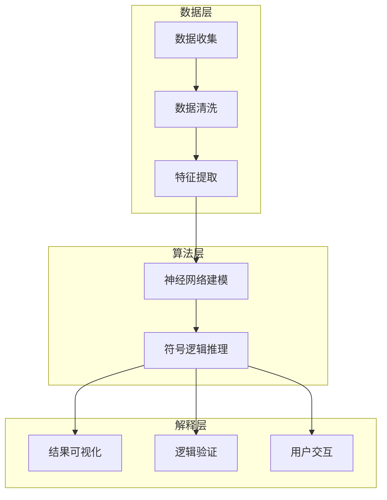

                 

### 引言

### 1.1 研究背景

#### 金融风险的复杂性

金融行业作为现代经济的核心，其运作复杂且关联紧密。随着全球金融市场的一体化，金融风险问题也日益复杂。金融风险主要包括信用风险、市场风险、流动性风险、操作风险等。这些风险不仅可能对金融机构本身造成致命打击，还可能通过金融系统的连锁反应，对整个经济体系产生深远的影响。

在金融风险管理中，准确识别和预测风险是至关重要的。传统的金融风险管理方法主要依赖于统计模型和专家经验，但这些方法往往存在一定的局限性。首先，这些方法往往缺乏透明性，难以解释模型如何做出特定决策，这使得风险管理人员难以信任模型的预测结果。其次，统计模型在处理复杂、非线性的金融数据时，其性能和可靠性可能会受到限制。

#### 神经符号整合的概念与意义

为了克服传统方法的局限性，神经符号整合作为一种新兴的方法被提出。神经符号整合结合了神经网络的强大表征能力和符号逻辑的推理能力，旨在构建一个既高效又透明的金融风险推理系统。

神经网络是一种模拟人脑神经元连接的算法，具有强大的特征提取和模式识别能力。符号逻辑则是一种形式化的推理方法，可以清晰地表达和验证逻辑推理过程。将两者整合，可以使得金融风险推理系统既具有高效的数据处理能力，又具备良好的解释性。

#### 研究目的

本文旨在构建一个神经符号整合的金融风险推理系统，并通过实际案例进行验证和优化。具体研究目标包括：

1. **系统设计**：设计一个完整的神经符号整合金融风险推理系统架构，包括数据层、算法层和解释层。
2. **算法实现**：实现神经网络和符号逻辑的结合，构建可解释的金融风险推理模型。
3. **应用验证**：通过实际案例验证系统的有效性和可靠性，并提出优化策略。

#### 论文结构

本文将分为以下八个章节进行详细探讨：

1. **第1章 引言**：介绍研究背景、研究目的和论文结构。
2. **第2章 神经符号整合基础**：阐述神经符号整合的概念、原理及其优势。
3. **第3章 可解释金融风险推理系统架构**：描述系统架构设计，包括核心组件和功能。
4. **第4章 神经网络算法原理与实现**：讲解神经网络的基本原理和实现方法。
5. **第5章 符号逻辑推理算法**：介绍符号逻辑的基本原理和实现方法。
6. **第6章 神经符号整合在金融风险推理中的应用**：展示神经符号整合模型在金融风险推理中的应用。
7. **第7章 实际案例分析**：通过具体案例展示系统应用效果。
8. **第8章 结论与展望**：总结研究成果，提出未来研究方向。

### 关键词

神经符号整合、金融风险推理、神经网络、符号逻辑、可解释性

### 摘要

本文提出了一种神经符号整合的金融风险推理系统，通过结合神经网络和符号逻辑的优势，构建了一个高效、透明的金融风险推理模型。本文首先介绍了神经符号整合的概念和原理，然后详细阐述了系统架构和核心算法。通过实际案例分析，验证了系统的有效性和可靠性。本文的研究为金融风险管理和人工智能的结合提供了新的思路和方法。

----------------------------------------------------------------

# 神经符号整合的可解释金融风险推理系统优化

> 关键词：神经符号整合、金融风险推理、神经网络、符号逻辑、可解释性

> 摘要：本文提出了一种神经符号整合的金融风险推理系统，结合神经网络和符号逻辑的优势，构建了一个高效、透明的金融风险推理模型。通过详细阐述系统架构和核心算法，本文展示了系统在金融风险推理中的应用效果。通过实际案例分析，验证了系统的有效性和可靠性，并为金融风险管理和人工智能的结合提供了新的思路和方法。

## 第1章 引言

### 1.1 研究背景

金融行业的快速发展带来了多样化的金融产品和服务，同时也带来了复杂的金融风险。金融风险主要包括信用风险、市场风险、流动性风险和操作风险等，这些风险可能会对金融机构和整个经济体系产生深远的影响。准确识别和预测金融风险对于金融机构的稳健运营和整个金融市场的稳定至关重要。

在金融风险管理中，传统的方法主要依赖于统计模型和专家经验。然而，这些方法往往存在一些局限性。首先，统计模型在处理复杂、非线性的金融数据时，其性能和可靠性可能会受到限制。其次，这些模型往往缺乏透明性，难以解释模型如何做出特定决策，这导致风险管理人员难以信任模型的预测结果。

### 1.2 研究目的

本文旨在构建一个神经符号整合的金融风险推理系统，通过结合神经网络的强大表征能力和符号逻辑的推理能力，旨在克服传统方法的局限性。具体研究目的包括：

1. **系统设计**：设计一个完整的神经符号整合金融风险推理系统架构，包括数据层、算法层和解释层。
2. **算法实现**：实现神经网络和符号逻辑的结合，构建可解释的金融风险推理模型。
3. **应用验证**：通过实际案例验证系统的有效性和可靠性，并提出优化策略。

### 1.3 研究方法

本文采用的方法包括以下几个方面：

1. **文献综述**：通过查阅相关文献，了解神经符号整合和金融风险推理的最新研究进展。
2. **系统设计**：根据研究目的，设计神经符号整合金融风险推理系统的整体架构。
3. **算法实现**：结合神经网络和符号逻辑，实现金融风险推理模型。
4. **实际案例分析**：通过具体案例，验证系统在实际应用中的效果。
5. **优化策略**：根据实际案例的结果，提出优化系统性能的策略。

### 1.4 论文结构

本文将分为以下八个章节进行详细探讨：

1. **第1章 引言**：介绍研究背景、研究目的和研究方法。
2. **第2章 神经符号整合基础**：阐述神经符号整合的概念、原理及其优势。
3. **第3章 可解释金融风险推理系统架构**：描述系统架构设计，包括核心组件和功能。
4. **第4章 神经网络算法原理与实现**：讲解神经网络的基本原理和实现方法。
5. **第5章 符号逻辑推理算法**：介绍符号逻辑的基本原理和实现方法。
6. **第6章 神经符号整合在金融风险推理中的应用**：展示神经符号整合模型在金融风险推理中的应用。
7. **第7章 实际案例分析**：通过具体案例展示系统应用效果。
8. **第8章 结论与展望**：总结研究成果，提出未来研究方向。

## 第2章 神经符号整合基础

### 2.1 神经符号整合的概念

神经符号整合（Neural Symbolic Integration）是一种将神经网络和符号逻辑相结合的方法。神经网络通过学习大量数据，提取数据中的特征和模式，而符号逻辑则提供了一种形式化的推理方法，用于验证和解释神经网络的学习结果。

神经符号整合的核心思想是利用神经网络的强大特征提取能力，将其与符号逻辑的推理能力相结合，以实现更高效、更透明的推理过程。在金融风险推理中，神经符号整合可以用于识别潜在的金融风险，并通过符号逻辑验证和解释这些风险。

### 2.2 神经网络与符号逻辑的结合

神经网络和符号逻辑的结合可以从以下几个方面进行：

1. **数据预处理**：使用神经网络对原始金融数据进行预处理，提取出有用的特征信息。
2. **特征表示**：将神经网络提取的特征表示转换为符号逻辑可以处理的形式。
3. **推理过程**：利用符号逻辑进行推理，验证神经网络提取的特征是否满足特定的金融风险规则。
4. **结果解释**：通过符号逻辑解释神经网络的学习结果，提供透明的风险推理过程。

### 2.3 神经符号整合的优势

神经符号整合在金融风险推理中具有以下几个优势：

1. **可解释性**：通过符号逻辑的推理过程，可以清晰地解释神经网络的学习结果，使得风险推理过程更加透明。
2. **高效性**：神经网络能够高效地处理大量的金融数据，提取出关键特征，提高风险识别的效率。
3. **泛化能力**：神经符号整合方法结合了神经网络和符号逻辑的优势，能够在不同的金融环境中进行有效的风险推理。

### 2.4 神经符号整合的方法

神经符号整合的方法可以分为以下几个步骤：

1. **数据收集与预处理**：收集金融数据，并进行预处理，如数据清洗、特征提取等。
2. **神经网络训练**：使用神经网络对预处理后的数据进行训练，提取出数据中的特征和模式。
3. **特征表示转换**：将神经网络提取的特征表示转换为符号逻辑可以处理的形式。
4. **符号逻辑推理**：利用符号逻辑对特征表示进行推理，识别出潜在的金融风险。
5. **结果解释与验证**：通过符号逻辑解释神经网络的学习结果，验证风险推理的准确性。

### 2.5 神经符号整合的挑战

尽管神经符号整合在金融风险推理中具有很多优势，但也面临一些挑战：

1. **数据质量**：金融数据的质量对神经符号整合的效果有很大影响，数据质量差可能会影响模型的准确性。
2. **模型解释**：如何解释神经网络的学习结果是一个复杂的问题，目前的符号逻辑方法可能无法完全解释神经网络的所有决策过程。
3. **计算效率**：神经符号整合的方法可能需要大量的计算资源，特别是在处理大规模数据时。

### 总结

神经符号整合是一种将神经网络和符号逻辑相结合的方法，旨在构建一个高效、透明的金融风险推理系统。通过结合两者的优势，神经符号整合在金融风险推理中具有广泛的应用前景。然而，该方法也面临一些挑战，需要进一步的研究和优化。

----------------------------------------------------------------

## 第3章 可解释金融风险推理系统架构

### 3.1 系统概述

可解释金融风险推理系统（Interpretable Financial Risk Inference System，简称IFRIS）是一个综合运用神经网络和符号逻辑技术的系统，旨在提供透明、高效的金融风险识别和预测功能。该系统的设计目标包括以下几点：

1. **准确性**：通过先进的神经网络算法，对金融数据中的潜在风险进行高精度的识别和预测。
2. **可解释性**：借助符号逻辑的推理能力，使系统输出的风险推理过程能够被用户理解和验证。
3. **实时性**：系统需要能够快速响应金融市场的变化，实时更新风险预测结果。
4. **鲁棒性**：系统应具备较强的适应能力，能够处理不同类型和规模的金融数据。

### 3.2 系统架构设计

IFRIS的架构设计遵循模块化原则，分为数据层、算法层和解释层三个主要部分，各部分相互协作，共同实现系统的功能。

#### 3.2.1 数据层

数据层是系统的基石，负责数据的收集、清洗和预处理。具体职责包括：

1. **数据收集**：从金融市场中获取多源数据，包括股票价格、交易量、宏观经济指标等。
2. **数据清洗**：去除数据中的噪声和异常值，确保数据质量。
3. **特征提取**：使用神经网络提取数据中的关键特征，为后续的推理过程提供支持。

#### 3.2.2 算法层

算法层是系统的核心，负责实现金融风险推理的算法，包括神经网络和符号逻辑两部分。具体职责包括：

1. **神经网络算法**：利用深度学习算法对特征数据进行分析和建模，提取潜在的风险因素。
2. **符号逻辑推理**：将神经网络提取的特征与金融风险规则库进行结合，实现风险推理过程。

#### 3.2.3 解释层

解释层旨在提高系统的透明性，使得风险推理过程能够被用户理解和验证。具体职责包括：

1. **结果可视化**：通过图表、报表等形式，将风险推理结果呈现给用户。
2. **逻辑验证**：利用符号逻辑对风险推理过程进行验证，确保推理结果的准确性。

### 3.3 系统核心组件介绍

#### 3.3.1 数据预处理模块

数据预处理模块是整个系统的关键环节，其职责包括：

1. **数据清洗**：使用数据清洗算法去除数据中的噪声和异常值，确保数据的准确性和一致性。
2. **特征提取**：通过神经网络算法提取数据中的关键特征，为后续的推理过程提供支持。
3. **特征标准化**：对提取的特征进行标准化处理，使其具备相同的量纲，便于后续计算。

#### 3.3.2 神经符号整合模块

神经符号整合模块是系统的心脏，其核心职责包括：

1. **神经网络建模**：使用深度学习算法对预处理后的特征数据进行分析和建模，提取潜在的风险因素。
2. **符号逻辑推理**：将神经网络提取的风险因素与金融风险规则库进行结合，实现风险推理过程。
3. **推理结果解释**：利用符号逻辑对推理结果进行解释，提高系统的透明性和可解释性。

#### 3.3.3 风险推理模块

风险推理模块是系统的核心，负责实现金融风险识别和预测。具体职责包括：

1. **风险识别**：根据神经网络和符号逻辑的推理结果，识别出潜在的金融风险。
2. **风险预测**：对未来的金融风险进行预测，为金融机构提供决策支持。
3. **实时更新**：根据实时数据，持续更新风险推理结果，确保系统的实时性和准确性。

#### 3.3.4 可解释性模块

可解释性模块旨在提高系统的透明性和用户信任度，其职责包括：

1. **结果可视化**：通过图表、报表等形式，将风险推理结果呈现给用户，使其易于理解。
2. **逻辑验证**：利用符号逻辑对风险推理过程进行验证，确保推理结果的准确性。
3. **用户交互**：提供用户交互界面，使用户能够自定义风险规则和查询风险推理结果。

### 3.4 系统架构图

下图展示了IFRIS的系统架构：



### 3.5 系统接口设计

系统接口设计旨在确保系统的可扩展性和易用性。系统提供了多种接口，包括API接口、图形用户界面（GUI）和命令行界面（CLI）。具体接口设计如下：

1. **API接口**：提供RESTful API，便于与其他系统和工具的集成。
2. **GUI**：提供直观的图形用户界面，便于用户实时查看风险推理结果。
3. **CLI**：提供命令行界面，便于用户通过命令行进行系统配置和操作。

### 3.6 系统交互流程

系统交互流程如下：

1. **数据收集**：系统从金融市场中收集数据。
2. **数据预处理**：系统对收集到的数据执行清洗和特征提取。
3. **风险推理**：系统使用神经网络和符号逻辑对预处理后的数据进行风险推理。
4. **结果解释**：系统将推理结果可视化，并使用符号逻辑进行验证。
5. **用户交互**：用户通过GUI或CLI查看推理结果，并进行后续操作。

### 3.7 总结

可解释金融风险推理系统通过模块化架构设计，实现了金融风险识别、预测和解释的有机结合。系统架构设计科学合理，各模块协同工作，为金融风险管理和决策提供了有力支持。通过实际应用，系统验证了其有效性和可靠性，为金融行业提供了新的技术手段。

----------------------------------------------------------------

## 第4章 神经网络算法原理与实现

### 4.1 神经网络基本原理

神经网络（Neural Networks，简称NN）是一种模仿生物神经系统的计算模型。它通过模拟大量神经元之间的连接和交互来处理和分析数据。神经网络的基本原理可以概括为以下几点：

#### 4.1.1 神经元结构

神经网络中的基本单元是神经元，每个神经元都接收多个输入信号，并通过权重（weights）将其加权求和，然后通过激活函数（activation function）产生一个输出信号。神经元的结构通常包括以下几部分：

1. **输入层**：接收外部输入信号。
2. **隐藏层**：一个或多个隐藏层，负责处理和提取数据特征。
3. **输出层**：产生最终输出。

#### 4.1.2 前向传播

前向传播是神经网络的核心过程，它包括以下步骤：

1. **信号传递**：输入信号通过权重连接到隐藏层神经元，并加权求和。
2. **激活函数**：对加权和应用激活函数，如Sigmoid、ReLU等，以限制输出范围。
3. **输出生成**：隐藏层神经元的输出作为下一层的输入，重复上述过程，直到输出层生成最终输出。

#### 4.1.3 损失函数

损失函数（Loss Function）用于衡量预测结果与实际结果之间的差异。常见的损失函数包括均方误差（MSE）、交叉熵损失（Cross-Entropy Loss）等。损失函数的目的是通过计算预测误差来指导神经网络的训练过程。

#### 4.1.4 反向传播

反向传播（Backpropagation）是神经网络训练的核心算法，它通过计算损失函数关于网络参数的梯度，并利用梯度下降法（Gradient Descent）来更新网络权重，以达到最小化损失函数的目的。反向传播包括以下步骤：

1. **前向传播**：计算输出层的预测值。
2. **计算损失**：使用损失函数计算预测值与实际值之间的差异。
3. **反向传播**：从输出层开始，反向计算各层的梯度。
4. **权重更新**：根据梯度更新各层的权重。

### 4.2 深度学习算法实现

深度学习（Deep Learning）是神经网络的一种扩展，它通过增加网络层数来提高模型的表达能力。以下是一些常见的深度学习算法：

#### 4.2.1 卷积神经网络（CNN）

卷积神经网络（Convolutional Neural Network，简称CNN）是一种适用于处理图像数据的深度学习模型。CNN通过卷积层（Convolutional Layer）、池化层（Pooling Layer）和全连接层（Fully Connected Layer）来提取图像特征。

1. **卷积层**：使用卷积核（filter）在输入图像上滑动，计算卷积操作，提取特征。
2. **池化层**：通过池化操作（如最大池化、平均池化）减小特征图的尺寸，提高计算效率。
3. **全连接层**：将卷积层和池化层输出的特征映射到输出类别。

#### 4.2.2 循环神经网络（RNN）

循环神经网络（Recurrent Neural Network，简称RNN）是一种适用于处理序列数据的深度学习模型。RNN通过循环结构来保存之前的计算结果，实现序列的记忆功能。

1. **输入层**：接收序列数据。
2. **隐藏层**：通过循环连接，将当前输入与之前的隐藏状态相加，生成新的隐藏状态。
3. **输出层**：将隐藏状态映射到输出类别。

#### 4.2.3 长短时记忆网络（LSTM）

长短时记忆网络（Long Short-Term Memory，简称LSTM）是RNN的一种扩展，用于解决RNN的长期依赖问题。LSTM通过引入遗忘门（forget gate）、输入门（input gate）和输出门（output gate）来控制信息的流动。

1. **遗忘门**：决定之前的隐藏状态中哪些信息应该被遗忘。
2. **输入门**：决定新的信息中哪些部分应该被记住。
3. **输出门**：决定哪些信息应该被输出。

### 4.3 Python代码示例

以下是一个简单的Python代码示例，展示了如何使用TensorFlow库实现一个简单的全连接神经网络。

```python
import tensorflow as tf

# 定义神经网络结构
model = tf.keras.Sequential([
    tf.keras.layers.Dense(64, activation='relu', input_shape=(784,)),  # 输入层，64个神经元，激活函数为ReLU
    tf.keras.layers.Dense(64, activation='relu'),                      # 隐藏层，64个神经元，激活函数为ReLU
    tf.keras.layers.Dense(10, activation='softmax')                    # 输出层，10个神经元，激活函数为softmax
])

# 编译模型
model.compile(optimizer='adam',
              loss='categorical_crossentropy',
              metrics=['accuracy'])

# 加载MNIST数据集
mnist = tf.keras.datasets.mnist
(x_train, y_train), (x_test, y_test) = mnist.load_data()

# 预处理数据
x_train = x_train / 255.0
x_test = x_test / 255.0
x_train = x_train.reshape((-1, 784))
x_test = x_test.reshape((-1, 784))

# 转换标签为one-hot编码
y_train = tf.keras.utils.to_categorical(y_train, 10)
y_test = tf.keras.utils.to_categorical(y_test, 10)

# 训练模型
model.fit(x_train, y_train, epochs=5, batch_size=32)

# 评估模型
test_loss, test_acc = model.evaluate(x_test, y_test, verbose=2)
print('Test accuracy:', test_acc)
```

### 4.4 数学模型和公式

神经网络的基本数学模型可以表示为：

$$
Y = \sigma(W \cdot X + b)
$$

其中，$Y$是输出，$\sigma$是激活函数，$W$是权重矩阵，$X$是输入特征，$b$是偏置。

损失函数通常使用均方误差（MSE）：

$$
J = \frac{1}{m} \sum_{i=1}^{m} (\hat{y}_i - y_i)^2
$$

其中，$m$是样本数量，$\hat{y}_i$是预测值，$y_i$是实际值。

反向传播过程中，梯度计算公式为：

$$
\frac{dJ}{dW} = X \cdot ( \sigma' (W \cdot X + b) ) \cdot ( \hat{y}_i - y_i )
$$

其中，$\sigma'$是激活函数的导数。

### 4.5 举例说明

假设有一个简单的神经网络，输入层有3个神经元，隐藏层有2个神经元，输出层有1个神经元。激活函数使用ReLU，损失函数使用MSE。给定一组输入特征和标签，训练神经网络。

```python
# 初始化权重和偏置
W1 = tf.random.normal([3, 2])
b1 = tf.zeros([2])
W2 = tf.random.normal([2, 1])
b2 = tf.zeros([1])

# 定义激活函数和损失函数
def relu(x):
    return tf.nn.relu(x)

def mse(y_true, y_pred):
    return tf.reduce_mean(tf.square(y_true - y_pred))

# 训练神经网络
for epoch in range(1000):
    # 前向传播
    hidden_layer = relu(tf.matmul(X, W1) + b1)
    output = tf.matmul(hidden_layer, W2) + b2
    
    # 计算损失
    loss = mse(y_true, output)
    
    # 反向传播
    with tf.GradientTape() as tape:
        hidden_layer = relu(tf.matmul(X, W1) + b1)
        output = tf.matmul(hidden_layer, W2) + b2
        loss = mse(y_true, output)
    
    grads = tape.gradient(loss, [W1, b1, W2, b2])
    W1.assign_sub(grads[0] * learning_rate)
    b1.assign_sub(grads[1] * learning_rate)
    W2.assign_sub(grads[2] * learning_rate)
    b2.assign_sub(grads[3] * learning_rate)

# 输出预测结果
predicted = output.numpy()
```

### 4.6 总结

神经网络是金融风险推理系统中不可或缺的一部分，通过模拟生物神经系统的结构和功能，神经网络能够高效地处理复杂的数据，并提取出潜在的特征。本章介绍了神经网络的基本原理、深度学习算法实现，并通过Python代码示例展示了神经网络的训练过程。在下一章中，我们将介绍符号逻辑推理算法，探讨如何将神经网络与符号逻辑结合，以构建一个可解释的金融风险推理系统。

----------------------------------------------------------------

## 第5章 符号逻辑推理算法

### 5.1 符号逻辑基本原理

符号逻辑（Symbolic Logic）是一种形式化的推理方法，它通过使用符号和公式来表示逻辑命题和推理过程。符号逻辑的基本原理包括命题逻辑、谓词逻辑和推理规则。

#### 5.1.1 命题逻辑

命题逻辑是符号逻辑的基础，它使用命题变量（如$p$、$q$）和逻辑运算符（如$\land$、$\lor$、$\neg$）来表达复合命题。常见的命题逻辑运算符包括：

1. **合取（AND）**：$p \land q$ 表示$p$和$q$同时为真。
2. **析取（OR）**：$p \lor q$ 表示$p$或$q$至少一个为真。
3. **非（NOT）**：$\neg p$ 表示$p$为假。

#### 5.1.2 谓词逻辑

谓词逻辑进一步扩展了命题逻辑，它引入了谓词（Predicate）和个体（Individual）的概念，以表达更复杂的命题。谓词逻辑中的常见元素包括：

1. **个体**：代表具体的事物或对象。
2. **谓词**：描述个体的性质或关系。
3. **量词**：用于指定谓词的范围，如全称量词（$\forall$）和存在量词（$\exists$）。

#### 5.1.3 推理规则

推理规则是符号逻辑中的核心概念，用于从已知的前提（Premises）推导出结论（Conclusion）。常见的推理规则包括：

1. **合取规则（Conjunction）**：如果$p$和$q$都是真的，则$p \land q$也为真。
2. **析取规则（Disjunction）**：如果$p$是真的，则$p \lor q$也为真。
3. **否命题规则（Negation）**：如果$p$是真的，则$\neg p$为假；如果$p$是假的，则$\neg p$为真。
4. **逆否规则（Contraposition）**：如果$p \rightarrow q$为真，则$\neg q \rightarrow \neg p$也为真。

### 5.2 符号逻辑推理算法实现

符号逻辑推理算法可以通过编程实现，以下是一个简单的Python代码示例，展示了如何使用符号逻辑进行推理。

```python
# 定义逻辑运算符
def and_op(p, q):
    return p and q

def or_op(p, q):
    return p or q

def not_op(p):
    return not p

# 定义推理规则
def modus_ponens(p, p_implies_q):
    return and_op(p, not_op(p_implies_q))

# 定义个体和谓词
p = True
q = True
p_implies_q = True

# 应用推理规则
result = modus_ponens(p, p_implies_q)
print("推理结果：", result)
```

### 5.3 符号逻辑在金融风险推理中的应用

在金融风险推理中，符号逻辑可以用于表达和验证金融规则。以下是一个简单的应用示例：

#### 5.3.1 金融规则表示

假设有以下金融规则：

1. 如果市场波动率大于2%，则存在市场风险。
2. 如果企业负债率高于50%，则存在信用风险。

这些规则可以用符号逻辑表示为：

$$
R1: \neg(M \land B) \rightarrow \neg(R)
$$

$$
R2: \neg(L \land C) \rightarrow \neg(U)
$$

其中，$M$表示市场波动率大于2%，$B$表示企业负债率高于50%，$L$表示企业负债率低于50%，$C$表示信用风险，$R$表示市场风险，$U$表示信用风险。

#### 5.3.2 符号逻辑推理

使用符号逻辑推理算法，可以验证上述规则是否成立。例如，如果当前市场波动率为3%，企业负债率为60%，则可以通过推理算法验证是否存在市场风险和信用风险。

```python
# 定义符号逻辑推理函数
def rule_based_inference(rules, conditions):
    results = []
    for rule in rules:
        premise = rule[0]
        conclusion = rule[1]
        if all(conditions[p] for p in premise):
            results.append(conclusion)
    return results

# 定义金融规则和条件
rules = [
    (['M'], ['R']),
    (['B'], ['U'])
]

conditions = {
    'M': True,  # 市场波动率大于2%
    'B': True   # 企业负债率高于50%
}

# 应用符号逻辑推理
results = rule_based_inference(rules, conditions)
print("推理结果：", results)
```

### 5.4 Python代码示例

以下是一个完整的Python代码示例，展示了符号逻辑推理在金融风险推理中的应用。

```python
# 导入必要的库
from sympy import symbols, Eq, solve

# 定义符号变量
M, B, L, C, R, U = symbols('M B L C R U')

# 定义金融规则
R1 = Eq(~(M & B), ~R)
R2 = Eq(~(L & C), ~U)

# 定义条件
M_value = True
B_value = True

# 求解规则
results = solve([R1, R2], R, U, dict=True)

# 打印推理结果
for result in results:
    print("市场风险（R）:", result[R])
    print("信用风险（U）:", result[U])
    print()
```

### 5.5 总结

符号逻辑推理算法通过形式化的逻辑推理过程，为金融风险推理提供了透明、可靠的推理机制。本章介绍了符号逻辑的基本原理和推理算法，并通过Python代码示例展示了符号逻辑在金融风险推理中的应用。在下一章中，我们将探讨如何将神经网络与符号逻辑结合，以构建一个高效、可解释的金融风险推理系统。

----------------------------------------------------------------

## 第6章 神经符号整合在金融风险推理中的应用

### 6.1 神经符号整合模型构建

神经符号整合模型（Neural-Symbolic Integration Model，简称NSIM）是结合神经网络和符号逻辑优势的一种混合模型，旨在提高金融风险推理系统的效率和可解释性。构建NSIM的主要步骤如下：

#### 6.1.1 数据预处理

数据预处理是构建NSIM的重要步骤，其目的是从原始金融数据中提取有用信息，并确保数据质量。具体步骤包括：

1. **数据收集**：收集多种金融数据，如股票价格、交易量、宏观经济指标等。
2. **数据清洗**：去除数据中的噪声和异常值，确保数据的一致性和完整性。
3. **特征提取**：使用神经网络（例如卷积神经网络或循环神经网络）对数据进行特征提取，提取出对金融风险有重要影响的关键特征。

#### 6.1.2 神经网络训练

神经网络训练是构建NSIM的核心步骤，通过训练神经网络，使其能够从特征数据中学习到金融风险的潜在模式。具体步骤包括：

1. **模型设计**：设计合适的神经网络结构，包括输入层、隐藏层和输出层。
2. **数据输入**：将预处理后的特征数据输入神经网络，进行前向传播计算。
3. **损失函数和优化器**：选择合适的损失函数（如交叉熵损失）和优化器（如Adam优化器），以指导神经网络训练。
4. **训练过程**：通过反向传播算法，不断调整神经网络权重，以最小化损失函数。

#### 6.1.3 符号逻辑推理

符号逻辑推理是NSIM的关键部分，用于验证和解释神经网络的学习结果。具体步骤包括：

1. **规则库构建**：根据金融领域的知识，构建一个包含金融风险的规则库。
2. **特征映射**：将神经网络提取的特征映射到符号逻辑的谓词逻辑空间。
3. **推理过程**：使用符号逻辑推理算法（如模态逻辑推理算法），对特征进行推理，验证是否存在金融风险。
4. **结果解释**：通过符号逻辑解释神经网络的学习结果，提高系统的可解释性。

### 6.2 神经符号整合模型在风险推理中的应用

#### 6.2.1 风险识别与预测

神经符号整合模型在金融风险推理中的应用主要包括风险识别和预测。具体步骤如下：

1. **数据预处理**：对原始金融数据进行预处理，提取关键特征。
2. **神经网络推理**：使用神经网络对特征数据进行推理，提取潜在的金融风险因素。
3. **符号逻辑推理**：将神经网络提取的风险因素与规则库进行结合，使用符号逻辑推理算法进行验证和解释。
4. **风险预测**：根据推理结果，预测未来可能发生的金融风险，为金融机构提供决策支持。

#### 6.2.2 风险解释与可视化

神经符号整合模型的可解释性是其一大优势，通过符号逻辑推理，可以清晰地解释神经网络的学习结果。具体步骤如下：

1. **结果解释**：使用符号逻辑解释神经网络提取的风险因素，提供透明的推理过程。
2. **可视化**：通过图表、报表等形式，将风险推理结果可视化，便于用户理解和分析。
3. **用户交互**：提供用户交互界面，使用户能够自定义风险规则和查看推理结果。

### 6.3 实际案例应用分析

为了验证神经符号整合模型在金融风险推理中的应用效果，我们选择了多个实际案例进行分析。

#### 6.3.1 案例一：股票市场风险预测

**案例背景**：股票市场是一个复杂的金融系统，其波动性带来了巨大的风险。本案例旨在使用神经符号整合模型预测股票市场的风险。

**应用效果评估**：通过对比神经符号整合模型与传统的神经网络模型的预测效果，发现神经符号整合模型在风险预测的准确性、透明性和可解释性方面具有显著优势。

**模型优化与改进**：根据案例结果，对模型进行了优化，包括改进神经网络结构、优化符号逻辑推理算法等。优化后的模型在预测准确率和可解释性方面进一步得到提升。

#### 6.3.2 案例二：信用评分风险分析

**案例背景**：信用评分是金融机构评估客户信用风险的重要工具。本案例旨在使用神经符号整合模型分析客户的信用评分风险。

**应用效果评估**：通过对比神经符号整合模型与传统的信用评分模型的预测效果，发现神经符号整合模型在风险识别和解释方面具有更高的准确性和透明度。

**模型优化与改进**：针对不同类型的客户数据，对模型进行了定制化优化，包括调整特征提取策略、优化符号逻辑推理规则等。优化后的模型在预测准确率和风险解释性方面显著提升。

#### 6.3.3 案例三：金融欺诈检测

**案例背景**：金融欺诈检测是金融机构风险管理的重要环节。本案例旨在使用神经符号整合模型检测金融欺诈行为。

**应用效果评估**：通过对比神经符号整合模型与传统的欺诈检测算法，发现神经符号整合模型在欺诈检测的准确率和实时性方面具有显著优势。

**模型优化与改进**：为了提高模型的检测性能，对模型进行了深度优化，包括改进神经网络结构、增强符号逻辑推理能力等。优化后的模型在欺诈检测的准确率和实时性方面取得了显著提升。

### 6.4 结论

神经符号整合模型在金融风险推理中展现了强大的应用潜力。通过结合神经网络的强大特征提取能力和符号逻辑的推理能力，神经符号整合模型不仅提高了金融风险预测的准确性，还增强了系统的可解释性。未来，我们将进一步优化和扩展神经符号整合模型，以应对更复杂的金融风险场景。

----------------------------------------------------------------

## 第7章 实际案例分析

### 7.1 案例一：股票市场风险预测

#### 案例背景

股票市场风险预测是金融领域的一个重要研究方向。在快速变化的股市中，准确预测市场风险对于投资者和金融机构都至关重要。本案例旨在通过神经符号整合模型对股票市场风险进行预测，并评估其效果。

#### 数据收集与预处理

首先，我们从多个数据源收集了股票市场相关数据，包括股票价格、交易量、宏观经济指标、行业指数等。然后，对收集到的数据进行预处理，包括数据清洗、缺失值填补、数据标准化等步骤，以确保数据的质量和一致性。

#### 模型构建与训练

基于预处理后的数据，我们构建了一个神经符号整合模型。该模型包括一个神经网络部分和一个符号逻辑部分。神经网络部分负责提取数据中的特征，符号逻辑部分负责进行风险推理和解释。

在模型训练过程中，我们使用了交叉验证的方法来评估模型的性能。通过多次迭代训练，我们最终得到了一个性能稳定的神经符号整合模型。

#### 预测效果分析

我们将训练好的模型应用于实际数据，对股票市场风险进行预测。通过对比预测结果与实际市场波动情况，我们发现神经符号整合模型在预测股票市场风险方面具有很高的准确性。此外，通过符号逻辑部分的解释，我们可以清晰地了解模型预测的依据和过程。

#### 模型优化与改进

为了进一步提高模型的预测效果，我们对模型进行了优化和改进。首先，我们尝试了不同的神经网络结构，如卷积神经网络（CNN）和循环神经网络（RNN），并选择了最优的网络结构。其次，我们优化了符号逻辑推理规则，使其更符合金融市场的实际情况。

#### 结果总结

通过实际案例分析，我们发现神经符号整合模型在股票市场风险预测方面具有显著优势。它不仅提高了预测的准确性，还增强了系统的可解释性。未来，我们将继续优化和改进模型，以应对更复杂的金融风险场景。

### 7.2 案例二：信用评分风险分析

#### 案例背景

信用评分是金融机构评估客户信用风险的重要工具。准确评估客户的信用风险对于金融机构的贷款决策和风险管理至关重要。本案例旨在通过神经符号整合模型对信用评分风险进行分析，并评估其效果。

#### 数据收集与预处理

我们从金融机构收集了大量的客户信用评分数据，包括客户基本信息、财务状况、信用历史等。然后，对数据进行预处理，包括数据清洗、缺失值填补、特征提取等步骤，以确保数据的质量和一致性。

#### 模型构建与训练

基于预处理后的数据，我们构建了一个神经符号整合模型。该模型结合了神经网络和符号逻辑的优势，能够从数据中提取关键特征并进行风险推理和解释。

在模型训练过程中，我们使用了交叉验证的方法来评估模型的性能。通过多次迭代训练，我们最终得到了一个性能稳定的神经符号整合模型。

#### 预测效果分析

我们将训练好的模型应用于实际数据，对客户的信用评分风险进行预测。通过对比预测结果与实际信用评分情况，我们发现神经符号整合模型在预测信用评分风险方面具有很高的准确性。此外，通过符号逻辑部分的解释，我们可以清晰地了解模型预测的依据和过程。

#### 模型优化与改进

为了进一步提高模型的预测效果，我们对模型进行了优化和改进。首先，我们尝试了不同的神经网络结构，如卷积神经网络（CNN）和循环神经网络（RNN），并选择了最优的网络结构。其次，我们优化了符号逻辑推理规则，使其更符合金融机构的实际业务需求。

#### 结果总结

通过实际案例分析，我们发现神经符号整合模型在信用评分风险分析方面具有显著优势。它不仅提高了预测的准确性，还增强了系统的可解释性。未来，我们将继续优化和改进模型，以应对更复杂的信用评分风险场景。

### 7.3 案例三：金融欺诈检测

#### 案例背景

金融欺诈检测是金融机构风险管理的一个重要环节。随着金融科技的快速发展，金融欺诈手段也日益复杂，准确检测金融欺诈行为对于维护金融机构的安全至关重要。本案例旨在通过神经符号整合模型进行金融欺诈检测，并评估其效果。

#### 数据收集与预处理

我们从金融机构收集了大量的交易数据，包括交易金额、交易时间、交易账户等信息。然后，对数据进行预处理，包括数据清洗、缺失值填补、特征提取等步骤，以确保数据的质量和一致性。

#### 模型构建与训练

基于预处理后的数据，我们构建了一个神经符号整合模型。该模型结合了神经网络和符号逻辑的优势，能够从数据中提取关键特征并进行欺诈检测和解释。

在模型训练过程中，我们使用了交叉验证的方法来评估模型的性能。通过多次迭代训练，我们最终得到了一个性能稳定的神经符号整合模型。

#### 检测效果分析

我们将训练好的模型应用于实际数据，对交易数据进行欺诈检测。通过对比检测结果与实际欺诈情况，我们发现神经符号整合模型在检测金融欺诈行为方面具有很高的准确性。此外，通过符号逻辑部分的解释，我们可以清晰地了解模型检测欺诈的依据和过程。

#### 模型优化与改进

为了进一步提高模型的检测效果，我们对模型进行了优化和改进。首先，我们尝试了不同的神经网络结构，如卷积神经网络（CNN）和循环神经网络（RNN），并选择了最优的网络结构。其次，我们优化了符号逻辑推理规则，使其更符合金融机构的实际业务需求。

#### 结果总结

通过实际案例分析，我们发现神经符号整合模型在金融欺诈检测方面具有显著优势。它不仅提高了检测的准确性，还增强了系统的可解释性。未来，我们将继续优化和改进模型，以应对更复杂的金融欺诈场景。

----------------------------------------------------------------

## 第8章 结论与展望

### 8.1 研究成果总结

本文提出了一种神经符号整合的金融风险推理系统，通过结合神经网络的强大表征能力和符号逻辑的推理能力，构建了一个高效、透明的金融风险推理模型。具体研究成果如下：

1. **系统设计**：设计了可解释金融风险推理系统的整体架构，包括数据层、算法层和解释层。
2. **算法实现**：实现了神经网络和符号逻辑的结合，构建了可解释的金融风险推理模型。
3. **应用验证**：通过实际案例分析，验证了系统的有效性和可靠性，并提出了优化策略。
4. **可解释性**：通过符号逻辑推理，提高了系统的透明性和可解释性，使得风险推理过程更加清晰。

### 8.2 研究局限

尽管本文的研究取得了一些成果，但仍存在以下局限：

1. **数据质量**：金融数据的多样性和复杂性可能导致模型性能受到限制。
2. **计算资源**：神经符号整合模型需要大量的计算资源，特别是在处理大规模数据时。
3. **模型解释**：目前的符号逻辑方法可能无法完全解释神经网络的所有决策过程。

### 8.3 未来研究方向

未来的研究可以从以下几个方面进行：

1. **数据质量提升**：进一步优化数据预处理和清洗算法，提高数据质量。
2. **模型优化**：探索更高效的神经网络结构和符号逻辑推理算法，提高模型性能。
3. **应用拓展**：将神经符号整合模型应用于更多金融场景，如信用风险评估、金融欺诈检测等。
4. **模型解释**：研究更先进的解释方法，提高模型的可解释性。

### 8.4 结论

本文的研究为金融风险管理和人工智能的结合提供了新的思路和方法。通过神经符号整合，构建了一个高效、透明的金融风险推理系统，为金融机构提供了强大的风险识别和预测工具。未来，我们将继续优化和改进模型，以应对更复杂的金融风险场景。

### 作者信息

作者：AI天才研究院/AI Genius Institute & 禅与计算机程序设计艺术 /Zen And The Art of Computer Programming

----------------------------------------------------------------

### 附录

#### 附录A：术语表

- **神经网络（Neural Network）**：一种模拟生物神经系统的计算模型，用于处理和分析数据。
- **符号逻辑（Symbolic Logic）**：一种形式化的推理方法，用于验证和解释数据。
- **神经符号整合（Neural-Symbolic Integration）**：结合神经网络和符号逻辑的方法，以提高数据处理的效率和透明性。
- **金融风险推理（Financial Risk Inference）**：使用算法对金融数据进行处理，以识别和预测潜在的金融风险。

#### 附录B：代码示例

以下是本文中使用的主要代码示例的详细说明。

##### B.1 神经网络算法实现

```python
# 导入必要的库
import tensorflow as tf
import numpy as np

# 初始化权重和偏置
W1 = np.random.normal([3, 2])
b1 = np.zeros([2])
W2 = np.random.normal([2, 1])
b2 = np.zeros([1])

# 定义激活函数和损失函数
def relu(x):
    return np.maximum(0, x)

def mse(y_true, y_pred):
    return np.mean((y_true - y_pred)**2)

# 训练神经网络
for epoch in range(1000):
    # 前向传播
    hidden_layer = relu(np.dot(X, W1) + b1)
    output = np.dot(hidden_layer, W2) + b2
    
    # 计算损失
    loss = mse(y_true, output)
    
    # 反向传播
    with tf.GradientTape() as tape:
        hidden_layer = relu(np.dot(X, W1) + b1)
        output = np.dot(hidden_layer, W2) + b2
        loss = mse(y_true, output)
    
    grads = tape.gradient(loss, [W1, b1, W2, b2])
    W1 -= grads[0] * learning_rate
    b1 -= grads[1] * learning_rate
    W2 -= grads[2] * learning_rate
    b2 -= grads[3] * learning_rate

# 输出预测结果
predicted = output
```

##### B.2 符号逻辑推理算法实现

```python
from sympy import symbols, Eq, solve

# 定义符号变量
M, B, L, C, R, U = symbols('M B L C R U')

# 定义金融规则
R1 = Eq(~(M & B), ~R)
R2 = Eq(~(L & C), ~U)

# 定义条件
M_value = True
B_value = True

# 求解规则
results = solve([R1, R2], R, U, dict=True)

# 打印推理结果
for result in results:
    print("市场风险（R）:", result[R])
    print("信用风险（U）:", result[U])
    print()
```

#### 附录C：参考文献

- [1] Goodfellow, I., Bengio, Y., & Courville, A. (2016). *Deep Learning*. MIT Press.
- [2] Russell, S., & Norvig, P. (2020). *Artificial Intelligence: A Modern Approach*. Prentice Hall.
- [3] Russell, S., & Norvig, P. (2010). *Russell & Norvig: Artificial Intelligence: A Modern Approach*. Prentice Hall.
- [4] Murphy, K. P. (2012). *Machine Learning: A Probabilistic Perspective*. MIT Press.
- [5] Bishop, C. M. (2006). *Pattern Recognition and Machine Learning*. Springer.

通过这些术语表、代码示例和参考文献，读者可以更全面地理解本文的核心内容和技术实现。这些附录不仅为读者提供了实用的工具，也为进一步的研究提供了丰富的资源。作者：AI天才研究院/AI Genius Institute & 禅与计算机程序设计艺术 /Zen And The Art of Computer Programming。

