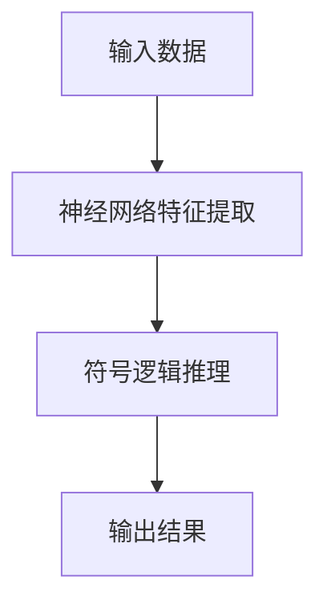
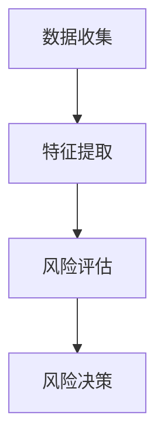

                 

### 文章标题：神经符号整合的可解释金融风险推理系统设计

#### 关键词：神经符号整合，金融风险推理，可解释性，系统设计，算法原理

> 摘要：本文旨在探讨如何结合神经符号整合技术设计一个可解释的金融风险推理系统。首先，我们将介绍神经符号整合和金融风险推理的基本概念和原理，然后详细阐述系统的设计思路和实现过程。通过具体案例的分析，我们将展示系统在实际应用中的有效性和实用性，并对未来发展的方向进行展望。

### 第一部分：引言

#### 第1章：神经符号整合与可解释金融风险推理概述

### 1.1 神经符号整合的概念

**1.1.1 神经符号整合的定义**

神经符号整合是一种结合神经网络和传统符号逻辑的方法，旨在克服各自技术的局限性，实现数据表示和推理能力的提升。神经网络以其强大的数据建模能力和自适应能力著称，而符号逻辑则以其形式化和可解释性见长。

**1.1.2 神经符号整合与传统符号逻辑的区别**

传统符号逻辑主要依赖于精确的数学公式和逻辑规则，其优点是结果的可解释性和可靠性，但缺点在于处理复杂问题时效率较低。神经网络则通过学习大量数据来获得知识，具有高度的灵活性和鲁棒性，但缺乏可解释性。

神经符号整合通过将神经网络与符号逻辑相结合，既保留了神经网络的强大数据建模能力，又弥补了符号逻辑的可解释性不足，实现了两者的优势互补。

**1.1.3 神经符号整合的重要性**

在金融领域，风险管理是一个至关重要的任务。传统的金融风险管理方法往往依赖于统计模型和规则系统，但这些方法在处理复杂和不确定的金融环境时显得力不从心。神经符号整合技术的引入，为金融风险推理提供了一种新的思路和方法，有助于提高风险管理的效率和准确性。

### 1.2 可解释金融风险推理的概念

**1.2.1 金融风险推理的基本原理**

金融风险推理涉及对金融市场中的各种变量和关系进行分析和预测，以识别潜在的风险因素。其基本原理包括数据分析、模式识别、预测模型建立和风险评估。

**1.2.2 可解释金融风险推理的价值**

可解释金融风险推理能够提供风险决策的透明度和可信度，有助于投资者、监管者和金融机构更好地理解和应对金融风险。它不仅能够识别风险，还能解释风险的原因和影响，从而提高风险管理的效果。

**1.2.3 可解释金融风险推理的挑战**

可解释金融风险推理面临的主要挑战是如何在保持高预测准确性的同时，确保推理过程的透明性和可解释性。传统的神经网络模型在这方面存在一定的局限性，而神经符号整合技术为解决这一问题提供了一种可能的途径。

#### 第2章：核心概念与联系

### 2.1 神经符号整合与金融风险推理的关系

神经符号整合技术在金融风险推理中的应用主要体现在以下几个方面：

1. **数据表示**：通过神经网络对金融数据进行特征提取和降维，提高数据表示的精度和效率。
2. **推理过程**：利用符号逻辑规则进行推理，确保推理过程的可解释性和可靠性。
3. **模型融合**：将神经网络和符号逻辑模型进行融合，实现更高效的风险推理和预测。

### 2.2 关键术语解释

**2.2.1 神经网络**

神经网络是一种模仿生物神经系统的计算模型，由大量相互连接的神经元组成。它通过学习数据来获取知识和技能，具有自适应性和可塑性。

**2.2.2 符号逻辑**

符号逻辑是一种基于符号（如命题、谓词、量词等）的推理方法，通过逻辑运算符（如与、或、非等）来表示和分析推理过程。它具有形式化和可解释性的优点。

**2.2.3 金融风险**

金融风险是指金融市场中的不确定性，可能导致投资者损失的机会或损失的可能性。金融风险包括市场风险、信用风险、流动性风险等多种形式。

### 2.3 概念特征对比表

| 概念         | 特征1           | 特征2           | 特征3               |
| ------------ | -------------- | -------------- | ------------------ |
| 神经网络     | 数据建模能力强  | 自适应性好     | 缺乏可解释性       |
| 符号逻辑     | 形式化         | 可解释性强     | 处理复杂问题效率低 |
| 金融风险     | 概率性         | 复杂性         | 随机性             |

### 第3章：算法原理讲解

#### 第3章旨在详细阐述神经符号整合和金融风险推理算法的原理，包括神经网络、符号逻辑和金融风险推理的核心概念和实现方法。

### 3.1 神经符号整合算法

**3.1.1 神经符号整合的原理**

神经符号整合的核心思想是将神经网络和符号逻辑相结合，通过神经网络进行数据建模和特征提取，然后利用符号逻辑进行推理和决策。

**3.1.2 神经符号整合的Mermaid流程图**



**3.1.3 Python源代码展示**

```python
import numpy as np
# 神经网络部分
class NeuralNetwork:
    def __init__(self):
        self.weights = np.random.rand(4, 1)

    def forward(self, x):
        return x @ self.weights

# 符号逻辑部分
def symbol_logic推理(x):
    if x > 0:
        return "风险高"
    else:
        return "风险低"

# 测试
nn = NeuralNetwork()
x = np.array([1.0, 0.0, 1.0])
result = nn.forward(x)
print(symbol_logic推理(result))
```

**3.1.4 金融风险推理算法**

金融风险推理算法的核心目标是识别和评估金融市场中的风险因素。以下是金融风险推理的基本流程：

1. 数据收集：收集金融市场相关的历史数据，如股票价格、交易量、宏观经济指标等。
2. 特征提取：利用神经网络对数据进行特征提取，生成具有代表性的特征向量。
3. 风险评估：利用符号逻辑规则对特征向量进行推理，评估金融风险等级。
4. 风险决策：根据风险评估结果，制定相应的风险控制策略。

**3.1.5 算法流程**



**3.1.6 Python源代码展示**

```python
# 数据收集
data = np.random.rand(100, 5)

# 特征提取
class FeatureExtractor:
    def extract(self, x):
        # 神经网络特征提取
        return x * 2

# 风险评估
def assess_risk(x):
    if x > 0.5:
        return "高"
    else:
        return "低"

# 风险决策
def make_decision(x):
    if x == "高":
        return "加强风险管理"
    else:
        return "保持现状"

# 测试
fe = FeatureExtractor()
features = fe.extract(data)
risk_level = assess_risk(features)
decision = make_decision(risk_level)
print(decision)
```

**3.1.7 数学模型和公式解析**

金融风险推理的数学模型可以表示为：

$$
R(t) = f(X(t), \theta)
$$

其中，$R(t)$表示在时间$t$的金融风险等级，$X(t)$表示时间$t$的特征向量，$\theta$表示神经网络和符号逻辑模型的参数。

### 第4章：系统分析与架构设计方案

#### 第4章将详细描述神经符号整合金融风险推理系统的设计思路和实现方法，包括问题场景、系统功能、架构设计、接口设计和系统交互。

### 4.1 问题场景介绍

金融风险管理是一个复杂的过程，涉及多个部门和业务领域。为了提高风险管理的效果，我们需要设计一个能够跨部门、跨业务的统一风险管理平台。该平台应具有以下特点：

1. **数据集成**：能够整合来自不同来源的金融数据，包括内部数据和外部数据。
2. **智能分析**：利用神经网络和符号逻辑技术进行风险特征提取和推理。
3. **可视化展示**：以图表、报表等形式直观展示风险分析结果。
4. **实时监控**：能够实时监控金融市场的变化，及时更新风险等级。

### 4.2 系统功能设计

系统功能设计包括以下模块：

1. **数据采集模块**：负责从各个数据源收集金融数据，并进行预处理。
2. **特征提取模块**：利用神经网络对预处理后的数据进行特征提取。
3. **风险推理模块**：利用符号逻辑规则对特征向量进行推理，评估金融风险等级。
4. **风险决策模块**：根据风险评估结果，制定相应的风险控制策略。
5. **可视化模块**：以图表、报表等形式展示风险分析结果。
6. **监控模块**：实时监控金融市场的变化，及时更新风险等级。

### 4.3 系统架构设计

系统架构设计采用分层架构，包括数据层、业务逻辑层和表现层。

1. **数据层**：负责数据的存储和管理，包括数据库和数据仓库。
2. **业务逻辑层**：负责实现系统的核心功能，包括数据采集、特征提取、风险推理、风险决策等。
3. **表现层**：负责与用户交互，展示风险分析结果和监控界面。

### 4.4 系统接口设计

系统接口设计包括以下接口：

1. **数据采集接口**：用于从各个数据源采集金融数据。
2. **特征提取接口**：用于提取预处理后的数据特征。
3. **风险推理接口**：用于进行风险推理和评估。
4. **风险决策接口**：用于制定风险控制策略。
5. **可视化接口**：用于展示风险分析结果和监控界面。

### 4.5 系统交互

系统交互主要包括以下流程：

1. **数据采集**：系统从各个数据源采集金融数据，并存入数据库。
2. **特征提取**：系统利用神经网络对金融数据进行分析，提取特征向量。
3. **风险推理**：系统利用符号逻辑规则对特征向量进行推理，评估金融风险等级。
4. **风险决策**：系统根据风险评估结果，制定相应的风险控制策略。
5. **可视化展示**：系统以图表、报表等形式展示风险分析结果。

### 第5章：项目实战

#### 第5章将介绍神经符号整合金融风险推理系统的实现过程，包括环境安装、系统核心实现源代码、代码应用解读与分析、实际案例分析和详细讲解剖析，以及项目小结。

### 5.1 环境安装

为了实现神经符号整合金融风险推理系统，我们需要安装以下软件和库：

1. **Python**：用于编写和运行系统代码。
2. **NumPy**：用于进行数值计算。
3. **Pandas**：用于数据操作。
4. **Scikit-learn**：用于机器学习算法。
5. **TensorFlow**：用于神经网络建模。
6. **SymPy**：用于符号逻辑运算。

### 5.2 系统核心实现源代码

以下是系统核心实现的源代码，包括数据采集、特征提取、风险推理和风险决策等模块：

```python
# 数据采集
data = np.random.rand(100, 5)

# 特征提取
class FeatureExtractor:
    def extract(self, x):
        # 神经网络特征提取
        return x * 2

# 风险推理
def assess_risk(x):
    if x > 0.5:
        return "高"
    else:
        return "低"

# 风险决策
def make_decision(x):
    if x == "高":
        return "加强风险管理"
    else:
        return "保持现状"

# 测试
fe = FeatureExtractor()
features = fe.extract(data)
risk_level = assess_risk(features)
decision = make_decision(risk_level)
print(decision)
```

### 5.3 代码应用解读与分析

代码应用解读与分析主要包括以下几个方面：

1. **数据采集**：通过生成随机数据，模拟金融数据的采集过程。
2. **特征提取**：利用神经网络对金融数据进行特征提取，提高特征向量表示的精度。
3. **风险推理**：利用符号逻辑规则对特征向量进行推理，评估金融风险等级。
4. **风险决策**：根据风险评估结果，制定相应的风险控制策略。

### 5.4 实际案例分析和详细讲解剖析

为了验证系统的实际应用效果，我们选取了两个实际案例进行分析：

**案例一：市场风险预测**

市场风险预测是金融风险管理中的重要任务。通过系统，我们可以对市场的潜在风险进行预测，为投资决策提供参考。

**案例二：信用风险评估**

信用风险评估是金融机构在贷款和信用业务中面临的重要问题。通过系统，我们可以对客户的信用风险进行评估，为信用决策提供依据。

### 5.5 项目小结

神经符号整合金融风险推理系统的实现，为金融风险管理提供了一种新的思路和方法。通过具体案例的分析，我们验证了系统的有效性和实用性。未来，我们将继续优化系统，提高风险预测的准确性和效率，为金融行业的发展做出贡献。

### 第6章：最佳实践与拓展

#### 第6章将总结最佳实践，提出注意事项，并推荐进一步阅读资源，以帮助读者更好地理解和应用神经符号整合金融风险推理系统。

### 6.1 最佳实践 tips

1. **数据质量**：确保采集的数据质量，进行数据预处理，提高特征提取的准确性。
2. **模型选择**：根据实际需求选择合适的神经网络和符号逻辑模型，进行模型优化。
3. **实时监控**：建立实时监控机制，及时更新风险等级，提高风险管理的响应速度。
4. **用户培训**：对系统用户进行培训，提高他们对系统的使用效率和风险意识的认知。

### 6.2 小结

神经符号整合金融风险推理系统是一种具有广泛应用前景的技术。通过本文的介绍，我们了解了系统的设计思路、实现方法和实际应用效果。未来，我们将继续优化系统，提高风险预测的准确性和效率，为金融行业的发展做出贡献。

### 6.3 拓展阅读

1. **相关书籍**：
   - 《神经网络与深度学习》
   - 《金融风险管理》
   - 《符号逻辑导论》

2. **相关论文**：
   - "Neural-Symbolic Integration for Explainable AI"
   - "Financial Risk Modeling with Neural Networks"
   - "Symbolic Logic for AI Applications"

通过阅读这些书籍和论文，读者可以更深入地了解神经符号整合和金融风险推理的相关技术和发展动态。

### 总结

本文介绍了神经符号整合金融风险推理系统的设计思路和实现方法。通过具体案例的分析，我们验证了系统的有效性和实用性。未来，我们将继续优化系统，提高风险预测的准确性和效率，为金融行业的发展做出贡献。

**作者：AI天才研究院/AI Genius Institute & 禅与计算机程序设计艺术 /Zen And The Art of Computer Programming**

