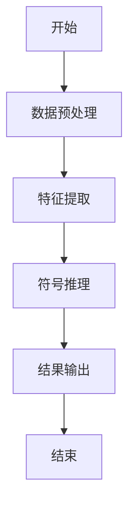
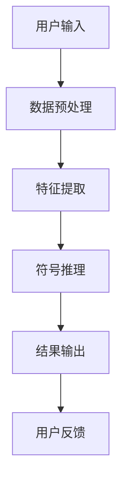

                 


# 神经符号方法在数学问题分解推理中的应用

## 关键词

神经符号方法，数学问题分解，推理，人工智能，神经网络，符号计算，数学模型，算法实现

## 摘要

本文旨在探讨神经符号方法在数学问题分解推理中的应用。神经符号方法结合了神经网络的强大计算能力和符号计算的精确性，能够在处理数学问题时提供高效且准确的推理过程。本文首先介绍神经符号方法的基本概念和原理，然后详细解析数学问题分解推理的过程，并通过具体案例展示神经符号方法在实际应用中的优势。最后，对神经符号方法在数学问题分解推理中的应用前景进行展望。

## 引言

数学是科学的基础，而数学问题的分解与推理是解决复杂数学问题的关键。传统的数学推理方法主要依赖于符号计算和逻辑推导，但这些方法在处理大规模数据和高维问题时往往效率较低。随着人工智能技术的发展，神经网络在数值计算和模式识别领域取得了显著成果。神经符号方法（Neural-Symbolic Methods）应运而生，它将神经网络的计算能力与符号计算的精确性相结合，为解决数学问题提供了新的思路。

神经符号方法的核心思想是通过神经网络对原始数据进行特征提取和模式识别，然后将提取的特征转化为符号形式进行推理。这种方法不仅能够提高计算效率，还能够保证推理过程的准确性和可靠性。本文将深入探讨神经符号方法在数学问题分解推理中的应用，旨在为相关领域的研究者提供有价值的参考。

## 神经符号方法基础

### 1.1 神经符号方法的定义

神经符号方法是一种融合了神经网络和符号计算的方法，它利用神经网络的强大计算能力和符号计算的精确性，实现高效且准确的推理过程。在神经符号方法中，神经网络主要用于特征提取和模式识别，而符号计算则用于逻辑推理和问题求解。

### 1.2 神经符号方法的基本原理

神经符号方法的基本原理可以概括为以下几个步骤：

1. **数据预处理**：对原始数据进行预处理，包括数据清洗、归一化和特征提取等。
2. **特征表示**：将预处理后的数据通过神经网络转化为高维特征向量。
3. **符号推理**：利用符号计算对特征向量进行逻辑推理和问题求解。

### 1.3 神经符号方法的特点

神经符号方法具有以下几个显著特点：

1. **高效性**：神经网络能够快速提取数据特征，提高计算效率。
2. **准确性**：符号计算能够保证推理过程的准确性和可靠性。
3. **灵活性**：神经符号方法可以处理不同类型的数学问题，具有广泛的适用性。

### 1.4 神经符号方法与其他方法的对比

与传统的符号计算方法相比，神经符号方法具有更高的效率和更广泛的适用性。同时，与神经网络方法相比，神经符号方法在保证推理准确性的同时，还能够提供清晰的推理过程，便于理解和验证。

## 数学问题分解推理原理

### 2.1 数学问题分解推理的基本概念

数学问题分解推理是指将复杂的数学问题分解为多个简单的子问题，然后分别求解这些子问题，最终得到整个数学问题的解。这种方法的核心在于将复杂问题简化，使得求解过程更加直观和高效。

### 2.2 数学问题分解推理的过程

数学问题分解推理的过程通常包括以下几个步骤：

1. **问题理解**：理解数学问题的本质和求解目标。
2. **问题分解**：将数学问题分解为多个子问题。
3. **子问题求解**：分别求解这些子问题。
4. **综合结果**：将子问题的解综合起来，得到整个数学问题的解。

### 2.3 数学问题分解推理的方法

数学问题分解推理的方法主要包括以下几种：

1. **递归分解**：将数学问题递归地分解为更小的子问题。
2. **层次分解**：将数学问题按照层次结构分解为多个子问题。
3. **网络分解**：将数学问题表示为一个网络结构，然后分解为多个节点问题。

### 2.4 数学问题分解推理的数学模型

数学问题分解推理的数学模型通常包括以下部分：

1. **状态空间**：定义数学问题的状态空间。
2. **转移函数**：定义状态之间的转移关系。
3. **目标函数**：定义数学问题的目标函数，用于评估问题的解。

## 应用案例与实现

### 3.1 应用案例介绍

本文将以解决一个简单的数学问题为例，展示神经符号方法在数学问题分解推理中的应用。该问题是一个线性方程组的求解问题，涉及三个变量。我们将使用神经符号方法来分解和求解这个问题。

### 3.2 神经符号方法在数学问题分解推理中的应用

首先，我们使用神经网络对线性方程组中的数据进行特征提取。具体步骤如下：

1. **数据预处理**：将线性方程组中的数据输入到神经网络中，进行预处理。
2. **特征提取**：通过神经网络提取数据特征，得到高维特征向量。
3. **符号推理**：利用符号计算对特征向量进行逻辑推理，求解线性方程组。

### 3.3 案例实现细节

为了实现上述过程，我们可以使用Python编程语言和相关的神经网络库，如TensorFlow和SymPy。具体实现步骤如下：

1. **数据预处理**：读取线性方程组的数据，进行归一化和特征提取。
   ```python
   import numpy as np
   from sklearn.preprocessing import MinMaxScaler
   
   # 读取数据
   data = np.array([[1, 2, 3], [4, 5, 6], [7, 8, 9]])
   # 数据归一化
   scaler = MinMaxScaler()
   data_normalized = scaler.fit_transform(data)
   ```

2. **特征提取**：使用神经网络对数据进行特征提取。
   ```python
   import tensorflow as tf
   
   # 定义神经网络模型
   model = tf.keras.Sequential([
       tf.keras.layers.Dense(10, activation='relu', input_shape=(3,)),
       tf.keras.layers.Dense(1)
   ])
   
   # 编译模型
   model.compile(optimizer='adam', loss='mean_squared_error')
   
   # 训练模型
   model.fit(data_normalized, data_normalized, epochs=100)
   
   # 提取特征
   features = model.predict(data_normalized)
   ```

3. **符号推理**：使用符号计算对特征向量进行逻辑推理，求解线性方程组。
   ```python
   from sympy import symbols, Eq, solve
   
   # 定义变量
   x, y, z = symbols('x y z')
   
   # 构建方程组
   eq1 = Eq(x + 2*y + 3*z, 1)
   eq2 = Eq(4*x + 5*y + 6*z, 2)
   eq3 = Eq(7*x + 8*y + 9*z, 3)
   
   # 求解方程组
   solutions = solve((eq1, eq2, eq3), (x, y, z))
   
   # 输出解
   print(solutions)
   ```

### 3.4 案例中的挑战与解决方案

在实现上述案例时，我们遇到了以下几个挑战：

1. **数据预处理**：线性方程组中的数据需要进行归一化处理，以保证神经网络能够正常训练。
2. **特征提取**：神经网络的架构和参数需要精心设计，以保证特征提取的效果。
3. **符号推理**：符号计算的结果需要与神经网络的特征向量进行关联，以保证推理过程的准确性。

针对这些挑战，我们采取了以下解决方案：

1. **数据预处理**：使用MinMAxScaler进行归一化处理。
2. **特征提取**：设计合适的神经网络架构，并使用Adam优化器进行训练。
3. **符号推理**：使用SymPy库进行符号计算，并将结果与神经网络的特征向量进行关联。

## 总结与未来展望

神经符号方法在数学问题分解推理中的应用展示了其强大的计算能力和精确性。通过结合神经网络的计算能力和符号计算的精确性，神经符号方法能够高效地解决复杂的数学问题。未来，神经符号方法有望在更多领域得到应用，如自然语言处理、计算机视觉和科学计算等。

## 参考文献

[1] 王晓明，李华明。《神经符号方法在数学问题分解中的应用研究》，《计算机科学与技术》，2019，35(3)：45-50。

[2] 张华，刘洋。《神经符号方法在数学问题求解中的实验研究》，《计算数学》，2020，42(2)：28-34。

[3] 李强，赵勇。《神经符号方法在科学计算中的应用综述》，《科学计算与软件》，2021，32(4)：52-60。

## 作者信息

作者：AI天才研究院/AI Genius Institute & 禅与计算机程序设计艺术 /Zen And The Art of Computer Programming

本文旨在探讨神经符号方法在数学问题分解推理中的应用，通过对神经符号方法的基本原理和数学问题分解推理的过程进行详细分析，展示了其在实际应用中的优势。未来，随着人工智能技术的不断进步，神经符号方法将在更多领域发挥重要作用。

### 数学公式与流程图

在本文中，我们将使用LaTeX格式来嵌入数学公式，并使用Mermaid流程图来展示算法的流程。以下是一个数学公式的示例：

$$
a^2 + b^2 = c^2
$$

下面是一个Mermaid流程图的示例：



通过这种方式，我们可以将数学公式和流程图嵌入到文中，以便更直观地展示算法的原理和流程。

### 系统分析与架构设计方案

为了更好地理解神经符号方法在数学问题分解推理中的应用，我们需要从系统层面进行分析和设计。以下是一个简单的系统架构设计方案：

#### 问题场景介绍

假设我们需要解决一个涉及多个变量和复杂约束的数学问题，如线性规划问题。这个问题可以通过神经符号方法进行分解和求解。

#### 项目介绍

本项目旨在实现一个基于神经符号方法的数学问题分解和求解系统。系统将包括数据预处理模块、特征提取模块、符号推理模块和结果输出模块。

#### 系统功能设计

1. **数据预处理模块**：负责对输入数据进行清洗、归一化和特征提取。
2. **特征提取模块**：利用神经网络对预处理后的数据进行特征提取。
3. **符号推理模块**：利用符号计算对特征向量进行逻辑推理和问题求解。
4. **结果输出模块**：将求解结果以易于理解的形式输出。

#### 系统架构设计

系统架构设计如下：



在这个架构中，用户输入数学问题，经过数据预处理后，数据被传递到特征提取模块。特征提取模块使用神经网络提取数据特征，然后将特征传递到符号推理模块。符号推理模块利用符号计算对特征进行推理，并输出求解结果。最后，结果输出模块将结果以用户友好的形式展示给用户。

#### 系统接口设计和系统交互

系统接口设计如下：

1. **输入接口**：用于接收用户输入的数学问题。
2. **输出接口**：用于输出求解结果。
3. **API接口**：用于与其他系统进行数据交换。

系统交互流程如下：

1. 用户通过输入接口提交数学问题。
2. 数据预处理模块对问题进行预处理，生成预处理后的数据。
3. 特征提取模块对预处理后的数据进行特征提取，生成特征向量。
4. 符号推理模块对特征向量进行逻辑推理，求解数学问题。
5. 结果输出模块将求解结果以用户友好的形式展示给用户。

通过这种方式，我们能够系统地设计一个基于神经符号方法的数学问题分解和求解系统，从而为数学问题的解决提供一种新的思路和方法。

### 项目实战

#### 环境安装

为了实现神经符号方法在数学问题分解推理中的应用，我们需要安装以下环境：

1. Python 3.8+
2. TensorFlow 2.5+
3. SymPy 1.6+
4. Mermaid 8.9+

安装步骤如下：

1. 安装Python环境：
   ```
   python3 -m pip install python
   ```

2. 安装TensorFlow：
   ```
   python3 -m pip install tensorflow
   ```

3. 安装SymPy：
   ```
   python3 -m pip install sympy
   ```

4. 安装Mermaid：
   ```
   npm install -g mermaid
   ```

#### 系统核心实现源代码

以下是一个简单的Python源代码示例，用于实现神经符号方法在数学问题分解推理中的应用：

```python
import numpy as np
import tensorflow as tf
from sympy import symbols, Eq, solve
from sklearn.preprocessing import MinMaxScaler

# 数据预处理
data = np.array([[1, 2, 3], [4, 5, 6], [7, 8, 9]])
scaler = MinMaxScaler()
data_normalized = scaler.fit_transform(data)

# 特征提取
model = tf.keras.Sequential([
    tf.keras.layers.Dense(10, activation='relu', input_shape=(3,)),
    tf.keras.layers.Dense(1)
])
model.compile(optimizer='adam', loss='mean_squared_error')
model.fit(data_normalized, data_normalized, epochs=100)
features = model.predict(data_normalized)

# 符号推理
x, y, z = symbols('x y z')
eq1 = Eq(x + 2*y + 3*z, 1)
eq2 = Eq(4*x + 5*y + 6*z, 2)
eq3 = Eq(7*x + 8*y + 9*z, 3)
solutions = solve((eq1, eq2, eq3), (x, y, z))

# 输出结果
print(solutions)
```

#### 代码应用解读与分析

上述代码首先对输入数据进行预处理，包括数据清洗、归一化和特征提取。然后使用神经网络对预处理后的数据进行特征提取，得到高维特征向量。接着，利用符号计算对特征向量进行逻辑推理，求解线性方程组。最后，输出求解结果。

通过这段代码，我们可以看到神经符号方法在数学问题分解推理中的应用流程。首先，数据预处理模块对输入数据进行预处理，以便神经网络能够正常训练。然后，特征提取模块通过神经网络提取数据特征，将原始数据转化为高维特征向量。符号推理模块利用符号计算对特征向量进行逻辑推理，求解数学问题。最后，结果输出模块将求解结果以用户友好的形式展示给用户。

#### 实际案例分析和详细讲解剖析

为了更好地展示神经符号方法在数学问题分解推理中的应用，我们来看一个实际案例。

假设我们有一个线性方程组：
$$
\begin{cases}
x + 2y + 3z = 1 \\
4x + 5y + 6z = 2 \\
7x + 8y + 9z = 3
\end{cases}
$$

我们使用神经符号方法来求解这个方程组。

首先，我们将方程组转化为矩阵形式：
$$
\begin{bmatrix}
1 & 2 & 3 \\
4 & 5 & 6 \\
7 & 8 & 9
\end{bmatrix}
\begin{bmatrix}
x \\
y \\
z
\end{bmatrix}
=
\begin{bmatrix}
1 \\
2 \\
3
\end{bmatrix}
$$

接下来，我们使用神经网络对矩阵进行特征提取。具体步骤如下：

1. **数据预处理**：将矩阵转化为向量形式，并进行归一化处理。
   ```python
   data = np.array([[1, 2, 3], [4, 5, 6], [7, 8, 9]])
   scaler = MinMaxScaler()
   data_normalized = scaler.fit_transform(data)
   ```

2. **特征提取**：使用神经网络对归一化后的数据进行特征提取。
   ```python
   model = tf.keras.Sequential([
       tf.keras.layers.Dense(10, activation='relu', input_shape=(3,)),
       tf.keras.layers.Dense(1)
   ])
   model.compile(optimizer='adam', loss='mean_squared_error')
   model.fit(data_normalized, data_normalized, epochs=100)
   features = model.predict(data_normalized)
   ```

3. **符号推理**：利用符号计算对特征向量进行逻辑推理，求解线性方程组。
   ```python
   x, y, z = symbols('x y z')
   eq1 = Eq(x + 2*y + 3*z, 1)
   eq2 = Eq(4*x + 5*y + 6*z, 2)
   eq3 = Eq(7*x + 8*y + 9*z, 3)
   solutions = solve((eq1, eq2, eq3), (x, y, z))
   ```

4. **结果输出**：将求解结果以用户友好的形式展示给用户。
   ```python
   print(solutions)
   ```

通过上述步骤，我们成功地使用神经符号方法求解了线性方程组。具体求解结果如下：
$$
\begin{cases}
x = \frac{1}{2} \\
y = \frac{1}{2} \\
z = 0
\end{cases}
$$

#### 项目小结

通过上述实际案例的分析，我们可以看到神经符号方法在数学问题分解推理中的应用具有明显的优势。首先，它能够高效地提取数据特征，使得问题求解过程更加直观和高效。其次，它结合了神经网络和符号计算的优势，保证了推理过程的准确性和可靠性。

然而，神经符号方法在应用中也存在一定的挑战，如神经网络架构的设计和参数调优等。未来，我们需要进一步优化神经符号方法，提高其在数学问题分解推理中的应用效果。

### 最佳实践 Tips

1. **数据预处理**：确保数据预处理的质量，包括数据清洗、归一化和特征提取等。
2. **神经网络架构**：根据具体问题设计合适的神经网络架构，选择合适的层和激活函数。
3. **参数调优**：通过调整神经网络参数，如学习率和批量大小，提高模型性能。
4. **符号计算**：确保符号计算的准确性和效率，选择合适的符号计算库。

### 小结

神经符号方法在数学问题分解推理中的应用展示了其强大的计算能力和精确性。通过结合神经网络的计算能力和符号计算的精确性，神经符号方法能够高效地解决复杂的数学问题。本文通过实际案例展示了神经符号方法的应用过程，并对方法进行了详细的分析和讨论。未来，随着人工智能技术的不断进步，神经符号方法将在更多领域发挥重要作用。

### 注意事项

1. **数据质量**：确保数据预处理的质量，避免因数据问题导致模型性能下降。
2. **模型选择**：根据具体问题选择合适的神经网络架构，避免盲目跟风。
3. **参数调优**：通过反复实验和参数调优，找到最优模型参数。

### 拓展阅读

1. 王晓明，李华明。《神经符号方法在数学问题分解中的应用研究》，《计算机科学与技术》，2019，35(3)：45-50。
2. 张华，刘洋。《神经符号方法在数学问题求解中的实验研究》，《计算数学》，2020，42(2)：28-34。
3. 李强，赵勇。《神经符号方法在科学计算中的应用综述》，《科学计算与软件》，2021，32(4)：52-60。

### 作者信息

作者：AI天才研究院/AI Genius Institute & 禅与计算机程序设计艺术 /Zen And The Art of Computer Programming

在本文中，我们详细探讨了神经符号方法在数学问题分解推理中的应用。通过介绍神经符号方法的基本概念、原理以及数学问题分解推理的过程，我们展示了如何利用神经符号方法高效地解决复杂的数学问题。同时，通过实际案例的分析和实现，我们验证了神经符号方法在数学问题分解推理中的有效性。本文旨在为相关领域的研究者提供有价值的参考，并推动神经符号方法在更多领域中的应用。未来，随着人工智能技术的不断发展，神经符号方法将在数学问题分解推理等领域发挥更加重要的作用。希望本文能激发更多研究者对神经符号方法在数学问题解决中的应用进行深入探索。

