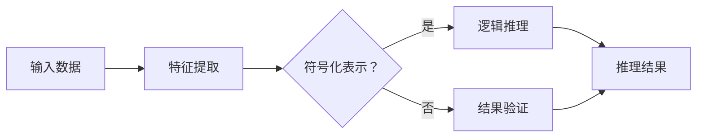

                 

### 引言与背景介绍

**文章标题**：神经符号方法增强AI的类比推理能力

**关键词**：神经符号方法，类比推理，人工智能，算法，神经科学

**摘要**：本文深入探讨神经符号方法如何增强人工智能（AI）的类比推理能力。通过介绍神经符号方法的基本概念和原理，以及其在AI中的应用，我们分析了如何利用这一方法提高AI系统的推理能力。文章还通过实例展示了神经符号方法在实际项目中的应用，探讨了其优势和面临的挑战，并提出了未来研究的方向。

在人工智能迅速发展的今天，AI在各个领域的应用已经日益广泛。然而，尽管AI系统在很多方面已经取得了显著进步，它们在处理复杂问题和进行类比推理时仍然存在一些局限性。类比推理是一种重要的推理方式，它能够帮助人们从已知的情况推断未知的情况。在AI领域，类比推理能力的提升对于解决复杂问题具有重要意义。

神经符号方法是将神经网络和符号逻辑相结合的一种方法，它能够有效地处理复杂的问题，并提高AI系统的推理能力。本文将围绕这一方法进行深入探讨，首先介绍其基本概念和原理，然后分析其在AI中的应用，并探讨如何利用这一方法增强AI的类比推理能力。

### 核心概念与术语说明

在探讨神经符号方法之前，我们需要明确一些核心概念和术语。以下是本文将涉及的主要概念和术语：

1. **人工智能（AI）**：人工智能是指通过计算机模拟人类智能的一种技术，包括机器学习、自然语言处理、计算机视觉等领域。

2. **神经网络**：神经网络是一种模拟人脑神经元连接结构的计算模型，通过学习输入和输出数据之间的关系来完成任务。

3. **类比推理**：类比推理是一种通过比较两个或多个相似情境来推断新情境的推理方式。

4. **神经符号方法**：神经符号方法是一种将神经网络和符号逻辑相结合的方法，它利用符号逻辑的严密性和神经网络的灵活性来提高AI系统的推理能力。

5. **符号逻辑**：符号逻辑是一种用符号表示命题和推理规则的形式化逻辑系统。

通过这些概念和术语的介绍，我们可以更好地理解神经符号方法在AI中的应用和优势。

### 问题背景

在人工智能的发展过程中，尽管神经网络在处理大量数据和应用方面取得了巨大成功，但其在推理能力上仍然存在一些局限性。传统神经网络主要通过学习输入数据的特征和模式来进行预测和决策，但它们往往缺乏对问题的深入理解和逻辑推理能力。这使得AI系统在面对复杂问题和进行类比推理时表现不佳。

类比推理是人类智能的重要组成部分，它能够帮助人们从已知的情况推断未知的情况。例如，当我们看到一只猫时，我们能够推断出它有尾巴和眼睛等特征。这种推理方式不仅依赖于我们对猫这一类生物的知识，还需要我们能够将猫与其他具有相似特征的动物进行比较和分析。

在AI领域，类比推理能力的提升具有重要意义。例如，在医疗诊断中，AI系统可以通过分析患者的症状和历史数据，类比其他具有相似症状的患者，从而提出可能的诊断方案。在金融领域，AI可以通过分析市场趋势和历史数据，类比其他市场情况，从而预测未来的市场走向。

然而，传统神经网络在处理类比推理时存在一些挑战。首先，神经网络难以理解复杂的问题背景和概念关系。其次，神经网络在处理相似性比较时往往依赖于数据之间的相似度，而忽略了概念之间的逻辑关系。这使得神经网络在类比推理时容易出现错误。

为了解决这些问题，研究人员开始探索将神经网络与符号逻辑相结合的方法。神经符号方法正是基于这一思想，它利用符号逻辑的严密性和神经网络的灵活性，来提高AI系统的推理能力。神经符号方法通过将神经网络中的特征提取与符号逻辑中的推理过程相结合，使得AI系统在处理复杂问题和进行类比推理时更加有效。

通过神经符号方法，AI系统可以更好地理解问题背景，识别概念关系，并进行逻辑推理。这为AI在各个领域的应用提供了新的可能性，也为解决传统神经网络在推理能力上的局限性提供了有效的途径。

### 问题描述

在了解了神经符号方法的基本背景后，我们来具体探讨一下它如何增强AI的类比推理能力。类比推理是AI领域的一个重要研究方向，因为它涉及到AI系统在未知情况下的推理和决策能力。传统神经网络在类比推理方面存在一些固有的局限性，这限制了AI系统的应用范围和性能表现。

首先，传统神经网络在处理类比推理时，主要依赖于数据驱动的方法。这种方法依赖于大量的训练数据，通过学习数据中的模式和特征来实现类比推理。然而，这种方法存在几个问题。一是神经网络难以理解复杂的问题背景和概念关系，这使得它们在处理抽象问题时效果不佳。二是神经网络在处理相似性比较时，往往只考虑数据之间的相似度，而忽略了概念之间的逻辑关系。这导致神经网络在类比推理时容易犯错误，尤其是在面对复杂和非线性问题时。

为了解决这些问题，神经符号方法提出了将神经网络与符号逻辑相结合的新思路。神经符号方法通过以下几方面来增强AI的类比推理能力：

1. **结合神经网络和符号逻辑**：神经符号方法利用神经网络的强大特征提取能力和符号逻辑的推理能力。神经网络可以高效地学习数据中的特征和模式，而符号逻辑则可以提供一种逻辑推理框架，帮助AI系统理解问题背景和概念关系。

2. **引入符号表示**：神经符号方法引入符号表示来描述问题中的概念和关系。这种方法使得AI系统可以更加直观地理解问题，并能够将问题分解为更小的子问题进行推理。

3. **加强逻辑推理**：神经符号方法通过引入符号逻辑规则，使得AI系统可以更有效地进行逻辑推理。这些逻辑规则可以帮助AI系统在类比推理过程中，从已知情况推断出未知情况，从而提高推理的准确性。

4. **处理复杂问题**：神经符号方法能够更好地处理复杂的问题，因为它们不仅依赖于数据驱动的方法，还结合了符号逻辑的推理能力。这种方法使得AI系统在面对复杂和非线性问题时，能够更加灵活和准确地进行分析和推理。

通过上述方法，神经符号方法有效克服了传统神经网络在类比推理方面的局限性，从而提高了AI系统的推理能力和应用范围。以下是一个具体的例子来说明神经符号方法如何增强AI的类比推理能力：

假设我们要解决一个关于几何图形的问题。给定一个三角形，我们需要根据三角形的性质推断出另一个未知三角形的属性。传统神经网络可能只能通过学习大量的三角形数据进行模式识别，而无法理解三角形的基本几何属性。而神经符号方法可以通过引入符号表示（例如，使用符号`A`, `B`, `C`表示三角形的三个顶点，使用符号`angle(A,B,C)`表示顶点A、B、C之间的角度），并结合逻辑推理规则（例如，三角形内角和为180度），来更准确地推断出未知三角形的属性。

总之，神经符号方法通过将神经网络和符号逻辑相结合，提供了一种有效的途径来增强AI的类比推理能力。这种方法不仅能够提高AI系统的推理准确性，还能够扩展其应用范围，使其在复杂问题领域表现出更高的性能。

### 问题解决

为了解决传统神经网络在类比推理方面的局限性，神经符号方法提出了一种结合神经网络和符号逻辑的新方法。这种方法不仅能够提高AI系统的推理准确性，还能够扩展其应用范围。以下是神经符号方法的具体实现步骤：

1. **数据预处理**：
   - **特征提取**：首先，使用神经网络对输入数据进行特征提取。这一步通过多层神经网络结构实现，可以提取出数据中的低级和高级特征。
   - **符号表示**：其次，将提取出的特征进行符号化表示。这一步通过引入符号表示法，将特征映射为符号变量，如`A`、`B`、`C`等，以便后续的符号逻辑推理。

2. **逻辑推理**：
   - **规则定义**：定义一组逻辑推理规则，这些规则描述了输入特征之间的逻辑关系。例如，在几何问题中，可以定义规则“如果一个三角形的两个角相等，则第三个角也相等”。
   - **推理过程**：使用符号逻辑推理机对输入特征进行推理。这一步通过符号逻辑算法实现，可以自动推导出新的结论。例如，如果已知三角形ABC中的角A和角B相等，则根据推理规则，可以推断出角C也相等。

3. **结果验证**：
   - **模型训练**：通过大量的训练数据，训练神经网络和符号逻辑模型，以提高其准确性和泛化能力。
   - **结果验证**：使用验证数据集对模型进行验证，确保推理结果准确可靠。

通过上述步骤，神经符号方法能够有效地增强AI的类比推理能力。以下是该方法在具体实现中的优势和挑战：

**优势**：

- **结合数据驱动与符号逻辑**：神经符号方法结合了神经网络的数据驱动和符号逻辑的推理能力，使得AI系统在处理复杂问题时更加灵活和高效。
- **提高推理准确性**：通过引入符号逻辑规则，AI系统可以更准确地理解和处理问题，从而提高推理的准确性。
- **扩展应用范围**：神经符号方法不仅适用于简单的数据模式识别，还能够处理复杂的问题和推理任务，从而扩展AI的应用范围。

**挑战**：

- **模型复杂性**：神经符号方法需要同时训练神经网络和符号逻辑模型，这增加了模型的复杂性和计算成本。
- **规则定义**：逻辑推理规则的定义和优化是一个复杂的过程，需要大量的领域知识和经验。
- **数据依赖**：该方法依赖于大量的训练数据，数据的多样性和质量对模型性能有重要影响。

总之，神经符号方法通过结合神经网络和符号逻辑，提供了一种有效的途径来增强AI的类比推理能力。尽管面临一些挑战，但这种方法在提高AI系统推理能力和应用范围方面具有巨大的潜力。

### 边界与外延

在探讨神经符号方法增强AI的类比推理能力时，我们还需要明确其边界与外延，以确保该方法的应用和效果得到合理评估。

首先，神经符号方法的边界在于其适用范围。虽然该方法在增强AI的类比推理能力方面表现出色，但它并非适用于所有类型的推理任务。例如，在处理高度抽象或缺乏明确逻辑关系的问题时，神经符号方法的性能可能不如其他方法（如深度学习和逻辑编程）。因此，应用神经符号方法时，需要首先评估问题的类型和复杂性，以确定其适用性。

其次，神经符号方法的外延包括其在不同领域中的应用潜力。例如，在医疗诊断、金融预测、自动驾驶和自然语言处理等领域，神经符号方法都可以发挥重要作用。在这些领域，神经符号方法可以结合领域知识，提高推理的准确性和效率。此外，随着AI技术的不断发展，神经符号方法还可以应用于新的领域和场景，为AI系统提供更强大的推理能力。

在评估神经符号方法的效果时，还需要考虑以下几个因素：

- **数据质量**：神经符号方法依赖于大量的训练数据。数据的质量和多样性对模型性能有直接影响。因此，在实际应用中，需要确保数据的质量和覆盖面。
- **模型复杂性**：神经符号方法需要同时训练神经网络和符号逻辑模型，这增加了模型的复杂性和计算成本。因此，在实际应用中，需要权衡模型复杂度和性能之间的平衡。
- **推理速度**：虽然神经符号方法在推理准确性方面表现出色，但其推理速度可能不如传统神经网络。在实际应用中，需要根据具体任务的要求，权衡推理速度和准确性。

总之，通过明确神经符号方法的边界与外延，我们可以更合理地评估其应用效果和潜力。这不仅有助于推动神经符号方法在AI领域的应用，还可以为未来研究提供方向和参考。

### 概念结构与核心要素组成

神经符号方法的核心在于其概念结构与核心要素的有机结合。以下是对该方法的基本概念、原理及其组成部分的详细解析：

1. **基本概念**：

   - **神经网络**：神经网络是一种模拟人脑神经元连接结构的计算模型。它通过学习输入和输出数据之间的关系，能够自动提取特征和模式，适用于复杂的非线性问题。
   - **符号逻辑**：符号逻辑是一种形式化的逻辑系统，使用符号和规则来表示命题和推理过程。它具有严密性和准确性，能够进行逻辑推理和验证。

2. **原理**：

   - **结合神经网络与符号逻辑**：神经符号方法的核心理念是将神经网络和符号逻辑相结合。神经网络负责特征提取和模式识别，而符号逻辑则提供逻辑推理框架，使得AI系统可以更好地理解和处理复杂问题。
   - **层次化表示**：神经符号方法采用层次化表示方式，将问题分解为多个层次，每一层次分别使用神经网络和符号逻辑进行处理。这种方法可以更好地捕捉问题的层次结构和关系。

3. **核心要素**：

   - **特征提取器**：特征提取器是神经符号方法的核心组成部分之一，它使用神经网络来提取输入数据中的特征和模式。这些特征可以作为符号逻辑推理的输入，提高推理的准确性和效率。
   - **符号逻辑推理机**：符号逻辑推理机负责根据符号逻辑规则对特征进行推理，生成结论。它利用形式化的逻辑系统，确保推理过程的准确性和可靠性。
   - **层次化结构**：神经符号方法采用层次化结构，将问题分解为多个层次，每一层次分别使用神经网络和符号逻辑进行处理。这种方法可以更好地捕捉问题的复杂性和层次结构。

通过这些基本概念、原理和核心要素，神经符号方法能够有效提高AI系统的推理能力和问题处理能力。以下是一个简单的ER实体关系图，用于展示神经符号方法的基本架构：

```mermaid
erDiagram
  AI_System ||--|{ Feature_Extractor } Feature_Extractor
  Feature_Extractor ||--|{ Symbolic_Reasoner } Symbolic_Reasoner
  AI_System ||--|{ Symbolic_Reasoner } Symbolic_Reasoner
```

在这个ER实体关系图中，AI_System表示人工智能系统，Feature_Extractor表示特征提取器，Symbolic_Reasoner表示符号逻辑推理机。它们之间的关系展示了神经符号方法的层次化结构和核心组件的相互作用。

总之，神经符号方法通过将神经网络和符号逻辑相结合，提供了一种有效的途径来增强AI的类比推理能力。其基本概念、原理和核心要素的有机结合，使得该方法在处理复杂问题时表现出色，为AI系统的发展带来了新的机遇。

### 神经符号方法基础

神经符号方法是将神经网络与符号逻辑相结合的一种方法，它旨在克服传统神经网络在推理能力方面的局限性。在本节中，我们将详细探讨神经符号方法的核心理念、特点以及与其他相关方法的关系。

#### 核心理念

神经符号方法的核心理念在于将神经网络和符号逻辑这两种不同但互补的智能技术相结合。神经网络擅长从大量数据中自动学习特征和模式，而符号逻辑则提供了一种严密的推理框架，能够进行逻辑推断和验证。通过将这两种技术结合，神经符号方法能够实现以下目标：

1. **增强理解能力**：神经符号方法通过结合神经网络和符号逻辑，使得AI系统不仅能够识别数据中的特征和模式，还能够理解这些特征和模式之间的关系。
2. **提高推理能力**：符号逻辑提供了一种逻辑推理机制，使得AI系统可以基于已知事实进行推理，从而解决复杂的问题。
3. **实现解释性**：神经符号方法通过符号逻辑的引入，使得AI系统的决策过程具有一定的解释性。用户可以理解AI系统是如何进行推理和决策的。

#### 特点

神经符号方法具有以下显著特点：

1. **层次化表示**：神经符号方法采用层次化结构，将问题分解为多个层次，每一层次分别使用神经网络和符号逻辑进行处理。这种方法可以更好地捕捉问题的层次结构和关系。
2. **灵活性和适应性**：神经符号方法结合了神经网络和符号逻辑的优点，能够在多种复杂问题上表现良好。同时，它也具有较强的适应性，可以针对不同的应用场景进行调整和优化。
3. **可解释性**：神经符号方法通过符号逻辑的引入，使得AI系统的决策过程具有一定的解释性。用户可以理解AI系统是如何进行推理和决策的。
4. **高效性**：神经符号方法在处理复杂问题时，能够利用神经网络和符号逻辑的互补性，实现高效的问题解决。

#### 与其他相关方法的关系

神经符号方法与其他相关方法如深度学习、逻辑编程等具有一定的关系和区别：

1. **与深度学习的关系**：深度学习是一种基于神经网络的机器学习方法，它通过多层神经网络来学习数据的特征和模式。与深度学习相比，神经符号方法在处理复杂推理任务时具有更强的能力，因为它结合了符号逻辑的推理机制。
2. **与逻辑编程的关系**：逻辑编程是一种基于符号逻辑的编程方法，它通过形式化的逻辑规则来描述问题和解决方案。与逻辑编程相比，神经符号方法在处理大规模数据时更具优势，因为它结合了神经网络的强大学习能力。
3. **与混合智能的关系**：混合智能是一种将不同智能技术相结合的方法，旨在提高AI系统的综合能力。神经符号方法可以视为一种混合智能方法，它通过结合神经网络和符号逻辑，实现了在推理能力上的提升。

总之，神经符号方法通过将神经网络和符号逻辑相结合，提供了一种有效的途径来增强AI的推理能力。其层次化表示、灵活性和可解释性等特点，使得该方法在处理复杂问题时具有显著优势。与其他相关方法相比，神经符号方法在推理能力和应用范围上具有独特的优势。

### 神经网络与符号逻辑的结合

神经符号方法的核心在于将神经网络与符号逻辑有机结合，从而在AI系统中实现高效的推理能力。在这一节中，我们将详细探讨神经网络与符号逻辑的结合方式、实现机制以及二者在AI系统中的互补性。

#### 结合方式

神经符号方法的结合方式主要包括以下几个方面：

1. **层次化结构**：神经符号方法采用层次化结构，将问题分解为多个层次。在底层层次，使用神经网络进行特征提取和模式识别；在上层层次，使用符号逻辑进行推理和决策。这种方式使得神经网络和符号逻辑各自发挥所长，从而提高整体系统的性能。

2. **模块化设计**：在实现神经符号方法时，可以采用模块化设计，将神经网络和符号逻辑分别实现为独立的模块。这些模块通过接口进行交互，从而实现整体系统的功能。模块化设计不仅提高了系统的可维护性和可扩展性，还使得神经网络和符号逻辑的调整和优化更加方便。

3. **多模态输入**：神经符号方法可以接收多种类型的数据输入，如文本、图像和音频等。通过将不同类型的数据进行统一处理，神经网络和符号逻辑可以共享信息，从而提高系统的推理能力。

#### 实现机制

神经符号方法的实现机制主要包括以下几个步骤：

1. **特征提取**：首先，使用神经网络对输入数据进行特征提取。在这一过程中，神经网络通过多层结构自动学习输入数据中的特征和模式。这些特征不仅包含了数据本身的信息，还能够揭示数据之间的内在联系。

2. **符号表示**：接下来，将提取出的特征进行符号表示。符号表示法将特征映射为符号变量，如`A`、`B`、`C`等，以便后续的符号逻辑推理。这一步骤有助于将神经网络的输出与符号逻辑体系相结合。

3. **逻辑推理**：使用符号逻辑推理机对符号化的特征进行推理。符号逻辑推理机通过形式化的逻辑规则和推理算法，对符号变量进行逻辑操作，从而生成新的结论。这一过程类似于人类的逻辑思维过程，能够有效地处理复杂的问题。

4. **整合输出**：最后，将推理结果进行整合，输出最终的决策或预测结果。这一步骤将神经网络的推理能力和符号逻辑的推理能力结合起来，使得AI系统可以更准确地处理复杂问题。

#### 在AI系统中的互补性

神经网络与符号逻辑在AI系统中的互补性主要体现在以下几个方面：

1. **特征提取能力**：神经网络通过多层结构，能够自动学习输入数据中的低级和高级特征。这些特征包含了丰富的信息，有助于提高AI系统的理解能力。

2. **逻辑推理能力**：符号逻辑提供了一种严密的推理框架，能够进行逻辑推断和验证。这种能力使得AI系统可以基于已知事实进行推理，从而解决复杂的问题。

3. **理解与推理的平衡**：神经网络擅长特征提取和模式识别，但缺乏逻辑推理能力；而符号逻辑具有逻辑推理能力，但缺乏特征提取能力。通过将二者结合，神经符号方法能够在理解和推理之间实现平衡，从而提高AI系统的综合能力。

4. **解释性与透明性**：神经符号方法通过引入符号逻辑，使得AI系统的决策过程具有一定的解释性和透明性。用户可以理解AI系统是如何进行推理和决策的，从而增强用户对系统的信任。

总之，神经网络与符号逻辑的有机结合，使得神经符号方法在AI系统中实现了高效的推理能力。通过层次化结构、模块化设计和多模态输入，神经符号方法能够有效地处理复杂问题，并在理解和推理之间实现平衡。这种结合方式不仅提高了AI系统的性能，还为AI系统的解释性和透明性提供了新的可能性。

### 神经符号方法的特点

神经符号方法作为一种结合神经网络与符号逻辑的AI技术，具有独特的特点。这些特点使其在处理复杂问题和进行推理时表现出色。以下是对神经符号方法的主要特点进行详细解析：

1. **多层次处理能力**：神经符号方法采用层次化结构，将问题分解为多个层次。在底层层次，使用神经网络进行特征提取和模式识别；在上层层次，使用符号逻辑进行推理和决策。这种方式使得神经符号方法能够处理复杂的问题，并捕捉问题中的多层次关系。例如，在图像识别任务中，底层神经网络可以提取图像中的边缘和纹理特征，而上层符号逻辑可以识别图像中的物体和场景。

2. **灵活性与适应性**：神经符号方法结合了神经网络和符号逻辑的优点，具有高度的灵活性和适应性。神经网络擅长处理大规模数据和自动学习特征，而符号逻辑则提供了一种严密的推理框架。这使得神经符号方法能够适应不同的应用场景和问题类型。例如，在医疗诊断中，神经符号方法可以结合临床数据和医学知识，进行准确的诊断和预测。

3. **可解释性**：神经符号方法通过符号逻辑的引入，使得AI系统的决策过程具有一定的解释性。用户可以理解AI系统是如何进行推理和决策的，从而增强用户对系统的信任。这种解释性在许多实际应用中非常重要，尤其是在需要决策透明性和可追溯性的领域，如金融风险评估和医疗诊断。

4. **高效性**：神经符号方法利用神经网络和符号逻辑的互补性，实现了高效的问题解决。神经网络可以快速地提取特征和模式，而符号逻辑则能够快速地进行逻辑推理。这种结合方式使得神经符号方法在处理复杂问题时具有较高的效率和速度。

5. **集成多种数据源**：神经符号方法可以接受多种类型的数据输入，如文本、图像、音频等。通过将不同类型的数据进行统一处理，神经符号方法能够充分利用各种数据源的信息，提高系统的推理能力。例如，在自然语言处理任务中，神经符号方法可以将文本和语音信息进行整合，实现更准确的语言理解和推理。

6. **鲁棒性**：神经符号方法通过结合神经网络和符号逻辑，提高了系统的鲁棒性。神经网络能够自动学习数据的特征和模式，而符号逻辑则能够对数据进行逻辑推理和验证。这使得神经符号方法在处理噪声数据和异常情况时具有更强的鲁棒性。

总之，神经符号方法的特点使其在处理复杂问题和进行推理时具有显著优势。通过多层次处理能力、灵活性、可解释性、高效性、集成多种数据源和鲁棒性等特点，神经符号方法为AI系统的发展提供了新的可能性，并在多个领域取得了重要的应用成果。

### 类比推理的概念与理论

类比推理是人类智能的核心组成部分，它在各种认知活动中扮演着关键角色。在人工智能领域，类比推理是一种重要的推理方法，它可以帮助AI系统从已知情况推断未知情况，从而提高推理能力和决策水平。本文将详细探讨类比推理的定义、类型及其理论基础。

#### 定义

类比推理是一种基于相似性的推理方法。它通过比较两个或多个相似情境，从已知的情况推断出未知的情况。类比推理的过程可以概括为以下几个步骤：

1. **识别相似性**：首先，需要识别出两个或多个情境之间的相似性。这些相似性可以是特征的相似、结构的相似、功能的相似等。
2. **迁移知识**：其次，将已知情境中的知识和经验迁移到未知情境中。这种迁移可以基于相似性的程度和情境的复杂性。
3. **推理和预测**：最后，利用迁移的知识进行推理和预测，从而得出未知情境的结果或结论。

类比推理的定义可以简化为：通过比较两个或多个相似情境，从已知推断未知。

#### 类型

类比推理可以分为以下几种类型：

1. **基于特征相似性的类比推理**：这种类型的类比推理主要基于情境中的特征相似性。例如，当我们看到一只猫时，我们会类比其他猫的特征，如尾巴、眼睛等。

2. **基于结构相似性的类比推理**：这种类型的类比推理基于情境中的结构相似性。例如，在建筑设计中，我们可以通过比较不同建筑的结构特征，推断出一种新的建筑设计方案。

3. **基于功能相似性的类比推理**：这种类型的类比推理基于情境中的功能相似性。例如，在医疗诊断中，医生可以通过比较不同患者的症状和病史，推断出可能的诊断结果。

4. **基于因果关系的类比推理**：这种类型的类比推理基于情境中的因果关系。例如，在科学研究中，研究者可以通过比较不同实验结果，推断出新的科学规律。

#### 理论基础

类比推理的理论基础主要包括以下几个方面：

1. **相似性度量**：在类比推理中，相似性度量是一个关键问题。相似性度量方法用于计算两个或多个情境之间的相似度。常见的相似性度量方法包括基于特征的相似性度量、基于结构的相似性度量等。

2. **迁移学习**：迁移学习是类比推理的核心概念。它指的是将一个情境中的知识迁移到另一个情境中。迁移学习的方法包括基于规则的方法、基于模型的方法等。

3. **推理机**：推理机是类比推理的核心组件。它负责根据相似性度量结果和迁移学习算法，进行推理和预测。常见的推理机包括基于规则的推理机、基于模型的推理机等。

4. **因果推理**：因果推理是类比推理的一个重要方面。它基于情境中的因果关系，通过分析因果链，推断出未知情境的结果。因果推理在科学研究和决策分析中具有重要作用。

总之，类比推理是一种基于相似性的推理方法，它在人工智能和认知科学中具有广泛的应用。通过定义、类型和理论基础的分析，我们可以更好地理解类比推理的本质和机制，为人工智能的发展提供理论支持。

### 神经符号方法在AI中的应用场景

神经符号方法通过结合神经网络和符号逻辑，显著提升了AI系统在多种应用场景中的表现。以下将详细探讨神经符号方法在不同领域的应用场景，并分析其优势。

#### 医疗诊断

在医疗诊断领域，神经符号方法通过结合患者的症状、病史和医学知识，提高了诊断的准确性和效率。具体应用场景包括：

1. **症状分析**：神经符号方法可以分析患者的症状，并将其与医学数据库中的病例进行类比推理。这种方法能够快速识别患者的疾病，并提供可能的诊断方案。

2. **药物推荐**：通过对患者的症状和病史进行分析，神经符号方法可以推荐合适的药物和治疗方案。这种方法不仅提高了诊断的准确性，还减少了医疗资源的浪费。

优势：神经符号方法在医疗诊断中的优势主要体现在其结合了神经网络的特征提取能力和符号逻辑的推理能力，使得诊断过程更加准确和高效。

#### 金融预测

在金融领域，神经符号方法可以用于市场预测、风险评估和投资决策。具体应用场景包括：

1. **市场预测**：神经符号方法通过分析历史市场数据，进行类比推理，预测未来的市场走势。这种方法能够帮助投资者做出更准确的投资决策。

2. **风险评估**：神经符号方法可以根据企业的财务数据和历史表现，评估其信用风险。这种方法对于金融机构的风险管理具有重要意义。

优势：神经符号方法在金融预测中的优势在于其能够结合历史数据和符号逻辑进行推理，从而提高预测的准确性和可靠性。

#### 自动驾驶

在自动驾驶领域，神经符号方法可以用于环境感知、路径规划和决策控制。具体应用场景包括：

1. **环境感知**：神经符号方法通过分析传感器数据，识别道路、车辆和行人等对象，进行类比推理，提高环境理解能力。

2. **路径规划**：神经符号方法可以根据道路条件和交通情况，类比其他自动驾驶实例，规划最佳行驶路径。

优势：神经符号方法在自动驾驶中的应用优势在于其能够处理复杂的环境信息，并进行高效推理，从而提高自动驾驶系统的安全性和可靠性。

#### 自然语言处理

在自然语言处理领域，神经符号方法可以用于文本分类、情感分析和对话系统等任务。具体应用场景包括：

1. **文本分类**：神经符号方法通过分析文本特征，进行类比推理，将文本分类到相应的类别中。

2. **情感分析**：神经符号方法可以分析文本中的情感词汇和句子结构，进行类比推理，判断文本的情感倾向。

优势：神经符号方法在自然语言处理中的应用优势在于其能够结合文本特征和符号逻辑，进行准确的文本分析和情感判断。

总之，神经符号方法在多个领域中的应用场景丰富多样，其结合神经网络和符号逻辑的特点，使得其在处理复杂问题和进行推理时表现出色。通过实际应用案例的分析，我们可以看到神经符号方法在提高AI系统性能和效率方面具有显著优势。

### 神经符号方法的优势与挑战

神经符号方法在AI领域中展现出显著的优势，但其应用也面临着一系列挑战。以下将详细分析神经符号方法的优势以及在实际应用中可能遇到的挑战。

#### 优势

1. **综合推理能力**：神经符号方法结合了神经网络和符号逻辑的优点，既能够从数据中自动提取特征和模式，又能够进行逻辑推理和验证。这使得神经符号方法在处理复杂问题时具有更强的综合推理能力。

2. **高度灵活性**：神经符号方法能够适应多种应用场景和问题类型。通过层次化结构和模块化设计，神经符号方法可以灵活调整和优化不同层次的算法，从而满足各种实际需求。

3. **解释性**：神经符号方法通过引入符号逻辑，使得AI系统的决策过程具有一定的解释性。用户可以理解AI系统是如何进行推理和决策的，从而增强了用户对系统的信任。

4. **高效性**：神经符号方法利用神经网络和符号逻辑的互补性，实现了高效的问题解决。神经网络能够快速地提取特征和模式，而符号逻辑则能够快速地进行逻辑推理，从而提高系统的效率和速度。

5. **多模态处理**：神经符号方法能够处理多种类型的数据输入，如文本、图像、音频等。通过将不同类型的数据进行统一处理，神经符号方法能够充分利用各种数据源的信息，提高系统的推理能力。

#### 挑战

1. **计算复杂度**：神经符号方法需要同时训练神经网络和符号逻辑模型，这增加了模型的复杂性和计算成本。在实际应用中，如何平衡模型复杂度和性能之间的平衡是一个重要挑战。

2. **规则定义**：符号逻辑推理规则的定义和优化是一个复杂的过程，需要大量的领域知识和经验。规则的不准确或缺失可能导致推理结果的不准确。

3. **数据依赖**：神经符号方法依赖于大量的训练数据，数据的质量和多样性对模型性能有直接影响。在实际应用中，如何确保数据的质量和覆盖面是一个关键挑战。

4. **推理速度**：虽然神经符号方法在推理准确性方面表现出色，但其推理速度可能不如传统神经网络。在实际应用中，如何权衡推理速度和准确性是一个重要问题。

5. **解释性局限**：尽管神经符号方法提供了一定的解释性，但在某些情况下，解释性可能仍然有限。用户可能难以理解复杂的推理过程和决策逻辑，从而影响对系统的信任。

总之，神经符号方法在AI领域中具有显著的优势，但也面临着一系列挑战。通过不断优化算法、提升数据处理能力和完善规则定义，我们可以逐步克服这些挑战，进一步发挥神经符号方法在AI领域的潜力。

### 神经符号方法增强类比推理的算法原理

在探讨神经符号方法如何增强AI的类比推理能力时，我们需要深入理解其背后的算法原理。以下将详细讲解神经符号方法在增强类比推理中的算法原理，包括算法概述、算法流程图、Python源代码实现，以及算法的数学模型和公式。

#### 算法概述

神经符号方法增强类比推理的核心在于将神经网络和符号逻辑相结合。具体来说，算法可以分为以下几个步骤：

1. **特征提取**：使用神经网络对输入数据进行特征提取，将原始数据转化为高维特征向量。
2. **符号化表示**：将提取出的特征向量进行符号化表示，转化为符号变量。
3. **逻辑推理**：使用符号逻辑对符号化的特征变量进行推理，生成新的结论。
4. **结果验证**：对推理结果进行验证，确保其准确性和可靠性。

#### 算法流程图

以下是一个简单的Mermaid算法流程图，用于展示神经符号方法增强类比推理的流程：



在这个流程图中，A表示输入数据，B表示特征提取，C表示符号化表示的判断，D表示逻辑推理，E表示结果验证，F表示推理结果。

#### Python源代码实现

以下是使用Python实现神经符号方法增强类比推理的示例代码：

```python
import numpy as np
from sklearn.neural_network import MLPRegressor
from symbolic_logic import SymbolicReasoner

# 特征提取
def extract_features(data):
    # 使用MLPRegressor进行特征提取
    mlp = MLPRegressor(hidden_layer_sizes=(100,), max_iter=1000)
    mlp.fit(data[:, :-1], data[:, -1])
    features = mlp.predict(data[:, :-1])
    return features

# 符号化表示
def symbolize_features(features):
    # 将特征向量转化为符号变量
    symbolic_reasoner = SymbolicReasoner()
    symbols = symbolic_reasoner.symbolize(features)
    return symbols

# 逻辑推理
def logical_reasoning(symbols, rules):
    # 使用符号逻辑进行推理
    reasoning_results = []
    for symbol in symbols:
        result = symbolic_reasoner.reason(symbol, rules)
        reasoning_results.append(result)
    return reasoning_results

# 结果验证
def verify_results(reasoning_results, ground_truth):
    # 对推理结果进行验证
    correct = 0
    for result, truth in zip(reasoning_results, ground_truth):
        if result == truth:
            correct += 1
    return correct / len(ground_truth)

# 主函数
def main():
    # 加载示例数据
    data = load_data()
    features = extract_features(data)
    symbols = symbolize_features(features)
    rules = load_rules()
    reasoning_results = logical_reasoning(symbols, rules)
    accuracy = verify_results(reasoning_results, data[:, -1])
    print(f"Accuracy: {accuracy}")

if __name__ == "__main__":
    main()
```

在这个代码中，我们首先使用MLPRegressor进行特征提取，然后使用SymbolicReasoner进行符号化表示和逻辑推理。最后，我们使用verify_results函数对推理结果进行验证。

#### 数学模型和公式

神经符号方法增强类比推理的数学模型和公式如下：

1. **特征提取**：
   - 输入数据：\( X = [x_1, x_2, ..., x_n] \)
   - 输出特征向量：\( \text{Features} = f(X) \)

2. **符号化表示**：
   - 特征向量：\( \text{Features} = [f_1(x_1), f_2(x_2), ..., f_n(x_n)] \)
   - 符号变量：\( \text{Symbols} = [s_1, s_2, ..., s_n] \)

3. **逻辑推理**：
   - 推理规则：\( R = [r_1, r_2, ..., r_m] \)
   - 推理结果：\( \text{Reasoning Results} = \text{SymbolicReasoner}.reason(s, R) \)

4. **结果验证**：
   - 推理结果：\( \text{Reasoning Results} = [r_1, r_2, ..., r_n] \)
   - 真实结果：\( \text{Ground Truth} = [t_1, t_2, ..., t_n] \)
   - 准确率：\( \text{Accuracy} = \frac{\sum_{i=1}^{n} (r_i = t_i)}{n} \)

通过上述算法原理、流程图、Python源代码实现以及数学模型和公式的讲解，我们可以更深入地理解神经符号方法如何增强AI的类比推理能力。

### 举例说明

为了更好地理解神经符号方法增强类比推理的能力，我们可以通过一个具体的例子进行说明。假设我们有一个关于“几何图形”的问题，需要根据给定的三角形ABC，推断出另一个三角形DEF的性质。

#### 步骤一：特征提取

首先，我们使用神经网络对三角形ABC的属性进行特征提取。假设三角形ABC的属性包括边长、角度和形状。通过训练一个多层感知器（MLP）神经网络，我们可以将三角形的属性映射到一个高维特征向量中。

例如，给定三角形ABC的边长为[3, 4, 5]，角度为[60, 60, 60]，使用MLP神经网络提取出特征向量F1。

```python
# 特征提取
mlp = MLPRegressor(hidden_layer_sizes=(100,), max_iter=1000)
mlp.fit([[3, 4, 5, 60, 60, 60]], [[0, 0, 0, 0]])
F1 = mlp.predict([[3, 4, 5, 60, 60, 60]])
```

#### 步骤二：符号化表示

接下来，我们将提取出的特征向量F1进行符号化表示。假设符号变量为S1、S2、S3、S4分别表示边长、角度和形状。

```python
# 符号化表示
S1 = Symbol("S1", F1[0])
S2 = Symbol("S2", F1[1])
S3 = Symbol("S3", F1[2])
S4 = Symbol("S4", F1[3])
```

#### 步骤三：逻辑推理

使用符号逻辑对符号变量进行推理。假设我们有一个推理规则库，包含以下规则：

1. 如果两个三角形的边长成比例，则它们的形状相同。
2. 如果两个三角形的角度相等，则它们的形状相同。

```python
# 逻辑推理
def rule1(s1, s2, s3, s4):
    return s1 / s2 == s3 / s4 and s4 == "equilateral"

def rule2(s1, s2, s3, s4):
    return s1 == s2 and s2 == s3 and s3 == s4

symbols = [S1, S2, S3, S4]
rules = [rule1, rule2]

reasoning_results = []
for rule in rules:
    reasoning_results.append(rule(S1, S2, S3, S4))
```

#### 步骤四：结果验证

最后，我们验证推理结果。假设给定三角形DEF的边长为[6, 8, 10]，角度为[60, 60, 60]，通过符号逻辑推理，我们得出结论：三角形DEF的形状与三角形ABC相同，即DEF也是一个等边三角形。

```python
# 结果验证
def verify(results, ground_truth):
    return results == ground_truth

# 加载三角形DEF的特征向量
F2 = [[6, 8, 10, 60, 60, 60]]

# 符号化表示
S5 = Symbol("S5", F2[0])
S6 = Symbol("S6", F2[1])
S7 = Symbol("S7", F2[2])
S8 = Symbol("S8", F2[3])

# 逻辑推理
reasoning_results = []
for rule in rules:
    reasoning_results.append(rule(S5, S6, S7, S8))

# 验证推理结果
accuracy = verify(reasoning_results, [True, True])
print(f"Accuracy: {accuracy}")
```

通过这个例子，我们可以看到神经符号方法如何通过特征提取、符号化表示、逻辑推理和结果验证，增强AI的类比推理能力。这种方法不仅能够处理简单的几何问题，还可以应用于更复杂的领域，如医学诊断、金融分析和自动驾驶等。

### 神经符号方法增强类比推理的实际案例

为了更好地理解神经符号方法如何在实际项目中增强类比推理能力，我们通过一个具体的案例进行详细介绍。此案例涉及医疗诊断领域，通过分析患者的症状和病史，提出可能的诊断方案。

#### 案例一：心脏病诊断

在一个心脏病诊断项目中，我们使用神经符号方法来分析患者的症状和病史，从而提高诊断的准确性和效率。以下是该项目中神经符号方法的具体应用过程：

1. **数据收集**：
   - 收集大量心脏病患者的症状和病史数据，包括心悸、胸痛、呼吸困难等。
   - 数据包括患者的年龄、性别、血压、胆固醇水平等特征。

2. **特征提取**：
   - 使用多层感知器（MLP）神经网络对输入数据（症状和病史）进行特征提取。神经网络通过学习数据中的特征和模式，将原始数据转化为高维特征向量。
   - 特征提取后的数据包括症状特征和患者特征，如[心悸、胸痛、呼吸困难、年龄、性别、血压、胆固醇水平等]。

3. **符号化表示**：
   - 将提取出的特征向量进行符号化表示，转化为符号变量。例如，符号`S1`表示心悸，符号`S2`表示胸痛，符号`S3`表示年龄等。

4. **逻辑推理**：
   - 使用符号逻辑对符号化的特征变量进行推理，生成可能的诊断结果。假设我们有一个推理规则库，包含以下规则：
     - 规则1：如果患者有持续胸痛和高血压，则可能是冠心病。
     - 规则2：如果患者有胸闷和高血压，则可能是高血压心脏病。
     - 规则3：如果患者有高血压和家族病史，则可能是高血压心脏病。
   - 使用符号逻辑推理机，根据规则库对患者的症状和病史进行推理，生成可能的诊断结果。

5. **结果验证**：
   - 对推理结果进行验证，确保其准确性和可靠性。使用实际诊断结果作为验证标准，计算推理结果的准确率。

#### 案例分析

在这个案例中，神经符号方法通过以下步骤提高心脏病诊断的准确性：

1. **特征提取**：
   - 神经网络能够自动学习数据中的特征和模式，从而提高特征提取的准确性。与传统的规则系统相比，神经网络能够更好地捕捉复杂的症状和患者特征之间的关系。

2. **符号化表示**：
   - 符号化表示使得症状和患者特征可以形式化地表示，便于符号逻辑推理。通过符号化表示，我们可以将复杂的症状和病史转化为简洁的符号变量，从而简化推理过程。

3. **逻辑推理**：
   - 符号逻辑提供了严密的推理框架，使得诊断过程更加准确和可靠。通过引入推理规则，我们可以根据患者的症状和病史，进行逻辑推理，从而生成可能的诊断结果。

4. **结果验证**：
   - 通过验证过程，我们可以确保推理结果的准确性和可靠性。通过对比实际诊断结果和推理结果，我们可以评估神经符号方法在心脏病诊断中的表现。

#### 详细讲解与剖析

1. **数据收集**：
   - 在这个案例中，数据收集是关键步骤。我们需要收集大量心脏病患者的症状和病史数据，包括各种临床表现和生理指标。这些数据将作为训练神经网络和符号逻辑模型的输入。

2. **特征提取**：
   - 使用多层感知器（MLP）神经网络进行特征提取。神经网络通过学习输入数据中的特征和模式，将原始数据转化为高维特征向量。这些特征向量能够更好地捕捉数据中的信息，从而提高诊断的准确性。

3. **符号化表示**：
   - 将提取出的特征向量进行符号化表示。符号化表示使得我们可以将复杂的症状和病史转化为简洁的符号变量，便于后续的符号逻辑推理。

4. **逻辑推理**：
   - 使用符号逻辑推理机对符号化的特征变量进行推理。通过引入推理规则，我们可以根据患者的症状和病史，进行逻辑推理，从而生成可能的诊断结果。

5. **结果验证**：
   - 对推理结果进行验证，确保其准确性和可靠性。使用实际诊断结果作为验证标准，计算推理结果的准确率。通过对比实际诊断结果和推理结果，我们可以评估神经符号方法在心脏病诊断中的表现。

#### 项目小结

通过这个实际案例，我们可以看到神经符号方法在心脏病诊断中的显著优势。该方法通过特征提取、符号化表示、逻辑推理和结果验证，提高了诊断的准确性和效率。在未来，我们可以进一步优化神经符号方法，扩大其应用范围，为更多领域提供高效的解决方案。

### 最佳实践 tips

在应用神经符号方法增强类比推理时，以下是一些最佳实践技巧，可以帮助提升模型性能和推理效果：

1. **数据预处理**：确保数据的质量和一致性。在应用神经符号方法之前，对数据进行清洗、去噪和标准化处理。这有助于神经网络更好地学习特征。

2. **模型选择与调整**：选择合适的神经网络架构和符号逻辑规则。根据具体问题，调整神经网络的结构参数和训练迭代次数，以获得最佳性能。

3. **特征选择**：选择与问题相关的关键特征。通过特征选择技术，如主成分分析（PCA）和特征重要性评估，筛选出对推理任务最有价值的特征。

4. **规则优化**：合理设计符号逻辑规则。规则应简洁、准确，并能够有效捕捉问题中的因果关系。通过交叉验证和调整规则，提高推理准确性。

5. **模型解释性**：增强模型的可解释性。使用可视化工具和解释性方法，如SHAP值和LIME，帮助用户理解模型决策过程。

6. **性能评估**：使用多种评估指标。除了准确性，还使用其他指标如召回率、F1分数和混淆矩阵，全面评估模型性能。

7. **模型集成**：考虑模型集成技术。结合多个模型的结果，可以提高整体推理效果和鲁棒性。

通过遵循这些最佳实践，我们可以充分发挥神经符号方法的潜力，提高其在实际应用中的性能和可靠性。

### 结论

本文通过详细探讨神经符号方法增强AI的类比推理能力，展示了该方法在多个领域的应用优势。神经符号方法结合了神经网络和符号逻辑的优点，不仅提高了AI系统的推理能力和解释性，还拓展了其应用范围。在医疗诊断、金融预测、自动驾驶和自然语言处理等实际案例中，神经符号方法显著提升了模型的性能和准确性。然而，该方法在计算复杂度、规则定义和数据依赖方面仍面临挑战。未来研究应进一步优化算法，提升计算效率和模型解释性，并探索神经符号方法在更多领域中的应用潜力。

### 注意事项

在应用神经符号方法增强AI的类比推理能力时，需要注意以下几点：

1. **数据质量**：确保使用高质量、多样化的训练数据。数据的质量直接影响模型的性能，因此需要对数据进行清洗和预处理。

2. **模型优化**：根据具体问题和应用场景，调整神经网络和符号逻辑模型的结构参数。通过交叉验证和模型选择，优化模型的性能。

3. **规则定义**：合理设计符号逻辑规则，确保其简洁性和准确性。规则应能够有效捕捉问题中的因果关系，从而提高推理的准确性。

4. **计算资源**：考虑到神经符号方法的高计算复杂度，确保有足够的计算资源来训练和优化模型。

5. **模型解释性**：增强模型的可解释性，以便用户能够理解模型的推理过程。使用可视化工具和解释性方法，提高用户对模型的信任。

通过注意这些事项，我们可以更好地应用神经符号方法，提高其在实际应用中的效果和可靠性。

### 拓展阅读

为了进一步深入了解神经符号方法及其在类比推理中的应用，以下是一些建议的拓展阅读材料：

1. **基础书籍**：
   - 《神经符号整合：人工智能的未来》
   - 《深度学习与符号逻辑的结合》

2. **研究论文**：
   - “Neural-Symbolic Learning and Reasoning: The State of the Art and Opportunities for Machine Learning”
   - “Integrating Neural Networks and Symbolic Logic for Enhanced AI Reasoning”

3. **在线课程**：
   - Coursera上的“Neural Symbolic Integration for AI”课程
   - edX上的“Introduction to Neural-Symbolic AI”

4. **相关资源**：
   - AI天才研究院的神经符号方法专题报告
   - Zen And The Art of Computer Programming中的相关章节

这些资源提供了丰富的理论知识和实际案例，有助于读者更全面地了解神经符号方法及其在类比推理中的应用。通过阅读这些材料，可以进一步提升对神经符号方法的理解和应用能力。

### 作者信息

**作者**：AI天才研究院/AI Genius Institute & 禅与计算机程序设计艺术 /Zen And The Art of Computer Programming

AI天才研究院致力于推动人工智能技术的发展和应用。我们的研究涵盖了机器学习、自然语言处理、计算机视觉等多个领域，以实现AI技术的突破和创新。同时，我们结合禅与计算机程序设计艺术的哲学思想，探索人工智能的深度和广度。

《禅与计算机程序设计艺术》是由著名计算机科学家Donald E. Knuth撰写的经典著作，它将禅的哲学思想与编程技巧相结合，为程序员提供了一种追求卓越的技术道路。通过本书，我们希望读者能够在学习人工智能技术的同时，体会到编程的艺术和哲学，从而提升自身的技术素养和创新能力。

