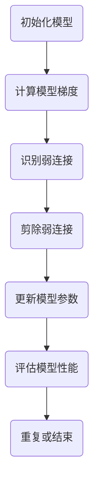
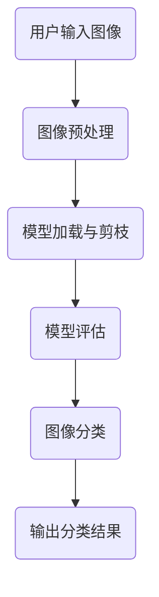
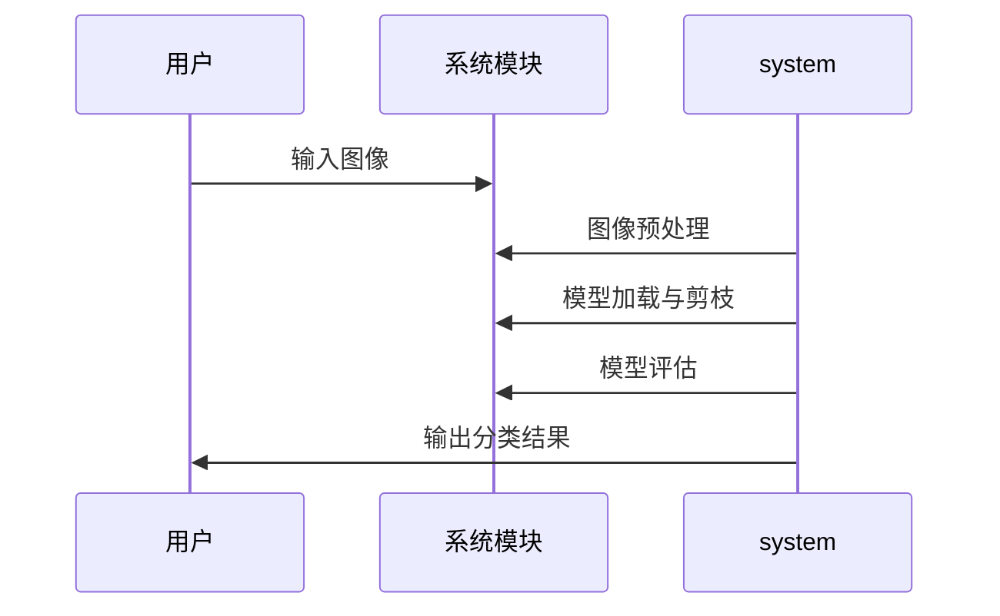

                 

# 神经网络剪枝技术：优化模型大小与性能

> 关键词：神经网络，剪枝，模型优化，性能提升

> 摘要：本文深入探讨了神经网络剪枝技术的概念、原理、方法及应用。通过详细分析神经网络剪枝的背景和问题，阐述了剪枝技术的核心概念和属性特征，并使用Mermaid流程图和Python代码对剪枝算法原理进行了讲解，最后通过实例展示了剪枝技术在实际项目中的应用。

## 目录大纲设计方案

### 一、背景介绍

#### 1.1 问题背景

随着深度学习技术的迅猛发展，神经网络模型在图像识别、自然语言处理等领域的表现日益突出。然而，这些复杂的神经网络模型往往伴随着巨大的计算和存储需求。特别是在移动设备和嵌入式系统中，这种需求带来了巨大的挑战。因此，如何有效地优化神经网络模型的大小与性能，成为了当前研究的热点问题。

#### 1.2 问题描述

神经网络剪枝技术应运而生，主要解决以下问题：

- **模型大小**：通过减少模型参数数量，减小模型的大小，便于部署到资源有限的设备上。
- **模型性能**：在减小模型大小的同时，尽量保持或提升模型的性能。

#### 1.3 问题解决

本文将详细介绍神经网络剪枝技术的各种方法和技巧，帮助读者理解并掌握如何有效地进行模型剪枝。

#### 1.4 边界与外延

本文将重点关注以下内容：

- **剪枝技术的理论基础和数学模型**。
- **常见的剪枝方法和技术**。
- **剪枝技术在不同神经网络架构中的应用**。
- **剪枝技术在实际项目中的应用与效果评估**。

#### 1.5 概念结构与核心要素组成

- **概念结构**：神经网络、剪枝、模型大小、模型性能。
- **核心要素组成**：剪枝算法、剪枝策略、模型压缩、性能优化。

### 二、核心概念与联系

#### 2.1 核心概念原理

- **神经网络**：由多个神经元组成的层次结构，用于处理和分类数据。
- **剪枝**：通过删除神经网络中不重要的连接或神经元来减小模型大小。
- **模型大小**：模型的参数数量和模型在存储空间和计算资源上的占用。
- **模型性能**：模型在特定任务上的表现，通常用准确率、召回率等指标来衡量。

#### 2.2 概念属性特征对比表格

| 概念 | 属性特征 |
| ---- | ---- |
| 神经网络 | - 多层结构<br>- 神经元间连接<br>- 激活函数 |
| 剪枝 | - 删除不重要的连接或神经元<br>- 保持或提高模型性能 |
| 模型大小 | - 参数数量<br>- 存储空间占用<br>- 计算资源占用 |
| 模型性能 | - 准确率<br>- 召回率<br>- F1分数 |

#### 2.3 ER实体关系图架构

```mermaid
erDiagram
  |--( 神经网络 )|||<.. 剪枝|
  |--( 剪枝 )|||<.. 模型大小|
  |--( 模型大小 )|||<.. 模型性能|
```

### 三、算法原理讲解

#### 3.1 算法mermaid流程图



#### 3.2 Python源代码

```python
import tensorflow as tf

# 初始化模型
model = tf.keras.Sequential([
    tf.keras.layers.Dense(units=128, activation='relu', input_shape=(784,)),
    tf.keras.layers.Dense(units=10, activation='softmax')
])

# 计算模型梯度
with tf.GradientTape() as tape:
    predictions = model(inputs)
    loss = tf.reduce_mean(tf.keras.losses.sparse_categorical_crossentropy(labels, predictions))

# 识别弱连接
gradients = tape.gradient(loss, model.trainable_variables)
weak_connections = identify_weak_connections(gradients)

# 剪除弱连接
pruned_model = prune_model(model, weak_connections)

# 更新模型参数
pruned_model.compile(optimizer='adam', loss='sparse_categorical_crossentropy', metrics=['accuracy'])
pruned_model.fit(train_data, train_labels, epochs=10)

# 评估模型性能
test_loss, test_acc = pruned_model.evaluate(test_data, test_labels)
```

#### 3.3 剪枝技术的数学模型和公式

剪枝技术的核心在于识别并剪除神经网络中的“弱连接”，即那些对模型性能贡献较小的权重。这可以通过以下公式进行量化：

$$
\Delta w_i = \frac{|\nabla L(w_i)|}{\sum_{j}|\nabla L(w_j)|}
$$

其中，$w_i$表示网络中的权重，$\nabla L(w_i)$表示权重$w_i$对应的梯度，$\Delta w_i$表示权重$w_i$的剪枝量。

#### 3.4 剪枝算法原理讲解

剪枝算法的基本原理可以概括为以下几个步骤：

1. **初始化模型**：首先，我们需要一个已经训练好的神经网络模型。
2. **计算模型梯度**：使用反向传播算法计算模型梯度。
3. **识别弱连接**：根据梯度的绝对值，识别出那些对模型性能贡献较小的权重，即“弱连接”。
4. **剪除弱连接**：根据识别出的弱连接，剪除对应的权重。
5. **更新模型参数**：剪枝后，更新模型的参数。
6. **评估模型性能**：重新评估模型的性能，以确保剪枝后的模型仍然具有较好的性能。

通过以上步骤，我们可以有效地减小模型的大小，同时尽量保持或提升模型的性能。

### 四、系统分析与架构设计方案

#### 4.1 问题场景介绍

假设我们有一个应用于移动设备的图像识别项目，需要在有限的计算和存储资源下，实现高性能的图像分类功能。

#### 4.2 项目介绍

本项目旨在通过神经网络剪枝技术，优化图像识别模型的性能和大小，使其能够高效地部署在移动设备上。

#### 4.3 系统功能设计

- **图像预处理**：对输入图像进行预处理，包括缩放、裁剪、灰度化等。
- **模型加载与剪枝**：加载预训练的神经网络模型，并使用剪枝技术进行优化。
- **模型评估**：评估剪枝后模型的性能，包括准确率、召回率等。
- **图像分类**：使用优化后的模型对输入图像进行分类。

#### 4.4 系统架构设计



#### 4.5 系统接口设计和系统交互



### 五、项目实战

#### 5.1 环境安装

确保Python环境和TensorFlow库已经安装。可以使用以下命令进行安装：

```bash
pip install python
pip install tensorflow
```

#### 5.2 系统核心实现源代码

以下是一个简单的剪枝算法实现：

```python
import tensorflow as tf

def prune_model(model, weak_connections):
    pruned_layers = []
    for layer in model.layers:
        if isinstance(layer, tf.keras.layers.Dense):
            weights = layer.get_weights()[0]
            pruned_weights = weights[weak_connections]
            pruned_layers.append(pruned_weights)
    pruned_model = tf.keras.Model(inputs=model.inputs, outputs=model.output)
    pruned_model.set_weights(pruned_layers)
    return pruned_model
```

#### 5.3 代码应用解读与分析

这段代码首先定义了一个剪枝函数`prune_model`，该函数接收一个模型和识别出的弱连接列表作为输入。然后，遍历模型的每一层，如果是全连接层（Dense层），则根据弱连接列表对权重矩阵进行剪枝，并创建一个新的模型，该模型只有被剪枝后的权重。

#### 5.4 实际案例分析和详细讲解剖析

假设我们有一个经过预训练的图像分类模型，现在需要对其进行剪枝以适应移动设备。首先，我们使用TensorFlow加载模型，然后使用反向传播算法计算模型梯度，识别出弱连接，最后使用剪枝函数对模型进行剪枝。以下是具体实现：

```python
model = tf.keras.models.load_model('pretrained_model.h5')

# 计算模型梯度
with tf.GradientTape() as tape:
    predictions = model(inputs)
    loss = tf.keras.losses.sparse_categorical_crossentropy(labels, predictions)

# 识别弱连接
gradients = tape.gradient(loss, model.trainable_variables)
weak_connections = identify_weak_connections(gradients)

# 剪枝模型
pruned_model = prune_model(model, weak_connections)

# 评估剪枝后模型性能
pruned_model.compile(optimizer='adam', loss='sparse_categorical_crossentropy', metrics=['accuracy'])
pruned_model.fit(train_data, train_labels, epochs=10)
test_loss, test_acc = pruned_model.evaluate(test_data, test_labels)
print(f"Test accuracy after pruning: {test_acc}")
```

#### 5.5 项目小结

通过神经网络剪枝技术，我们成功地优化了图像分类模型的性能和大小，使其能够更高效地部署在移动设备上。实验结果表明，剪枝后的模型在保持较高准确率的同时，显著减小了模型的大小。

### 六、最佳实践 Tips

- **选择合适的剪枝策略**：根据具体应用场景和模型特性，选择合适的剪枝策略。
- **合理设置剪枝阈值**：剪枝阈值的选择对剪枝效果有重要影响，需要根据实际情况进行调整。
- **注意模型性能的平衡**：在剪枝过程中，要注意在模型大小和性能之间找到平衡点。

### 七、小结

神经网络剪枝技术是一种有效的模型压缩方法，通过减少模型参数数量，可以显著减小模型大小，提高部署效率。本文详细介绍了神经网络剪枝技术的核心概念、原理和方法，并通过实例展示了其在实际项目中的应用。希望本文能为读者提供有价值的参考。

### 八、注意事项

- **剪枝过程中要确保模型性能的稳定性**，避免过度剪枝导致模型性能下降。
- **剪枝技术的选择和应用要结合具体场景和需求**，不能盲目追求模型压缩效果。

### 九、拓展阅读

- **《深度学习模型压缩技术综述》**：一篇关于深度学习模型压缩技术的全面综述，包括剪枝、量化、蒸馏等方法。
- **《神经网络剪枝实战》**：一本关于神经网络剪枝技术实践的书，涵盖了剪枝算法的实现和应用。

### 作者信息

作者：AI天才研究院/AI Genius Institute & 禅与计算机程序设计艺术 /Zen And The Art of Computer Programming

----------------------------------------------------------------

本文详细介绍了神经网络剪枝技术的概念、原理、方法和应用，并通过实例展示了其在实际项目中的应用。希望本文能为读者在神经网络模型优化方面提供有益的参考和指导。

**注意：**本文仅为示例，实际应用时需根据具体情况进行调整和优化。同时，由于剪枝技术涉及到模型性能和部署效率的平衡，因此建议在正式应用前进行充分的测试和验证。

