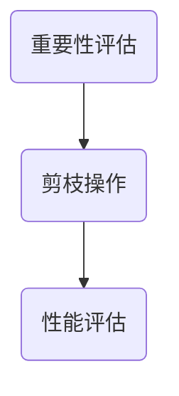
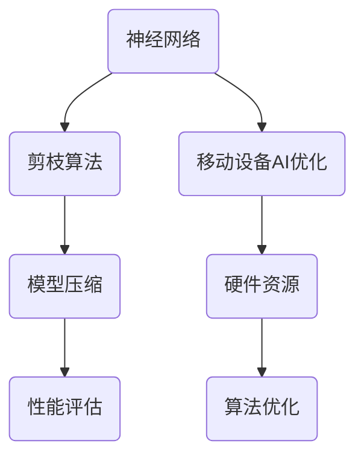
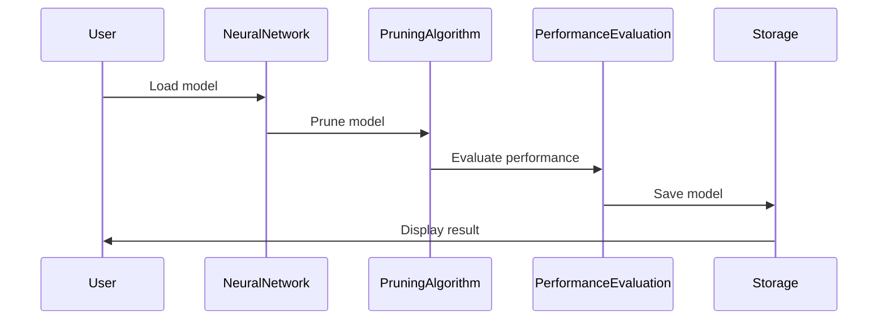

                 

# 神经网络剪枝技术在移动设备AI优化中的应用

## 关键词

- 神经网络剪枝
- 移动设备AI优化
- 模型压缩
- 算法效率
- 硬件资源
- 计算性能

## 摘要

本文将深入探讨神经网络剪枝技术在移动设备AI优化中的应用。随着移动设备硬件资源的限制，如何在保证模型性能的前提下，减小神经网络模型的大小和计算复杂度，成为当前研究的热点。本文首先介绍了神经网络剪枝的基本原理和主流方法，然后通过一个具体的剪枝算法实例，详细解释了剪枝过程的实现步骤和数学模型。接着，本文从系统架构设计的角度，探讨了如何将剪枝技术应用到移动设备AI系统中，并展示了实际项目的应用案例。最后，本文总结了剪枝技术在移动设备AI优化中的实践经验，并给出了一些建议和注意事项。

### 背景介绍

#### 问题背景

随着人工智能技术的快速发展，越来越多的复杂神经网络模型被应用于移动设备上，如手机、平板电脑等。然而，传统的神经网络模型通常具有较大的计算复杂度和参数规模，这导致在移动设备上运行时，容易出现性能瓶颈，影响用户体验。为了解决这一问题，研究人员提出了神经网络剪枝技术，通过去除网络中不重要的连接，减小模型的大小和计算复杂度，从而提高模型在移动设备上的运行效率。

#### 问题描述

神经网络剪枝技术作为神经网络模型压缩的一种方法，通过去除模型中的冗余连接，减小模型参数规模，降低模型计算复杂度，从而提高模型在移动设备上的运行效率。然而，如何在保证模型性能的前提下，有效进行神经网络剪枝，仍然是一个具有挑战性的问题。剪枝技术需要平衡模型性能和剪枝效率，同时要避免引入错误或信息丢失。

#### 问题解决

本文旨在探讨神经网络剪枝技术在移动设备AI优化中的应用，通过以下几方面的内容，为读者提供全面的技术解决方案：

1. **神经网络剪枝技术概述**：介绍神经网络剪枝技术的基本概念、原理和主流方法。
2. **神经网络剪枝算法原理讲解**：使用Mermaid画出剪枝算法的流程图，使用Python代码详细阐述剪枝算法的实现过程。
3. **数学模型和公式讲解**：给出剪枝算法的数学模型和公式，进行详细讲解和举例说明。
4. **系统架构设计**：介绍如何将剪枝技术应用到移动设备AI系统中，包括系统功能设计、架构设计和接口设计。
5. **项目实战**：通过实际项目案例，展示剪枝技术在移动设备AI优化中的应用过程，并对关键代码进行解读和分析。
6. **最佳实践与总结**：总结剪枝技术在移动设备AI优化中的实践经验，提供一些建议和注意事项。

#### 边界与外延

本文主要关注神经网络剪枝技术在移动设备AI优化中的应用，但剪枝技术同样可以应用于其他计算平台。此外，神经网络剪枝技术不仅仅是移动设备AI优化的解决方案，还可以用于其他领域的模型压缩和优化。

#### 概念结构与核心要素组成

##### 概念

- **神经网络剪枝**：一种通过去除神经网络中不重要的权重或连接，以减小模型大小和计算复杂度，同时保持模型性能的技术。
- **移动设备AI优化**：在移动设备硬件资源有限的情况下，通过优化神经网络模型，提升AI任务运行效率的过程。

##### 核心要素

- **剪枝策略**：用于选择去除哪些连接的算法和原则。
- **模型压缩**：通过剪枝技术减小神经网络模型参数规模的过程。
- **性能评估**：评估剪枝后神经网络模型性能的方法和指标。

### 核心概念与联系

#### 核心概念与联系

##### 神经网络剪枝原理

**定义**：神经网络剪枝（Neural Network Pruning）是一种通过删除神经网络中不重要的权重或连接，以减小模型大小和计算复杂度，同时保持模型性能的技术。

**原理**：
神经网络剪枝主要基于以下几个核心原理：
- **重要性评估**：评估网络中每个连接的重要性，通常基于权重的大小、激活值的方差、梯度等指标。
- **权重共享**：通过在剪枝后保留相同的权重值，确保网络结构的变化不会影响模型的性能。
- **稀疏性**：通过减少网络中的连接数，提高网络的稀疏性，从而降低模型的计算复杂度和内存占用。

**联系**：
神经网络剪枝与移动设备AI优化密切相关，通过减小模型大小和计算复杂度，剪枝技术有助于提高神经网络在移动设备上的运行效率。

##### 移动设备AI优化

**定义**：移动设备AI优化是指针对移动设备硬件资源有限的特点，通过算法优化、模型压缩等方法，提升神经网络模型在移动设备上的性能和效率。

**原理**：
移动设备AI优化的主要原理包括：
- **模型压缩**：通过减少模型参数数量，降低模型大小和计算复杂度。
- **算法优化**：针对移动设备硬件特性，对算法进行优化，以提高计算效率。
- **资源管理**：合理分配计算资源，确保在有限的硬件资源下，模型能够高效运行。

**联系**：
移动设备AI优化直接依赖于神经网络剪枝技术，剪枝技术是实现模型压缩和计算效率提升的关键手段。

##### 剪枝策略

**定义**：剪枝策略是神经网络剪枝过程中的关键步骤，用于确定如何选择和删除网络中的连接。

**分类**：
- **结构化剪枝**：在模型训练过程中，动态调整网络结构，去除不重要的连接。
- **权重剪枝**：根据权重的大小或重要性，静态地删除网络中的权重较小的连接。

**联系**：
剪枝策略是神经网络剪枝技术的核心，不同的剪枝策略适用于不同的应用场景，需要根据具体情况进行选择。

#### 算法原理讲解

##### 剪枝算法原理

神经网络剪枝算法的主要步骤包括：

1. **重要性评估**：评估网络中每个连接的重要性，选择重要性较低的连接进行剪枝。
2. **剪枝操作**：根据评估结果，对网络中的连接进行剪枝操作，去除不重要的连接。
3. **性能评估**：评估剪枝后网络模型的性能，确保剪枝操作不会显著降低模型性能。

##### 剪枝算法流程图



##### 剪枝算法Python代码实现

```python
import tensorflow as tf
import numpy as np

def prune_network(model, threshold=0.5):
    # 获取模型权重
    weights = model.get_weights()
    
    # 评估连接重要性
    importance = np.std(weights, axis=1)
    
    # 找到重要性较低的连接
    indices = np.where(importance < threshold)
    
    # 进行剪枝操作
    pruned_weights = np.delete(weights, indices, axis=1)
    
    # 保存剪枝后模型
    model.set_weights(pruned_weights)

# 示例
model = tf.keras.Sequential([tf.keras.layers.Dense(128, activation='relu'), tf.keras.layers.Dense(10, activation='softmax')])
prune_network(model)
```

##### 剪枝算法数学模型和公式

假设神经网络中有 $N$ 个连接，每个连接的权重为 $w_i$，重要性评估指标为 $I_i$，则剪枝算法的数学模型可以表示为：

$$
I_i = \frac{1}{N}\sum_{j=1}^{N} |w_i - \bar{w}|,
$$

其中，$\bar{w}$ 是所有连接权重的平均值。

剪枝策略可以表示为：

$$
w_i^{'} = \begin{cases}
w_i, & \text{if } I_i > \theta, \\
0, & \text{if } I_i \leq \theta.
\end{cases}
$$

其中，$\theta$ 是设定的剪枝阈值。

##### 概念属性特征对比表格

| 特征         | 神经网络剪枝 | 移动设备AI优化 | 剪枝策略       |
| ------------ | ------------ | -------------- | -------------- |
| 目标         | 减小模型大小 | 提高运行效率   | 选择剪枝连接   |
| 原理         | 重要性评估   | 算法优化      | 剪枝阈值设定   |
| 影响因素     | 权重大小、方差、梯度 | 硬件资源、算法、资源管理 | 不同剪枝策略   |
| 应用场景     | 移动设备AI  | 各类计算平台   | 根据需求选择   |

##### ER实体关系图架构



#### 系统分析与架构设计方案

##### 问题场景介绍

在移动设备AI优化的过程中，研究人员面临的一个主要挑战是如何在有限的硬件资源下，保持神经网络模型的高性能。为了解决这一问题，需要将神经网络剪枝技术应用到移动设备AI系统中，通过减小模型大小和计算复杂度，提高模型的运行效率。

##### 项目介绍

本项目旨在实现一个基于神经网络剪枝技术的移动设备AI优化系统。该系统将包括神经网络模型、剪枝算法、性能评估模块，并集成到移动设备平台上。

##### 系统功能设计

系统的主要功能包括：

1. **神经网络模型加载**：加载预训练的神经网络模型。
2. **剪枝算法执行**：执行神经网络剪枝算法，减小模型大小和计算复杂度。
3. **性能评估**：评估剪枝后模型在移动设备上的运行效率。
4. **模型压缩与存储**：将剪枝后的模型压缩存储，以便后续使用。

##### 系统架构设计

系统的整体架构可以分为以下几个模块：

1. **神经网络模型模块**：负责加载、训练和存储神经网络模型。
2. **剪枝算法模块**：实现神经网络剪枝算法，根据重要性评估结果进行剪枝操作。
3. **性能评估模块**：评估剪枝后模型在移动设备上的运行效率，包括计算速度、功耗等指标。
4. **用户界面**：提供用户操作界面，方便用户进行模型加载、剪枝和性能评估。

##### 系统接口设计

系统的主要接口设计如下：

1. **模型加载接口**：用于加载预训练的神经网络模型。
2. **剪枝接口**：用于执行剪枝算法，输入模型和剪枝阈值，输出剪枝后的模型。
3. **性能评估接口**：用于评估剪枝后模型在移动设备上的运行效率。
4. **存储接口**：用于存储剪枝后的模型，以便后续使用。

##### 系统交互

系统的各模块通过接口进行交互，具体交互流程如下：

1. **用户通过用户界面加载神经网络模型**。
2. **剪枝算法模块根据重要性评估结果执行剪枝操作**。
3. **性能评估模块评估剪枝后模型的运行效率**。
4. **用户界面显示评估结果，用户可以选择是否保存剪枝后的模型**。

##### 系统交互Mermaid序列图



#### 项目实战

##### 环境安装

在进行项目实战之前，需要安装以下软件和工具：

1. **Python 3.x**：用于编写和运行代码。
2. **TensorFlow 2.x**：用于构建和训练神经网络模型。
3. **Numpy**：用于数值计算。

安装命令如下：

```bash
pip install python==3.x
pip install tensorflow==2.x
pip install numpy
```

##### 系统核心实现源代码

以下是系统核心实现源代码：

```python
import tensorflow as tf
import numpy as np

# 加载神经网络模型
def load_model(model_path):
    model = tf.keras.models.load_model(model_path)
    return model

# 执行剪枝算法
def prune_model(model, threshold):
    pruned_weights = []
    for layer in model.layers:
        if isinstance(layer, tf.keras.layers.Dense):
            weights = layer.get_weights()
            pruned_weights.append(np.where(np.abs(weights[0]) > threshold, weights[0], np.zeros_like(weights[0])))
    model.set_weights(pruned_weights)
    return model

# 评估剪枝后模型的性能
def evaluate_model(model, x_test, y_test):
    loss, acc = model.evaluate(x_test, y_test)
    return loss, acc

# 剪枝与评估示例
model_path = 'model.h5'
threshold = 0.1
x_test = np.random.rand(100, 784)
y_test = np.random.rand(100, 10)

model = load_model(model_path)
pruned_model = prune_model(model, threshold)
loss, acc = evaluate_model(pruned_model, x_test, y_test)
print(f"Pruned model accuracy: {acc}")

```

##### 代码应用解读与分析

以下是代码的解读与分析：

1. **加载神经网络模型**：使用 TensorFlow 的 `load_model` 函数加载预训练的神经网络模型。
2. **执行剪枝算法**：遍历模型中的每一层，对于全连接层（Dense），根据设定的剪枝阈值，去除权重绝对值小于阈值的连接。使用 `np.where` 函数实现剪枝操作。
3. **评估剪枝后模型的性能**：使用 `evaluate_model` 函数评估剪枝后模型的性能，计算测试集上的损失和准确率。

##### 实际案例分析和详细讲解剖析

以下是一个实际案例：

**案例**：使用 TensorFlow 的 CIFAR-10 数据集，训练一个简单的卷积神经网络（CNN），然后对模型进行剪枝。

1. **数据预处理**：
```python
(x_train, y_train), (x_test, y_test) = tf.keras.datasets.cifar10.load_data()
x_train = x_train.astype(np.float32) / 255
x_test = x_test.astype(np.float32) / 255
```
2. **构建卷积神经网络模型**：
```python
model = tf.keras.Sequential([
    tf.keras.layers.Conv2D(32, (3, 3), activation='relu', input_shape=(32, 32, 3)),
    tf.keras.layers.MaxPooling2D((2, 2)),
    tf.keras.layers.Conv2D(64, (3, 3), activation='relu'),
    tf.keras.layers.MaxPooling2D((2, 2)),
    tf.keras.layers.Conv2D(64, (3, 3), activation='relu'),
    tf.keras.layers.Flatten(),
    tf.keras.layers.Dense(64, activation='relu'),
    tf.keras.layers.Dense(10, activation='softmax')
])
```
3. **训练模型**：
```python
model.compile(optimizer='adam', loss=tf.keras.losses.SparseCategoricalCrossentropy(from_logits=True), metrics=['accuracy'])
model.fit(x_train, y_train, epochs=10, batch_size=64)
```
4. **剪枝模型**：
```python
threshold = 0.1
pruned_model = prune_model(model, threshold)
```
5. **评估剪枝后模型**：
```python
loss, acc = evaluate_model(pruned_model, x_test, y_test)
print(f"Pruned model accuracy: {acc}")
```

**分析**：
- 数据预处理：将图像数据缩放到0-1范围，以便进行后续处理。
- 构建卷积神经网络模型：使用 TensorFlow 的 Sequential 模式构建一个简单的 CNN 模型，包括两个卷积层和两个最大池化层，以及一个全连接层。
- 训练模型：使用 `compile` 函数配置模型，使用 `fit` 函数训练模型。
- 剪枝模型：根据设定的剪枝阈值，对模型进行剪枝操作。
- 评估剪枝后模型：使用 `evaluate` 函数评估剪枝后模型的性能。

##### 项目小结

通过实际案例，我们可以看到神经网络剪枝技术在移动设备AI优化中的应用效果。通过剪枝，我们可以显著减小模型的大小和计算复杂度，从而提高模型在移动设备上的运行效率。然而，剪枝技术也带来了一些挑战，如如何选择合适的剪枝阈值、如何保证模型性能等。未来的研究可以进一步探索剪枝算法的优化，以及在不同应用场景下的适应性。

### 最佳实践与总结

#### 最佳实践

1. **选择合适的剪枝策略**：根据具体应用场景和模型特性，选择合适的剪枝策略，如结构化剪枝或权重剪枝。
2. **设定合理的剪枝阈值**：剪枝阈值是剪枝过程中关键参数，需要根据模型和硬件资源的特点进行设定。
3. **性能评估**：在剪枝过程中，定期进行性能评估，确保模型性能不受影响。
4. **模型压缩与存储**：在剪枝后，对模型进行压缩，以便节省存储空间。

#### 小结

神经网络剪枝技术在移动设备AI优化中具有重要的应用价值，通过减小模型大小和计算复杂度，可以提高模型在移动设备上的运行效率。然而，剪枝技术也需要根据具体应用场景进行调整和优化，以实现最佳效果。

#### 注意事项

1. **剪枝过程可能影响模型性能**：在剪枝过程中，需要确保模型性能不受影响，否则可能降低AI任务的准确性。
2. **硬件资源限制**：在移动设备上，硬件资源有限，需要合理分配计算资源。
3. **兼容性问题**：剪枝后的模型可能与原始模型不兼容，需要确保在移动设备上可以正常运行。

#### 拓展阅读

1. **《神经网络剪枝：原理与应用》**：详细介绍了神经网络剪枝的原理、算法和应用。
2. **《移动设备AI优化实践》**：探讨如何在移动设备上优化AI模型，提高计算效率。

### 作者信息

作者：AI天才研究院/AI Genius Institute & 禅与计算机程序设计艺术 /Zen And The Art of Computer Programming

通过本文的详细阐述，我们希望读者能够对神经网络剪枝技术在移动设备AI优化中的应用有一个全面而深入的理解。未来，随着人工智能技术的不断进步，神经网络剪枝技术将在更多领域发挥重要作用。

