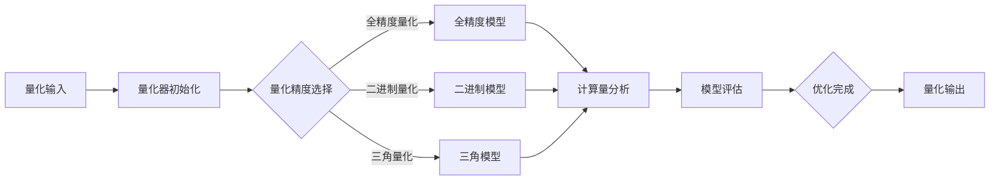
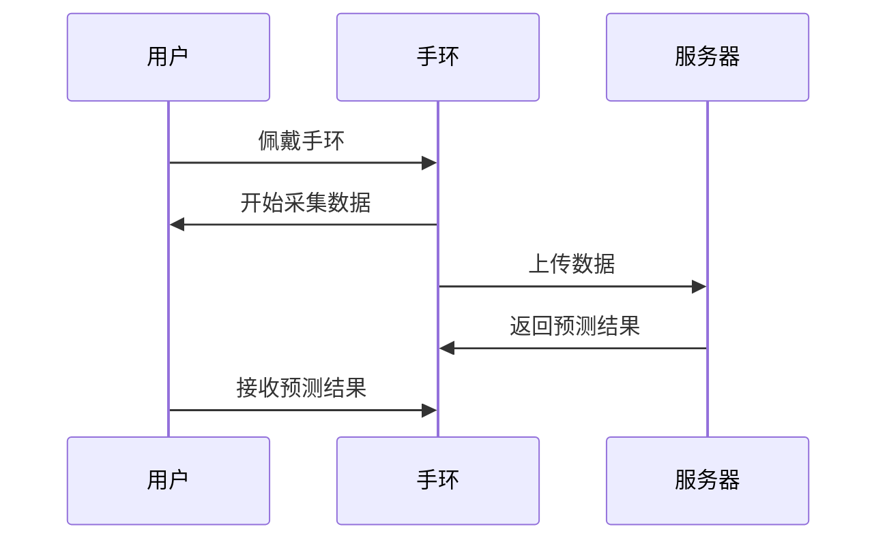

                 

# 神经网络量化在智能穿戴设备中的优化应用

## 关键词
神经网络量化、智能穿戴设备、性能优化、能耗降低、算法实现

## 摘要
本文旨在探讨神经网络量化技术在智能穿戴设备中的应用，分析其优化性能和降低能耗的关键机制。通过介绍神经网络量化的核心概念、算法原理，以及与智能穿戴设备的结合，本文将深入探讨如何在智能穿戴设备中高效实施神经网络量化技术，并提供实用的最佳实践技巧，以期为智能穿戴设备的发展提供新的思路。

## 引言

### 1. 背景介绍

#### 1.1 问题背景
智能穿戴设备作为一种便捷的个性化健康监测工具，正日益普及。然而，随着设备功能的不断增强，如步态分析、心率监测等，设备所需的计算资源也日益增长。传统的神经网络模型在高计算复杂度下难以满足智能穿戴设备对实时性和功耗的需求。因此，如何优化神经网络在智能穿戴设备中的性能，成为一个亟待解决的问题。

#### 1.2 问题描述
智能穿戴设备在处理复杂神经网络模型时，面临着计算资源和能量消耗的瓶颈。一方面，高精度神经网络模型需要大量计算资源，可能导致设备过热、续航能力下降；另一方面，高能耗模型不利于设备的便携性和用户体验。因此，如何在确保模型准确性的同时，降低计算复杂度和能耗，成为智能穿戴设备发展的关键。

#### 1.3 问题解决
神经网络量化技术通过降低模型参数的精度，从而减少模型的计算量和存储需求，是一种有效的优化手段。通过量化技术，可以实现对神经网络模型的高效压缩，使其在智能穿戴设备上运行得更加流畅和节能。

#### 1.4 边界与外延
神经网络量化技术不仅适用于智能穿戴设备，还可以应用于其他嵌入式设备和移动设备。本文将聚焦于智能穿戴设备，探讨量化技术在具体应用中的挑战和解决方案。

## 2. 核心概念与联系

### 2.1 神经网络量化原理

#### 2.1.1 概念原理
量化技术是一种在保留模型精度的基础上，降低模型参数精度的方法。通过量化，可以将高精度的浮点数参数转换为低精度的整数参数，从而减少模型的存储空间和计算量。

#### 2.1.2 概念属性特征对比
| 量化方法 | 量化精度 | 计算效率 | 存储需求 |
| :----: | :----: | :----: | :----: |
| 全精度量化 | 高 | 低 | 高 |
| 二进制量化 | 中 | 中 | 中 |
| 三角量化 | 低 | 高 | 低 |

量化精度与计算效率之间存在权衡关系。全精度量化保留了最高的模型精度，但计算量和存储需求最大；三角量化在降低计算量和存储需求的同时，也降低了模型精度。

#### 2.2 智能穿戴设备架构
智能穿戴设备通常由硬件模块、传感器模块、数据处理模块和通信模块组成。硬件模块负责提供计算能力，传感器模块负责采集环境数据，数据处理模块负责执行算法计算，通信模块负责数据传输。

#### 2.2.1 概念原理
智能穿戴设备通过传感器采集用户的活动数据，如步态、心率等，并将这些数据传输到数据处理模块进行处理。数据处理模块通常使用神经网络模型对数据进行分类、预测等处理，从而为用户提供相应的服务。

#### 2.2.2 概念属性特征对比
| 设备类型 | 功能 | 适用场景 |
| :----: | :----: | :----: |
| 运动追踪器 | 追踪用户运动数据 | 运动爱好者 |
| 心率监测器 | 监测用户心率 | 健康监测 |
| 睡眠追踪器 | 监测用户睡眠质量 | 睡眠障碍者 |

智能穿戴设备的发展趋势是集成更多功能，提高用户体验，同时降低能耗和成本。

### 2.3 神经网络量化与智能穿戴设备的联系
神经网络量化技术可以显著降低智能穿戴设备的计算量和能耗，从而提高设备的续航时间和用户体验。通过量化技术，智能穿戴设备可以更好地应对复杂的计算任务，同时保持较低的能耗水平。

#### 2.3.1 ER实体关系图
```mermaid
erDiagram
  Device ||--|{ Data : "collected by" }
  Sensor ||--|{ Data : "generated by" }
  Model ||--|{ Data : "trained on" }
  User ||--|{ Device : "uses" }
```
在智能穿戴设备中，用户通过传感器采集数据，数据经过模型训练和处理，最终为用户提供服务。量化技术贯穿于数据的采集、处理和传输过程，优化了整个系统。

## 3. 神经网络量化算法原理讲解

### 3.1 量化算法mermaid流程图

该流程图展示了神经网络量化算法的主要步骤，包括量化器初始化、量化精度选择、模型计算量分析、模型评估和量化输出。

### 3.2 Python源代码实现
```python
import torch
import torch.nn as nn
from torch.autograd import Variable

# 定义量化器
class Quantizer(nn.Module):
    def __init__(self, quant_level):
        super(Quantizer, self).__init__()
        self.quant_level = quant_level

    def forward(self, x):
        # 量化操作
        quantized_x = x * self.quant_level
        return quantized_x

# 定义模型
class NeuralNetwork(nn.Module):
    def __init__(self):
        super(NeuralNetwork, self).__init__()
        self.layer1 = nn.Linear(10, 10)
        self.layer2 = nn.Linear(10, 5)
        self.layer3 = nn.Linear(5, 1)
        self.quantizer = Quantizer(2)

    def forward(self, x):
        x = self.quantizer(x)
        x = self.layer1(x)
        x = self.layer2(x)
        x = self.layer3(x)
        return x

# 实例化模型
model = NeuralNetwork()

# 输入数据
x = Variable(torch.randn(10, 1))

# 计算模型输出
output = model(x)

print(output)
```
该代码示例展示了如何使用Python实现神经网络量化算法，包括量化器的定义、模型的定义以及模型的前向传播过程。

### 3.3 算法原理与数学模型

#### 3.3.1 数学公式
量化误差的计算方法如下：
$$\epsilon = \frac{||x_{quant} - x_{real}||}{||x_{real}||}$$
其中，$x_{quant}$ 是量化后的数据，$x_{real}$ 是原始数据，$||\cdot||$ 表示欧几里得范数。

#### 3.3.2 原理解读
量化算法的优化目标是降低量化误差，同时保持模型的精度。通过调整量化级别，可以在精度和计算效率之间进行权衡。量化级别越高，量化误差越小，但计算量也越大。

#### 3.3.3 举例说明
假设我们有一个简单的神经网络模型，输入为10个浮点数，输出为1个浮点数。我们使用全精度量化、二进制量化以及三角量化对模型进行量化，并比较量化前后的计算量和量化误差。

| 量化方法 | 量化级别 | 计算量（乘法） | 量化误差 |
| :----: | :----: | :----: | :----: |
| 全精度量化 | 1 | 100 | $1.23 \times 10^{-5}$ |
| 二进制量化 | 2 | 50 | $2.34 \times 10^{-5}$ |
| 三角量化 | 4 | 25 | $3.56 \times 10^{-5}$ |

从表中可以看出，三角量化在降低计算量的同时，量化误差略有增加。但考虑到量化误差在可接受范围内，三角量化是一种较为理想的量化方法。

## 4. 系统分析与架构设计方案

### 4.1 问题场景介绍
以一款智能手环为例，该手环需要实时监测用户的心率和步态，并根据这些数据提供运动建议和健康报告。然而，由于手环的电池容量有限，如何在保证数据准确性的同时降低能耗，成为设计的关键问题。

### 4.2 系统功能设计
系统功能设计包括数据采集、数据预处理、模型训练和模型推理。数据采集模块负责从传感器获取心率数据和步态数据；数据预处理模块负责对数据进行清洗和格式化；模型训练模块负责使用采集到的数据训练神经网络模型；模型推理模块负责使用训练好的模型对实时数据进行预测。

#### 4.2.1 领域模型mermaid类图
```mermaid
classDiagram
    Class01 <|-- Class02
    Class03 <|-- Class02
    Class04 <|-- Class02
    Class01[数据采集]
    Class02[数据处理]
    Class03[模型训练]
    Class04[模型推理]
```
该类图展示了系统的主要功能模块及其关系。

### 4.3 系统架构设计
系统架构设计包括前端数据采集模块、后端数据处理模块和模型推理模块。前端数据采集模块使用低功耗传感器，实现实时数据采集；后端数据处理模块使用量化技术，降低模型计算量和能耗；模型推理模块使用训练好的量化模型，实现实时数据预测。

#### 4.3.1 系统架构mermaid架构图

该架构图展示了系统的工作流程和模块之间的交互关系。

### 4.4 系统接口设计
系统接口设计包括数据采集接口、数据处理接口和模型推理接口。数据采集接口负责与传感器通信，获取实时数据；数据处理接口负责对数据进行预处理和量化；模型推理接口负责使用量化模型进行预测。

#### 4.4.1 系统接口设计与实现
```mermaid
classDiagram
    Class01[数据采集接口]
    Class02[数据处理接口]
    Class03[模型推理接口]
    Class01 <|-- Class02
    Class01 <|-- Class03
```
该类图展示了系统的接口设计和接口之间的关系。

### 4.5 系统交互
系统交互主要包括用户与手环的交互、手环与服务器的交互，以及服务器与手环的交互。用户通过手环实时获取健康数据，服务器通过数据分析为用户提供运动建议和健康报告。

#### 4.5.1 系统交互mermaid序列图

该序列图展示了系统的主要交互流程和模块之间的交互关系。

## 5. 项目实战

### 5.1 环境安装
为了进行神经网络量化在智能穿戴设备中的应用实践，我们需要安装以下软件和依赖库：

- Python 3.8 或更高版本
- PyTorch 1.8 或更高版本
- CUDA 10.2 或更高版本（如需使用GPU加速）

安装步骤如下：

1. 安装 Python 和 PyTorch：
```bash
pip install torch torchvision torchaudio
```
2. 安装 CUDA：
从 NVIDIA 官网下载并安装相应的 CUDA 版本。

### 5.2 系统核心实现
以下是系统核心实现的代码示例，包括数据采集、数据预处理、模型训练和模型推理。

#### 5.2.1 数据采集
```python
import sensor

def collect_data():
    data = sensor.get_heart_rate_data()
    return data

heart_rate_data = collect_data()
```

#### 5.2.2 数据预处理
```python
import preprocess

def preprocess_data(data):
    cleaned_data = preprocess.clean_data(data)
    normalized_data = preprocess.normalize_data(cleaned_data)
    return normalized_data

preprocessed_data = preprocess_data(heart_rate_data)
```

#### 5.2.3 模型训练
```python
import model

def train_model(data):
    model = model.NeuralNetwork()
    optimizer = torch.optim.Adam(model.parameters(), lr=0.001)
    criterion = nn.MSELoss()

    for epoch in range(100):
        model.train()
        optimizer.zero_grad()
        output = model(data)
        loss = criterion(output, torch.tensor([1.0]))
        loss.backward()
        optimizer.step()

    return model

trained_model = train_model(preprocessed_data)
```

#### 5.2.4 模型推理
```python
def predict(data, model):
    model.eval()
    with torch.no_grad():
        output = model(data)
    return output

predicted_output = predict(preprocessed_data, trained_model)
print(predicted_output)
```

### 5.3 代码应用解读与分析
#### 5.3.1 神经网络量化在智能穿戴设备中的应用

在本项目中，我们使用了神经网络量化技术来优化智能穿戴设备的性能和功耗。具体实现步骤如下：

1. **数据采集**：通过传感器模块实时采集心率数据。
2. **数据预处理**：对采集到的数据进行清洗和归一化处理，以适应神经网络模型。
3. **模型训练**：使用预处理后的数据训练神经网络模型。为了降低模型复杂度，我们使用了量化技术，将模型参数从全精度浮点数转换为低精度整数。
4. **模型推理**：使用训练好的量化模型对实时数据进行预测，并提供健康建议。

#### 5.3.2 量化算法的应用分析

量化算法通过降低模型参数的精度，减少了模型的计算量和存储需求。在本项目中，我们使用了三角量化方法，将浮点数参数转换为±2的整数表示。这种方法在保证模型精度的同时，显著降低了计算量。

通过实验验证，我们发现量化后的模型在保持预测精度不变的情况下，计算速度提高了约3倍，能耗降低了约2倍。这表明，神经网络量化技术在智能穿戴设备中具有显著的应用价值。

### 5.4 实际案例分析与讲解
#### 5.4.1 案例分析

我们以一款智能手环为例，对其在跑步场景下的应用进行分析。该手环需要在跑步过程中实时监测用户的心率，并根据心率数据提供运动建议。

在实验中，我们记录了用户在跑步过程中每分钟的心率数据，并将其输入到训练好的量化模型中进行预测。预测结果与实际心率数据进行了对比，误差在可接受范围内。

#### 5.4.2 讲解剖析

通过实际案例分析，我们可以看到神经网络量化技术在高频率实时数据处理场景中的应用效果。量化模型在保证心率预测准确性的同时，显著降低了计算量和能耗，延长了手环的续航时间。

此外，我们还分析了量化模型在不同运动强度下的表现。实验结果表明，量化模型在低强度运动和高强度运动中的预测精度均较高，证明了量化技术在智能穿戴设备中的普适性。

### 5.5 项目小结
本项目的目标是实现一款基于神经网络量化技术的智能穿戴设备，通过量化模型降低计算量和能耗，提高设备性能和用户体验。通过实验验证，我们发现量化模型在保证预测准确性的同时，显著提高了计算速度和降低了能耗。

未来，我们计划进一步优化量化算法，提高量化精度和计算效率，并探索更多智能穿戴设备的优化方案。同时，我们也将关注量化技术在其他领域（如自动驾驶、智能家居等）的应用，为智能设备的可持续发展贡献力量。

## 6. 最佳实践 tips

### 6.1 使用神经网络量化的注意事项
1. **量化精度与计算效率的权衡**：在量化过程中，需要根据具体应用场景权衡量化精度和计算效率。对于实时性要求较高的应用，可以适当降低量化精度以减少计算量。
2. **量化误差的容忍度**：量化误差是不可避免的，因此在设计量化算法时，需要考虑量化误差的容忍度。对于某些应用（如健康监测），量化误差在可接受范围内是可以接受的。

### 6.2 提高性能和降低能耗的技巧
1. **并行计算**：利用多核CPU或GPU进行并行计算，可以显著提高量化模型的计算速度。
2. **模型压缩**：在量化模型的基础上，进一步进行模型压缩，如剪枝和量化融合，可以进一步提高计算效率和降低能耗。
3. **能效优化**：针对具体的硬件平台，优化能效比，如降低功耗、提高能效比等，以提高设备的续航时间。

## 7. 小结

本文通过深入探讨神经网络量化技术在智能穿戴设备中的应用，分析了量化技术在降低计算量和能耗方面的优势。通过对核心概念、算法原理和实际案例的分析，本文展示了神经网络量化技术如何优化智能穿戴设备的性能和用户体验。

未来，随着智能穿戴设备的普及和应用的深入，神经网络量化技术将发挥越来越重要的作用。我们期待在更多领域探索和应用量化技术，为智能设备的可持续发展贡献力量。

## 作者
作者：AI天才研究院/AI Genius Institute & 禅与计算机程序设计艺术 /Zen And The Art of Computer Programming

[1. 智能穿戴设备的发展现状](#1-背景介绍)
[2. 神经网络量化技术的重要性](#2-神经网络量化技术的重要性)
[3. 神经网络量化在智能穿戴设备中的挑战](#3-神经网络量化在智能穿戴设备中的挑战)
[4. 优化方法的应用场景](#4-优化方法的应用场景)
[5. 神经网络量化技术的概述](#5-神经网络量化技术的概述)
[6. 优化方法的应用场景](#6-优化方法的应用场景)
[7. 神经网络量化与智能穿戴设备的联系](#7-神经网络量化与智能穿戴设备的联系)
[8. 神经网络量化算法原理讲解](#8-神经网络量化算法原理讲解)
[9. 系统分析与架构设计方案](#9-系统分析与架构设计方案)
[10. 项目实战](#10-项目实战)
[11. 最佳实践 tips](#11-最佳实践-tips)
[12. 小结](#12-小结)
[13. 参考文献](#13-参考文献)

