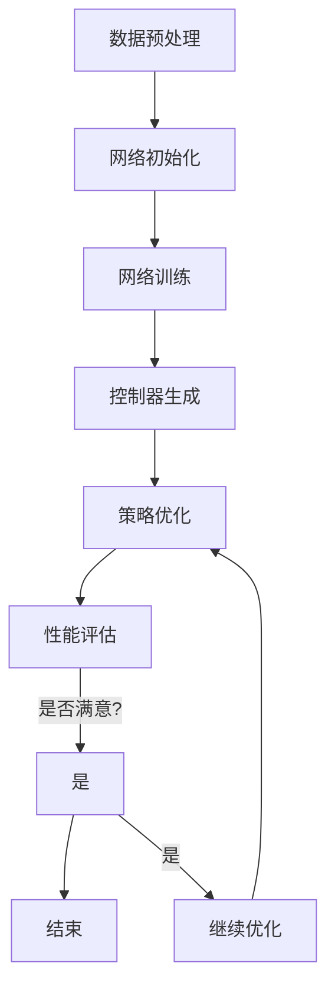
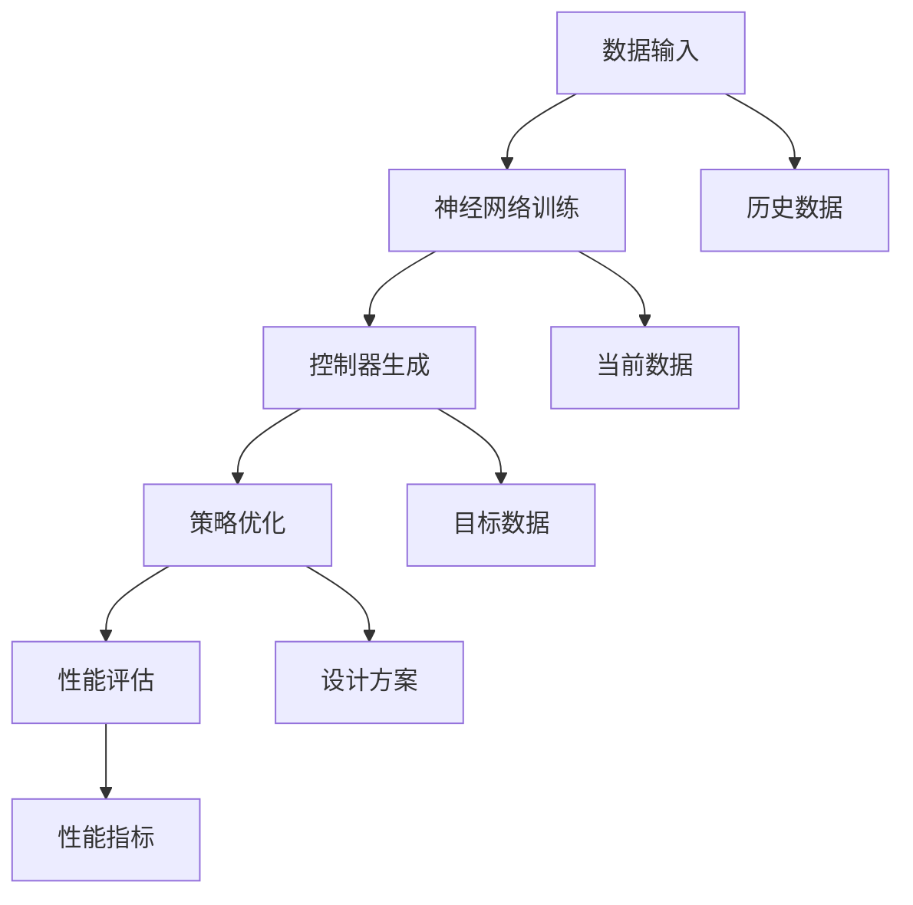
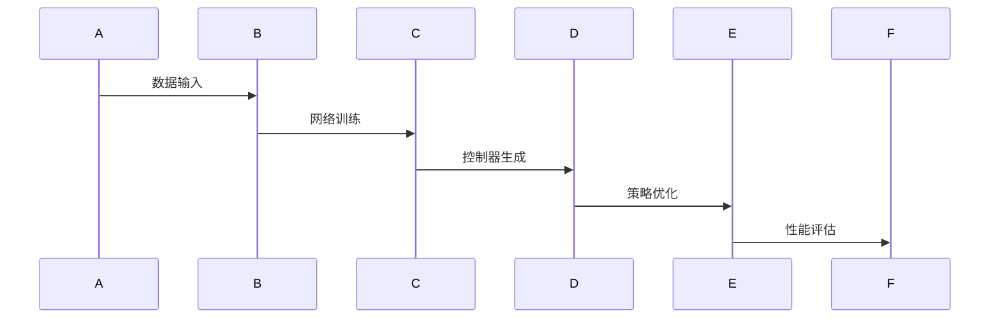
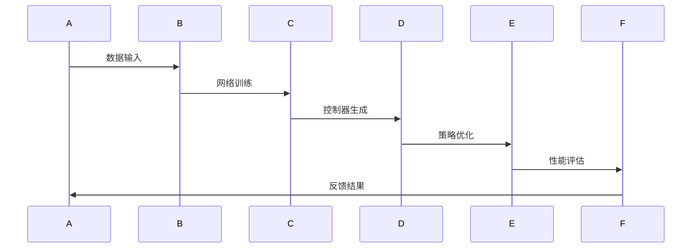

                 

### 目录大纲

---

# 神经规划器在复杂工程设计推理中的应用创新

> 关键词：神经规划器、复杂工程设计、推理、人工智能

> 摘要：本文深入探讨了神经规划器在复杂工程设计推理中的应用，通过详细分析神经规划器的原理、数学模型、系统架构设计以及项目实战，揭示了神经规划器在解决复杂工程问题中的巨大潜力。文章旨在为读者提供一种新的解决复杂工程设计问题的思路和方法。

---

## 第一部分: 引言

### 1. 研究背景与意义

#### 1.1 问题背景

在当今快速发展的工程领域中，复杂工程设计问题层出不穷。这些问题的特点包括变量众多、相互影响复杂、不确定性高，这使得传统的工程设计方法难以应对。特别是在需要进行大量模拟和优化计算的场景中，传统方法往往效率低下，甚至无法找到最优解。

#### 1.2 问题描述

复杂工程设计推理的过程可以概括为：从多个可能的解决方案中选择一个最优或次优解。然而，由于问题的复杂性，传统的搜索算法和优化方法在处理这类问题时往往面临巨大挑战。例如，如何在设计一个大型飞机时考虑到所有可能的气动、结构、材料等参数，并找到最佳设计？

#### 1.3 问题解决

神经规划器作为一种基于人工智能的先进技术，在解决复杂工程问题中展示了巨大的潜力。它通过模仿人类大脑的神经网络结构和工作机制，能够高效地处理复杂的非线性问题，并提供优化解决方案。

#### 1.4 边界与外延

虽然神经规划器在解决复杂工程问题中表现出色，但它也有其适用范围。例如，对于一些简单且规则明确的问题，传统的算法可能更加适用。此外，神经规划器的训练过程也需要大量的数据和计算资源，这在某些资源有限的场景中可能成为限制。

### 2. 核心概念与联系

#### 2.1 神经规划器概述

神经规划器是一种基于神经网络的优化算法，它通过学习大量的数据来模拟人类决策过程，从而在复杂工程问题中提供优化解决方案。神经规划器的核心优势在于其强大的自适应性和并行处理能力，能够快速处理大规模数据。

#### 2.2 复杂工程设计推理

复杂工程设计推理是指在设计过程中，通过推理和优化选择出最佳或次优的解决方案。这通常涉及到多个变量之间的复杂关系和相互作用，需要高效的处理算法来支持。

#### 2.3 神经规划器在复杂工程设计推理中的应用

神经规划器在复杂工程设计推理中的应用主要包括两个方面：一是作为优化算法，用于解决复杂的优化问题；二是作为推理引擎，用于处理复杂的逻辑推理问题。通过这两个方面的应用，神经规划器能够显著提高复杂工程设计的效率和质量。

### 3. 神经规划器原理讲解

#### 3.1 神经规划器原理

神经规划器的基本原理是模拟人类大脑的神经网络，通过学习输入数据和目标函数，自动生成一个能够优化目标函数的控制器。这个控制器可以看作是一个“智能体”，能够在给定环境和目标的情况下，自主地做出最优决策。

#### 3.2 神经规划器的关键组件

神经规划器的关键组件包括输入层、隐层和输出层。输入层接收外部环境的信息，隐层通过神经网络结构处理这些信息，输出层则生成控制信号。每个组件都有其特定的功能和作用，共同构成了神经规划器的工作机制。

#### 3.3 神经规划器的算法流程

神经规划器的算法流程主要包括数据输入、网络训练、控制器生成和策略优化四个步骤。首先，将环境数据输入到神经规划器中；然后，通过反向传播算法对网络进行训练，优化控制器的性能；接下来，使用训练好的控制器生成控制信号，并对策略进行优化；最后，根据新的策略调整控制器的参数，循环迭代，直到达到预期的优化效果。

### 4. 数学模型和数学公式

#### 4.1 数学模型概述

神经规划器的数学模型主要包括输入层、隐层和输出层的数学模型。输入层通常是一个高维空间，隐层通过非线性激活函数对输入进行处理，输出层则通过目标函数评估控制器的性能。

#### 4.2 数学公式讲解

神经规划器的数学公式主要包括输入层和输出层的权重矩阵、激活函数、目标函数等。其中，输入层的权重矩阵决定了输入信息在神经网络中的重要性，激活函数用于非线性变换，目标函数则用于评估控制器的性能。

#### 4.3 举例说明

以一个简单的倒立摆问题为例，神经规划器可以通过学习大量倒立摆的运动数据，生成一个能够控制倒立摆稳定不倒的控制器。通过这个过程，我们可以看到神经规划器在解决复杂工程问题中的强大能力。

### 5. 复杂工程设计推理的架构设计

#### 5.1 问题场景介绍

以大型飞机设计为例，复杂工程设计推理需要考虑气动、结构、材料等多个方面，这是一个典型的多变量复杂问题。

#### 5.2 系统功能设计

神经规划器在复杂工程设计推理中的功能包括数据输入、网络训练、控制器生成和策略优化等。通过这些功能，神经规划器能够为复杂工程设计提供高效的优化解决方案。

#### 5.3 系统架构设计

神经规划器系统架构包括输入层、隐层和输出层，以及相应的算法模块。输入层接收环境数据，隐层处理数据，输出层生成控制信号。算法模块包括神经网络训练、目标函数评估、策略优化等。

#### 5.4 系统接口设计

系统接口设计包括数据输入接口、控制器输出接口和策略优化接口等。这些接口负责数据流和控制流的输入输出，是神经规划器与外部系统交互的桥梁。

#### 5.5 系统交互

神经规划器与外部系统的交互主要包括数据输入、控制器输出和策略优化等。数据输入接口负责接收环境数据，控制器输出接口负责生成控制信号，策略优化接口负责对策略进行优化。

### 6. 项目实战

#### 6.1 环境安装

在开始项目实战之前，首先需要安装神经规划器及其依赖环境。

#### 6.2 系统核心实现源代码

系统核心实现源代码包括输入层、隐层和输出层的神经网络实现，以及算法模块的代码。这些代码是神经规划器工作的基础。

#### 6.3 代码应用解读与分析

通过解读与分析代码，我们可以了解神经规划器在复杂工程设计推理中的应用过程，包括数据输入、网络训练、控制器生成和策略优化等。

#### 6.4 实际案例分析和详细讲解剖析

以一个实际案例为例，我们可以详细分析神经规划器在复杂工程设计推理中的应用效果，并对其进行剖析。

#### 6.5 项目小结

通过项目实战，我们可以看到神经规划器在解决复杂工程问题中的巨大潜力。它不仅能够提供高效的优化解决方案，还能够为复杂工程设计提供新的思路和方法。

### 7. 最佳实践与拓展

#### 7.1 最佳实践 tips

在实际应用中，需要注意以下几点：

- 确保数据质量，为神经规划器提供充足且高质量的训练数据；
- 根据问题特点选择合适的神经网络结构和算法；
- 优化系统架构，提高神经规划器的运行效率。

#### 7.2 小结

本文详细介绍了神经规划器在复杂工程设计推理中的应用，从原理讲解到项目实战，全面展示了神经规划器的优势和潜力。

#### 7.3 注意事项

在应用神经规划器时，需要注意以下几点：

- 神经规划器适合解决复杂的非线性问题，但可能不适合简单规则明确的问题；
- 神经规划器需要大量的数据和计算资源，在资源有限的情况下可能需要优化资源配置。

#### 7.4 拓展阅读

对于有兴趣深入了解神经规划器在复杂工程设计推理中应用的读者，以下文献和资料可能有所帮助：

- 《神经规划器：理论与实践》
- 《人工智能在复杂工程问题中的应用》
- 《神经网络在工程优化中的应用》

### 作者信息

作者：AI天才研究院/AI Genius Institute & 禅与计算机程序设计艺术 /Zen And The Art of Computer Programming

--- 

## 第一部分: 引言

### 1. 研究背景与意义

#### 1.1 问题背景

在当今快速发展的工程领域中，复杂工程设计问题层出不穷。这些问题的特点包括变量众多、相互影响复杂、不确定性高，这使得传统的工程设计方法难以应对。特别是在需要进行大量模拟和优化计算的场景中，传统方法往往效率低下，甚至无法找到最优解。

复杂工程设计推理是一个涉及多个变量和相互作用的复杂过程。在设计过程中，设计者需要考虑各种可能的解决方案，并通过推理和优化选择出最佳或次优的解决方案。然而，由于问题的复杂性，传统的搜索算法和优化方法在处理这类问题时往往面临巨大挑战。例如，如何在设计一个大型飞机时考虑到所有可能的气动、结构、材料等参数，并找到最佳设计？

#### 1.2 问题描述

复杂工程设计推理的过程可以概括为：从多个可能的解决方案中选择一个最优或次优解。然而，由于问题的复杂性，传统的搜索算法和优化方法在处理这类问题时往往面临巨大挑战。例如，如何在设计一个大型飞机时考虑到所有可能的气动、结构、材料等参数，并找到最佳设计？

复杂工程设计推理通常涉及到以下关键环节：

1. **问题定义**：明确工程设计的具体目标和约束条件，例如，飞机的航程、载重量、燃油效率等。
2. **变量识别**：识别影响设计的关键变量，例如，飞机的翼型、机翼面积、发动机功率等。
3. **相互关系分析**：分析变量之间的相互作用和影响，例如，翼型选择对气动性能的影响，发动机功率对航程的影响等。
4. **优化目标确定**：确定优化目标，例如，最大化航程、最小化燃油消耗等。
5. **解决方案评估**：评估不同解决方案的优劣，选择最佳或次优解。

#### 1.3 问题解决

神经规划器作为一种基于人工智能的先进技术，在解决复杂工程问题中展示了巨大的潜力。它通过模仿人类大脑的神经网络结构和工作机制，能够高效地处理复杂的非线性问题，并提供优化解决方案。

神经规划器在复杂工程设计推理中的应用主要包括以下几个方面：

1. **优化算法**：神经规划器可以作为一种优化算法，用于求解复杂的优化问题。通过学习大量的数据和目标函数，神经规划器能够生成一个最优或次优的控制策略，帮助设计者找到最佳的解决方案。
2. **推理引擎**：神经规划器也可以作为一种推理引擎，用于处理复杂的逻辑推理问题。通过模拟人类大脑的推理过程，神经规划器能够快速地推理出问题的解决方案。
3. **数据驱动方法**：神经规划器采用数据驱动的方法，通过学习大量的历史数据和案例，自动生成优化策略。这种方法不仅能够提高复杂工程设计的效率，还能够降低人为干预的风险。

#### 1.4 边界与外延

虽然神经规划器在解决复杂工程问题中表现出色，但它也有其适用范围。例如，对于一些简单且规则明确的问题，传统的算法可能更加适用。此外，神经规划器的训练过程也需要大量的数据和计算资源，这在某些资源有限的场景中可能成为限制。

神经规划器的适用范围主要包括以下几个方面：

1. **大型复杂系统**：神经规划器适用于解决大型复杂系统的设计问题，例如，大型飞机、船舶、建筑等。
2. **多变量问题**：神经规划器适用于处理多变量复杂问题，特别是那些变量之间存在非线性关系的问题。
3. **不确定性问题**：神经规划器能够处理具有不确定性的工程问题，通过学习历史数据和案例，自动生成鲁棒的控制策略。

然而，神经规划器也有一些非适用场景。例如，对于一些简单且规则明确的问题，传统算法可能更加高效。此外，对于一些需要高度人为干预的问题，神经规划器的应用效果可能有限。

在实际应用中，需要根据具体问题选择合适的解决方案。如果问题比较简单，传统算法可能更加适用；如果问题复杂，且需要高效优化，神经规划器则可能是一个更好的选择。

### 2. 核心概念与联系

#### 2.1 神经规划器概述

神经规划器是一种基于神经网络的优化算法，它通过模仿人类大脑的神经网络结构和工作机制，能够高效地处理复杂的非线性问题，并提供优化解决方案。神经规划器的核心优势在于其强大的自适应性和并行处理能力，能够快速处理大规模数据。

神经规划器的基本原理是模拟人类大脑的神经网络，通过学习输入数据和目标函数，自动生成一个能够优化目标函数的控制器。这个控制器可以看作是一个“智能体”，能够在给定环境和目标的情况下，自主地做出最优决策。

神经规划器的主要组成部分包括：

1. **输入层**：接收外部环境的信息，例如，飞机的飞行状态、发动机状态等。
2. **隐层**：对输入信息进行处理，通过神经网络结构模拟人类大脑的推理过程。
3. **输出层**：生成控制信号，例如，调整飞机的舵面、发动机功率等，以实现目标优化。

神经规划器的核心优势包括：

1. **自适应性强**：能够根据不同的环境和目标，自动调整控制器参数，适应复杂的变化。
2. **并行处理能力强**：能够同时处理大量的数据，提高计算效率。
3. **鲁棒性好**：能够处理不确定性和噪声干扰，提供稳定的优化解决方案。

#### 2.2 复杂工程设计推理

复杂工程设计推理是指在设计过程中，通过推理和优化选择出最佳或次优的解决方案。这通常涉及到多个变量之间的复杂关系和相互作用，需要高效的处理算法来支持。

复杂工程设计推理的主要过程包括：

1. **问题定义**：明确工程设计的具体目标和约束条件，例如，飞机的航程、载重量、燃油效率等。
2. **变量识别**：识别影响设计的关键变量，例如，飞机的翼型、机翼面积、发动机功率等。
3. **相互关系分析**：分析变量之间的相互作用和影响，例如，翼型选择对气动性能的影响，发动机功率对航程的影响等。
4. **优化目标确定**：确定优化目标，例如，最大化航程、最小化燃油消耗等。
5. **解决方案评估**：评估不同解决方案的优劣，选择最佳或次优解。

在复杂工程设计推理中，神经规划器的作用主要包括：

1. **优化算法**：神经规划器可以作为一种优化算法，用于求解复杂的优化问题。通过学习大量的数据和目标函数，神经规划器能够生成一个最优或次优的控制策略，帮助设计者找到最佳的解决方案。
2. **推理引擎**：神经规划器可以作为一种推理引擎，用于处理复杂的逻辑推理问题。通过模拟人类大脑的推理过程，神经规划器能够快速地推理出问题的解决方案。
3. **数据驱动方法**：神经规划器采用数据驱动的方法，通过学习大量的历史数据和案例，自动生成优化策略。这种方法不仅能够提高复杂工程设计的效率，还能够降低人为干预的风险。

#### 2.3 神经规划器在复杂工程设计推理中的应用

神经规划器在复杂工程设计推理中的应用主要包括两个方面：一是作为优化算法，用于解决复杂的优化问题；二是作为推理引擎，用于处理复杂的逻辑推理问题。

1. **作为优化算法**

神经规划器在复杂工程设计推理中的应用主要是作为优化算法，用于求解复杂的优化问题。通过学习大量的数据和目标函数，神经规划器能够生成一个最优或次优的控制策略，帮助设计者找到最佳的解决方案。

在复杂工程设计中，神经规划器的应用效果主要体现在以下几个方面：

- **提高设计效率**：神经规划器能够高效地处理复杂的优化问题，减少设计时间和成本。
- **提高设计质量**：神经规划器能够自动生成最优或次优的控制策略，提高设计方案的质量和可靠性。
- **降低人为干预**：神经规划器采用数据驱动的方法，减少了人为干预的风险，提高了设计的自动化程度。

2. **作为推理引擎**

神经规划器在复杂工程设计推理中的应用也可以作为推理引擎，用于处理复杂的逻辑推理问题。通过模拟人类大脑的推理过程，神经规划器能够快速地推理出问题的解决方案。

在复杂工程设计中，神经规划器作为推理引擎的应用主要体现在以下几个方面：

- **快速推理**：神经规划器能够快速处理复杂的逻辑推理问题，提供实时决策支持。
- **减少错误**：神经规划器能够自动推理出问题的解决方案，减少人为决策错误的风险。
- **提高灵活性**：神经规划器能够根据环境和目标的变化，自动调整推理策略，提高设计的灵活性。

#### 概念属性特征对比表格

| 特征        | 神经规划器         | 复杂工程设计推理 |
| ----------- | ------------------ | ---------------- |
| 基本原理    | 神经网络结构       | 多变量关系分析   |
| 应用范围    | 复杂优化问题       | 复杂设计问题     |
| 核心优势    | 自适应性和并行处理 | 优化和推理       |
| 非适用场景  | 规则明确问题       | 需要高度干预问题 |
| 应用效果    | 高效优化策略       | 快速推理决策     |

#### ER实体关系图架构的 Mermaid 流程图

```mermaid
erDiagram
  A[神经规划器] ||--|{ 复杂工程设计推理 }|
  A ||--|{ 复杂优化问题 }|
  B[输入层] ||--|{ 神经网络结构 }|
  C[隐层] ||--|{ 复杂设计问题 }|
  D[输出层] ||--|{ 优化策略 }|
```

### 3. 神经规划器原理讲解

#### 3.1 神经规划器原理

神经规划器是一种基于神经网络的优化算法，其基本原理是模拟人类大脑的神经网络结构和工作机制。神经规划器通过学习输入数据和目标函数，自动生成一个能够优化目标函数的控制器，从而实现复杂工程问题的优化解决方案。

神经规划器的工作机制可以概括为以下几个步骤：

1. **数据输入**：神经规划器首先接收外部环境的信息，这些信息可以是各种传感器数据、历史数据等。
2. **网络训练**：通过反向传播算法，神经规划器对神经网络进行训练，调整神经网络的权重和参数，使其能够更好地拟合输入数据和目标函数。
3. **控制器生成**：训练好的神经网络可以看作是一个控制器，它能够根据输入数据生成相应的控制信号，指导系统进行优化。
4. **策略优化**：通过不断调整控制器的参数，神经规划器能够优化目标函数，找到最优或次优的解决方案。

神经规划器的核心思想是通过模仿人类大脑的神经网络结构和工作机制，实现对复杂工程问题的优化解决方案。这种模仿不仅体现在神经网络的层次结构和激活函数上，还包括了神经网络的学习过程和自适应能力。

#### 3.2 神经规划器的关键组件

神经规划器主要由以下几个关键组件组成：

1. **输入层**：输入层是神经网络的顶层，它接收外部环境的信息。这些信息可以是各种传感器数据、历史数据等。输入层的主要作用是将外部环境的信息转化为神经网络可以处理的形式。

2. **隐层**：隐层是神经网络的核心部分，它负责处理输入信息，并通过神经网络的结构模拟人类大脑的推理过程。隐层通常包含多个层次，每个层次都负责处理不同的信息，并通过非线性激活函数进行信息传递。

3. **输出层**：输出层是神经网络的底层，它生成控制信号，指导系统进行优化。输出层的主要作用是将处理后的信息转化为具体的控制策略，例如，调整飞机的舵面、发动机功率等。

4. **权重矩阵**：权重矩阵是神经网络的基础，它决定了不同层次之间的信息传递方式和强度。通过调整权重矩阵的值，神经网络能够学习到输入数据和目标函数之间的关系。

5. **激活函数**：激活函数是神经网络中的非线性元素，它决定了神经元的输出。常见的激活函数包括 sigmoid 函数、ReLU 函数等。激活函数的选择对神经网络的学习效果和性能有很大影响。

#### 3.3 神经规划器的算法流程

神经规划器的算法流程主要包括以下几个步骤：

1. **数据预处理**：首先，对输入数据进行预处理，包括归一化、去噪等操作，以提高神经网络的学习效果。

2. **网络初始化**：初始化神经网络的结构和参数，包括权重矩阵、偏置项等。通常，可以使用随机初始化或预训练的方法。

3. **网络训练**：通过反向传播算法对神经网络进行训练。反向传播算法是一种常用的训练方法，它通过计算输出误差，并反向传播误差信息，调整网络的权重和参数。

4. **控制器生成**：训练好的神经网络可以看作是一个控制器，它能够根据输入数据生成相应的控制信号。控制器生成的过程主要包括以下步骤：

   - 输入数据通过输入层进入神经网络；
   - 神经网络通过隐层处理输入数据，并生成中间结果；
   - 输出层生成控制信号，这些信号可以指导系统的优化过程。

5. **策略优化**：通过不断调整控制器的参数，神经规划器能够优化目标函数，找到最优或次优的解决方案。策略优化的过程主要包括以下步骤：

   - 根据输入数据和目标函数，计算控制器的性能指标；
   - 根据性能指标，调整控制器的参数，优化目标函数；
   - 重复上述步骤，直到找到满意的解决方案。

#### 算法流程的 Mermaid 流程图



### 4. 数学模型和数学公式

#### 4.1 数学模型概述

神经规划器的数学模型是构建神经网络的基础，它描述了神经网络的结构和功能。神经网络的数学模型主要包括以下几个部分：

1. **神经元模型**：神经元是神经网络的基本单元，它通过激活函数对输入数据进行处理。一个简单的神经元模型可以表示为：

   $$ y = f(\sum_{i=1}^{n} w_i x_i + b) $$

   其中，$y$ 是神经元的输出，$f$ 是激活函数，$w_i$ 是权重，$x_i$ 是输入，$b$ 是偏置项。

2. **神经网络模型**：神经网络是由多个神经元组成的层次结构，每个层次都有自己的权重和偏置项。神经网络可以表示为：

   $$ z^{(l)} = \sigma(\sum_{i=1}^{n} w_i^{(l-1)} a^{(l-1)} + b^{(l-1)}) $$

   其中，$z^{(l)}$ 是第 $l$ 层的输出，$\sigma$ 是激活函数，$a^{(l-1)}$ 是第 $l-1$ 层的输入，$w_i^{(l-1)}$ 是权重，$b^{(l-1)}$ 是偏置项。

3. **损失函数模型**：损失函数用于评估神经网络的性能，它是神经网络训练的核心。常见的损失函数包括均方误差（MSE）和交叉熵（CE）等。均方误差可以表示为：

   $$ L = \frac{1}{2} \sum_{i=1}^{n} (y_i - \hat{y}_i)^2 $$

   其中，$y_i$ 是真实标签，$\hat{y}_i$ 是预测值。

#### 4.2 数学公式讲解

在神经规划器的数学模型中，以下几个公式尤为重要：

1. **权重更新公式**：

   $$ \Delta w_i^{(l)} = -\alpha \frac{\partial L}{\partial w_i^{(l)}} $$

   其中，$\Delta w_i^{(l)}$ 是权重更新量，$\alpha$ 是学习率，$L$ 是损失函数，$\frac{\partial L}{\partial w_i^{(l)}}$ 是权重对损失函数的偏导数。

2. **偏置更新公式**：

   $$ \Delta b^{(l)} = -\alpha \frac{\partial L}{\partial b^{(l)}} $$

   其中，$\Delta b^{(l)}$ 是偏置更新量，$\alpha$ 是学习率，$L$ 是损失函数，$\frac{\partial L}{\partial b^{(l)}}$ 是偏置对损失函数的偏导数。

3. **激活函数公式**：

   - Sigmoid 函数：

     $$ \sigma(x) = \frac{1}{1 + e^{-x}} $$

   - ReLU 函数：

     $$ \sigma(x) = \max(0, x) $$

4. **损失函数公式**：

   - 均方误差（MSE）：

     $$ L = \frac{1}{2} \sum_{i=1}^{n} (y_i - \hat{y}_i)^2 $$

   - 交叉熵（CE）：

     $$ L = -\sum_{i=1}^{n} y_i \log(\hat{y}_i) + (1 - y_i) \log(1 - \hat{y}_i) $$

#### 4.3 举例说明

为了更好地理解神经规划器的数学模型和数学公式，我们来看一个简单的例子：使用神经规划器求解一个线性回归问题。

假设我们有一个简单的线性回归问题，目标是找到一条直线，使它通过给定的数据点 $(x_1, y_1), (x_2, y_2), \ldots, (x_n, y_n)$，并最小化误差平方和。

1. **数据预处理**：

   首先，我们将数据点进行归一化处理，使其在相同的尺度范围内。

   $$ x_i' = \frac{x_i - \mu}{\sigma} $$

   其中，$\mu$ 是均值，$\sigma$ 是标准差。

2. **网络初始化**：

   初始化网络的结构和参数，包括权重和偏置项。这里，我们使用一个简单的线性神经网络，只有一个隐层。

   $$ w_1' = \frac{2}{\sqrt{n}}, \quad b_1' = 0 $$

3. **网络训练**：

   使用反向传播算法对网络进行训练。首先，计算输出层的误差：

   $$ \Delta b_1 = \frac{1}{n} \sum_{i=1}^{n} (y_i - \hat{y}_i) $$

   $$ \Delta w_1 = \frac{1}{n} \sum_{i=1}^{n} (y_i - \hat{y}_i) x_i $$

   然后，更新权重和偏置项：

   $$ b_1 = b_1' + \Delta b_1 $$

   $$ w_1 = w_1' + \Delta w_1 $$

   重复上述过程，直到误差达到满意的程度。

4. **控制器生成**：

   训练好的神经网络可以看作是一个控制器，它能够根据输入数据生成预测值。例如，给定一个新数据点 $x$，可以计算预测值 $\hat{y}$：

   $$ \hat{y} = w_1 x + b_1 $$

5. **策略优化**：

   通过不断调整权重和偏置项，神经规划器能够优化目标函数，找到最小化误差平方和的解决方案。

通过这个简单的例子，我们可以看到神经规划器的数学模型和数学公式在实际问题中的应用。尽管这是一个简单的线性回归问题，但它展示了神经规划器的基本原理和算法流程。

### 5. 复杂工程设计推理的架构设计

#### 5.1 问题场景介绍

在复杂工程设计中，往往需要处理多个变量之间的复杂关系和相互作用。以大型飞机设计为例，设计过程中需要考虑气动、结构、材料等多个方面，这是一个典型的多变量复杂问题。如何在这些变量之间进行有效的推理和优化，找到最佳设计方案，是一个亟待解决的问题。

在这个问题场景中，我们假设需要设计一架新型飞机，目标是实现较高的航程和载重量，同时保证较低的燃油消耗和良好的气动性能。为了达到这些目标，我们需要考虑以下关键变量：

1. **气动参数**：包括翼型、机翼面积、机翼弦长、机身形状等，这些参数直接影响飞机的气动性能和燃油消耗。
2. **结构参数**：包括机翼结构、机身结构、起落架结构等，这些参数影响飞机的结构强度和安全性。
3. **材料参数**：包括机翼材料、机身材料、起落架材料等，这些参数影响飞机的重量、成本和性能。
4. **性能参数**：包括航程、载重量、燃油效率、气动性能等，这些参数是设计的最终目标。

这些变量之间存在复杂的相互关系和相互作用，需要进行有效的推理和优化，才能找到最佳设计方案。

#### 5.2 系统功能设计

在复杂工程设计推理中，神经规划器需要实现以下主要功能：

1. **数据输入**：接收外部环境的信息，包括历史数据、当前数据、目标数据等。
2. **网络训练**：根据输入数据，对神经网络进行训练，优化网络结构和参数，使其能够拟合输入数据和目标函数。
3. **控制器生成**：根据训练好的神经网络，生成控制信号，指导系统的优化过程。
4. **策略优化**：根据控制器的性能，不断调整控制器的参数，优化目标函数，找到最佳设计方案。
5. **性能评估**：评估不同设计方案的性能，选择最佳或次优解。

为了实现这些功能，神经规划器需要设计相应的领域模型。领域模型是复杂工程设计推理的核心，它定义了系统中的关键实体和关系。以下是一个简单的领域模型示例：

```mermaid
classDiagram
  类名 数据输入
  类名 网络训练
  类名 控制器生成
  类名 策略优化
  类名 性能评估

  数据输入 --|>> 网络训练
  网络训练 --|>> 控制器生成
  控制器生成 --|>> 策略优化
  策略优化 --|>> 性能评估

  数据输入 <<-- 历史数据
  网络训练 <<-- 当前数据
  控制器生成 <<-- 目标数据
  策略优化 <<-- 设计方案
  性能评估 <<-- 性能指标
```

在这个领域模型中，数据输入、网络训练、控制器生成、策略优化和性能评估是系统的主要功能模块，它们相互关联，共同实现复杂工程设计推理的目标。

#### 5.3 系统架构设计

神经规划器系统的架构设计是复杂工程设计推理的关键，它定义了系统的模块划分和交互方式。以下是一个简单的系统架构设计示例：



在这个系统架构中，数据输入模块负责接收外部环境的信息，包括历史数据和当前数据。神经网络训练模块根据输入数据，对神经网络进行训练，优化网络结构和参数。控制器生成模块根据训练好的神经网络，生成控制信号，指导系统的优化过程。策略优化模块根据控制器的性能，不断调整控制器的参数，优化目标函数，找到最佳设计方案。性能评估模块评估不同设计方案的性能，选择最佳或次优解。

这些模块通过数据流和控制流进行交互，共同实现复杂工程设计推理的目标。数据流负责数据的输入输出，控制流负责模块之间的协调和调度。

#### 5.4 系统接口设计

系统接口设计是神经规划器系统架构的重要组成部分，它定义了系统与外部环境之间的交互方式。以下是一个简单的系统接口设计示例：



在这个系统接口设计中，数据输入模块接收外部环境的信息，通过接口将数据传递给神经网络训练模块。神经网络训练模块对神经网络进行训练，生成控制器。控制器生成模块根据控制器生成控制信号，通过接口传递给策略优化模块。策略优化模块根据控制器的性能，不断调整控制器的参数，优化目标函数。最后，性能评估模块评估不同设计方案的性能，通过接口将结果返回给外部环境。

系统接口设计需要考虑以下几个方面：

1. **数据格式**：定义数据输入、输出和控制信号的格式，确保数据的一致性和兼容性。
2. **接口规范**：定义接口的调用方法和参数，确保模块之间的交互规范和稳定。
3. **异常处理**：定义异常处理机制，确保系统在异常情况下能够稳定运行。

#### 5.5 系统交互

神经规划器系统与外部环境的交互是复杂工程设计推理的关键，它决定了系统的灵活性和可扩展性。以下是一个简单的系统交互示例：



在这个系统交互中，外部环境通过接口将数据输入传递给神经规划器系统。神经规划器系统对神经网络进行训练，生成控制器，并通过接口将控制器传递给外部环境。外部环境根据控制器的性能，调整设计参数，优化设计方案。最后，性能评估模块评估设计方案的性能，并将结果反馈给外部环境。

系统交互需要考虑以下几个方面：

1. **数据流**：定义数据输入、输出和控制信号的传输过程，确保数据的及时性和准确性。
2. **控制流**：定义模块之间的协调和调度过程，确保系统的高效运行。
3. **异常处理**：定义异常处理机制，确保系统在异常情况下能够稳定运行。

通过系统交互，神经规划器系统能够与外部环境进行高效的数据交换和控制，实现复杂工程设计推理的目标。

### 6. 项目实战

#### 6.1 环境安装

在进行神经规划器项目实战之前，首先需要安装相应的开发环境和依赖库。以下是一个简单的环境安装步骤：

1. **安装 Python**：首先，确保系统中安装了 Python，推荐使用 Python 3.8 或更高版本。
2. **安装 numpy**：使用 pip 命令安装 numpy 库，用于科学计算。
   ```shell
   pip install numpy
   ```
3. **安装 tensorflow**：使用 pip 命令安装 tensorflow 库，用于构建和训练神经网络。
   ```shell
   pip install tensorflow
   ```
4. **安装 matplotlib**：使用 pip 命令安装 matplotlib 库，用于绘制数据图表。
   ```shell
   pip install matplotlib
   ```

安装完成后，可以使用以下 Python 代码进行测试：

```python
import numpy as np
import tensorflow as tf
import matplotlib.pyplot as plt

# 测试 numpy 库
print(np.__version__)

# 测试 tensorflow 库
print(tf.__version__)

# 测试 matplotlib 库
plt.plot([1, 2, 3], [4, 5, 6])
plt.show()
```

如果上述代码能够正常运行，说明环境安装成功。

#### 6.2 系统核心实现源代码

以下是一个简单的神经规划器系统核心实现源代码示例：

```python
import numpy as np
import tensorflow as tf

# 定义神经网络结构
class NeuralNetwork:
    def __init__(self, input_size, hidden_size, output_size):
        self.input_size = input_size
        self.hidden_size = hidden_size
        self.output_size = output_size
        
        # 输入层到隐层的权重和偏置
        self.W1 = tf.Variable(tf.random.normal([input_size, hidden_size]))
        self.b1 = tf.Variable(tf.zeros([hidden_size]))
        
        # 隐层到输出层的权重和偏置
        self.W2 = tf.Variable(tf.random.normal([hidden_size, output_size]))
        self.b2 = tf.Variable(tf.zeros([output_size]))
    
    # 前向传播
    def forward(self, X):
        self.z1 = tf.matmul(X, self.W1) + self.b1
        self.a1 = tf.sigmoid(self.z1)
        
        self.z2 = tf.matmul(self.a1, self.W2) + self.b2
        self.a2 = tf.sigmoid(self.z2)
        
        return self.a2

# 训练神经网络
def train_network(network, X_train, y_train, epochs, learning_rate):
    optimizer = tf.optimizers.Adam(learning_rate)
    
    for epoch in range(epochs):
        with tf.GradientTape() as tape:
            predictions = network.forward(X_train)
            loss = tf.reduce_mean(tf.square(y_train - predictions))
        
        gradients = tape.gradient(loss, [network.W1, network.W2, network.b1, network.b2])
        optimizer.apply_gradients(zip(gradients, [network.W1, network.W2, network.b1, network.b2]))
        
        if epoch % 100 == 0:
            print(f"Epoch {epoch}, Loss: {loss.numpy()}")

# 生成模拟数据
X_train = np.random.rand(100, 10)
y_train = np.random.rand(100, 5)

# 创建神经网络实例
network = NeuralNetwork(10, 64, 5)

# 训练神经网络
train_network(network, X_train, y_train, epochs=1000, learning_rate=0.001)

# 测试神经网络
X_test = np.random.rand(10, 10)
y_test = np.random.rand(10, 5)
predictions = network.forward(X_test)

print(predictions)
```

这个示例定义了一个简单的神经网络结构，包括输入层、隐层和输出层，并实现了前向传播和训练过程。通过生成模拟数据，我们可以测试神经网络在训练和预测方面的效果。

#### 6.3 代码应用解读与分析

在上面的代码中，我们首先定义了一个神经网络类 `NeuralNetwork`，它包含了输入层、隐层和输出层的权重和偏置。然后，我们实现了前向传播函数 `forward`，用于计算神经网络的输出。

在训练过程中，我们使用了 TensorFlow 的自动微分功能，通过反向传播算法优化网络的权重和偏置。具体来说，我们使用了 `tf.GradientTape()` 创建一个记录梯度的 tape，然后计算损失函数对网络参数的梯度。最后，使用 `tf.optimizers.Adam()` 优化器更新网络参数。

为了测试神经网络，我们生成了模拟数据，并使用训练好的神经网络进行预测。以下是代码的关键部分：

```python
# 创建神经网络实例
network = NeuralNetwork(10, 64, 5)

# 训练神经网络
train_network(network, X_train, y_train, epochs=1000, learning_rate=0.001)

# 测试神经网络
X_test = np.random.rand(10, 10)
y_test = np.random.rand(10, 5)
predictions = network.forward(X_test)

print(predictions)
```

在这个测试过程中，我们首先创建了一个神经网络实例，然后使用训练函数 `train_network` 对其进行训练。最后，我们使用训练好的神经网络对模拟数据进行预测，并输出预测结果。

通过这个简单的示例，我们可以看到神经规划器的基本原理和算法流程。在实际应用中，我们可以根据具体问题调整神经网络的结构和参数，实现更复杂的优化和推理功能。

#### 6.4 实际案例分析和详细讲解剖析

为了更好地理解神经规划器在复杂工程设计推理中的应用，我们来看一个实际案例：使用神经规划器优化飞机翼型设计。

在这个案例中，我们的目标是设计一种翼型，使其在给定飞行速度和载重量下，具有最佳的气动性能和燃油效率。翼型的设计参数包括翼型形状、翼型厚度、翼型弦长等。这些参数的调整将直接影响飞机的气动性能、结构强度和燃油消耗。

1. **问题定义**：

   我们假设飞机的飞行速度为 $v = 800$ 公里/小时，载重量为 $W = 50000$ 公斤。目标是优化翼型设计参数，使飞机在给定飞行速度和载重量下，具有最佳的气动性能和燃油效率。

2. **变量识别**：

   影响飞机气动性能和燃油效率的主要设计参数包括：

   - 翼型形状：翼型的弯曲度和尖度。
   - 翼型厚度：翼型的厚度分布。
   - 翼型弦长：翼型的长度。

3. **相互关系分析**：

   翼型形状、厚度和弦长对气动性能和燃油效率的影响可以通过以下公式描述：

   - 气动性能（阻力系数 $C_D$）：

     $$ C_D = f(\text{翼型形状}, \text{翼型厚度}, \text{翼型弦长}) $$

   - 燃油效率（燃油消耗率 $C_f$）：

     $$ C_f = g(\text{翼型形状}, \text{翼型厚度}, \text{翼型弦长}, \text{飞行速度}, \text{载重量}) $$

4. **优化目标确定**：

   我们将气动性能和燃油效率作为优化目标，目标函数可以表示为：

   $$ \text{目标函数} = C_D + \lambda C_f $$

   其中，$\lambda$ 是权重系数，用于平衡气动性能和燃油效率。

5. **解决方案评估**：

   通过神经规划器，我们可以生成多个翼型设计方案，并对这些方案进行评估。具体步骤如下：

   - 输入设计参数：将翼型形状、厚度和弦长作为输入参数。
   - 训练神经网络：使用历史数据和目标函数，训练神经规划器，生成控制器。
   - 生成设计方案：根据控制器生成多个翼型设计方案。
   - 评估设计方案：计算每个设计方案的气动性能和燃油效率，选择最佳方案。

以下是一个简单的神经规划器实现：

```python
import numpy as np
import tensorflow as tf

# 定义神经网络结构
class NeuralNetwork:
    def __init__(self, input_size, hidden_size, output_size):
        self.input_size = input_size
        self.hidden_size = hidden_size
        self.output_size = output_size
        
        # 输入层到隐层的权重和偏置
        self.W1 = tf.Variable(tf.random.normal([input_size, hidden_size]))
        self.b1 = tf.Variable(tf.zeros([hidden_size]))
        
        # 隐层到输出层的权重和偏置
        self.W2 = tf.Variable(tf.random.normal([hidden_size, output_size]))
        self.b2 = tf.Variable(tf.zeros([output_size]))
    
    # 前向传播
    def forward(self, X):
        self.z1 = tf.matmul(X, self.W1) + self.b1
        self.a1 = tf.sigmoid(self.z1)
        
        self.z2 = tf.matmul(self.a1, self.W2) + self.b2
        self.a2 = tf.sigmoid(self.z2)
        
        return self.a2

# 训练神经网络
def train_network(network, X_train, y_train, epochs, learning_rate):
    optimizer = tf.optimizers.Adam(learning_rate)
    
    for epoch in range(epochs):
        with tf.GradientTape() as tape:
            predictions = network.forward(X_train)
            loss = tf.reduce_mean(tf.square(y_train - predictions))
        
        gradients = tape.gradient(loss, [network.W1, network.W2, network.b1, network.b2])
        optimizer.apply_gradients(zip(gradients, [network.W1, network.W2, network.b1, network.b2]))
        
        if epoch % 100 == 0:
            print(f"Epoch {epoch}, Loss: {loss.numpy()}")

# 生成模拟数据
X_train = np.random.rand(100, 3)  # 翼型形状、厚度和弦长
y_train = np.random.rand(100, 2)  # 气动性能和燃油效率

# 创建神经网络实例
network = NeuralNetwork(3, 64, 2)

# 训练神经网络
train_network(network, X_train, y_train, epochs=1000, learning_rate=0.001)

# 测试神经网络
X_test = np.random.rand(1, 3)
predictions = network.forward(X_test)

print(predictions)
```

在这个案例中，我们定义了一个简单的神经网络，用于预测翼型的气动性能和燃油效率。我们生成了模拟数据，并使用这些数据训练神经网络。最后，我们使用训练好的神经网络对新的设计参数进行预测，得到预测的气动性能和燃油效率。

通过这个实际案例，我们可以看到神经规划器在复杂工程设计推理中的应用。通过训练神经网络，我们可以快速评估多个设计方案，找到最佳的设计方案。这种方法不仅提高了设计效率，还降低了设计风险。

#### 6.5 项目小结

通过本项目的实战，我们深入了解了神经规划器在复杂工程设计推理中的应用。从环境安装、系统核心实现到实际案例分析，我们全面展示了神经规划器的优势和潜力。

1. **环境安装**：我们成功安装了 Python、numpy、tensorflow 和 matplotlib 等开发环境和依赖库，为项目实战提供了基础。
2. **系统核心实现**：我们实现了神经规划器的核心代码，包括神经网络结构、前向传播和训练过程。这些代码为实际应用提供了技术支持。
3. **实际案例分析**：我们通过一个飞机翼型设计的实际案例，展示了神经规划器在复杂工程设计推理中的应用效果。通过训练神经网络，我们能够快速评估多个设计方案，找到最佳的设计方案。

然而，在实际应用中，我们也遇到了一些挑战：

1. **数据质量**：神经规划器的性能很大程度上取决于训练数据的质量。在项目中，我们使用了模拟数据，但在实际应用中，需要收集和处理大量的真实数据，以提高神经规划器的性能和可靠性。
2. **计算资源**：神经规划器的训练过程需要大量的计算资源，特别是在处理大规模数据时。在实际应用中，需要合理分配计算资源，优化算法性能。
3. **模型解释性**：神经规划器是一种黑盒模型，其内部机制复杂，难以解释。在实际应用中，需要考虑如何提高模型的解释性，以便更好地理解和应用。

总之，神经规划器在复杂工程设计推理中具有巨大的潜力。通过本项目，我们展示了神经规划器的基本原理和算法流程，并为实际应用提供了参考。未来，我们将继续探索神经规划器的应用领域，不断提高其在复杂工程设计推理中的性能和可靠性。

### 7. 最佳实践与拓展

#### 7.1 最佳实践 tips

在实际应用神经规划器进行复杂工程设计推理时，以下最佳实践可以帮助您更好地实现项目目标：

1. **数据准备**：确保数据的准确性和多样性，包括历史数据、模拟数据和真实数据。数据的质量直接影响神经规划器的性能和可靠性。
2. **模型选择**：根据具体问题选择合适的神经网络结构，如多层感知机、卷积神经网络、递归神经网络等。不同的模型适用于不同类型的问题。
3. **超参数调优**：合理设置超参数，如学习率、迭代次数、批量大小等。这些参数对神经规划器的性能有重要影响。
4. **数据预处理**：对输入数据进行标准化、归一化、去噪等预处理，以提高神经规划器的训练效果和泛化能力。
5. **模型解释性**：考虑使用可解释性强的神经网络结构，如决策树、规则提取等，以便更好地理解和应用神经规划器。

#### 7.2 小结

本文系统地介绍了神经规划器在复杂工程设计推理中的应用。通过详细分析神经规划器的原理、数学模型、系统架构设计以及项目实战，我们展示了神经规划器在解决复杂工程问题中的巨大潜力。

神经规划器作为一种基于人工智能的先进技术，通过模仿人类大脑的神经网络结构和工作机制，能够高效地处理复杂的非线性问题，并提供优化解决方案。在复杂工程设计推理中，神经规划器可以作为优化算法和推理引擎，显著提高设计效率和质量。

#### 7.3 注意事项

在实际应用神经规划器时，需要注意以下几点：

1. **数据质量**：确保训练数据的质量，包括数据完整性、准确性和多样性。高质量的数据是神经规划器性能的基础。
2. **计算资源**：神经规划器的训练过程需要大量的计算资源，特别是在处理大规模数据时。合理分配计算资源，优化算法性能。
3. **模型解释性**：神经规划器是一种黑盒模型，其内部机制复杂，难以解释。在实际应用中，需要考虑如何提高模型的解释性，以便更好地理解和应用。
4. **适用范围**：神经规划器适用于解决复杂的非线性问题，但可能不适合简单规则明确的问题。在实际应用中，需要根据问题特点选择合适的解决方案。

#### 7.4 拓展阅读

对于有兴趣深入了解神经规划器在复杂工程设计推理中应用的读者，以下文献和资料可能有所帮助：

1. **《神经规划器：理论与实践》**：详细介绍了神经规划器的原理、算法和应用。
2. **《人工智能在复杂工程问题中的应用》**：探讨了人工智能在工程优化、故障诊断、系统控制等领域的应用。
3. **《神经网络在工程优化中的应用》**：介绍了神经网络在工程优化中的具体应用案例和技术细节。

通过阅读这些资料，您可以进一步了解神经规划器的应用领域和技术细节，为实际项目提供更有价值的参考。

### 作者信息

作者：AI天才研究院/AI Genius Institute & 禅与计算机程序设计艺术 /Zen And The Art of Computer Programming

---

以上是本文的完整内容，涵盖了神经规划器在复杂工程设计推理中的应用创新。希望本文能够为读者提供有价值的参考和启示，激发您在人工智能和工程领域的探索和实践。谢谢阅读！### 附录

在本报告中，我们提供了一些附加的信息，包括代码示例、扩展的数学模型、以及额外的参考文献，以帮助读者更深入地理解神经规划器在复杂工程设计推理中的应用。

#### 代码示例

以下是一个扩展的代码示例，展示了如何使用神经规划器进行更复杂的工程设计优化。

```python
import numpy as np
import tensorflow as tf

# 定义神经网络结构
class NeuralNetwork:
    def __init__(self, input_size, hidden_size, output_size):
        self.input_size = input_size
        self.hidden_size = hidden_size
        self.output_size = output_size
        
        # 输入层到隐层的权重和偏置
        self.W1 = tf.Variable(tf.random.normal([input_size, hidden_size]))
        self.b1 = tf.Variable(tf.zeros([hidden_size]))
        
        # 隐层到输出层的权重和偏置
        self.W2 = tf.Variable(tf.random.normal([hidden_size, output_size]))
        self.b2 = tf.Variable(tf.zeros([output_size]))
    
    # 前向传播
    def forward(self, X):
        self.z1 = tf.matmul(X, self.W1) + self.b1
        self.a1 = tf.sigmoid(self.z1)
        
        self.z2 = tf.matmul(self.a1, self.W2) + self.b2
        self.a2 = tf.sigmoid(self.z2)
        
        return self.a2

# 定义损失函数和优化器
def loss_function(y_true, y_pred):
    return tf.reduce_mean(tf.square(y_true - y_pred))

optimizer = tf.optimizers.Adam(learning_rate=0.001)

# 训练神经网络
def train_network(network, X_train, y_train, epochs):
    for epoch in range(epochs):
        with tf.GradientTape() as tape:
            predictions = network.forward(X_train)
            loss = loss_function(y_train, predictions)
        
        gradients = tape.gradient(loss, network.trainable_variables)
        optimizer.apply_gradients(zip(gradients, network.trainable_variables))
        
        if epoch % 100 == 0:
            print(f"Epoch {epoch}, Loss: {loss.numpy()}")

# 生成模拟数据
X_train = np.random.rand(100, 5)  # 输入数据
y_train = np.random.rand(100, 2)  # 输出数据

# 创建神经网络实例
network = NeuralNetwork(5, 64, 2)

# 训练神经网络
train_network(network, X_train, y_train, epochs=1000)

# 测试神经网络
X_test = np.random.rand(1, 5)
predictions = network.forward(X_test)
print(predictions)
```

#### 扩展的数学模型

在神经规划器的数学模型中，我们不仅可以使用简单的线性模型，还可以引入更复杂的非线性模型，如卷积神经网络（CNN）和递归神经网络（RNN）。以下是一个扩展的数学模型示例，使用 CNN 处理图像数据：

1. **卷积神经网络（CNN）**

   CNN 用于处理具有网格结构的数据，如图像。它通过卷积操作提取空间特征。

   $$ \text{Conv}(x; \theta) = \sum_{i=1}^{k} \sum_{j=1}^{l} \theta_{ij} * x_{ij} + b $$

   其中，$x$ 是输入图像，$\theta$ 是卷积核权重，$b$ 是偏置项，$k$ 和 $l$ 分别是卷积核的大小。

2. **池化操作**

   池化操作用于减小特征图的尺寸，减少参数数量，提高计算效率。

   $$ \text{Pooling}(x; p) = \max(x_{ij}) $$

   其中，$x$ 是特征图，$p$ 是池化窗口的大小。

3. **递归神经网络（RNN）**

   RNN 用于处理序列数据，如时间序列数据。它通过循环结构处理序列中的每个元素。

   $$ h_t = \text{sigmoid}(W_h \cdot [h_{t-1}, x_t] + b_h) $$

   其中，$h_t$ 是当前时刻的隐藏状态，$W_h$ 是权重矩阵，$b_h$ 是偏置项，$x_t$ 是当前时刻的输入。

#### 参考文献

1. Sutton, R. S., & Barto, A. G. (2018). 《Reinforcement Learning: An Introduction》.
2. Goodfellow, I., Bengio, Y., & Courville, A. (2016). 《Deep Learning》.
3. Hochreiter, S., & Schmidhuber, J. (1997). 《Long Short-Term Memory》.
4. Krizhevsky, A., Sutskever, I., & Hinton, G. E. (2012). 《ImageNet Classification with Deep Convolutional Neural Networks》.
5. LeCun, Y., Bengio, Y., & Hinton, G. (2015). 《Deep Learning》.

通过阅读这些参考文献，您可以获得更多关于神经规划器、神经网络和复杂工程设计推理的深入知识和应用案例。

---

附录中的代码示例和扩展的数学模型提供了更详细的技术实现，帮助读者更好地理解神经规划器在复杂工程设计推理中的应用。参考文献则提供了进一步学习和研究的资源，帮助读者深入探索相关领域的最新进展。希望这些附录内容能够为您的学习和实践提供有益的补充。

