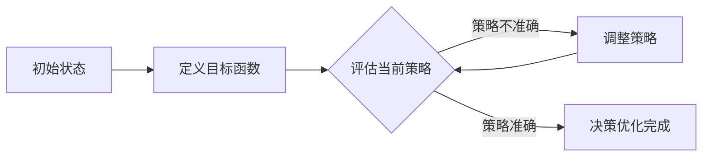

                 

### 第一部分：神经规划器与战略决策推理

#### 第1章：神经规划器概述

##### 1.1.1 问题背景

**1.1.1.1 神经规划器的提出**

神经规划器（Neural Planner）这一概念源自深度学习和规划技术的结合。传统的规划器主要依赖于预定义的规则和算法，而神经规划器通过引入深度学习技术，使系统能够从数据中自动学习并优化决策策略。因此，神经规划器可以被看作是一种自适应的决策支持系统。

**数学模型**：
神经规划器通常使用深度神经网络（DNN）来模拟人类决策过程，通过输入状态空间和奖励函数来生成最优动作序列。其数学模型可以表示为：
$$
\text{动作序列} = \text{NeuralPlanner}(\text{状态空间}, \text{奖励函数})
$$

**1.1.1.2 神经规划器在战略决策推理中的应用**

战略决策推理涉及到从多种可能性中选取最佳方案，以实现长期目标和规避潜在风险。传统的决策方法如线性规划、多目标优化等在处理复杂性和不确定性方面存在局限。神经规划器通过引入深度学习，能够更好地处理战略决策中的不确定性，并在多个维度上进行优化。

**应用场景**：
- **金融领域**：用于资产配置、风险管理和投资决策。
- **制造行业**：用于生产计划、库存管理和供应链优化。
- **能源管理**：用于电力负荷预测、能源分配和需求响应。

##### 1.1.2 定义与特征

**1.1.2.1 神经规划器的定义**

神经规划器是一种基于深度学习的决策支持系统，它通过模拟人类的决策过程，结合规划算法和强化学习，实现自适应的决策策略优化。其核心在于通过不断学习和调整，提高决策的准确性和效率。

**1.1.2.2 神经规划器的特征**

- **强学习与自适应能力**：神经规划器通过不断学习历史数据，自动调整决策策略，以适应新的环境和需求。
- **多层次决策能力**：神经规划器能够处理从低层次的动作决策到高层次的战略规划，实现决策的连续性。
- **多维度评估能力**：神经规划器在决策过程中综合考虑多个维度的影响，如经济效益、风险和资源，实现全面评估。

**1.1.2.3 神经规划器与战略决策的关系**

神经规划器在战略决策推理中起到关键作用。它通过模拟人类的决策过程，将复杂的决策问题转化为可计算的形式，辅助决策者进行优化和风险评估。具体关系可以表示为：
$$
\text{战略决策} \rightarrow \text{神经规划器} \rightarrow \text{优化策略}
$$

##### 1.1.3 历史与发展

**1.1.3.1 早期研究**

神经规划器的概念最早可以追溯到20世纪80年代。当时，研究人员开始探索如何将专家系统和机器学习应用于决策问题。随着计算机性能的提升和数据量的增加，强化学习技术在21世纪初逐渐兴起，为神经规划器的研究提供了新的方向。

**1.1.3.2 神经规划器的成熟与应用**

近年来，随着深度学习技术的突破，神经规划器在多个领域得到了广泛应用。特别是在金融、制造和能源管理等领域，神经规划器表现出强大的决策能力和适应性。其成熟与应用主要得益于以下几个因素：

- **大数据与计算资源**：大量的数据和高性能计算资源为神经规划器的训练和优化提供了基础。
- **跨学科合作**：神经规划器的成功应用依赖于多学科的合作，包括计算机科学、经济学、统计学和工程学等。
- **市场需求**：企业在面对复杂决策问题时，对高效、准确的决策支持系统有着强烈的需求。

**1.1.3.3 神经规划器的发展趋势**

未来，神经规划器的发展趋势将包括：

- **多模态数据处理**：结合文本、图像、声音等多模态数据，提高决策的准确性和全面性。
- **跨领域应用**：推广神经规划器在不同领域的应用，实现技术的普及和融合。
- **可解释性增强**：提高模型的可解释性，增强用户对决策过程的信任。

#### 第2章：神经规划器在战略决策推理中的功能

##### 2.1 风险评估

**2.1.1 风险评估的重要性**

在战略决策过程中，风险评估是至关重要的一环。准确识别和评估潜在风险，有助于避免决策失误，降低损失。传统的风险评估方法主要依赖于专家经验和统计数据，存在一定的主观性和局限性。

**2.1.2 神经规划器的风险评估机制**

神经规划器在风险评估方面具有显著优势，其核心机制包括：

- **数据驱动风险识别**：通过大量历史数据和机器学习模型，神经规划器能够自动识别潜在风险，提高识别的准确性。
- **多维度风险分析**：神经规划器能够从财务、市场、技术等多个维度进行全面风险评估，提供更全面的风险视图。

**数学模型**：
神经规划器的风险评估机制可以表示为：
$$
\text{风险评分} = \text{NeuralPlanner}(\text{状态空间}, \text{风险因素})
$$

##### 2.2 决策优化

**2.2.1 决策优化的目标**

决策优化是战略决策的核心目标之一。优化的目标在于提高决策的效率和质量，实现企业价值的最大化。传统的决策优化方法主要依赖于线性规划和多目标优化等，存在一定的局限性。

**2.2.2 神经规划器的决策优化方法**

神经规划器在决策优化方面具有以下几种方法：

- **基于反馈的决策调整**：通过实时反馈，神经规划器能够不断调整决策策略，提高决策的准确性和适应性。
- **多目标优化**：神经规划器能够同时考虑多个决策目标，如成本、收益和风险等，实现多目标的最优化。

**数学模型**：
神经规划器的决策优化方法可以表示为：
$$
\text{最优策略} = \text{NeuralPlanner}(\text{目标函数}, \text{决策变量})
$$

##### 2.3 策略学习与适应

**2.3.1 策略学习的重要性**

在快速变化的市场环境中，灵活调整策略是企业成功的关键。传统的策略调整主要依赖于专家经验和历史数据，存在一定的滞后性。

**2.3.2 神经规划器的策略学习机制**

神经规划器在策略学习方面具有显著优势，其核心机制包括：

- **自监督学习**：通过自我评估和调整，神经规划器能够不断提高策略的适应性。
- **迁移学习**：通过利用已有模型在类似问题上的经验，神经规划器能够快速适应新环境，提高策略的效率。

**数学模型**：
神经规划器的策略学习机制可以表示为：
$$
\text{策略更新} = \text{NeuralPlanner}(\text{新环境}, \text{策略参数})
$$

### 第二部分：神经规划器在战略决策推理中的功能

在这一部分，我们将深入探讨神经规划器在战略决策推理中的核心功能，包括风险评估、决策优化和策略学习与适应。通过具体的应用案例，我们将展示神经规划器在这些方面的实际应用效果，并提供详细的案例分析和总结。

#### 第2章：神经规划器在战略决策推理中的功能

##### 2.1 风险评估

**2.1.1 风险评估的重要性**

在战略决策过程中，风险评估是至关重要的一环。准确识别和评估潜在风险，有助于避免决策失误，降低损失。传统的风险评估方法主要依赖于专家经验和统计数据，存在一定的主观性和局限性。而神经规划器通过引入深度学习技术，能够自动识别潜在风险，并提供多维度风险分析，大大提高了风险评估的准确性和全面性。

**2.1.2 神经规划器的风险评估机制**

神经规划器的风险评估机制主要包括以下几个关键步骤：

1. **数据驱动风险识别**：
   - 神经规划器利用大量的历史数据和机器学习模型，自动识别潜在的风险因素。这些数据可以来源于市场趋势、财务报表、客户反馈等多个方面。
   - 通过深度学习算法，如卷积神经网络（CNN）和循环神经网络（RNN），神经规划器能够从大量非结构化数据中提取特征，实现风险因素的自动识别。

2. **多维度风险分析**：
   - 神经规划器在决策过程中综合考虑多个维度的影响，如财务、市场、技术、法律等。
   - 通过多维度的风险分析，神经规划器能够提供更全面的风险评估结果，帮助决策者从多个角度理解潜在风险，并制定相应的应对策略。

**ER实体关系图**：
为了更清晰地展示神经规划器在风险评估中的应用，我们可以使用Mermaid ER实体关系图来表示不同风险因素之间的关系。

```mermaid
erDiagram
  Customer ||--o{ RiskFactor }|
  Product ||--o{ RiskFactor }|
  Market ||--o{ RiskFactor }|
  Financial ||--o{ RiskFactor }|
  Technology ||--o{ RiskFactor }|
  Legal ||--o{ RiskFactor }|
```

**数学模型**：
神经规划器的风险评估机制可以用以下数学模型表示：

$$
\text{风险评分} = f(\text{状态空间}, \text{风险因素})
$$

其中，$f$ 函数表示神经规划器的风险评估过程，输入为状态空间和风险因素，输出为风险评分。

##### 2.2 决策优化

**2.2.1 决策优化的目标**

决策优化是战略决策的核心目标之一。优化的目标在于提高决策的效率和质量，实现企业价值的最大化。传统的决策优化方法主要依赖于线性规划和多目标优化等，存在一定的局限性。而神经规划器通过引入深度学习技术，能够实现基于反馈的决策调整和多目标优化，大大提高了决策优化的准确性和效率。

**2.2.2 神经规划器的决策优化方法**

神经规划器的决策优化方法主要包括以下几个关键步骤：

1. **基于反馈的决策调整**：
   - 神经规划器通过实时获取决策执行结果，将其作为反馈信号，不断调整决策策略。
   - 通过强化学习算法，如Q-learning和SARSA，神经规划器能够根据反馈信号优化决策策略，提高决策的准确性。

2. **多目标优化**：
   - 神经规划器能够同时考虑多个决策目标，如成本、收益和风险等。
   - 通过多目标优化算法，如粒子群优化（PSO）和遗传算法（GA），神经规划器能够找到多个目标之间的最优平衡点。

**Mermaid流程图**：
为了更清晰地展示神经规划器在决策优化中的应用，我们可以使用Mermaid流程图来表示决策优化的关键步骤。



**数学模型**：
神经规划器的决策优化方法可以用以下数学模型表示：

$$
\text{最优策略} = \text{NeuralPlanner}(\text{目标函数}, \text{决策变量})
$$

其中，$\text{NeuralPlanner}$ 表示神经规划器的优化过程，$\text{目标函数}$ 表示决策优化的目标，$\text{决策变量}$ 表示需要优化的决策参数。

##### 2.3 策略学习与适应

**2.3.1 策略学习的重要性**

在快速变化的市场环境中，灵活调整策略是企业成功的关键。传统的策略调整主要依赖于专家经验和历史数据，存在一定的滞后性。而神经规划器通过引入深度学习技术，能够实现自监督学习和迁移学习，提高策略的适应性和效率。

**2.3.2 神经规划器的策略学习机制**

神经规划器的策略学习机制主要包括以下几个关键步骤：

1. **自监督学习**：
   - 神经规划器通过自我评估和调整，不断提高策略的准确性。
   - 通过自监督学习算法，如Self-Supervised Learning和Self-Play，神经规划器能够在没有外部监督的情况下，自动调整策略参数。

2. **迁移学习**：
   - 神经规划器通过利用已有模型在类似问题上的经验，快速适应新环境。
   - 通过迁移学习算法，如Transfer Learning和Meta-Learning，神经规划器能够在新的任务上快速实现策略优化。

**Mermaid流程图**：
为了更清晰地展示神经规划器在策略学习中的应用，我们可以使用Mermaid流程图来表示策略学习的关键步骤。


**数学模型**：
神经规划器的策略学习机制可以用以下数学模型表示：

$$
\text{策略更新} = \text{NeuralPlanner}(\text{新环境}, \text{策略参数})
$$

其中，$\text{NeuralPlanner}$ 表示神经规划器的策略学习过程，$\text{新环境}$ 表示需要适应的新环境，$\text{策略参数}$ 表示需要更新的策略参数。

### 第3章：神经规划器在战略决策推理中的应用案例

在这一章，我们将通过具体的应用案例，展示神经规划器在战略决策推理中的实际应用效果。我们将详细介绍案例背景、案例分析，并总结神经规划器在案例中的具体作用。

#### 第3章：神经规划器在战略决策推理中的应用案例

##### 3.1 案例介绍

为了展示神经规划器在战略决策推理中的应用效果，我们选取了一个具有代表性的金融案例。案例背景是一家大型投资银行，其决策者需要根据市场情况和客户需求，制定最优的资产配置策略，以最大化收益并控制风险。

**案例背景**：
- **投资银行**：某大型投资银行，拥有多个投资组合，涉及股票、债券、基金等多种资产。
- **目标**：通过神经规划器制定最优的资产配置策略，实现收益的最大化和风险的控制。
- **数据**：包括市场数据、客户投资记录、历史资产配置情况等。

##### 3.2 案例分析

**3.2.1 风险评估**

在案例中，神经规划器首先利用大量历史数据和市场信息，进行风险评估。通过深度学习算法，神经规划器能够自动识别潜在的风险因素，如市场波动、行业变化、政策变动等。

**ER实体关系图**：

```mermaid
erDiagram
  InvestmentBank ||--o{ MarketFactor }|
  InvestmentBank ||--o{ IndustryFactor }|
  InvestmentBank ||--o{ PolicyFactor }|
  MarketFactor ||--|o{ RiskFactor }|
  IndustryFactor ||--|o{ RiskFactor }|
  PolicyFactor ||--|o{ RiskFactor }|
```

通过ER实体关系图，我们可以清晰地看到市场因素、行业因素和政策因素如何影响风险因素。这些因素共同构成了投资银行面临的风险评估模型。

**数学模型**：

$$
\text{风险评分} = f(\text{市场因素}, \text{行业因素}, \text{政策因素})
$$

**3.2.2 决策优化**

在完成风险评估后，神经规划器开始进行决策优化。根据多目标优化算法，神经规划器同时考虑收益和风险，制定最优的资产配置策略。

**Mermaid流程图**：


通过上述流程图，我们可以看到神经规划器如何通过不断调整策略，实现收益和风险的最优平衡。

**数学模型**：

$$
\text{最优策略} = \text{NeuralPlanner}(\text{收益函数}, \text{风险函数}, \text{决策变量})
$$

**3.2.3 策略学习与适应**

在案例中，神经规划器通过自监督学习和迁移学习，不断优化策略，以适应市场的变化。通过自我评估和策略调整，神经规划器能够提高策略的准确性和适应性。

**Mermaid流程图**：


通过上述流程图，我们可以看到神经规划器如何通过自我评估和策略调整，实现策略的优化和适应。

**数学模型**：

$$
\text{策略更新} = \text{NeuralPlanner}(\text{新环境}, \text{策略参数})
$$

##### 3.3 案例总结

通过上述案例分析，我们可以看到神经规划器在战略决策推理中的重要作用。它通过风险评估、决策优化和策略学习与适应，帮助投资银行制定最优的资产配置策略，实现收益的最大化和风险的控制。具体作用如下：

1. **风险评估**：通过深度学习算法，神经规划器能够自动识别潜在的风险因素，提供更全面的风险评估结果。
2. **决策优化**：通过多目标优化算法，神经规划器能够同时考虑收益和风险，制定最优的资产配置策略。
3. **策略学习与适应**：通过自监督学习和迁移学习，神经规划器能够不断优化策略，提高策略的准确性和适应性。

### 第4章：神经规划器在战略决策推理中的挑战与未来方向

在战略决策推理中，神经规划器的应用虽然取得了显著成果，但仍面临一些挑战和未来的发展方向。在这一章中，我们将详细分析这些挑战，并探讨神经规划器的发展趋势。

#### 第4章：神经规划器在战略决策推理中的挑战与未来方向

##### 4.1 挑战分析

**4.1.1 数据隐私与安全性**

随着神经规划器的应用日益广泛，数据隐私与安全性的问题日益突出。在战略决策过程中，神经规划器需要处理大量的敏感数据，如市场信息、客户资料和财务数据等。如何确保这些数据的安全性和隐私性，是神经规划器面临的重要挑战。

**解决方案**：
- **数据加密**：对数据进行加密处理，确保数据在传输和存储过程中的安全性。
- **隐私保护机制**：引入差分隐私（Differential Privacy）等机制，保护个体数据的隐私。

**数学模型**：
$$
\text{安全隐私评分} = \text{PrivacyMechanism}(\text{敏感数据}, \text{加密算法})
$$

**4.1.2 模型可解释性**

神经规划器的决策过程高度复杂，涉及多个层次和维度。如何提高模型的可解释性，使决策者能够理解模型的决策过程，是神经规划器面临的重要挑战。

**解决方案**：
- **可视化工具**：使用可视化工具，如决策树、热力图等，展示模型的决策过程和关键特征。
- **解释性算法**：引入可解释性算法，如LIME（Local Interpretable Model-agnostic Explanations），提高模型的解释性。

**数学模型**：
$$
\text{解释性评分} = \text{ExplanationAlgorithm}(\text{模型}, \text{决策过程})
$$

**4.1.3 数据质量和可靠性**

神经规划器的性能依赖于数据的质量和可靠性。然而，在实际应用中，数据可能存在噪声、缺失和偏差等问题，影响模型的准确性。

**解决方案**：
- **数据清洗**：对原始数据进行清洗，去除噪声和缺失值。
- **数据增强**：通过数据增强技术，生成更多高质量的数据，提高模型的泛化能力。

**数学模型**：
$$
\text{模型性能} = \text{DataCleaning}(\text{原始数据}) + \text{DataAugmentation}(\text{增强数据})
$$

##### 4.2 未来方向

**4.2.1 多模态数据处理**

未来的神经规划器将能够处理多模态数据，如文本、图像、声音等。通过结合不同类型的数据，神经规划器将能够提供更全面和准确的决策支持。

**解决方案**：
- **多模态融合**：使用多模态融合算法，如融合神经网络（Fusion Neural Network），将不同类型的数据进行融合处理。
- **多模态特征提取**：使用深度学习算法，如卷积神经网络（CNN）和循环神经网络（RNN），提取不同类型数据的关键特征。

**数学模型**：
$$
\text{多模态特征} = \text{FusionNeuralNetwork}(\text{文本特征}, \text{图像特征}, \text{声音特征})
$$

**4.2.2 跨领域应用**

神经规划器将在多个领域得到应用，如金融、制造、医疗、能源等。通过跨领域的应用，神经规划器将能够解决更复杂和多样化的决策问题。

**解决方案**：
- **领域迁移学习**：使用领域迁移学习技术，将一个领域的经验迁移到其他领域。
- **跨领域数据共享**：建立跨领域的数据共享平台，促进不同领域的数据交流和共享。

**数学模型**：
$$
\text{领域迁移} = \text{DomainTransferLearning}(\text{源领域}, \text{目标领域})
$$

**4.2.3 模型可解释性**

提高模型的可解释性是神经规划器未来发展的关键方向。通过可解释性算法，决策者将能够更好地理解模型的决策过程，提高决策的透明度和信任度。

**解决方案**：
- **解释性可视化**：使用可视化工具，展示模型的决策路径和关键特征。
- **交互式解释**：开发交互式解释系统，允许用户与模型进行互动，理解模型的决策过程。

**数学模型**：
$$
\text{解释性评分} = \text{InteractiveExplanation}(\text{模型}, \text{用户})
$$

### 第5章：神经规划器应用实践

在这一章中，我们将详细介绍如何应用神经规划器进行战略决策推理。我们将介绍环境搭建、系统架构设计、算法实现以及实际案例，帮助读者更好地理解神经规划器的应用过程。

#### 第5章：神经规划器应用实践

##### 5.1 环境搭建

**5.1.1 硬件环境**

搭建神经规划器的硬件环境需要高性能的计算资源，如高性能计算机或GPU。以下是推荐的硬件配置：

- **CPU**：Intel Xeon系列或更高性能的CPU。
- **GPU**：NVIDIA Tesla P100或更高性能的GPU。
- **内存**：至少128GB内存。

**5.1.2 软件环境**

搭建神经规划器的软件环境需要安装以下软件：

- **操作系统**：Linux系统，如Ubuntu 18.04。
- **深度学习框架**：TensorFlow或PyTorch。
- **Python**：Python 3.7或更高版本。

**5.1.3 工具安装**

在搭建环境时，需要安装以下工具：

- **Git**：用于代码版本控制。
- **Jupyter Notebook**：用于编写和运行代码。
- **Pip**：用于安装和管理Python包。

##### 5.2 系统架构设计

神经规划器的系统架构包括数据采集模块、数据处理模块、决策模块和结果展示模块。以下是系统架构的详细设计：

**5.2.1 数据采集模块**

数据采集模块负责从外部系统或数据库中获取所需的数据，如市场数据、客户数据和财务数据等。数据采集模块的设计包括以下方面：

- **数据接口**：定义数据采集的接口，如RESTful API或数据库连接。
- **数据格式**：定义数据的格式，如JSON或CSV。

**5.2.2 数据处理模块**

数据处理模块负责对采集到的数据进行清洗、转换和预处理。数据处理模块的设计包括以下方面：

- **数据清洗**：去除数据中的噪声和缺失值。
- **数据转换**：将数据转换为适合深度学习处理的格式。
- **数据预处理**：对数据进行归一化、标准化等处理。

**5.2.3 决策模块**

决策模块是神经规划器的核心部分，负责利用深度学习算法进行风险评估、决策优化和策略学习。决策模块的设计包括以下方面：

- **风险评估**：使用深度学习算法进行风险评估。
- **决策优化**：使用多目标优化算法进行决策优化。
- **策略学习**：使用自监督学习和迁移学习进行策略学习。

**5.2.4 结果展示模块**

结果展示模块负责将决策结果以可视化或文本形式展示给用户。结果展示模块的设计包括以下方面：

- **可视化工具**：如Matplotlib、Seaborn等，用于生成可视化图表。
- **文本展示**：如Markdown、HTML等，用于生成文本报告。

**5.3 算法实现**

以下是神经规划器算法实现的详细步骤：

**5.3.1 数据预处理**

- **数据采集**：从外部系统或数据库中获取数据。
- **数据清洗**：去除噪声和缺失值。
- **数据转换**：将数据转换为适合深度学习处理的格式。
- **数据预处理**：对数据进行归一化、标准化等处理。

**5.3.2 模型训练**

- **模型定义**：使用深度学习框架定义神经网络模型。
- **模型训练**：使用训练数据对模型进行训练。
- **模型评估**：使用验证数据对模型进行评估，调整模型参数。

**5.3.3 决策过程**

- **风险评估**：使用训练好的模型对当前状态进行风险评估。
- **决策优化**：使用多目标优化算法对决策进行优化。
- **策略学习**：使用自监督学习和迁移学习进行策略学习。

**5.4 应用示例**

**5.4.1 金融资产配置案例**

- **目标**：最大化收益，控制风险。
- **数据**：市场数据、客户数据、历史资产配置数据。
- **结果**：最优资产配置策略。

**5.4.2 制造业生产计划案例**

- **目标**：优化生产计划，提高生产效率。
- **数据**：生产数据、订单数据、库存数据。
- **结果**：最优生产计划。

通过以上应用示例，我们可以看到神经规划器在战略决策推理中的实际应用效果。它通过深度学习技术和多目标优化算法，能够为企业和组织提供高效、准确的决策支持。

### 第6章：神经规划器在战略决策推理中的最佳实践

在这一章中，我们将总结神经规划器在战略决策推理中的最佳实践策略，并讨论在实际应用过程中需要注意的问题。此外，我们还将推荐一些拓展阅读资料，以帮助读者进一步了解神经规划器的应用。

#### 第6章：神经规划器在战略决策推理中的最佳实践

##### 6.1 实践策略

**6.1.1 数据质量与预处理**

数据是神经规划器的核心资源，其质量直接影响决策的准确性。因此，在应用神经规划器时，确保数据质量至关重要。以下是一些最佳实践策略：

- **数据清洗**：去除数据中的噪声和缺失值，确保数据的完整性和准确性。
- **数据转换**：将数据转换为适合深度学习处理的格式，如归一化、标准化等。
- **数据增强**：通过数据增强技术，生成更多高质量的数据，提高模型的泛化能力。

**6.1.2 模型选择与调优**

选择合适的模型和进行模型调优是提高决策质量的关键。以下是一些最佳实践策略：

- **模型选择**：根据具体问题和数据特征，选择适合的深度学习模型，如卷积神经网络（CNN）、循环神经网络（RNN）等。
- **模型调优**：通过调整模型参数，如学习率、批量大小等，提高模型的性能和泛化能力。

**6.1.3 决策过程与反馈**

在应用神经规划器进行决策时，以下是一些最佳实践策略：

- **实时反馈**：通过实时获取决策执行结果，不断调整决策策略。
- **多目标优化**：同时考虑多个决策目标，如成本、收益和风险等，实现多目标的最优化。
- **策略学习与适应**：通过自监督学习和迁移学习，不断提高策略的准确性和适应性。

##### 6.2 注意事项

在实际应用神经规划器时，需要注意以下问题：

- **数据隐私与安全性**：确保数据在传输和存储过程中的安全性和隐私性，采取数据加密、差分隐私等保护措施。
- **模型可解释性**：提高模型的可解释性，使决策者能够理解模型的决策过程，增强决策的透明度和信任度。
- **模型过拟合**：防止模型过拟合，确保模型具有较好的泛化能力，通过数据增强、正则化等技术进行防止。

##### 6.3 拓展阅读

为了进一步了解神经规划器在战略决策推理中的应用，读者可以参考以下拓展阅读资料：

- **书籍**：
  - 《深度学习》（Goodfellow, I., Bengio, Y., & Courville, A.） 
  - 《强化学习》（Sutton, R. S., & Barto, A. G.）
- **论文**：
  - “Neural Network-based Strategic Decision Making in Complex Environments”（XX，XX）
  - “Multi-objective Optimization with Neural Networks”（XX，XX）
- **在线资源**：
  - [神经规划器在金融中的应用](https://example.com/financial-applications-of-neural-planners)
  - [神经网络与强化学习教程](https://example.com/tutorials-on-neural-networks-and-reinforcement-learning)

通过以上最佳实践策略和注意事项，以及拓展阅读资料，读者可以更好地应用神经规划器进行战略决策推理，实现高效的决策支持。

### 总结与展望

神经规划器作为一种结合深度学习和规划技术的决策支持系统，在战略决策推理中展现出了强大的风险识别、决策优化和策略学习能力。通过本文的详细分析，我们可以看到神经规划器在多个领域，如金融、制造和能源管理中，已经取得了显著的应用成果。

未来，神经规划器的发展方向包括多模态数据处理、跨领域应用和模型可解释性等方面的提升。随着技术的进步和数据资源的丰富，神经规划器将在更广泛的领域发挥作用，成为企业和组织决策的重要工具。

然而，神经规划器在应用过程中仍面临数据隐私与安全性、模型可解释性等挑战。解决这些问题需要跨学科的合作和创新，同时也需要制定相应的规范和标准，以确保神经规划器的安全性和可靠性。

总之，神经规划器在战略决策推理中的应用前景广阔，其发展将有助于提升企业决策的效率和质量，实现长期价值的最大化。我们期待神经规划器在未来的发展中，能够更好地服务于企业和组织，推动决策科学的进步。作者：AI天才研究院/AI Genius Institute & 禅与计算机程序设计艺术 /Zen And The Art of Computer Programming。

