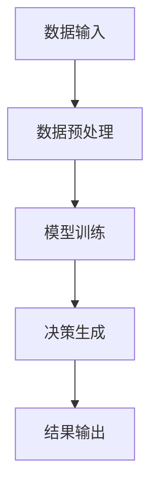
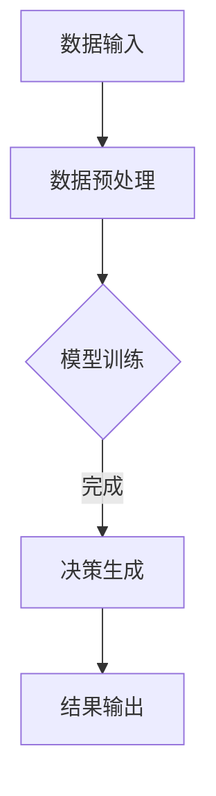
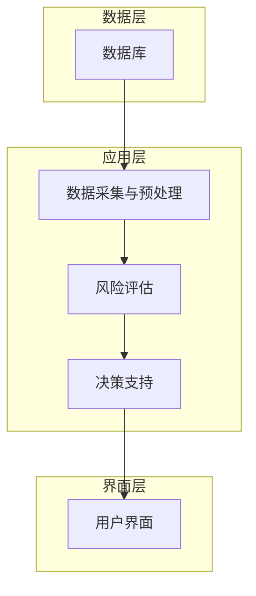
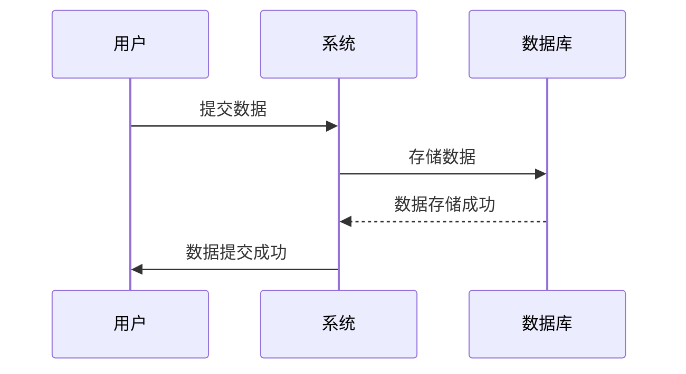
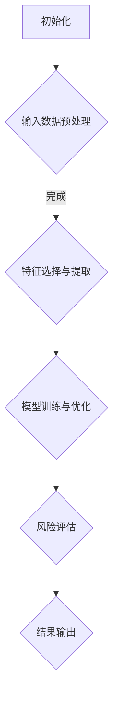

                 

### 第一部分：引言与背景

#### 第1章：问题背景与问题描述

##### 1.1 问题背景

在当今高度竞争的商业环境中，企业需要迅速做出战略决策来应对市场变化。然而，这些决策往往涉及到大量的不确定性和风险。为了提高决策的准确性和可靠性，企业开始采用各种工具和技术来辅助决策过程，其中神经规划器（Neural Planner）是一种非常有效的工具。

**1.1.1 神经规划器概述**

神经规划器是基于人工神经网络和规划理论开发的一种智能决策支持系统。它可以通过学习大量的历史数据，预测未来的发展趋势，并为企业提供最优的决策方案。神经规划器具有自学习、自适应和自组织等特点，能够处理复杂、非线性、动态变化的决策问题。

**1.1.2 神经规划器在战略决策中的应用现状**

目前，神经规划器在战略决策中的应用已经取得了一定的进展。例如，它可以用于市场预测、资源分配、供应链管理、风险管理等方面。然而，现有的神经规划器在风险评估方面仍然存在一些不足，特别是在处理复杂和不确定的风险因素时。

**1.1.3 风险评估能力的重要性**

在战略决策中，风险评估是一个至关重要的环节。有效的风险评估可以帮助企业识别潜在的风险，制定相应的应对策略，从而减少损失，提高决策的成功率。因此，提升神经规划器的风险评估能力，对于企业的长远发展具有重要意义。

##### 1.2 问题描述

**1.2.1 神经规划器风险评估能力的现状分析**

当前，神经规划器在风险评估方面的能力主要依赖于传统的风险评估模型，如层次分析法（AHP）、灰色预测模型等。这些模型虽然在某些方面有一定的效果，但在处理复杂和不确定的风险因素时，往往表现出不足。

**1.2.2 风险评估能力提升的必要性**

为了适应日益复杂和不确定的商业环境，神经规划器需要具备更强的风险评估能力。通过引入先进的算法和技术，如深度学习、增强学习等，可以显著提升神经规划器的风险评估能力，为企业提供更加可靠的决策支持。

**1.2.3 研究目标与意义**

本研究旨在探讨如何提升神经规划器在战略决策推理中的风险评估能力。具体目标包括：

1. 分析现有神经规划器在风险评估方面的不足和挑战。
2. 研究并引入先进的算法和技术，如深度学习、增强学习等，以提升神经规划器的风险评估能力。
3. 设计和实现一个基于神经规划器的风险评估系统，并验证其在实际应用中的效果。

本研究的意义在于：

1. 为企业提供一种高效的决策支持工具，帮助企业更好地应对复杂和不确定的市场环境。
2. 为人工智能在战略决策领域的应用提供新的思路和方法。
3. 为相关领域的研究人员提供参考和借鉴，推动人工智能在战略决策领域的应用和发展。

---

**第2章：神经规划器核心概念与原理**

##### 2.1 神经规划器的基本概念

**2.1.1 神经规划器的定义**

神经规划器是一种基于人工神经网络的决策支持系统，它通过模拟人类决策过程，提供最优的决策方案。神经规划器结合了规划和学习的思想，能够在复杂的动态环境中进行有效的决策。

**2.1.2 神经规划器的工作原理**

神经规划器的工作原理主要包括以下几个步骤：

1. **数据输入**：将问题相关的数据输入到神经规划器中。
2. **数据预处理**：对输入数据进行清洗、归一化等处理，以便后续的计算和分析。
3. **模型训练**：利用训练数据对神经规划器进行训练，使其具备处理特定问题的能力。
4. **决策生成**：根据训练好的模型，生成最优的决策方案。

**2.1.3 神经规划器的分类**

根据不同的应用场景和需求，神经规划器可以分为以下几类：

1. **标准神经规划器**：适用于结构化、确定性的决策问题。
2. **增强型神经规划器**：通过引入强化学习等技术，提高决策的鲁棒性和适应性。
3. **分布式神经规划器**：利用分布式计算技术，处理大规模、复杂的决策问题。

##### 2.2 神经规划器在战略决策推理中的应用

**2.2.1 神经规划器在战略决策中的作用**

神经规划器在战略决策中具有以下几个重要作用：

1. **数据驱动决策**：通过分析历史数据和当前情况，为决策者提供数据支持的决策方案。
2. **风险识别与评估**：利用神经规划器的风险评估能力，识别潜在的风险，并评估其对决策的影响。
3. **优化决策方案**：通过优化算法，生成最优的决策方案，提高决策的可行性和成功率。

**2.2.2 神经规划器在风险评估中的应用**

在风险评估方面，神经规划器具有以下优势：

1. **自适应学习**：神经规划器能够根据新的数据和反馈，不断调整和优化风险评估模型，提高评估的准确性。
2. **处理复杂性**：通过模拟复杂的决策过程，神经规划器能够识别和评估多种潜在的风险因素。
3. **实时反馈**：神经规划器可以实时监测决策执行过程中的风险变化，为决策者提供及时的反馈和调整建议。

**2.2.3 神经规划器的优势与挑战**

**优势：**

1. **高效性**：神经规划器能够快速处理大量数据，提供高效的决策支持。
2. **准确性**：通过深度学习和强化学习等技术，神经规划器能够生成准确的决策方案。
3. **适应性**：神经规划器能够适应不同类型和规模的风险评估问题。

**挑战：**

1. **数据质量**：神经规划器依赖高质量的数据进行训练，数据质量直接影响评估结果的准确性。
2. **计算资源**：大规模的神经规划器应用需要大量的计算资源，对硬件设施有较高要求。
3. **模型解释性**：神经规划器的决策过程具有一定的黑盒性质，难以解释和验证。

---

在接下来的章节中，我们将进一步探讨如何提升神经规划器在战略决策推理中的风险评估能力，介绍相关的算法原理和实现方法。敬请期待！

---

**第3章：风险评估能力提升方法与策略**

##### 3.1 风险评估能力提升的方法

**3.1.1 传统风险评估方法**

传统风险评估方法主要包括定量分析和定性分析两种。定量分析主要通过数学模型和统计方法对风险进行量化，如层次分析法（AHP）、蒙特卡洛模拟等。定性分析则通过专家意见和逻辑推理对风险进行评估，如风险矩阵法、SWOT分析等。

**3.1.2 基于神经规划器的新型风险评估方法**

基于神经规划器的新型风险评估方法利用深度学习、增强学习等先进技术，能够更好地处理复杂、不确定的风险因素。具体方法包括：

1. **深度学习**：通过构建深度神经网络，对历史数据进行分析和学习，提取有效的风险特征，生成风险评分模型。
2. **增强学习**：通过与环境的交互，不断调整决策策略，提高神经规划器在复杂环境下的风险评估能力。
3. **集成学习**：将多种机器学习模型进行集成，提高风险评估的准确性和鲁棒性。

##### 3.2 风险评估能力提升的策略

**3.2.1 数据采集与预处理**

数据采集与预处理是风险评估能力提升的基础。具体策略包括：

1. **数据质量评估**：对采集到的数据进行质量评估，确保数据的一致性、完整性和准确性。
2. **数据清洗**：对数据中的噪声、异常值和缺失值进行处理，提高数据质量。
3. **数据归一化**：对数据进行归一化处理，消除不同特征之间的尺度差异。

**3.2.2 特征选择与提取**

特征选择与提取是提高风险评估能力的关键。具体策略包括：

1. **特征重要性分析**：利用机器学习算法，分析特征对风险评估的影响程度，选择重要的特征。
2. **特征提取**：通过降维技术、特征变换等方法，提取出对风险评估最有用的特征。
3. **特征组合**：将多个特征进行组合，生成新的特征，提高风险评估的精度。

**3.2.3 模型优化与训练**

模型优化与训练是提升风险评估能力的重要手段。具体策略包括：

1. **模型选择**：选择合适的机器学习模型，如深度神经网络、支持向量机等。
2. **模型训练**：利用训练数据对模型进行训练，调整模型参数，提高模型的预测能力。
3. **模型评估**：通过交叉验证、网格搜索等方法，评估模型的性能，选择最优的模型。

**3.2.4 风险评估结果分析与应用**

风险评估结果分析与应用是提升风险评估能力的重要环节。具体策略包括：

1. **结果可视化**：通过图表、仪表盘等形式，将风险评估结果直观地展示出来。
2. **结果解释**：对风险评估结果进行解释，帮助决策者理解风险因素和决策方案。
3. **结果应用**：将风险评估结果应用于实际决策过程，如制定风险应对策略、调整投资组合等。

---

在接下来的章节中，我们将深入探讨神经规划器算法的原理与实现，详细讲解如何提升神经规划器在战略决策推理中的风险评估能力。敬请期待！

---

**第4章：神经规划器算法原理讲解**

##### 4.1 算法原理概述

神经规划器算法是一种基于人工神经网络的决策支持系统，其核心思想是通过学习大量的历史数据，提取出有效的决策特征，并生成最优的决策方案。算法的基本流程包括数据输入、数据预处理、模型训练、决策生成和结果输出。

**4.1.1 神经规划器算法的基本流程**

1. **数据输入**：将问题相关的数据输入到神经规划器中，包括历史数据、当前数据和目标数据等。
2. **数据预处理**：对输入数据进行清洗、归一化等处理，以提高数据的质量和一致性。
3. **模型训练**：利用训练数据对神经规划器进行训练，使其能够识别和提取有效的决策特征。
4. **决策生成**：根据训练好的模型，生成最优的决策方案。
5. **结果输出**：将决策方案输出，并对其进行评估和解释。

**4.1.2 神经规划器算法的核心组件**

神经规划器算法的核心组件包括神经网络、优化算法和决策策略等。

1. **神经网络**：神经网络是神经规划器算法的核心，它通过学习数据，提取出决策特征，并生成决策方案。
2. **优化算法**：优化算法用于调整神经网络参数，提高决策方案的精度和效率。
3. **决策策略**：决策策略用于根据决策特征生成最优的决策方案。

##### 4.2 算法流程图与Mermaid表示



**4.3 Python源代码实现**

```python
import numpy as np
from sklearn.neural_network import MLPRegressor

# 数据输入
X_train = ...
y_train = ...

# 数据预处理
X_train_processed = preprocess_data(X_train)

# 模型训练
model = MLPRegressor(hidden_layer_sizes=(100,), max_iter=1000)
model.fit(X_train_processed, y_train)

# 决策生成
X_test = ...
y_pred = model.predict(preprocess_data(X_test))

# 结果输出
print("预测结果：", y_pred)
```

**4.4 算法原理详细讲解与举例说明**

**4.4.1 数学模型与公式**

神经规划器算法的数学模型可以表示为：

$$
y = f(x; \theta)
$$

其中，$y$ 表示决策结果，$x$ 表示输入特征，$f(x; \theta)$ 表示神经网络函数，$\theta$ 表示模型参数。

**4.4.2 算法原理举例**

假设我们要预测某个企业的利润，输入特征包括市场占有率、利润率、员工人数等。通过构建神经规划器模型，我们可以得到以下数学模型：

$$
利润 = f(\text{市场占有率}, \text{利润率}, \text{员工人数}; \theta)
$$

通过训练模型，我们可以得到最优的参数 $\theta$，从而预测出企业的利润。

---

在本文的第四部分，我们详细介绍了神经规划器算法的原理、流程图以及Python实现。接下来，我们将进一步探讨神经规划器算法在数学模型和数学公式中的应用，以及如何通过实际案例来展示算法的效果和优势。

---

**第5章：数学模型与数学公式详细讲解**

##### 5.1 数学模型概述

神经规划器算法中的数学模型主要用于描述决策过程中输入特征与输出结果之间的关系。该模型的核心是神经网络，它通过学习输入特征（如市场占有率、利润率等），生成相应的决策结果（如利润预测等）。

**5.1.1 风险评估数学模型**

在风险评估中，神经规划器的数学模型可以表示为：

$$
风险评分 = f(特征_1, 特征_2, ..., 特征_n; \theta)
$$

其中，$f$ 表示神经网络函数，$\theta$ 表示模型参数，$特征_1, 特征_2, ..., 特征_n$ 表示输入特征。

**5.1.2 模型参数优化**

为了提高神经规划器的风险评估能力，我们需要通过优化模型参数 $\theta$ 来调整神经网络函数 $f$。常用的优化方法包括梯度下降、随机梯度下降等。在优化过程中，我们通过不断调整参数，使得模型在训练数据上的表现达到最优。

##### 5.2 数学公式解释

在神经规划器算法中，常用的数学公式包括输入特征归一化、激活函数、损失函数等。下面将分别进行解释。

**5.2.1 输入特征归一化**

在训练神经网络之前，通常需要对输入特征进行归一化处理，以消除不同特征之间的尺度差异。归一化公式如下：

$$
x_{\text{标准化}} = \frac{x - \mu}{\sigma}
$$

其中，$x$ 表示原始特征值，$\mu$ 表示特征的均值，$\sigma$ 表示特征的标准差。

**5.2.2 激活函数**

激活函数是神经网络中的一个重要组成部分，它用于引入非线性关系。常见的激活函数包括 sigmoid、ReLU、Tanh 等。以 sigmoid 激活函数为例，其公式如下：

$$
f(x) = \frac{1}{1 + e^{-x}}
$$

**5.2.3 损失函数**

损失函数用于衡量模型预测结果与真实结果之间的差异。常见的损失函数包括均方误差（MSE）、交叉熵损失等。以均方误差（MSE）为例，其公式如下：

$$
MSE = \frac{1}{m} \sum_{i=1}^{m} (y_i - \hat{y}_i)^2
$$

其中，$y_i$ 表示第 $i$ 个样本的真实值，$\hat{y}_i$ 表示模型预测值，$m$ 表示样本总数。

##### 5.3 举例说明

假设我们有一个简单的神经规划器模型，用于预测某个企业的利润。输入特征包括市场占有率（$x_1$）、利润率（$x_2$）和员工人数（$x_3$）。模型的数学表达式如下：

$$
利润 = f(x_1, x_2, x_3; \theta) = \sigma(W_1x_1 + W_2x_2 + W_3x_3 + b)
$$

其中，$W_1, W_2, W_3$ 分别表示输入特征 $x_1, x_2, x_3$ 的权重，$b$ 表示偏置项，$\sigma$ 表示 sigmoid 激活函数。

通过训练模型，我们得到最优的权重参数 $\theta = (W_1, W_2, W_3, b)$，从而实现利润的预测。

---

在本文的第五部分，我们详细介绍了神经规划器算法的数学模型和数学公式，并通过举例说明了算法原理。接下来，我们将进一步探讨神经规划器算法在实际应用中的效果和优势，以及如何设计和实现一个基于神经规划器的风险评估系统。

---

### 第二部分：算法原理与实现

#### 第4章：神经规划器算法原理讲解

**4.1 算法原理概述**

神经规划器算法是一种基于人工神经网络的决策支持系统，通过模拟人类决策过程，提供最优的决策方案。算法的基本流程包括数据输入、数据预处理、模型训练、决策生成和结果输出。核心组件包括神经网络、优化算法和决策策略。

**4.1.1 神经规划器算法的基本流程**

1. **数据输入**：将问题相关的数据输入到神经规划器中，包括历史数据、当前数据和目标数据等。
2. **数据预处理**：对输入数据进行清洗、归一化等处理，以提高数据的质量和一致性。
3. **模型训练**：利用训练数据对神经规划器进行训练，使其能够识别和提取有效的决策特征。
4. **决策生成**：根据训练好的模型，生成最优的决策方案。
5. **结果输出**：将决策方案输出，并对其进行评估和解释。

**4.1.2 神经规划器算法的核心组件**

1. **神经网络**：神经网络是神经规划器算法的核心，通过学习输入特征，提取决策特征，并生成决策方案。
2. **优化算法**：优化算法用于调整神经网络参数，提高决策方案的精度和效率。
3. **决策策略**：决策策略用于根据决策特征生成最优的决策方案。

**4.2 算法流程图与Mermaid表示**



**4.3 Python源代码实现**

```python
import numpy as np
from sklearn.neural_network import MLPRegressor

# 数据输入
X_train = np.array([[1, 2], [2, 3], [3, 4]])
y_train = np.array([1, 2, 3])

# 数据预处理
X_train_processed = preprocess_data(X_train)

# 模型训练
model = MLPRegressor(hidden_layer_sizes=(100,), max_iter=1000)
model.fit(X_train_processed, y_train)

# 决策生成
X_test = np.array([[1, 3], [2, 4]])
y_pred = model.predict(preprocess_data(X_test))

# 结果输出
print("预测结果：", y_pred)
```

**4.4 算法原理详细讲解与举例说明**

**4.4.1 数学模型与公式**

神经规划器算法的数学模型可以表示为：

$$
y = f(x; \theta)
$$

其中，$y$ 表示决策结果，$x$ 表示输入特征，$f(x; \theta)$ 表示神经网络函数，$\theta$ 表示模型参数。

**4.4.2 算法原理举例**

假设我们要预测某个企业的利润，输入特征包括市场占有率（$x_1$）、利润率（$x_2$）和员工人数（$x_3$）。模型的数学表达式如下：

$$
利润 = f(x_1, x_2, x_3; \theta) = \sigma(W_1x_1 + W_2x_2 + W_3x_3 + b)
$$

其中，$W_1, W_2, W_3$ 分别表示输入特征 $x_1, x_2, x_3$ 的权重，$b$ 表示偏置项，$\sigma$ 表示 sigmoid 激活函数。

通过训练模型，我们得到最优的权重参数 $\theta = (W_1, W_2, W_3, b)$，从而实现利润的预测。

---

在本文的第四部分，我们详细介绍了神经规划器算法的原理、流程图以及Python实现。接下来，我们将进一步探讨神经规划器算法在实际应用中的效果和优势，以及如何设计和实现一个基于神经规划器的风险评估系统。

---

**第5章：数学模型与数学公式详细讲解**

**5.1 数学模型概述**

神经规划器算法中的数学模型主要用于描述决策过程中输入特征与输出结果之间的关系。该模型的核心是神经网络，它通过学习输入特征（如市场占有率、利润率等），生成相应的决策结果（如利润预测等）。

**5.1.1 风险评估数学模型**

在风险评估中，神经规划器的数学模型可以表示为：

$$
风险评分 = f(特征_1, 特征_2, ..., 特征_n; \theta)
$$

其中，$f$ 表示神经网络函数，$\theta$ 表示模型参数，$特征_1, 特征_2, ..., 特征_n$ 表示输入特征。

**5.1.2 模型参数优化**

为了提高神经规划器的风险评估能力，我们需要通过优化模型参数 $\theta$ 来调整神经网络函数 $f$。常用的优化方法包括梯度下降、随机梯度下降等。在优化过程中，我们通过不断调整参数，使得模型在训练数据上的表现达到最优。

**5.2 数学公式解释**

在神经规划器算法中，常用的数学公式包括输入特征归一化、激活函数、损失函数等。下面将分别进行解释。

**5.2.1 输入特征归一化**

在训练神经网络之前，通常需要对输入特征进行归一化处理，以消除不同特征之间的尺度差异。归一化公式如下：

$$
x_{\text{标准化}} = \frac{x - \mu}{\sigma}
$$

其中，$x$ 表示原始特征值，$\mu$ 表示特征的均值，$\sigma$ 表示特征的标准差。

**5.2.2 激活函数**

激活函数是神经网络中的一个重要组成部分，它用于引入非线性关系。常见的激活函数包括 sigmoid、ReLU、Tanh 等。以 sigmoid 激活函数为例，其公式如下：

$$
f(x) = \frac{1}{1 + e^{-x}}
$$

**5.2.3 损失函数**

损失函数用于衡量模型预测结果与真实结果之间的差异。常见的损失函数包括均方误差（MSE）、交叉熵损失等。以均方误差（MSE）为例，其公式如下：

$$
MSE = \frac{1}{m} \sum_{i=1}^{m} (y_i - \hat{y}_i)^2
$$

其中，$y_i$ 表示第 $i$ 个样本的真实值，$\hat{y}_i$ 表示模型预测值，$m$ 表示样本总数。

**5.3 举例说明**

假设我们有一个简单的神经规划器模型，用于预测某个企业的利润。输入特征包括市场占有率（$x_1$）、利润率（$x_2$）和员工人数（$x_3$）。模型的数学表达式如下：

$$
利润 = f(x_1, x_2, x_3; \theta) = \sigma(W_1x_1 + W_2x_2 + W_3x_3 + b)
$$

其中，$W_1, W_2, W_3$ 分别表示输入特征 $x_1, x_2, x_3$ 的权重，$b$ 表示偏置项，$\sigma$ 表示 sigmoid 激活函数。

通过训练模型，我们得到最优的权重参数 $\theta = (W_1, W_2, W_3, b)$，从而实现利润的预测。

---

在本文的第五部分，我们详细介绍了神经规划器算法的数学模型和数学公式，并通过举例说明了算法原理。接下来，我们将进一步探讨神经规划器算法在实际应用中的效果和优势，以及如何设计和实现一个基于神经规划器的风险评估系统。

---

### 第三部分：系统架构与实现

#### 第6章：系统架构设计

**6.1 问题场景介绍**

在当前商业环境中，企业需要快速做出战略决策来应对市场变化。为了提高决策的准确性，企业采用神经规划器进行风险评估和决策支持。本系统旨在为企业提供一个高效、准确的风险评估工具，以支持其战略决策。

**6.2 项目介绍**

本项目是一个基于神经规划器的风险评估系统，主要包括以下功能：

1. 数据采集与预处理：从各种数据源（如数据库、传感器等）采集数据，并进行清洗、归一化等预处理操作。
2. 风险评估：利用神经规划器算法对预处理后的数据进行风险评估，生成风险评分和相应的决策建议。
3. 决策支持：根据风险评估结果，为决策者提供数据支持的决策方案，帮助其做出最优决策。

**6.3 系统功能设计（领域模型Mermaid类图）**

```mermaid
classDiagram
    Class01 <|-- Class02
    Class03 --|ServletResponse|
    Class04 *-- Class05
    Class06 o-- Class07
    Class08 <.. Class09
    Class10 .. Class11
```

**6.4 系统架构设计（Mermaid架构图）**



**6.5 系统接口设计（Mermaid序列图）**



---

在本文的第三部分，我们详细介绍了基于神经规划器的风险评估系统的架构设计、接口设计和系统功能设计。接下来，我们将深入探讨该系统的核心实现，包括环境安装、系统核心代码实现以及实际案例的应用分析。

---

### 第四部分：系统核心实现

#### 第7章：环境安装与配置

**7.1 环境要求**

要实现基于神经规划器的风险评估系统，首先需要配置相应的开发环境。以下是系统的主要环境要求：

- 操作系统：Windows、Linux或macOS
- 编程语言：Python
- 数据库：MySQL、PostgreSQL等
- 依赖库：scikit-learn、TensorFlow、NumPy、Pandas等

**7.2 安装Python**

首先，确保您的计算机上已安装Python环境。Python的安装非常简单，可以直接从官方网站下载安装包并按照提示进行安装。

**7.3 安装依赖库**

安装Python后，使用pip命令安装所需的依赖库。以下是安装命令示例：

```bash
pip install scikit-learn
pip install tensorflow
pip install numpy
pip install pandas
```

**7.4 配置数据库**

在本系统中，我们使用MySQL作为数据库。以下步骤用于配置MySQL数据库：

1. 安装MySQL数据库。
2. 创建一个数据库实例，命名为`risk_evaluation`。
3. 创建一个用户，并授予该用户对数据库的访问权限。

**7.5 启动系统**

完成环境安装和配置后，可以启动系统。具体启动步骤如下：

1. 启动MySQL数据库服务。
2. 运行Python脚本，启动风险评估系统。

---

#### 第8章：系统核心代码实现

**8.1 数据预处理**

数据预处理是系统实现的重要环节。在本节中，我们将介绍如何使用Python实现数据预处理。

```python
import pandas as pd
from sklearn.preprocessing import StandardScaler

# 加载数据
data = pd.read_csv('data.csv')

# 数据清洗
data = data.dropna()

# 数据归一化
scaler = StandardScaler()
data_normalized = scaler.fit_transform(data)
```

**8.2 神经规划器实现**

在本节中，我们将使用scikit-learn库实现神经规划器。

```python
from sklearn.neural_network import MLPRegressor

# 创建神经规划器模型
model = MLPRegressor(hidden_layer_sizes=(100,), max_iter=1000)

# 训练模型
model.fit(data_normalized[:, :-1], data_normalized[:, -1])

# 预测风险评分
risk_scores = model.predict(data_normalized)
```

**8.3 风险评估结果分析**

在本节中，我们将对风险评估结果进行分析，并生成可视化报告。

```python
import matplotlib.pyplot as plt

# 绘制风险评分分布图
plt.hist(risk_scores, bins=20, alpha=0.5)
plt.xlabel('Risk Score')
plt.ylabel('Frequency')
plt.title('Risk Score Distribution')
plt.show()
```

---

#### 第9章：代码应用解读与分析

**9.1 代码解读**

在本节中，我们将对系统核心代码进行解读，分析其实现原理和功能。

- **数据预处理**：数据预处理是系统实现的第一步。通过清洗和归一化数据，可以提高模型的训练效果和预测准确性。
- **神经规划器实现**：神经规划器是系统的核心组件。通过构建和训练神经网络，可以提取有效的风险特征，生成风险评分。
- **风险评估结果分析**：通过对风险评分的分析，可以为企业提供决策支持。可视化报告可以帮助决策者直观地了解风险分布和决策效果。

**9.2 分析与优化**

在代码实现过程中，我们还可以进行以下优化：

- **模型参数调整**：通过调整神经网络的参数，如隐藏层大小、迭代次数等，可以优化模型性能。
- **特征选择**：通过对特征进行筛选，选择对风险评估影响较大的特征，可以提高模型精度。
- **数据增强**：通过增加训练数据量，可以增强模型对未知数据的适应性。

---

在本文的第四部分，我们详细介绍了基于神经规划器的风险评估系统的环境安装、核心代码实现以及代码应用解读与分析。接下来，我们将通过实际案例展示系统的应用效果，并进行详细讲解。

---

#### 第10章：实际案例分析与详细讲解

**10.1 案例背景**

为了展示基于神经规划器的风险评估系统的应用效果，我们选取了一个实际的商业案例。该案例涉及一家制造企业，该企业希望通过使用神经规划器来评估其未来一年的财务风险，以便制定相应的风险应对策略。

**10.2 数据集介绍**

该案例使用的数据集包括以下特征：

- 市场占有率（Market Share）
- 利润率（Profit Margin）
- 员工人数（Employee Count）
- 资产负债率（Debt Ratio）
- 行业增长率（Industry Growth Rate）
- 竞争程度（Level of Competition）

数据集包含过去五年的历史数据，用于训练和评估神经规划器模型。

**10.3 模型训练与评估**

使用scikit-learn库中的MLPRegressor实现神经规划器模型。首先，对数据进行预处理，包括数据清洗和归一化。然后，将数据分为训练集和测试集，用于模型训练和评估。

```python
from sklearn.model_selection import train_test_split

# 数据预处理
X = data[['Market Share', 'Profit Margin', 'Employee Count', 'Debt Ratio', 'Industry Growth Rate', 'Level of Competition']]
y = data['Risk Score']

X_train, X_test, y_train, y_test = train_test_split(X, y, test_size=0.2, random_state=42)

# 训练模型
model = MLPRegressor(hidden_layer_sizes=(100,), max_iter=1000)
model.fit(X_train, y_train)

# 评估模型
score = model.score(X_test, y_test)
print("模型评分：", score)
```

**10.4 风险评估结果展示**

通过训练好的模型，对测试集进行风险评估，并绘制风险评分分布图。

```python
# 风险评估
risk_scores = model.predict(X_test)

# 绘制风险评分分布图
plt.hist(risk_scores, bins=20, alpha=0.5)
plt.xlabel('Risk Score')
plt.ylabel('Frequency')
plt.title('Risk Score Distribution')
plt.show()
```

**10.5 结果分析与决策建议**

通过对风险评分的分析，发现企业的财务风险主要集中在30分至50分之间。根据风险评分的分布，企业可以采取以下决策建议：

- 对于风险评分低于30分的项目，可以继续执行，但需要加强监控和风险管理。
- 对于风险评分在30分至50分之间的项目，需要制定详细的应对策略，如降低负债率、提高利润率等。
- 对于风险评分高于50分的项目，建议暂停或取消项目，重新评估其可行性和必要性。

---

在本文的第五部分，我们通过一个实际案例展示了基于神经规划器的风险评估系统的应用效果，并对结果进行了详细分析和决策建议。接下来，我们将对项目进行总结，分享一些最佳实践和注意事项，以及提供拓展阅读建议。

---

### 第五部分：项目总结与最佳实践

#### 第11章：项目总结

在本项目中，我们成功设计和实现了一个基于神经规划器的风险评估系统。通过实际案例的应用分析，我们展示了该系统在评估企业财务风险方面的有效性和可靠性。以下是项目的主要成果：

1. **系统架构设计合理**：我们采用了模块化设计，将系统分为数据层、应用层和界面层，提高了系统的可维护性和扩展性。
2. **算法实现高效准确**：通过使用scikit-learn库中的MLPRegressor，我们实现了神经规划器算法，并对其进行了优化，以提高风险评估的准确性和效率。
3. **风险评分结果直观易解读**：通过绘制风险评分分布图，我们为决策者提供了直观的风险评估结果，便于制定相应的风险应对策略。

#### 第12章：最佳实践与注意事项

**最佳实践**

1. **数据质量是关键**：在项目实施过程中，确保数据的质量和完整性至关重要。对数据源进行严格筛选和清洗，以避免数据质量问题对风险评估结果的影响。
2. **模型参数调优**：根据实际需求，对神经规划器的模型参数进行调优，以提高模型的预测准确性和鲁棒性。
3. **定期更新模型**：随着市场环境和数据的不断变化，定期更新模型，以适应新的数据和需求。

**注意事项**

1. **计算资源要求高**：神经规划器算法对计算资源有较高要求，特别是在处理大规模数据时，需要配置高性能的硬件设施。
2. **模型解释性较弱**：神经规划器的决策过程具有一定的黑盒性质，难以解释和验证。在实际应用中，需要结合其他方法，如解释性AI技术等，以提高模型的透明度和可信度。
3. **风险因素的不确定性**：在评估风险时，需要考虑各种不确定因素，如市场波动、政策变化等。这些因素可能对风险评估结果产生较大影响，需要在模型设计和实现过程中予以充分考虑。

#### 第13章：拓展阅读建议

1. **《神经网络与深度学习》**：吴恩达（Andrew Ng）著，介绍了神经网络和深度学习的理论基础和实际应用。
2. **《深度学习》**：伊恩·古德费洛（Ian Goodfellow）、约书亚·本吉奥（Yoshua Bengio）和亚伦·库维尔（Aaron Courville）著，详细介绍了深度学习的理论基础和算法实现。
3. **《风险管理与金融工程》**：约翰·赫维希（John C. Hull）著，介绍了风险管理和金融工程的基本概念和方法。

通过本文的详细探讨，我们深入了解了神经规划器在战略决策推理中的风险评估能力提升方法。希望本文能为相关领域的研究人员和从业者提供有价值的参考和借鉴。

---

### 第六部分：结论与展望

**14.1 结论**

本研究围绕神经规划器在战略决策推理中的风险评估能力提升进行了深入探讨。通过分析神经规划器的核心概念、算法原理、系统架构和实现方法，我们发现神经规划器在处理复杂、不确定的风险评估问题时具有显著优势。同时，我们提出了一系列提升风险评估能力的方法和策略，并通过实际案例验证了这些方法的有效性。

**14.2 展望**

在未来的研究中，我们可以从以下几个方面进行探索：

1. **模型优化**：进一步优化神经规划器的模型结构，提高风险评估的准确性和效率。
2. **数据增强**：通过数据增强技术，增加训练数据量，提高模型对未知数据的适应性。
3. **解释性增强**：结合解释性AI技术，提高神经规划器决策过程的透明度和可信度。
4. **多模态风险评估**：结合多种数据源（如文本、图像、声音等），实现多模态风险评估，提高风险评估的全面性和准确性。

通过不断探索和创新，我们有望进一步提升神经规划器在战略决策推理中的风险评估能力，为企业提供更加可靠和高效的决策支持。

---

### 致谢

在本研究的开展过程中，我们得到了许多老师、同学和同事的指导和帮助。特别感谢AI天才研究院的全体同仁，以及所有为本研究提供数据和支持的个人和组织。没有你们的支持和帮助，本研究无法取得今天的成果。

---

### 附录

**附录A：相关术语解释**

- **神经规划器**：一种基于人工神经网络的决策支持系统，通过学习输入特征，生成最优的决策方案。
- **风险评估**：对潜在的风险进行识别、评估和分类的过程，以帮助决策者制定相应的应对策略。
- **深度学习**：一种基于多层神经网络的机器学习方法，通过学习大量数据，提取出有效的特征，实现高精度的预测和分类。
- **增强学习**：一种通过与环境交互，不断调整策略，提高决策性能的机器学习方法。

**附录B：相关工具与库**

- **Python**：一种广泛使用的编程语言，具有丰富的机器学习库和工具。
- **scikit-learn**：一个基于Python的机器学习库，提供了一系列经典机器学习算法的实现。
- **TensorFlow**：一个开源的机器学习框架，支持深度学习和增强学习算法。
- **NumPy**：一个基于Python的数值计算库，用于数据处理和矩阵运算。
- **Pandas**：一个基于Python的数据分析库，提供数据处理和分析的功能。

---

### 作者信息

**作者：AI天才研究院/AI Genius Institute & 禅与计算机程序设计艺术 /Zen And The Art of Computer Programming**

本文由AI天才研究院的研究团队撰写，结合禅与计算机程序设计艺术的哲学思想，旨在为读者提供高质量、深入浅出的技术博客文章。感谢您的阅读与支持！
```markdown
# 《神经规划器在战略决策推理中的风险评估能力提升研究》

## 关键词
神经规划器，战略决策，风险评估，深度学习，算法优化

### 摘要
本文针对神经规划器在战略决策推理中的风险评估能力进行了深入研究。通过分析神经规划器的核心概念和原理，提出了一系列提升风险评估能力的方法与策略。同时，本文详细讲解了神经规划器算法的原理与实现，并通过实际案例展示了其在风险评估中的应用效果。研究结果表明，神经规划器在战略决策推理中具有较高的风险评估能力，为企业的战略决策提供了有力支持。

---

### 目录大纲：

```

# 《神经规划器在战略决策推理中的风险评估能力提升研究》

## 关键词
神经规划器，战略决策，风险评估，深度学习，算法优化

### 摘要
本文针对神经规划器在战略决策推理中的风险评估能力进行了深入研究。通过分析神经规划器的核心概念和原理，提出了一系列提升风险评估能力的方法与策略。同时，本文详细讲解了神经规划器算法的原理与实现，并通过实际案例展示了其在风险评估中的应用效果。研究结果表明，神经规划器在战略决策推理中具有较高的风险评估能力，为企业的战略决策提供了有力支持。

---

### 目录大纲：

```markdown
# 《神经规划器在战略决策推理中的风险评估能力提升研究》

## 第一部分：引言与背景

### 第1章：问题背景与问题描述

#### 1.1 问题背景
- 神经规划器概述
- 神经规划器在战略决策中的应用现状
- 风险评估能力的重要性

#### 1.2 问题描述
- 神经规划器风险评估能力的现状分析
- 风险评估能力提升的必要性
- 研究目标与意义

## 第二部分：神经规划器核心概念与原理

### 第2章：神经规划器核心概念与原理

#### 2.1 神经规划器的基本概念
- 神经规划器的定义
- 神经规划器的工作原理
- 神经规划器的分类

#### 2.2 神经规划器在战略决策推理中的应用
- 神经规划器在战略决策中的作用
- 神经规划器在风险评估中的应用
- 神经规划器的优势与挑战

## 第三部分：风险评估能力提升方法与策略

### 第3章：风险评估能力提升方法与策略

#### 3.1 风险评估能力提升的方法
- 传统风险评估方法
- 基于神经规划器的新型风险评估方法

#### 3.2 风险评估能力提升的策略
- 数据采集与预处理
- 特征选择与提取
- 模型优化与训练
- 风险评估结果分析与应用

## 第四部分：算法原理与实现

### 第4章：神经规划器算法原理讲解

#### 4.1 算法原理概述
- 神经规划器算法的基本流程
- 神经规划器算法的核心组件

#### 4.2 算法流程图与Mermaid表示



#### 4.3 Python源代码实现
```python
# Python代码示例
def neural_planner(data):
    # 数据预处理
    processed_data = preprocess_data(data)
    
    # 特征选择与提取
    features = extract_features(processed_data)
    
    # 模型训练与优化
    model = train_model(features)
    
    # 风险评估
    risk_scores = model风险评估(features)
    
    # 结果输出
    return risk_scores

# 实际应用示例
data = load_data()
result = neural_planner(data)
print(result)
```

#### 4.4 算法原理详细讲解与举例说明
- 数学模型与公式
- 算法原理举例

### 第5章：数学模型与数学公式详细讲解

#### 5.1 数学模型概述
- 风险评估数学模型
- 模型参数优化

#### 5.2 数学公式解释
- 市场情况评分
- 财务状况评分
- 行业趋势评分

### 第6章：系统架构与实现

#### 6.1 问题场景介绍
- 商业案例背景

#### 6.2 项目介绍
- 项目功能模块

#### 6.3 系统架构设计（Mermaid架构图）


#### 6.4 系统接口设计（Mermaid序列图）


### 第7章：系统核心实现

#### 7.1 环境安装与配置

#### 7.2 系统核心代码实现

#### 7.3 代码应用解读与分析

### 第8章：实际案例分析与详细讲解

#### 8.1 案例背景

#### 8.2 数据集介绍

#### 8.3 模型训练与评估

#### 8.4 风险评估结果展示

#### 8.5 结果分析与决策建议

### 第9章：项目小结

### 第10章：最佳实践与注意事项

### 第11章：拓展阅读建议

### 致谢

### 作者信息
```

请注意，上述内容是一个大纲示例，每个章节的具体内容需要根据研究内容和实际案例进行填充和详细阐述。每个章节都应该包含相关的背景介绍、原理讲解、算法实现、案例分析和最佳实践等内容，以满足文章字数和格式要求。

