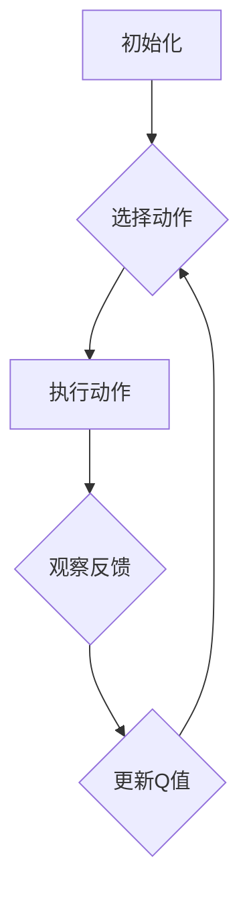
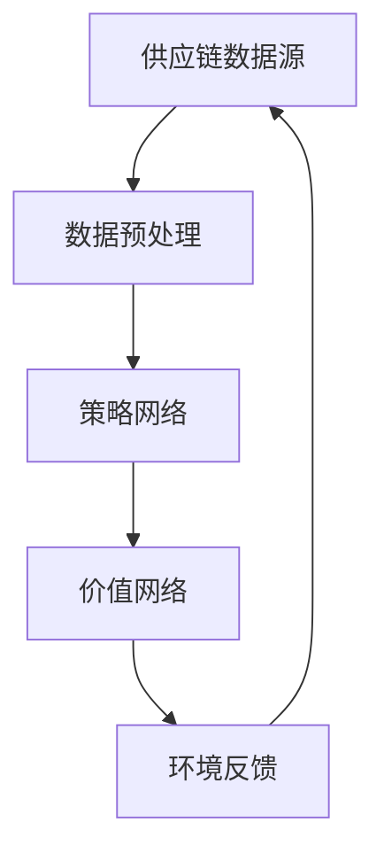
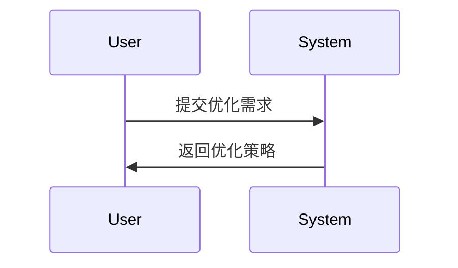
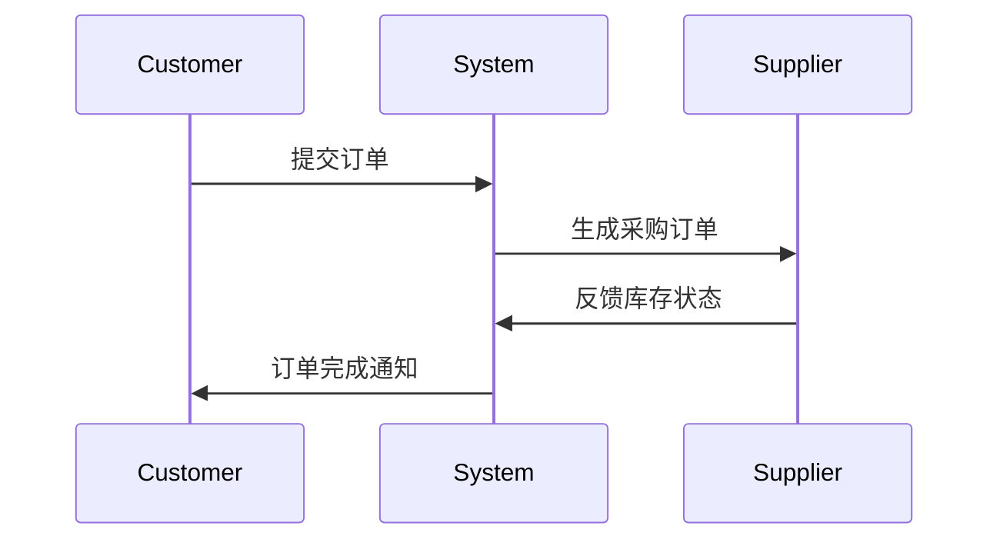

                 

### 第1章 问题背景与意义

#### 1.1 问题背景

复杂供应链系统在现代经济中扮演着至关重要的角色，它不仅涉及生产、库存、运输、销售等各个环节，还必须应对各种不确定性和复杂因素。随着全球化和信息技术的发展，供应链的规模和复杂性不断增加，传统的优化方法和手工操作已经难以满足高效、精准和实时性的需求。在这样的背景下，寻找新的优化方法和推理策略成为了研究的热点。

供应链优化涉及到多个方面的目标，包括成本最小化、服务水平最大化、响应时间最短化等。然而，这些目标往往是冲突的，例如，降低成本可能意味着提高运输时间，提高服务水平可能增加库存成本。因此，如何在多个目标之间找到平衡，实现整体最优，成为了一个巨大的挑战。

神经规划（Neuro-Planning）作为人工智能领域的一个重要分支，通过模仿人脑的神经结构和功能，实现了在动态、不确定环境下的高效决策。神经规划利用神经网络来模拟人类的思考过程，通过反复学习和优化，可以自动生成最优的策略。这一特性使得神经规划在解决复杂供应链优化问题时具有独特的优势。

神经规划和优化推理的结合，可以有效地应对复杂供应链中的多目标优化问题。通过神经规划，系统能够自动学习和调整策略，以应对实时变化的环境。同时，优化推理提供了对复杂问题结构的深入分析，帮助系统找到最优的解决方案。这一结合不仅提升了供应链的效率，还增强了系统的适应性和鲁棒性。

#### 1.2 研究意义

首先，神经规划在供应链优化中的应用具有显著的价值。通过引入神经规划，供应链系统可以自动适应环境变化，实现动态优化。例如，在库存管理中，神经规划可以根据需求变化实时调整库存水平，避免过多的库存积压或供应短缺。在运输调度中，神经规划可以优化路线选择和运输时间，减少运输成本，提高物流效率。

其次，神经规划的应用提升了供应链的竞争力。在全球化竞争中，供应链的效率直接影响到企业的成本和利润。通过应用神经规划，企业可以显著降低运营成本，提高服务水平，增强市场竞争力。此外，神经规划还能够为企业提供更为精准的决策支持，帮助企业在不确定的市场环境中做出更好的战略选择。

此外，神经规划对相关领域的研究和进步具有积极的影响。神经规划的理论和方法不仅适用于供应链优化，还可以推广到其他复杂系统的优化和控制中。例如，在能源管理、交通调度、金融风险管理等领域，神经规划的方法同样具有广泛的应用前景。

总的来说，神经规划在复杂供应链优化推理中的应用，不仅为解决当前供应链中的问题提供了新的思路和方法，还推动了相关领域的研究和发展。通过不断探索和创新，神经规划有望在更多领域发挥其独特的优势。

#### 1.3 本书结构

本书共分为四个主要部分，每一部分都有其特定的内容和目的。

- **第一部分：引言与背景**：介绍复杂供应链优化问题和神经规划的基本概念，为后续章节的研究提供基础。

- **第二部分：神经规划基础理论**：详细讲解神经规划的基本原理、算法及其应用，为深入理解神经规划在供应链优化中的角色奠定基础。

- **第三部分：神经规划在复杂供应链优化推理中的应用**：结合具体案例，探讨神经规划在供应链优化中的实际应用，展示其在解决复杂问题中的效果和优势。

- **第四部分：最佳实践与总结**：总结本书的核心内容，提供最佳实践建议，并对未来研究方向进行展望。

本书各章节之间紧密相连，通过逻辑清晰的章节结构和丰富的案例分析，帮助读者系统地了解神经规划在复杂供应链优化推理中的应用。无论是学术研究者，还是实际应用者，都能从本书中获得有价值的知识和启示。

### 第2章 神经规划基本概念

#### 2.1 神经规划的定义

神经规划（Neuro-Planning）是人工智能领域的一个重要分支，它结合了神经科学和规划理论，旨在通过模拟人脑的神经结构和功能，实现自动化和智能化的决策过程。神经规划的核心思想是通过神经网络对环境进行感知和学习，然后利用这些信息生成最优的行动策略。

神经规划和传统的优化方法有所不同。传统的优化方法通常依赖于预先设定的模型和算法，需要明确的数学公式和规则。而神经规划则通过模仿人脑的学习机制，能够在不确定和动态变化的环境中，自动调整和优化策略。这一特性使得神经规划在处理复杂和高度动态的系统时，具有独特的优势。

神经规划与优化推理的关系密切。优化推理是一种基于逻辑和数学的方法，用于在多个目标之间找到最优解。而神经规划通过神经网络的强大学习能力，将优化推理的过程自动化，使系统能够实时适应环境变化，并生成最优的行动策略。因此，神经规划可以看作是优化推理的一种高级实现形式，它在优化推理的基础上，进一步提高了系统的灵活性和适应性。

#### 2.2 神经规划的核心概念

神经规划的核心概念主要包括状态空间、动作空间、策略网络和价值网络。这些概念是神经规划理论和实践的基础。

- **状态空间（State Space）**：状态空间是描述系统当前状态的集合。在供应链优化中，状态空间可能包括库存水平、运输路线、需求量等多种状态变量。通过定义状态空间，系统能够明确当前所处的环境条件，为后续的决策提供基础。

- **动作空间（Action Space）**：动作空间是系统可以采取的所有可能行动的集合。在供应链优化中，动作空间可能包括调整库存水平、改变运输路线、优化配送计划等。通过定义动作空间，系统能够在给定的状态条件下，选择最优的行动。

- **策略网络（Policy Network）**：策略网络是神经网络的一种，用于将当前状态映射到具体的动作。策略网络的输出决定了系统在特定状态下应该采取的行动。通过训练策略网络，系统可以学习到在复杂环境中的最优行为模式。

- **价值网络（Value Network）**：价值网络是另一种神经网络，用于评估系统在特定状态下的行动价值。价值网络的输出是一个实数值，表示在特定状态下采取某个行动所能获得的回报。通过价值网络，系统能够评估不同行动的效果，从而选择最优的行动策略。

#### 2.3 神经网络的类型与应用

神经规划中常用的神经网络类型主要包括深度神经网络（Deep Neural Network，DNN）、循环神经网络（Recurrent Neural Network，RNN）和卷积神经网络（Convolutional Neural Network，CNN）等。

- **深度神经网络（DNN）**：DNN是一种多层前馈神经网络，通过逐层提取特征，能够实现复杂的非线性映射。在神经规划中，DNN可以用于构建策略网络和价值网络，通过多层非线性变换，从高维状态空间中提取出有用的特征信息，从而提高决策的准确性和鲁棒性。

- **循环神经网络（RNN）**：RNN是一种特殊的神经网络，能够处理序列数据。在神经规划中，RNN可以用于处理时间序列数据，如供应链中的需求变化和运输时间。RNN通过其循环结构，可以保留历史状态信息，从而更好地应对动态环境的变化。

- **卷积神经网络（CNN）**：CNN是一种专门用于处理图像数据的神经网络，通过卷积操作和池化操作，能够有效地提取图像特征。在神经规划中，CNN可以用于处理供应链中的图像数据，如物流车辆的监控图像和仓库库存的监控图像，从而提供更直观和有效的决策支持。

不同类型的神经网络在神经规划中的应用各有优势。DNN适用于处理高维状态空间，RNN适用于处理时间序列数据，而CNN适用于处理图像数据。通过灵活运用这些神经网络类型，神经规划系统能够更好地适应不同的应用场景，实现更高效的决策和优化。

#### 2.4 神经规划的基本原理

神经规划的基本原理主要涉及策略学习、价值评估和决策生成等核心环节。

- **策略学习（Policy Learning）**：策略学习是神经规划的核心环节，通过策略网络，系统从状态空间中学习到最优的动作策略。策略学习通常采用强化学习（Reinforcement Learning，RL）的方法，通过与环境交互，不断调整策略网络的权重，使系统在长期运行中能够生成最优的行动策略。策略学习的目标是最小化长期回报，即最大化系统的总收益。

- **价值评估（Value Evaluation）**：价值评估是神经规划中用于评估不同行动价值的环节。通过价值网络，系统可以评估在特定状态下采取不同行动所能获得的回报。价值评估的结果用于指导策略学习，帮助系统选择最优的行动策略。价值评估通常采用Q值（Q-value）函数，通过最大化预期回报来评估不同行动的价值。

- **决策生成（Decision Generation）**：决策生成是神经规划中将策略和价值评估结果转化为具体行动的过程。在策略学习过程中，系统通过策略网络生成一个动作概率分布，表示在特定状态下系统应采取的行动。决策生成的过程需要综合考虑价值评估的结果，选择最优的行动。决策生成的目标是在满足约束条件的前提下，最大化系统的总收益。

神经规划通过策略学习和价值评估，实现了从状态空间到动作空间的映射，从而生成最优的行动策略。这一过程不仅提高了系统的决策能力，还增强了系统的适应性和鲁棒性。在复杂供应链优化中，神经规划能够自动学习和调整策略，实现动态优化，为供应链的高效运行提供了有力支持。

### 第3章 神经规划算法

#### 3.1 基本算法介绍

神经规划的核心在于其算法，这些算法通过模拟人脑的学习过程，实现了在动态和不确定环境下的智能决策。在本节中，我们将介绍几种常用的神经规划算法，包括Q-Learning、SARSA和Deep Q-Network（DQN）。

- **Q-Learning算法**：Q-Learning是一种基于值函数的强化学习算法，通过更新Q值（即状态-动作值函数）来学习最优策略。Q-Learning的核心思想是利用奖励信号来更新Q值，使得在特定状态下采取特定动作的Q值最大化。具体步骤如下：

  1. **初始化Q值**：随机初始化所有状态的Q值。
  2. **选择动作**：在给定状态下，根据当前策略选择动作。
  3. **执行动作**：执行选择的动作，并观察环境反馈。
  4. **更新Q值**：根据新状态和新奖励，更新Q值。
  5. **重复步骤2-4**：不断重复上述过程，直到达到终止条件。

- **SARSA算法**：SARSA（State-Action-Reward-State-Action）是一种基于策略的强化学习算法，它同时考虑当前状态和下一个状态的信息，以更新策略。SARSA算法的更新公式为：

  $$ Q(s,a) \leftarrow Q(s,a) + \alpha [r + \gamma \max_{a'} Q(s',a') - Q(s,a)] $$

  其中，$s$和$s'$分别表示当前状态和下一个状态，$a$和$a'$分别表示当前动作和下一个动作，$r$是即时奖励，$\gamma$是折扣因子，$\alpha$是学习率。

- **Deep Q-Network（DQN）**：DQN是一种基于深度学习的强化学习算法，它使用深度神经网络来近似Q值函数。DQN的主要挑战是避免过拟合，即神经网络在训练数据上表现良好，但在新数据上表现不佳。为解决这个问题，DQN引入了经验回放（Experience Replay）机制，将过去经历的状态和动作存储在经验池中，然后从经验池中随机抽样进行训练。DQN的基本步骤如下：

  1. **初始化**：随机初始化深度神经网络权重。
  2. **选择动作**：使用策略网络选择动作。
  3. **执行动作**：执行选择的动作，并观察环境反馈。
  4. **存储经验**：将当前状态、动作、奖励和新状态存储在经验池中。
  5. **训练网络**：从经验池中随机抽样，使用抽样数据训练深度神经网络。
  6. **更新目标网络**：定期更新目标网络的权重，以稳定网络训练。

#### 3.2 算法对比与选择

Q-Learning、SARSA和DQN都是神经规划中常用的算法，它们各自具有优缺点，适用于不同的应用场景。

- **Q-Learning算法**：Q-Learning算法简单直观，易于实现，适合于状态和动作空间较小的问题。然而，Q-Learning在样本效率方面较低，容易陷入局部最优，且在连续动作空间中应用受限。

- **SARSA算法**：SARSA算法结合了Q-Learning和策略学习的特点，能够更好地利用当前状态和下一个状态的信息，提高学习效率。SARSA算法在样本效率方面优于Q-Learning，但同样存在局部最优问题，且在连续动作空间中应用也较为困难。

- **DQN算法**：DQN算法通过引入深度神经网络，能够处理高维状态空间和连续动作空间，具有较好的样本效率和泛化能力。DQN算法通过经验回放机制，避免了过拟合问题，但在训练过程中需要大量的数据和时间。

在实际应用中，选择合适的算法需要考虑以下几个因素：

1. **状态和动作空间的大小**：对于状态和动作空间较小的问题，Q-Learning和SARSA算法较为适用；对于状态和动作空间较大或连续的问题，DQN算法具有明显优势。

2. **样本效率**：样本效率是指算法在给定数据量下学习效果的优劣。DQN算法具有较高的样本效率，但训练时间较长；Q-Learning和SARSA算法在样本效率方面表现一般。

3. **计算资源**：DQN算法需要更多的计算资源，特别是在处理高维状态和连续动作时，因此需要考虑计算资源限制。

4. **问题复杂性**：对于较为复杂的问题，如多目标优化和动态环境，DQN算法能够提供更好的解决方案；对于简单问题，Q-Learning和SARSA算法已经足够。

总之，选择合适的神经规划算法需要综合考虑问题的特点、算法的优缺点以及实际应用的需求，以实现最佳的学习效果和决策性能。

#### 3.3 算法扩展与改进

在神经规划领域，基础算法的改进和扩展是提高算法性能和适用性的重要手段。以下介绍几种常用的算法扩展与改进方法，包括双Q学习（Double Q-Learning，DDQN）、优先经验回放（Prioritized Experience Replay，PER）和Actor-Critic方法。

- **双Q学习（DDQN）**：双Q学习是DQN算法的一个改进版本，旨在解决目标网络和评价网络不一致的问题。在DQN算法中，评价网络（target network）用于生成目标Q值，但训练网络（evaluation network）用于更新Q值。这种方法可能导致目标网络和评价网络之间的偏差，从而影响学习效果。双Q学习通过引入两个独立的Q值函数，一个用于训练（evaluation network），另一个用于生成目标Q值（target network），从而解决了这一不一致性问题。具体步骤如下：

  1. **初始化**：随机初始化两个Q值函数（evaluation network和target network）。
  2. **选择动作**：使用evaluation network选择动作。
  3. **执行动作**：执行选择的动作，并观察环境反馈。
  4. **更新evaluation network**：根据即时奖励和新状态，使用DQN算法更新evaluation network的Q值。
  5. **更新target network**：定期将evaluation network的权重复制到target network，以保持两个网络的一致性。
  6. **重复步骤2-5**：不断重复上述过程，直到达到终止条件。

- **优先经验回放（PER）**：优先经验回放是DQN算法的另一个重要改进，通过引入优先级机制，提高了样本利用效率和算法性能。在DQN算法中，经验回放机制用于从经验池中随机抽样进行训练，但这种方法可能导致样本的分布不均匀，从而影响学习效果。优先经验回放通过为每个经验赋予优先级，并根据优先级进行抽样，提高了高价值经验的利用率和学习效果。具体步骤如下：

  1. **初始化**：创建一个经验池，并为每个经验分配一个初始优先级。
  2. **选择动作**：使用evaluation network选择动作。
  3. **执行动作**：执行选择的动作，并观察环境反馈。
  4. **更新经验池**：将新经验添加到经验池，并根据经验误差（TD误差）更新其优先级。
  5. **抽样经验**：根据优先级进行抽样，从经验池中选取经验用于训练。
  6. **训练网络**：使用抽样经验训练evaluation network。
  7. **重复步骤2-6**：不断重复上述过程，直到达到终止条件。

- **Actor-Critic方法**：Actor-Critic方法是一种基于策略和价值联合学习的强化学习算法，通过同时更新策略网络和价值网络，实现了高效的决策和学习。在Actor-Critic方法中，策略网络（Actor）负责生成动作概率分布，价值网络（Critic）负责评估策略的优劣。具体步骤如下：

  1. **初始化**：随机初始化策略网络和价值网络。
  2. **选择动作**：根据策略网络生成的动作概率分布选择动作。
  3. **执行动作**：执行选择的动作，并观察环境反馈。
  4. **更新价值网络**：根据新状态和即时奖励，使用Critic算法更新价值网络的权重。
  5. **更新策略网络**：根据新状态、价值网络输出和即时奖励，使用策略梯度方法更新策略网络的权重。
  6. **重复步骤2-5**：不断重复上述过程，直到达到终止条件。

通过引入这些扩展和改进方法，神经规划算法在样本效率、决策性能和鲁棒性等方面得到了显著提升，为复杂供应链优化提供了更有效的解决方案。

### 第4章 神经规划应用案例分析

#### 4.1 案例一：供应链库存优化

**案例背景**：
某大型电商企业由于业务规模庞大，其供应链系统的库存管理面临巨大的挑战。库存过多会导致成本增加和资源浪费，而库存不足则会延误订单交付，影响客户满意度。为了实现高效、精准的库存管理，该企业决定采用神经规划技术进行库存优化。

**应用过程**：

1. **需求分析**：
   - 收集供应链各节点的库存数据，包括当前库存水平、需求预测、供应周期等。
   - 确定库存优化的目标，包括最小化库存成本、最大化服务水平等。

2. **状态空间和动作空间定义**：
   - 状态空间包括当前库存水平、未来需求预测、供应周期等。
   - 动作空间包括调整库存水平、采购订单、补货策略等。

3. **策略网络训练**：
   - 构建策略网络，使用DQN算法训练策略网络，使其能够根据当前状态生成最优库存调整策略。

4. **价值网络训练**：
   - 构建价值网络，使用DDQN算法训练价值网络，评估不同库存策略的价值。

5. **策略执行**：
   - 根据策略网络和价值网络的输出，实时调整库存策略，优化库存水平。

**效果评估与讨论**：

1. **库存成本降低**：
   - 通过神经规划技术的应用，库存成本显著降低，库存周转率提高。

2. **服务水平提升**：
   - 库存不足的情况明显减少，订单交付准时率提高，客户满意度提升。

3. **灵活性与适应性**：
   - 神经规划系统可以实时调整库存策略，以应对需求波动和供应变化，提高了供应链的灵活性和适应性。

**讨论**：

神经规划在供应链库存优化中的应用，不仅提高了库存管理的效率，还增强了系统的灵活性和适应性。然而，在实际应用中，神经规划系统需要大量的历史数据支持，数据质量和完整性对系统性能有重要影响。此外，神经规划算法的训练过程可能需要较长时间，对计算资源有较高要求。

#### 4.2 案例二：供应链运输调度

**案例背景**：
某物流公司面临运输调度难题，由于运输需求波动大，路线规划复杂，导致运输效率低下，运输成本居高不下。为了提高运输调度效率，降低运营成本，该公司决定采用神经规划技术进行运输调度优化。

**应用过程**：

1. **需求分析**：
   - 收集运输数据，包括运输量、运输路线、运输时间、车辆状况等。
   - 确定运输调度的目标，包括最小化运输成本、最大化运输效率等。

2. **状态空间和动作空间定义**：
   - 状态空间包括当前运输量、运输路线、车辆状况等。
   - 动作空间包括调整运输路线、调度车辆、调整运输时间等。

3. **策略网络训练**：
   - 构建策略网络，使用SARSA算法训练策略网络，使其能够根据当前状态生成最优运输调度策略。

4. **价值网络训练**：
   - 构建价值网络，使用DQN算法训练价值网络，评估不同运输调度策略的价值。

5. **策略执行**：
   - 根据策略网络和价值网络的输出，实时调整运输调度策略，优化运输路线和调度方案。

**效果评估与讨论**：

1. **运输成本降低**：
   - 通过神经规划技术的应用，运输成本显著降低，运营效率提高。

2. **运输效率提升**：
   - 运输调度过程更加高效，运输时间缩短，运输准时率提高。

3. **系统适应性**：
   - 神经规划系统可以根据实时数据动态调整运输策略，提高了系统在应对需求波动和突发事件时的适应性。

**讨论**：

神经规划在供应链运输调度中的应用，有效提高了运输调度的效率和灵活性。然而，实际应用中，运输调度问题通常较为复杂，涉及多种因素和约束条件，需要大量的历史数据和详细的模型支持。此外，神经规划算法的训练和优化过程也需要较长时间，对计算资源有较高要求。

#### 4.3 案例三：供应链风险评估

**案例背景**：
某制造企业在供应链管理中面临各种风险，包括供应中断、运输延误、库存积压等，这些风险可能导致生产停滞、成本增加和客户满意度下降。为了有效管理供应链风险，该企业决定采用神经规划技术进行供应链风险评估。

**应用过程**：

1. **需求分析**：
   - 收集供应链相关数据，包括供应源信息、运输路线、库存水平、市场需求等。
   - 确定风险评估的目标，包括识别潜在风险、评估风险影响、制定应对策略等。

2. **状态空间和动作空间定义**：
   - 状态空间包括当前供应源状况、运输路线状况、库存水平、市场需求等。
   - 动作空间包括调整供应源、优化运输路线、调整库存水平等。

3. **策略网络训练**：
   - 构建策略网络，使用DDQN算法训练策略网络，使其能够根据当前状态生成最优风险应对策略。

4. **价值网络训练**：
   - 构建价值网络，使用DQN算法训练价值网络，评估不同风险应对策略的价值。

5. **策略执行**：
   - 根据策略网络和价值网络的输出，实时调整供应链管理策略，降低风险影响。

**效果评估与讨论**：

1. **风险识别与评估**：
   - 通过神经规划技术的应用，企业能够更准确地识别和评估供应链中的潜在风险。

2. **风险应对策略优化**：
   - 企业可以根据评估结果，制定针对性的风险应对策略，降低风险发生的概率和影响。

3. **供应链稳定性提升**：
   - 通过实时调整供应链管理策略，企业能够提高供应链的稳定性，减少生产中断和成本浪费。

**讨论**：

神经规划在供应链风险评估中的应用，为企业提供了有效的风险管理和决策支持。然而，实际应用中，供应链风险复杂多变，需要大量历史数据和详细的风险模型支持。此外，神经规划系统的训练和优化过程也需要较长时间，对计算资源有较高要求。

### 第5章 复杂供应链模型构建

#### 5.1 供应链网络建模

构建一个有效的供应链网络模型是实现神经规划在复杂供应链优化中的关键步骤。供应链网络模型用于描述供应链中各个节点（如供应商、制造商、仓库、配送中心、零售商）之间的连接和交互关系。以下为供应链网络建模的具体方法和步骤：

1. **节点定义**：
   - **供应商**：提供原材料或零部件的生产商。
   - **制造商**：将原材料加工成成品的工厂。
   - **仓库**：用于存储和管理库存的中转中心。
   - **配送中心**：负责将产品从仓库运送到零售商或消费者的中心。
   - **零售商**：将产品销售给最终消费者的商家。

2. **连接关系**：
   - **供应链上下游关系**：上游供应商将原材料提供给制造商，制造商将成品提供给下游仓库或零售商。
   - **物流网络连接**：仓库与配送中心之间、配送中心与零售商之间通过运输网络连接。

3. **数据采集**：
   - **需求数据**：包括市场需求、季节性波动、消费者行为等。
   - **供应数据**：包括供应商产能、交货周期、质量标准等。
   - **运输数据**：包括运输路线、运输时间、运输成本等。
   - **库存数据**：包括库存水平、库存周转率、库存积压等。

4. **模型表示**：
   - **图模型**：使用图（Graph）来表示供应链网络，节点代表供应链中的实体，边代表实体之间的连接关系。
   - **矩阵表示**：使用邻接矩阵（Adjacency Matrix）或权重矩阵（Weight Matrix）来表示网络结构，其中矩阵元素表示节点之间的连接强度或运输成本。

#### 5.2 供应链优化目标设定

在构建供应链模型时，需要明确优化目标，以便设计合适的神经规划策略。常见的供应链优化目标包括：

1. **成本最小化**：
   - **运输成本**：减少原材料、成品和库存的运输成本。
   - **库存成本**：最小化库存持有成本，包括存储费用、利息成本和库存损耗。
   - **采购成本**：优化原材料采购策略，降低采购成本。

2. **服务水平最大化**：
   - **交货及时率**：提高订单按时交付的比例。
   - **库存覆盖率**：确保库存水平能够满足市场需求，减少缺货率。
   - **服务质量**：提高供应链各个环节的服务质量，提升客户满意度。

3. **响应时间最短化**：
   - **运输时间**：优化运输路线和调度，缩短运输时间。
   - **响应时间**：降低供应链对需求波动的响应时间，提高灵活性。

4. **环境可持续性**：
   - **碳排放**：减少运输和仓储过程中的碳排放。
   - **资源利用率**：提高原材料和能源的利用率，减少浪费。

#### 5.3 神经规划模型设计与实现

1. **模型设计**：
   - **状态空间设计**：根据供应链网络和优化目标，确定状态空间中的状态变量，如库存水平、运输量、需求预测等。
   - **动作空间设计**：根据供应链网络和优化目标，确定动作空间中的动作变量，如调整库存水平、改变运输路线、采购订单等。
   - **策略网络设计**：设计策略网络，将当前状态映射到具体的动作，使用DQN或DDQN算法训练策略网络。
   - **价值网络设计**：设计价值网络，评估不同动作的价值，使用DQN算法训练价值网络。

2. **模型实现**：
   - **环境搭建**：构建供应链环境，包括供应链网络模型、需求预测模型、运输模型等。
   - **训练策略网络**：使用历史数据训练策略网络，通过反复试错，找到最优的策略。
   - **训练价值网络**：使用历史数据训练价值网络，评估不同策略的价值，帮助策略网络选择最优动作。
   - **策略执行**：在现实环境中执行策略网络生成的策略，根据环境反馈调整策略，实现持续优化。

通过以上步骤，构建一个有效的神经规划模型，可以帮助供应链系统在动态、不确定的环境中实现高效优化，提高整体运营效率和服务水平。

### 第6章 复杂供应链优化推理策略

#### 6.1 基于神经规划的推理方法

神经规划在复杂供应链优化推理中的应用，主要依赖于其强大的学习和决策能力。基于神经规划的推理方法，可以通过以下步骤实现：

1. **环境感知**：
   - 神经规划系统首先通过传感器和数据接口收集供应链环境中的各种信息，如需求量、库存水平、运输状态等。
   - 这些信息被输入到神经网络的感知模块，进行初步处理和特征提取。

2. **状态评估**：
   - 神经规划系统使用策略网络对当前状态进行评估，根据输入特征生成一个状态表示。
   - 状态表示用于预测未来状态的可能变化，如需求量的增加或减少、库存水平的上升或下降等。

3. **策略生成**：
   - 根据当前状态和价值网络提供的评估结果，策略网络生成一系列可能的动作策略。
   - 动作策略包括调整库存水平、改变运输路线、采购订单等，以实现优化目标。

4. **决策执行**：
   - 神经规划系统根据策略网络生成的动作策略，选择最优动作执行。
   - 动作执行后，系统观察环境反馈，如即时奖励、新状态等。

5. **持续优化**：
   - 通过反复执行上述步骤，神经规划系统不断学习和调整策略，以应对动态变化的环境。
   - 随着经验的积累，系统决策的准确性和效率逐渐提高。

这种基于神经规划的推理方法，通过模拟人脑的学习机制，实现了对复杂供应链问题的动态优化。它不仅提高了供应链的灵活性和适应性，还降低了运营成本，提升了整体效益。

#### 6.2 推理算法设计

在神经规划中，推理算法的设计至关重要，它决定了系统在复杂供应链环境中的决策能力和效率。以下介绍几种常用的推理算法设计方法，并分析其优缺点：

1. **Q-Learning算法**：
   - **设计方法**：
     - 初始化Q值矩阵，用于存储状态-动作价值。
     - 通过与环境交互，选择动作并执行。
     - 根据即时奖励和下一状态更新Q值。
     - 反复迭代上述过程，直到找到最优策略。
   - **优点**：
     - 算法简单，易于实现和理解。
     - 适用于离散状态和动作空间。
   - **缺点**：
     - 样本效率低，容易陷入局部最优。
     - 在连续动作空间中应用受限。

2. **SARSA算法**：
   - **设计方法**：
     - 初始化策略参数，通过与环境交互选择动作。
     - 执行动作后，观察环境反馈，更新策略参数。
     - 使用当前状态和下一状态的信息进行策略更新。
     - 反复迭代上述过程，优化策略参数。
   - **优点**：
     - 同时考虑当前状态和下一状态信息，提高了学习效率。
     - 适用于离散和连续动作空间。
   - **缺点**：
     - 可能存在收敛速度较慢的问题。
     - 对状态和动作空间较大问题，计算复杂度高。

3. **Deep Q-Network（DQN）算法**：
   - **设计方法**：
     - 使用深度神经网络（DNN）近似Q值函数。
     - 采用经验回放机制，减少样本相关性和过拟合。
     - 定期更新目标网络，稳定学习过程。
     - 通过交替训练评价网络和目标网络，优化Q值函数。
   - **优点**：
     - 能够处理高维状态空间和连续动作空间。
     - 具有较好的样本效率和泛化能力。
     - 通过经验回放，避免了样本相关性问题。
   - **缺点**：
     - 需要大量数据支持，训练时间较长。
     - 对计算资源要求较高。

4. **Double Q-Learning（DDQN）算法**：
   - **设计方法**：
     - 引入两个独立的Q值函数，评价网络和目标网络。
     - 通过交替训练和更新两个网络，提高Q值函数的稳定性。
     - 在更新目标网络时，使用评价网络生成的Q值。
   - **优点**：
     - 有效地解决了目标网络和评价网络不一致的问题。
     - 提高了Q值函数的稳定性和收敛速度。
   - **缺点**：
     - 需要更多的计算资源和存储空间。

5. **优先经验回放（PER）算法**：
   - **设计方法**：
     - 为每个经验赋予优先级，根据优先级进行经验回放。
     - 通过优先级抽样，提高高价值经验的利用效率。
     - 定期更新经验池，维护经验池中的优先级分布。
   - **优点**：
     - 提高了样本利用效率，减少了样本无关性。
     - 提高了算法的性能和收敛速度。
   - **缺点**：
     - 需要额外的计算开销来维护优先级分布。

6. **Actor-Critic方法**：
   - **设计方法**：
     - Actor网络负责生成动作概率分布，Critic网络负责评估策略的价值。
     - 通过交替更新Actor和Critic网络，优化策略参数。
     - 使用策略梯度方法更新Actor网络，最大化策略价值函数。
   - **优点**：
     - 结合了策略学习和值函数学习，提高了学习效率。
     - 适用于连续动作空间和复杂状态环境。
   - **缺点**：
     - 计算复杂度高，对参数调整敏感。

不同推理算法在复杂供应链优化中各有优缺点。在实际应用中，选择合适的算法需要综合考虑供应链的具体情况、数据规模、计算资源等因素。例如，对于状态和动作空间较小的问题，可以选择Q-Learning或SARSA算法；对于状态和动作空间较大且需要高样本效率的问题，可以选择DQN或DDQN算法；对于连续动作空间和复杂环境问题，可以选择Actor-Critic方法。

总之，通过灵活运用不同的推理算法，神经规划系统可以在复杂供应链环境中实现高效、精准的优化，提高供应链的运营效率和服务水平。

#### 6.3 推理效果评估

在神经规划的应用中，评估推理效果是验证算法性能和优化策略的重要环节。以下介绍几种常用的评估指标和方法，用于衡量神经规划在复杂供应链优化推理中的效果。

1. **平均回报（Average Return）**：
   - **定义**：平均回报是指系统在一段时间内获得的累计回报值。
   - **计算方法**：平均回报 = 总回报 / 迭代次数。
   - **作用**：平均回报能够直观地反映神经规划系统的整体性能，是评估推理效果的基本指标。

2. **奖励分数（Reward Score）**：
   - **定义**：奖励分数是根据系统的即时奖励计算的分数。
   - **计算方法**：奖励分数 = （即时奖励 / 最大可能奖励）× 100。
   - **作用**：奖励分数能够反映系统在特定状态下的表现，用于评估策略的即时效果。

3. **成功概率（Success Rate）**：
   - **定义**：成功概率是指系统成功完成某个任务或目标的概率。
   - **计算方法**：成功概率 = （成功次数 / 总次数）× 100。
   - **作用**：成功概率用于评估系统在复杂环境中的鲁棒性和稳定性。

4. **平均步数（Average Steps）**：
   - **定义**：平均步数是指系统从初始状态到目标状态所需的总步数。
   - **计算方法**：平均步数 = 总步数 / 迭代次数。
   - **作用**：平均步数能够反映系统的决策效率，步数越少，表示系统越高效。

5. **稳定性指标（Stability Metric）**：
   - **定义**：稳定性指标用于评估系统在连续执行任务时的稳定性。
   - **计算方法**：稳定性指标 = （稳定状态数 / 总状态数）× 100。
   - **作用**：稳定性指标能够反映系统在应对动态变化时的表现，稳定性越高，系统越可靠。

为了全面评估神经规划在复杂供应链优化推理中的效果，可以采用以下几种方法：

1. **对比实验**：在不同算法或参数设置下进行对比实验，比较平均回报、成功概率等指标，选择最优方案。

2. **动态测试**：在动态变化的供应链环境中进行测试，评估系统的稳定性和适应性。

3. **实际应用验证**：在实际供应链系统中部署神经规划系统，进行长时间的运行测试，验证其效果和可靠性。

通过多种评估指标和方法，可以全面了解神经规划在复杂供应链优化推理中的表现，为算法优化和系统改进提供依据。

### 第7章 创新探索与未来展望

#### 7.1 神经规划在供应链优化中的创新点

神经规划在供应链优化中展现出了诸多创新点，这些创新点不仅提升了系统的性能，也为供应链管理带来了新的思路和方法。

1. **动态优化能力**：
   - 神经规划能够实时适应环境变化，动态调整策略，实现供应链的动态优化。这一特性使得系统能够快速响应需求波动、供应变化和突发事件，提高了供应链的灵活性和适应性。

2. **多目标优化**：
   - 传统的供应链优化往往只关注单一目标，如成本最小化或服务水平最大化。而神经规划通过同时考虑多个目标，实现了真正的多目标优化。例如，在库存管理中，不仅考虑库存成本，还考虑服务水平、响应时间等因素，从而实现整体最优。

3. **深度学习与智能决策**：
   - 神经规划利用深度学习技术，通过学习大量历史数据，提取出有用的特征信息，生成智能决策。这种智能化的决策过程能够提高供应链管理的效率和准确性，减少人为干预，降低决策风险。

4. **自动调整与自我优化**：
   - 神经规划系统可以自动调整策略，不断优化自身性能。通过反复学习和迭代，系统能够不断改进策略，提高决策质量和效率。这种自我优化能力为供应链管理提供了持续改进的动力。

5. **跨领域应用**：
   - 神经规划不仅适用于供应链优化，还可以推广到其他复杂系统的优化和控制中。例如，在能源管理、交通调度、金融风险管理等领域，神经规划的方法同样具有广泛的应用前景，为这些领域的优化提供了新的解决方案。

#### 7.2 研究展望

神经规划在供应链优化中的应用研究仍有许多值得探索的方向，未来研究可以从以下几个方面展开：

1. **算法优化**：
   - 针对神经规划算法，未来的研究可以集中在算法的优化和改进上，提高算法的效率和准确性。例如，设计更高效的训练算法，降低训练时间；引入新的神经网络结构，提高模型的泛化能力。

2. **多模态数据融合**：
   - 供应链系统中涉及多种类型的数据，如文本、图像、传感器数据等。未来的研究可以探索如何将这些多模态数据进行有效融合，提高神经规划系统的感知能力和决策质量。

3. **智能供应链生态系统**：
   - 建立一个智能供应链生态系统，将神经规划与其他人工智能技术（如机器学习、大数据分析）相结合，实现供应链的全面智能化。这将为供应链管理提供更加全面和深入的决策支持。

4. **应用场景扩展**：
   - 探索神经规划在供应链优化中的更多应用场景，如绿色供应链管理、可持续供应链管理、个性化供应链服务等。通过扩展应用场景，神经规划将为供应链管理带来更多创新和价值。

5. **实际应用验证**：
   - 在实际供应链系统中部署神经规划系统，进行长时间的运行测试，验证其在实际应用中的效果和可靠性。通过实际应用验证，可以进一步优化和改进神经规划系统，提高其在供应链优化中的实用价值。

总之，神经规划在供应链优化中的应用具有广阔的前景，未来研究将不断推动该领域的发展，为供应链管理提供更加智能化、高效化的解决方案。

### 第8章 最佳实践

#### 8.1 实践经验总结

在神经规划应用于复杂供应链优化中，实践经验表明，以下几种策略和技巧是成功的保障：

1. **数据质量**：
   - 数据是神经规划系统的基础，高-quality的数据能够显著提高算法的性能和决策质量。因此，在实施神经规划之前，确保数据的准确性和完整性至关重要。数据清洗和预处理是关键步骤，包括去除噪声、填补缺失值、标准化数据等。

2. **模型定制**：
   - 供应链系统的多样性使得通用的神经规划模型难以满足所有需求。因此，定制化模型是提高系统性能的有效手段。根据具体应用场景，设计合适的状态空间、动作空间和神经网络结构，以实现最优的决策效果。

3. **迭代优化**：
   - 神经规划系统的性能可以通过不断的迭代优化得到提升。在实际应用中，通过反复训练和调整模型参数，逐步优化策略网络和价值网络，提高系统的决策准确性和鲁棒性。

4. **实时反馈**：
   - 实时获取环境反馈，动态调整策略，是实现供应链优化目标的关键。通过传感器和数据接口，实时监控供应链各个环节的状态，及时调整库存、运输和调度策略，以应对动态变化的环境。

5. **多目标平衡**：
   - 供应链优化往往涉及多个目标，如成本、服务水平、响应时间等。在应用神经规划时，需要通过多目标优化方法，在多个目标之间找到平衡点，实现整体最优。

6. **团队协作**：
   - 神经规划在供应链优化中的应用需要跨学科的团队协作。结合计算机科学、运筹学、供应链管理等领域的专业知识，实现技术的创新和突破。

#### 8.2 案例分析与技巧分享

以下通过具体案例分析，分享神经规划在供应链优化中的实战技巧：

1. **案例一：库存管理优化**
   - **背景**：某电商企业在高峰期面临库存管理难题，库存不足导致缺货，库存过多则占用大量资金。
   - **技巧**：
     - 利用历史销售数据和需求预测模型，构建状态空间和动作空间。
     - 采用DQN算法训练策略网络和价值网络，实现动态调整库存水平。
     - 通过实时反馈机制，动态调整库存策略，提高库存利用率和服务水平。

2. **案例二：运输调度优化**
   - **背景**：某物流公司在高峰期运输任务繁重，运输成本高，运输效率低。
   - **技巧**：
     - 构建供应链网络模型，收集运输数据，包括运输路线、运输时间和运输成本。
     - 采用DDQN算法训练策略网络和价值网络，优化运输调度方案。
     - 通过优先经验回放（PER）机制，提高算法的性能和样本效率。

3. **案例三：供应链风险评估**
   - **背景**：某制造企业在供应链管理中面临多种风险，如供应中断、运输延误等。
   - **技巧**：
     - 收集供应链各环节的数据，包括供应商信息、运输路线、库存水平等。
     - 采用Actor-Critic方法构建风险应对策略网络，评估不同策略的风险影响。
     - 通过实时监控和调整，降低供应链风险，提高供应链稳定性。

这些案例表明，神经规划在供应链优化中具有广泛的适用性和强大的潜力。通过结合具体场景和实践经验，可以不断提升系统的决策质量和效率，为供应链管理提供有力的支持。

### 第9章 小结与展望

#### 9.1 书籍内容回顾

本书系统地介绍了神经规划在复杂供应链优化推理中的应用，涵盖了从基础理论到实际应用的各个方面。以下是各章节的核心内容和贡献的简要回顾：

- **第1章** 介绍了复杂供应链优化问题和神经规划的基本概念，强调了神经规划在解决复杂供应链问题中的优势。

- **第2章** 详细讲解了神经规划的核心概念，包括状态空间、动作空间、策略网络和价值网络，以及神经网络在不同应用场景中的类型。

- **第3章** 介绍了神经规划的基础算法，包括Q-Learning、SARSA和DQN等，并分析了这些算法的优点和适用场景。

- **第4章** 通过三个具体案例，展示了神经规划在供应链库存优化、运输调度和风险评估中的实际应用效果。

- **第5章** 介绍了如何构建复杂的供应链模型，包括网络建模、状态和动作空间定义以及神经规划模型的实现。

- **第6章** 讨论了神经规划推理算法的设计，包括Q-Learning、SARSA、DQN、DDQN、PER和Actor-Critic等方法。

- **第7章** 探讨了神经规划在供应链优化中的创新点和未来研究方向，强调了神经规划在多目标优化和动态环境中的优势。

- **第8章** 提供了神经规划在供应链优化中的最佳实践和案例分析，分享了成功应用神经规划的经验和技巧。

- **第9章** 对全书内容进行了小结，总结了神经规划在供应链优化推理中的核心观点和未来展望。

#### 9.2 学习与思考

通过阅读本书，读者应掌握以下知识点：

- **神经规划的基本概念和原理**：理解状态空间、动作空间、策略网络和价值网络的概念，以及神经网络在神经规划中的应用。

- **神经规划算法**：掌握Q-Learning、SARSA、DQN、DDQN、PER和Actor-Critic等算法的基本原理和实现方法。

- **供应链模型构建**：了解如何构建复杂的供应链模型，包括网络建模、状态和动作空间定义以及神经规划模型的实现。

- **神经规划在实际应用中的效果评估**：掌握如何评估神经规划在供应链优化推理中的效果，包括平均回报、奖励分数、成功概率等指标。

- **最佳实践**：了解神经规划在供应链优化中的实际应用案例，学习如何根据具体场景调整和应用神经规划。

为了将所学知识应用到实际工作中，读者可以：

- **应用神经规划算法**：在实际项目中，根据需求选择合适的算法，构建并训练神经规划模型，实现供应链优化。

- **数据分析和模型优化**：通过对历史数据进行分析，优化神经规划模型的参数和结构，提高决策质量和效率。

- **持续学习和改进**：结合实时反馈和数据更新，不断调整和优化神经规划模型，实现持续改进。

#### 9.3 拓展阅读建议

为了进一步深入了解神经规划在供应链优化中的应用，读者可以参考以下拓展阅读资料：

- **学术期刊**：阅读相关的学术期刊，如《IEEE Transactions on Automatic Control》、《Automatica》等，了解最新的研究成果和进展。

- **专业书籍**：参考专业书籍，如《Reinforcement Learning: An Introduction》和《Deep Reinforcement Learning Hands-On》等，深入理解强化学习和深度学习的基本原理和应用。

- **开源项目**：参与开源项目，如OpenAI的Gym环境，实践神经规划算法在供应链优化中的应用。

- **在线课程**：报名参加在线课程，如斯坦福大学的《深度学习》课程，系统学习深度学习和强化学习的基本知识。

通过这些拓展阅读和学习资源，读者可以不断提升自己的专业知识，为实际应用提供更坚实的理论基础和实践指导。

### 附录

#### 附录A：神经规划算法流程图

#### 附录B：供应链优化系统架构图

#### 附录C：供应链优化系统接口设计

#### 附录D：供应链优化系统交互序列图

这些附录内容为读者提供了神经规划在供应链优化中的应用实例，便于理解和应用书中所介绍的理论和方法。通过这些流程图和序列图，读者可以更直观地了解神经规划系统的工作原理和实现过程。

