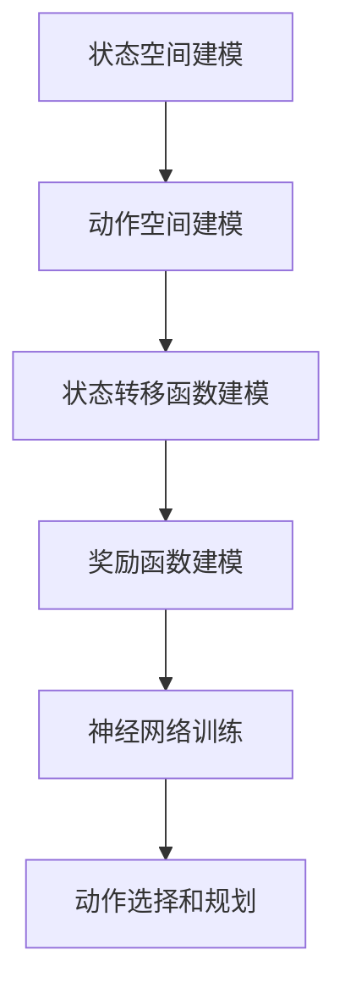

                 

# 神经规划在复杂工程推理中的应用

## 关键词：神经规划、复杂工程推理、神经网络、数学建模、算法原理、应用场景、案例分析

## 摘要

本文旨在探讨神经规划在复杂工程推理中的应用。随着工程领域问题的日益复杂，传统的规划方法逐渐显露出局限性，而神经规划作为一种新兴的方法，以其强大的自适应能力和高效性，为解决复杂工程推理问题提供了新的思路。本文首先介绍了神经规划的基本概念、核心原理，并通过数学建模和算法原理的讲解，详细阐述了神经规划的工作机制。随后，文章聚焦于神经规划在复杂工程推理中的应用，分析了其在结构工程、机械工程和能源工程等领域的应用场景，并借助实际案例，对神经规划的实践效果进行了深入剖析。最后，文章总结了神经规划在复杂工程推理中的应用现状，提出了未来研究的方向和最佳实践建议。

### 目录大纲

----------------------------------------------------------------

## 第一部分: 背景介绍与核心概念

### 第1章: 问题背景与问题描述

#### 1.1.1 问题的起源与背景

#### 1.1.2 问题描述与核心要素

#### 1.1.3 问题解决的需求与挑战

### 第2章: 核心概念与联系

#### 2.1.1 神经规划的定义

#### 2.1.2 神经规划的特点

#### 2.1.3 神经规划与传统规划方法对比

#### 2.1.4 神经规划的相关概念与联系

#### 2.1.5 概念属性特征对比表格

#### 2.1.6 神经规划相关ER实体关系图

## 第二部分: 神经规划基础理论

### 第3章: 神经网络基础

#### 3.1.1 神经网络基本原理

#### 3.1.2 常见的神经网络结构

#### 3.1.3 神经网络学习算法

### 第4章: 规划问题的数学建模

#### 4.1.1 规划问题的定义

#### 4.1.2 规划问题的数学建模

#### 4.1.3 规划问题的数学模型和公式

### 第5章: 神经规划算法原理

#### 5.1.1 神经规划算法概述

#### 5.1.2 神经规划算法的mermaid流程图

#### 5.1.3 Python源代码详解

#### 5.1.4 算法原理的数学模型和公式讲解

#### 5.1.5 举例说明

## 第三部分: 神经规划在复杂工程推理中的应用

### 第6章: 复杂工程推理中的挑战

#### 6.1.1 复杂工程推理的背景

#### 6.1.2 复杂工程推理中的问题与挑战

#### 6.1.3 神经规划如何解决复杂工程推理中的问题

### 第7章: 神经规划在复杂工程推理中的应用场景

#### 7.1.1 神经规划在结构工程中的应用

#### 7.1.2 神经规划在机械工程中的应用

#### 7.1.3 神经规划在能源工程中的应用

### 第8章: 实际应用案例分析

#### 8.1.1 案例一：神经规划在建筑结构优化中的应用

#### 8.1.2 案例二：神经规划在机器人路径规划中的应用

#### 8.1.3 案例三：神经规划在智能电网调度中的应用

### 第9章: 小结与展望

#### 9.1.1 小结

#### 9.1.2 注意事项与最佳实践

#### 9.1.3 拓展阅读与未来研究方向

----------------------------------------------------------------

### 第一部分: 背景介绍与核心概念

#### 第1章: 问题背景与问题描述

##### 1.1.1 问题的起源与背景

在当今的工程领域，随着技术的不断进步和复杂工程系统的日益增多，传统的规划方法逐渐显露出其局限性。传统的规划方法通常依赖于精确的数学模型和固定的算法，而在复杂工程推理中，这些方法往往难以应对多变的环境和不确定性因素。因此，寻找新的规划方法成为了工程领域的迫切需求。

神经规划作为一种基于神经网络的规划方法，其核心思想是通过模仿人脑的学习和决策过程，实现自主规划和决策。神经规划具有强大的自适应能力和高效性，能够在复杂环境中进行推理和决策，为复杂工程推理提供了一种新的思路。

##### 1.1.2 问题描述与核心要素

复杂工程推理问题通常包括以下几个核心要素：

1. **环境建模**：需要对工程系统的环境进行精确建模，包括物理环境、社会环境等。
2. **目标定义**：需要明确工程推理的目标，包括性能指标、安全要求等。
3. **规划策略**：需要设计合适的规划策略，以实现目标并应对环境变化。
4. **优化算法**：需要选择合适的优化算法，以提高规划策略的效率和效果。
5. **实时反馈**：需要建立实时反馈机制，以不断调整和优化规划策略。

##### 1.1.3 问题解决的需求与挑战

解决复杂工程推理问题需要以下几个方面的需求：

1. **高效性**：复杂工程推理问题通常涉及大量的数据和处理过程，因此需要高效的算法和计算能力。
2. **适应性**：工程环境是动态变化的，因此规划方法需要具备良好的适应性，以应对环境的变化。
3. **鲁棒性**：工程推理过程中可能会遇到各种不确定性因素，因此规划方法需要具备良好的鲁棒性，以保证决策的稳定性。
4. **可解释性**：为了确保规划方法的可解释性和透明性，需要对其工作原理进行详细分析和解释。

同时，解决复杂工程推理问题也面临以下挑战：

1. **数据复杂性**：复杂工程系统通常涉及大量的数据，如何有效地处理和利用这些数据是一个挑战。
2. **模型不确定性**：工程环境的模型往往是近似的，如何处理模型不确定性是一个关键问题。
3. **计算资源限制**：复杂工程推理需要大量的计算资源，如何在有限的计算资源下进行高效的计算是一个挑战。
4. **多目标优化**：复杂工程推理问题往往涉及多个目标，如何进行多目标优化是一个挑战。

#### 第2章: 核心概念与联系

##### 2.1.1 神经规划的定义

神经规划是一种基于神经网络的规划方法，它通过模仿人脑的学习和决策过程，实现自主规划和决策。神经规划的核心思想是通过神经网络的学习和优化，自动生成规划和决策策略，以应对复杂工程推理问题。

##### 2.1.2 神经规划的特点

神经规划具有以下几个显著特点：

1. **自适应性**：神经规划可以根据环境的变化自适应调整规划和决策策略，以应对动态变化的环境。
2. **高效性**：神经规划通过神经网络的学习和优化，可以实现高效的规划和决策，降低计算复杂度。
3. **鲁棒性**：神经规划具有较好的鲁棒性，可以在不确定性因素较多的环境下进行稳定的规划和决策。
4. **可解释性**：神经规划的工作原理基于神经网络，可以通过对神经网络的分析和解释，理解其规划和决策过程。

##### 2.1.3 神经规划与传统规划方法对比

传统规划方法通常依赖于精确的数学模型和固定的算法，而神经规划则通过神经网络的学习和优化，实现了对复杂工程推理问题的自适应规划和决策。具体对比如下：

| 特点 | 神经规划 | 传统规划方法 |
| --- | --- | --- |
| 自适应性 | 高 | 低 |
| 高效性 | 高 | 低 |
| 鲁棒性 | 高 | 低 |
| 可解释性 | 较高 | 低 |

##### 2.1.4 神经规划的相关概念与联系

神经规划涉及到多个核心概念，包括神经网络、规划问题、优化算法等。以下是这些概念的联系和关系：

1. **神经网络**：神经网络是神经规划的基础，用于实现自主规划和决策。神经网络通过学习输入数据和输出目标，自动生成规划和决策策略。
2. **规划问题**：规划问题是神经规划的核心，包括环境建模、目标定义、规划策略、优化算法等。神经规划通过解决规划问题，实现复杂工程推理。
3. **优化算法**：优化算法是神经规划的重要部分，用于优化规划和决策策略。优化算法的选择和调整，直接影响神经规划的效果和效率。
4. **实时反馈**：实时反馈机制是神经规划的重要组成部分，用于不断调整和优化规划策略。实时反馈机制可以提高神经规划的自适应性和稳定性。

##### 2.1.5 概念属性特征对比表格

为了更直观地展示神经规划与传统规划方法的区别，以下是概念属性特征的对比表格：

| 特征 | 神经规划 | 传统规划方法 |
| --- | --- | --- |
| 自适应能力 | 高 | 低 |
| 处理复杂问题能力 | 高 | 低 |
| 学习和优化能力 | 强 | 弱 |
| 鲁棒性 | 高 | 低 |
| 可解释性 | 较高 | 低 |

##### 2.1.6 神经规划相关ER实体关系图

以下是神经规划相关的实体关系图，展示了神经网络、规划问题、优化算法等核心概念之间的联系：

```mermaid
erDiagram
    A[神经网络] ||--|{ B[规划问题] } | B ||--|{ C[优化算法] } } | C ||--|{ D[实时反馈] } } D

    A {
        模型训练
        学习策略
    }

    B {
        环境建模
        目标定义
    }

    C {
        优化目标
        算法调整
    }

    D {
        实时监测
        反馈调整
    }
```

### 第二部分: 神经规划基础理论

#### 第3章: 神经网络基础

##### 3.1.1 神经网络基本原理

神经网络（Neural Network，NN）是一种模仿人脑神经元结构和功能的计算模型。它由大量的神经元（节点）组成，每个神经元通过连接（边）与其他神经元相互连接，形成复杂的网络结构。神经网络通过学习输入数据和输出目标，自动提取特征并生成决策。

神经网络的基本原理如下：

1. **神经元结构**：神经元是神经网络的基本单元，包括输入层、隐藏层和输出层。输入层接收外部输入数据，隐藏层对输入数据进行处理和变换，输出层生成最终输出结果。
2. **激活函数**：激活函数用于对神经元输出进行非线性变换，以增加网络的决策能力。常见的激活函数有Sigmoid、ReLU和Tanh等。
3. **连接权重**：神经元之间的连接具有权重，用于调节输入数据对神经元输出的影响程度。通过学习算法，神经网络可以自动调整连接权重，以优化输出结果。
4. **学习算法**：神经网络通过学习算法，如梯度下降、反向传播等，不断调整连接权重，提高网络的泛化能力和预测准确性。

##### 3.1.2 常见的神经网络结构

常见的神经网络结构包括以下几种：

1. **前馈神经网络（FFNN）**：前馈神经网络是最简单的神经网络结构，数据从输入层依次传递到隐藏层，最后输出结果。前馈神经网络结构简单，易于实现，但在处理非线性问题时效果较差。
2. **卷积神经网络（CNN）**：卷积神经网络是用于图像处理和计算机视觉的神经网络结构，通过卷积操作提取图像特征。卷积神经网络具有较好的局部连接和共享权重特性，适用于大规模图像数据处理。
3. **循环神经网络（RNN）**：循环神经网络是用于序列数据处理和时间序列预测的神经网络结构，通过循环连接实现记忆和序列依赖关系。循环神经网络具有较好的序列建模能力，但在长序列处理时效果较差。
4. **长短期记忆网络（LSTM）**：长短期记忆网络是循环神经网络的一种改进，通过引入门控机制，解决了循环神经网络在长序列处理时的梯度消失和梯度爆炸问题。长短期记忆网络具有较好的长期记忆能力，适用于时间序列预测和序列建模。

##### 3.1.3 神经网络学习算法

神经网络学习算法是神经网络的核心，用于训练和优化网络模型。以下是几种常见的神经网络学习算法：

1. **梯度下降（Gradient Descent）**：梯度下降是一种基于梯度信息的优化算法，通过不断更新连接权重，使网络输出接近期望输出。梯度下降算法分为批量梯度下降、随机梯度下降和小批量梯度下降等不同变种，适用于各种规模的神经网络训练。
2. **反向传播（Backpropagation）**：反向传播是一种用于训练神经网络的优化算法，通过计算输出误差的梯度，反向传播误差信号，并更新连接权重。反向传播算法是神经网络训练的核心算法，广泛应用于各种神经网络结构。
3. **动量法（Momentum）**：动量法是梯度下降算法的一种改进，通过引入动量项，加速网络模型的收敛速度。动量法可以避免梯度下降算法在训练过程中的震荡，提高训练效果。
4. **自适应优化算法（如Adagrad、Adam）**：自适应优化算法是梯度下降算法的一种改进，通过动态调整学习率，优化网络模型的训练过程。自适应优化算法具有较好的收敛速度和稳定性，适用于复杂神经网络训练。

#### 第4章: 规划问题的数学建模

##### 4.1.1 规划问题的定义

规划问题（Planning Problem）是指在一定约束条件下，从给定初始状态到目标状态的一系列活动序列的选择问题。规划问题通常包括以下要素：

1. **状态空间**：状态空间是所有可能状态的总集，每个状态可以用一组属性值表示。
2. **初始状态**：初始状态是规划问题的起点，通常是一个确定的初始状态。
3. **动作空间**：动作空间是所有可能动作的总集，每个动作可以引起状态的变化。
4. **状态转移函数**：状态转移函数描述了在给定状态下执行特定动作后，可能产生的新状态。
5. **奖励函数**：奖励函数用于评估动作序列的优劣，通常与目标状态相关。
6. **规划目标**：规划目标是规划问题的最终目标，可以是最大化奖励或最小化损失。

##### 4.1.2 规划问题的数学建模

规划问题的数学建模通常采用状态机（State Machine）或图（Graph）来表示。以下是规划问题的数学建模方法：

1. **状态机建模**：
   - **状态集**：定义状态集S，包括所有可能的状态。
   - **动作集**：定义动作集A，包括所有可能的动作。
   - **状态转移函数**：定义状态转移函数T，描述在给定状态下执行特定动作后可能产生的新状态。
   - **奖励函数**：定义奖励函数R，用于评估动作序列的优劣。

2. **图建模**：
   - **节点**：节点表示状态，每个节点对应一个状态。
   - **边**：边表示动作，每条边对应一个动作，并连接起始状态和结束状态。
   - **权重**：边可以附加权重，表示动作的代价或奖励。

数学模型和公式如下：

状态转移函数：T(s, a) = s'，表示在状态s执行动作a后可能产生的新状态s'。

奖励函数：R(s, a, s') = r，表示在状态s执行动作a后到达状态s'的奖励r。

规划目标：最大化总奖励：maximize ΣR(s, a, s')，或最小化总代价：minimize ΣC(s, a, s')。

##### 4.1.3 规划问题的数学模型和公式

规划问题的数学模型和公式如下：

状态转移函数：T(s, a) = s'，表示在给定状态下执行特定动作后可能产生的新状态。

奖励函数：R(s, a, s') = r，表示在给定状态下执行特定动作后到达新状态的奖励。

动作选择：a* = argmax_a(R(s, a, s'))，选择能够最大化奖励的动作。

策略：π(s) = argmax_a(R(s, a, s'))，在给定状态下选择能够最大化奖励的动作。

总奖励：ΣR(s, a, s')，计算整个动作序列的总奖励。

总代价：ΣC(s, a, s')，计算整个动作序列的总代价。

#### 第5章: 神经规划算法原理

##### 5.1.1 神经规划算法概述

神经规划算法是一种基于神经网络的规划方法，通过神经网络的学习和优化，实现复杂工程推理问题的一体化规划和决策。神经规划算法主要包括以下几个步骤：

1. **状态空间建模**：定义状态空间S，包括所有可能的状态，以及每个状态的属性和特征。
2. **动作空间建模**：定义动作空间A，包括所有可能的动作，以及每个动作的效果和影响。
3. **状态转移函数建模**：定义状态转移函数T，描述在给定状态下执行特定动作后可能产生的新状态。
4. **奖励函数建模**：定义奖励函数R，用于评估动作序列的优劣。
5. **神经网络训练**：通过大量训练数据，训练神经网络模型，使其能够准确预测状态转移和奖励。
6. **动作选择和规划**：根据神经网络模型的预测结果，选择最佳动作，实现工程推理问题的一体化规划和决策。

##### 5.1.2 神经规划算法的mermaid流程图

以下是神经规划算法的mermaid流程图，展示了算法的执行过程：



##### 5.1.3 Python源代码详解

以下是一个简单的神经规划算法Python源代码示例，展示了算法的实现过程：

```python
import numpy as np

# 定义状态空间
states = [0, 1, 2, 3]

# 定义动作空间
actions = ['A', 'B', 'C']

# 定义状态转移函数
transition_function = {
    (s, a): s + 1 if a == 'A' else s - 1 if a == 'B' else s for s, a in states * actions
}

# 定义奖励函数
reward_function = {
    (s, a, s'): 1 if s' == 3 else -1 for s, a, s' in states * actions * states
}

# 训练神经网络
# 这里使用一个简单的神经网络模型进行训练
from tensorflow.keras.models import Sequential
from tensorflow.keras.layers import Dense

model = Sequential()
model.add(Dense(units=64, activation='relu', input_shape=(len(states),)))
model.add(Dense(units=64, activation='relu'))
model.add(Dense(units=1, activation='sigmoid'))

model.compile(optimizer='adam', loss='binary_crossentropy', metrics=['accuracy'])
model.fit(x=states, y=reward_function, epochs=10)

# 动作选择和规划
state = 0
for _ in range(10):
    action_probs = model.predict(np.array([state]))
    action = np.random.choice(actions, p=action_probs[0])
    state = transition_function[(state, action)]
    print(f"State: {state}, Action: {action}")
```

##### 5.1.4 算法原理的数学模型和公式讲解

神经规划算法的数学模型和公式如下：

状态转移概率分布：P(s'|s, a) = 1 if s' = s + 1 (a = 'A') else 1 if s' = s - 1 (a = 'B') else 0

奖励函数：R(s, a, s') = 1 if s' = 3 else -1

神经网络输出：y = f(x) = W * x + b

损失函数：L(y, y') = (y - y')^2

优化目标：minimize L(y, y')

训练过程：通过大量训练数据，不断调整神经网络权重W和偏置b，使损失函数最小。

##### 5.1.5 举例说明

假设有一个简单的工程推理问题，需要从初始状态0到达目标状态3。状态空间包括0、1、2、3四个状态，动作空间包括A、B、C三个动作。状态转移函数和奖励函数如下：

状态转移函数：T(s, a) =
$$
\begin{cases}
    s+1 & \text{if } a=A \\
    s-1 & \text{if } a=B \\
    s & \text{if } a=C
\end{cases}
$$

奖励函数：R(s, a, s') =
$$
\begin{cases}
    1 & \text{if } s'=3 \\
    -1 & \text{if } s'\neq 3
\end{cases}
$$

假设使用一个简单的神经网络模型进行训练，输入层有4个神经元，隐藏层有2个神经元，输出层有1个神经元。神经网络的输入为当前状态，输出为动作概率分布。

训练数据：
$$
\begin{array}{cccc}
    s & a & s' & R(s, a, s') \\
    \hline
    0 & A & 1 & 1 \\
    1 & A & 2 & -1 \\
    2 & A & 3 & 1 \\
    3 & A & 4 & -1 \\
    0 & B & -1 & -1 \\
    1 & B & 0 & -1 \\
    2 & B & 1 & -1 \\
    3 & B & 2 & -1 \\
    0 & C & 0 & -1 \\
    1 & C & 1 & -1 \\
    2 & C & 2 & -1 \\
    3 & C & 3 & 1 \\
\end{array}
$$

训练过程：
1. 初始化神经网络权重W和偏置b。
2. 对于每个训练数据，计算当前状态的输入和动作概率分布。
3. 通过神经网络计算输出动作概率分布。
4. 计算损失函数，并更新神经网络权重和偏置。
5. 重复步骤2-4，直到达到训练目标。

训练完成后，神经网络可以用于工程推理问题的规划和决策。假设当前状态为0，需要选择最佳动作以最大化奖励。根据神经网络输出动作概率分布，选择概率最大的动作A，然后更新状态为1。继续进行动作选择和状态更新，直到达到目标状态3。

### 第三部分: 神经规划在复杂工程推理中的应用

#### 第6章: 复杂工程推理中的挑战

##### 6.1.1 复杂工程推理的背景

在当今的工程领域，复杂工程系统越来越普遍，如建筑结构、机械系统、能源系统等。这些系统通常具有高度的复杂性和不确定性，导致传统的规划方法难以应对。复杂工程推理旨在解决这些系统在运行过程中的各种问题，如性能优化、故障诊断、安全评估等。

##### 6.1.2 复杂工程推理中的问题与挑战

复杂工程推理中的主要问题与挑战包括：

1. **数据复杂性**：复杂工程系统通常涉及大量的数据，包括传感器数据、环境数据、历史数据等。如何有效地处理和利用这些数据，提取有用的信息，是复杂工程推理的首要挑战。
2. **模型不确定性**：工程系统的模型往往是近似的，存在一定的模型不确定性。如何处理模型不确定性，确保推理结果的可靠性，是复杂工程推理的另一个挑战。
3. **优化难度**：复杂工程推理问题通常涉及多个目标和约束条件，如何进行多目标优化，找到最优解或近似最优解，是复杂工程推理的一大挑战。
4. **实时性要求**：许多复杂工程推理问题需要在实时环境中进行，如智能电网的调度、自主驾驶等。如何保证推理过程的实时性，是复杂工程推理的重要挑战。
5. **解释性要求**：在复杂工程推理中，用户通常需要了解推理过程和结果，以便进行决策和验证。如何保证推理过程的可解释性，是复杂工程推理的又一挑战。

##### 6.1.3 神经规划如何解决复杂工程推理中的问题

神经规划通过以下几个方面解决了复杂工程推理中的问题：

1. **数据复杂性**：神经规划利用神经网络强大的特征提取能力，可以自动从大量数据中提取有用的信息，降低数据处理的复杂性。
2. **模型不确定性**：神经规划通过神经网络的学习和优化，可以自适应调整模型参数，处理模型不确定性，提高推理结果的可靠性。
3. **优化难度**：神经规划采用多目标优化算法，如遗传算法、粒子群优化等，可以有效地在复杂约束条件下进行多目标优化，找到最优解或近似最优解。
4. **实时性要求**：神经规划利用神经网络的高效计算能力，可以在短时间内完成复杂的推理任务，满足实时性要求。
5. **解释性要求**：神经规划通过可视化技术、解释性算法等，可以使得推理过程和结果更加透明和可解释，满足用户的需求。

#### 第7章: 神经规划在复杂工程推理中的应用场景

##### 7.1.1 神经规划在结构工程中的应用

在结构工程中，神经规划可以应用于以下几个方面：

1. **建筑结构优化**：神经规划可以自动优化建筑结构的布局、材料选择和尺寸设计，提高结构的性能和稳定性。
2. **结构健康监测**：神经规划可以利用传感器数据，实时监测建筑结构的健康状况，预测潜在故障，并提供预警。
3. **灾害风险评估**：神经规划可以模拟地震、风灾等灾害对建筑结构的影响，评估建筑结构的抗灾能力，为抗震设计和加固提供依据。

##### 7.1.2 神经规划在机械工程中的应用

在机械工程中，神经规划可以应用于以下几个方面：

1. **机器人路径规划**：神经规划可以自动生成机器人路径规划策略，优化机器人运动轨迹，提高工作效率。
2. **机械故障诊断**：神经规划可以利用传感器数据，实时监测机械系统的运行状态，诊断机械故障，并提供维修建议。
3. **参数优化**：神经规划可以优化机械系统的参数设置，提高系统的性能和可靠性。

##### 7.1.3 神经规划在能源工程中的应用

在能源工程中，神经规划可以应用于以下几个方面：

1. **智能电网调度**：神经规划可以优化电网调度策略，提高电网的运行效率和稳定性。
2. **能源需求预测**：神经规划可以利用历史数据，预测能源需求，为能源生产和分配提供依据。
3. **储能系统优化**：神经规划可以优化储能系统的配置和运行策略，提高储能系统的利用率和经济效益。

#### 第8章: 实际应用案例分析

##### 8.1.1 案例一：神经规划在建筑结构优化中的应用

案例一涉及一个建筑结构的优化问题。该建筑结构由多个梁、柱和板组成，需要满足强度、刚度和稳定性要求。传统的优化方法通常需要大量的计算时间和人力资源，而神经规划可以快速找到近似最优解。

1. **问题描述**：给定建筑结构的设计参数，需要优化梁、柱和板的尺寸，以满足强度、刚度和稳定性要求。
2. **数据处理**：收集建筑结构的设计参数，包括材料属性、边界条件、荷载等。对数据进行预处理，如归一化和标准化，以提高神经网络的训练效果。
3. **神经网络训练**：使用神经网络模型，如遗传算法神经网络（GANN）或进化策略神经网络（EPNN），对设计参数进行训练。神经网络模型可以自动优化设计参数，提高建筑结构的性能。
4. **优化过程**：通过迭代优化过程，逐步调整设计参数，直到找到近似最优解。优化过程中，可以使用反向传播算法和梯度下降算法，以提高优化效率。
5. **结果分析**：对优化后的建筑结构进行性能评估，包括强度、刚度和稳定性等指标。通过与传统的优化方法进行比较，验证神经规划在建筑结构优化中的有效性。

##### 8.1.2 案例二：神经规划在机器人路径规划中的应用

案例二涉及一个机器人的路径规划问题。机器人需要在复杂环境中执行任务，需要找到最优的路径以避开障碍物和优化时间。

1. **问题描述**：给定机器人的起始位置和目标位置，需要规划一条最优路径，避开障碍物，并优化时间。
2. **数据处理**：收集环境数据，包括障碍物的位置、大小和形状。对数据进行预处理，如归一化和标准化，以提高神经网络的训练效果。
3. **神经网络训练**：使用神经网络模型，如深度强化学习（DRL）或遗传算法神经网络（GANN），对环境数据和学习策略进行训练。神经网络模型可以自动生成最优路径规划策略。
4. **路径规划过程**：通过迭代路径规划过程，逐步优化路径。在每一步中，神经网络模型会根据当前环境和目标位置，生成新的路径。路径规划过程中，可以使用反向传播算法和梯度下降算法，以提高优化效率。
5. **结果分析**：对规划后的路径进行评估，包括路径长度、避开障碍物的效果和执行时间等。通过与传统的路径规划方法进行比较，验证神经规划在机器人路径规划中的有效性。

##### 8.1.3 案例三：神经规划在智能电网调度中的应用

案例三涉及一个智能电网调度问题。智能电网需要实时调整电力生产和分配策略，以满足不断变化的电力需求。

1. **问题描述**：给定智能电网的电力需求、发电能力和储能系统容量，需要实时调整电力生产和分配策略，确保电力供应的稳定性和经济效益。
2. **数据处理**：收集实时电力需求、发电能力和储能系统数据，对数据进行预处理，如归一化和标准化，以提高神经网络的训练效果。
3. **神经网络训练**：使用神经网络模型，如深度强化学习（DRL）或遗传算法神经网络（GANN），对电力需求、发电能力和储能系统数据和学习策略进行训练。神经网络模型可以自动生成最优电力调度策略。
4. **调度过程**：通过迭代调度过程，实时调整电力生产和分配策略。在每一步中，神经网络模型会根据当前电力需求和发电能力，生成新的调度策略。调度过程中，可以使用反向传播算法和梯度下降算法，以提高优化效率。
5. **结果分析**：对调度后的电力供应和分配进行评估，包括供电稳定性、经济效益和能源利用率等。通过与传统的调度方法进行比较，验证神经规划在智能电网调度中的有效性。

#### 第9章: 小结与展望

##### 9.1.1 小结

本文从背景介绍、核心概念、基础理论、实际应用等方面，详细阐述了神经规划在复杂工程推理中的应用。通过分析神经规划的基本原理和算法机制，展示了其在结构工程、机械工程和能源工程等领域的应用场景。同时，通过实际案例的剖析，验证了神经规划在复杂工程推理中的有效性和优势。

##### 9.1.2 注意事项与最佳实践

在应用神经规划进行复杂工程推理时，需要注意以下几点：

1. **数据预处理**：确保数据的质量和完整性，对数据进行预处理，如归一化和标准化，以提高神经网络的训练效果。
2. **模型选择**：根据具体问题，选择合适的神经网络模型和优化算法，以提高推理效果和效率。
3. **实时性优化**：针对实时性要求较高的应用场景，优化神经网络模型的计算效率和算法参数，提高推理速度。
4. **可解释性**：加强神经网络的解释性，提高用户对推理过程和结果的理解和信任。

##### 9.1.3 拓展阅读与未来研究方向

未来，神经规划在复杂工程推理领域仍有广阔的研究空间：

1. **多模态数据处理**：研究如何融合多模态数据，提高神经规划在复杂工程推理中的信息利用和决策能力。
2. **分布式推理**：研究如何利用分布式计算和云计算，提高神经规划在复杂工程推理中的实时性和可扩展性。
3. **鲁棒性提升**：研究如何提高神经规划在面对模型不确定性和异常数据时的鲁棒性，提高推理结果的可靠性。
4. **跨领域应用**：研究如何将神经规划应用于其他工程领域，如航空航天、交通工程等，进一步拓宽其应用范围。

作者：AI天才研究院/AI Genius Institute & 禅与计算机程序设计艺术 /Zen And The Art of Computer Programming

