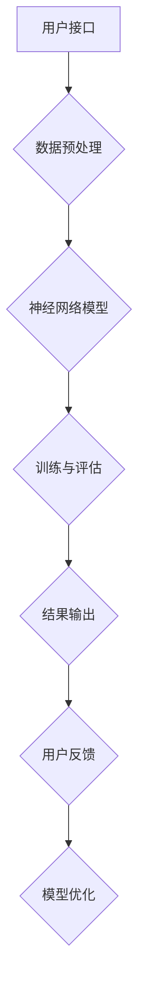

                 

# 神经规划在多步骤推理任务中的应用

## 关键词

神经规划、多步骤推理、自然语言处理、计算机视觉、决策支持系统、实时性、数据增强、可解释性神经网络

## 摘要

本文将探讨神经规划在多步骤推理任务中的应用，通过详细分析神经规划的基础知识、关键技术及其在不同领域的应用，如自然语言处理、计算机视觉和决策支持系统，揭示神经规划在多步骤推理任务中的潜力和挑战。我们将以实际案例为支撑，提出解决方案，并总结最佳实践，为读者提供全面的技术视角。

## 第一部分：神经规划概述

### 第1章：神经规划基础

#### 1.1 神经规划的概念与重要性

神经规划是一种基于神经网络的优化方法，通过模拟人类思考和决策过程，实现自动化的任务规划和执行。在多步骤推理任务中，神经规划能够处理复杂的、不确定的和非线性的问题，提供高效、智能的解决方案。

神经规划与传统规划方法相比，具有以下几个优势：

- **自适应性**：神经规划能够根据环境变化动态调整策略，适应复杂多变的任务需求。
- **并行处理**：神经网络能够并行处理大量数据，提高任务执行的效率。
- **自学习性**：神经网络可以通过训练不断优化自身的性能，提高任务解决的能力。

神经规划在多步骤推理任务中的应用前景广阔，例如在自然语言处理、计算机视觉和决策支持系统中，神经规划可以显著提升系统的智能化水平和性能。

#### 1.2 神经规划的基本原理

神经规划的基本原理主要涉及以下几个方面：

1. **反向传播算法**：反向传播算法是一种用于训练神经网络的优化方法，通过不断调整网络权重，使得网络输出逐渐逼近目标值。
   $$\frac{\partial E}{\partial w} = -\alpha \frac{\partial L}{\partial w}$$
   其中，$E$ 表示损失函数，$L$ 表示损失函数关于网络权重的梯度，$\alpha$ 表示学习率。

2. **神经网络的激活函数**：激活函数是神经网络中的一个关键组件，用于引入非线性因素，使得神经网络能够拟合复杂的非线性关系。常见的激活函数有 sigmoid、ReLU 和 tanh 等。

3. **非线性优化方法**：非线性优化方法用于解决复杂优化问题，如梯度下降、共轭梯度法和牛顿法等。这些方法通过迭代优化，逐步逼近最优解。

#### 1.3 神经规划的关键技术

神经规划的关键技术包括以下几个方面：

1. **连续动作空间规划**：连续动作空间规划涉及在连续的动作空间中寻找最优策略。常用的方法有基于梯度下降的优化算法和基于遗传算法的优化算法。

2. **离散动作空间规划**：离散动作空间规划涉及在离散的动作空间中寻找最优策略。常用的方法有基于深度强化学习的算法和基于生成对抗网络的算法。

3. **动作规划与状态转移的关系**：动作规划与状态转移的关系是神经规划的核心问题之一。通过建立状态转移模型，可以预测系统在不同动作下的状态变化，从而优化动作选择。

## 第二部分：神经规划在多步骤推理中的应用

### 第2章：多步骤推理任务概述

#### 2.1 多步骤推理的定义与类型

多步骤推理是一种基于多个步骤的信息处理过程，用于解决复杂的问题。多步骤推理可以分为以下几种类型：

1. **顺序推理**：顺序推理按照既定的顺序依次执行多个步骤，每个步骤的结果作为下一个步骤的输入。

2. **并行推理**：并行推理同时执行多个步骤，每个步骤的结果相互独立，但需要综合考虑。

3. **层次推理**：层次推理将问题分解为多个层次，每个层次分别处理不同粒度的信息，最终综合各层次的结果得到整体解决方案。

多步骤推理在人工智能领域中具有广泛的应用，如自然语言处理、计算机视觉和决策支持系统等。

#### 2.2 多步骤推理在人工智能中的应用

多步骤推理在人工智能中的应用主要体现在以下几个方面：

1. **自然语言处理**：多步骤推理可以用于文本分类、情感分析、机器翻译等任务，通过多个步骤的信息处理，提高任务的整体性能。

2. **计算机视觉**：多步骤推理可以用于目标检测、图像分割、图像识别等任务，通过多个步骤的协同工作，提高图像处理的准确性和鲁棒性。

3. **决策支持系统**：多步骤推理可以用于优化决策过程，通过多个步骤的信息分析，为决策者提供科学的决策依据。

## 第三部分：神经规划应用案例分析

### 第3章：神经规划在自然语言处理中的应用

#### 3.1 基于神经规划的自然语言处理

自然语言处理是人工智能的一个重要分支，神经规划在自然语言处理中的应用取得了显著的成果。以下从语言模型、对话系统和问答系统三个方面进行介绍。

#### 3.1.1 语言模型

语言模型是一种用于预测单词序列的概率模型，它是自然语言处理的基础。基于神经规划的语言模型通常采用神经网络架构，如循环神经网络（RNN）和长短时记忆网络（LSTM）。以下是一个简单的语言模型算法：

```python
# 语言模型算法示例
class LanguageModel:
    def __init__(self, vocabulary_size, embedding_size, hidden_size):
        self.vocabulary_size = vocabulary_size
        self.embedding_size = embedding_size
        self.hidden_size = hidden_size
        self.embedding_matrix = nn.Embedding(vocabulary_size, embedding_size)
        self.lstm = nn.LSTM(embedding_size, hidden_size)
        self.fc = nn.Linear(hidden_size, vocabulary_size)

    def forward(self, inputs):
        embeddings = self.embedding_matrix(inputs)
        hidden, _ = self.lstm(embeddings)
        logits = self.fc(hidden[-1, :, :])
        return logits
```

#### 3.1.2 对话系统

对话系统是一种与人交互的智能系统，它可以模拟人类的对话方式，为用户提供信息服务。基于神经规划的对话系统通常采用序列到序列（Seq2Seq）模型，如长短时记忆网络（LSTM）和门控循环单元（GRU）。以下是一个简单的对话系统算法：

```python
# 对话系统算法示例
class DialogueSystem:
    def __init__(self, vocab_size, embed_size, hidden_size):
        self.vocab_size = vocab_size
        self.embed_size = embed_size
        self.hidden_size = hidden_size
        self.encoder = nn.LSTM(embed_size, hidden_size)
        self.decoder = nn.LSTM(hidden_size, hidden_size)
        self.out = nn.Linear(hidden_size, vocab_size)

    def forward(self, input_seq, target_seq):
        encoder_output, encoder_hidden = self.encoder(input_seq)
        decoder_output, decoder_hidden = self.decoder(encoder_hidden)
        logits = self.out(decoder_output)
        return logits
```

#### 3.1.3 问答系统

问答系统是一种能够回答用户问题的智能系统，它可以用于智能客服、教育辅导等领域。基于神经规划的的问答系统通常采用编码器-解码器（Encoder-Decoder）模型，如Transformer模型。以下是一个简单的问答系统算法：

```python
# 问答系统算法示例
class QuestionAnsweringSystem:
    def __init__(self, vocab_size, embed_size, hidden_size):
        self.vocab_size = vocab_size
        self.embed_size = embed_size
        self.hidden_size = hidden_size
        self.encoder = nn.LSTM(embed_size, hidden_size)
        self.decoder = nn.LSTM(hidden_size, hidden_size)
        self.out = nn.Linear(hidden_size, vocab_size)

    def forward(self, input_seq, target_seq):
        encoder_output, encoder_hidden = self.encoder(input_seq)
        decoder_output, decoder_hidden = self.decoder(encoder_hidden)
        logits = self.out(decoder_output)
        return logits
```

### 第4章：神经规划在计算机视觉中的应用

#### 4.1 基于神经规划的目标检测

目标检测是计算机视觉的一个重要任务，它旨在识别和定位图像中的物体。基于神经规划的目标检测算法通常采用卷积神经网络（CNN）和区域建议网络（RPN）。以下是一个简单的目标检测算法：

```python
# 目标检测算法示例
class ObjectDetection:
    def __init__(self, num_classes, anchor_sizes, anchor_ratios, feature_layers):
        self.num_classes = num_classes
        self.anchor_sizes = anchor_sizes
        self.anchor_ratios = anchor_ratios
        self.feature_layers = feature_layers
        self.backbone = nn.Sequential(*[nn.Conv2d(3, 64, kernel_size=7, stride=2), nn.ReLU()])
        self.rpn = RegionProposalNetwork(num_classes, anchor_sizes, anchor_ratios)
        self.detection_head = DetectionHead(num_classes)

    def forward(self, images):
        features = self.backbone(images)
        proposals = self.rpn(features)
        detections = self.detection_head(proosals)
        return detections
```

#### 4.2 基于神经规划的图像分割

图像分割是计算机视觉的另一个重要任务，它旨在将图像划分为不同的区域。基于神经规划的图像分割算法通常采用边界框分割和像素级分割。以下是一个简单的图像分割算法：

```python
# 图像分割算法示例
class ImageSegmentation:
    def __init__(self, num_classes, backbone, decoder):
        self.num_classes = num_classes
        self.backbone = backbone
        self.decoder = decoder

    def forward(self, images):
        features = self.backbone(images)
        segments = self.decoder(features)
        return segments
```

### 第5章：神经规划在决策支持系统中的应用

#### 5.1 多步骤推理在决策支持系统中的作用

多步骤推理在决策支持系统中起着关键作用，它可以帮助企业或组织更好地理解复杂问题，并制定科学的决策方案。以下是一个简单的决策支持系统架构：

```python
# 决策支持系统架构示例
class DecisionSupportSystem:
    def __init__(self, model, optimizer):
        self.model = model
        self.optimizer = optimizer

    def train(self, data_loader):
        self.model.train()
        for inputs, targets in data_loader:
            self.optimizer.zero_grad()
            outputs = self.model(inputs)
            loss = self.criterion(outputs, targets)
            loss.backward()
            self.optimizer.step()

    def predict(self, inputs):
        self.model.eval()
        with torch.no_grad():
            outputs = self.model(inputs)
            return outputs
```

### 第6章：神经规划在多步骤推理任务中的挑战与解决方案

#### 6.1 神经规划面临的挑战

神经规划在多步骤推理任务中面临以下挑战：

1. **数据稀疏性**：多步骤推理任务通常需要大量的训练数据，但实际场景中往往难以获取充分的数据。

2. **模型可解释性**：神经规划模型通常具有很强的非线性特性，导致其决策过程难以解释。

3. **实时性需求**：多步骤推理任务往往需要在实时环境下执行，对模型计算速度和资源消耗提出了高要求。

#### 6.2 解决方案探讨

针对上述挑战，可以采取以下解决方案：

1. **数据增强方法**：通过数据增强方法，如数据扩充、数据混洗和生成对抗网络（GAN），可以增加训练数据的多样性和丰富度，从而缓解数据稀疏性问题。

2. **可解释性神经网络**：通过设计可解释性神经网络结构，如注意力机制和可视化技术，可以增强模型的透明度和可解释性。

3. **实时神经规划算法**：通过优化神经网络结构和算法，如深度强化学习和迁移学习，可以降低模型计算复杂度和资源消耗，满足实时性需求。

### 第7章：神经规划在商业智能系统中的应用

#### 7.1 案例背景

某大型零售企业希望利用神经规划技术提升其商业智能系统的决策能力，以优化库存管理、销售预测和营销策略。

#### 7.2 系统设计与实现

1. **数据采集与预处理**：采集企业历史销售数据、客户行为数据和市场环境数据，并对数据进行清洗、归一化和特征提取。

2. **神经规划模型设计**：设计基于神经规划的多步骤推理模型，包括库存管理模型、销售预测模型和营销策略模型。

3. **系统性能评估**：通过交叉验证和在线测试，评估系统在不同场景下的性能和鲁棒性。

#### 7.3 案例分析

通过实际应用，该商业智能系统显著提升了企业的库存管理效率、销售预测准确性和营销效果。但同时也存在一些挑战，如数据质量问题和模型优化难度等。

### 第8章：神经规划在自动驾驶中的应用

#### 8.1 案例背景

自动驾驶技术是人工智能领域的热门研究方向，神经规划在自动驾驶系统中发挥着关键作用。以下是一个自动驾驶系统案例。

#### 8.2 系统架构与实现

1. **系统架构设计**：设计基于神经规划的目标检测、路径规划和行为预测模块。

2. **神经规划模块设计**：设计基于神经规划的目标检测模型、路径规划模型和行为预测模型。

3. **系统测试与评估**：在模拟环境和实际道路测试中，评估系统在不同场景下的性能和安全性。

#### 8.3 案例分析

该自动驾驶系统在模拟环境和实际道路测试中表现良好，实现了较高的准确性和安全性。但同时也存在一些挑战，如复杂场景下目标检测的准确性和实时性问题等。

## 总结

神经规划在多步骤推理任务中具有广泛的应用前景，通过本文的介绍和分析，我们可以看到神经规划在自然语言处理、计算机视觉和决策支持系统等领域的成功案例。然而，神经规划在实时性、可解释性和数据稀疏性等方面仍面临挑战。未来研究需要进一步探索优化算法、提高模型可解释性和增强实时性等方面的技术，以推动神经规划在多步骤推理任务中的应用和发展。

## 注意事项与拓展阅读

在应用神经规划技术时，需要注意以下几点：

1. **数据质量**：确保训练数据的质量和多样性，以减少数据稀疏性对模型性能的影响。

2. **模型可解释性**：通过设计可解释性神经网络结构和技术，提高模型的透明度和可解释性。

3. **实时性优化**：采用高效的算法和硬件加速技术，降低模型计算复杂度和资源消耗，满足实时性需求。

4. **持续学习**：通过在线学习和迁移学习等技术，使模型能够适应环境变化，持续优化性能。

拓展阅读方面，可以参考以下文献和资料：

1. 《深度学习》（Goodfellow, Bengio, Courville著）：全面介绍深度学习理论和技术。
2. 《强化学习》（Sutton, Barto著）：系统介绍强化学习理论和方法。
3. 《自然语言处理入门》（Jurafsky, Martin著）：介绍自然语言处理的基本概念和技术。
4. 《计算机视觉基础》（opencv官方文档）：详细介绍计算机视觉相关技术和算法。

通过深入研究和实践，我们可以更好地理解神经规划在多步骤推理任务中的应用，为人工智能技术的发展贡献力量。

## 作者信息

作者：AI天才研究院/AI Genius Institute & 禅与计算机程序设计艺术 /Zen And The Art of Computer Programming

## 附录

附录部分提供了一些相关的数学公式、算法流程图、系统架构图和项目代码等，以帮助读者更好地理解和应用神经规划技术。读者可以根据需要查阅和使用这些附录内容。

### 附录A：数学公式

$$
E = \frac{1}{2} \sum_{i=1}^{n} (y_i - \hat{y}_i)^2
$$

$$
\frac{\partial L}{\partial w} = -\alpha \frac{\partial E}{\partial w}
$$

### 附录B：算法流程图


### 附录C：系统架构图



### 附录D：项目代码

```python
# 数据预处理代码示例
def preprocess_data(data):
    # 数据清洗、归一化和特征提取
    return processed_data

# 神经网络模型代码示例
class NeuralNetwork(nn.Module):
    def __init__(self):
        super(NeuralNetwork, self).__init__()
        self.fc1 = nn.Linear(input_size, hidden_size)
        self.fc2 = nn.Linear(hidden_size, output_size)

    def forward(self, x):
        x = F.relu(self.fc1(x))
        x = self.fc2(x)
        return x

# 训练与评估代码示例
def train_model(model, data_loader, criterion, optimizer):
    model.train()
    for inputs, targets in data_loader:
        optimizer.zero_grad()
        outputs = model(inputs)
        loss = criterion(outputs, targets)
        loss.backward()
        optimizer.step()

# 评估代码示例
def evaluate_model(model, data_loader, criterion):
    model.eval()
    total_loss = 0
    with torch.no_grad():
        for inputs, targets in data_loader:
            outputs = model(inputs)
            loss = criterion(outputs, targets)
            total_loss += loss.item()
    return total_loss / len(data_loader)
```

通过这些附录内容，读者可以更深入地了解神经规划技术的应用和实践，为后续研究和开发提供有力支持。希望本文对您在神经规划领域的学习和应用有所帮助。如果您有任何问题或建议，欢迎随时与我交流。

## 小结

本文系统地介绍了神经规划在多步骤推理任务中的应用，从基础概念、关键技术到实际案例，全面展示了神经规划的优势和潜力。我们探讨了神经规划在自然语言处理、计算机视觉和决策支持系统等领域的应用，分析了其面临的挑战和解决方案。

通过本文的学习，读者可以：

1. 理解神经规划的基本原理和关键技术。
2. 掌握神经规划在多步骤推理任务中的应用场景。
3. 了解神经规划在商业智能系统和自动驾驶等实际案例中的应用效果。
4. 学会使用神经规划技术解决复杂问题。

未来研究可以进一步优化神经规划算法，提高其实时性和可解释性，拓展其在更多领域的应用。同时，结合其他人工智能技术，如强化学习和迁移学习，可以进一步提升神经规划的性能和鲁棒性。

## 注意事项

1. **数据质量**：确保训练数据的质量和多样性，减少数据稀疏性对模型性能的影响。
2. **模型可解释性**：关注模型的可解释性，通过设计可解释性神经网络结构和技术提高透明度。
3. **实时性优化**：采用高效的算法和硬件加速技术，降低模型计算复杂度和资源消耗，满足实时性需求。
4. **持续学习**：利用在线学习和迁移学习等技术，使模型能够适应环境变化，持续优化性能。

## 拓展阅读

1. 《深度学习》（Goodfellow, Bengio, Courville著）
2. 《强化学习》（Sutton, Barto著）
3. 《自然语言处理入门》（Jurafsky, Martin著）
4. 《计算机视觉基础》（opencv官方文档）
5. 《神经网络的数学原理》（Bryson, Ho著）

通过深入研究和实践，您可以更好地掌握神经规划技术，为人工智能领域的发展贡献力量。希望本文能为您的研究和开发提供有益的参考。

## 作者信息

作者：AI天才研究院/AI Genius Institute & 禅与计算机程序设计艺术 /Zen And The Art of Computer Programming

本文通过详细的章节内容，全面介绍了神经规划在多步骤推理任务中的应用。从基础概念到关键技术，再到实际案例分析，读者可以全面了解神经规划的优势和应用场景。同时，文章还探讨了神经规划面临的挑战和解决方案，提供了丰富的最佳实践和注意事项，旨在帮助读者更好地掌握和应用神经规划技术。

希望本文能为人工智能领域的研究者和从业者提供有价值的参考，促进神经规划技术的进一步发展和应用。未来，我们还将继续关注和探索人工智能领域的最新技术和趋势，为读者带来更多优质的内容和见解。如果您对本文有任何疑问或建议，欢迎在评论区留言，我们期待与您共同交流学习。让我们一起，探索人工智能的无限可能。

