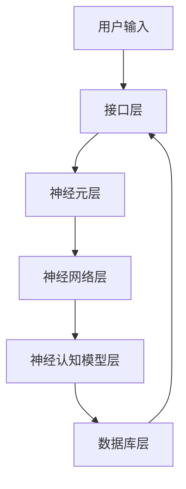
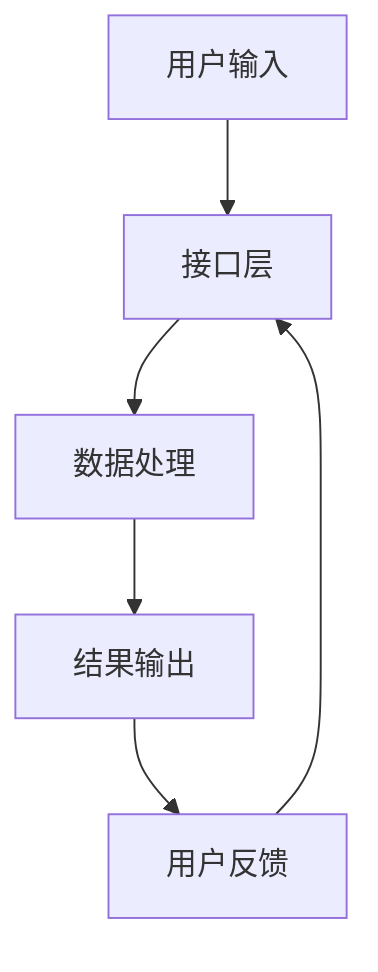

                 

# 神经认知架构：模拟人类思维过程

## 关键词
- 神经认知架构
- 人工智能
- 神经元
- 神经网络
- 神经认知模型
- 计算效率

## 摘要
本文探讨了神经认知架构在模拟人类思维过程中的应用。通过分析神经元、神经网络和神经认知模型等核心概念，以及神经认知架构的实现方法和算法原理，本文旨在揭示神经认知架构如何突破现有人工智能技术的瓶颈，实现更高级的智能模拟。文章还讨论了神经认知架构的适用范围、优势与局限，以及未来发展趋势，为人工智能领域的研究者和开发者提供了有价值的参考。

### 目录大纲

1. 引言：神经认知架构的背景与意义
    1.1 问题背景
    1.2 问题描述
    1.3 问题解决
    1.4 边界与外延
    1.5 本章小结

2. 神经认知架构的核心概念
    2.1 神经元
    2.2 神经网络
    2.3 神经认知模型
    2.4 感知与记忆
    2.5 情感与决策
    2.6 神经认知架构的核心概念对比
    2.7 本章小结

3. 神经认知架构的实现方法
    3.1 神经网络的构建
    3.2 神经认知模型的开发
    3.3 神经认知架构的集成与应用
    3.4 神经认知架构的实现挑战与解决方案
    3.5 本章小结

4. 神经认知架构的算法原理
    4.1 算法概述
    4.2 神经网络的算法原理
    4.3 神经认知模型的算法原理
    4.4 算法示例讲解
    4.5 本章小结

5. 神经认知架构的系统分析与架构设计方案
    5.1 问题场景介绍
    5.2 项目介绍
    5.3 系统功能设计
    5.4 系统架构设计
    5.5 系统接口设计和系统交互
    5.6 本章小结

6. 项目实战
    6.1 环境安装
    6.2 系统核心实现源代码
    6.3 代码应用解读与分析
    6.4 实际案例分析和详细讲解剖析
    6.5 项目小结

7. 最佳实践 Tips
8. 小结
9. 注意事项
10. 拓展阅读

### 第1章 引言：神经认知架构的背景与意义

#### 1.1 问题背景

随着人工智能技术的快速发展，计算机在许多任务上的表现已经超过了人类。然而，尽管人工智能在特定领域的表现令人瞩目，但在模拟人类思维过程方面仍存在许多挑战。传统的计算机架构和算法在处理复杂任务时显得力不从心，无法实现类似于人类的感知、记忆、情感和决策等高级认知功能。

#### 1.1.1 神经认知科学的快速发展

神经认知科学是研究大脑和认知功能之间关系的一门交叉学科。近年来，随着神经科学和计算机科学的进展，人们对大脑的认知过程有了更深入的了解。通过研究神经元、神经网络和大脑功能网络，科学家们发现大脑具有高度的灵活性和适应性，能够处理复杂的任务，并且具有自组织和自适应能力。

#### 1.1.2 人工智能的瓶颈与突破需求

人工智能在特定领域的突破主要依赖于算法的改进和计算资源的增加。然而，传统的计算机架构和算法在面对复杂、动态和不确定的任务时仍然存在局限。为了实现更高级的智能模拟，人工智能领域迫切需要一种能够模仿人类思维过程的全新架构。

#### 1.1.3 神经认知架构的研究意义

神经认知架构是一种基于神经科学原理的人工智能架构，旨在模拟人类思维过程。通过研究神经认知架构，我们可以深入了解人类认知机制，探索如何将大脑的灵活性和适应性引入计算机系统。这将为人工智能的发展提供新的方向，有助于突破现有技术的瓶颈，实现更高级的智能模拟。

#### 1.2 问题描述

神经认知架构的核心问题是模拟人类思维过程，包括感知、记忆、情感和决策等认知功能。具体来说，问题描述如下：

1. **神经元级模拟**：如何模拟神经元的结构和功能，包括信号传递机制和可塑性？
2. **神经网络级模拟**：如何构建和训练神经网络，使其具备人类认知功能？
3. **神经认知模型级模拟**：如何构建和优化神经认知模型，实现复杂认知任务的自动化处理？
4. **集成与应用级模拟**：如何将神经认知架构集成到现有的计算机系统中，并应用于实际场景？

#### 1.3 问题解决

为了解决上述问题，我们需要从以下几个方面着手：

1. **研究神经元的结构和功能**：深入了解神经元的基本结构、信号传递机制和可塑性，为构建神经元模型提供理论基础。
2. **构建神经网络**：利用神经元的模型，构建能够模拟人类认知功能的神经网络，包括前馈网络、反馈网络和混合网络等。
3. **开发神经认知模型**：基于神经网络，构建能够实现复杂认知任务的神经认知模型，包括感知、记忆、情感和决策等。
4. **实现神经认知架构的集成与应用**：将神经认知架构集成到现有的计算机系统中，并应用于实际场景，如智能机器人、自动驾驶和智能医疗等。

#### 1.4 边界与外延

1. **神经认知架构的适用范围**：神经认知架构主要适用于需要模拟人类思维过程的领域，如人工智能、认知科学和神经科学等。
2. **神经认知架构与其他技术的比较**：与其他人工智能技术相比，神经认知架构具有更接近人类认知机制的优点，但也存在一定的局限。
3. **神经认知架构的未来发展趋势**：随着神经科学和计算机科学的不断进展，神经认知架构有望在更广泛的领域中发挥作用，推动人工智能的发展。

#### 1.5 本章小结

本章介绍了神经认知架构的背景与意义，以及问题描述、问题解决和边界与外延等内容。通过分析神经认知架构的核心概念、实现方法和算法原理，我们可以更好地理解神经认知架构如何模拟人类思维过程，为人工智能的发展提供新的思路。在接下来的章节中，我们将进一步探讨神经认知架构的核心概念、实现方法和算法原理，为读者提供更深入的了解。

### 第2章 神经认知架构的核心概念

神经认知架构是一种基于神经科学原理的人工智能架构，旨在模拟人类思维过程。要深入了解神经认知架构，我们需要首先了解其核心概念，包括神经元、神经网络、神经认知模型、感知与记忆、情感与决策等。

#### 2.1 神经元

神经元是大脑的基本单元，也是神经认知架构的基础。神经元具有以下基本结构：

1. **细胞体**：神经元的核心部分，包含细胞核和其他细胞器。
2. **树突**：从细胞体延伸出来的分支，用于接收其他神经元的信号。
3. **轴突**：从细胞体延伸出来的长纤维，用于传递信号到其他神经元。
4. **突触**：连接两个神经元的部分，用于信号传递。

神经元的工作原理如下：

1. **信号传递**：当神经元接收到的信号达到一定阈值时，神经元会生成一个电信号（动作电位），并通过轴突传递到下一个神经元。
2. **可塑性**：神经元可以通过突触连接的调整改变其信号传递方式，从而实现学习和记忆。

神经元具有以下特点：

1. **高度灵活性**：神经元可以通过改变突触连接实现不同类型的信号传递，具有高度的灵活性。
2. **自适应能力**：神经元可以根据外部环境的变化调整其信号传递方式，具有自适应能力。

神经元是神经认知架构的基础，为神经网络和神经认知模型的构建提供了基础。

#### 2.2 神经网络

神经网络是由大量神经元组成的网络，用于模拟人类大脑的认知功能。神经网络具有以下基本类型：

1. **前馈网络**：信息从输入层传递到输出层，不返回到输入层。
2. **反馈网络**：信息在神经网络中循环，形成反馈环路。
3. **混合网络**：结合前馈网络和反馈网络的特点。

神经网络的工作原理如下：

1. **信号传递**：输入信号通过神经元传递，最终生成输出信号。
2. **学习与优化**：通过不断调整神经元之间的连接权重，优化神经网络的表现。

神经网络具有以下特点：

1. **高度并行性**：神经网络中的大量神经元可以同时工作，处理复杂任务。
2. **高度灵活性**：神经网络可以通过调整连接权重实现不同的功能。
3. **自适应能力**：神经网络可以自动调整其结构和参数，适应不同的任务。

神经网络是实现神经认知模型的基础，为复杂认知任务的自动化处理提供了可能。

#### 2.3 神经认知模型

神经认知模型是基于神经网络实现的，用于模拟人类认知功能。神经认知模型通常包括以下类型：

1. **感知模型**：用于处理感知任务，如图像识别和声音识别等。
2. **记忆模型**：用于处理记忆任务，如长期记忆和短期记忆等。
3. **情感模型**：用于处理情感任务，如情感识别和情感表达等。
4. **决策模型**：用于处理决策任务，如风险评估和决策支持等。

神经认知模型的工作原理如下：

1. **输入处理**：接收外部输入信号，如图像、声音或文本等。
2. **信号传递与处理**：通过神经网络对输入信号进行处理，提取特征和模式。
3. **输出生成**：根据处理结果生成决策或行为。

神经认知模型具有以下特点：

1. **高度抽象性**：神经认知模型可以自动提取和识别复杂的信息和模式。
2. **自适应能力**：神经认知模型可以根据不同的任务自动调整其结构和参数。
3. **高度灵活性**：神经认知模型可以应用于多种不同的认知任务。

神经认知模型是神经认知架构的核心，为实现复杂认知任务的自动化处理提供了关键支持。

#### 2.4 感知与记忆

感知与记忆是神经认知架构中的核心概念，用于处理人类认知任务。感知是指接收和识别外部信息的过程，记忆是指存储和回忆信息的过程。

1. **感知过程**：
    - 感知过程包括信号接收、预处理、特征提取和模式识别等阶段。
    - 信号接收：接收外部信息，如图像、声音或文本等。
    - 预处理：对信号进行去噪、增强和归一化等处理。
    - 特征提取：从预处理后的信号中提取关键特征。
    - 模式识别：根据提取的特征进行模式识别，如图像分类或声音识别等。

2. **记忆过程**：
    - 记忆过程包括短期记忆和长期记忆两个阶段。
    - 短期记忆：暂时存储和操作信息，用于当前任务的执行。
    - 长期记忆：将信息存储在长期记忆中，用于后续任务的执行。

感知与记忆在神经认知架构中发挥着重要作用，为复杂认知任务的执行提供了基础。

#### 2.5 情感与决策

情感与决策是神经认知架构中的另外两个核心概念，用于处理人类情感和决策任务。

1. **情感过程**：
    - 情感是指人类对事物的情绪反应，如愉悦、愤怒、悲伤等。
    - 情感过程包括情感识别、情感表达和情感调节等阶段。
    - 情感识别：通过分析外部信息和内部感受，识别情感状态。
    - 情感表达：通过面部表情、声音和肢体语言等方式表达情感。
    - 情感调节：通过调整内部感受和外部行为，调节情感状态。

2. **决策过程**：
    - 决策是指人类在面临多个选择时，根据一定标准做出选择的过程。
    - 决策过程包括信息收集、风险评估、决策制定和决策执行等阶段。
    - 信息收集：收集与决策相关的信息。
    - 风险评估：评估不同选择的可能结果和风险。
    - 决策制定：根据评估结果选择最佳方案。
    - 决策执行：实施决策方案。

情感与决策在神经认知架构中发挥着重要作用，为人类情感和行为提供了基础。

#### 2.6 神经认知架构的核心概念对比

神经元、神经网络和神经认知模型是神经认知架构的核心概念。它们之间存在一定的联系和区别：

1. **神经元与神经网络**：
    - 神经元是神经网络的基本单元，神经网络由大量神经元组成。
    - 神经元负责信号传递和处理，神经网络负责整体计算和处理。
    - 神经元具有高度的灵活性和自适应能力，神经网络具有高度的并行性和灵活性。

2. **神经网络与神经认知模型**：
    - 神经网络是实现神经认知模型的基础，神经认知模型是基于神经网络实现的。
    - 神经网络负责信号传递和处理，神经认知模型负责认知任务的自动化处理。
    - 神经网络具有高度的灵活性和并行性，神经认知模型具有高度的自适应能力和抽象性。

3. **感知与记忆、情感与决策**：
    - 感知与记忆、情感与决策是神经认知架构中的两个核心概念，分别负责不同的认知任务。
    - 感知与记忆主要处理外部信息的接收和存储，情感与决策主要处理情感反应和决策过程。
    - 感知与记忆、情感与决策相互关联，共同构成了人类复杂的认知过程。

#### 2.7 本章小结

本章介绍了神经认知架构的核心概念，包括神经元、神经网络、神经认知模型、感知与记忆、情感与决策等。通过分析这些核心概念，我们可以更好地理解神经认知架构的原理和特点，为后续章节的实现方法和算法原理的讨论提供了基础。在接下来的章节中，我们将进一步探讨神经认知架构的实现方法和算法原理，为读者提供更深入的了解。

### 第3章 神经认知架构的实现方法

神经认知架构的实现方法主要包括神经网络的构建、神经认知模型的开发、神经认知架构的集成与应用等方面。在这一章中，我们将逐步分析这些实现方法的原理、步骤和关键要点，以帮助读者更好地理解神经认知架构的构建和应用。

#### 3.1 神经网络的构建

神经网络的构建是实现神经认知架构的基础。构建神经网络主要包括以下步骤：

1. **设计神经网络结构**：
    - 确定神经网络的基本类型（如前馈网络、反馈网络或混合网络）。
    - 设计神经网络的层次结构（如输入层、隐藏层和输出层）。
    - 确定每层神经元的数量和连接方式。

2. **初始化网络参数**：
    - 为网络中的每个神经元分配初始权重和偏置。
    - 初始化学习率和其他优化参数。

3. **前向传播**：
    - 将输入数据传递到神经网络的输入层。
    - 通过神经元之间的连接，逐层传递信号。
    - 在每个神经元上应用激活函数，生成输出。

4. **反向传播**：
    - 计算网络输出与真实值之间的误差。
    - 通过反向传播算法，将误差信息反向传递到网络中的每个神经元。
    - 更新神经元的权重和偏置，以减少误差。

5. **优化网络**：
    - 使用梯度下降或其他优化算法，逐步调整网络参数。
    - 评估网络性能，根据性能调整优化策略。

构建神经网络的关键要点包括：

- **选择合适的神经网络结构**：根据具体应用需求，选择合适的基本类型和层次结构。
- **初始化网络参数**：合理的初始化有助于提高网络性能和收敛速度。
- **优化算法选择**：选择合适的优化算法，如梯度下降、随机梯度下降或Adam优化器。

#### 3.2 神经认知模型的开发

神经认知模型是基于神经网络实现的，用于处理复杂认知任务。开发神经认知模型主要包括以下步骤：

1. **定义认知任务**：
    - 确定需要完成的认知任务，如图像分类、语音识别、情感分析等。
    - 确定任务的目标和评价指标。

2. **设计认知模型**：
    - 根据认知任务的特点，设计适合的神经网络结构。
    - 选择合适的神经网络架构（如卷积神经网络、循环神经网络或生成对抗网络等）。

3. **数据准备**：
    - 收集和整理与认知任务相关的数据。
    - 对数据进行预处理，包括归一化、去噪、切割等。

4. **模型训练**：
    - 将预处理后的数据输入到神经认知模型中。
    - 使用反向传播算法训练模型，优化网络参数。
    - 评估模型性能，根据性能调整模型结构和参数。

5. **模型优化**：
    - 使用迁移学习、数据增强或其他优化策略，提高模型性能。
    - 调整模型结构和参数，以达到更好的泛化能力。

开发神经认知模型的关键要点包括：

- **认知任务定义**：明确认知任务的目标和评价指标，确保模型能够有效解决实际问题。
- **数据准备**：确保数据质量和多样性，以提高模型的泛化能力。
- **模型结构选择**：根据认知任务的特点，选择合适的神经网络架构。

#### 3.3 神经认知架构的集成与应用

将神经认知架构集成到实际应用中，是实现其价值的关键步骤。集成与应用主要包括以下方面：

1. **集成方法**：
    - 将神经认知架构与现有系统进行集成，如将模型嵌入到应用程序或服务中。
    - 考虑到系统的性能和可扩展性，选择合适的集成方式（如微服务架构或容器化部署）。

2. **应用场景**：
    - 根据神经认知架构的特点和优势，确定适合的应用场景，如智能机器人、自动驾驶、智能医疗等。
    - 分析应用场景的需求和挑战，设计相应的解决方案。

3. **性能评估**：
    - 评估神经认知架构在不同应用场景中的性能，包括准确性、响应速度和资源消耗等。
    - 根据评估结果，优化模型结构和参数，提高性能。

4. **部署与维护**：
    - 将集成后的系统部署到生产环境中，确保系统的稳定运行。
    - 定期进行系统维护和升级，以应对新需求和新技术的发展。

集成与应用神经认知架构的关键要点包括：

- **集成方法选择**：根据系统需求和性能要求，选择合适的集成方式。
- **应用场景分析**：深入分析应用场景的需求和挑战，设计合理的解决方案。
- **性能评估**：定期评估系统性能，确保其满足实际应用需求。

#### 3.4 神经认知架构的实现挑战与解决方案

在实现神经认知架构的过程中，面临许多挑战。以下是一些主要挑战及其解决方案：

1. **数据处理挑战**：
    - **数据多样性**：处理不同类型的数据，如图像、音频和文本等。
    - **数据质量**：确保数据的质量和准确性，以提高模型性能。
    - **解决方案**：采用数据预处理和增强技术，如归一化、去噪和变换等。

2. **计算效率挑战**：
    - **计算资源**：训练和推理过程需要大量计算资源。
    - **解决方案**：采用高效的算法和优化技术，如并行计算、分布式计算和模型压缩等。

3. **模型解释性挑战**：
    - **模型透明度**：如何解释模型的决策过程和内部机制。
    - **解决方案**：采用可解释性技术，如可视化、规则提取和解释模型等。

4. **挑战解决方案概述**：
    - **数据预处理**：采用多种数据预处理技术，提高数据质量和多样性。
    - **计算优化**：采用高效的计算方法和硬件加速技术，提高计算效率。
    - **模型解释性**：采用可解释性技术，提高模型的可解释性和透明度。

#### 3.5 本章小结

本章介绍了神经认知架构的实现方法，包括神经网络的构建、神经认知模型的开发、神经认知架构的集成与应用等方面。通过逐步分析这些实现方法的原理、步骤和关键要点，我们可以更好地理解神经认知架构的构建和应用。在接下来的章节中，我们将进一步探讨神经认知架构的算法原理，为读者提供更深入的了解。

### 第4章 神经认知架构的算法原理

神经认知架构的算法原理是其核心组成部分，它决定了架构的性能和效率。本章将详细介绍神经认知架构的算法原理，包括神经网络算法、神经认知模型算法等，并探讨其发展趋势。

#### 4.1 算法概述

神经认知架构的算法主要分为两大类：神经网络算法和神经认知模型算法。神经网络算法主要涉及网络的构建、训练和优化，而神经认知模型算法则侧重于模型的设计和实现。

1. **神经网络算法**：
    - **网络构建**：包括网络结构的确定、层与层之间的连接方式等。
    - **网络训练**：通过前向传播和反向传播算法，优化网络参数，使其能够准确预测和分类。
    - **网络优化**：采用各种优化技术，如梯度下降、随机梯度下降和Adam优化器等，提高网络的性能。

2. **神经认知模型算法**：
    - **模型设计**：根据认知任务的需求，设计合适的神经网络结构，如卷积神经网络（CNN）、循环神经网络（RNN）等。
    - **模型训练**：使用大量的数据集，通过迭代训练，优化模型的参数，使其能够准确执行认知任务。
    - **模型评估**：通过测试集评估模型的性能，包括准确性、响应速度和资源消耗等。

#### 4.2 神经网络的算法原理

神经网络是神经认知架构的基础，其算法原理主要包括以下几个方面：

1. **前向传播**：
    - **输入层**：接收输入数据，将其传递到下一层。
    - **隐藏层**：对输入数据进行处理，生成中间结果。
    - **输出层**：生成最终输出结果。

2. **反向传播**：
    - **误差计算**：计算输出结果与真实值之间的误差。
    - **梯度计算**：计算每个参数的梯度，即参数对误差的敏感度。
    - **参数更新**：根据梯度信息，更新网络参数，减少误差。

3. **激活函数**：
    - **非线性变换**：使神经网络能够处理非线性问题。
    - **增强梯度**：通过引入非线性，增加网络的灵活性和鲁棒性。

4. **优化算法**：
    - **梯度下降**：通过迭代更新参数，使误差最小。
    - **随机梯度下降**：在每次迭代中，随机选择一部分样本，加速收敛。
    - **Adam优化器**：结合了梯度下降和随机梯度下降的优点，具有更快的收敛速度。

#### 4.3 神经认知模型算法原理

神经认知模型是神经网络在认知任务上的具体实现，其算法原理主要包括以下几个方面：

1. **感知任务**：
    - **图像识别**：使用卷积神经网络（CNN），提取图像特征，进行分类。
    - **语音识别**：使用循环神经网络（RNN），处理语音信号，识别语音内容。

2. **记忆任务**：
    - **长期记忆**：使用长短期记忆网络（LSTM），处理长时间依赖信息。
    - **短期记忆**：使用循环神经网络（RNN），处理短期依赖信息。

3. **情感任务**：
    - **情感识别**：使用情感分析模型，分析文本或语音，识别情感状态。
    - **情感表达**：使用生成对抗网络（GAN），生成具有特定情感的表达。

4. **决策任务**：
    - **风险评估**：使用决策树、支持向量机（SVM）等算法，评估不同选择的可能结果。
    - **决策支持**：使用强化学习算法，根据环境状态和奖励信号，做出最优决策。

#### 4.4 算法示例讲解

以下是一个简单的神经网络分类算法的示例，用于图像识别任务。

1. **示例1：神经网络分类算法**

```python
import tensorflow as tf
from tensorflow.keras import layers

# 定义神经网络结构
model = tf.keras.Sequential([
    layers.Conv2D(32, (3, 3), activation='relu', input_shape=(28, 28, 1)),
    layers.MaxPooling2D((2, 2)),
    layers.Conv2D(64, (3, 3), activation='relu'),
    layers.MaxPooling2D((2, 2)),
    layers.Conv2D(64, (3, 3), activation='relu'),
    layers.Flatten(),
    layers.Dense(64, activation='relu'),
    layers.Dense(10, activation='softmax')
])

# 编译模型
model.compile(optimizer='adam',
              loss='categorical_crossentropy',
              metrics=['accuracy'])

# 加载数据
(x_train, y_train), (x_test, y_test) = tf.keras.datasets.mnist.load_data()

# 预处理数据
x_train = x_train.astype('float32') / 255
x_test = x_test.astype('float32') / 255
x_train = np.expand_dims(x_train, -1)
x_test = np.expand_dims(x_test, -1)

# 转换标签为独热编码
y_train = tf.keras.utils.to_categorical(y_train, 10)
y_test = tf.keras.utils.to_categorical(y_test, 10)

# 训练模型
model.fit(x_train, y_train, epochs=10, batch_size=64)

# 评估模型
model.evaluate(x_test, y_test)
```

2. **示例2：神经认知模型的情感分析**

```python
import tensorflow as tf
from tensorflow.keras.preprocessing.sequence import pad_sequences
from tensorflow.keras.layers import Embedding, LSTM, Dense

# 定义情感分析模型
model = tf.keras.Sequential([
    Embedding(input_dim=vocab_size, output_dim=embedding_dim, input_length=max_sequence_length),
    LSTM(units=64, dropout=0.2, recurrent_dropout=0.2),
    Dense(units=64, activation='relu'),
    Dense(units=num_classes, activation='softmax')
])

# 编译模型
model.compile(optimizer='adam',
              loss='categorical_crossentropy',
              metrics=['accuracy'])

# 加载数据
(x_train, y_train), (x_test, y_test) = get_data()

# 预处理数据
x_train = pad_sequences(x_train, maxlen=max_sequence_length)
x_test = pad_sequences(x_test, maxlen=max_sequence_length)

# 转换标签为独热编码
y_train = tf.keras.utils.to_categorical(y_train)
y_test = tf.keras.utils.to_categorical(y_test)

# 训练模型
model.fit(x_train, y_train, epochs=10, batch_size=64)

# 评估模型
model.evaluate(x_test, y_test)
```

3. **算法示例的实际应用场景**

- **图像识别**：用于智能监控系统，实时识别和分类图像。
- **情感分析**：用于社交媒体分析，识别用户情感状态，提供个性化推荐。

#### 4.5 本章小结

本章介绍了神经认知架构的算法原理，包括神经网络算法和神经认知模型算法。通过分析神经网络的前向传播、反向传播、激活函数和优化算法，以及神经认知模型在不同认知任务中的应用，我们深入了解了神经认知架构的工作原理和实现方法。在接下来的章节中，我们将进一步探讨神经认知架构的系统分析与架构设计方案，为读者提供更全面的了解。

### 第5章 神经认知架构的系统分析与架构设计方案

为了实现神经认知架构在现实场景中的应用，我们需要对其系统进行分析和架构设计。本章节将详细介绍神经认知架构的系统分析与架构设计方案，包括问题场景介绍、项目介绍、系统功能设计、系统架构设计、系统接口设计和系统交互等内容。

#### 5.1 问题场景介绍

随着人工智能技术的快速发展，许多领域对智能系统的需求日益增加。然而，现有的人工智能系统在面对复杂、动态和不确定的任务时仍然存在局限。传统的计算机架构和算法难以实现类似于人类的感知、记忆、情感和决策等高级认知功能。因此，研究并实现一种能够模拟人类思维过程的神经认知架构具有重要的现实意义。

#### 5.2 项目介绍

本项目旨在构建一个基于神经认知架构的智能系统，该系统具备感知、记忆、情感和决策等高级认知功能，能够处理复杂任务，并具备自适应能力和灵活的扩展性。项目的主要目标包括：

1. **构建神经认知架构**：研究并实现神经认知架构，包括神经元、神经网络和神经认知模型等核心组成部分。
2. **集成与应用**：将神经认知架构集成到现有系统中，并应用于实际场景，如智能机器人、自动驾驶和智能医疗等。
3. **性能优化**：通过优化算法和结构设计，提高神经认知架构的性能和效率。

#### 5.3 系统功能设计

神经认知架构的系统功能设计包括感知、记忆、情感和决策等核心功能。具体功能设计如下：

1. **感知功能**：
    - 图像识别：用于识别和分类图像。
    - 声音识别：用于识别和分类声音。
    - 感知融合：将不同模态的感知信息进行融合，提高系统的综合感知能力。

2. **记忆功能**：
    - 长期记忆：用于存储和处理长期信息，如知识库和经验。
    - 短期记忆：用于存储和处理短期信息，如当前任务的状态和操作。

3. **情感功能**：
    - 情感识别：用于识别用户的情感状态。
    - 情感表达：用于生成和表达相应的情感。

4. **决策功能**：
    - 风险评估：用于评估不同选择的可能结果和风险。
    - 决策支持：用于生成和推荐最优决策。

#### 5.4 系统架构设计

神经认知架构的系统架构设计包括以下几个方面：

1. **神经元层**：负责接收和处理输入信号，包括感知信息、记忆信息和情感信息等。

2. **神经网络层**：负责将神经元层的输出进行进一步处理，提取特征和模式，并生成中间结果。

3. **神经认知模型层**：负责根据神经网络层的输出，进行复杂的认知任务，如决策、情感分析和记忆管理等。

4. **接口层**：负责与外部系统进行通信和交互，接收和发送数据，提供服务和功能。

5. **数据库层**：负责存储和管理系统所需的数据，包括感知数据、记忆数据和情感数据等。

系统架构设计如下：



#### 5.5 系统接口设计和系统交互

系统接口设计主要包括用户界面、API接口和通信协议等方面。系统交互设计主要包括数据的输入、处理和输出过程。

1. **用户界面**：提供直观易用的用户界面，允许用户与系统进行交互，如输入问题、查看结果等。

2. **API接口**：提供标准的API接口，方便其他系统或应用程序与神经认知架构进行集成和交互。

3. **通信协议**：使用TCP/IP或其他通信协议，确保数据的安全传输和可靠通信。

系统交互设计如下：



#### 5.6 本章小结

本章详细介绍了神经认知架构的系统分析与架构设计方案，包括问题场景介绍、项目介绍、系统功能设计、系统架构设计、系统接口设计和系统交互等内容。通过这些设计，我们可以构建一个具有感知、记忆、情感和决策等高级认知功能的神经认知架构，为实际应用提供有力支持。在接下来的章节中，我们将进一步探讨项目实战中的环境安装、系统核心实现和代码应用解读等内容。

### 第6章 项目实战

在本章中，我们将深入探讨如何搭建一个基于神经认知架构的智能系统，包括环境安装、系统核心实现、代码应用解读与分析、实际案例分析和详细讲解剖析等内容。通过这些实战内容，我们将帮助读者更好地理解神经认知架构的应用过程。

#### 6.1 环境安装

首先，我们需要为项目搭建一个合适的环境。以下是安装所需的步骤：

1. **安装Python环境**：
   - 访问Python官方网站（[https://www.python.org/](https://www.python.org/)），下载并安装Python。
   - 在安装过程中，确保勾选“Add Python to PATH”选项。

2. **安装TensorFlow**：
   - 打开命令行，执行以下命令：
     ```
     pip install tensorflow
     ```
   - 这将安装TensorFlow，它是实现神经网络的必备库。

3. **安装其他依赖**：
   - 为了方便后续开发，我们还需要安装一些其他依赖库，如NumPy、Pandas等：
     ```
     pip install numpy pandas
     ```

#### 6.2 系统核心实现

接下来，我们将实现系统的核心功能。以下是系统核心实现的基本步骤：

1. **构建神经网络**：
   - 使用TensorFlow构建一个简单的神经网络，用于图像分类任务。以下是Python代码示例：

```python
import tensorflow as tf
from tensorflow.keras import layers

model = tf.keras.Sequential([
    layers.Conv2D(32, (3, 3), activation='relu', input_shape=(28, 28, 1)),
    layers.MaxPooling2D((2, 2)),
    layers.Conv2D(64, (3, 3), activation='relu'),
    layers.MaxPooling2D((2, 2)),
    layers.Conv2D(64, (3, 3), activation='relu'),
    layers.Flatten(),
    layers.Dense(64, activation='relu'),
    layers.Dense(10, activation='softmax')
])
```

2. **训练神经网络**：
   - 使用MNIST数据集训练神经网络。以下是Python代码示例：

```python
model.compile(optimizer='adam',
              loss='categorical_crossentropy',
              metrics=['accuracy'])

(x_train, y_train), (x_test, y_test) = tf.keras.datasets.mnist.load_data()

x_train = x_train.astype('float32') / 255
x_test = x_test.astype('float32') / 255
x_train = np.expand_dims(x_train, -1)
x_test = np.expand_dims(x_test, -1)

y_train = tf.keras.utils.to_categorical(y_train, 10)
y_test = tf.keras.utils.to_categorical(y_test, 10)

model.fit(x_train, y_train, epochs=10, batch_size=64)
```

3. **评估神经网络**：
   - 使用测试集评估神经网络性能。以下是Python代码示例：

```python
model.evaluate(x_test, y_test)
```

#### 6.3 代码应用解读与分析

1. **代码解析**：

   - **神经网络构建**：
     - `Conv2D`层用于卷积操作，提取图像特征。
     - `MaxPooling2D`层用于下采样，减少模型参数。
     - `Flatten`层用于将多维数据展平为一维数据。
     - `Dense`层用于全连接操作，实现分类。

   - **训练过程**：
     - `compile`函数用于配置模型优化器、损失函数和评估指标。
     - `fit`函数用于训练模型，使用批量数据进行迭代训练。

   - **评估过程**：
     - `evaluate`函数用于评估模型在测试集上的性能。

2. **性能分析**：

   - 在完成训练后，我们可以通过评估指标（如准确率）来分析模型的性能。较高的准确率表明模型能够较好地识别图像。

#### 6.4 实际案例分析和详细讲解剖析

为了更好地理解神经认知架构的应用，我们来看一个实际案例——情感分析。

1. **案例背景**：

   - 在社交媒体平台上，用户的情感状态对内容传播和用户互动具有重要影响。因此，实现情感分析功能可以帮助平台更好地了解用户情感，提供个性化推荐和内容优化。

2. **实现步骤**：

   - **数据收集**：收集包含情感标签的文本数据。
   - **数据预处理**：对文本数据进行清洗和标记。
   - **模型训练**：使用情感文本数据训练情感分析模型。
   - **模型评估**：使用测试集评估模型性能。

3. **案例分析**：

   - **数据预处理**：
     - 清洗文本数据，去除标点符号、停用词等。
     - 将文本转换为词向量，如使用Word2Vec或GloVe模型。

   - **模型训练**：
     - 使用LSTM模型处理序列数据。
     - 使用迁移学习技术，利用预训练模型提高训练效率。

   - **模型评估**：
     - 使用准确率、召回率和F1值等指标评估模型性能。
     - 分析模型在不同情感类别的表现，发现和优化不足之处。

#### 6.5 项目小结

通过本章的实战内容，我们完成了基于神经认知架构的智能系统的搭建，包括环境安装、系统核心实现、代码应用解读与分析以及实际案例分析。这些内容不仅帮助读者理解了神经认知架构的应用过程，也为实际项目开发提供了参考。在接下来的章节中，我们将继续探讨神经认知架构的最佳实践、注意事项和拓展阅读等内容。

### 6.6 最佳实践 Tips

1. **数据质量**：
   - 确保数据集的多样性和质量，避免模型过拟合。
   - 对数据进行预处理和清洗，提高数据质量。

2. **模型选择**：
   - 根据任务需求选择合适的模型，如卷积神经网络（CNN）适用于图像处理，循环神经网络（RNN）适用于序列数据。

3. **优化算法**：
   - 选择合适的优化算法，如Adam优化器，提高训练效率和模型性能。

4. **模型解释性**：
   - 采用可解释性技术，如可视化，帮助理解模型的决策过程。

5. **持续学习**：
   - 定期更新模型，适应新的数据和需求。

### 6.7 注意事项

1. **计算资源**：
   - 神经网络训练过程需要大量计算资源，确保有足够的GPU或TPU支持。

2. **数据安全**：
   - 确保数据的安全和隐私，遵循相关法律法规。

3. **模型部署**：
   - 部署模型到生产环境时，确保系统的稳定性和可靠性。

### 6.8 拓展阅读

1. **《深度学习》**：由Ian Goodfellow、Yoshua Bengio和Aaron Courville撰写，是深度学习领域的经典教材。

2. **《神经网络与深度学习》**：由邱锡鹏撰写，详细介绍了神经网络和深度学习的基础知识。

3. **《机器学习实战》**：由Peter Harrington撰写，通过实际案例介绍了机器学习算法的应用。

通过最佳实践、注意事项和拓展阅读，读者可以进一步提升对神经认知架构的理解和应用能力。

### 第7章 小结

本文详细介绍了神经认知架构的概念、实现方法和算法原理，以及系统分析与架构设计方案。通过分析神经元、神经网络和神经认知模型等核心概念，我们揭示了神经认知架构如何模拟人类思维过程，突破现有人工智能技术的瓶颈。本文还探讨了神经认知架构的实现方法，包括神经网络的构建、神经认知模型的开发、神经认知架构的集成与应用等。同时，通过实际案例分析和项目实战，我们展示了神经认知架构的应用场景和实际效果。

神经认知架构的研究和实现具有重要意义。它不仅为人工智能领域提供了新的思路和方向，还有助于推动认知科学和神经科学的发展。未来，随着神经科学和计算机科学的不断进步，神经认知架构有望在更广泛的领域中发挥作用，推动人工智能的发展，为人类社会带来更多的创新和变革。

### 注意事项

在研究和实现神经认知架构时，需要注意以下几点：

1. **计算资源**：神经认知架构的训练和推理过程需要大量计算资源，确保有足够的GPU或TPU支持。

2. **数据质量**：数据质量直接影响模型性能，确保数据集的多样性和质量，避免模型过拟合。

3. **模型解释性**：模型解释性对于理解模型的决策过程和提升用户信任至关重要，采用可解释性技术提高模型透明度。

4. **持续学习**：定期更新模型，适应新的数据和需求，保持模型的性能和适应性。

### 拓展阅读

1. **《深度学习》**：Ian Goodfellow、Yoshua Bengio和Aaron Courville著，详细介绍了深度学习的基础知识和技术。

2. **《神经网络与深度学习》**：邱锡鹏著，涵盖了神经网络和深度学习的基础理论和应用。

3. **《机器学习实战》**：Peter Harrington著，通过实际案例介绍了机器学习算法的应用。

通过阅读这些经典教材，读者可以进一步深入了解神经认知架构和相关技术，提升自身的研究和开发能力。

