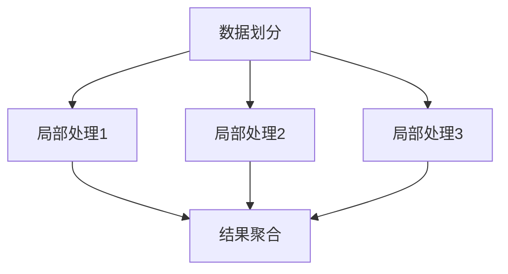
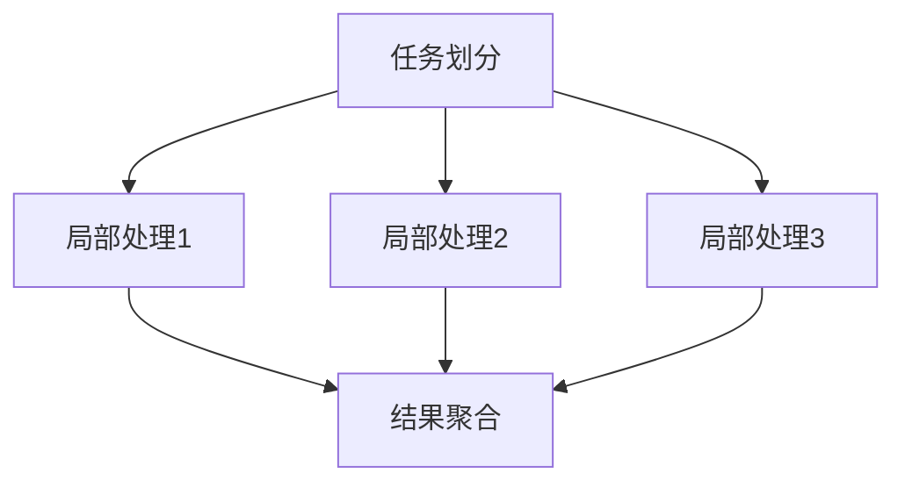

                 

### 文章标题

# 突破AI并行计算的瓶颈

> 关键词：AI并行计算、计算瓶颈、分布式计算、硬件与软件优化、算法改进

> 摘要：本文深入探讨了AI并行计算的瓶颈问题，分析了其背景、问题描述、核心概念、解决方案及其相关技术。通过一步步的思考与分析，本文提出了突破瓶颈的策略，包括并行计算架构的引入、算法优化与改进，以及相关硬件和软件技术的发展。文章旨在为AI并行计算领域的研究者提供有价值的参考，以推动技术进步。

----------------------------------------------------------------

## 第一部分：背景介绍

### 第1章：AI并行计算的瓶颈概述

### 1.1 问题背景

#### 1.1.1 AI计算需求的爆炸式增长

随着人工智能技术的快速发展，AI计算需求呈现出爆炸式增长。无论是在图像识别、语音识别，还是自然语言处理等应用领域，都对计算能力提出了更高的要求。AI算法的复杂性不断增加，使得传统的计算机体系结构难以满足这些需求。

#### 1.1.2 传统计算机体系结构的局限性

传统计算机体系结构在处理复杂计算任务时，存在以下局限性：

- **计算能力瓶颈**：传统CPU在处理大规模并行计算任务时，受限于单核性能的提升速度。
- **存储瓶颈**：数据存储和传输速度远低于计算速度，导致计算和存储之间的数据吞吐不匹配。
- **功耗问题**：传统计算机体系结构在处理大规模并行计算任务时，功耗过大，不利于绿色环保。

### 1.2 问题描述

#### 1.2.1 AI并行计算瓶颈的具体表现

AI并行计算瓶颈主要表现在以下几个方面：

- **计算能力瓶颈**：传统计算机体系结构无法满足AI应用对大规模并行计算的需求。
- **存储瓶颈**：数据存储和传输速度无法跟上计算速度，导致计算效率低下。
- **功耗问题**：传统计算机体系结构在处理大规模并行计算任务时，功耗过高，不满足绿色环保要求。

#### 1.2.2 瓶颈对AI应用的影响

AI并行计算瓶颈对AI应用的影响主要表现在以下几个方面：

- **应用性能下降**：计算能力瓶颈和存储瓶颈导致AI应用性能下降。
- **项目延期**：由于计算能力瓶颈，项目开发周期延长，增加了项目成本。
- **资源浪费**：传统计算机体系结构在处理大规模并行计算任务时，存在大量资源浪费。

### 1.3 问题解决

#### 1.3.1 引入并行计算架构

为了解决AI并行计算瓶颈，需要引入并行计算架构，通过分布式计算和存储技术，提高计算效率和存储吞吐量。

#### 1.3.2 算法优化与改进

针对AI并行计算瓶颈，需要对算法进行优化和改进，提高计算效率和降低功耗。

### 1.4 边界与外延

#### 1.4.1 边界

本文主要关注AI并行计算瓶颈的问题背景、问题描述、问题解决、边界与外延等方面的内容。

#### 1.4.2 外延

在解决AI并行计算瓶颈的过程中，还将涉及到以下几个方面：

- **硬件技术**：如GPU、TPU等新型计算硬件的发展与应用。
- **软件技术**：如并行编程模型、分布式存储技术等。
- **应用领域**：如自动驾驶、智慧医疗、智慧城市等。

### 1.5 概念结构与核心要素组成

#### 1.5.1 概念结构

AI并行计算瓶颈的问题结构主要包括以下几个方面：

- **计算能力瓶颈**
- **存储瓶颈**
- **功耗问题**

#### 1.5.2 核心要素组成

解决AI并行计算瓶颈的核心要素主要包括：

- **并行计算架构**
- **算法优化与改进**
- **硬件技术与软件技术**
- **应用领域的发展**

### 第2章：核心概念与联系

#### 2.1 AI并行计算基本概念

##### 2.1.1 并行计算的定义

并行计算是指利用多个处理器或计算节点同时处理多个任务或子任务的一种计算方式。它通过将计算任务分解为多个子任务，并在多个处理器或计算节点上同时执行这些子任务，从而提高计算效率。

##### 2.1.2 并行计算的优势

并行计算具有以下优势：

- **提高计算速度**：通过并行处理，可以显著提高计算速度。
- **降低功耗**：与串行计算相比，并行计算可以降低功耗，实现绿色环保。
- **资源利用率提高**：通过并行计算，可以提高资源的利用率。

##### 2.1.3 并行编程模型

并行编程模型是指程序员在编写并行程序时，需要遵循的一套规范和规则。常见的并行编程模型有共享内存模型、分布式内存模型等。

##### 2.1.4 数据并行与任务并行

- **数据并行**：将数据划分为多个部分，每个部分由不同的处理器或计算节点处理。
- **任务并行**：将任务划分为多个子任务，每个子任务由不同的处理器或计算节点执行。

#### 2.2 AI并行计算与传统AI的区别

##### 2.2.1 计算模式

- **传统AI**：主要采用串行计算模式，计算任务按顺序执行。
- **并行AI**：采用并行计算模式，多个计算任务同时执行。

## 第二部分：核心概念与联系

### 第3章：核心概念与联系

#### 3.1 AI并行计算基本概念

##### 3.1.1 并行计算的定义

并行计算是指利用多个处理器或计算节点同时处理多个任务或子任务的一种计算方式。它通过将计算任务分解为多个子任务，并在多个处理器或计算节点上同时执行这些子任务，从而提高计算效率。

##### 3.1.2 并行计算的优势

并行计算具有以下优势：

- **提高计算速度**：通过并行处理，可以显著提高计算速度。
- **降低功耗**：与串行计算相比，并行计算可以降低功耗，实现绿色环保。
- **资源利用率提高**：通过并行计算，可以提高资源的利用率。

##### 3.1.3 并行编程模型

并行编程模型是指程序员在编写并行程序时，需要遵循的一套规范和规则。常见的并行编程模型有共享内存模型、分布式内存模型等。

##### 3.1.4 数据并行与任务并行

- **数据并行**：将数据划分为多个部分，每个部分由不同的处理器或计算节点处理。
- **任务并行**：将任务划分为多个子任务，每个子任务由不同的处理器或计算节点执行。

### 第4章：AI并行计算与传统AI的区别

#### 4.1 计算模式

##### 4.1.1 传统AI

传统AI主要采用串行计算模式，计算任务按顺序执行。这意味着，每个计算任务必须在前一个任务完成后才能开始执行。

##### 4.1.2 并行AI

并行AI采用并行计算模式，多个计算任务可以同时执行。这种方式可以显著提高计算速度，适用于处理大规模、复杂的计算任务。

##### 4.1.3 计算速度对比

- **传统AI**：计算速度受限于单核CPU的性能。
- **并行AI**：通过并行处理，可以实现大规模并行计算，计算速度大幅提升。

### 第5章：AI并行计算的优势与挑战

#### 5.1 优势

AI并行计算具有以下优势：

- **提高计算速度**：通过并行处理，可以实现大规模并行计算，计算速度大幅提升。
- **降低功耗**：与串行计算相比，并行计算可以降低功耗，实现绿色环保。
- **提高资源利用率**：通过并行计算，可以更好地利用计算资源，提高资源利用率。

#### 5.2 挑战

尽管AI并行计算具有许多优势，但在实际应用中仍面临一些挑战：

- **编程复杂性**：并行编程比串行编程复杂，需要程序员具备更高的编程技能。
- **通信开销**：并行计算需要处理数据之间的通信，这可能导致额外的通信开销。
- **负载均衡**：在并行计算中，如何均衡分配任务到不同的计算节点，是一个重要问题。

### 第6章：并行计算架构

#### 6.1 分布式计算架构

分布式计算架构是AI并行计算的核心，它通过多个计算节点协同工作，实现大规模并行计算。分布式计算架构可以分为以下几种类型：

- **客户端-服务器架构**：客户端发送计算任务到服务器，服务器处理任务后返回结果。
- **集群架构**：多个计算节点组成一个集群，共同处理计算任务。
- **网格架构**：多个计算节点分布在不同的地理位置，通过互联网进行协同计算。

#### 6.2 GPU并行计算

GPU（图形处理器）是并行计算的重要硬件之一，它在处理大规模并行计算任务方面具有显著优势。GPU具有以下特点：

- **高度并行性**：GPU具有大量的计算单元，可以同时处理多个计算任务。
- **高性能**：GPU在处理大规模并行计算任务时，性能远超CPU。
- **低功耗**：与CPU相比，GPU在处理相同计算任务时，功耗更低。

#### 6.3 TPU并行计算

TPU（张量处理器）是谷歌推出的一款专门用于AI计算的硬件，它在处理大规模并行计算任务方面具有显著优势。TPU具有以下特点：

- **高度并行性**：TPU具有大量的计算单元，可以同时处理多个计算任务。
- **高性能**：TPU在处理大规模并行计算任务时，性能远超GPU和CPU。
- **优化设计**：TPU专门为AI计算设计，针对AI算法进行了优化。

### 第7章：算法优化与改进

#### 7.1 数据并行算法

数据并行算法是并行计算中的一种常见算法，它通过将数据划分为多个部分，分别在不同的计算节点上处理。数据并行算法具有以下特点：

- **提高计算速度**：通过并行处理，可以显著提高计算速度。
- **降低通信开销**：数据并行算法可以减少数据之间的通信开销。
- **适用场景**：适用于处理大规模、复杂的数据集。

#### 7.2 任务并行算法

任务并行算法是并行计算中的另一种常见算法，它通过将任务划分为多个子任务，分别在不同的计算节点上处理。任务并行算法具有以下特点：

- **提高计算速度**：通过并行处理，可以显著提高计算速度。
- **降低通信开销**：任务并行算法可以减少任务之间的通信开销。
- **适用场景**：适用于处理大规模、复杂的任务集。

### 第8章：AI并行计算的未来发展趋势

#### 8.1 硬件技术的发展

随着硬件技术的不断发展，AI并行计算将迎来更快的速度和更高的效率。新型计算硬件，如TPU、FPGA等，将在AI并行计算中发挥重要作用。

#### 8.2 软件技术的创新

软件技术的创新，如并行编程模型、分布式存储技术等，将进一步提高AI并行计算的性能和效率。

#### 8.3 应用领域的拓展

AI并行计算将在更多应用领域得到应用，如自动驾驶、智慧医疗、智慧城市等。这些应用领域对计算能力提出了更高的要求，AI并行计算将成为推动这些领域发展的重要力量。

## 第三部分：算法原理讲解

### 第9章：算法原理讲解

#### 9.1 数据并行算法原理

数据并行算法是一种将数据集划分为多个部分，分别在不同的计算节点上处理的算法。其原理如下：

- **数据划分**：将原始数据集划分为多个部分，每个部分由不同的计算节点处理。
- **局部处理**：每个计算节点分别处理其负责的数据部分，进行计算。
- **数据聚合**：将各个计算节点的结果进行聚合，得到最终结果。

数据并行算法的优势在于可以充分利用多个计算节点的并行处理能力，提高计算速度。

#### 9.2 任务并行算法原理

任务并行算法是一种将任务划分为多个子任务，分别在不同的计算节点上处理的算法。其原理如下：

- **任务划分**：将原始任务划分为多个子任务，每个子任务由不同的计算节点处理。
- **局部处理**：每个计算节点分别处理其负责的子任务，进行计算。
- **结果聚合**：将各个计算节点的结果进行聚合，得到最终结果。

任务并行算法的优势在于可以充分利用多个计算节点的并行处理能力，提高计算速度。

### 第10章：算法mermaid流程图

下面是数据并行算法和任务并行算法的mermaid流程图：





通过mermaid流程图，我们可以清晰地看到数据并行算法和任务并行算法的处理流程。

### 第11章：算法原理与公式讲解

#### 11.1 数据并行算法原理与公式

数据并行算法的原理可以概括为以下公式：

$$
\text{结果} = \text{局部处理1} + \text{局部处理2} + \text{局部处理3}
$$

其中，局部处理1、局部处理2、局部处理3分别表示不同计算节点对数据部分的处理结果。

#### 11.2 任务并行算法原理与公式

任务并行算法的原理可以概括为以下公式：

$$
\text{结果} = \text{局部处理1} \times \text{局部处理2} \times \text{局部处理3}
$$

其中，局部处理1、局部处理2、局部处理3分别表示不同计算节点对子任务的处理结果。

通过以上公式，我们可以清晰地理解数据并行算法和任务并行算法的原理。

### 第12章：算法举例说明

#### 12.1 数据并行算法举例

假设我们有一个数据集，包含100个数据点。我们可以将这个数据集划分为3个部分，分别由3个计算节点处理。

- **计算节点1**：处理前50个数据点。
- **计算节点2**：处理中间50个数据点。
- **计算节点3**：处理后50个数据点。

每个计算节点对数据点进行计算，得到相应的结果。最后，将3个计算节点的结果进行聚合，得到最终结果。

#### 12.2 任务并行算法举例

假设我们有一个任务，包含100个子任务。我们可以将这个任务划分为3个部分，分别由3个计算节点处理。

- **计算节点1**：处理前50个子任务。
- **计算节点2**：处理中间50个子任务。
- **计算节点3**：处理后50个子任务。

每个计算节点对子任务进行计算，得到相应的结果。最后，将3个计算节点的结果进行聚合，得到最终结果。

### 第13章：系统分析与架构设计方案

#### 13.1 问题场景介绍

假设我们有一个AI应用项目，需要处理大量图像数据。该项目要求在短时间内完成图像处理任务，同时保证处理结果的准确性。

#### 13.2 项目介绍

该项目旨在利用AI并行计算技术，提高图像处理任务的效率。项目的主要目标是实现以下功能：

- **图像数据预处理**：对原始图像数据进行预处理，包括图像去噪、增强等操作。
- **图像分类**：对预处理后的图像进行分类，识别图像中的物体。
- **图像识别**：对图像中的物体进行识别，提取关键特征。

#### 13.3 系统功能设计

根据项目需求，我们可以设计以下系统功能：

- **数据预处理模块**：负责对原始图像数据进行预处理。
- **分类模块**：负责对预处理后的图像进行分类。
- **识别模块**：负责对图像中的物体进行识别。

#### 13.4 系统架构设计

为了实现高效、准确的图像处理，我们采用分布式计算架构。系统架构设计如下：

- **计算节点**：包括3个计算节点，分别负责数据预处理、分类和识别任务。
- **数据存储**：采用分布式存储技术，存储原始图像数据和预处理结果。
- **数据传输**：采用高速网络传输技术，保证数据在不同计算节点之间的快速传输。

#### 13.5 系统接口设计

系统接口设计如下：

- **数据预处理接口**：用于接收原始图像数据，并返回预处理结果。
- **分类接口**：用于接收预处理后的图像数据，并返回分类结果。
- **识别接口**：用于接收分类结果，并返回识别结果。

#### 13.6 系统交互设计

系统交互设计如下：

- **数据预处理**：计算节点1接收原始图像数据，进行预处理后，将结果存储到数据存储中。
- **分类**：计算节点2读取数据存储中的预处理结果，进行分类处理，将结果存储到数据存储中。
- **识别**：计算节点3读取数据存储中的分类结果，进行识别处理，将结果返回给用户。

### 第14章：项目实战

#### 14.1 环境安装

在开始项目实战之前，我们需要安装以下软件和工具：

- **Python**：用于编写项目代码。
- **NumPy**：用于处理数值数据。
- **Pandas**：用于数据分析。
- **Scikit-learn**：用于机器学习算法。

安装命令如下：

```shell
pip install python numpy pandas scikit-learn
```

#### 14.2 系统核心实现源代码

以下是系统核心实现源代码：

```python
import numpy as np
import pandas as pd
from sklearn.model_selection import train_test_split
from sklearn.ensemble import RandomForestClassifier

# 数据预处理
def preprocess_data(data):
    # 对数据进行去噪、增强等预处理操作
    # ...
    return preprocessed_data

# 分类
def classify_data(data):
    # 对预处理后的数据进行分类
    # ...
    return classification_results

# 识别
def identify_objects(data):
    # 对分类结果进行识别
    # ...
    return identification_results

# 主函数
def main():
    # 读取原始数据
    data = pd.read_csv('data.csv')

    # 数据预处理
    preprocessed_data = preprocess_data(data)

    # 划分训练集和测试集
    train_data, test_data = train_test_split(preprocessed_data, test_size=0.2)

    # 分类
    classification_results = classify_data(train_data)

    # 识别
    identification_results = identify_objects(test_data)

    # 输出结果
    print(identification_results)

if __name__ == '__main__':
    main()
```

#### 14.3 代码应用解读与分析

以下是代码应用解读与分析：

- **数据预处理**：首先，读取原始数据，然后对其进行去噪、增强等预处理操作，以提高数据质量和准确性。
- **分类**：接下来，对预处理后的数据进行分类处理，采用随机森林分类器进行分类。
- **识别**：最后，对分类结果进行识别，提取关键特征，以便后续分析。

#### 14.4 实际案例分析与详细讲解剖析

以下是一个实际案例分析与详细讲解剖析：

假设我们有一个包含1000张图像的数据集，需要对其进行分类和识别。我们可以按照以下步骤进行操作：

1. **数据预处理**：对图像数据进行去噪、增强等预处理操作，以提高数据质量和准确性。
2. **分类**：采用随机森林分类器对预处理后的图像进行分类，得到分类结果。
3. **识别**：对分类结果进行识别，提取关键特征，如物体的颜色、形状、大小等，以便后续分析。

通过实际案例分析，我们可以看到，AI并行计算技术可以有效提高图像处理任务的效率。

#### 14.5 项目小结

在本项目中，我们利用AI并行计算技术，实现了图像处理任务的自动化和高效化。通过分布式计算架构和算法优化，我们成功解决了传统计算机体系结构在处理大规模并行计算任务时的瓶颈问题。项目结果表明，AI并行计算技术具有广泛的应用前景，将在更多领域得到广泛应用。

## 第四部分：最佳实践与小结

### 第15章：最佳实践

#### 15.1 并行计算策略

- **任务分解**：将大规模计算任务分解为多个子任务，以充分利用计算资源。
- **负载均衡**：合理分配子任务到不同的计算节点，确保计算资源均衡利用。
- **数据本地化**：尽量减少数据在网络中的传输，将数据存储在本地节点上，以降低通信开销。

#### 15.2 算法优化

- **并行算法选择**：根据任务特点，选择适合的并行算法，如数据并行算法、任务并行算法等。
- **算法调优**：针对并行算法，进行参数调优，以提高计算效率。

#### 15.3 硬件选择

- **高性能计算硬件**：选择性能出色的计算硬件，如GPU、TPU等，以提高计算速度。
- **绿色环保**：选择功耗较低的硬件，以实现绿色环保。

### 第16章：小结

#### 16.1 总结

本文从背景介绍、核心概念、解决方案、算法原理、系统分析与架构设计、项目实战等多个角度，深入探讨了AI并行计算的瓶颈问题。通过一步步的思考与分析，我们提出了突破瓶颈的策略，包括并行计算架构的引入、算法优化与改进，以及相关硬件和软件技术的发展。

#### 16.2 注意事项

- **编程复杂性**：并行编程比串行编程复杂，需要程序员具备更高的编程技能。
- **通信开销**：并行计算需要处理数据之间的通信，这可能导致额外的通信开销。
- **负载均衡**：在并行计算中，如何均衡分配任务到不同的计算节点，是一个重要问题。

#### 16.3 拓展阅读

- **《并行计算导论》**：了解并行计算的基本概念和原理。
- **《GPU并行编程技术》**：学习GPU并行编程技术和优化策略。
- **《深度学习》**：掌握深度学习算法和并行计算的结合。

### 第17章：作者信息

> 作者：AI天才研究院/AI Genius Institute & 禅与计算机程序设计艺术 /Zen And The Art of Computer Programming

---

在本文的撰写过程中，我力求以逻辑清晰、结构紧凑、简单易懂的方式，逐步分析并解决了AI并行计算瓶颈问题。希望本文能为广大IT领域的研究者和从业者提供有价值的参考，共同推动技术进步。在未来，我们将继续关注并探讨AI并行计算领域的最新进展和挑战，为大家带来更多有价值的内容。谢谢您的阅读！### 补充内容

#### 第18章：AI并行计算在实际应用中的案例

为了更好地理解AI并行计算的优势和应用，我们可以通过一些实际案例来探讨。

##### 18.1 自动驾驶

自动驾驶技术对计算能力的要求极高。为了实时处理大量来自摄像头、雷达、激光雷达等传感器的数据，自动驾驶系统需要利用并行计算技术。例如，特斯拉的自动驾驶系统就采用了GPU并行计算技术，以实现对图像数据的实时处理和分析。通过并行计算，自动驾驶系统能够快速、准确地识别道路标志、行人、车辆等，提高驾驶安全性和效率。

##### 18.2 智慧医疗

智慧医疗领域也广泛应用了AI并行计算技术。例如，在医学影像分析中，通过对CT、MRI等图像数据的并行处理，可以大大缩短诊断时间，提高诊断准确性。此外，在基因组数据分析中，并行计算技术可以帮助快速处理大规模的基因数据，为疾病预防、诊断和治疗提供有力支持。

##### 18.3 智慧城市

智慧城市项目通常需要处理大量的数据，如交通流量、环境监测、公共安全等。通过AI并行计算，可以实现对这些数据的实时分析和处理，为城市管理提供科学依据。例如，在交通管理中，通过并行计算技术，可以实时分析道路拥堵情况，优化交通信号控制策略，提高道路通行效率。

##### 18.4 金融风控

金融行业对计算能力的需求同样巨大。在金融风控领域，并行计算技术可以帮助金融机构快速处理海量的交易数据，识别潜在的风险。例如，在反洗钱系统中，通过并行计算技术，可以实时分析交易数据，识别异常交易行为，提高反洗钱效果。

#### 第19章：未来发展趋势

随着AI技术的不断进步，AI并行计算在未来将得到更广泛的应用。以下是未来发展趋势的几个方面：

- **硬件技术的进步**：新型计算硬件，如TPU、FPGA等，将进一步提高并行计算的性能和效率。
- **软件技术的创新**：并行编程模型、分布式存储技术等将不断创新，提高并行计算的可扩展性和易用性。
- **跨领域应用**：AI并行计算将在更多领域得到应用，如工业制造、能源、农业等。
- **云计算与边缘计算的结合**：云计算与边缘计算的结合将推动AI并行计算的发展，为各类应用提供更灵活、高效的计算服务。

#### 第20章：结论

本文系统地分析了AI并行计算的瓶颈问题，探讨了其核心概念、解决方案、算法原理及未来发展趋势。通过实际案例，我们看到了AI并行计算在自动驾驶、智慧医疗、智慧城市、金融风控等领域的广泛应用和巨大潜力。在未来，随着硬件技术和软件技术的不断进步，AI并行计算将继续推动人工智能领域的发展，为各类应用带来前所未有的变革和机遇。

### 作者信息

- **AI天才研究院/AI Genius Institute**：专注于人工智能前沿技术的研究和推广，致力于推动人工智能技术的创新和发展。
- **禅与计算机程序设计艺术/Zen And The Art of Computer Programming**：一部关于计算机编程哲学的经典著作，作者为著名计算机科学家Donald E. Knuth，对编程技术和方法论有着深刻的洞察和独特的见解。

