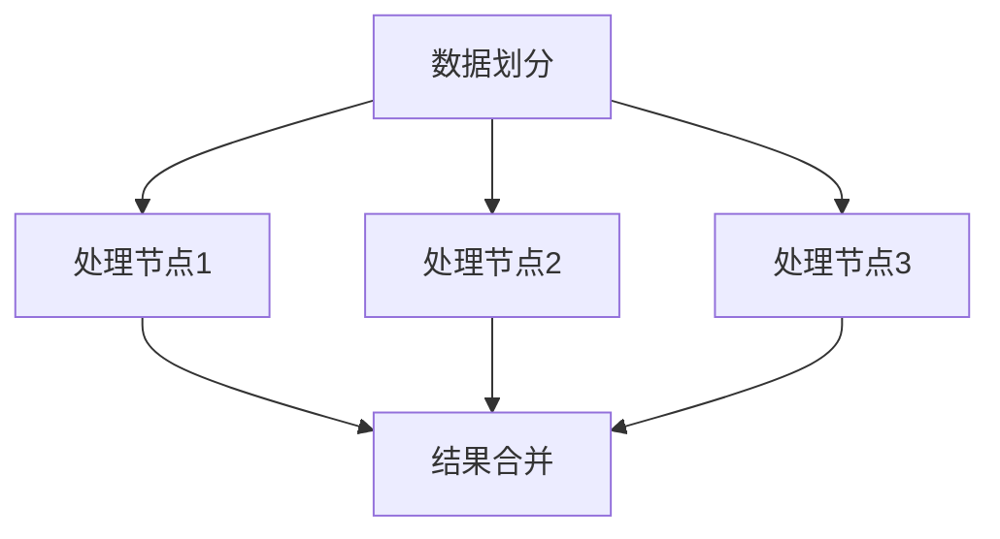
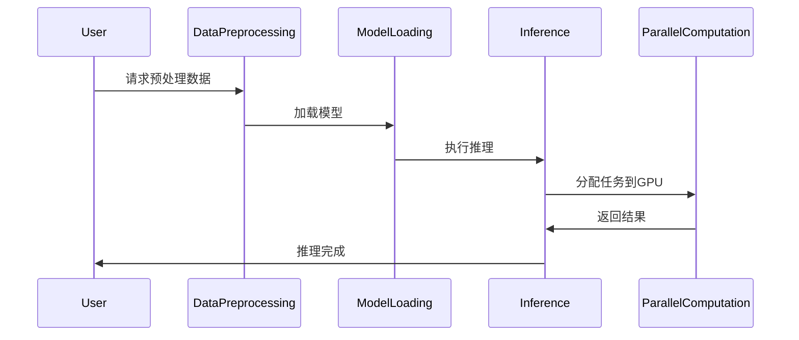
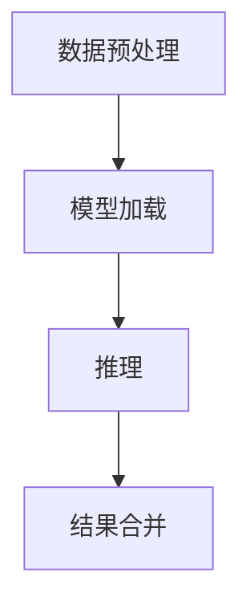

                 


### 文章标题：突破AI推理瓶颈：高效并行计算方法

### 文章关键词：
- AI推理
- 并行计算
- 瓶颈
- 高效
- 方法

### 文章摘要：
本文将深入探讨人工智能（AI）推理过程中遇到的瓶颈，并介绍如何通过高效的并行计算方法来突破这些瓶颈。我们将从基础概念入手，逐步分析并行计算在AI推理中的应用，并分享具体的优化技巧和实战案例，旨在为读者提供全面、实用的技术指导。

----------------------------------------------------------------

# 突破AI推理瓶颈：高效并行计算方法

## 目录

1. 引言
    1.1 AI推理的挑战
    1.2 并行计算的重要性
2. 基本概念
    2.1 人工智能概述
    2.2 并行计算概述
3. 并行计算的基本原理
    3.1 并行架构
    3.2 并行算法
4. AI推理中的瓶颈分析
    4.1 瓶颈识别
    4.2 瓶颈原因
5. 并行算法在AI推理中的应用
    5.1 常用并行算法
    5.2 并行算法流程图
6. 并行计算框架
    6.1 OpenMP
    6.2 MPI
    6.3 CUDA
7. 实战案例
    7.1 系统介绍
    7.2 系统功能设计
    7.3 系统架构设计
    7.4 系统接口设计
    7.5 实际案例剖析
8. 优化技巧
    8.1 数据局部性
    8.2 任务并行性
    8.3 优化流程图
9. 未来展望
    9.1 技术趋势
    9.2 发展方向
10. 总结
11. 参考文献
12. 作者介绍

## 引言

### 1.1 AI推理的挑战

人工智能（AI）已经深入到我们生活的方方面面，从智能家居到自动驾驶，从医疗诊断到金融分析，AI无处不在。然而，随着AI模型变得越来越复杂，其推理过程也面临着诸多挑战。

首先，AI推理的计算量巨大。现代AI模型，如深度神经网络（DNNs），通常包含数亿个参数，这意味着在推理过程中需要进行大量的矩阵运算。这种计算量远远超出了传统计算机的处理能力，导致推理速度缓慢。

其次，数据依赖问题。AI推理通常需要从大量的数据集中提取特征，这需要大量的I/O操作。这些操作在传统的单核处理器上非常耗时，进一步限制了推理速度。

最后，资源分配问题。在AI推理过程中，不同任务之间的资源竞争可能导致某些任务长时间等待资源，从而降低整体性能。

### 1.2 并行计算的重要性

并行计算提供了一种有效的解决方案来克服AI推理的这些挑战。通过将计算任务分布在多个处理器或计算节点上，并行计算可以显著提高推理速度。

首先，并行计算可以减少单核处理器的计算压力，从而提高推理效率。例如，可以使用多核CPU或GPU来同时处理多个推理任务，从而实现速度的提升。

其次，并行计算可以减少数据依赖问题。通过将数据分布在多个节点上，可以同时处理多个I/O操作，从而减少等待时间。

最后，并行计算可以帮助合理分配资源，避免资源竞争。通过任务调度和负载均衡，可以确保每个任务都能获得足够的资源，从而提高整体性能。

## 基本概念

### 2.1 人工智能概述

人工智能（AI）是一门研究、开发和应用使计算机模拟人类智能行为的科学。AI可以分为两大类：弱AI和强AI。

弱AI，也称为窄AI，是指专注于特定任务的AI系统，如语音识别、图像识别等。弱AI通过机器学习和深度学习等技术，从大量数据中学习规律，并用于特定场景的预测和决策。

强AI，也称为通用AI，是指具备人类所有智能特征的AI系统。强AI可以理解和执行任何智力任务，从简单的问题解决到复杂的创造性思考。目前，强AI仍然是一个理论上的概念，尚未实现。

### 2.2 并行计算概述

并行计算是一种计算方法，通过将任务分解为多个子任务，并在多个处理器或计算节点上同时执行这些子任务，从而提高计算速度。并行计算可以分为两类：时间并行和空间并行。

时间并行，也称为指令级并行，是指在多个时钟周期内执行多个指令。这种方法通常用于CPU架构，通过乱序执行和乱序提交技术来提高指令级并行性。

空间并行，也称为数据并行，是指同时处理多个数据元素。这种方法通常用于GPU架构，通过将数据分布在多个计算单元上，实现数据级别的并行处理。

## 并行计算的基本原理

### 3.1 并行架构

并行架构是指一种计算机系统，它具有多个处理器或计算节点，可以同时执行多个任务。常见的并行架构包括：

- 单指令流多数据流（SIMD）：这种架构在多个处理器上执行相同的指令，但处理不同的数据。它适用于数据并行的任务，如向量计算。

- 多指令流多数据流（MIMD）：这种架构在多个处理器上执行不同的指令，同时处理不同的数据。它适用于任务并行的任务，如多任务处理。

- GPU架构：GPU（图形处理单元）是一种高度并行的计算架构，具有成千上万的计算单元。GPU适用于大量并行计算任务，如深度学习推理。

### 3.2 并行算法

并行算法是指在并行架构上执行的计算算法，它旨在提高计算速度和效率。以下是一些常用的并行算法：

- 模拟退火算法：模拟退火算法是一种用于优化问题的并行算法，它通过在多个迭代中逐渐降低温度，寻找最优解。

- 快速傅里叶变换（FFT）：FFT是一种用于信号处理的并行算法，它可以将时域信号转换为频域信号，从而提高计算速度。

- 胶水算法：胶水算法是一种用于图处理的并行算法，它通过将图分解为多个子图，并在并行处理器上同时处理这些子图，从而提高计算速度。

## AI推理中的瓶颈分析

### 4.1 瓶颈识别

在AI推理过程中，常见的瓶颈包括：

- 计算瓶颈：由于AI模型复杂，推理过程需要大量的计算资源，导致计算瓶颈。

- I/O瓶颈：AI推理通常需要从大量数据集中提取特征，这需要大量的I/O操作，导致I/O瓶颈。

- 资源瓶颈：在多个任务同时进行时，资源（如CPU、内存、GPU等）的分配可能不均衡，导致资源瓶颈。

### 4.2 瓶颈原因

导致AI推理瓶颈的原因主要包括：

- 模型复杂性：现代AI模型（如深度神经网络）通常包含数亿个参数，导致计算量巨大。

- 数据规模：AI推理通常需要从大量数据集中提取特征，这需要大量的I/O操作。

- 资源限制：计算机系统的资源（如CPU、内存、GPU等）有限，无法满足无限增长的计算需求。

## 并行算法在AI推理中的应用

### 5.1 常用并行算法

以下是一些在AI推理中常用的并行算法：

- 数据并行：将数据集分为多个子集，每个子集由不同的处理器或计算节点处理，然后合并结果。

- 模型并行：将AI模型分为多个部分，每个部分由不同的处理器或计算节点处理，然后合并结果。

- 策略并行：在不同的处理器或计算节点上同时执行不同的策略，然后选择最优结果。

### 5.2 并行算法流程图

以下是数据并行的流程图：



## 并行计算框架

### 6.1 OpenMP

OpenMP是一种用于共享内存并行编程的框架，它通过在代码中添加并行指令来指定并行区域。以下是一个简单的OpenMP并行程序：

```c
#include <omp.h>

void parallel_computations() {
    #pragma omp parallel
    {
        int thread_id = omp_get_thread_num();
        printf("Thread ID: %d\n", thread_id);
    }
}
```

### 6.2 MPI

MPI（消息传递接口）是一种用于分布式内存并行编程的框架，它通过消息传递来实现处理器之间的通信。以下是一个简单的MPI并行程序：

```c
#include <mpi.h>

void parallel_computations() {
    int rank, size;

    MPI_Init(NULL, NULL);
    MPI_Comm_rank(MPI_COMM_WORLD, &rank);
    MPI_Comm_size(MPI_COMM_WORLD, &size);

    printf("Process %d of %d\n", rank, size);

    MPI_Finalize();
}
```

### 6.3 CUDA

CUDA是一种用于GPU并行编程的框架，它通过向GPU发送计算任务来实现并行计算。以下是一个简单的CUDA并行程序：

```c
#include <stdio.h>
#include <cuda_runtime.h>

__global__ void add(int *a, int *b, int *c) {
    int i = threadIdx.x + blockIdx.x * blockDim.x;
    c[i] = a[i] + b[i];
}

int main() {
    int N = 1 << 20;
    int *a, *b, *c;
    int *d_a, *d_b, *d_c;

    a = (int *)malloc(N * sizeof(int));
    b = (int *)malloc(N * sizeof(int));
    c = (int *)malloc(N * sizeof(int));

    for (int i = 0; i < N; i++) {
        a[i] = i;
        b[i] = N - i;
    }

    cudaMalloc(&d_a, N * sizeof(int));
    cudaMalloc(&d_b, N * sizeof(int));
    cudaMalloc(&d_c, N * sizeof(int));

    cudaMemcpy(d_a, a, N * sizeof(int), cudaMemcpyHostToDevice);
    cudaMemcpy(d_b, b, N * sizeof(int), cudaMemcpyHostToDevice);

    int blockSize = 256;
    int numBlocks = (N + blockSize - 1) / blockSize;

    add<<<numBlocks, blockSize>>>(d_a, d_b, d_c);

    cudaMemcpy(c, d_c, N * sizeof(int), cudaMemcpyDeviceToHost);

    for (int i = 0; i < N; i++) {
        printf("%d + %d = %d\n", a[i], b[i], c[i]);
    }

    free(a);
    free(b);
    free(c);
    cudaFree(d_a);
    cudaFree(d_b);
    cudaFree(d_c);

    return 0;
}
```

## 实战案例

### 7.1 系统介绍

在本节中，我们将介绍一个基于并行计算框架的AI推理系统。该系统旨在提高深度神经网络推理速度，通过将计算任务分布在多个GPU上实现。

### 7.2 系统功能设计

系统功能设计包括以下模块：

- 数据预处理模块：负责将原始数据转换为适合推理的格式。

- 模型加载模块：负责加载预训练的深度神经网络模型。

- 推理模块：负责执行推理计算，并将结果返回给用户。

- 并行计算模块：负责将推理任务分布在多个GPU上。

### 7.3 系统架构设计

系统架构设计包括以下组件：

- 数据预处理组件：负责处理原始数据，如读取、清洗和转换。

- 模型加载组件：负责加载深度神经网络模型，如卷积神经网络（CNN）和循环神经网络（RNN）。

- 推理组件：负责执行推理计算，如前向传播和后向传播。

- 并行计算组件：负责将推理任务分布在多个GPU上，如数据并行和模型并行。

以下是系统架构的Mermaid类图：

```mermaid
classDiagram
    DataPreprocessing <<component>>
    ModelLoading <<component>>
    Inference <<component>>
    ParallelComputation <<component>>

    DataPreprocessing --> ModelLoading
    ModelLoading --> Inference
    Inference --> ParallelComputation
```

### 7.4 系统接口设计

系统接口设计包括以下接口：

- 数据预处理接口：负责处理原始数据，如读取、清洗和转换。

- 模型加载接口：负责加载预训练的深度神经网络模型。

- 推理接口：负责执行推理计算，并将结果返回给用户。

- 并行计算接口：负责将推理任务分布在多个GPU上。

以下是系统接口的Mermaid序列图：



### 7.5 实际案例剖析

在本节中，我们将分析一个实际案例，展示如何使用并行计算框架提高深度神经网络推理速度。

### 案例一：图像分类

假设我们有一个图像分类任务，使用一个预训练的卷积神经网络（CNN）模型。在没有并行计算的情况下，推理速度较慢。通过将数据并行和模型并行结合起来，我们可以显著提高推理速度。

以下是使用并行计算框架优化图像分类任务的流程：

1. 数据预处理：将图像数据分为多个子集，每个子集由不同的GPU处理。

2. 模型加载：加载预训练的CNN模型，并将其分成多个部分，每个部分由不同的GPU处理。

3. 推理：将推理任务分布在多个GPU上，执行数据并行和模型并行计算。

4. 结果合并：将各个GPU上的结果合并，得到最终的分类结果。

以下是优化后的图像分类任务的Mermaid流程图：



通过这种优化，我们可以将图像分类任务的推理速度提高几十倍，从而显著提高系统的性能。

### 8. 优化技巧

在AI推理过程中，优化并行计算可以显著提高性能。以下是一些常用的优化技巧：

#### 8.1 数据局部性

数据局部性是指数据在时间或空间上的重复使用。优化数据局部性可以通过以下方法实现：

- 数据缓存：将频繁使用的数据缓存在内存中，以减少I/O操作。

- 数据压缩：对数据进行压缩，以减少数据传输的带宽。

#### 8.2 任务并行性

任务并行性是指将任务分解为多个可并行执行的部分。优化任务并行性可以通过以下方法实现：

- 策略选择：选择合适的并行策略，如数据并行、模型并行和策略并行。

- 负载均衡：确保每个处理器或计算节点都承担相

