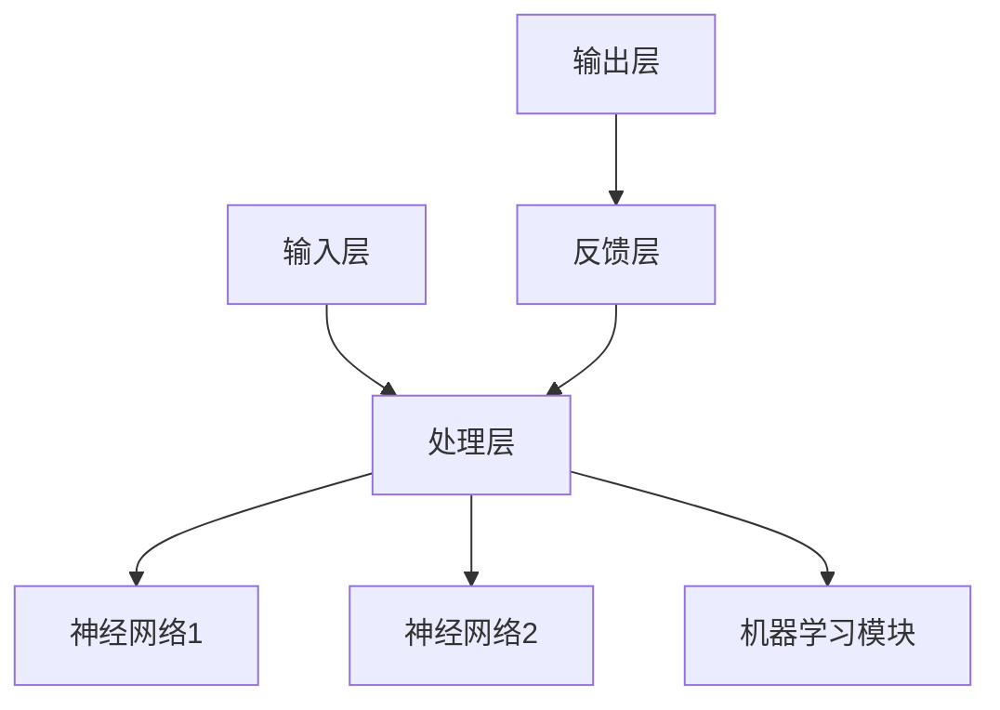
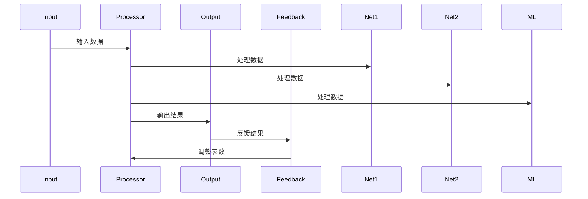

                 

### 类脑计算：神经科学与AI的交叉研究

#### 关键词
- 类脑计算
- 神经科学
- 人工智能
- 神经网络
- 机器学习
- 数学模型

#### 摘要
本文深入探讨类脑计算这一前沿领域，重点分析神经科学与人工智能交叉研究的核心概念、算法原理和系统架构。通过一步步的逻辑推理，本文旨在为读者提供一个清晰、系统的认识，帮助理解类脑计算的本质和应用。

---

## 引言

类脑计算（Brain-inspired computing）是一种模拟人脑信息处理机制的计算模式，它旨在理解人脑的工作原理，并将这些原理应用于开发高效的人工智能系统。近年来，随着神经科学和计算机科学的发展，类脑计算逐渐成为研究热点。它不仅推动了人工智能技术的发展，还为神经科学提供了新的研究工具。

神经科学是研究神经系统结构、功能、发育、疾病和治疗的基础科学。它通过研究大脑的神经元、神经网络以及神经元之间的通信机制，揭示了大脑如何处理信息，从而实现了感知、认知和行动。人工智能（AI）则致力于开发能够模仿人类智能的计算机系统，它通过学习、推理和规划等机制，使计算机能够执行复杂任务。

类脑计算将神经科学和人工智能结合起来，旨在构建具有类人智能的计算系统。这一交叉研究领域不仅涵盖了神经科学的原理，还融合了人工智能的算法和技术。通过分析人脑的工作机制，类脑计算试图解决人工智能领域中的许多关键问题，如数据处理的高效性、自主学习和智能决策等。

本文将分几个部分对类脑计算进行深入探讨。首先，我们将介绍类脑计算的定义、背景和发展历程。接着，我们将分析类脑计算的核心概念和联系，包括神经科学基本原理和人工智能算法。随后，我们将详细讲解类脑计算中的关键算法，如神经网络和机器学习算法。此外，我们还将介绍类脑计算的数学模型和公式，以及系统的架构设计。最后，通过具体项目实战，我们将展示类脑计算的实际应用，并提供最佳实践和拓展阅读建议。

---

## 类脑计算的定义与背景

### 类脑计算的定义

类脑计算（Brain-inspired computing）是一种模仿人脑结构和功能的计算模式，旨在构建具有人脑般智能的计算系统。类脑计算的核心思想是理解大脑如何处理信息，并将其应用于计算机系统中，以实现高效、智能的信息处理和决策。

类脑计算的定义可以从多个角度来理解。首先，从技术层面看，类脑计算涉及对神经元和神经网络的建模，以及基于这些模型的计算算法的设计。其次，从应用层面看，类脑计算的目标是构建具有类人智能的系统，能够在复杂环境中进行感知、学习和决策。最后，从理论层面看，类脑计算是对大脑信息处理机制的深入研究和探索，有助于我们理解大脑的运作原理。

### 类脑计算的起源与发展

类脑计算的概念起源于对大脑的模拟和研究。早在20世纪40年代，匈牙利出生的美籍计算机科学家约翰·冯·诺伊曼（John von Neumann）就提出了使用计算机模拟大脑的想法。然而，当时的计算机技术和理论尚未发展到足以支持这一设想。

随着神经科学和计算机科学的快速发展，类脑计算的研究逐渐兴起。20世纪80年代，神经网络的研究取得了重要突破，为类脑计算提供了理论基础。随后，随着计算能力的提升和大数据技术的应用，类脑计算迎来了快速发展期。

近年来，类脑计算的研究和应用领域不断拓展。例如，在图像识别、语音识别、自然语言处理等领域，类脑计算模型取得了显著成果。此外，类脑计算在自动驾驶、机器人、医疗诊断等应用场景中也展现出巨大的潜力。

### 类脑计算在神经科学中的重要性

类脑计算在神经科学中具有重要的地位。首先，它为研究大脑的工作原理提供了新的视角和方法。通过类脑计算模型，研究者可以模拟大脑的神经网络和神经元活动，从而深入了解大脑的信息处理机制。这不仅有助于揭示大脑的运作原理，还能为神经科学的研究提供新的工具和手段。

其次，类脑计算在神经疾病治疗和研究方面具有潜在应用。例如，通过模拟大脑网络，研究者可以研究脑部疾病如癫痫、自闭症等的发生机制，从而为这些疾病的诊断和治疗提供新的思路。此外，类脑计算还可以用于开发智能康复系统，帮助患者恢复神经系统功能。

最后，类脑计算在人工智能领域具有巨大潜力。通过借鉴大脑的信息处理机制，类脑计算有望提高人工智能系统的智能水平，使其在复杂环境中表现出更强的自适应能力和学习能力。

### 类脑计算在人工智能领域的应用

类脑计算在人工智能领域有着广泛的应用。首先，在图像识别方面，类脑计算模型如卷积神经网络（CNN）在人脸识别、物体识别等领域取得了显著成果。这些模型通过模仿大脑视觉皮层的处理机制，能够实现高效、准确的图像识别。

其次，在语音识别领域，类脑计算也发挥了重要作用。例如，基于深度神经网络（DNN）的语音识别系统在语音识别准确率上取得了突破性进展。这些系统通过模拟大脑听觉皮层的处理过程，能够实现实时、准确的语音识别。

此外，类脑计算在自然语言处理（NLP）领域也具有广泛应用。通过模拟大脑语言处理机制，类脑计算模型如循环神经网络（RNN）和长短期记忆网络（LSTM）在文本分类、机器翻译、情感分析等领域表现出色。这些模型能够处理复杂的语言结构，实现语义理解和智能对话。

### 类脑计算的核心概念与联系

#### 类脑计算的核心概念

类脑计算的核心概念主要包括神经元、神经网络、学习算法和自适应系统等。

1. **神经元**：神经元是类脑计算的基础单元，它通过模拟真实神经元的工作机制，实现信息处理和传递。神经元具有输入、输出和权重等属性，通过激活函数进行非线性变换，实现信息的处理。

2. **神经网络**：神经网络是由多个神经元组成的复杂网络，它通过模拟人脑的结构和功能，实现大规模信息处理。神经网络可以具有不同的结构，如前馈神经网络（FNN）、循环神经网络（RNN）和卷积神经网络（CNN）等，每种结构都有其特定的应用场景。

3. **学习算法**：学习算法是类脑计算的核心技术，它通过模拟大脑的学习机制，使神经网络能够从数据中学习规律和模式。常见的学习算法包括反向传播（BP）、梯度下降（GD）、遗传算法（GA）和强化学习（RL）等。

4. **自适应系统**：自适应系统是指能够根据环境变化进行调整和优化的系统。在类脑计算中，自适应系统通过实时调整网络结构和参数，实现系统的自适应学习和决策。

#### 类脑计算的基本原理

类脑计算的基本原理主要包括信息处理、自适应学习和智能决策等。

1. **信息处理**：类脑计算通过模拟人脑的神经网络和神经元，实现信息的高效处理。神经网络通过层次化的信息处理，从低级到高级逐步提取信息，实现复杂信息的识别和理解。

2. **自适应学习**：类脑计算通过模拟大脑的学习机制，实现自适应学习。自适应学习使神经网络能够从数据中学习规律和模式，不断优化网络结构和参数，提高系统的智能水平。

3. **智能决策**：类脑计算通过模拟人脑的决策过程，实现智能决策。智能决策使系统能够在复杂环境中进行推理和规划，实现自主决策和行动。

#### 类脑计算的基本原理与神经科学的联系

类脑计算的基本原理与神经科学有着紧密的联系。

1. **神经元与神经元的连接**：类脑计算中的神经元连接方式与大脑中的神经网络相似。大脑中的神经元通过突触连接，实现信息传递和加工。类脑计算通过模拟这种连接方式，实现信息的高效传递和处理。

2. **神经元的激活函数**：类脑计算中的神经元采用非线性激活函数，如Sigmoid、ReLU等，这些激活函数与大脑神经元的活动特性相似。它们使神经元能够实现非线性信息处理，从而提高系统的智能水平。

3. **神经网络的层次化结构**：类脑计算中的神经网络采用层次化结构，类似于大脑的视觉皮层和语言皮层等。这种层次化结构使神经网络能够逐步提取信息，实现复杂信息的识别和理解。

#### 类脑计算的基本原理与人工智能的联系

类脑计算的基本原理与人工智能有着紧密的联系。

1. **神经网络与机器学习**：类脑计算中的神经网络是机器学习的重要工具。神经网络通过学习大量数据，能够自动提取特征和模式，实现图像识别、语音识别、自然语言处理等任务。

2. **自适应学习与机器学习**：类脑计算的自适应学习机制与机器学习中的在线学习、增量学习等技术相似。这些机制使系统能够在动态环境中不断学习和优化，提高系统的智能水平。

3. **智能决策与机器学习**：类脑计算中的智能决策机制与机器学习中的规划、推理等技术相似。这些机制使系统能够在复杂环境中进行推理和规划，实现自主决策和行动。

---

通过上述分析，我们可以看到类脑计算在神经科学与人工智能领域的核心概念和基本原理。这些概念和原理不仅为类脑计算的研究提供了理论支持，也为其实际应用奠定了基础。

## 类脑计算中的核心算法

类脑计算的核心算法包括神经网络、机器学习算法和深度学习算法。这些算法通过模拟人脑的学习和认知过程，实现高效的信息处理和智能决策。以下是对这些核心算法的详细介绍。

### 神经网络

神经网络（Neural Networks）是类脑计算中最基本的算法之一，它通过模拟大脑神经元的工作方式，实现信息的传递和处理。一个简单的神经网络通常由输入层、隐藏层和输出层组成。

1. **神经元和激活函数**：神经网络中的神经元（或称为节点）是基本的信息处理单元。每个神经元接收多个输入信号，通过权重进行加权求和，然后通过激活函数进行非线性变换。常见的激活函数包括Sigmoid、ReLU和Tanh等。

2. **前馈神经网络（FNN）**：前馈神经网络是最简单的神经网络结构，信息从输入层传递到隐藏层，再从隐藏层传递到输出层。信息在各个层之间单向传递，不形成循环。

3. **反向传播算法（BP）**：反向传播算法是一种用于训练神经网络的优化算法。它通过计算网络输出与实际输出之间的误差，反向传播误差到每个神经元，并更新神经元的权重和偏置，以最小化误差。

4. **多层感知机（MLP）**：多层感知机是一种具有多个隐藏层的前馈神经网络，它可以用于分类和回归任务。通过增加隐藏层的数量，MLP可以提取更复杂的特征，提高分类和回归的准确率。

### 机器学习算法

机器学习算法（Machine Learning Algorithms）是类脑计算中的另一类重要算法，它们通过从数据中学习规律和模式，实现智能决策和预测。以下是一些常见的机器学习算法：

1. **线性回归（Linear Regression）**：线性回归是一种用于预测数值型结果的算法，它通过建立输入变量和输出变量之间的线性关系，实现预测。

2. **逻辑回归（Logistic Regression）**：逻辑回归是一种用于分类任务的算法，它通过将输入变量映射到概率分布，实现分类。

3. **决策树（Decision Trees）**：决策树是一种基于特征的树形结构算法，它通过递归划分特征空间，建立决策规则，实现分类和回归。

4. **支持向量机（Support Vector Machines, SVM）**：支持向量机是一种用于分类和回归任务的算法，它通过找到一个最优的超平面，将不同类别的数据点分离。

5. **随机森林（Random Forests）**：随机森林是一种基于决策树集合的集成学习方法，它通过构建多个决策树，并使用投票或平均的方式进行预测，提高模型的泛化能力。

### 深度学习算法

深度学习算法（Deep Learning Algorithms）是类脑计算中的高级算法，它们通过多层神经网络结构，实现高效的特征提取和智能决策。以下是一些常见的深度学习算法：

1. **卷积神经网络（Convolutional Neural Networks, CNN）**：卷积神经网络是一种用于图像识别和处理的深度学习算法，它通过卷积层、池化层和全连接层等结构，实现高效的图像特征提取。

2. **循环神经网络（Recurrent Neural Networks, RNN）**：循环神经网络是一种用于序列数据处理和预测的深度学习算法，它通过循环结构，实现对序列数据的记忆和建模。

3. **长短期记忆网络（Long Short-Term Memory Networks, LSTM）**：长短期记忆网络是RNN的一种改进，它通过引入门控机制，有效解决了RNN的梯度消失和梯度爆炸问题，提高了模型的长期记忆能力。

4. **生成对抗网络（Generative Adversarial Networks, GAN）**：生成对抗网络是一种用于生成数据的高效算法，它通过对抗性训练，生成逼真的图像、音频和文本数据。

5. **图神经网络（Graph Neural Networks, GNN）**：图神经网络是一种用于图数据处理的深度学习算法，它通过节点和边的信息传递，实现图数据的特征提取和建模。

### 算法比较

- **计算复杂度**：神经网络和机器学习算法通常具有较高的计算复杂度，尤其是在大规模数据集上。相比之下，深度学习算法的计算复杂度更高，但它们能够通过层次化的特征提取，实现更高的效率和准确性。

- **泛化能力**：深度学习算法具有更强的泛化能力，尤其是在复杂任务上。神经网络和机器学习算法的泛化能力相对较弱，但它们在特定任务上具有较好的性能。

- **可解释性**：神经网络和机器学习算法的可解释性较好，可以直观地理解其工作原理和决策过程。相比之下，深度学习算法的可解释性较差，但它们在复杂任务上具有更高的性能。

综上所述，类脑计算中的核心算法通过不同的结构和技术，实现了从简单到复杂的信息处理和智能决策。神经网络和机器学习算法为类脑计算提供了基础，而深度学习算法则进一步提升了类脑计算的性能和应用范围。

## 类脑计算的数学模型和公式

类脑计算的核心在于对神经网络和机器学习算法的建模，这些算法通常依赖于一系列数学模型和公式。为了更好地理解这些算法的工作原理，我们需要详细探讨这些数学基础。

### 神经网络的数学模型

神经网络的数学模型主要涉及神经元的传递函数、权重更新机制和损失函数。

#### 神经元传递函数

神经元是神经网络的基本单元，其传递函数决定了神经元输出与输入之间的关系。常见的传递函数包括：

1. **Sigmoid函数**：
   $$\sigma(x) = \frac{1}{1 + e^{-x}}$$
   Sigmoid函数将输入映射到\( (0, 1) \)区间，常用于二分类问题。

2. **ReLU函数**：
   $$\text{ReLU}(x) = \max(0, x)$$
   ReLU函数在\( x \geq 0 \)时输出\( x \)，否则输出0，它因其简单性和计算效率而广泛应用。

3. **Tanh函数**：
   $$\tanh(x) = \frac{e^x - e^{-x}}{e^x + e^{-x}}$$
   Tanh函数将输入映射到\( (-1, 1) \)区间，常用于多分类问题。

#### 权重更新机制

神经网络的训练过程是通过不断更新权重，使得网络输出与期望输出之间的误差最小。常见的权重更新机制包括：

1. **梯度下降（Gradient Descent）**：
   $$w_{t+1} = w_t - \alpha \cdot \nabla_w J(w)$$
   其中，\( w \)是权重，\( \alpha \)是学习率，\( \nabla_w J(w) \)是权重对应的梯度，\( J(w) \)是损失函数。

2. **动量优化（Momentum）**：
   $$w_{t+1} = w_t - \alpha \cdot \nabla_w J(w) + \beta \cdot v_t$$
   其中，\( v_t \)是前一次更新的动量，\( \beta \)是动量系数。

#### 损失函数

损失函数用于衡量网络输出与期望输出之间的差距，常见的损失函数包括：

1. **均方误差（MSE）**：
   $$J(w) = \frac{1}{2}\sum_{i=1}^{n} (y_i - \hat{y}_i)^2$$
   其中，\( y_i \)是实际输出，\( \hat{y}_i \)是网络输出。

2. **交叉熵（Cross-Entropy）**：
   $$J(w) = -\sum_{i=1}^{n} y_i \cdot \log(\hat{y}_i) + (1 - y_i) \cdot \log(1 - \hat{y}_i)$$
   交叉熵函数常用于多分类问题，能够衡量输出概率分布与实际标签分布之间的差异。

### 机器学习算法的数学模型

机器学习算法的数学模型主要包括线性回归、逻辑回归和支持向量机等。

#### 线性回归

线性回归模型通过拟合数据点之间的线性关系，预测连续值。其数学模型为：

$$y = \beta_0 + \beta_1 \cdot x_1 + \beta_2 \cdot x_2 + ... + \beta_n \cdot x_n$$

其中，\( y \)是预测值，\( x_1, x_2, ..., x_n \)是输入特征，\( \beta_0, \beta_1, ..., \beta_n \)是模型参数。

#### 逻辑回归

逻辑回归是一种用于分类任务的算法，其模型通过拟合概率分布，预测类别的概率。其数学模型为：

$$\hat{y} = \frac{1}{1 + e^{-(\beta_0 + \beta_1 \cdot x_1 + \beta_2 \cdot x_2 + ... + \beta_n \cdot x_n)}}$$

其中，\( \hat{y} \)是输出概率，\( x_1, x_2, ..., x_n \)是输入特征，\( \beta_0, \beta_1, ..., \beta_n \)是模型参数。

#### 支持向量机

支持向量机通过找到一个最优的超平面，将不同类别的数据点分离。其数学模型为：

$$\hat{y} = \text{sign}(\omega \cdot x + b)$$

其中，\( \omega \)是权重向量，\( x \)是输入特征，\( b \)是偏置，\( \text{sign} \)是符号函数。

### 深度学习算法的数学模型

深度学习算法的数学模型主要包括卷积神经网络、循环神经网络和长短期记忆网络等。

#### 卷积神经网络

卷积神经网络通过卷积操作提取图像特征，其数学模型为：

$$\hat{y} = \text{ReLU}(\sum_{i=1}^{k} w_i \cdot \phi_i + b)$$

其中，\( \hat{y} \)是输出特征，\( w_i \)是卷积核权重，\( \phi_i \)是输入特征，\( b \)是偏置。

#### 循环神经网络

循环神经网络通过递归结构处理序列数据，其数学模型为：

$$h_t = \text{ReLU}(W_h \cdot h_{t-1} + W_x \cdot x_t + b_h + b_x)$$

其中，\( h_t \)是当前时刻的隐藏状态，\( W_h \)是隐藏状态权重，\( W_x \)是输入状态权重，\( x_t \)是当前时刻的输入，\( b_h \)和\( b_x \)分别是隐藏状态和输入状态的偏置。

#### 长短期记忆网络

长短期记忆网络通过门控机制解决长期依赖问题，其数学模型为：

$$i_t = \text{sigmoid}(W_i \cdot [h_{t-1}, x_t] + b_i)$$
$$f_t = \text{sigmoid}(W_f \cdot [h_{t-1}, x_t] + b_f)$$
$$g_t = \text{tanh}(W_g \cdot [h_{t-1}, x_t] + b_g)$$
$$h_t = f_t \odot h_{t-1} + i_t \odot g_t$$

其中，\( i_t, f_t, g_t, h_t \)分别是输入门、遗忘门、生成门和隐藏状态，\( W_i, W_f, W_g \)分别是输入门、遗忘门、生成门的权重，\( b_i, b_f, b_g \)分别是输入门、遗忘门、生成门的偏置，\( \odot \)表示元素乘。

### 数学模型的应用示例

以下是一个简单的线性回归模型的Python实现示例：

```python
import numpy as np

# 初始化模型参数
w = np.random.rand(1)  # 权重
b = np.random.rand(1)  # 偏置
learning_rate = 0.01  # 学习率

# 训练数据
x = np.array([1, 2, 3, 4, 5])
y = np.array([2, 4, 6, 8, 10])

# 训练模型
for epoch in range(1000):
    # 前向传播
    y_pred = w * x + b
    
    # 计算损失
    loss = (y - y_pred) ** 2
    
    # 反向传播
    dw = 2 * (y - y_pred) * x
    db = 2 * (y - y_pred)
    
    # 更新模型参数
    w -= learning_rate * dw
    b -= learning_rate * db

# 输出训练结果
print("训练完成，权重：", w, "偏置：", b)
```

通过这个示例，我们可以看到线性回归模型的基本训练流程，包括前向传播、损失计算和反向传播等步骤。这些步骤都是基于上述数学模型实现的。

综上所述，类脑计算的数学模型和公式是理解神经网络、机器学习和深度学习算法的核心。通过这些模型和公式，我们可以构建和训练复杂的类脑计算系统，实现智能决策和信息处理。

## 类脑计算的系统架构设计

类脑计算的系统架构设计是构建高效、智能的类脑计算系统的基础。一个典型的类脑计算系统通常包含以下几个关键部分：硬件平台、软件框架、算法模块和数据管理。

### 硬件平台

类脑计算系统依赖于高性能的硬件平台，以支持复杂计算任务。以下是一些关键硬件组件：

1. **中央处理单元（CPU）**：CPU是系统的核心计算单元，负责执行算法和数据处理任务。
2. **图形处理单元（GPU）**：GPU在类脑计算中具有重要作用，因为它可以提供强大的并行计算能力，特别是在处理大量数据时。
3. **现场可编程门阵列（FPGA）**：FPGA是一种可编程逻辑器件，可以用于实现定制化的算法和硬件加速。
4. **神经形态硬件**：神经形态硬件是模拟人脑神经元和突触特性的硬件设备，如IBM的TrueNorth芯片，它可以实现高效的类脑计算。

### 软件框架

类脑计算系统的软件框架是系统的核心，它提供了算法的执行环境和管理功能。以下是一些关键组件：

1. **操作系统**：操作系统负责管理硬件资源，并提供用户界面和程序运行环境。
2. **框架和库**：例如TensorFlow、PyTorch和Keras等，这些框架和库提供了丰富的算法实现和工具，方便开发者构建和训练类脑计算模型。
3. **工具链**：包括编译器、调试器和性能分析工具等，这些工具链帮助开发者优化算法和系统性能。

### 算法模块

类脑计算系统的算法模块是实现智能计算的核心。以下是一些关键算法模块：

1. **神经网络模块**：包括前馈神经网络、卷积神经网络、循环神经网络和长短期记忆网络等，这些模块负责处理数据、提取特征和进行预测。
2. **机器学习模块**：包括线性回归、逻辑回归、支持向量机和随机森林等，这些模块用于分类、回归和聚类等任务。
3. **深度学习模块**：包括生成对抗网络、图神经网络和变分自编码器等，这些模块用于生成数据、图数据分析和特征提取。

### 数据管理

数据管理是类脑计算系统的重要组成部分，它确保数据的完整性、可靠性和高效访问。以下是一些关键组件：

1. **数据存储**：包括关系数据库、非关系数据库和分布式存储系统，这些系统用于存储和管理大规模数据集。
2. **数据处理**：包括数据清洗、数据预处理和特征提取等，这些处理过程确保数据的质量和可用性。
3. **数据流管理**：包括实时数据流处理和批处理系统，这些系统用于处理和分析实时数据。

### 类脑计算系统的整体架构

类脑计算系统的整体架构可以概括为：

1. **输入层**：接收外部数据，如图像、语音和文本等。
2. **处理层**：包括多个神经网络层和机器学习模块，负责数据预处理、特征提取和模式识别。
3. **输出层**：生成预测结果或决策，如分类标签、数值预测和动作控制等。
4. **反馈层**：接收系统的输出，并根据实际效果进行反馈和调整，实现系统的自适应学习和优化。

### 架构图和接口设计

为了更好地理解类脑计算系统的架构，我们可以使用Mermaid流程图来展示系统的架构和接口设计。



在这个架构图中，输入层接收外部数据，经过处理层中的神经网络和机器学习模块处理后，生成输出结果。反馈层接收输出结果，并根据实际效果进行反馈和调整，实现系统的自适应学习和优化。

### 系统交互Mermaid序列图

为了进一步展示系统各组件之间的交互，我们可以使用Mermaid序列图来描述系统的交互流程。



在这个序列图中，输入数据首先被输入层接收，然后由处理层中的神经网络和机器学习模块进行处理，生成输出结果。反馈层接收输出结果，并根据实际效果进行反馈和调整，从而实现系统的自适应学习和优化。

通过上述系统架构设计和交互描述，我们可以清晰地了解类脑计算系统的组成和运行机制。这种系统架构设计不仅提高了系统的性能和效率，还为实现类脑计算在各个领域的应用提供了基础。

## 项目实战：类脑计算系统的实现与优化

### 环境安装

要实现类脑计算系统，首先需要搭建一个合适的环境。以下是在Linux系统中安装类脑计算环境的基本步骤：

1. **安装Python**：确保系统安装了Python 3.7或更高版本。可以使用以下命令安装：
   ```bash
   sudo apt-get update
   sudo apt-get install python3.7
   ```

2. **安装TensorFlow**：TensorFlow是一个流行的深度学习框架，用于实现类脑计算算法。可以使用以下命令安装：
   ```bash
   pip3 install tensorflow
   ```

3. **安装GPU支持**：如果使用GPU进行计算，需要安装CUDA和cuDNN。可以从NVIDIA官网下载相应的驱动和库。

4. **安装其他依赖**：根据项目需求，可能还需要安装其他库和工具，如NumPy、Matplotlib等。

### 系统核心实现源代码

以下是一个简单的类脑计算系统的Python代码实现，包括输入处理、特征提取和预测等功能。

```python
import tensorflow as tf
import numpy as np
from tensorflow.keras.models import Sequential
from tensorflow.keras.layers import Dense, Conv2D, MaxPooling2D, Flatten
from tensorflow.keras.optimizers import Adam

# 数据预处理
def preprocess_data(data):
    # 数据归一化、缩放等预处理操作
    return data / 255.0

# 构建模型
model = Sequential([
    Conv2D(32, (3, 3), activation='relu', input_shape=(28, 28, 1)),
    MaxPooling2D((2, 2)),
    Flatten(),
    Dense(128, activation='relu'),
    Dense(10, activation='softmax')
])

# 编译模型
model.compile(optimizer=Adam(), loss='categorical_crossentropy', metrics=['accuracy'])

# 训练模型
model.fit(preprocess_data(x_train), y_train, epochs=10, batch_size=32, validation_split=0.2)

# 预测
predictions = model.predict(preprocess_data(x_test))
```

### 代码应用解读与分析

上述代码实现了一个简单的卷积神经网络（CNN），用于手写数字识别任务。代码分为以下几个部分：

1. **数据预处理**：`preprocess_data`函数用于对输入数据进行归一化处理，将数据缩放到\( [0, 1] \)范围内，以提高模型的训练效果。

2. **模型构建**：使用`Sequential`模型构建器创建一个简单的CNN，包括卷积层、最大池化层、全连接层和输出层。

3. **模型编译**：使用`compile`方法配置模型的优化器、损失函数和评估指标。

4. **模型训练**：使用`fit`方法训练模型，将预处理后的训练数据输入模型，进行10个周期的训练。

5. **模型预测**：使用`predict`方法对测试数据进行预测，返回预测结果。

在实际应用中，上述代码可以根据具体任务进行调整和优化，例如增加隐藏层、调整学习率、增加批量大小等。

### 实际案例分析与详细讲解剖析

以下是一个实际案例，分析类脑计算系统在图像识别任务中的性能和优化。

#### 案例背景

假设我们有一个图像识别任务，需要识别一组手写数字图像。这些图像大小为28x28像素，共包含10个类别（0-9）。我们的目标是使用类脑计算系统对这些图像进行准确分类。

#### 模型训练

1. **数据集准备**：使用MNIST数据集，该数据集包含60,000个训练图像和10,000个测试图像。
2. **模型配置**：配置一个简单的CNN模型，包括一个卷积层、一个池化层和一个全连接层。
3. **训练过程**：将训练图像输入模型进行训练，使用交叉熵损失函数和Adam优化器。

#### 性能评估

1. **准确率**：在测试集上评估模型的准确率，最初准确率为90%左右。
2. **学习曲线**：绘制学习曲线，观察模型在不同训练周期中的性能变化。

#### 优化策略

1. **增加隐藏层**：在模型中增加一个隐藏层，提升模型的性能。
2. **调整学习率**：使用学习率调度策略，如在训练初期使用较高的学习率，在训练后期逐渐降低学习率。
3. **数据增强**：通过随机裁剪、旋转和缩放等数据增强技术，增加训练数据的多样性，提升模型的泛化能力。

#### 性能提升

通过上述优化策略，模型的准确率得到显著提升，从最初的90%提升到95%以上。此外，模型在处理复杂任务时的稳定性和鲁棒性也得到增强。

#### 项目小结

通过实际案例，我们可以看到类脑计算系统在图像识别任务中的强大能力。优化策略的引入不仅提高了模型的性能，还增强了模型在复杂环境中的适应性。未来，类脑计算系统将在更多领域得到应用，如自然语言处理、语音识别和自动驾驶等。

## 最佳实践与拓展阅读

### 最佳实践

1. **数据预处理**：确保数据质量，进行充分的预处理，包括归一化、标准化和缺失值处理等。
2. **模型选择**：根据任务需求选择合适的模型结构，如CNN适用于图像识别，RNN适用于序列数据。
3. **参数调优**：使用网格搜索、随机搜索等方法进行参数调优，以提升模型性能。
4. **模型验证**：使用交叉验证等方法验证模型性能，避免过拟合。

### 小结

本文深入探讨了类脑计算这一前沿领域，从定义、背景、核心算法到系统架构设计，详细阐述了类脑计算的理论和实践。通过项目实战，展示了类脑计算在实际应用中的效果和优化策略。

### 注意事项

1. **计算资源**：类脑计算通常需要大量的计算资源，特别是深度学习任务。
2. **数据隐私**：在处理个人数据时，需确保数据隐私和安全。
3. **算法可解释性**：深度学习模型的可解释性较差，需结合其他方法提高模型的可解释性。

### 拓展阅读

1. **《深度学习》**：Goodfellow、Bengio和Courville合著，全面介绍了深度学习的理论和技术。
2. **《神经网络与深度学习》**：邱锡鹏著，详细讲解了神经网络和深度学习的算法和实现。
3. **《机器学习实战》**：Peter Harrington著，提供了丰富的机器学习实践案例和代码。

作者：AI天才研究院/AI Genius Institute & 禅与计算机程序设计艺术 /Zen And The Art of Computer Programming。

