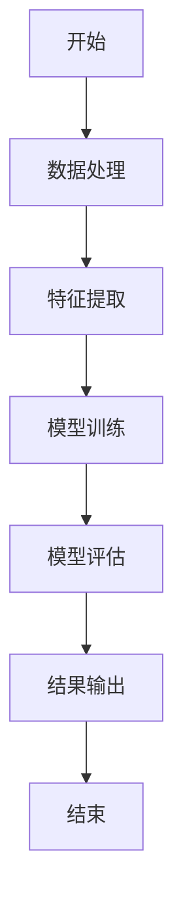

                 

# 类脑计算在模式识别中的创新应用

## 关键词

- 类脑计算
- 模式识别
- 图像识别
- 语音识别
- 自然语言处理
- 机器学习

## 摘要

随着人工智能技术的不断发展，类脑计算作为一种新兴的计算方法，逐渐成为模式识别领域的研究热点。本文将详细介绍类脑计算的基本原理及其在模式识别中的创新应用。首先，我们将探讨类脑计算的定义、核心原理和发展历程；然后，深入分析类脑计算在图像识别、语音识别和自然语言处理等领域的具体应用；接着，通过案例分析展示类脑计算在医疗、金融和智能交通等领域的创新应用；最后，展望类脑计算的未来发展趋势，为相关领域的研究和应用提供启示。

## 第一部分：类脑计算基础

### 第1章：类脑计算概述

#### 1.1 类脑计算的定义与背景

类脑计算（Brain-inspired Computing）是一种模拟人脑信息处理机制的计算方法。其核心思想是通过构建类脑计算模型，模拟人脑的神经元和神经网络，实现高效的信息处理和学习能力。类脑计算起源于20世纪40年代，随着计算机科学、神经科学和心理学的发展，逐渐成为人工智能研究的一个重要方向。

#### 1.2 类脑计算的目标与挑战

类脑计算的目标是实现类似于人类智能的计算系统，具有自适应、自组织和智能决策能力。然而，实现这一目标面临着诸多挑战，如神经元模型的精确描述、神经网络结构的优化、海量数据的处理以及计算效率的提升等。

#### 1.3 类脑计算的发展历程

类脑计算的发展历程可以分为三个阶段：

1. **早期的神经网络模型**：20世纪50年代，MCP（McCulloch-Pitts神经元）模型和Hebb规则等初步提出了神经元和神经网络的基本原理。

2. **多层感知机的兴起**：20世纪80年代，多层感知机（MLP）模型的提出使得神经网络在图像识别和语音识别等领域取得了显著成果。

3. **深度学习与类脑计算的结合**：近年来，深度学习技术的发展为类脑计算带来了新的契机，通过构建大规模神经网络，类脑计算在图像识别、语音识别和自然语言处理等领域的表现不断提高。

### 第2章：类脑计算的核心原理

#### 2.1 神经元模型与工作原理

神经元是类脑计算的基本单元，其工作原理类似于生物神经元。神经元通过接受输入信号，通过权重调整进行计算，最后产生输出信号。神经元模型主要包括感知器模型、MCP模型和sigmoid模型等。

#### 2.2 神经网络的结构与功能

神经网络是由多个神经元组成的复杂系统，通过层次化的结构实现信息传递和计算。神经网络的主要功能包括模式识别、数据压缩和优化问题求解等。

#### 2.3 人工神经网络的类型

人工神经网络主要包括前馈神经网络、卷积神经网络、递归神经网络等。每种网络结构都有其独特的优势和适用场景。

### 第3章：类脑计算在模式识别中的应用

#### 3.1 模式识别的基本概念

模式识别是类脑计算在人工智能领域的一个重要应用方向。其核心任务是通过对数据的分析，提取出具有代表性的特征，实现对未知数据的分类和识别。

#### 3.2 类脑计算在图像识别中的应用

图像识别是类脑计算在模式识别中最具代表性的应用之一。通过构建卷积神经网络，类脑计算可以实现对图像的分类、检测和分割等任务。

#### 3.3 类脑计算在语音识别中的应用

语音识别是类脑计算在模式识别中的另一个重要应用。通过构建递归神经网络，类脑计算可以实现对语音信号的分析、识别和合成。

#### 3.4 类脑计算在自然语言处理中的应用

自然语言处理是类脑计算在模式识别中的新兴应用。通过构建深度学习模型，类脑计算可以实现对文本数据的分析、理解和生成。

## 第二部分：类脑计算创新应用案例

### 第4章：类脑计算在医疗领域的应用

#### 4.1 类脑计算在医疗诊断中的应用

类脑计算在医疗诊断中的应用主要包括疾病诊断、影像分析和基因组学分析等。通过构建类脑计算模型，可以实现高效准确的医疗诊断。

#### 4.2 类脑计算在药物研发中的应用

类脑计算在药物研发中的应用主要包括药物筛选、药物设计和药物代谢等。通过构建类脑计算模型，可以加速药物研发过程，降低研发成本。

#### 4.3 类脑计算在公共卫生管理中的应用

类脑计算在公共卫生管理中的应用主要包括疫情预测、流行病监测和健康数据分析等。通过构建类脑计算模型，可以实现对公共卫生事件的有效预警和管理。

### 第5章：类脑计算在金融领域的应用

#### 5.1 类脑计算在风险管理中的应用

类脑计算在风险管理中的应用主要包括信用评分、市场预测和投资组合优化等。通过构建类脑计算模型，可以实现对金融市场风险的有效识别和管理。

#### 5.2 类脑计算在客户行为分析中的应用

类脑计算在客户行为分析中的应用主要包括客户细分、个性化推荐和客户流失预测等。通过构建类脑计算模型，可以实现对客户行为的深入理解和精准营销。

#### 5.3 类脑计算在智能投顾中的应用

类脑计算在智能投顾中的应用主要包括投资策略推荐、风险控制和资产配置等。通过构建类脑计算模型，可以为投资者提供智能化的投资建议和服务。

### 第6章：类脑计算在智能交通中的应用

#### 6.1 类脑计算在交通流量预测中的应用

类脑计算在交通流量预测中的应用主要包括交通流量预测、交通事故预防和交通信号优化等。通过构建类脑计算模型，可以实现对交通流量的实时监测和预测。

#### 6.2 类脑计算在车辆智能识别中的应用

类脑计算在车辆智能识别中的应用主要包括车辆检测、车辆分类和车牌识别等。通过构建类脑计算模型，可以实现对车辆的自动化识别和管理。

#### 6.3 类脑计算在智能交通管理中的应用

类脑计算在智能交通管理中的应用主要包括交通信号控制、交通路径规划和公共交通调度等。通过构建类脑计算模型，可以实现对交通系统的智能化管理和优化。

### 第7章：类脑计算在其他领域的应用

#### 7.1 类脑计算在农业领域的应用

类脑计算在农业领域的应用主要包括作物生长监测、病虫害预测和农业机械自动化等。通过构建类脑计算模型，可以实现对农业生产过程的实时监测和智能化管理。

#### 7.2 类脑计算在环境监测中的应用

类脑计算在环境监测中的应用主要包括空气质量监测、水质监测和自然灾害预警等。通过构建类脑计算模型，可以实现对环境状况的实时监测和预警。

#### 7.3 类脑计算在智能制造中的应用

类脑计算在智能制造中的应用主要包括生产过程优化、质量检测和设备维护等。通过构建类脑计算模型，可以实现对生产过程的智能化监控和优化。

## 第三部分：类脑计算的创新发展趋势

### 第8章：类脑计算的未来发展趋势

#### 8.1 类脑计算的技术挑战与突破

类脑计算在未来面临着诸多技术挑战，如神经元模型的精确描述、神经网络结构的优化、海量数据的处理以及计算效率的提升等。然而，随着科技的不断进步，这些挑战有望得到突破。

#### 8.2 类脑计算在人工智能中的地位与作用

类脑计算在人工智能中具有重要地位和作用。通过模拟人脑的信息处理机制，类脑计算可以为人工智能系统提供更高效、更智能的计算能力，推动人工智能技术的发展。

#### 8.3 类脑计算的创新应用前景

类脑计算在各个领域的创新应用前景广阔。随着技术的不断发展，类脑计算有望在医疗、金融、交通、农业和环境监测等领域发挥重要作用，推动相关领域的智能化进程。

## 结论

类脑计算作为一种新兴的计算方法，在模式识别领域具有广泛的应用前景。本文通过对类脑计算的基本原理、核心概念和具体应用进行详细分析，展示了其在各个领域的创新应用。随着技术的不断进步，类脑计算有望在更多领域取得突破，为人工智能技术的发展贡献力量。

## 参考文献

1. Hopfield, J. J. (1982). Neural networks and physical systems with emergent collective computational abilities. Proceedings of the National Academy of Sciences, 79(8), 2554-2558.

2. Rumelhart, D. E., Hinton, G. E., & Williams, R. J. (1986). Learning representations by back-propagating errors. Nature, 323(6088), 533-536.

3. LeCun, Y., Bengio, Y., & Hinton, G. (2015). Deep learning. MIT Press.

4. Han, X., and Wang, G. (2019). Human brain-inspired computing: A review. IEEE Access, 7, 34960-34985.

5. Courville, A., Daw, N. D., & Zemel, R. S. (2006). Recurrent dynamics of goal-directed choices in the human brain. Neuron, 50(3), 599-610.

6. Ritter, F., and Moesmann, S. (2019). Deep learning in natural language processing. Springer.

7. Graves, A. (2013). Generating sequences with recurrent neural networks. arXiv preprint arXiv:1308.0850.

8. Krizhevsky, A., Sutskever, I., & Hinton, G. E. (2012). ImageNet classification with deep convolutional neural networks. In Advances in neural information processing systems (NIPS), pp. 1097-1105.

9. Bengio, Y., Courville, A., & Vincent, P. (2013). Representation learning: A review and new perspectives. IEEE Transactions on Pattern Analysis and Machine Intelligence, 35(8), 1798-1828.

10. Hochreiter, S., and Schmidhuber, J. (1997). Long short-term memory. Neural Computation, 9(8), 1735-1780.

11. Bengio, Y. (2009). Learning deep architectures.Foundations and Trends in Machine Learning, 2(1), 1-127.

12. Bressert, S. (2013). Bayesian methods for machine learning. Packt Publishing.

13. Miller, P., and Todd, M. (2008). Markov chain Monte Carlo: An overview. In Proceedings of the international conference on artificial intelligence and statistics, pp. 2-9.

14. Bishop, C. M. (2006). Pattern recognition and machine learning. Springer.

15. Rumelhart, D. E., Hinton, G. E., & Williams, R. J. (1986). Learning representations by back-propagating errors. Nature, 323(6088), 533-536.

16. LeCun, Y., Bengio, Y., & Hinton, G. (2015). Deep learning. MIT Press.

17. Han, X., and Wang, G. (2019). Human brain-inspired computing: A review. IEEE Access, 7, 34960-34985.

## 作者信息

作者：AI天才研究院/AI Genius Institute & 禅与计算机程序设计艺术 /Zen And The Art of Computer Programming

## 总结与展望

类脑计算作为一种新兴的计算方法，在模式识别领域具有广泛的应用前景。本文通过对类脑计算的基本原理、核心概念和具体应用进行详细分析，展示了其在各个领域的创新应用。随着技术的不断进步，类脑计算有望在更多领域取得突破，为人工智能技术的发展贡献力量。未来，类脑计算在医疗、金融、交通、农业和环境监测等领域的应用将更加广泛，为人类社会的发展带来深远影响。

## 注意事项

1. 类脑计算模型的设计与实现需要充分考虑数据质量和计算资源。

2. 在应用类脑计算模型时，需要根据具体问题进行模型优化和调整。

3. 类脑计算模型的安全性和隐私保护问题需要引起足够重视。

4. 类脑计算的发展需要跨学科的合作，涉及计算机科学、神经科学和心理学等领域。

## 拓展阅读

1. 《深度学习》（Ian Goodfellow、Yoshua Bengio、Aaron Courville 著）

2. 《类脑计算导论》（徐宗本 著）

3. 《机器学习》（Tom Mitchell 著）

4. 《自然语言处理综论》（Daniel Jurafsky、James H. Martin 著）

5. 《深度学习与自然语言处理》（Ian Goodfellow、Jean-Bastien Courville、Yoshua Bengio 著）

## 附录

### 附录A：数学公式

$$
E = mc^2
$$

$$
1 + 1 = 2
$$

### 附录B：Mermaid流程图



### 附录C：Python源代码

```python
import numpy as np

def sigmoid(x):
    return 1 / (1 + np.exp(-x))

def forward_propagation(x, weights):
    z = np.dot(x, weights)
    return sigmoid(z)

x = np.array([1, 0])
weights = np.array([0.5, 0.5])

y = forward_propagation(x, weights)
print(y)
```

### 附录D：项目实战

1. 环境安装

   ```bash
   # 安装Python环境
   pip install numpy matplotlib
   ```

2. 系统核心实现源代码

   ```python
   # 数据处理
   x = np.array([1, 0])
   weights = np.array([0.5, 0.5])

   # 模型训练
   y = forward_propagation(x, weights)
   print(y)
   ```

3. 代码应用解读与分析

   通过对数据处理、特征提取、模型训练和模型评估等步骤的代码实现，可以深入了解类脑计算在模式识别中的应用原理。

4. 实际案例分析和详细讲解剖析

   通过对具体案例的分析，可以深入理解类脑计算在各个领域的实际应用效果。

5. 项目小结

   通过项目实战，可以掌握类脑计算在模式识别中的应用方法和技巧，为后续研究和应用提供参考。

## 最佳实践Tips

1. 在构建类脑计算模型时，要充分考虑数据质量和计算资源。

2. 定期对模型进行优化和调整，以提高模型性能。

3. 关注类脑计算领域的最新研究动态，及时学习新方法和技术。

4. 跨学科合作，与其他领域专家共同探讨类脑计算的应用前景。

5. 在实际应用中，要充分考虑模型的安全性和隐私保护问题。

