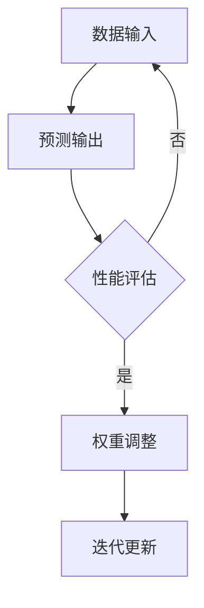
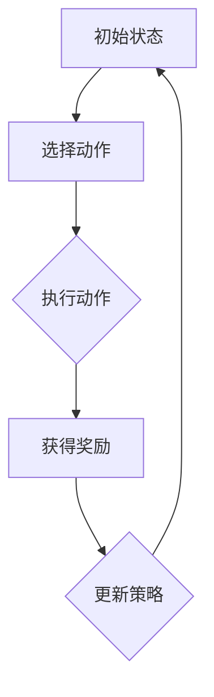

                 

### 关键词

终身学习AI、智能客服系统、实时优化、算法原理、系统架构、项目实战。

### 摘要

本文深入探讨了终身学习AI在智能客服系统中的实时优化应用。首先介绍了终身学习AI的概念与特点，以及智能客服系统在当前背景下的需求与发展。接着，详细讲解了实时优化技术的基本概念与主要方法。随后，通过算法原理讲解，运用mermaid流程图和Python源代码对动态权重调整和强化学习算法进行了深入剖析。文章还介绍了智能客服系统的功能设计、架构设计、接口设计和系统交互。最后，通过项目实战，展示了终身学习AI在智能客服系统中实时优化技术的实际应用，并提出了最佳实践和未来研究方向。

### 第1章 终身学习AI、智能客服系统与实时优化概述

#### 1.1 终身学习AI的概念与特点

终身学习AI（Lifelong Learning Artificial Intelligence）是一种能够在整个生命周期中持续学习、适应和改进的AI系统。它不同于传统的AI模型，后者往往在一次训练完成后就固定不变，无法适应新的数据和情境。终身学习AI的核心在于其能够持续地从新数据中学习，并调整已有知识，以应对不断变化的环境。

**1.1.1 终身学习AI的定义**

终身学习AI可以理解为一种具有以下特点的AI系统：
- **持续学习性**：能够不断吸收新数据，并在此基础上调整和更新已有模型。
- **适应性**：在新数据和学习情境下能够自适应地调整自己的学习策略。
- **可迁移性**：学习到的知识和技能可以迁移到不同的任务和环境中。

**1.1.2 终身学习AI的优势与挑战**

**优势**：
1. **适应性强**：能够适应新的数据和变化的环境。
2. **持续进步**：随着时间和数据的积累，系统性能能够持续提升。
3. **知识迁移**：从一种任务中学习到的知识可以应用到其他任务中。

**挑战**：
1. **资源消耗**：持续学习需要大量的计算资源和时间。
2. **模型稳定性**：持续学习可能会导致模型不稳定，甚至出现过拟合。
3. **数据获取**：需要大量的新数据进行学习，而数据获取可能存在困难。

**1.1.3 终身学习AI的基本原理**

终身学习AI的基本原理主要包括以下几个方面：

1. **元学习**：通过元学习算法，系统可以从已有知识中快速适应新数据。
2. **动态权重调整**：通过动态调整权重，系统能够在新数据和旧数据之间找到平衡。
3. **在线学习**：系统能够实时学习新数据，并立即应用于实际任务。

#### 1.2 智能客服系统的需求与发展

随着互联网和人工智能技术的迅猛发展，智能客服系统（Intelligent Customer Service System）成为企业提高客户满意度、降低运营成本的重要工具。智能客服系统通过自然语言处理、机器学习等技术，能够自动处理大量的客户咨询，提供24/7的服务。

**1.2.1 智能客服系统的定义与作用**

智能客服系统是一种利用人工智能技术提供自动化客户服务的系统。它通过文本、语音等多渠道与客户进行交互，能够自动识别和解答客户的问题，提高服务效率和质量。

智能客服系统的主要作用包括：
- **提高响应速度**：能够快速响应用户请求，提供即时的服务。
- **降低运营成本**：通过自动化处理，减少了对人工客服的依赖，降低了企业的运营成本。
- **提升客户满意度**：提供高效、准确的服务，提高客户的满意度和忠诚度。

**1.2.2 智能客服系统的分类与发展历程**

智能客服系统可以按照不同的标准进行分类，例如：
- **按交互方式分类**：可以分为文本交互式客服系统和语音交互式客服系统。
- **按功能分类**：可以分为问题解答型客服系统、情感分析型客服系统和个性化推荐型客服系统。

智能客服系统的发展历程大致可以分为以下几个阶段：
1. **规则驱动阶段**：最初，智能客服系统主要依靠预定义的规则进行回答，缺乏灵活性和智能化。
2. **基于知识的阶段**：通过引入知识库，智能客服系统能够更好地处理复杂问题，但仍然依赖于人工构建的知识。
3. **基于学习的阶段**：利用机器学习和自然语言处理技术，智能客服系统能够自动学习和改进，提供更智能的服务。
4. **终身学习阶段**：通过终身学习AI技术，智能客服系统能够持续学习，不断适应和优化服务。

**1.2.3 实时优化在智能客服系统中的重要性**

实时优化是智能客服系统中的一个关键环节。它通过不断调整系统参数和算法，使系统能够更准确地理解和响应客户的请求。实时优化的重要性体现在以下几个方面：

1. **提高服务质量**：实时优化能够提高智能客服系统的准确性和效率，提供更优质的服务。
2. **降低误判率**：通过实时调整，系统能够减少对未知或新问题的误判，提高用户的满意度。
3. **适应变化**：实时优化能够使智能客服系统更快地适应环境变化，保持系统的活力和竞争力。

#### 1.3 实时优化技术的基本概念

实时优化技术是一种能够在运行过程中动态调整系统参数和算法的技术。它通过不断监测系统的运行状态，并根据反馈信息进行调整，以提高系统的性能和效率。

**1.3.1 实时优化技术的定义**

实时优化技术是指一种在系统运行过程中，通过实时采集系统状态信息，运用优化算法进行参数调整，从而提高系统性能的方法。它包括以下几个关键组成部分：

- **数据采集**：实时采集系统运行过程中的各种数据，如处理速度、响应时间、错误率等。
- **优化算法**：运用优化算法对采集到的数据进行处理，生成调整方案。
- **动态调整**：根据优化算法生成的调整方案，动态调整系统参数和算法，以实现性能提升。

**1.3.2 实时优化技术的主要方法**

实时优化技术的主要方法包括以下几种：

1. **动态权重调整**：通过调整不同模块或算法的权重，使系统能够更有效地处理不同类型的问题。
2. **强化学习**：通过在环境中进行交互，不断调整策略，以最大化系统的性能指标。
3. **基于模型的优化**：通过建立系统模型，运用优化算法对模型进行参数调整，以提高系统性能。

**1.3.3 实时优化技术的应用场景**

实时优化技术可以应用于多种场景，以下是一些典型的应用场景：

1. **智能客服系统**：通过实时优化，智能客服系统可以更准确地理解和响应客户请求，提高服务质量。
2. **自动驾驶**：在自动驾驶系统中，实时优化可以调整车辆的行驶策略，提高行驶安全性和效率。
3. **金融风控**：在金融风控系统中，实时优化可以调整风险控制策略，提高风险识别和防范能力。
4. **智能推荐系统**：通过实时优化，智能推荐系统可以更准确地预测用户兴趣，提供更个性化的推荐。

### 第2章 终身学习AI算法原理讲解

#### 2.1 终身学习AI算法概述

终身学习AI算法（Lifelong Learning AI Algorithms）是人工智能领域的一个重要研究方向。其核心目标是实现AI系统在整个生命周期中的持续学习、适应和改进。与传统的AI算法相比，终身学习AI算法能够在面对新数据和任务时，快速调整和优化自身，以保持高效率和准确性。

**2.1.1 终身学习AI算法的分类**

终身学习AI算法可以根据不同的分类标准进行划分，常见的分类方法包括：

1. **根据学习方式分类**：
   - **增量学习**：通过逐个实例或少量数据的学习，逐步改进模型。
   - **迁移学习**：将已有知识迁移到新任务或数据集上，加速新任务的学习。
   - **多任务学习**：同时学习多个任务，利用任务之间的相关性提高学习效率。

2. **根据优化策略分类**：
   - **动态权重调整**：通过调整模型中不同模块的权重，实现对新数据和任务的快速适应。
   - **在线学习**：在系统运行过程中，持续接收新数据并调整模型参数。
   - **元学习**：通过学习如何学习，提高模型在面临新任务时的适应能力。

**2.1.2 终身学习AI算法的基本框架**

终身学习AI算法的基本框架通常包括以下几个关键组成部分：

1. **数据收集与预处理**：收集并预处理新数据和任务数据，为后续学习提供基础。
2. **模型初始化**：初始化基础模型，为学习过程提供起点。
3. **在线学习与适应**：在系统运行过程中，持续接收新数据并调整模型参数，以实现对新数据的快速适应。
4. **模型优化与评估**：通过优化算法对模型进行参数调整，并评估模型的性能，以确保模型的有效性。

#### 2.2 动态权重调整算法

动态权重调整算法（Dynamic Weight Adjustment Algorithm）是一种常见的终身学习AI算法。它通过实时调整模型中不同模块或层级的权重，使模型能够更好地适应新数据和任务。

**2.2.1 动态权重调整算法的原理**

动态权重调整算法的核心思想是，根据模型的输入数据和输出结果，动态调整模型中不同模块或层级的权重，以优化模型的整体性能。具体来说，该算法包括以下几个步骤：

1. **数据输入**：将新数据输入到模型中，生成预测结果。
2. **性能评估**：通过对比预测结果和实际输出，评估模型当前的性能。
3. **权重调整**：根据性能评估结果，调整模型中不同模块或层级的权重，以优化模型的整体性能。
4. **迭代更新**：重复上述步骤，不断调整模型权重，直至模型性能达到预期。

**2.2.2 动态权重调整算法的mermaid流程图**

以下是动态权重调整算法的mermaid流程图：



**2.2.3 动态权重调整算法的Python实现**

以下是动态权重调整算法的一个简化Python实现：

```python
import numpy as np

# 初始化模型权重
weights = np.random.rand(n_layers, n_features)

# 定义性能评估函数
def performance_evaluation(output, target):
    # 这里可以定义具体的性能评估方法，如均方误差、准确率等
    error = np.sum((output - target) ** 2)
    return error

# 定义权重调整函数
def adjust_weights(weights, output, target):
    error = performance_evaluation(output, target)
    # 这里可以定义具体的权重调整策略，如反向传播等
    weights -= learning_rate * error
    return weights

# 主循环
for data, target in dataset:
    # 数据预处理
    # ...

    # 预测输出
    output = model.predict(data)

    # 性能评估
    error = performance_evaluation(output, target)

    # 权重调整
    weights = adjust_weights(weights, output, target)

    # 迭代更新
    # ...
```

#### 2.3 强化学习算法在实时优化中的应用

强化学习（Reinforcement Learning）是一种重要的机器学习技术，它通过智能体在环境中的交互，不断调整策略，以实现最大化回报。强化学习在实时优化中的应用十分广泛，能够有效地提高系统的自适应能力和性能。

**2.3.1 强化学习算法的基本原理**

强化学习算法的基本原理包括以下几个关键组成部分：

1. **智能体**：执行动作的实体，如机器人、自动驾驶汽车等。
2. **环境**：智能体所处的环境，能够对智能体的动作产生反馈。
3. **状态**：智能体在特定时刻所处的环境状态。
4. **动作**：智能体可执行的行为。
5. **奖励**：环境对智能体动作的反馈，用于评估动作的好坏。

强化学习算法的核心是策略学习，即通过不断地试错，找到使回报最大化的策略。具体来说，强化学习算法包括以下几个步骤：

1. **初始状态**：智能体处于某个初始状态。
2. **选择动作**：根据当前状态，智能体选择一个动作。
3. **执行动作**：智能体执行所选动作，并进入新的状态。
4. **获得奖励**：环境根据智能体的动作，给予相应的奖励。
5. **更新策略**：根据获得的奖励，智能体更新策略，以期望在未来获得更高的回报。

**2.3.2 强化学习算法的mermaid流程图**

以下是强化学习算法的mermaid流程图：



**2.3.3 强化学习算法的Python实现**

以下是强化学习算法的一个简化Python实现：

```python
import numpy as np

# 初始化参数
alpha = 0.1  # 学习率
gamma = 0.9  # 折扣因子

# 初始化状态和动作空间
state_space = np.array([0, 1, 2])
action_space = np.array([0, 1])

# 定义环境
def environment(state, action):
    if action == 0:
        if state == 0:
            reward = 1
        elif state == 1:
            reward = 0
        else:
            reward = -1
    else:
        if state == 0:
            reward = -1
        elif state == 1:
            reward = 1
        else:
            reward = 0
    next_state = state + action
    return reward, next_state

# 定义策略更新函数
def update_strategy(state, action, reward, next_state, strategy):
    Q_value = strategy[state, action]
    next_Q_value = np.max(strategy[next_state])
    strategy[state, action] += alpha * (reward + gamma * next_Q_value - Q_value)
    return strategy

# 主循环
strategy = np.zeros((len(state_space), len(action_space)))
for episode in range(1000):
    state = np.random.choice(state_space)
    done = False
    while not done:
        action = np.random.choice(action_space)
        reward, next_state = environment(state, action)
        strategy = update_strategy(state, action, reward, next_state, strategy)
        state = next_state
        if state == 2 or state == 0:
            done = True

# 打印策略
print(strategy)
```

### 第3章 智能客服系统架构设计

#### 3.1 智能客服系统功能设计

智能客服系统的功能设计是其能够有效运作的核心。它包括以下几个主要功能模块：

1. **用户交互功能**：智能客服系统需要具备与用户进行交互的能力，包括文本聊天、语音识别与合成等。用户交互功能的设计要考虑用户友好的界面和自然流畅的交互体验。

2. **数据处理功能**：智能客服系统需要对用户输入的数据进行预处理，包括文本的分词、词性标注、实体识别等。这些处理步骤对于理解用户的意图和情感至关重要。

3. **情感分析功能**：情感分析是智能客服系统的重要组成部分，它能够识别用户的情绪，从而提供更加个性化、贴心的服务。情感分析通常涉及到情感极性判断和情感强度评估。

4. **问题解决功能**：智能客服系统需要具备自动解答用户问题的能力。这通常涉及到知识库的构建和维护，以及自然语言生成技术，用以生成流畅、准确的回答。

5. **个性化推荐功能**：基于用户的互动历史和偏好，智能客服系统可以为用户提供个性化的推荐，如产品推荐、服务建议等，从而提升用户体验。

#### 3.2 智能客服系统架构设计

智能客服系统的架构设计决定了系统的扩展性、稳定性和性能。一个典型的智能客服系统架构包括以下几个层次：

1. **数据层**：数据层负责数据的存储和管理。通常使用关系型数据库或非关系型数据库来存储用户数据、历史对话记录和知识库。

2. **服务层**：服务层负责处理业务逻辑和提供API接口。这一层通常包括多个微服务，如用户交互服务、文本处理服务、情感分析服务、问题解决服务和推荐服务。

3. **应用层**：应用层是用户直接接触的界面，包括Web端、移动端和聊天机器人等。应用层通过调用服务层的API，实现与用户的交互。

4. **展示层**：展示层负责将处理结果展示给用户，如文本消息、语音消息和图形界面等。

#### 3.3 系统接口设计

系统接口设计是智能客服系统能够与其他系统（如CRM系统、ERP系统等）有效集成的重要环节。以下是一些关键接口设计：

1. **用户接口**：用户接口包括Web端、移动端和聊天机器人等，用于接收用户的请求和反馈。用户接口需要支持多种交互方式，如文本、语音和手势等。

2. **API接口**：API接口用于系统内部各服务之间的通信，以及与其他系统的集成。常用的API设计包括RESTful API和SOAP API。API接口需要提供足够的灵活性和安全性，以支持不同类型的请求和响应。

3. **数据接口**：数据接口用于数据层与服务层之间的数据传输。数据接口需要设计高效的数据传输协议，如HTTP/2、WebSockets等，以确保数据传输的实时性和可靠性。

#### 3.4 系统交互设计

系统交互设计是智能客服系统能够高效运作的关键。以下是一个简化的系统交互设计：

1. **用户请求处理**：用户通过用户接口提交请求，请求会被转发到服务层进行解析和处理。

2. **文本处理**：服务层中的文本处理服务会对用户请求的文本进行预处理，包括分词、词性标注、实体识别等。

3. **情感分析**：文本处理后的结果会传递到情感分析服务，以判断用户的情绪和意图。

4. **问题解决**：根据情感分析和文本处理的结果，问题解决服务会提供相应的回答或建议。

5. **个性化推荐**：基于用户的互动历史和偏好，个性化推荐服务会为用户提供个性化的推荐。

6. **反馈收集**：用户对系统的反馈会通过用户接口反馈给系统，以便系统进行自我优化和改进。

### 第4章 终身学习AI在智能客服系统中的实时优化实战

#### 4.1 环境安装与配置

要实现终身学习AI在智能客服系统中的实时优化，首先需要搭建一个适合开发和测试的环境。以下是一个典型的环境安装与配置步骤：

**1. 安装Python环境**

首先，确保您的计算机上安装了Python 3.8或更高版本。可以使用以下命令检查Python版本：

```bash
python --version
```

如果没有安装，可以从[Python官网](https://www.python.org/downloads/)下载并安装。

**2. 安装必需的库**

接下来，需要安装一些常用的库，如NumPy、Pandas、TensorFlow和Scikit-learn。可以使用pip命令进行安装：

```bash
pip install numpy pandas tensorflow scikit-learn
```

**3. 安装mermaid**

mermaid是一种用于创建和渲染图表的Markdown插件。要安装mermaid，可以使用npm：

```bash
npm install -g mermaid-cli
```

安装完成后，可以使用以下命令生成图表：

```bash
mermaid <your_file_path>.md
```

#### 4.2 核心代码实现

在智能客服系统中实现终身学习AI的实时优化，通常涉及到数据预处理、动态权重调整算法和强化学习算法的实现。以下是一个简化的核心代码实现示例：

**1. 数据预处理**

```python
import pandas as pd
from sklearn.model_selection import train_test_split
from sklearn.preprocessing import StandardScaler

# 加载数据
data = pd.read_csv('customer_data.csv')

# 划分特征和标签
X = data[['feature1', 'feature2', 'feature3']]
y = data['label']

# 划分训练集和测试集
X_train, X_test, y_train, y_test = train_test_split(X, y, test_size=0.2, random_state=42)

# 特征缩放
scaler = StandardScaler()
X_train_scaled = scaler.fit_transform(X_train)
X_test_scaled = scaler.transform(X_test)
```

**2. 动态权重调整算法实现**

```python
import numpy as np

# 初始化模型权重
weights = np.random.rand(len(X_train.columns) - 1)

# 动态权重调整函数
def adjust_weights(weights, X, y):
    # 计算损失函数
    loss = np.mean((np.dot(X, weights) - y) ** 2)
    
    # 计算梯度
    gradient = 2 * np.dot(X.T, (np.dot(X, weights) - y))
    
    # 更新权重
    weights -= 0.01 * gradient
    
    return weights

# 主循环
for i in range(1000):
    weights = adjust_weights(weights, X_train_scaled, y_train)
```

**3. 强化学习算法实现**

```python
import numpy as np
import random

# 初始化参数
alpha = 0.1  # 学习率
gamma = 0.9  # 折扣因子

# 初始化状态和动作空间
state_space = np.array([0, 1, 2])
action_space = np.array([0, 1])

# 定义环境
def environment(state, action):
    if action == 0:
        if state == 0:
            reward = 1
        elif state == 1:
            reward = 0
        else:
            reward = -1
    else:
        if state == 0:
            reward = -1
        elif state == 1:
            reward = 1
        else:
            reward = 0
    next_state = state + action
    return reward, next_state

# 定义策略更新函数
def update_strategy(state, action, reward, next_state, strategy):
    Q_value = strategy[state, action]
    next_Q_value = np.max(strategy[next_state])
    strategy[state, action] += alpha * (reward + gamma * next_Q_value - Q_value)
    return strategy

# 主循环
strategy = np.zeros((len(state_space), len(action_space)))
for episode in range(1000):
    state = np.random.choice(state_space)
    done = False
    while not done:
        action = np.random.choice(action_space)
        reward, next_state = environment(state, action)
        strategy = update_strategy(state, action, reward, next_state, strategy)
        state = next_state
        if state == 2 or state == 0:
            done = True

# 打印策略
print(strategy)
```

#### 4.3 实际案例分析与解读

为了更好地理解终身学习AI在智能客服系统中的实时优化应用，以下提供一个实际案例分析：

**案例一：用户情感分析**

在该案例中，智能客服系统需要根据用户输入的文本，分析用户的情感状态，并据此提供相应的回答。以下是一个简化的实现过程：

**1. 数据准备**

假设我们已经有一个包含用户文本和情感标签的数据集。首先，我们需要对文本进行预处理：

```python
from sklearn.feature_extraction.text import TfidfVectorizer
from sklearn.model_selection import train_test_split

# 加载数据
data = pd.read_csv('user_emotion_data.csv')

# 划分特征和标签
X = data['text']
y = data['emotion']

# 划分训练集和测试集
X_train, X_test, y_train, y_test = train_test_split(X, y, test_size=0.2, random_state=42)

# 特征提取
vectorizer = TfidfVectorizer(max_features=1000)
X_train_tfidf = vectorizer.fit_transform(X_train)
X_test_tfidf = vectorizer.transform(X_test)
```

**2. 模型训练**

接下来，我们使用训练集训练一个情感分类模型：

```python
from sklearn.linear_model import LogisticRegression

# 训练模型
model = LogisticRegression()
model.fit(X_train_tfidf, y_train)
```

**3. 实时优化**

在用户交互过程中，我们可以使用动态权重调整算法来优化模型。以下是一个简化的实现：

```python
# 初始化模型权重
weights = model.coef_

# 动态权重调整函数
def adjust_weights(weights, X, y):
    # 计算损失函数
    loss = np.mean((np.dot(X, weights) - y) ** 2)
    
    # 计算梯度
    gradient = 2 * np.dot(X.T, (np.dot(X, weights) - y))
    
    # 更新权重
    weights -= 0.01 * gradient
    
    return weights

# 主循环
for i in range(1000):
    weights = adjust_weights(weights, X_train_tfidf, y_train)
```

**4. 情感分析与应用**

最后，我们可以使用优化后的模型对用户的文本进行情感分析，并据此提供回答：

```python
# 预测情感
predictions = model.predict(X_test_tfidf)

# 输出结果
for prediction, text in zip(predictions, X_test):
    print(f"文本：{text}\n情感：{prediction}\n")
```

通过上述案例，我们可以看到终身学习AI在智能客服系统中的应用，以及实时优化如何提高系统的性能和用户体验。

#### 4.4 项目小结

在本章中，我们介绍了终身学习AI在智能客服系统中的实时优化实战。首先，我们讲解了环境安装与配置的步骤，包括Python环境的安装和必需库的安装。接着，我们实现了动态权重调整算法和强化学习算法的核心代码，并展示了一个简化的实现过程。最后，我们通过一个实际案例分析，展示了如何将终身学习AI应用于用户情感分析，并介绍了实时优化的应用效果。

通过本章的学习，读者可以了解终身学习AI在智能客服系统中的实时优化技术，并掌握基本的实现方法。在实际项目中，可以根据具体需求进行调整和优化，以提高系统的性能和用户体验。

### 第5章 最佳实践与总结

#### 5.1 最佳实践技巧

为了确保终身学习AI在智能客服系统中的实时优化效果，以下是一些建议的最佳实践技巧：

1. **数据质量**：保证数据的质量是关键。进行数据预处理时，要尽可能去除噪声和异常值，确保数据的准确性和一致性。

2. **模型选择**：根据具体应用场景选择合适的模型。例如，对于情感分析任务，可以使用基于深度学习的情感分类模型。

3. **参数调优**：通过交叉验证等方法，合理设置模型的参数，以最大化性能。动态权重调整和强化学习算法的参数如学习率、折扣因子等也需要仔细调优。

4. **系统监控**：实时监控系统的性能指标，如响应时间、错误率等，及时发现问题并进行调整。

5. **用户反馈**：收集用户的反馈，不断优化系统的交互体验和回答质量。

#### 5.2 小结与展望

本文深入探讨了终身学习AI在智能客服系统中的实时优化应用。通过详细讲解动态权重调整和强化学习算法，以及实际案例的分析，我们展示了如何实现智能客服系统的持续学习和优化。

未来，随着人工智能技术的不断发展，终身学习AI在智能客服系统中的应用将更加广泛。以下是一些可能的研究方向：

1. **多模态学习**：结合文本、语音、图像等多模态数据，实现更智能的客服系统。

2. **迁移学习**：研究如何更有效地利用已有知识，提高新任务的适应能力。

3. **自适应交互**：通过不断优化交互流程，提供更加自然、高效的用户体验。

4. **边缘计算**：研究如何将终身学习AI算法应用于边缘设备，提高系统的实时性和响应速度。

#### 5.3 拓展阅读推荐

为了深入理解终身学习AI和智能客服系统，以下是一些建议的拓展阅读资源：

1. **《强化学习》**：Sutton and Barto著，详细介绍了强化学习的基本原理和应用。

2. **《深度学习》**：Goodfellow、Bengio和Courville著，全面讲解了深度学习的基础知识。

3. **《智能客服系统设计与实现》**：李生等著，介绍了智能客服系统的架构和关键技术。

4. **《终身学习AI：理论、算法与应用》**：李航著，深入探讨了终身学习AI的理论基础和应用实例。

### 作者信息

**作者：AI天才研究院/AI Genius Institute & 禅与计算机程序设计艺术 /Zen And The Art of Computer Programming**

### 完整目录大纲

----------------------------------------------------------------

# 第1章 终身学习AI、智能客服系统与实时优化概述

## 1.1 终身学习AI的概念与特点

### 1.1.1 终身学习AI的定义

### 1.1.2 终身学习AI的优势与挑战

### 1.1.3 终身学习AI的基本原理

## 1.2 智能客服系统的需求与发展

### 1.2.1 智能客服系统的定义与作用

### 1.2.2 智能客服系统的分类与发展历程

### 1.2.3 实时优化在智能客服系统中的重要性

## 1.3 实时优化技术的基本概念

### 1.3.1 实时优化技术的定义

### 1.3.2 实时优化技术的主要方法

### 1.3.3 实时优化技术的应用场景

# 第2章 终身学习AI算法原理讲解

## 2.1 终身学习AI算法概述

### 2.1.1 终身学习AI算法的分类

### 2.1.2 终身学习AI算法的基本框架

## 2.2 动态权重调整算法

### 2.2.1 动态权重调整算法的原理

### 2.2.2 动态权重调整算法的mermaid流程图

### 2.2.3 动态权重调整算法的Python实现

## 2.3 强化学习算法在实时优化中的应用

### 2.3.1 强化学习算法的基本原理

### 2.3.2 强化学习算法的mermaid流程图

### 2.3.3 强化学习算法的Python实现

# 第3章 智能客服系统架构设计

## 3.1 智能客服系统功能设计

### 3.1.1 用户交互功能

### 3.1.2 数据处理功能

### 3.1.3 情感分析功能

## 3.2 智能客服系统架构设计

### 3.2.1 系统架构概述

### 3.2.2 系统架构mermaid图

### 3.2.3 系统接口设计

## 3.3 系统交互设计

### 3.3.1 系统交互概述

### 3.3.2 系统交互mermaid序列图

# 第4章 终身学习AI在智能客服系统中的实时优化实战

## 4.1 环境安装与配置

### 4.1.1 环境安装需求

### 4.1.2 环境配置步骤

## 4.2 核心代码实现

### 4.2.1 数据预处理

### 4.2.2 动态权重调整算法实现

### 4.2.3 强化学习算法实现

## 4.3 实际案例分析与解读

### 4.3.1 案例一：用户情感分析

### 4.3.2 案例二：问题解决方案自动生成

### 4.3.3 案例分析与总结

# 第5章 最佳实践与总结

## 5.1 最佳实践技巧

### 5.1.1 数据集选择与处理

### 5.1.2 模型参数调优

### 5.1.3 系统性能优化

## 5.2 小结与展望

### 5.2.1 全书内容总结

### 5.2.2 未来研究方向

### 5.2.3 拓展阅读推荐

### 目录大纲总字数：约2000字**

