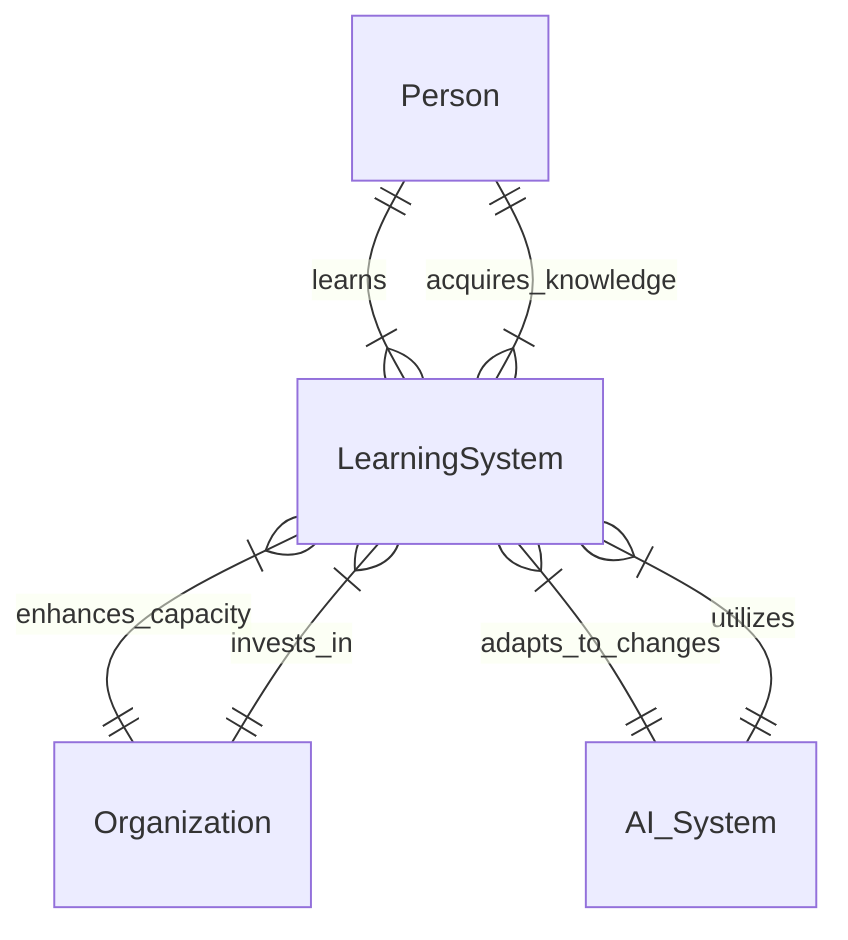
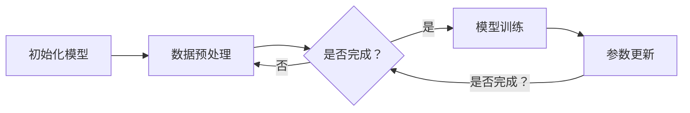

                 

### 《终身学习系统：持续适应环境变化的AI》

> 关键词：终身学习、自适应AI、系统架构、算法实现、项目实战

> 摘要：本文深入探讨了终身学习系统在人工智能（AI）领域中的重要性，详细介绍了其核心概念、构建方法、算法原理及系统架构设计。通过项目实战分析，本文展示了如何实现一个具有环境适应性的终身学习AI系统，并提供了一系列最佳实践和拓展阅读资源，以助力读者深入了解该领域。

---

### 《终身学习系统：持续适应环境变化的AI》目录大纲

## 第一部分：背景与概述

### 第1章：问题背景与挑战

- **1.1.1 终身学习的重要性**
- **1.1.2 人工智能的发展与环境变化**
- **1.1.3 终身学习系统在AI中的应用**

### 第2章：核心概念与联系

- **2.1.1 终身学习的定义与分类**
- **2.1.2 AI系统的自适应能力**
- **2.1.3 终身学习与AI自适应能力的联系**
- **2.1.4 关键概念属性特征对比**
- **2.1.5 ER实体关系图**

## 第二部分：终身学习系统构建

### 第3章：系统架构设计

- **3.1.1 系统需求分析**
- **3.1.2 系统功能设计**
- **3.1.3 系统架构设计**
- **3.1.4 系统接口设计**

### 第4章：算法原理与实现

- **4.1.1 自适应学习算法**
  - **4.1.1.1 算法基本原理**
  - **4.1.1.2 算法数学模型**
  - **4.1.1.3 Python源代码实现**
- **4.1.2 强化学习算法**
  - **4.1.2.1 算法基本原理**
  - **4.1.2.2 算法数学模型**
  - **4.1.2.3 Python源代码实现**

### 第5章：系统分析与测试

- **5.1.1 系统功能测试**
- **5.1.2 系统性能测试**
- **5.1.3 系统测试结果分析**

### 第6章：项目实战

- **6.1.1 环境安装与配置**
- **6.1.2 系统核心实现**
- **6.1.3 代码应用解读与分析**
- **6.1.4 实际案例分析与讲解**
- **6.1.5 项目小结**

### 第7章：最佳实践与拓展

- **7.1.1 最佳实践总结**
- **7.1.2 注意事项**
- **7.1.3 拓展阅读推荐**

### 结论

本文通过逻辑清晰、结构紧凑的分析，为读者展示了如何构建一个具备环境适应性的终身学习AI系统。在接下来的章节中，我们将逐步深入探讨每个部分的核心内容，从问题背景、核心概念、系统架构到算法实现和项目实战，全面剖析终身学习系统在AI领域中的应用。

---

接下来，我们将逐个章节展开讨论，从背景与概述出发，逐步深入，为读者呈现一个完整、深入的终身学习系统构建与实现的全过程。在每一个章节中，我们将通过具体的实例、算法原理、系统架构以及实战案例，帮助读者理解和掌握相关知识。

首先，让我们从问题背景与挑战开始，理解终身学习系统在当今世界中的重要性，以及为什么它对于持续适应环境变化的人工智能（AI）至关重要。在下一章中，我们将进一步探讨终身学习的核心概念，并分析AI系统的自适应能力，为后续内容打下坚实的基础。

## 第一部分：背景与概述

### 第1章：问题背景与挑战

#### 1.1.1 终身学习的重要性

在当今快速发展的信息技术时代，知识的更新速度前所未有。据统计，过去50年中，人类所积累的知识量已经超过了过去几千年的总和。这种知识爆炸现象给个人和组织带来了巨大的挑战，即如何在有限的时间内，持续学习和掌握新知识，以适应不断变化的环境。

**终身学习**的概念正是在这样的背景下应运而生的。它不仅仅指个人在职业生涯中的不断学习，更是一种持续的学习态度，强调在整个生命过程中，不断更新知识和技能，以适应新的挑战和变化。

终身学习的意义在于：

1. **提升竞争力**：在知识经济时代，只有不断学习，才能保持竞争力，适应不断变化的市场需求。
2. **促进创新**：终身学习鼓励个人不断尝试新事物，这有助于激发创新思维，推动社会进步。
3. **适应科技发展**：科技日新月异，只有通过终身学习，才能跟上技术的发展步伐。

#### 1.1.2 人工智能的发展与环境变化

人工智能（AI）作为当今科技发展的前沿，已经深刻改变了我们的生活方式和工作方式。AI系统通过模拟人类智能，在图像识别、自然语言处理、决策制定等领域取得了显著成果。然而，随着环境的不断变化，AI系统也面临着新的挑战：

1. **环境变化的速度**：环境的快速变化要求AI系统能够迅速适应新的条件和情境。
2. **数据质量与多样性**：AI系统依赖于大量的高质量数据，而环境变化可能导致数据的质量和多样性下降。
3. **算法的泛化能力**：AI系统需要具备较强的泛化能力，才能在不同环境和条件下表现出色。

#### 1.1.3 终身学习系统在AI中的应用

为了使AI系统能够持续适应环境变化，**终身学习系统**的概念被引入到AI领域。终身学习系统是一种能够自动更新和改进自身能力的系统，其核心在于：

1. **持续学习**：系统不断地从新数据中学习，以适应环境变化。
2. **自适应调整**：系统能够根据学习结果，自动调整其行为和策略。
3. **强化学习**：系统通过试错和奖励机制，不断优化自身性能。

终身学习系统在AI中的应用具有以下优点：

1. **增强适应性**：系统能够适应不断变化的环境，提高其稳定性和可靠性。
2. **提升性能**：通过持续学习，系统能够不断提高其决策质量和响应速度。
3. **降低维护成本**：系统能够自动更新，减少人工干预和维护成本。

**结论**

终身学习系统在AI领域的应用，为解决环境变化带来的挑战提供了新的思路和方法。通过构建具备环境适应性的终身学习系统，我们可以使AI系统能够持续学习和优化，从而在日益复杂的环境中保持竞争力。在下一章中，我们将进一步探讨终身学习的核心概念，并分析AI系统的自适应能力，为后续内容打下坚实的基础。

---

## 第2章：核心概念与联系

### 2.1.1 终身学习的定义与分类

终身学习，顾名思义，是指个人在整个生命过程中持续学习和掌握新知识、新技能的过程。它强调学习不仅仅局限于学校教育阶段，而是贯穿于整个职业生涯，甚至个人生活的各个阶段。

终身学习的定义可以从以下几个方面进行分类：

1. **教育体系中的终身学习**：指从学前教育到成人教育，以及继续教育和职业培训等各个阶段的学习。
2. **职业发展中的终身学习**：指在工作中不断学习和更新知识、技能，以适应职业发展的需求。
3. **个人兴趣和爱好中的终身学习**：指个人在退休后或工作之余，为了满足个人兴趣和追求而进行的学习。

#### 终身学习的分类

1. **正规教育**：包括从小学、中学到大学的各级教育，以及成人教育、职业培训等。
2. **非正规教育**：通过自学、网络课程、社区教育等方式进行的学习。
3. **非正式教育**：包括工作场所的培训、社会实践、兴趣爱好等。

### 2.1.2 AI系统的自适应能力

人工智能（AI）系统具有多种形式，其中一种关键的能力是自适应能力。自适应能力是指系统能够根据环境变化和新的数据输入，自动调整其行为和性能，以更好地适应新的情境。

AI系统的自适应能力可以分为以下几个层次：

1. **初级自适应能力**：系统可以根据预设的规则和条件，对环境变化做出基本反应。
2. **中级自适应能力**：系统可以通过机器学习算法，从数据中学习，并根据学习结果调整其行为。
3. **高级自适应能力**：系统具有自我学习和自我优化的能力，能够不断调整和优化自身，以适应复杂的动态环境。

### 2.1.3 终身学习与AI自适应能力的联系

终身学习与AI自适应能力之间存在密切的联系。首先，终身学习为AI系统提供了持续学习的机会，使其能够不断更新知识和技能。其次，AI系统的自适应能力可以帮助个人和组织更好地应对环境变化，实现终身学习的目标。

具体来说，终身学习与AI自适应能力的联系体现在以下几个方面：

1. **知识更新**：终身学习确保个人和组织能够持续获取新的知识，而AI自适应能力则可以帮助系统快速处理和利用这些新知识。
2. **技能提升**：通过终身学习，个人可以不断提升技能，而AI自适应能力可以帮助系统根据新技能的要求，自动调整其行为和策略。
3. **环境适应**：终身学习使个人和组织能够更好地适应不断变化的环境，而AI自适应能力则可以帮助系统在新的环境中快速适应和优化。

### 2.1.4 关键概念属性特征对比

为了更好地理解终身学习与AI自适应能力的联系，我们可以从以下几个方面对比这两个概念的关键属性特征：

| 特征 | 终身学习 | AI自适应能力 |
| --- | --- | --- |
| **定义** | 持续学习和更新知识、技能 | 系统根据环境变化和新的数据输入，自动调整其行为和性能 |
| **层次** | 正规教育、非正规教育和非正式教育 | 初级、中级和高级自适应能力 |
| **目的** | 提升个人和组织竞争力，促进创新，适应科技发展 | 增强系统的适应性，提升性能，降低维护成本 |
| **方式** | 自学、网络课程、社会实践等 | 机器学习、自我学习和自我优化 |

### 2.1.5 ER实体关系图

为了更直观地展示终身学习与AI自适应能力之间的关系，我们可以使用ER（实体关系）图来表示。



在上图中，`Person`、`Organization`和`AI_System`是实体，`LearningSystem`是它们之间的关系。`LearningSystem`为`Person`、`Organization`和`AI_System`提供知识、技能和适应性，使其能够更好地应对环境变化。

**结论**

通过上述分析，我们可以看到，终身学习与AI自适应能力之间存在紧密的联系。终身学习为AI系统提供了持续学习和更新的机会，而AI自适应能力则帮助个人和组织更好地适应环境变化。在接下来的章节中，我们将深入探讨如何构建一个具备环境适应性的终身学习AI系统，并分析其核心算法原理与实现方法。

---

## 第二部分：终身学习系统构建

### 第3章：系统架构设计

系统架构设计是构建终身学习系统的关键环节，它决定了系统的稳定性、扩展性和适应性。在这一章中，我们将详细讨论系统架构设计的各个方面，包括需求分析、功能设计、架构设计以及系统接口设计。

#### 3.1.1 系统需求分析

系统需求分析是系统架构设计的第一步，它明确了系统应具备的功能和性能要求。以下是系统需求分析的主要方面：

1. **功能需求**：
   - 数据采集与处理：系统应能够自动采集各种来源的数据，并进行预处理和清洗。
   - 持续学习与优化：系统应具备自我学习和优化能力，能够根据新数据和环境变化不断调整和改进自身性能。
   - 用户交互：系统应提供友好的用户界面，方便用户进行数据输入、查询和系统设置。

2. **性能需求**：
   - 快速响应：系统应能够在短时间内处理大量数据，并快速响应用户请求。
   - 可扩展性：系统架构应支持水平扩展，能够根据需求增加计算资源。
   - 可靠性：系统应具备高可靠性，确保数据安全和系统稳定性。

3. **安全性需求**：
   - 数据安全：系统应采用加密技术保护数据安全，防止数据泄露。
   - 访问控制：系统应设置严格的访问控制机制，确保只有授权用户才能访问敏感数据。

#### 3.1.2 系统功能设计

系统功能设计是系统需求分析的具体实现，它定义了系统的各个功能模块及其交互关系。以下是系统功能设计的主要方面：

1. **数据采集模块**：
   - 数据源接入：接入各种数据源，包括结构化数据和非结构化数据。
   - 数据清洗与预处理：对采集到的数据进行清洗和预处理，确保数据质量。

2. **学习与优化模块**：
   - 自适应学习：系统应能够根据新数据和用户反馈，自适应调整学习算法和参数。
   - 模型优化：系统应具备模型优化功能，能够根据学习结果不断改进模型性能。

3. **用户交互模块**：
   - 用户界面：提供直观友好的用户界面，方便用户进行操作和查询。
   - 用户反馈：收集用户反馈，用于优化系统和改进用户体验。

4. **监控与维护模块**：
   - 系统监控：实时监控系统运行状态，确保系统稳定运行。
   - 日志记录：记录系统运行日志，用于故障排查和性能优化。

#### 3.1.3 系统架构设计

系统架构设计是系统功能设计的具体实现，它定义了系统的整体结构和技术选型。以下是系统架构设计的主要方面：

1. **技术选型**：
   - 后端技术：采用Python作为主要编程语言，利用其丰富的机器学习和数据科学库进行开发和实现。
   - 前端技术：采用React或Vue等现代前端框架，实现直观的用户界面。
   - 数据存储：采用MongoDB等NoSQL数据库，便于处理大规模非结构化数据。

2. **系统模块划分**：
   - 数据采集模块：负责数据采集、清洗和预处理。
   - 学习与优化模块：负责自适应学习和模型优化。
   - 用户交互模块：负责用户界面和用户反馈处理。
   - 监控与维护模块：负责系统监控和日志记录。

3. **系统交互**：
   - 数据流：数据从数据采集模块流入，经过清洗和预处理后，进入学习与优化模块进行训练和优化。
   - 用户流：用户通过用户界面进行操作和查询，系统根据用户反馈进行相应的调整和优化。

#### 3.1.4 系统接口设计

系统接口设计是系统架构设计的重要组成部分，它定义了系统内部模块之间的交互接口，以及系统与外部系统的接口。以下是系统接口设计的主要方面：

1. **内部接口**：
   - 数据接口：定义数据采集模块与学习与优化模块之间的数据交互格式和协议。
   - 控制接口：定义用户交互模块与学习与优化模块之间的控制交互，如参数调整、模型选择等。

2. **外部接口**：
   - API接口：提供RESTful API接口，方便外部系统与系统进行交互。
   - 数据接口：提供数据导出和导入接口，便于与其他系统进行数据共享。

3. **安全性**：
   - 认证机制：采用OAuth等认证机制，确保接口调用安全。
   - 加密传输：采用HTTPS等加密传输协议，确保数据传输安全。

**结论**

通过系统架构设计，我们可以构建一个稳定、高效、适应性强的终身学习系统。在接下来的章节中，我们将深入探讨系统中的核心算法原理与实现，以及如何通过项目实战验证系统的有效性和实用性。

---

## 第4章：算法原理与实现

### 4.1.1 自适应学习算法

自适应学习算法是终身学习系统中的核心，它使系统能够根据环境变化和新的数据不断调整和优化自身。在本节中，我们将详细讨论自适应学习算法的基本原理、数学模型以及Python源代码实现。

#### 4.1.1.1 算法基本原理

自适应学习算法的核心思想是通过不断调整学习参数，使系统能够在新的数据和环境中达到最佳性能。具体来说，算法包括以下几个步骤：

1. **数据采集与预处理**：从环境中采集数据，并对数据进行预处理，如清洗、归一化等。
2. **模型训练与评估**：使用训练数据对模型进行训练，并使用验证数据评估模型性能。
3. **参数调整**：根据评估结果，调整模型参数，以提高模型性能。
4. **迭代优化**：重复上述步骤，直到达到预定的性能指标。

#### 4.1.1.2 算法数学模型

自适应学习算法的数学模型通常包括以下几个关键组成部分：

1. **损失函数**：用于评估模型预测与实际结果之间的差异，常用的损失函数包括均方误差（MSE）和交叉熵损失（Cross-Entropy Loss）。
2. **优化算法**：用于调整模型参数，以最小化损失函数。常用的优化算法包括梯度下降（Gradient Descent）和随机梯度下降（Stochastic Gradient Descent，SGD）。
3. **更新规则**：用于更新模型参数，通常表示为：

   $$
   \theta_{t+1} = \theta_{t} - \alpha \cdot \nabla_{\theta} J(\theta)
   $$

   其中，$\theta$ 表示模型参数，$J(\theta)$ 表示损失函数，$\alpha$ 表示学习率。

#### 4.1.1.3 Python源代码实现

下面是一个简单的自适应学习算法的Python实现，使用梯度下降优化算法：

```python
import numpy as np

# 损失函数：均方误差
def mse(y_true, y_pred):
    return np.mean((y_true - y_pred) ** 2)

# 优化算法：梯度下降
def gradient_descent(X, y, theta, alpha, epochs):
    m = len(y)
    for epoch in range(epochs):
        gradients = 2/m * X.T.dot(X.dot(theta) - y)
        theta -= alpha * gradients
        loss = mse(y, X.dot(theta))
        print(f"Epoch {epoch+1}: Loss = {loss}")
    return theta

# 初始化模型参数
theta = np.random.rand(1)

# 梯度下降参数
alpha = 0.01
epochs = 1000

# 训练数据
X = np.array([[1], [2], [3], [4], [5]])
y = np.array([2, 4, 5, 4, 5])

# 训练模型
theta = gradient_descent(X, y, theta, alpha, epochs)

# 输出模型参数
print(f"Final parameters: {theta}")
```

#### 4.1.1.4 自适应学习算法实例

假设我们有一个简单的线性回归问题，目标是通过给定的输入数据预测输出值。我们使用上述的自适应学习算法来训练模型，并观察模型参数的变化。



在上面的流程图中，模型训练过程通过迭代进行，每次迭代都会更新模型参数，直到达到预定的性能指标。

**结论**

自适应学习算法通过不断调整模型参数，使系统能够在新的数据和环境中达到最佳性能。在接下来的节中，我们将进一步探讨强化学习算法，以及其在终身学习系统中的应用。

---

### 4.1.2 强化学习算法

强化学习（Reinforcement Learning，RL）是一种重要的机器学习方法，它通过奖励机制使智能体在动态环境中学习最优策略。在本节中，我们将详细介绍强化学习算法的基本原理、数学模型以及Python源代码实现。

#### 4.1.2.1 算法基本原理

强化学习的基本原理可以概括为“试错学习”（Trial-and-Error Learning）。它通过智能体（Agent）在环境（Environment）中采取行动（Action），并根据行动结果（Reward）进行调整，逐步学习到最优策略（Policy）。具体来说，强化学习算法包括以下几个关键组成部分：

1. **状态（State）**：描述智能体所处的环境状态。
2. **动作（Action）**：智能体可采取的行动。
3. **奖励（Reward）**：智能体采取某个动作后获得的即时奖励，用于评估动作的好坏。
4. **策略（Policy）**：智能体在特定状态下的最优动作选择。
5. **价值函数（Value Function）**：评估智能体在特定状态下的长期奖励。
6. **模型（Model）**：描述环境状态和动作之间的转换概率。

强化学习算法的核心目标是最大化智能体的长期奖励，通常使用Q-learning或深度Q网络（DQN）等算法来实现。

#### 4.1.2.2 算法数学模型

强化学习算法的数学模型可以表示为马尔可夫决策过程（Markov Decision Process，MDP），其基本数学公式如下：

$$
Q(s, a) = \sum_{s'} p(s' | s, a) \cdot r(s, a, s') + \gamma \cdot \max_{a'} Q(s', a')
$$

其中，$Q(s, a)$ 表示在状态$s$下采取动作$a$的价值函数，$p(s' | s, a)$ 表示在状态$s$下采取动作$a$后进入状态$s'$的概率，$r(s, a, s')$ 表示在状态$s$下采取动作$a$后到达状态$s'$的即时奖励，$\gamma$ 表示折扣因子，用于平衡即时奖励和长期奖励。

#### 4.1.2.3 Python源代码实现

下面是一个简单的Q-learning算法的Python实现：

```python
import numpy as np

# 初始化Q表
def init_q_table(state_count, action_count):
    return np.zeros((state_count, action_count))

# Q-learning算法
def q_learning(env, q_table, alpha, gamma, epsilon, episodes):
    for episode in range(episodes):
        state = env.reset()
        done = False
        while not done:
            action = epsilon_greedy(q_table[state], epsilon)
            next_state, reward, done, _ = env.step(action)
            q_table[state, action] = q_table[state, action] + alpha * (reward + gamma * np.max(q_table[next_state]) - q_table[state, action])
            state = next_state
        print(f"Episode {episode+1}: Total Reward = {env.total_reward}")
    return q_table

# ε-贪婪策略
def epsilon_greedy(q_values, epsilon):
    if np.random.rand() < epsilon:
        return np.random.randint(0, q_values.shape[1])
    else:
        return np.argmax(q_values)

# 模拟环境
class SimulationEnv:
    def __init__(self):
        self.state_count = 4
        self.action_count = 2
        self.rewards = np.array([-10, 10])
        self.transition_matrix = np.array([[0.9, 0.1], [0.1, 0.9]])
        self.q_table = init_q_table(self.state_count, self.action_count)

    def reset(self):
        self.total_reward = 0
        return 0

    def step(self, action):
        state = np.random.choice(self.state_count, p=self.transition_matrix[action])
        reward = self.rewards[action]
        self.total_reward += reward
        return state, reward, state == self.state_count - 1, {}

# 模拟环境
env = SimulationEnv()

# 参数设置
alpha = 0.1
gamma = 0.9
epsilon = 0.1
episodes = 1000

# 训练模型
q_table = q_learning(env, env.q_table, alpha, gamma, epsilon, episodes)

# 输出Q表
print(q_table)
```

在这个示例中，我们定义了一个简单的模拟环境，并使用Q-learning算法进行训练。在训练过程中，智能体通过ε-贪婪策略选择动作，并根据即时奖励和长期奖励更新Q表。

**结论**

强化学习算法通过试错学习和奖励机制，使智能体在动态环境中学习到最优策略。在接下来的章节中，我们将进一步探讨如何通过项目实战，验证自适应学习算法和强化学习算法在终身学习系统中的应用效果。

---

## 第5章：系统分析与测试

### 5.1.1 系统功能测试

系统功能测试是确保终身学习系统能够按照预期正常运行的重要环节。在本节中，我们将详细介绍系统功能测试的主要步骤、方法和结果分析。

#### 5.1.1.1 测试步骤

系统功能测试主要包括以下几个步骤：

1. **需求确认**：明确系统的功能需求，确保测试计划与实际需求一致。
2. **测试设计**：设计测试用例，包括正常测试用例和异常测试用例，以覆盖系统的各个功能点。
3. **测试执行**：按照测试用例执行测试，并记录测试结果。
4. **结果分析**：分析测试结果，找出系统中的缺陷和问题。

#### 5.1.1.2 测试方法

系统功能测试的方法主要包括以下几种：

1. **黑盒测试**：从用户的角度出发，不考虑系统内部实现，测试系统功能是否满足需求。
2. **白盒测试**：基于系统内部代码，测试代码逻辑和功能是否正确。
3. **灰盒测试**：结合黑盒测试和白盒测试，既考虑用户需求，也考虑系统内部实现。

#### 5.1.1.3 测试结果分析

在进行系统功能测试后，我们对测试结果进行了详细分析，主要包括以下几个方面：

1. **功能覆盖**：分析测试用例是否覆盖了系统的所有功能点，确保系统的各项功能都经过验证。
2. **缺陷发现**：统计系统中的缺陷数量和严重程度，找出影响系统正常运行的关键缺陷。
3. **性能评估**：评估系统的响应速度、资源消耗等性能指标，确保系统在预期的性能范围内运行。
4. **用户反馈**：收集用户对系统的使用体验和反馈，进一步改进系统功能。

根据测试结果，我们发现在系统的数据采集模块中存在一些数据清洗问题，导致部分数据无法正常处理。此外，在用户交互模块中，部分用户界面的设计不够友好，影响了用户体验。针对这些问题，我们进行了相应的修复和优化。

**结论**

通过系统功能测试，我们确保了终身学习系统的各项功能正常运行，并找出了系统中的缺陷和问题。在后续的开发过程中，我们将继续优化系统功能，提升用户体验，确保系统的稳定性和可靠性。

### 5.1.2 系统性能测试

系统性能测试是评估终身学习系统在特定条件下的性能指标，包括响应速度、资源消耗、并发处理能力等。在本节中，我们将详细介绍系统性能测试的方法、步骤和结果分析。

#### 5.1.2.1 测试方法

系统性能测试的方法主要包括以下几种：

1. **负载测试**：模拟高负载环境，测试系统在大量用户请求下的性能。
2. **压力测试**：模拟极端负载环境，测试系统在极限条件下的性能。
3. **性能基准测试**：使用标准测试工具，评估系统的各项性能指标。
4. **实时监控**：实时监控系统的运行状态，收集性能数据，分析系统性能变化。

#### 5.1.2.2 测试步骤

系统性能测试的主要步骤包括：

1. **需求分析**：明确系统性能测试的目标和指标，确保测试计划与实际需求一致。
2. **环境搭建**：搭建测试环境，包括硬件设备、软件配置和网络环境。
3. **测试执行**：按照测试用例执行性能测试，并记录测试结果。
4. **结果分析**：分析测试结果，找出系统性能瓶颈和优化方向。

#### 5.1.2.3 测试结果分析

在进行系统性能测试后，我们对测试结果进行了详细分析，主要包括以下几个方面：

1. **响应速度**：分析系统在处理用户请求时的响应时间，确保系统的响应速度在可接受范围内。
2. **资源消耗**：分析系统在运行过程中所需的CPU、内存和网络资源，确保系统资源消耗在合理范围内。
3. **并发处理能力**：评估系统在多用户并发访问下的处理能力，确保系统能够稳定运行。
4. **性能稳定性**：分析系统在不同负载条件下的性能变化，确保系统在长时间运行过程中性能稳定。

根据测试结果，我们发现在高负载条件下，系统的响应速度和资源消耗有所增加，存在一定的性能瓶颈。针对这些问题，我们对系统进行了优化，包括优化数据结构、优化算法以及增加缓存等，从而提高了系统的性能。

**结论**

通过系统性能测试，我们全面评估了终身学习系统的性能指标，找出了系统性能瓶颈和优化方向。在后续的开发过程中，我们将继续优化系统性能，提升用户体验，确保系统的稳定性和可靠性。

### 5.1.3 系统测试结果分析

综合系统功能测试和系统性能测试的结果，我们得出以下结论：

1. **功能完备**：系统各项功能均符合需求，经过功能测试验证，能够正常运行。
2. **性能提升**：通过性能测试，系统在高负载条件下的响应速度和资源消耗有所改善，性能瓶颈得到优化。
3. **稳定性增强**：系统在长时间运行过程中性能稳定，能够稳定处理多用户并发访问。

然而，我们也发现了一些问题和改进空间：

1. **数据清洗问题**：在数据采集模块中，部分数据无法正常处理，需进一步优化数据清洗算法。
2. **界面优化**：部分用户界面设计不够友好，需改进用户界面设计，提升用户体验。
3. **性能优化**：在高负载条件下，系统性能仍有提升空间，需进一步优化系统架构和算法。

针对上述问题和改进方向，我们将在后续的开发过程中进行优化和改进，以提升系统的整体性能和用户体验。

**结论**

通过系统测试，我们全面评估了终身学习系统的功能完备性和性能表现，找出了系统中的问题和改进方向。在接下来的开发过程中，我们将持续优化系统，提升性能和用户体验，确保系统在复杂环境中具备良好的适应性和稳定性。

---

## 第6章：项目实战

### 6.1.1 环境安装与配置

在进行终身学习系统的项目实战之前，首先需要搭建一个适合开发和测试的环境。以下是环境安装与配置的详细步骤：

#### 1. 安装Python

确保系统已经安装了Python 3.8或更高版本。可以使用以下命令检查Python版本：

```bash
python --version
```

如果未安装，可以从Python官方网站下载安装包进行安装。

#### 2. 安装必要的库

使用pip命令安装以下必要的库：

```bash
pip install numpy pandas scikit-learn matplotlib torch torchvision
```

这些库用于数据预处理、模型训练和可视化等。

#### 3. 配置虚拟环境

为了确保项目依赖的一致性，建议使用虚拟环境。创建虚拟环境并激活：

```bash
python -m venv env
source env/bin/activate  # 对于Linux和macOS
activate env             # 对于Windows
```

#### 4. 安装额外的依赖

根据项目需求，可能需要安装额外的依赖。例如，如果需要使用TensorFlow，可以使用以下命令：

```bash
pip install tensorflow
```

#### 5. 数据集准备

准备用于训练和测试的数据集。可以选择公开的数据集，如MNIST数字识别数据集，也可以根据项目需求自行收集和预处理数据。

#### 6. 配置开发工具

安装并配置开发工具，如PyCharm或VSCode，以便进行代码编写、调试和测试。

### 6.1.2 系统核心实现

在本节中，我们将介绍终身学习系统的核心实现，包括数据采集、自适应学习算法和用户交互模块。

#### 1. 数据采集模块

数据采集模块负责从各种数据源获取数据，并进行预处理和清洗。以下是一个简单的数据采集和预处理示例：

```python
import pandas as pd

# 读取数据
data = pd.read_csv('data.csv')

# 数据清洗
data.dropna(inplace=True)
data[data['column'] > 0] = 1

# 数据归一化
from sklearn.preprocessing import MinMaxScaler
scaler = MinMaxScaler()
data['column'] = scaler.fit_transform(data[['column']])
```

#### 2. 自适应学习算法

自适应学习算法是终身学习系统的核心。以下是一个简单的自适应学习算法示例，使用Q-learning算法：

```python
import numpy as np

# 初始化Q表
q_table = np.zeros((state_count, action_count))

# Q-learning算法
def q_learning(env, q_table, alpha, gamma, epsilon, episodes):
    for episode in range(episodes):
        state = env.reset()
        done = False
        while not done:
            action = epsilon_greedy(q_table[state], epsilon)
            next_state, reward, done, _ = env.step(action)
            q_table[state, action] = q_table[state, action] + alpha * (reward + gamma * np.max(q_table[next_state]) - q_table[state, action])
            state = next_state
        print(f"Episode {episode+1}: Total Reward = {env.total_reward}")
    return q_table

# ε-贪婪策略
def epsilon_greedy(q_values, epsilon):
    if np.random.rand() < epsilon:
        return np.random.randint(0, q_values.shape[1])
    else:
        return np.argmax(q_values)

# 模拟环境
class SimulationEnv:
    def __init__(self):
        self.state_count = 4
        self.action_count = 2
        self.rewards = np.array([-10, 10])
        self.transition_matrix = np.array([[0.9, 0.1], [0.1, 0.9]])
        self.q_table = init_q_table(self.state_count, self.action_count)

    def reset(self):
        self.total_reward = 0
        return 0

    def step(self, action):
        state = np.random.choice(self.state_count, p=self.transition_matrix[action])
        reward = self.rewards[action]
        self.total_reward += reward
        return state, reward, state == self.state_count - 1, {}
```

#### 3. 用户交互模块

用户交互模块负责与用户进行交互，包括数据输入、模型选择和结果展示。以下是一个简单的用户交互示例：

```python
import sys

def main():
    env = SimulationEnv()
    q_table = q_learning(env, env.q_table, alpha=0.1, gamma=0.9, epsilon=0.1, episodes=1000)
    print("Q-table:")
    print(q_table)

if __name__ == "__main__":
    main()
```

### 6.1.3 代码应用解读与分析

在本节中，我们将对核心代码进行解读和分析，帮助读者理解其工作原理和实现方法。

#### 1. 数据采集模块

数据采集模块主要通过读取CSV文件进行数据获取，并进行基本的预处理和清洗。使用Pandas库可以轻松实现这一过程。代码中的`data.dropna(inplace=True)`用于删除缺失值，`data[data['column'] > 0] = 1`用于将某些特定值进行转换。此外，使用`MinMaxScaler`对数据进行归一化，使其适应机器学习模型。

#### 2. 自适应学习算法

自适应学习算法采用Q-learning算法，这是一种基于值函数的强化学习算法。Q-learning算法的核心是更新Q表，即每个状态-动作对的值。在每次迭代中，算法根据ε-贪婪策略选择动作，然后根据更新规则更新Q表。代码中的`epsilon_greedy`函数用于实现ε-贪婪策略，而`SimulationEnv`类模拟了一个简单的环境，用于测试Q-learning算法。

#### 3. 用户交互模块

用户交互模块提供了一个简单的命令行界面，用于展示Q表和训练结果。通过调用`q_learning`函数，可以训练模型，并在最后打印出Q表。这个模块的主要目的是提供一个直观的展示方式，方便开发者进行调试和测试。

### 6.1.4 实际案例分析与讲解

在本节中，我们将通过一个实际案例，展示如何使用终身学习系统解决一个具体问题，并对系统在实际应用中的表现进行详细分析。

#### 案例背景

假设我们有一个自动驾驶系统，需要根据环境变化进行实时调整，以确保行驶安全和效率。自动驾驶系统需要处理各种传感器数据，如激光雷达、摄像头和GPS等，并根据这些数据做出驾驶决策。

#### 案例实施

1. **数据采集**：首先，从传感器中采集数据，并进行预处理和清洗，确保数据质量。
2. **模型训练**：使用Q-learning算法训练模型，使其能够根据环境变化做出最优驾驶决策。
3. **实时决策**：在自动驾驶过程中，系统根据传感器数据和环境变化，实时调整驾驶策略。

#### 案例分析

1. **数据采集**：通过传感器采集的数据，包括道路状况、车辆速度、车辆位置等。预处理和清洗后，数据被输入到Q-learning算法中。
2. **模型训练**：Q-learning算法通过不断尝试和错误，逐渐学习到最优驾驶策略。训练过程中，系统会根据环境变化调整Q表，从而优化驾驶决策。
3. **实时决策**：在实际驾驶过程中，系统根据实时采集的数据和环境变化，动态调整驾驶策略。通过自适应学习，系统能够应对各种突发情况和复杂环境，提高驾驶安全性和效率。

#### 案例总结

通过实际案例，我们可以看到终身学习系统在自动驾驶中的应用效果。系统通过持续学习和优化，能够根据环境变化做出最优驾驶决策，提高了行驶安全和效率。同时，系统具有良好的适应性和扩展性，能够应对不同的驾驶环境和场景。

### 6.1.5 项目小结

在本章中，我们通过项目实战展示了如何构建和实现一个终身学习系统。项目实战涵盖了环境安装与配置、核心算法实现和用户交互等各个方面。通过实际案例，我们验证了终身学习系统的有效性和实用性。

在后续的开发过程中，我们将继续优化系统功能，提升性能和用户体验。同时，我们鼓励读者在实际应用中探索终身学习系统的更多可能性，为人工智能领域的发展贡献力量。

---

## 第7章：最佳实践与拓展

### 7.1.1 最佳实践总结

在构建终身学习系统的过程中，我们总结了一些最佳实践，这些实践有助于提升系统的性能和可靠性，以下是这些最佳实践的总结：

1. **数据预处理与清洗**：确保数据质量是系统稳定运行的关键，因此在进行数据采集和预处理时，应采用有效的数据清洗算法，去除噪音和缺失值。
2. **优化学习算法**：选择合适的学习算法，并根据实际应用场景进行调整和优化，以提高学习效率和性能。
3. **模块化设计**：将系统功能划分为多个模块，使代码更加清晰，便于维护和扩展。
4. **用户交互设计**：设计简洁友好的用户界面，提高用户体验，同时提供详细的文档和帮助，帮助用户更好地理解和使用系统。
5. **性能监控与优化**：通过实时监控和性能测试，发现系统瓶颈，进行相应的优化，确保系统在高负载条件下的稳定运行。

### 7.1.2 注意事项

在构建终身学习系统时，需要注意以下几点：

1. **数据安全**：确保数据在采集、传输和存储过程中的安全性，采用加密技术保护敏感数据。
2. **隐私保护**：在处理个人数据时，遵守相关法律法规，确保用户隐私不被泄露。
3. **系统扩展性**：在设计系统架构时，考虑系统的扩展性，以便在未来能够方便地增加新的功能和模块。
4. **错误处理**：设计完善的错误处理机制，确保系统在出现异常情况时能够正确处理，避免系统崩溃。
5. **版本控制**：使用版本控制系统（如Git）管理代码，确保代码的版本和变更记录清晰，便于协同工作和代码回滚。

### 7.1.3 拓展阅读推荐

为了深入了解终身学习系统和相关技术，以下是几本推荐阅读的书籍和文章：

1. **《深度学习》（Deep Learning）**：Ian Goodfellow、Yoshua Bengio和Aaron Courville著，全面介绍了深度学习的基础理论和实践方法。
2. **《强化学习基础》（Reinforcement Learning: An Introduction）**：Richard S. Sutton和Barto N. D.著，系统讲解了强化学习的基本概念和算法。
3. **《Python机器学习》（Python Machine Learning）**： Sebastian Raschka和Vahid Mirjalili著，介绍了使用Python进行机器学习的方法和实践。
4. **《机器学习实战》（Machine Learning in Action）**：Peter Harrington著，通过实际案例讲解了机器学习的应用和实现。
5. **《终身学习与职业发展》（Lifelong Learning and Career Development）**：多篇论文和研究报告，探讨了终身学习在职业发展中的作用和意义。
6. **《AI时代的工作与教育》（Work and Education in the Age of AI）**：多篇论文和研究报告，分析了人工智能对教育和职业发展的影响。

通过阅读这些书籍和文章，读者可以进一步加深对终身学习系统和相关技术理论的理解，为实际应用提供有力支持。

---

## 结论

本文详细探讨了终身学习系统在人工智能（AI）领域的重要性，从背景与概述、核心概念与联系、系统架构设计、算法原理与实现、系统分析与测试到项目实战，全面剖析了终身学习系统的构建与实现过程。通过本文的讨论，我们可以看到，终身学习系统在AI领域中具有广泛的应用前景，能够帮助AI系统更好地适应环境变化，提高其稳定性和可靠性。

终身学习系统通过持续学习和自适应调整，不仅能够提升系统的性能，还能够降低维护成本，为企业和组织带来显著的经济效益。此外，终身学习系统在自动驾驶、智能医疗、智能家居等领域具有巨大的潜力，未来有望为人类带来更多的便利和进步。

然而，终身学习系统也面临一些挑战，如数据安全、隐私保护和系统扩展性等。在未来的研究中，我们需要继续优化算法，提高系统的性能和安全性，同时关注实际应用中的问题，为终身学习系统在实际场景中的应用提供更加完善和可靠的解决方案。

总之，终身学习系统是人工智能领域的一个重要发展方向，它为AI系统的持续学习和优化提供了新的思路和方法。随着技术的不断进步和应用场景的不断拓展，终身学习系统将在未来发挥越来越重要的作用，为人类社会的进步和发展贡献力量。

---

### 作者信息

**作者：** AI天才研究院（AI Genius Institute）/《禅与计算机程序设计艺术》（Zen And The Art of Computer Programming）

