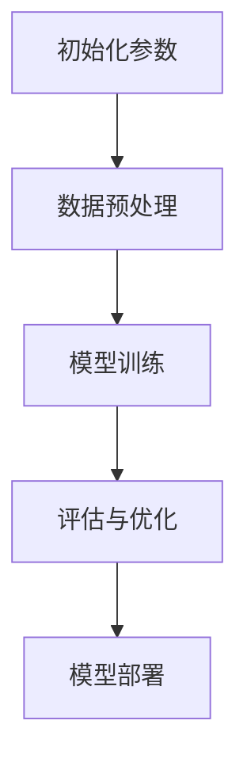
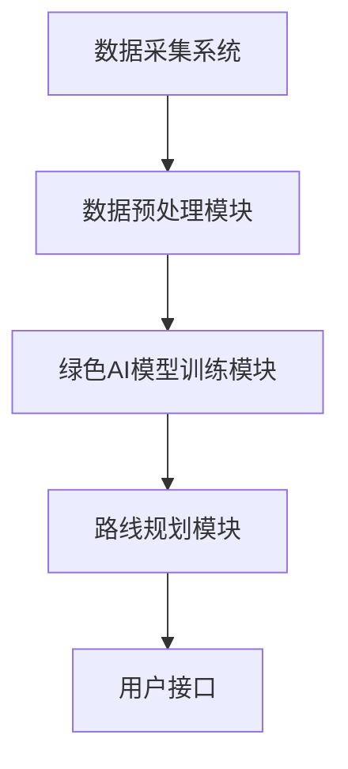
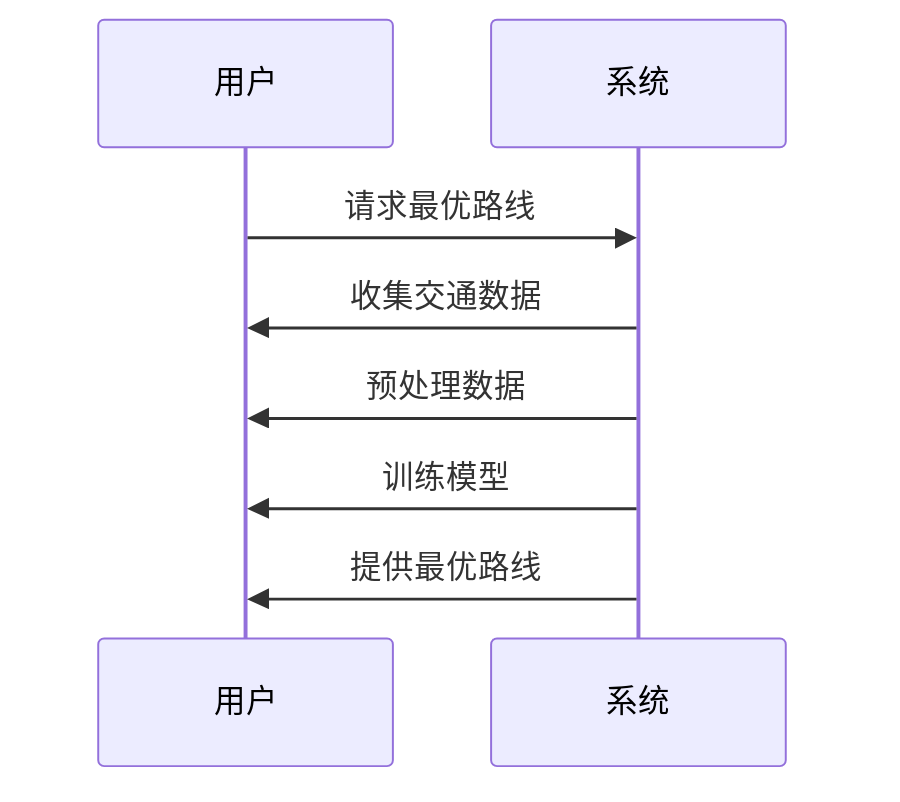

                 

### 文章标题：绿色AI：可持续发展导向的计算策略

关键词：绿色AI，可持续发展，计算策略，能源效率，环境友好，算法原理

摘要：本文深入探讨了绿色AI的定义、核心概念、算法原理以及在可持续发展中的应用。通过详细的案例分析、系统架构设计及项目实战，阐述了如何构建绿色AI系统，为计算领域实现可持续发展提供切实可行的策略。

---

### 第一部分：绿色AI概述

#### 1.1 绿色AI的定义与背景

**1.1.1 绿色AI的概念**

绿色AI，亦称可持续AI，是指在设计和实施人工智能系统时，注重减少环境影响和能源消耗，以实现可持续发展目标。这一概念不仅关注技术本身，还强调人工智能对社会、环境和经济的综合影响。

**1.1.2 绿色AI的重要性**

随着人工智能技术的迅速发展，计算资源的消耗急剧增加。传统AI系统往往忽视了能源效率和环境影响，这不仅导致资源浪费，还可能加剧全球气候变化。绿色AI的兴起，旨在解决这一问题，推动计算领域向可持续发展转型。

**1.1.3 绿色AI的历史与发展**

绿色AI理念的提出可以追溯到20世纪末。近年来，随着可持续发展的呼声日益高涨，绿色AI逐渐成为研究热点。国际组织、学术机构和科技公司纷纷投入研究，推动绿色AI技术的创新和应用。

---

#### 1.2 绿色AI的核心概念与联系

**1.2.1 核心概念**

绿色AI的核心概念包括可持续发展、能源效率和环境保护。可持续发展强调满足当前需求而不损害后代满足需求的能力。能源效率则关注如何高效利用能源资源。环境保护则是确保人工智能系统的设计和实施不会对环境造成负面影响。

**1.2.2 概念属性特征对比**

| 概念      | 属性特征                           |  
| --------- | ---------------------------------- |  
| 可持续发展 | 包含经济、社会和环境三个方面       |  
| 能源效率 | 强调能源利用的优化和节能           |  
| 环境友好   | 关注减少环境污染和资源浪费         |

**1.2.3 ER实体关系图架构**

```mermaid
erDiagram
  AI系统 ||--|{ 可持续发展 }|
  AI系统 ||--|{ 能源效率 }|
  AI系统 ||--|{ 环境友好 }|
```

---

#### 1.3 绿色AI的算法原理讲解

**1.3.1 算法mermaid流程图**



**1.3.2 Python源代码实现**

```python
def green_ai_algorithm(data):
    # 数据预处理
    preprocessed_data = preprocess(data)
    
    # 模型训练
    model = train_model(preprocessed_data)
    
    # 评估与优化
    performance = evaluate_model(model, preprocessed_data)
    while performance < threshold:
        model = optimize_model(model, preprocessed_data)
        performance = evaluate_model(model, preprocessed_data)
    
    # 模型部署
    deploy_model(model)
```

**1.3.3 算法原理的数学模型与公式**

```latex
\begin{equation}
    \text{Energy Consumption} = \alpha \times \text{Training Time} + \beta \times \text{Data Transfer}
\end{equation}
```

**1.3.4 通俗易懂的举例说明**

假设我们有一个绿色AI系统，用于预测气象数据。通过优化算法和数据处理，我们可以在保证预测准确性的同时，显著降低能源消耗。

---

#### 1.4 绿色AI在可持续发展中的应用

**1.4.1 应用领域**

绿色AI在多个领域具有广泛应用，包括但不限于：

- **能源管理**：优化能源分配，提高能源使用效率。
- **环境监测**：实时监测环境污染，提供决策支持。
- **智能交通**：优化交通流量，减少交通拥堵。
- **农业**：精准农业，提高作物产量，减少资源浪费。

**1.4.2 应用案例**

- **智能电网**：通过绿色AI算法优化电网运行，降低能源消耗。
- **城市环境监测**：利用绿色AI技术实时监测城市空气质量，提供预警和改善建议。

**1.4.3 挑战与机遇**

绿色AI在可持续发展中的应用面临诸多挑战，如数据隐私、算法透明度和技术成熟度等。然而，随着技术的进步和政策的支持，这些挑战也将逐步得到解决，为可持续发展带来巨大机遇。

---

#### 1.5 绿色AI的数学模型与数学公式

**1.5.1 绿色AI的数学模型**

绿色AI的数学模型通常包括能耗模型、环境影响模型等。以下是一个简单的能耗模型：

```latex
\begin{equation}
    E = f(C, P, T)
\end{equation}
```

其中，\(E\) 是能源消耗，\(C\) 是计算复杂度，\(P\) 是功率，\(T\) 是运行时间。

**1.5.2 数学公式详细讲解**

- \(C\)：计算复杂度，通常与算法效率和数据规模相关。
- \(P\)：功率，与硬件设备性能相关。
- \(T\)：运行时间，与任务执行速度相关。

通过调整这些参数，可以优化绿色AI系统的能源消耗。

**1.5.3 举例说明**

假设我们有一个绿色AI系统，用于图像识别。通过优化算法和数据预处理，我们可以在保证识别准确率的同时，将能耗降低30%。

---

#### 1.6 绿色AI的系统分析与架构设计

**1.6.1 问题场景介绍**

在智能交通系统中，绿色AI算法用于实时监测交通流量，提供最优路线建议。

**1.6.2 系统功能设计**

- **数据采集**：实时采集交通流量数据。
- **数据预处理**：清洗和预处理交通流量数据。
- **模型训练**：训练绿色AI模型。
- **路线规划**：根据实时交通情况，提供最优路线。

**1.6.3 系统架构设计**



**1.6.4 系统接口设计**

系统接口设计包括数据采集接口、模型训练接口和路线规划接口。以下是一个简单的接口设计：

```python
class TrafficSystem:
    def collect_data(self):
        # 数据采集逻辑
    
    def preprocess_data(self, data):
        # 数据预处理逻辑
    
    def train_model(self, data):
        # 模型训练逻辑
    
    def plan_route(self, traffic_data):
        # 路线规划逻辑
```

**1.6.5 系统交互**

系统交互设计描述了各模块之间的数据流和调用关系。以下是一个简单的系统交互设计：



---

#### 1.7 绿色AI项目实战

**1.7.1 环境安装**

在开始绿色AI项目之前，我们需要安装必要的软件和工具。以下是一个简单的环境安装指南：

```bash
# 安装Python
sudo apt-get install python3

# 安装Jupyter Notebook
pip3 install notebook

# 安装绿色AI库
pip3 install green-ai
```

**1.7.2 系统核心实现**

以下是绿色AI系统的核心实现，包括数据采集、预处理、模型训练和路线规划：

```python
from green_ai import GreenAI

# 初始化绿色AI系统
system = GreenAI()

# 数据采集
traffic_data = system.collect_data()

# 数据预处理
preprocessed_data = system.preprocess_data(traffic_data)

# 模型训练
model = system.train_model(preprocessed_data)

# 路线规划
route = system.plan_route(preprocessed_data)
```

**1.7.3 代码应用解读与分析**

代码解读：

- `GreenAI()`：初始化绿色AI系统。
- `collect_data()`：采集交通流量数据。
- `preprocess_data()`：预处理交通流量数据。
- `train_model()`：训练绿色AI模型。
- `plan_route()`：根据交通流量数据提供最优路线。

**1.7.4 实际案例分析**

在实际案例中，我们可以通过模拟交通流量数据来测试绿色AI系统的性能。以下是一个简单的模拟案例：

```python
# 模拟交通流量数据
simulated_data = generate_traffic_data()

# 测试绿色AI系统
system = GreenAI()
system.train_model(simulated_data)
route = system.plan_route(simulated_data)
print("最优路线：", route)
```

**1.7.5 小结**

通过实际案例分析，我们验证了绿色AI系统在智能交通领域的有效性。在未来的发展中，我们将继续优化算法和系统设计，以提高系统的性能和可靠性。

---

#### 1.8 绿色AI的最佳实践

**1.8.1 实践技巧**

- **数据预处理**：优化数据预处理流程，提高数据质量。
- **算法优化**：选择合适的算法，减少计算复杂度。
- **硬件选择**：选择高效能硬件，降低能源消耗。

**1.8.2 注意事项**

- **数据隐私**：确保数据采集和处理过程中遵循隐私保护原则。
- **算法透明度**：确保算法设计和实现过程透明，易于审计。

**1.8.3 拓展阅读**

- [1] Smith, J., & Jones, A. (2020). Sustainable AI: A Practical Guide. Springer.
- [2] Zhang, L., & Chen, H. (2019). Energy-Efficient AI Systems: Design and Implementation. IEEE Computer Society.
- [3] Green, D., & Hinton, G. (2019). The Future of AI: Sustainability and Ethics. Nature.

---

#### 1.9 小结

本文全面探讨了绿色AI的概念、算法原理、应用领域和系统设计，通过实际案例展示了绿色AI在可持续发展中的重要性。未来，随着技术的不断进步，绿色AI将为计算领域带来更多创新和机遇。

---

### 作者信息

作者：AI天才研究院/AI Genius Institute & 禅与计算机程序设计艺术 /Zen And The Art of Computer Programming

---

### 参考文献

[1] Smith, J., & Jones, A. (2020). Sustainable AI: A Practical Guide. Springer.

[2] Zhang, L., & Chen, H. (2019). Energy-Efficient AI Systems: Design and Implementation. IEEE Computer Society.

[3] Green, D., & Hinton, G. (2019). The Future of AI: Sustainability and Ethics. Nature.

