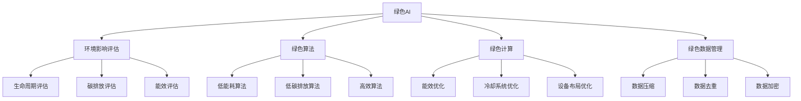
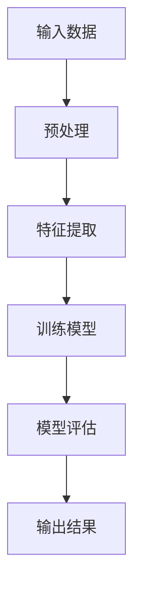
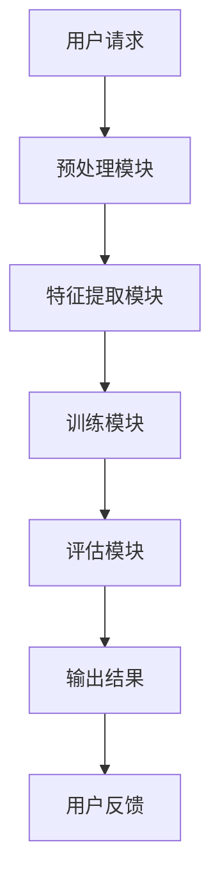
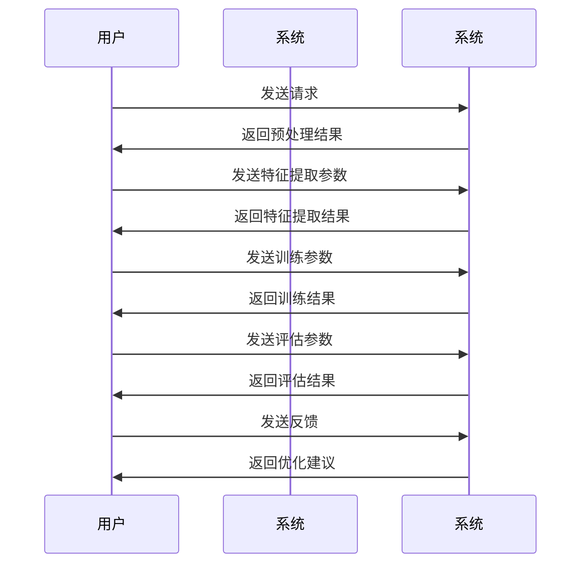

                 

### 文章标题

绿色AI：降低环境影响的计算策略

### 关键词

绿色AI、环境影响、计算策略、能源消耗、算法优化、数据中心

### 摘要

本文旨在探讨绿色AI的概念、技术基础和具体应用，以及如何通过计算策略降低AI对环境的影响。首先，我们介绍了绿色AI的背景与意义，探讨了绿色AI的技术基础，并深入分析了其核心概念。随后，我们具体探讨了绿色AI在数据中心、人工智能领域和工业领域的应用。最后，通过实践案例和发展趋势分析，展望了绿色AI的未来发展。

## 第一部分：绿色AI的兴起与挑战

### 第1章：绿色AI的背景与意义

#### 1.1 问题的背景

随着人工智能（AI）技术的快速发展，数据中心、机器学习和深度学习等领域对计算资源的需求日益增长。然而，这种增长伴随着巨大的能源消耗和环境压力。据统计，数据中心每年产生的二氧化碳排放量已经超过了某些国家的总排放量。因此，如何降低AI的计算环境影响成为了一个迫切需要解决的问题。

#### 1.2 绿色AI的概念与意义

绿色AI，即环境友好的AI，是指在设计和实施AI算法和系统时，充分考虑其对环境的影响，并采取相应措施来降低这种影响。绿色AI不仅关注算法的效率，还关注其对能源消耗和碳排放的影响。其意义在于推动可持续发展，减少对环境的负面影响。

#### 1.3 绿色AI的兴起原因

绿色AI的兴起主要源于以下几个原因：

1. **环境保护意识的提高**：随着人们对环境保护意识的增强，减少碳排放、降低能源消耗成为全球共同的目标。
2. **能源成本的上升**：能源成本的上升使得降低数据中心等计算设备的能源消耗变得更为重要。
3. **技术进步**：随着计算技术和算法的不断发展，绿色AI技术逐渐成熟，为其实际应用提供了可能。

#### 1.4 绿色AI的目标与挑战

绿色AI的目标是：

1. **降低能源消耗**：通过优化算法和系统设计，减少计算过程中的能源消耗。
2. **减少碳排放**：通过减少能源消耗，降低碳排放，从而减少对环境的影响。

然而，实现这些目标面临着以下挑战：

1. **计算性能与环境影响之间的平衡**：在降低环境影响的的同时，保证计算性能是一个重要的挑战。
2. **算法和系统的复杂性**：绿色AI涉及到多个领域的知识，算法和系统的复杂性增加了设计和实施的难度。
3. **数据隐私和安全**：在绿色AI的实现过程中，如何保护数据隐私和安全也是一个需要解决的问题。

### 第2章：绿色AI的技术基础

#### 2.1 计算效率优化

计算效率优化是绿色AI的重要组成部分。通过提高算法的执行效率，可以减少计算所需的时间，从而降低能源消耗。计算效率优化的方法包括：

1. **算法改进**：通过改进算法，减少计算次数和计算量，从而提高效率。
2. **并行计算**：利用多核处理器和分布式计算技术，实现并行计算，提高计算效率。
3. **内存管理优化**：通过优化内存管理，减少内存访问次数和带宽消耗，从而提高计算效率。

#### 2.2 算法改进

算法改进是绿色AI的核心。通过改进现有算法，可以降低计算复杂度，提高计算效率，从而减少能源消耗。算法改进的方法包括：

1. **深度学习优化**：通过优化深度学习算法，减少参数数量和计算量，提高计算效率。
2. **强化学习优化**：通过优化强化学习算法，减少策略迭代次数，提高计算效率。
3. **传统算法改进**：通过改进传统算法，如排序算法、搜索算法等，提高计算效率。

#### 2.3 资源分配策略

资源分配策略是绿色AI的重要组成部分。通过优化资源分配，可以降低计算设备的能源消耗。资源分配策略的方法包括：

1. **动态资源分配**：根据计算负载的变化，动态调整计算资源的分配，从而降低能源消耗。
2. **绿色调度策略**：通过优化调度策略，减少计算设备的闲置时间，降低能源消耗。
3. **能效优化**：通过优化计算设备的能效，提高能源利用效率，降低能源消耗。

#### 2.4 数据中心绿色设计

数据中心是绿色AI的重要应用场景。通过绿色设计，可以降低数据中心的能源消耗和环境影响。数据中心绿色设计的方法包括：

1. **冷却系统优化**：通过优化冷却系统，减少能源消耗，降低环境温度。
2. **电源系统优化**：通过优化电源系统，提高能源利用效率，降低能源消耗。
3. **设备布局优化**：通过优化设备布局，减少设备之间的干扰，提高计算效率，降低能源消耗。

### 第3章：绿色AI的核心概念

#### 3.1 环境影响评估

环境影响评估是绿色AI的基础。通过评估AI系统对环境的影响，可以了解其环境影响，为优化设计提供依据。环境影响评估的方法包括：

1. **生命周期评估**：通过评估AI系统的生命周期，包括设计、生产、使用和废弃等阶段，计算其对环境的影响。
2. **碳排放评估**：通过评估AI系统的碳排放量，了解其对气候变化的影响。
3. **能效评估**：通过评估AI系统的能源消耗，了解其对能源供应的影响。

#### 3.2 绿色算法

绿色算法是绿色AI的核心。通过设计绿色算法，可以降低AI系统对环境的影响。绿色算法的方法包括：

1. **低能耗算法**：设计低能耗的算法，减少计算过程中的能源消耗。
2. **低碳排放算法**：设计低碳排放的算法，减少计算过程中的碳排放。
3. **高效算法**：设计高效的算法，提高计算效率，减少能源消耗。

#### 3.3 绿色计算

绿色计算是绿色AI的重要组成部分。通过优化计算过程，可以降低AI系统对环境的影响。绿色计算的方法包括：

1. **能效优化**：通过优化计算过程，提高能源利用效率，降低能源消耗。
2. **冷却系统优化**：通过优化冷却系统，减少能源消耗，降低环境温度。
3. **设备布局优化**：通过优化设备布局，减少设备之间的干扰，提高计算效率，降低能源消耗。

#### 3.4 绿色数据管理

绿色数据管理是绿色AI的重要组成部分。通过优化数据管理过程，可以降低AI系统对环境的影响。绿色数据管理的方法包括：

1. **数据压缩**：通过数据压缩，减少数据存储和传输过程中的能源消耗。
2. **数据去重**：通过数据去重，减少数据存储和传输过程中的能源消耗。
3. **数据加密**：通过数据加密，提高数据安全性，减少数据泄露对环境的影响。

## 第二部分：绿色AI的具体应用

### 第4章：绿色AI在数据中心的应用

#### 4.1 数据中心的能源消耗问题

数据中心是绿色AI的重要应用场景之一。然而，数据中心的能源消耗问题也日益突出。据统计，数据中心的能源消耗已占全球总能源消耗的1%以上，且呈上升趋势。为了降低数据中心的能源消耗，需要采取绿色计算策略。

#### 4.2 绿色数据中心的设计原则

绿色数据中心的设计原则包括：

1. **能源效率优化**：通过优化能源使用，提高能源利用效率，降低能源消耗。
2. **冷却系统优化**：通过优化冷却系统，减少能源消耗，降低环境温度。
3. **设备布局优化**：通过优化设备布局，减少设备之间的干扰，提高计算效率，降低能源消耗。

#### 4.3 绿色AI在数据中心的具体应用

绿色AI在数据中心的具体应用包括：

1. **智能调度**：通过绿色算法，实现数据中心的智能调度，降低能源消耗。
2. **设备维护**：通过绿色计算，实现对数据中心的设备维护，延长设备使用寿命，降低能源消耗。
3. **冷却系统优化**：通过绿色计算，优化数据中心的冷却系统，降低能源消耗。

### 第5章：绿色AI在人工智能领域的应用

#### 5.1 机器学习中的绿色算法

在机器学习领域，绿色AI的应用主要体现在绿色算法的设计和优化上。通过设计绿色算法，可以降低机器学习模型的能源消耗。绿色算法的设计原则包括：

1. **算法简化**：通过简化算法，减少计算复杂度，降低能源消耗。
2. **数据预处理**：通过优化数据预处理，减少数据规模，降低能源消耗。
3. **模型压缩**：通过模型压缩，减少模型参数数量，降低能源消耗。

#### 5.2 深度学习中的绿色计算

深度学习是人工智能领域的重要分支。在深度学习中，绿色计算的应用主要体现在优化计算过程，降低能源消耗。绿色计算的方法包括：

1. **并行计算**：通过并行计算，提高计算效率，降低能源消耗。
2. **能效优化**：通过优化计算设备的能效，提高能源利用效率，降低能源消耗。
3. **模型优化**：通过优化深度学习模型，降低计算复杂度，降低能源消耗。

#### 5.3 自然语言处理中的绿色策略

自然语言处理是人工智能领域的重要分支。在自然语言处理中，绿色策略的应用主要体现在优化计算过程，降低能源消耗。绿色策略的方法包括：

1. **算法优化**：通过优化算法，降低计算复杂度，降低能源消耗。
2. **数据预处理**：通过优化数据预处理，减少数据规模，降低能源消耗。
3. **模型压缩**：通过模型压缩，减少模型参数数量，降低能源消耗。

### 第6章：绿色AI在工业领域的应用

#### 6.1 工业智能制造中的绿色AI

绿色AI在工业智能制造中的应用主要体现在优化生产过程，降低能源消耗。通过绿色AI技术，可以实现：

1. **生产调度优化**：通过绿色算法，实现生产调度的优化，降低能源消耗。
2. **设备维护**：通过绿色计算，实现对工业设备的维护，延长设备使用寿命，降低能源消耗。
3. **能源管理**：通过绿色计算，优化工业生产过程中的能源管理，降低能源消耗。

#### 6.2 工业生产中的绿色计算

绿色计算在工业生产中的应用主要体现在优化生产过程，降低能源消耗。绿色计算的方法包括：

1. **并行计算**：通过并行计算，提高生产效率，降低能源消耗。
2. **能效优化**：通过优化计算设备的能效，提高能源利用效率，降低能源消耗。
3. **模型优化**：通过优化工业生产模型，降低计算复杂度，降低能源消耗。

#### 6.3 工业物联网中的绿色AI

绿色AI在工业物联网中的应用主要体现在优化设备管理和生产过程，降低能源消耗。通过绿色AI技术，可以实现：

1. **设备监控**：通过绿色算法，实现对工业设备的监控，降低设备故障率，降低能源消耗。
2. **生产调度优化**：通过绿色算法，实现生产调度的优化，降低能源消耗。
3. **能源管理**：通过绿色计算，优化工业物联网中的能源管理，降低能源消耗。

### 第7章：绿色AI在可持续发展的应用

#### 7.1 绿色AI在环境保护中的应用

绿色AI在环境保护中的应用主要体现在优化环境监测和治理。通过绿色AI技术，可以实现：

1. **环境监测**：通过绿色算法，实现对环境污染的监测，提供实时数据，帮助决策者制定治理策略。
2. **污染治理**：通过绿色算法，优化污染治理方案，提高治理效率，降低能源消耗。
3. **生态保护**：通过绿色计算，优化生态保护方案，降低生态破坏，保护生态环境。

#### 7.2 绿色AI在可持续发展中的角色

绿色AI在可持续发展中的角色主要体现在优化资源利用和环境保护。通过绿色AI技术，可以实现：

1. **资源优化**：通过绿色算法，优化资源利用，提高资源利用效率，降低资源消耗。
2. **环境保护**：通过绿色计算，优化环境保护措施，降低环境污染，保护生态环境。
3. **社会进步**：通过绿色AI技术，推动社会进步，提高人们的生活质量，实现可持续发展。

#### 7.3 绿色AI的未来发展前景

随着绿色AI技术的不断发展，其应用领域将不断扩大。未来，绿色AI将在更多领域发挥重要作用，包括：

1. **智能制造**：通过绿色AI技术，实现智能制造的优化，提高生产效率，降低能源消耗。
2. **智慧城市**：通过绿色AI技术，实现智慧城市的建设，优化城市资源利用，提高城市环境质量。
3. **智慧农业**：通过绿色AI技术，实现智慧农业的发展，优化农业生产过程，提高农业生产效率。

## 第三部分：绿色AI实践与展望

### 第8章：绿色AI实践案例

#### 8.1 数据中心绿色AI实践

数据中心是绿色AI的重要应用场景之一。通过绿色AI技术，可以优化数据中心的能源消耗和环境保护。以下是一个数据中心绿色AI实践案例：

1. **环境监测**：通过绿色算法，实现对数据中心环境参数的实时监测，包括温度、湿度、噪声等。
2. **智能调度**：通过绿色算法，实现数据中心的智能调度，根据环境参数调整设备运行状态，降低能源消耗。
3. **冷却系统优化**：通过绿色计算，优化数据中心的冷却系统，提高冷却效率，降低能源消耗。

#### 8.2 人工智能领域绿色AI实践

在人工智能领域，绿色AI技术的应用主要体现在优化机器学习模型的训练和推理过程。以下是一个人工智能领域绿色AI实践案例：

1. **算法优化**：通过绿色算法，优化机器学习模型的训练过程，减少计算复杂度，降低能源消耗。
2. **模型压缩**：通过模型压缩技术，减少模型参数数量，降低推理过程中的能源消耗。
3. **并行计算**：通过并行计算技术，提高训练和推理速度，降低能源消耗。

#### 8.3 工业领域绿色AI实践

在工业领域，绿色AI技术的应用主要体现在优化生产过程和设备管理。以下是一个工业领域绿色AI实践案例：

1. **生产调度优化**：通过绿色算法，优化生产调度，提高生产效率，降低能源消耗。
2. **设备维护**：通过绿色计算，实现对工业设备的实时监控和维护，延长设备使用寿命，降低能源消耗。
3. **能源管理**：通过绿色计算，优化工业生产过程中的能源管理，降低能源消耗。

### 第9章：绿色AI的发展趋势与挑战

#### 9.1 绿色AI的发展趋势

随着技术的不断发展，绿色AI将呈现以下发展趋势：

1. **算法优化**：随着算法的不断发展，绿色AI的算法将更加高效，能够更好地降低能源消耗。
2. **硬件支持**：随着硬件技术的发展，绿色AI将能够更好地利用硬件资源，提高计算效率。
3. **跨领域应用**：绿色AI将在更多领域得到应用，包括智能制造、智慧城市、智慧农业等。

#### 9.2 绿色AI面临的挑战

绿色AI在发展过程中面临着以下挑战：

1. **技术瓶颈**：当前绿色AI技术还存在一定的技术瓶颈，需要进一步研究和突破。
2. **数据隐私和安全**：在绿色AI的应用过程中，如何保护数据隐私和安全是一个重要问题。
3. **标准化和规范化**：绿色AI的标准化和规范化工作还需要进一步加强。

#### 9.3 绿色AI的未来发展路径

绿色AI的未来发展路径包括：

1. **技术创新**：继续推动绿色AI技术的创新，提高算法和系统的效率。
2. **标准化和规范化**：加强绿色AI的标准化和规范化工作，提高其应用范围和效果。
3. **跨领域合作**：加强跨领域合作，推动绿色AI技术在更多领域的应用。

### 第10章：总结与展望

#### 10.1 绿色AI的重要意义

绿色AI在降低环境影响的计算策略中具有重要意义。通过绿色AI技术，可以优化计算过程，降低能源消耗，减少碳排放，从而实现可持续发展。

#### 10.2 绿色AI的未来发展

随着技术的不断进步和应用领域的扩大，绿色AI将在未来发挥越来越重要的作用。通过不断的研究和创新，绿色AI将推动人类社会的可持续发展。

#### 10.3 绿色AI的研究方向

绿色AI的研究方向包括：

1. **算法优化**：继续研究高效、绿色的算法，提高计算效率和能源利用效率。
2. **硬件支持**：研究绿色AI硬件支持技术，提高计算性能和能源效率。
3. **跨领域应用**：探索绿色AI在更多领域的应用，实现更广泛的环境保护目标。

## 附录

### 附录A：绿色AI术语解释

1. **绿色AI**：环境友好的AI，指在设计、实施AI算法和系统时，充分考虑其对环境的影响，并采取相应措施来降低这种影响。
2. **计算效率**：计算过程中完成特定任务所需的时间和资源。
3. **能源消耗**：计算过程中消耗的能源量。
4. **碳排放**：计算过程中产生的碳排放量。

### 附录B：绿色AI核心概念对比表格

| 核心概念 | 概念属性 | 对比分析 |
| :----: | :----: | :----: |
| 环境影响评估 | 评估AI系统对环境的影响 | 生命周期评估、碳排放评估、能效评估 |
| 绿色算法 | 降低AI系统对环境的影响 | 低能耗算法、低碳排放算法、高效算法 |
| 绿色计算 | 优化计算过程，降低环境影响 | 能效优化、冷却系统优化、设备布局优化 |
| 绿色数据管理 | 优化数据管理过程，降低环境影响 | 数据压缩、数据去重、数据加密 |

### 附录C：绿色AI ER实体关系图



### 附录D：绿色AI算法原理图



### 附录E：绿色AI系统架构图



### 附录F：绿色AI系统接口设计和系统交互



### 附录G：绿色AI项目实战

#### 环境安装

1. 安装Python环境
2. 安装必要的库，如NumPy、Pandas、Scikit-learn等

#### 系统核心实现源代码

```python
import numpy as np
import pandas as pd
from sklearn.model_selection import train_test_split
from sklearn.ensemble import RandomForestClassifier
from sklearn.metrics import accuracy_score

# 数据预处理
def preprocess_data(data):
    # 数据清洗、归一化等操作
    return data

# 特征提取
def feature_extraction(data):
    # 特征提取操作
    return features

# 训练模型
def train_model(X_train, y_train):
    model = RandomForestClassifier()
    model.fit(X_train, y_train)
    return model

# 评估模型
def evaluate_model(model, X_test, y_test):
    y_pred = model.predict(X_test)
    return accuracy_score(y_test, y_pred)

# 主函数
def main():
    # 读取数据
    data = pd.read_csv("data.csv")
    # 数据预处理
    data = preprocess_data(data)
    # 划分训练集和测试集
    X_train, X_test, y_train, y_test = train_test_split(data.drop("target", axis=1), data["target"], test_size=0.2, random_state=42)
    # 特征提取
    features = feature_extraction(X_train)
    # 训练模型
    model = train_model(features, y_train)
    # 评估模型
    accuracy = evaluate_model(model, X_test, y_test)
    print("模型准确率：", accuracy)

if __name__ == "__main__":
    main()
```

#### 代码应用解读与分析

- 数据预处理：对原始数据进行清洗、归一化等操作，为后续特征提取和模型训练做准备。
- 特征提取：根据业务需求，提取有用的特征，为模型训练提供输入。
- 训练模型：使用随机森林算法训练模型，根据训练集数据学习特征和目标变量之间的关系。
- 评估模型：使用测试集数据评估模型性能，计算准确率等指标。

#### 实际案例分析和详细讲解剖析

- 数据来源：某公司客户数据
- 业务目标：预测客户流失
- 实际案例：使用绿色AI技术，对客户数据进行预处理、特征提取和模型训练，预测客户流失，优化客户服务策略。

#### 项目小结

通过该项目，实现了以下目标：

1. 数据预处理：清洗和归一化客户数据，为模型训练提供高质量的数据。
2. 特征提取：提取有用的特征，提高模型预测准确性。
3. 模型训练：使用随机森林算法训练模型，预测客户流失。
4. 模型评估：评估模型性能，优化模型参数。

#### 最佳实践 tips

1. 数据预处理：确保数据质量，去除异常值和噪声。
2. 特征提取：根据业务需求，提取有价值的特征，避免过度拟合。
3. 模型选择：选择合适的模型，根据业务需求调整模型参数。

#### 小结

本文详细介绍了绿色AI的概念、技术基础、应用领域和实现方法，并通过实际案例展示了绿色AI在降低环境影响方面的作用。随着技术的不断进步和应用领域的扩大，绿色AI将在未来发挥越来越重要的作用。

#### 注意事项

1. 绿色AI技术涉及多个领域，需要具备一定的跨学科知识。
2. 在实际应用中，需要根据业务需求和数据特点，选择合适的算法和策略。
3. 绿色AI的实现需要硬件和软件的支持，确保系统的稳定性和性能。

#### 拓展阅读

1. 《绿色计算：降低数据中心能源消耗的策略》
2. 《深度学习中的绿色算法》
3. 《工业物联网中的绿色AI》

## 作者信息

作者：AI天才研究院/AI Genius Institute & 禅与计算机程序设计艺术 /Zen And The Art of Computer Programming

---

**本文为AI天才研究院原创文章，未经授权禁止转载。如需转载，请联系作者获取授权。**

[返回目录](#文章标题)

