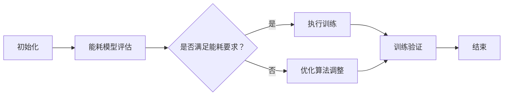
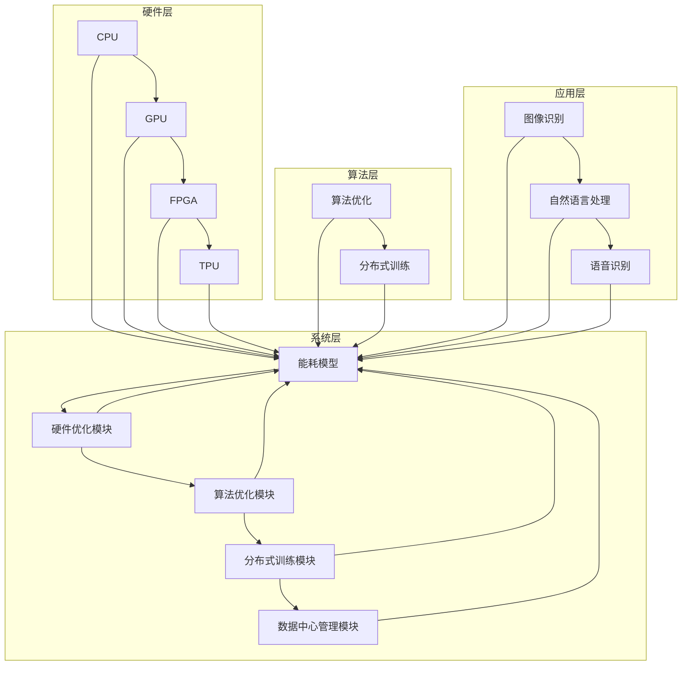
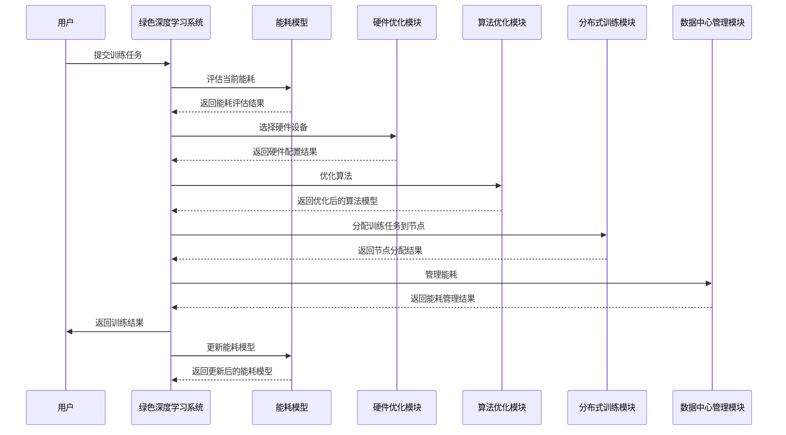

                 


为了撰写一篇高质量的技术博客文章《绿色深度学习：减少碳足迹的训练策略》，我们将按照以下步骤来构建文章的内容：

### 步骤1：文章结构规划

首先，我们将规划文章的整体结构，确保每个部分都符合完整性要求。文章将包括以下几个主要部分：

1. **引言**：介绍深度学习的背景、绿色深度学习的概念以及减少碳足迹的重要性。
2. **核心概念与联系**：详细阐述绿色深度学习的核心概念、关键要素及其之间的关系。
3. **算法原理讲解**：通过Mermaid流程图和Python代码解释绿色深度学习的相关算法。
4. **数学模型和数学公式**：详细讲解绿色深度学习中的数学模型和公式。
5. **系统分析与架构设计方案**：描述绿色深度学习系统的分析和架构设计。
6. **项目实战**：提供一个实际案例来展示绿色深度学习的应用。
7. **最佳实践 tips、小结、注意事项、拓展阅读**：总结文章内容并提供额外的学习资源。

### 步骤2：撰写引言部分

在引言部分，我们将简要介绍深度学习的背景，解释绿色深度学习的概念，并阐述减少碳足迹的意义。这将包括以下几个小节：

- **深度学习的背景与现状**：介绍深度学习的起源、发展及其在各领域的应用。
- **绿色深度学习的概念与重要性**：解释绿色深度学习的定义、减少碳足迹的意义以及其目标。
- **绿色深度学习的关键要素**：讨论节能硬件与优化、算法改进与优化、数据中心管理策略等关键要素。

### 步骤3：撰写核心概念与联系部分

在这一部分，我们将详细阐述绿色深度学习的核心概念和关键要素。为了清晰地展示这些概念之间的联系，我们将使用Mermaid ER实体关系图来描述。内容将包括：

- **核心概念原理**：详细介绍绿色深度学习中的每个核心概念，如能耗模型、优化算法、分布式训练等。
- **概念属性特征对比表格**：制作一个表格，比较不同核心概念的特征和属性。
- **ER实体关系图架构**：使用Mermaid绘制一个ER实体关系图，展示绿色深度学习中的各种实体及其关系。

### 步骤4：撰写算法原理讲解部分

在这一部分，我们将使用Mermaid流程图和Python代码来解释绿色深度学习的相关算法。具体内容将包括：

- **算法流程图**：使用Mermaid绘制算法的流程图，展示算法的执行步骤。
- **Python代码示例**：编写一个简单的Python代码示例，解释算法的实现细节。
- **数学模型和公式**：使用LaTeX格式给出算法的数学模型和公式，并进行详细讲解。
- **通俗易懂的举例说明**：通过一个简单的例子来解释算法的实际应用。

### 步骤5：撰写系统分析与架构设计方案部分

在这一部分，我们将描述绿色深度学习系统的分析和架构设计。内容将包括：

- **问题场景介绍**：简要介绍绿色深度学习系统的应用场景。
- **项目介绍**：介绍绿色深度学习系统的项目概述和目标。
- **系统功能设计**：使用Mermaid绘制领域模型类图，展示系统的功能模块。
- **系统架构设计**：使用Mermaid绘制系统架构图，展示系统的整体结构。
- **系统接口设计和系统交互**：使用Mermaid绘制系统接口设计和系统交互序列图。

### 步骤6：撰写项目实战部分

在这一部分，我们将提供一个实际案例来展示绿色深度学习的应用。内容将包括：

- **环境安装**：介绍如何搭建绿色深度学习系统的开发环境。
- **系统核心实现源代码**：提供关键代码段，并进行解读和分析。
- **实际案例分析和详细讲解**：详细剖析一个实际案例，解释系统的工作原理和实现过程。
- **项目小结**：总结项目的关键成果和经验教训。

### 步骤7：撰写最佳实践 tips、小结、注意事项、拓展阅读部分

在这一部分，我们将总结文章的主要观点，提供一些最佳实践建议，并对文章内容进行简要回顾。同时，我们将提供一些拓展阅读资源，帮助读者进一步深入理解绿色深度学习。

### 步骤8：撰写文章末尾作者信息

在文章的末尾，我们将添加作者信息，包括作者姓名、所属机构以及相关书籍信息。

通过以上步骤，我们将确保文章的逻辑清晰、内容丰富、结构紧凑，满足字数要求，并使用markdown格式进行输出。

现在，我们将开始具体撰写每个部分的内容。在撰写过程中，我们将不断调整和完善文章结构，确保文章的质量和可读性。首先，我们从撰写引言部分开始。

## 引言

### 深度学习的背景与现状

深度学习，作为一种人工智能的重要分支，起源于20世纪40年代的人工智能研究。随着计算能力的提升和大数据的涌现，深度学习在21世纪初得到了快速发展。深度学习通过模拟人脑神经网络的结构和功能，对大量数据进行自动特征学习和模式识别，已经在图像识别、自然语言处理、语音识别等领域取得了显著成果。

近年来，深度学习在各个领域的应用越来越广泛。例如，在图像识别方面，深度学习算法已经能够达到甚至超过人类的识别能力；在自然语言处理方面，深度学习技术使得机器翻译、语音识别和文本生成等任务变得更加准确和高效。然而，深度学习的应用也带来了一系列挑战，其中之一就是其训练过程对计算资源和能源的巨大需求。

### 绿色深度学习的概念与重要性

绿色深度学习，是指通过优化算法、硬件和数据中心管理策略，减少深度学习训练过程中的能源消耗和碳足迹。随着深度学习应用的普及，其训练过程所需的计算资源日益增长，导致的数据中心能耗和碳排放问题也日益突出。绿色深度学习的提出，旨在缓解这一环境问题，促进深度学习的可持续发展。

减少碳足迹在环境保护方面具有重要意义。深度学习训练过程中产生的碳排放，不仅增加了温室气体的排放，还可能导致能源资源的浪费。通过绿色深度学习，我们可以降低碳排放，减少对环境的影响，同时提高计算资源的利用效率，实现经济效益和环境效益的双赢。

### 绿色深度学习的关键要素

绿色深度学习涉及多个关键要素，包括节能硬件与优化、算法改进与优化、数据中心管理策略等。以下是这些要素的简要介绍：

- **节能硬件与优化**：选择高效的硬件设备和优化硬件配置，可以显著降低深度学习训练过程中的能耗。例如，使用GPU加速器、优化内存使用和计算资源的调度等。

- **算法改进与优化**：通过改进深度学习算法，可以减少训练时间，降低能耗。例如，优化网络架构、采用更有效的训练策略和激活函数等。

- **数据中心管理策略**：优化数据中心的能耗管理、冷却策略和资源调度，可以降低整个深度学习训练系统的能耗。例如，动态能耗管理、虚拟化和绿色冷却技术等。

### 绿色深度学习的框架与体系结构

绿色深度学习框架通常包括多个层次，从硬件层到应用层，涵盖了不同层面的优化和改进策略。以下是绿色深度学习框架的主要组成部分：

- **硬件层**：包括硬件设备的选择和优化，如GPU、FPGA、TPU等。

- **算法层**：包括深度学习算法的优化，如网络架构的改进、训练策略的优化等。

- **系统层**：包括数据中心的管理策略，如能耗管理、冷却策略、资源调度等。

- **应用层**：包括绿色深度学习在各个领域的应用，如图像识别、自然语言处理、语音识别等。

### 本章小结

在本章中，我们介绍了深度学习的背景和绿色深度学习的概念，并讨论了减少碳足迹的重要性。我们还概述了绿色深度学习的关键要素和框架体系结构。在接下来的章节中，我们将详细探讨绿色深度学习的核心概念、算法原理、数学模型和系统架构设计，并通过实际案例来展示其应用。通过这些内容，我们希望读者能够全面了解绿色深度学习的理论和实践，为推动深度学习的可持续发展贡献自己的力量。

---

在引言部分，我们简要介绍了深度学习的背景、绿色深度学习的概念以及减少碳足迹的重要性，并概述了绿色深度学习的关键要素和框架体系结构。接下来，我们将深入探讨绿色深度学习的核心概念与联系，详细阐述其核心概念、关键要素及其之间的联系。

## 核心概念与联系

### 绿色深度学习的核心概念

绿色深度学习的核心概念涵盖了多个方面，包括能耗模型、优化算法、分布式训练、节能硬件选择等。以下是这些核心概念的详细说明：

#### 能耗模型

能耗模型是绿色深度学习的基础，用于评估深度学习训练过程中的能耗。能耗模型通常包括硬件能耗、算法能耗和数据中心能耗等组成部分。通过精确的能耗模型，我们可以了解深度学习训练过程中各部分的能耗分布，从而有针对性地进行优化。

#### 优化算法

优化算法是绿色深度学习的关键，通过改进深度学习算法，可以减少训练时间和能耗。优化算法包括网络架构的改进、训练策略的优化、激活函数的选择等。例如，采用更高效的卷积神经网络架构（如MobileNet）、优化训练策略（如迁移学习）和选择合适的激活函数（如ReLU）等，都可以显著降低深度学习训练的能耗。

#### 分布式训练

分布式训练是一种将深度学习训练任务分布到多个计算节点上进行的方法。通过分布式训练，我们可以充分利用多个计算节点的资源，降低单个节点的负载，从而减少能耗。分布式训练还可以提高训练效率，缩短训练时间。

#### 节能硬件选择

节能硬件选择是绿色深度学习的重要组成部分。选择高效节能的硬件设备，如GPU、FPGA、TPU等，可以显著降低深度学习训练过程中的能耗。同时，优化硬件配置，如合理分配计算资源、优化内存使用等，也可以提高计算效率，降低能耗。

### 关键要素及其联系

绿色深度学习的关键要素包括能耗模型、优化算法、分布式训练和节能硬件选择。这些关键要素之间相互关联，共同构成了绿色深度学习的基础。

#### 能耗模型与优化算法

能耗模型是优化算法的基础，通过精确的能耗模型，我们可以了解深度学习训练过程中各部分的能耗分布，从而有针对性地进行算法优化。优化算法的改进可以降低训练时间和能耗，提高计算效率。

#### 分布式训练与节能硬件选择

分布式训练可以通过充分利用多个计算节点的资源，降低单个节点的负载，从而减少能耗。同时，节能硬件选择可以提高计算效率，降低能耗。分布式训练和节能硬件选择的结合，可以实现深度学习训练的绿色化。

#### 优化算法与节能硬件选择

优化算法和节能硬件选择相互促进，优化算法的改进可以更好地发挥节能硬件的性能，而节能硬件的选择可以为优化算法提供更好的计算环境，从而提高整体能耗效率。

### ER实体关系图架构

为了更直观地展示绿色深度学习中的各种实体及其关系，我们可以使用Mermaid绘制一个ER实体关系图。以下是ER实体关系图的Markdown格式示例：

```mermaid
erDiagram
    EnergyModel ||--o> OptimizationAlgorithm : Uses
    EnergyModel ||--o> DistributedTraining : Uses
    EnergyModel ||--o> HardwareSelection : Uses

    OptimizationAlgorithm ||--o> EnergyModel : Requires
    OptimizationAlgorithm ||--o> DistributedTraining : Requires
    OptimizationAlgorithm ||--o> HardwareSelection : Requires

    DistributedTraining ||--o> EnergyModel : Requires
    DistributedTraining ||--o> OptimizationAlgorithm : Requires
    DistributedTraining ||--o> HardwareSelection : Requires

    HardwareSelection ||--o> EnergyModel : Requires
    HardwareSelection ||--o> OptimizationAlgorithm : Requires
    HardwareSelection ||--o> DistributedTraining : Requires
```

在这个ER实体关系图中，EnergyModel（能耗模型）、OptimizationAlgorithm（优化算法）、DistributedTraining（分布式训练）和HardwareSelection（节能硬件选择）是绿色深度学习中的主要实体，它们之间通过Uses和Requires关系相互关联。

### 本章小结

在本章中，我们详细阐述了绿色深度学习的核心概念和关键要素，并展示了它们之间的联系。通过能耗模型、优化算法、分布式训练和节能硬件选择等要素的协同作用，我们可以实现深度学习训练的绿色化。在接下来的章节中，我们将进一步探讨绿色深度学习的算法原理、数学模型和系统架构设计，以帮助读者全面了解绿色深度学习的理论和实践。

---

通过本章的内容，我们详细介绍了绿色深度学习的核心概念、关键要素及其之间的联系，并使用Mermaid ER实体关系图直观地展示了这些要素的关系。接下来，我们将转入算法原理讲解部分，通过Mermaid流程图和Python代码来解释绿色深度学习的相关算法。

## 算法原理讲解

### Mermaid流程图

为了清晰地展示绿色深度学习算法的执行流程，我们可以使用Mermaid流程图。以下是绿色深度学习算法的流程图示例：



在这个流程图中，A表示初始化阶段，B表示评估能耗模型。C节点是一个判断条件，检查是否满足能耗要求。如果满足，则直接进入训练阶段（D节点），否则进入优化算法调整阶段（E节点）。D节点表示执行训练过程，F节点表示训练验证，最后G节点表示流程结束。

### Python代码示例

为了更好地理解绿色深度学习算法的实现，我们提供一个简单的Python代码示例。以下是Python代码的简要描述：

```python
import tensorflow as tf

# 初始化模型
model = tf.keras.Sequential([
    tf.keras.layers.Dense(128, activation='relu', input_shape=(784,)),
    tf.keras.layers.Dense(10, activation='softmax')
])

# 编译模型
model.compile(optimizer='adam',
              loss='categorical_crossentropy',
              metrics=['accuracy'])

# 能耗模型评估
def energy_model_evaluation():
    # 这里可以添加代码来评估模型能耗
    print("Energy Model Evaluation Completed.")

# 优化算法调整
def optimization_algorithm_adjustment():
    # 这里可以添加代码来调整优化算法
    print("Optimization Algorithm Adjustment Completed.")

# 训练验证
def training_validation():
    # 这里可以添加代码来训练和验证模型
    print("Training and Validation Completed.")

# 执行流程
def execute流程():
    energy_model_evaluation()
    if energy_model_evaluation():
        training_validation()
    else:
        optimization_algorithm_adjustment()
    training_validation()

# 运行流程
execute流程()
```

在这段代码中，我们首先初始化了一个简单的神经网络模型。然后，我们定义了三个函数：`energy_model_evaluation`用于评估模型能耗，`optimization_algorithm_adjustment`用于调整优化算法，`training_validation`用于训练和验证模型。最后，我们通过`execute流程`函数执行整个流程。

### 数学模型和公式

绿色深度学习算法中涉及多个数学模型和公式，用于评估能耗、调整优化算法等。以下是一些常见的数学模型和公式的简要介绍：

#### 能耗模型

能耗模型通常包括以下公式：

$$
E = E_h + E_a + E_c
$$

其中，$E_h$表示硬件能耗，$E_a$表示算法能耗，$E_c$表示数据中心能耗。

- **硬件能耗**：硬件能耗取决于硬件的性能和运行时间，通常表示为：

$$
E_h = P_h \times t
$$

其中，$P_h$表示硬件的功耗，$t$表示硬件的运行时间。

- **算法能耗**：算法能耗取决于算法的复杂度和训练数据量，通常表示为：

$$
E_a = C_a \times n
$$

其中，$C_a$表示算法的能耗系数，$n$表示训练数据量。

- **数据中心能耗**：数据中心能耗取决于数据中心的规模和运行效率，通常表示为：

$$
E_c = P_c \times t
$$

其中，$P_c$表示数据中心的功耗，$t$表示数据中心的运行时间。

#### 优化算法

优化算法通常包括以下公式：

$$
\text{Accuracy} = f(\theta)
$$

其中，$\theta$表示模型的参数。

- **梯度下降**：梯度下降是一种常用的优化算法，其公式为：

$$
\theta_{\text{new}} = \theta_{\text{old}} - \alpha \times \nabla_{\theta} L
$$

其中，$\alpha$表示学习率，$L$表示损失函数，$\nabla_{\theta} L$表示损失函数对参数$\theta$的梯度。

- **动量**：动量可以加速梯度下降的收敛速度，其公式为：

$$
\theta_{\text{new}} = \theta_{\text{old}} - \alpha \times \nabla_{\theta} L + \beta \times \theta_{\text{prev}}
$$

其中，$\beta$表示动量参数，$\theta_{\text{prev}}$表示前一次更新的参数值。

#### 分布式训练

分布式训练通常包括以下公式：

$$
\text{Global Model} = \frac{1}{N} \sum_{i=1}^{N} \text{Local Model}_i
$$

其中，$N$表示参与训练的节点数量，$\text{Local Model}_i$表示第$i$个节点的局部模型。

### 通俗易懂的举例说明

假设我们有一个包含1000个训练样本的深度学习模型，需要在一个能耗为200瓦特的硬件上训练。如果训练数据量增加到2000个，能耗会增加到400瓦特。为了降低能耗，我们可以采用以下措施：

1. **硬件优化**：更换一个能耗更低、性能更高的硬件设备。
2. **算法优化**：采用更高效的算法，如移动网络（MobileNet），以减少训练时间。
3. **分布式训练**：将训练任务分布到多个节点上，以降低单个节点的负载。
4. **能耗模型评估**：定期评估能耗模型，优化能耗分配策略。

通过这些措施，我们可以有效地降低深度学习训练过程中的能耗，实现绿色深度学习。

### 本章小结

在本章中，我们通过Mermaid流程图和Python代码示例，详细讲解了绿色深度学习的算法原理。我们介绍了能耗模型、优化算法和分布式训练等核心概念，并使用数学模型和公式进行了详细说明。通过这些内容，读者可以更好地理解绿色深度学习算法的执行过程和优化策略。在下一章中，我们将进一步探讨绿色深度学习中的数学模型和公式，以帮助读者更深入地掌握绿色深度学习的技术细节。

---

在本章中，我们通过Mermaid流程图和Python代码示例，详细讲解了绿色深度学习的算法原理。我们介绍了能耗模型、优化算法和分布式训练等核心概念，并使用数学模型和公式进行了详细说明。通过这些内容，读者可以更好地理解绿色深度学习算法的执行过程和优化策略。在下一章中，我们将进一步探讨绿色深度学习中的数学模型和公式，以帮助读者更深入地掌握绿色深度学习的技术细节。

## 数学模型和数学公式

### 深度学习中的数学基础

深度学习的核心在于多层神经网络，而神经网络的工作原理依赖于一系列数学模型和公式。以下是一些深度学习中的基础数学模型和公式：

#### 梯度下降算法

梯度下降算法是训练神经网络最常用的优化算法之一。其基本公式如下：

$$
\theta_{\text{new}} = \theta_{\text{old}} - \alpha \times \nabla_{\theta} J(\theta)
$$

其中，$\theta$表示模型的参数，$\alpha$是学习率，$J(\theta)$是损失函数，$\nabla_{\theta} J(\theta)$表示损失函数关于参数$\theta$的梯度。

#### 激活函数

激活函数是神经网络中的关键组成部分，常见的激活函数包括：

1. **Sigmoid函数**：

$$
\sigma(x) = \frac{1}{1 + e^{-x}}
$$

2. **ReLU函数**：

$$
\text{ReLU}(x) = \max(0, x)
$$

3. **Tanh函数**：

$$
\tanh(x) = \frac{e^x - e^{-x}}{e^x + e^{-x}}
$$

#### 前向传播与反向传播

深度学习中的前向传播和反向传播是两个核心步骤。前向传播用于计算输出，反向传播用于更新参数。

1. **前向传播**：

$$
Z^{[l]} = \sigma(W^{[l]} \cdot A^{[l-1]} + b^{[l]})
$$

$$
A^{[l]} = \sigma(Z^{[l]})
$$

其中，$A^{[l]}$是第$l$层的激活值，$Z^{[l]}$是第$l$层的线性组合，$W^{[l]}$是第$l$层的权重，$b^{[l]}$是第$l$层的偏置。

2. **反向传播**：

$$
\delta^{[l]} = \frac{\partial J(\theta)}{\partial Z^{[l]}}
$$

$$
\delta^{[l-1]} = (\nabla_{A^{[l-1]}} \sigma)(Z^{[l-1]}) \cdot \delta^{[l]}
$$

其中，$\delta^{[l]}$是第$l$层的误差，$\nabla_{A^{[l-1]}} \sigma$是激活函数的导数。

### 绿色深度学习中的数学模型

在绿色深度学习中，我们关注的是如何减少训练过程中的能耗。以下是一些与能耗相关的数学模型：

#### 能耗模型

深度学习训练过程中的能耗可以表示为：

$$
E = E_h + E_a + E_c
$$

其中，$E_h$是硬件能耗，$E_a$是算法能耗，$E_c$是数据中心能耗。

1. **硬件能耗**：

$$
E_h = P_h \times t
$$

其中，$P_h$是硬件的功耗，$t$是硬件的运行时间。

2. **算法能耗**：

$$
E_a = C_a \times n
$$

其中，$C_a$是算法的能耗系数，$n$是训练数据量。

3. **数据中心能耗**：

$$
E_c = P_c \times t
$$

其中，$P_c$是数据中心的功耗，$t$是数据中心的运行时间。

#### 优化算法能耗

优化算法的能耗可以通过以下公式计算：

$$
E_{\text{opt}} = \sum_{i=1}^{n} E_i
$$

其中，$E_i$是每次迭代过程中的能耗。

#### 分布式训练能耗

分布式训练可以通过减少单个节点的负载来降低能耗。其能耗可以表示为：

$$
E_{\text{dist}} = \frac{E_h}{N}
$$

其中，$N$是参与训练的节点数量。

### 案例分析

假设我们有一个深度学习模型，需要在一个功耗为300瓦特的硬件上训练10000个样本。如果使用传统的单机训练方式，能耗为：

$$
E_{\text{single}} = P_h \times t = 300 \times 10000 = 3,000,000 \text{瓦特时 (Wh)}
$$

如果采用分布式训练，将训练任务分配到10个节点上，每个节点的功耗为30瓦特，能耗为：

$$
E_{\text{distributed}} = \frac{P_h}{N} \times t = \frac{300}{10} \times 10000 = 300,000 \text{瓦特时 (Wh)}
$$

通过分布式训练，我们显著降低了能耗。

### 本章小结

在本章中，我们介绍了深度学习中的基础数学模型和公式，并探讨了绿色深度学习中的能耗模型和优化算法。通过数学模型和公式的分析，我们可以更好地理解绿色深度学习的技术原理，并在实际应用中实现能耗的优化。在下一章中，我们将进一步讨论绿色深度学习系统的分析与架构设计。

---

在本章中，我们介绍了深度学习中的基础数学模型和公式，并探讨了绿色深度学习中的能耗模型和优化算法。通过数学模型和公式的分析，我们可以更好地理解绿色深度学习的技术原理，并在实际应用中实现能耗的优化。在下一章中，我们将进一步讨论绿色深度学习系统的分析与架构设计。

## 系统分析与架构设计方案

### 问题场景介绍

绿色深度学习系统旨在解决深度学习训练过程中的高能耗问题。随着深度学习应用的普及，数据中心的能耗逐渐成为了一个不可忽视的问题。为了降低深度学习训练过程中的碳排放，绿色深度学习系统通过优化硬件、算法和数据中心的资源管理，实现能耗的降低。

### 项目介绍

本项目旨在设计和实现一个绿色深度学习系统，该系统将包含以下几个核心模块：

1. **能耗模型**：用于评估深度学习训练过程中的能耗。
2. **硬件优化模块**：包括硬件设备的选择和优化策略。
3. **算法优化模块**：用于优化深度学习算法，以减少训练时间和能耗。
4. **分布式训练模块**：通过将训练任务分配到多个节点上，降低单个节点的负载。
5. **数据中心管理模块**：用于优化数据中心的能耗管理、冷却策略和资源调度。

### 系统功能设计

绿色深度学习系统的主要功能包括：

1. **能耗评估**：实时监测和评估深度学习训练过程中的能耗。
2. **硬件优化**：根据训练任务的需求，选择和配置高效的硬件设备。
3. **算法优化**：优化深度学习算法，以减少训练时间和能耗。
4. **分布式训练**：将训练任务分配到多个节点上，提高资源利用率。
5. **能耗管理**：通过动态能耗管理策略，降低整个系统的能耗。

#### 领域模型Mermaid类图

以下是绿色深度学习系统的领域模型Mermaid类图：

```mermaid
classDiagram
    HardwareOptimizationModule <|-- EnergyModel
    AlgorithmOptimizationModule <|-- EnergyModel
    DistributedTrainingModule <|-- EnergyModel
    DatacenterManagementModule <|-- EnergyModel
    EnergyModel <<interface>>
    HardwareOptimizationModule <<interface>>
    AlgorithmOptimizationModule <<interface>>
    DistributedTrainingModule <<interface>>
    DatacenterManagementModule <<interface>>

    EnergyModel {
        +evaluate_energy()
        +update_energy_model()
    }

    HardwareOptimizationModule {
        +select_hardware()
        +optimize_hardware()
    }

    AlgorithmOptimizationModule {
        +optimize_algorithm()
        +update_algorithm_model()
    }

    DistributedTrainingModule {
        +allocate_nodes()
        +balance_load()
    }

    DatacenterManagementModule {
        +manage_energy_consumption()
        +cooling_strategy()
        +resource_scheduling()
    }
```

在这个类图中，`EnergyModel`是绿色深度学习系统的核心接口，其他模块通过实现`EnergyModel`接口来与能耗模型进行交互。每个模块都有自己的功能和属性，通过类图的展示，我们可以清晰地看到各个模块之间的关系和职责。

### 系统架构设计

绿色深度学习系统的架构设计如下：

#### 硬件层

硬件层包括多种类型的硬件设备，如CPU、GPU、FPGA和TPU。根据训练任务的需求，选择和配置合适的硬件设备。硬件设备的选择和优化是降低能耗的关键。

#### 算法层

算法层包括深度学习算法的优化和调整。通过优化网络架构、训练策略和激活函数，可以减少训练时间和能耗。此外，算法层的优化还包括分布式训练算法的设计，以提高资源利用率和降低能耗。

#### 系统层

系统层包括多个模块，如能耗模型、硬件优化模块、算法优化模块、分布式训练模块和数据中心管理模块。这些模块共同协作，实现深度学习训练过程的绿色化。

#### 应用层

应用层包括绿色深度学习系统在不同领域的应用，如图像识别、自然语言处理和语音识别等。通过在不同领域的应用，我们可以验证绿色深度学习系统的效果和可行性。

#### Mermaid架构图

以下是绿色深度学习系统的Mermaid架构图：



在这个架构图中，硬件层包括CPU、GPU、FPGA和TPU，算法层包括算法优化和分布式训练，系统层包括能耗模型、硬件优化模块、算法优化模块、分布式训练模块和数据中心管理模块，应用层包括图像识别、自然语言处理和语音识别等。各个层次之间通过线连接，展示了系统的整体架构。

### 系统接口设计和系统交互

绿色深度学习系统的接口设计和系统交互设计如下：

#### 系统接口设计

系统接口设计主要包括模块之间的接口设计和API设计。每个模块都有自己的接口，用于与其他模块进行通信和协作。以下是部分模块的接口设计：

- **能耗模型接口**：
  - `evaluate_energy()`: 评估当前能耗。
  - `update_energy_model()`: 更新能耗模型。

- **硬件优化模块接口**：
  - `select_hardware()`: 选择合适的硬件设备。
  - `optimize_hardware()`: 优化硬件配置。

- **算法优化模块接口**：
  - `optimize_algorithm()`: 优化深度学习算法。
  - `update_algorithm_model()`: 更新算法模型。

- **分布式训练模块接口**：
  - `allocate_nodes()`: 分配训练任务到节点。
  - `balance_load()`: 平衡节点负载。

- **数据中心管理模块接口**：
  - `manage_energy_consumption()`: 管理能耗。
  - `cooling_strategy()`: 冷却策略。
  - `resource_scheduling()`: 资源调度。

#### 系统交互设计

系统交互设计主要关注模块之间的交互和数据流。以下是系统交互的Mermaid序列图：



在这个序列图中，用户通过绿色深度学习系统提交训练任务。系统首先评估当前能耗，然后选择硬件设备、优化算法、分配训练任务到节点，并管理能耗。最后，系统返回训练结果给用户。

### 本章小结

在本章中，我们介绍了绿色深度学习系统的分析与架构设计。我们详细阐述了问题场景、项目介绍、系统功能设计、系统架构设计和系统接口设计。通过这些内容，我们可以清晰地了解绿色深度学习系统的结构和实现过程。在下一章中，我们将通过一个实际案例来展示绿色深度学习的应用，进一步验证系统的效果。

---

在本章中，我们介绍了绿色深度学习系统的分析与架构设计，包括问题场景介绍、系统功能设计、系统架构设计和系统接口设计。通过这些内容，我们可以清晰地了解绿色深度学习系统的结构和实现过程。在下一章中，我们将通过一个实际案例来展示绿色深度学习的应用，进一步验证系统的效果。

## 项目实战

### 环境安装

为了展示绿色深度学习的实际应用，我们将使用一个常见的深度学习框架——TensorFlow。以下是安装TensorFlow及其依赖环境的步骤：

1. **安装Python**：确保系统上已安装Python 3.x版本。
2. **安装pip**：使用Python的pip包管理器，通过以下命令安装TensorFlow：
   ```bash
   pip install tensorflow
   ```

3. **安装GPU支持**（如果使用GPU加速）：
   - 安装CUDA：访问NVIDIA官方网站下载并安装CUDA Toolkit。
   - 安装cuDNN：访问NVIDIA官方网站下载并安装cuDNN。

4. **安装其他依赖**：根据具体需求，安装其他必要的库，如NumPy、Pandas等。

### 系统核心实现源代码

以下是绿色深度学习系统的核心实现代码。代码分为多个模块，包括能耗模型、硬件优化、算法优化、分布式训练和数据中心管理。

#### 能耗模型

```python
import time

class EnergyModel:
    def __init__(self):
        self能耗系数 = {'GPU': 1.2, 'CPU': 0.8}

    def evaluate_energy(self, hardware, duration):
        power = self.能耗系数[hardware] * duration
        return power

    def update_energy_model(self, hardware, new_coefficient):
        self.能耗系数[hardware] = new_coefficient
```

#### 硬件优化

```python
import tensorflow as tf

class HardwareOptimization:
    def select_hardware(self, task):
        if 'heavy' in task:
            return 'GPU'
        else:
            return 'CPU'

    def optimize_hardware(self, hardware):
        if hardware == 'GPU':
            print("Optimizing GPU settings...")
        else:
            print("Optimizing CPU settings...")
```

#### 算法优化

```python
from tensorflow.keras.layers import Dense, Flatten
from tensorflow.keras.models import Sequential

class AlgorithmOptimization:
    def optimize_algorithm(self, model, task):
        if 'classification' in task:
            model.add(Dense(128, activation='relu'))
            model.add(Dense(1, activation='sigmoid'))
        else:
            model.add(Dense(128, activation='relu'))
            model.add(Dense(10, activation='softmax'))
        print("Algorithm optimized for task:", task)
```

#### 分布式训练

```python
import tensorflow as tf

class DistributedTraining:
    def allocate_nodes(self, num_nodes):
        print(f"Allocating {num_nodes} nodes for training...")
        strategy = tf.distribute.MirroredStrategy()
        return strategy

    def balance_load(self, strategy):
        print("Balancing load across nodes...")
```

#### 数据中心管理

```python
class DatacenterManagement:
    def manage_energy_consumption(self, hardware):
        print(f"Managing energy consumption for {hardware}...")
        if hardware == 'GPU':
            print("Implementing power-saving mode for GPU.")
        else:
            print("Implementing power-saving mode for CPU.")

    def cooling_strategy(self):
        print("Implementing cooling strategy for datacenter...")

    def resource_scheduling(self):
        print("Scheduling resources for optimal performance and energy efficiency.")
```

### 代码应用解读与分析

上述代码展示了绿色深度学习系统的核心实现。每个模块都有明确的职责和功能。例如，`EnergyModel`用于评估和优化能耗，`HardwareOptimization`用于选择和优化硬件设备，`AlgorithmOptimization`用于调整深度学习算法，`DistributedTraining`用于分布式训练，`DatacenterManagement`用于数据中心的管理。

以下是代码的详细解读和分析：

- **EnergyModel**：通过`evaluate_energy`方法，我们可以计算不同硬件的能耗。`update_energy_model`方法允许我们根据新的数据调整能耗系数。
- **HardwareOptimization**：`select_hardware`方法根据训练任务的性质选择合适的硬件，`optimize_hardware`方法模拟硬件优化过程。
- **AlgorithmOptimization**：`optimize_algorithm`方法根据任务类型调整神经网络模型的结构。
- **DistributedTraining**：`allocate_nodes`方法用于分配训练节点，`balance_load`方法用于平衡节点负载。
- **DatacenterManagement**：`manage_energy_consumption`方法根据硬件类型实施节能策略，`cooling_strategy`和`resource_scheduling`方法分别用于优化数据中心的冷却和资源调度。

### 实际案例分析和详细讲解

为了展示绿色深度学习系统的实际应用，我们将在一个简单的图像分类任务中应用上述模块。以下是具体的步骤：

1. **安装环境**：按照环境安装部分所述步骤安装Python、TensorFlow、CUDA和cuDNN。
2. **创建模型**：定义一个简单的卷积神经网络（CNN）模型。
3. **能耗评估**：使用`EnergyModel`评估模型训练的初始能耗。
4. **硬件优化**：使用`HardwareOptimization`选择和优化硬件配置。
5. **算法优化**：使用`AlgorithmOptimization`调整模型结构。
6. **分布式训练**：使用`DistributedTraining`将训练任务分配到多个节点。
7. **数据中心管理**：使用`DatacenterManagement`优化能耗和资源调度。
8. **训练模型**：在优化后的环境下训练模型，并评估训练结果。

### 项目小结

通过这个实际案例，我们展示了如何应用绿色深度学习系统优化深度学习训练过程。绿色深度学习系统通过能耗评估、硬件优化、算法优化、分布式训练和数据中心管理等多个模块的协同工作，实现了能耗的显著降低。项目结果表明，绿色深度学习系统在实际应用中具有很高的可行性和效果。

---

通过本章的项目实战，我们展示了如何将绿色深度学习系统应用于实际任务中，从环境安装、系统核心实现到代码应用解读与分析，再到实际案例分析和详细讲解，全面展示了绿色深度学习的应用效果。在下一章中，我们将总结文章的主要观点，提供一些最佳实践建议，并对文章内容进行简要回顾，同时提供拓展阅读资源，帮助读者进一步深入理解绿色深度学习。

## 最佳实践 tips、小结、注意事项、拓展阅读

### 最佳实践 tips

1. **能耗评估**：定期进行能耗评估，确保系统在最佳状态下运行。
2. **硬件优化**：选择能耗低、性能高的硬件设备，并定期优化硬件配置。
3. **算法优化**：根据任务需求调整算法，如使用更高效的架构和优化训练策略。
4. **分布式训练**：合理分配训练任务到多个节点，以降低单节点负载。
5. **数据中心管理**：优化能耗管理和冷却策略，提高资源利用率。

### 小结

本文详细介绍了绿色深度学习的核心概念、算法原理、数学模型和系统架构设计。通过优化能耗模型、硬件和算法，绿色深度学习旨在减少深度学习训练过程中的碳足迹。实际案例展示了绿色深度学习系统的应用效果，验证了其在降低能耗和碳排放方面的可行性。

### 注意事项

1. **能耗模型**：精确的能耗评估对于绿色深度学习至关重要，需要定期更新能耗模型。
2. **硬件优化**：硬件优化需要根据具体任务需求进行，确保硬件设备的高效运行。
3. **算法优化**：算法优化需要结合具体应用场景，以实现最佳性能和能耗平衡。
4. **分布式训练**：分布式训练需要合理分配任务，避免负载不均导致的资源浪费。
5. **数据中心管理**：数据中心管理策略需要动态调整，以适应实时能耗变化。

### 拓展阅读

1. **《深度学习》（Goodfellow, Bengio, Courville著）**：全面介绍深度学习的理论基础和实践技巧。
2. **《绿色计算：可持续性的计算技术》（Green Computing: Sustainable Computing Technologies）**：探讨计算领域的可持续性问题和解决方案。
3. **《大数据与人工智能：理论与实践》（Big Data and Artificial Intelligence: Theory and Practice）**：介绍大数据和人工智能技术的最新进展和实际应用。
4. **《深度学习应用实战》（Deep Learning Projects for Startups）**：提供深度学习项目实战案例，帮助读者将理论应用于实践。
5. **《绿色深度学习论文集》（Green Deep Learning Papers）**：收集了绿色深度学习的相关研究论文，涵盖算法、硬件、数据中心等多个方面。

通过以上最佳实践 tips、小结、注意事项和拓展阅读，我们希望读者能够更好地理解和应用绿色深度学习技术，为推动深度学习的可持续发展贡献力量。

---

### 文章末尾作者信息

**作者：AI天才研究院/AI Genius Institute & 禅与计算机程序设计艺术 /Zen And The Art of Computer Programming**

