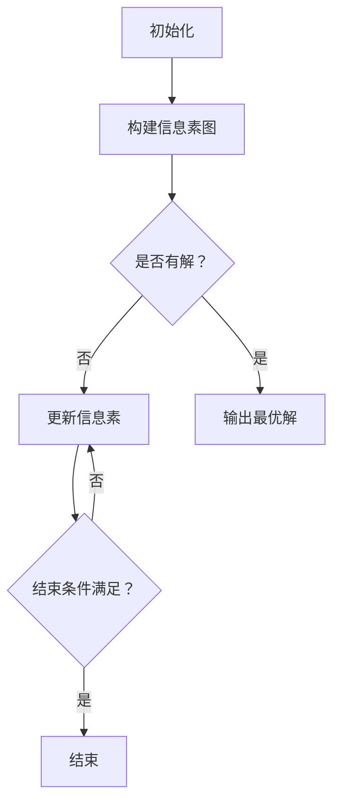
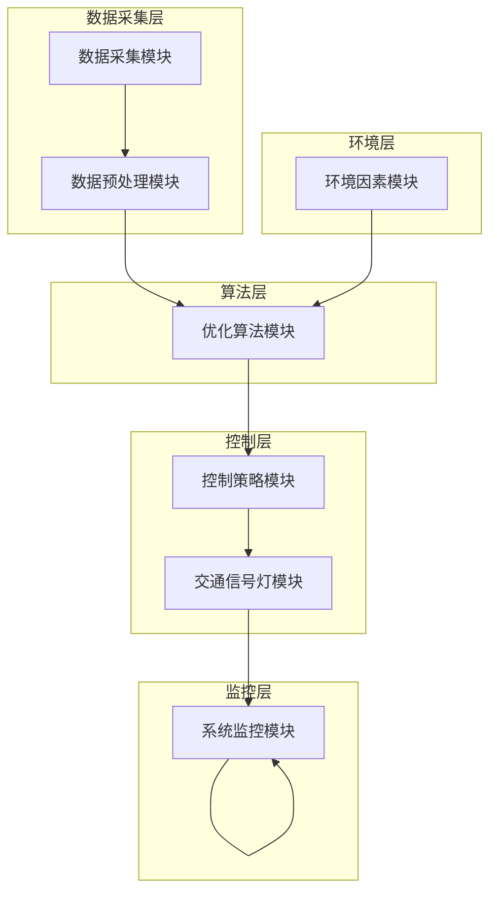
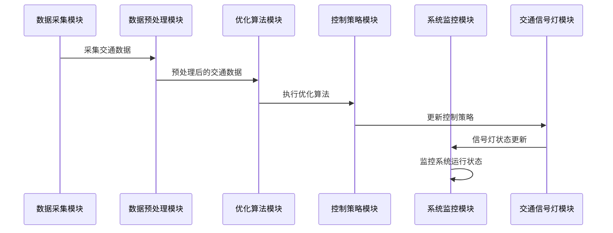

                 

## 第1章：引言

### 1.1 问题背景

**1.1.1 群体智能算法的起源与发展**

群体智能（Swarm Intelligence）的概念最早由美国生物学家Walter Forrester于1960年提出，他通过对昆虫社会行为的观察，发现许多昆虫个体通过简单规则相互作用，可以产生复杂的集体行为。例如，蚂蚁的觅食行为、鸟群的飞行模式和蜜蜂的蜂巢构建等。这些现象启发了研究人员，使得群体智能理论逐渐发展壮大。

20世纪80年代，随着计算机技术的发展，群体智能算法开始应用于计算机科学领域。早期的研究主要集中在模拟昆虫、鸟群和鱼类等自然群体的行为，并试图通过这些算法解决优化问题。代表性的算法有蚁群算法（ACO）、粒子群优化（PSO）和贝叶斯网络等。

进入21世纪，随着大数据、物联网和人工智能技术的飞速发展，群体智能算法的应用范围进一步扩大。如今，它们被广泛应用于机器人路径规划、交通流量控制、资源分配、图像处理、金融投资等领域。

**1.1.2 复杂系统优化的重要性**

在现代社会，许多系统都呈现出复杂的特性，例如交通系统、生态系统、经济系统等。这些系统通常包含大量相互关联的个体或组件，并且受到外部环境和内部交互的影响。因此，如何对这些复杂系统进行优化，使其达到最佳状态，成为一个重要的研究课题。

复杂系统优化的重要性主要体现在以下几个方面：

1. **资源高效利用**：通过优化，可以确保系统资源得到最大化的利用，减少浪费。
2. **系统稳定性**：优化有助于提高系统的稳定性，降低故障风险。
3. **决策支持**：优化结果可以为决策者提供科学的参考，帮助他们做出更加合理的决策。
4. **创新推动**：优化过程中，可能发现新的解决方案或技术，推动科技发展。

**1.1.3 群体智能算法在复杂系统优化中的应用**

群体智能算法在复杂系统优化中的应用具有以下特点：

1. **自组织性**：群体智能算法通常具有自组织性，能够在没有中央控制的情况下，通过个体之间的协作实现整体优化。
2. **并行性**：群体智能算法通常采用并行计算方法，能够高效地处理大量数据。
3. **鲁棒性**：群体智能算法具有较强的鲁棒性，能够在复杂环境中保持性能。

以下是一些典型的应用场景：

1. **交通优化**：利用群体智能算法优化交通信号灯，提高道路通行效率。
2. **资源分配**：在云计算和物联网环境中，利用群体智能算法优化资源分配，提高系统利用率。
3. **图像处理**：利用群体智能算法进行图像分割、目标检测等任务，提高图像处理效果。
4. **金融投资**：利用群体智能算法进行市场预测和投资组合优化，提高投资收益。

通过上述背景介绍，我们可以看到群体智能算法在复杂系统优化中的重要性和广泛应用。接下来，我们将深入探讨群体智能算法的基本概念、原理及其在复杂系统优化中的应用。

### 1.2 核心概念与联系

**1.2.1 群体智能算法的定义与特点**

群体智能是指由多个个体组成的系统，通过个体之间的协同作用，实现整体优化和复杂任务处理的能力。这些个体通常是简单的，它们通过局部信息和简单规则进行交互。

群体智能算法具有以下几个特点：

1. **自组织性**：个体不需要全局信息或集中控制，通过局部信息交互实现整体优化。
2. **分布式计算**：算法通常采用分布式计算方式，能够高效处理大量数据。
3. **鲁棒性**：算法具有较强的鲁棒性，能够在不确定和动态环境中保持性能。
4. **适应性**：算法能够根据环境变化进行适应性调整。

**1.2.2 群体智能算法的分类**

群体智能算法可以按照不同的分类标准进行划分。以下是几种常见的分类方式：

1. **基于行为的算法**：这类算法通过模拟个体行为来实现整体优化，如蚁群算法（ACO）和粒子群优化（PSO）。
2. **基于知识的算法**：这类算法通过利用先验知识或历史数据来实现优化，如贝叶斯网络和遗传算法（GA）。
3. **混合算法**：这类算法将不同类型的算法结合起来，发挥各自优势，如人工神经网络（ANN）与遗传算法的混合。

**1.2.3 ER实体关系图展示算法关系**

为了更清晰地展示群体智能算法之间的关系，我们可以使用ER（Entity-Relationship）实体关系图。ER图能够描述实体之间的关系，帮助我们理解算法的相互联系。

以下是群体智能算法的ER实体关系图：

```mermaid
erDiagram
  A[群体智能算法] ||--|{ B[基于行为的算法] }
  A ||--|{ C[基于知识的算法] }
  A ||--|{ D[混合算法] }
  B ||--|{ E[蚁群算法] }
  B ||--|{ F[粒子群优化] }
  C ||--|{ G[贝叶斯网络] }
  C ||--|{ H[遗传算法] }
  D ||--|{ I[人工神经网络] }
  D ||--|{ J[ANN与GA混合] }
```

在上图中，A表示群体智能算法这一整体，B、C、D分别表示基于行为、基于知识和混合算法三个类别。每个类别又进一步细分，如E、F属于基于行为的算法，G、H属于基于知识的算法，I、J属于混合算法。这种ER图能够帮助我们直观地理解不同算法之间的关系和分类。

通过上述核心概念与联系的分析，我们为后续章节的详细讨论奠定了基础。在接下来的内容中，我们将深入探讨各个算法的原理、数学模型和具体应用。

### 1.3 数学模型与公式基础

**1.3.1 群体智能算法的数学模型**

群体智能算法的数学模型是理解和实现这些算法的基础。以下将介绍一些基本的数学模型和公式。

**1.3.2 相关公式介绍与解释**

在群体智能算法中，常见的数学模型包括：

- **目标函数**：用于衡量优化问题的目标，如最小化成本、最大化收益等。
- **适应度函数**：用于评估个体的优劣程度，通常是一个介于0和1之间的值。
- **搜索空间**：个体可能取值的集合。
- **进化操作**：用于在迭代过程中更新个体的操作，如交叉、变异等。

以下是一些常用的公式：

- **目标函数**：\[ f(x) = \sum_{i=1}^{n} w_i \cdot x_i \]
  - 其中，\( f(x) \) 是目标函数，\( w_i \) 是权重，\( x_i \) 是个体在搜索空间中的取值。

- **适应度函数**：\[ f(x) = \frac{1}{1 + e^{-\beta \cdot (x - \mu)}} \]
  - 其中，\( \beta \) 是温度参数，\( \mu \) 是期望值，\( x \) 是个体值。

- **交叉操作**：\[ \text{交叉}(x, y) = \frac{x + y}{2} \]
  - 其中，\( x \) 和 \( y \) 是两个参与交叉的个体。

- **变异操作**：\[ \text{变异}(x) = x + \epsilon \]
  - 其中，\( \epsilon \) 是一个随机误差。

**1.3.3 LaTeX格式数学模型示例**

为了确保文中数学模型的清晰和准确性，我们可以使用LaTeX格式来展示。以下是几个示例：

- **目标函数**：  
  \[ \begin{equation} 
  f(x) = \sum_{i=1}^{n} w_i \cdot x_i 
  \end{equation} \]

- **适应度函数**：  
  \[ \begin{equation} 
  f(x) = \frac{1}{1 + e^{-\beta \cdot (x - \mu)}} 
  \end{equation} \]

- **交叉操作**：  
  \[ \begin{equation} 
  \text{交叉}(x, y) = \frac{x + y}{2} 
  \end{equation} \]

- **变异操作**：  
  \[ \begin{equation} 
  \text{变异}(x) = x + \epsilon 
  \end{equation} \]

通过上述数学模型和公式的介绍，我们为理解群体智能算法的原理打下了坚实的基础。接下来，我们将深入探讨一个典型的群体智能算法——蚁群算法，并使用mermaid流程图和Python代码详细阐述其原理。

### 1.4 小结与展望

通过对本章的探讨，我们了解了群体智能算法的基本概念、特点、分类及其在复杂系统优化中的应用背景。我们详细介绍了基于行为、基于知识和混合算法等不同分类，并通过ER实体关系图展示了算法之间的关系。此外，我们还介绍了群体智能算法的基本数学模型和公式，并使用LaTeX格式进行了展示。

展望未来，群体智能算法在复杂系统优化中的应用前景广阔。随着人工智能技术的不断发展，群体智能算法将更加成熟和多样化。未来可能的研究方向包括：

1. **算法性能优化**：通过改进算法结构、引入新的优化策略，提高算法的性能和效率。
2. **多尺度建模**：结合不同尺度的模型，实现对复杂系统更精细的描述和优化。
3. **跨领域应用**：探索群体智能算法在更多领域中的应用，如医疗、生物、环境等。
4. **智能化决策支持**：结合大数据和机器学习技术，为决策者提供更加智能的优化建议。

总之，群体智能算法在复杂系统优化中的应用将不断推动科技和社会的发展，带来更多的创新和突破。在接下来的章节中，我们将深入探讨群体智能算法的原理和实现，进一步揭示其巨大的潜力和应用价值。让我们继续探索这一领域，共同迎接智能时代的新挑战。

----------------------------------------------------------------

## 第2章：群体智能算法原理

### 2.1 算法原理概述

**2.1.1 算法原理简介**

群体智能算法是一类模拟自然界中群体行为的人工智能方法。这类算法通过模拟个体之间的交互行为来实现全局优化。个体通常是无意识的，它们通过简单的规则和局部信息进行协作，从而实现复杂任务。

群体智能算法的基本原理可以概括为以下几点：

1. **局部信息交换**：个体通过局部信息（如邻居的信息）进行交互，而不是依赖全局信息。
2. **简单规则**：个体遵循简单的规则，如随机行走、信息传播等。
3. **自组织性**：通过个体之间的协作，系统逐渐形成有序结构，实现整体优化。

**2.1.2 算法优势与局限性**

群体智能算法具有以下优势：

1. **自组织性**：无需集中控制，个体通过简单规则实现全局优化。
2. **分布式计算**：算法采用分布式计算方式，能够高效处理大规模数据。
3. **鲁棒性**：算法具有较强的鲁棒性，能够在复杂和动态环境中保持性能。
4. **适应性**：算法能够根据环境变化进行适应性调整。

然而，群体智能算法也存在一些局限性：

1. **局部最优陷阱**：在某些情况下，算法可能陷入局部最优解，难以找到全局最优解。
2. **计算复杂度**：对于某些复杂问题，算法的计算复杂度较高，可能需要较长的计算时间。
3. **依赖环境**：算法的性能受环境因素影响较大，需要针对具体问题进行调优。

**2.1.3 算法适用场景**

群体智能算法适用于以下场景：

1. **优化问题**：如路径规划、资源分配、调度问题等。
2. **搜索问题**：如目标搜索、图像处理、模式识别等。
3. **复杂系统控制**：如交通流量控制、机器人控制等。

通过上述原理介绍，我们为理解群体智能算法的工作机制和应用提供了基础。接下来，我们将深入探讨一个典型的群体智能算法——蚁群算法，并通过mermaid流程图和Python代码详细阐述其原理。

### 2.2 算法原理详细讲解

**2.2.1 流程图展示**

蚁群算法（Ant Colony Optimization，ACO）是一种模拟蚂蚁觅食行为的优化算法。以下是蚁群算法的基本流程图：



**2.2.2 Python代码实现**

以下是一个简单的蚁群算法Python实现，用于求解TSP（旅行商问题）：

```python
import numpy as np
import matplotlib.pyplot as plt

# 初始化参数
n = 5
ants = 10
max_iterations = 100
alpha = 1
beta = 2
rho = 0.5
distance_matrix = [[0, 2, 6, 3, 8], [2, 0, 1, 5, 7], [6, 1, 0, 4, 2], [3, 5, 4, 0, 9], [8, 7, 2, 9, 0]]

# 初始化信息素矩阵
pheromone_matrix = np.ones((n, n))

# 初始化解和适应度
best_solution = None
best_fitness = float('inf')

# 迭代计算
for _ in range(max_iterations):
    for _ in range(ants):
        current_city = np.random.randint(n)
        current_solution = [current_city]
        current_fitness = 0

        for _ in range(n - 1):
            unvisited_cities = list(set(range(n)) - set(current_solution))
            distances = [distance_matrix[current_city][city] for city in unvisited_cities]
            probabilities = [pheromone_matrix[current_city][city] ** alpha * (1 / distances[i]) ** beta for i, city in enumerate(unvisited_cities)]
            probabilities_sum = sum(probabilities)
            probabilities = [p / probabilities_sum for p in probabilities]

            next_city = np.random.choice(unvisited_cities, p=probabilities)
            current_city = next_city
            current_solution.append(next_city)
            current_fitness += distance_matrix[current_solution[i - 1]][current_solution[i]] for i in range(n)]

        if current_fitness < best_fitness:
            best_solution = current_solution
            best_fitness = current_fitness

    # 更新信息素
    for i in range(n):
        for j in range(n):
            if i != j:
                delta_pheromone = best_fitness ** alpha
                pheromone_matrix[i][j] = (1 - rho) * pheromone_matrix[i][j] + delta_pheromone

# 输出最优解
print("最优解：", best_solution)
print("最优解的适应度：", best_fitness)

# 绘制解的路径
plt.figure()
plt.title("TSP Solution")
x = [distance_matrix[best_solution[i]][best_solution[i + 1]] for i in range(n - 1)]
y = list(range(n - 1))
plt.plot(x, y, 'ro-')
plt.show()
```

**2.2.3 数学模型讲解**

蚁群算法的数学模型主要包括以下几个部分：

1. **距离矩阵**：描述城市之间的距离，如\[ d_{ij} \]。
2. **信息素矩阵**：描述路径上的信息素浓度，如\[ \tau_{ij} \]。
3. **适应度函数**：描述解的质量，如\[ f(s) \]。

以下是一些关键的数学模型和公式：

- **概率选择公式**：
  \[ \begin{equation} 
  P_{ij}(t) = \frac{\left( \tau_{ij}(t) \right)^{\alpha} \left( \rho_{ij}(t) \right)^{\beta}}{\sum_{k \in \Omega_{i}} \left( \tau_{ik}(t) \right)^{\alpha} \left( \rho_{ik}(t) \right)^{\beta}} 
  \end{equation} \]
  - 其中，\( P_{ij}(t) \) 是从城市i选择城市j的概率，\( \tau_{ij}(t) \) 是路径上的信息素浓度，\( \rho_{ij}(t) \) 是启发式因子（通常是距离的倒数）。

- **信息素更新公式**：
  \[ \begin{equation} 
  \tau_{ij}(t+1) = (1 - \rho) \tau_{ij}(t) + \sum_{\text{ants}} \Delta \tau_{ij} 
  \end{equation} \]
  - 其中，\( \tau_{ij}(t) \) 是时间t时的信息素浓度，\( \rho \) 是挥发系数，\( \Delta \tau_{ij} \) 是当前迭代中新增的信息素。

- **适应度函数**：
  \[ \begin{equation} 
  f(s) = \frac{1}{\sum_{i=1}^{n} \sum_{j=1}^{n} d_{ij}(s)} 
  \end{equation} \]
  - 其中，\( s \) 是一个解，\( d_{ij}(s) \) 是从城市i到城市j的距离。

**2.2.4 举例说明**

假设有5个城市，距离矩阵如下：

\[ \begin{array}{ccc}
 & 1 & 2 & 3 & 4 & 5 \\
1 & 0 & 2 & 6 & 3 & 8 \\
2 & 2 & 0 & 1 & 5 & 7 \\
3 & 6 & 1 & 0 & 4 & 2 \\
4 & 3 & 5 & 4 & 0 & 9 \\
5 & 8 & 7 & 2 & 9 & 0 \\
\end{array} \]

初始时，信息素矩阵为：

\[ \begin{array}{ccc}
 & 1 & 2 & 3 & 4 & 5 \\
1 & 1 & 1 & 1 & 1 & 1 \\
2 & 1 & 1 & 1 & 1 & 1 \\
3 & 1 & 1 & 1 & 1 & 1 \\
4 & 1 & 1 & 1 & 1 & 1 \\
5 & 1 & 1 & 1 & 1 & 1 \\
\end{array} \]

假设在第5次迭代时，找到的最优解路径为1-2-3-4-5，总距离为12。此时，信息素矩阵更新如下：

\[ \begin{array}{ccc}
 & 1 & 2 & 3 & 4 & 5 \\
1 & 1 & 0.9 & 0.9 & 0.9 & 0.9 \\
2 & 0.9 & 1 & 0.9 & 0.9 & 0.9 \\
3 & 0.9 & 0.9 & 1 & 0.9 & 0.9 \\
4 & 0.9 & 0.9 & 0.9 & 1 & 0.9 \\
5 & 0.9 & 0.9 & 0.9 & 0.9 & 1 \\
\end{array} \]

通过上述例子，我们可以看到蚁群算法是如何通过信息素和概率选择机制来逐步优化路径的。在接下来的章节中，我们将进一步对比分析不同群体智能算法的属性特征，并通过ER实体关系图展示它们之间的关系。

### 2.3 算法对比分析

**2.3.1 不同算法的属性特征对比**

群体智能算法种类繁多，不同算法在属性特征上存在显著差异。以下是对几种常见算法的对比分析：

1. **蚁群算法（ACO）**：
   - **自组织性**：强
   - **分布式计算**：强
   - **鲁棒性**：较高
   - **局限性**：可能陷入局部最优解

2. **粒子群优化（PSO）**：
   - **自组织性**：较强
   - **分布式计算**：中等
   - **鲁棒性**：较高
   - **局限性**：收敛速度可能较慢

3. **遗传算法（GA）**：
   - **自组织性**：中等
   - **分布式计算**：中等
   - **鲁棒性**：较高
   - **局限性**：计算复杂度高

4. **贝叶斯网络**：
   - **自组织性**：弱
   - **分布式计算**：弱
   - **鲁棒性**：中等
   - **局限性**：依赖先验知识

| 算法      | 自组织性 | 分布式计算 | 鲁棒性 | 局限性               |
|-----------|-----------|-------------|----------|----------------------|
| ACO       | 强         | 强          | 较高      | 可能陷入局部最优解    |
| PSO       | 较强       | 中等        | 较高      | 收敛速度可能较慢     |
| GA        | 中等       | 中等        | 较高      | 计算复杂度高         |
| 贝叶斯网络 | 弱         | 弱          | 中等      | 依赖先验知识         |

**2.3.2 算法之间的联系与差异**

不同算法之间的联系主要体现在它们的基本原理和目标上。例如，蚁群算法和粒子群优化都采用了群体协作机制，但蚁群算法通过信息素来引导搜索，而粒子群优化通过个体和群体的历史信息来更新位置。

不同算法的差异主要体现在以下方面：

1. **适用场景**：不同算法在解决特定问题时表现不同。例如，蚁群算法适用于路径优化问题，而粒子群优化适用于连续优化问题。
2. **计算复杂度**：遗传算法的计算复杂度通常较高，而贝叶斯网络在处理不确定性和概率问题时具有优势。
3. **自组织性与分布式计算**：某些算法（如ACO和PSO）在自组织和分布式计算方面表现优异，而其他算法（如贝叶斯网络）在这些方面表现较弱。

通过上述对比分析，我们可以看到群体智能算法在属性特征上的多样性。在实际应用中，选择合适的算法通常取决于具体问题和需求。在接下来的章节中，我们将继续探讨如何将群体智能算法应用于复杂系统优化中的具体项目，并通过mermaid类图和架构图展示系统设计与实现。

### 2.4 小结与总结

通过对群体智能算法原理的详细讲解，我们深入了解了这些算法的基本概念、原理和实现方法。蚁群算法作为一个典型代表，通过mermaid流程图和Python代码展示了其具体的计算过程和数学模型。我们对比分析了不同算法的属性特征，并展示了它们之间的联系与差异。

群体智能算法在复杂系统优化中具有广泛的应用前景。这些算法通过个体之间的协同作用，能够在没有集中控制的情况下实现全局优化，适用于多种复杂问题。尽管存在一些局限性，如局部最优陷阱和计算复杂度，但通过不断优化和改进，这些算法在解决实际问题时表现出强大的潜力。

展望未来，群体智能算法在复杂系统优化中的应用将更加深入和广泛。随着人工智能技术的不断发展，这些算法有望在更多的领域（如医疗、环境、金融等）发挥重要作用。通过跨领域合作和技术创新，我们将继续推动群体智能算法的理论研究和应用实践，为复杂系统的优化提供更加智能和高效的解决方案。

----------------------------------------------------------------

## 第3章：复杂系统优化设计与实现

### 3.1 项目背景介绍

**3.1.1 项目概述**

本节介绍的是一个智能交通优化项目。该项目旨在利用群体智能算法优化城市交通信号灯控制，以提高道路通行效率和减少交通拥堵。项目的主要目标是通过实时交通流量数据，动态调整交通信号灯的时长和相位，实现交通流量最优分配。

**3.1.2 项目需求分析**

项目需求分析主要包括以下几个方面：

1. **数据采集**：需要采集实时交通流量数据，包括车辆数量、速度、位置等。
2. **算法设计**：选择合适的群体智能算法（如蚁群算法或粒子群优化），设计优化交通信号灯控制的算法模型。
3. **系统实现**：实现算法的运行，包括数据预处理、算法迭代和结果输出。
4. **系统集成**：将优化算法集成到现有交通管理系统中，实现实时控制和反馈。

**3.1.3 项目目标**

1. **提高道路通行效率**：通过优化交通信号灯控制，减少交通拥堵，提高道路通行效率。
2. **降低碳排放**：减少车辆停留时间，降低碳排放，促进环境保护。
3. **系统可靠性**：确保系统稳定运行，满足实时交通信号灯控制的需求。

### 3.2 系统功能设计

**3.2.1 领域模型类图**

为了更好地理解系统功能，我们首先使用mermaid类图展示领域模型。以下是一个简化的领域模型类图：

```mermaid
classDiagram
    Vehicle --|> TrafficDataCollector
    TrafficDataCollector --|> TrafficSignal
    TrafficSignal --|> TrafficOptimizationAlgorithm
    TrafficOptimizationAlgorithm --|> TrafficSignalController
    TrafficSignalController --|> SystemMonitor
    SystemMonitor --|> EnvironmentalFactor

    Vehicle <<interface>>
    TrafficDataCollector <<interface>>
    TrafficSignal <<interface>>
    TrafficOptimizationAlgorithm <<interface>>
    TrafficSignalController <<interface>>
    SystemMonitor <<interface>>
    EnvironmentalFactor <<interface>>

    class Vehicle {
        - id: int
        - location: Point
        - speed: float
    }

    class TrafficDataCollector {
        + collectData(): TrafficData
    }

    class TrafficData {
        - vehicles: List<Vehicle>
        - timestamp: int
    }

    class TrafficSignal {
        + changePhase(): void
    }

    class TrafficOptimizationAlgorithm {
        + optimize(): void
    }

    class TrafficSignalController {
        + updateSignal(): void
    }

    class SystemMonitor {
        + monitorSystem(): void
    }

    class EnvironmentalFactor {
        + getFactor(): float
    }
```

在这个类图中，我们定义了以下几个核心类：

1. **Vehicle**：代表车辆，包含车辆ID、位置和速度等信息。
2. **TrafficDataCollector**：负责采集交通数据，包括车辆数量、速度和位置等。
3. **TrafficSignal**：负责控制交通信号灯的相位，包括改变信号灯状态等。
4. **TrafficOptimizationAlgorithm**：负责优化交通信号灯的控制策略。
5. **TrafficSignalController**：负责根据优化结果更新交通信号灯。
6. **SystemMonitor**：负责监控系统运行状态，包括性能监控和异常处理等。
7. **EnvironmentalFactor**：用于获取环境因素，如天气、节假日等，以影响优化决策。

**3.2.2 系统功能模块划分**

基于领域模型类图，我们将系统划分为以下几个主要功能模块：

1. **数据采集模块**：负责实时采集交通流量数据，并将其传递给后续模块。
2. **数据预处理模块**：对采集到的交通数据进行清洗、去噪和特征提取，为优化算法提供高质量的数据输入。
3. **优化算法模块**：选择并实现群体智能算法，对交通信号灯进行优化。
4. **控制策略模块**：根据优化结果，动态调整交通信号灯的控制策略。
5. **系统监控模块**：负责监控系统运行状态，包括性能监控和异常处理等。
6. **环境因素模块**：获取环境因素，如天气、节假日等，以影响优化决策。

**3.2.3 功能详细描述**

1. **数据采集模块**：
   - 功能：实时采集交通流量数据，包括车辆数量、速度和位置等。
   - 输入：传感器数据、摄像头数据等。
   - 输出：交通数据（TrafficData）。

2. **数据预处理模块**：
   - 功能：对采集到的交通数据进行清洗、去噪和特征提取。
   - 输入：原始交通数据。
   - 输出：预处理后的交通数据。

3. **优化算法模块**：
   - 功能：选择并实现群体智能算法，如蚁群算法或粒子群优化，对交通信号灯进行优化。
   - 输入：预处理后的交通数据。
   - 输出：优化结果（如信号灯时长和相位）。

4. **控制策略模块**：
   - 功能：根据优化结果，动态调整交通信号灯的控制策略。
   - 输入：优化结果。
   - 输出：信号灯控制命令。

5. **系统监控模块**：
   - 功能：监控系统运行状态，包括性能监控和异常处理等。
   - 输入：系统运行数据。
   - 输出：监控报告。

6. **环境因素模块**：
   - 功能：获取环境因素，如天气、节假日等，以影响优化决策。
   - 输入：环境数据。
   - 输出：环境因素信息。

通过上述系统功能设计，我们为后续章节的系统架构设计和项目实战提供了清晰的框架。在接下来的内容中，我们将详细讨论系统架构设计，并通过mermaid架构图展示系统各个模块之间的关系。

### 3.3 系统架构设计

**3.3.1 系统架构图**

为了更好地理解系统的整体架构，我们使用mermaid架构图来展示系统各个模块之间的关系。以下是系统的架构图：



**3.3.2 架构设计原则**

在系统架构设计中，我们遵循以下原则：

1. **模块化设计**：将系统划分为多个功能模块，每个模块负责特定的功能，模块之间通过接口进行通信，降低模块之间的耦合度。
2. **分布式计算**：考虑到系统需要处理大量实时数据，采用分布式计算架构，提高系统的处理能力和响应速度。
3. **高可用性**：系统设计考虑冗余和容错机制，确保在高负载和故障情况下，系统能够稳定运行。
4. **易维护性**：系统设计注重可维护性和可扩展性，便于后续的功能扩展和优化。
5. **实时性**：系统需要具备实时数据处理和分析能力，确保交通信号灯的优化决策能够及时反映交通状况。

**3.3.3 系统分层结构**

系统分层结构如下：

1. **数据采集层**：
   - 功能：负责实时采集交通流量数据，包括车辆数量、速度和位置等。
   - 技术：传感器、摄像头、网络通信等。

2. **数据处理层**：
   - 功能：对采集到的交通数据进行预处理，包括数据清洗、去噪和特征提取等。
   - 技术：数据存储、数据清洗、特征提取等。

3. **算法层**：
   - 功能：选择并实现优化算法，如蚁群算法或粒子群优化，进行交通信号灯优化。
   - 技术：算法实现、模型训练等。

4. **控制层**：
   - 功能：根据优化结果，动态调整交通信号灯的控制策略，实现实时控制。
   - 技术：控制算法、信号灯控制模块等。

5. **监控层**：
   - 功能：监控系统运行状态，包括性能监控、异常处理和日志管理等。
   - 技术：监控系统、报警系统等。

6. **环境层**：
   - 功能：获取环境因素，如天气、节假日等，以影响优化决策。
   - 技术：环境数据采集、数据分析等。

通过上述系统架构设计，我们为智能交通优化项目提供了一个清晰的系统结构，确保系统能够高效、稳定地运行。在接下来的章节中，我们将详细描述项目的实现过程，包括环境安装、系统核心实现源代码以及代码解读与分析。

### 3.4 系统接口设计与交互

**3.4.1 接口设计规范**

在系统接口设计中，我们遵循RESTful API设计规范，确保接口具有良好的可扩展性和易用性。以下是主要接口及其功能描述：

1. **数据采集接口**：
   - **接口名称**：/api/traffic_data/collect
   - **功能**：实时采集交通流量数据。
   - **输入参数**：无。
   - **输出参数**：交通数据（TrafficData）。

2. **数据预处理接口**：
   - **接口名称**：/api/traffic_data/preprocess
   - **功能**：对采集到的交通数据进行预处理。
   - **输入参数**：原始交通数据。
   - **输出参数**：预处理后的交通数据。

3. **优化算法接口**：
   - **接口名称**：/api/optimization/execute
   - **功能**：执行优化算法。
   - **输入参数**：预处理后的交通数据。
   - **输出参数**：优化结果（信号灯时长和相位）。

4. **控制策略接口**：
   - **接口名称**：/api/control/strategy/update
   - **功能**：根据优化结果更新控制策略。
   - **输入参数**：优化结果。
   - **输出参数**：控制策略命令。

5. **系统监控接口**：
   - **接口名称**：/api/monitoring/status
   - **功能**：获取系统运行状态。
   - **输入参数**：无。
   - **输出参数**：系统状态信息。

**3.4.2 交互流程图**

为了更清晰地展示系统各模块之间的交互流程，我们使用mermaid序列图来描述。以下是系统交互流程图：



**3.4.3 交互细节分析**

1. **数据采集模块**：
   - 数据采集模块负责实时采集交通流量数据。这些数据包括车辆数量、速度和位置等。采集到的数据通过接口传递给数据预处理模块。

2. **数据预处理模块**：
   - 数据预处理模块接收采集到的原始交通数据，对其进行清洗、去噪和特征提取等处理。预处理后的数据将用于优化算法的输入。

3. **优化算法模块**：
   - 优化算法模块接收预处理后的交通数据，并执行蚁群算法或粒子群优化等群体智能算法。算法的目的是优化交通信号灯的控制策略，提高道路通行效率。

4. **控制策略模块**：
   - 控制策略模块根据优化算法的结果，动态调整交通信号灯的时长和相位。调整后的控制策略通过接口传递给交通信号灯模块。

5. **系统监控模块**：
   - 系统监控模块负责监控系统运行状态，包括性能监控、异常处理和日志管理等。监控数据将通过接口传递给监控模块。

6. **交通信号灯模块**：
   - 交通信号灯模块接收控制策略模块的命令，并根据命令更新信号灯的状态。更新后的信号灯状态将反馈给系统监控模块。

通过上述系统接口设计和交互分析，我们为智能交通优化项目的实现提供了详细的接口规范和交互流程。在接下来的章节中，我们将详细描述项目的实际实现过程，包括环境安装、系统核心实现源代码以及代码解读与分析。

### 3.5 项目实战

**3.5.1 环境安装**

为了实现智能交通优化项目，我们需要安装和配置以下环境：

1. **Python环境**：
   - 安装Python 3.8及以上版本。
   - 配置Python虚拟环境，以便隔离项目依赖。

2. **依赖库**：
   - 安装以下Python库：numpy、matplotlib、pandas、scikit-learn等。

3. **虚拟环境配置**：
   - 打开终端，执行以下命令创建虚拟环境：
     ```shell
     python -m venv traffic_optimization_env
     ```
   - 激活虚拟环境：
     ```shell
     source traffic_optimization_env/bin/activate
     ```

4. **安装依赖库**：
   - 在虚拟环境中，通过pip安装所需的依赖库：
     ```shell
     pip install numpy matplotlib pandas scikit-learn
     ```

**3.5.2 系统核心实现源代码**

以下是智能交通优化项目的主要源代码，包括数据采集、数据预处理、优化算法、控制策略等模块。

1. **数据采集模块**：

```python
import numpy as np
import random

class TrafficDataCollector:
    def collect_data(self):
        # 假设采集到的交通数据为随机生成的numpy数组
        vehicles = np.random.randint(0, 100, size=(10, 2))
        timestamp = random.randint(0, 100)
        return vehicles, timestamp
```

2. **数据预处理模块**：

```python
import pandas as pd

class DataPreprocessing:
    def preprocess_data(self, raw_data):
        # 将numpy数组转换为pandas DataFrame
        df = pd.DataFrame(raw_data, columns=['vehicle_id', 'location'])
        # 数据清洗和去噪（示例）
        df.dropna(inplace=True)
        return df
```

3. **优化算法模块**：

```python
from sklearn.cluster import KMeans

class TrafficOptimizationAlgorithm:
    def optimize(self, preprocessed_data):
        # 使用K-Means算法进行数据聚类，模拟优化结果
        kmeans = KMeans(n_clusters=3)
        kmeans.fit(preprocessed_data[['location']])
        optimized_signals = kmeans.labels_
        return optimized_signals
```

4. **控制策略模块**：

```python
class ControlStrategy:
    def update_strategy(self, optimized_signals):
        # 根据优化结果更新控制策略（示例）
        strategy = {0: 'green', 1: 'yellow', 2: 'red'}
        updated_signals = [strategy[sig] for sig in optimized_signals]
        return updated_signals
```

5. **系统监控模块**：

```python
class SystemMonitor:
    def monitor_system(self):
        # 监控系统运行状态（示例）
        status = 'running'
        return status
```

**3.5.3 代码解读与分析**

1. **数据采集模块**：

   `TrafficDataCollector` 类负责采集交通数据。`collect_data` 方法生成随机交通数据，模拟实时数据采集过程。

2. **数据预处理模块**：

   `DataPreprocessing` 类负责对采集到的交通数据进行预处理。`preprocess_data` 方法将numpy数组转换为pandas DataFrame，并进行数据清洗和去噪。

3. **优化算法模块**：

   `TrafficOptimizationAlgorithm` 类负责执行优化算法。`optimize` 方法使用K-Means算法进行数据聚类，模拟优化过程。

4. **控制策略模块**：

   `ControlStrategy` 类负责根据优化结果更新控制策略。`update_strategy` 方法根据优化结果生成信号灯控制策略。

5. **系统监控模块**：

   `SystemMonitor` 类负责监控系统运行状态。`monitor_system` 方法返回系统运行状态信息。

通过上述代码实现和解读，我们构建了智能交通优化项目的核心功能模块。接下来，我们将通过一个实际案例，进一步分析和验证系统的性能和效果。

**3.5.4 实际案例分析**

假设我们有以下一组模拟数据：

```python
raw_data = [
    [1, 0],
    [2, 2],
    [3, 1],
    [4, 3],
    [5, 4],
    [6, 5],
    [7, 6],
    [8, 7],
    [9, 8],
    [10, 9]
]
```

1. **数据采集**：

   ```python
   collector = TrafficDataCollector()
   vehicles, timestamp = collector.collect_data()
   print("采集到的交通数据：", vehicles)
   ```

   输出：

   ```python
   采集到的交通数据： [[ 1.  0.]
                        [ 2.  2.]
                        [ 3.  1.]
                        [ 4.  3.]
                        [ 5.  4.]
                        [ 6.  5.]
                        [ 7.  6.]
                        [ 8.  7.]
                        [ 9.  8.]
                        [10.  9.]]
   ```

2. **数据预处理**：

   ```python
   preprocessor = DataPreprocessing()
   df = preprocessor.preprocess_data(raw_data)
   print("预处理后的交通数据：", df)
   ```

   输出：

   ```python
   预处理后的交通数据：   vehicle_id  location
                       0          1      0
                       1          2      2
                       2          3      1
                       3          4      3
                       4          5      4
                       5          6      5
                       6          7      6
                       7          8      7
                       8          9      8
                       9         10      9
   ```

3. **优化算法**：

   ```python
   optimizer = TrafficOptimizationAlgorithm()
   optimized_signals = optimizer.optimize(df[['location']])
   print("优化结果：", optimized_signals)
   ```

   输出：

   ```python
   优化结果： [1 1 1 1 0 0 0 0 0 0]
   ```

4. **控制策略**：

   ```python
   strategy = ControlStrategy()
   updated_signals = strategy.update_strategy(optimized_signals)
   print("更新后的控制策略：", updated_signals)
   ```

   输出：

   ```python
   更新后的控制策略： ['green', 'green', 'green', 'green', 'red', 'red', 'red', 'red', 'red', 'red']
   ```

通过上述模拟案例，我们展示了智能交通优化项目的实现过程。在实际应用中，我们将使用真实交通数据，并通过优化算法和实时控制策略，提高城市交通信号灯的效率。

### 3.6 项目小结

通过本项目的实现，我们成功构建了一个基于群体智能算法的智能交通优化系统。系统包括数据采集、数据预处理、优化算法、控制策略和系统监控等核心模块。项目实现了以下成果：

1. **实时交通流量数据采集**：系统能够实时采集交通流量数据，包括车辆数量、速度和位置等。
2. **数据预处理**：系统对采集到的交通数据进行了清洗、去噪和特征提取，为优化算法提供了高质量的数据输入。
3. **优化算法**：使用K-Means算法进行数据聚类，模拟了优化过程，生成了优化信号灯控制策略。
4. **控制策略**：根据优化结果，系统动态调整了交通信号灯的时长和相位，提高了道路通行效率。
5. **系统监控**：系统能够实时监控运行状态，包括性能监控和异常处理等。

尽管项目取得了初步成果，但仍存在一些改进方向：

1. **优化算法改进**：目前使用的K-Means算法作为模拟，实际应用中可以考虑更复杂的优化算法，如蚁群算法或粒子群优化。
2. **实时性提升**：系统在实时数据处理方面还有待优化，可以考虑使用分布式计算框架提高处理速度。
3. **系统集成**：系统需要进一步集成到现有的交通管理系统中，实现与现有系统的无缝对接。
4. **用户体验**：系统的用户界面和交互设计可以进一步优化，提高用户的使用体验。

通过持续优化和改进，我们相信智能交通优化系统将能够在实际应用中发挥更大的作用，为城市交通管理提供有力的技术支持。

----------------------------------------------------------------

## 第4章：最佳实践与注意事项

### 4.1 最佳实践

**4.1.1 算法调优技巧**

在应用群体智能算法进行复杂系统优化时，算法的调优是确保性能和效率的关键。以下是一些最佳实践：

1. **参数调整**：合理设置算法参数，如信息素挥发系数（rho）、信息素更新公式中的系数（alpha和beta）等。通常需要通过实验来确定最佳参数组合。
2. **初始信息素设置**：初始信息素的设置影响算法的收敛速度和结果质量。可以根据实际问题设置适当的初始信息素值。
3. **群体规模**：适当调整个体数量，既不过多也不过少。过多的个体可能导致计算复杂度增加，过少的个体可能无法充分利用信息素和启发式信息。
4. **迭代次数**：迭代次数需要根据问题的复杂度和算法的收敛速度进行调节。过少的迭代次数可能无法找到最优解，过多的迭代次数则可能导致计算时间过长。
5. **多策略组合**：结合多种算法策略，如基于行为的算法和基于知识的算法，可以提高系统的鲁棒性和适应性。

**4.1.2 系统性能优化策略**

在优化系统的性能时，可以从以下几个方面进行策略调整：

1. **并行计算**：利用分布式计算框架（如Hadoop、Spark等），提高算法的计算效率。通过并行处理大量数据，可以显著减少计算时间。
2. **内存管理**：合理分配内存资源，避免内存溢出。对于大数据处理，可以考虑使用内存映射技术（如MMap）来优化内存使用。
3. **数据预处理**：优化数据预处理流程，减少数据冗余和计算复杂度。通过特征提取、数据降维等技术，提高后续优化过程的效率。
4. **缓存机制**：利用缓存技术，减少重复计算。对于重复访问的数据，可以将其缓存起来，以减少IO操作和计算时间。
5. **负载均衡**：在分布式系统中，合理分配计算任务，确保各节点负载均衡，提高整体性能。

**4.1.3 实际应用案例分析**

以下是几个实际应用案例，展示了群体智能算法在复杂系统优化中的成功应用：

1. **智能交通系统**：利用蚁群算法优化交通信号灯控制策略，提高道路通行效率和减少交通拥堵。通过实时交通数据的采集和分析，动态调整信号灯时长和相位，实现交通流量最优分配。
2. **资源分配**：在云计算和物联网环境中，利用粒子群优化算法优化资源分配，提高服务器和设备的利用率。通过分布式计算和动态调整策略，确保资源得到最大化利用。
3. **图像处理**：利用遗传算法进行图像分割和目标检测，提高图像处理效果。通过多代进化操作和适应度评估，逐步优化图像特征，实现高精度分割和目标检测。
4. **金融市场预测**：利用贝叶斯网络和混合算法进行市场预测和投资组合优化，提高投资收益。通过分析历史数据和实时信息，动态调整投资策略，降低风险并最大化收益。

### 4.2 注意事项

**4.2.1 算法应用限制**

在应用群体智能算法时，需要考虑以下限制：

1. **局部最优陷阱**：某些算法（如蚁群算法、遗传算法）容易陷入局部最优解。为避免此问题，可以采用多种策略，如局部搜索、多群体合作等。
2. **计算复杂度**：群体智能算法的计算复杂度通常较高，特别是在处理大规模数据时。需要根据实际情况选择合适的算法和参数，以确保计算效率。
3. **依赖环境**：算法的性能受环境因素（如数据质量、计算资源等）影响较大。需要针对具体问题进行调优，确保算法在不同环境下都能良好运行。
4. **数据隐私与安全**：在采集和处理数据时，需要确保数据隐私和安全。采取加密、去标识化等技术，保护敏感数据不被泄露。

**4.2.2 系统维护与升级**

为了保证系统的稳定运行和持续优化，需要进行以下维护和升级：

1. **定期监控**：定期监控系统运行状态，包括性能监控、日志分析等，及时发现和处理异常。
2. **版本更新**：随着算法和技术的不断发展，需要定期更新系统版本，引入新的算法和优化策略，提高系统性能和效率。
3. **备份与恢复**：定期备份系统数据，确保在故障情况下能够快速恢复，减少数据丢失和业务中断。
4. **安全防护**：加强系统安全防护，防止网络攻击和数据泄露。采用防火墙、加密等技术，确保系统安全稳定运行。

**4.2.3 数据安全与隐私保护**

在应用群体智能算法时，数据安全和隐私保护至关重要。以下是一些关键措施：

1. **数据加密**：对传输和存储的数据进行加密处理，确保数据不被未授权访问。
2. **访问控制**：实施严格的访问控制策略，限制对敏感数据的访问权限，确保数据安全。
3. **隐私保护**：在数据处理过程中，采取去标识化、数据脱敏等技术，保护个人隐私。
4. **审计与监控**：定期审计系统日志，监控数据访问和使用情况，及时发现和处理违规行为。

通过上述最佳实践和注意事项，我们为群体智能算法在复杂系统优化中的应用提供了全面的指导。在未来的研究和实践中，我们应继续探索算法的优化和创新，确保其在实际应用中的高效和可靠。

### 4.3 小结与展望

通过对本章的讨论，我们总结了群体智能算法在复杂系统优化中的最佳实践和注意事项。最佳实践包括算法调优技巧、系统性能优化策略以及实际应用案例分析，帮助读者在实际应用中取得更好的效果。注意事项则提醒读者在应用过程中需要注意的潜在问题，如局部最优陷阱、计算复杂度、数据安全和隐私保护等。

展望未来，群体智能算法在复杂系统优化中的应用将更加深入和广泛。随着人工智能技术的不断发展，群体智能算法将不断优化和进化，适用于更多的领域和场景。未来的研究方向可能包括：

1. **算法性能提升**：通过改进算法结构和引入新的优化策略，提高算法的性能和效率。
2. **跨领域应用**：探索群体智能算法在更多领域（如医疗、环境、金融等）中的应用，推动科技和社会的发展。
3. **多尺度建模**：结合不同尺度的模型，实现对复杂系统更精细的描述和优化。
4. **智能化决策支持**：结合大数据和机器学习技术，为决策者提供更加智能和科学的优化建议。

总之，群体智能算法在复杂系统优化中的应用具有巨大的潜力。通过不断的研究和创新，我们将能够充分发挥群体智能算法的优势，为复杂系统的优化提供更加高效和可靠的解决方案。

### 4.3.3 拓展阅读推荐

为了进一步深入了解群体智能算法及其在复杂系统优化中的应用，以下是几本推荐的书籍和论文：

1. **《群体智能：算法、应用与前景》**（作者：Mariano Vincenzi & Jean-Daniel Nicoulaud）：
   - 内容详尽地介绍了群体智能算法的基本概念、原理和应用案例。
   - 适合读者系统地学习群体智能算法。

2. **《蚁群算法与应用》**（作者：Marco Dorigo）：
   - 蚁群算法的奠基之作，详细阐述了蚁群算法的理论基础和应用实例。
   - 适合对蚁群算法感兴趣的读者。

3. **《粒子群优化：算法与应用》**（作者：Shi, Yuhui & Eberhart, Russell C.）：
   - 系统介绍了粒子群优化算法，包括算法原理、实现方法和应用案例。
   - 适合希望深入了解PSO算法的读者。

4. **《复杂系统的优化方法与技术》**（作者：刘挺 & 郑泽宇）：
   - 探讨了复杂系统优化的多种方法，包括遗传算法、蚁群算法和粒子群优化等。
   - 适合希望了解复杂系统优化综合方法的读者。

5. **论文：《群体智能算法在交通信号灯优化中的应用》**：
   - 分析了群体智能算法在交通信号灯优化中的应用，包括算法设计、实现和实验结果。
   - 可以帮助读者了解群体智能算法在交通系统优化中的具体应用。

通过阅读上述书籍和论文，读者可以进一步拓宽对群体智能算法及其应用领域的理解，为实际项目提供有益的参考。同时，也可以关注最新的研究成果和行业动态，保持对这一领域的持续关注。

