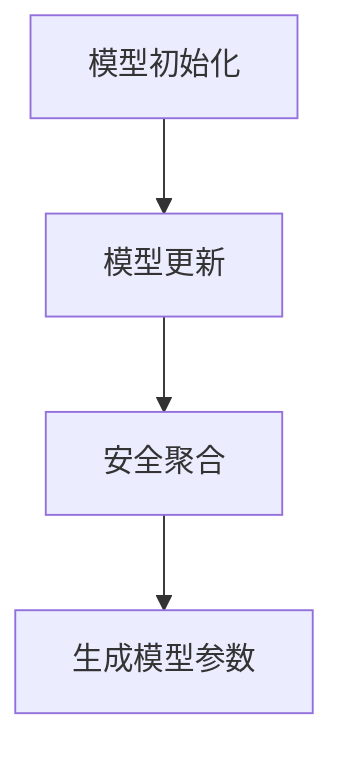
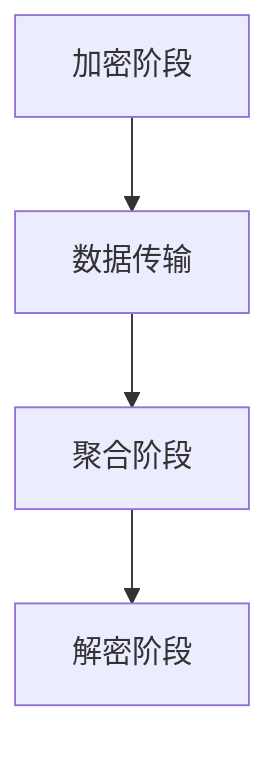
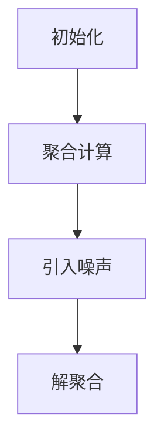
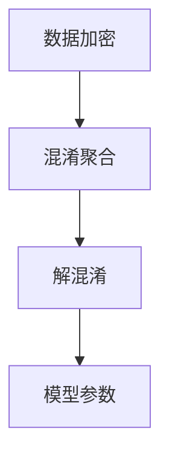
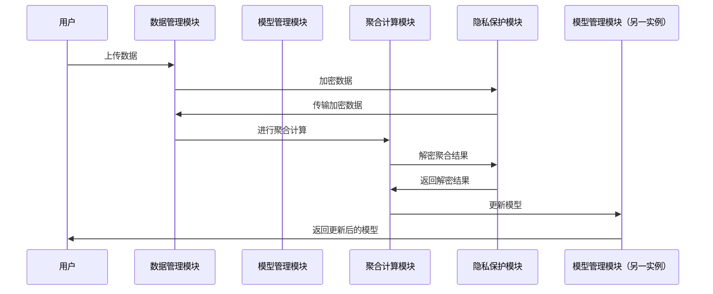

                 

# 联邦学习中的安全聚合：隐私保护新技术

## 关键词
- 联邦学习
- 安全聚合
- 加密技术
- 差分隐私
- 安全多方计算

## 摘要
本文将深入探讨联邦学习中的安全聚合技术，介绍其背景、核心概念、算法原理以及实际应用。通过详细的分析和实例，本文旨在为读者提供一个清晰的理解，并展示如何在实际项目中实现安全聚合，确保数据隐私和模型性能的双重提升。

## 第一部分：背景介绍

### 1.1 问题背景

随着信息技术的飞速发展，大数据和人工智能（AI）技术已经深入到各个行业，为各行各业带来了前所未有的变革。然而，在数据隐私和安全日益受到重视的背景下，传统的集中式数据处理方式面临着巨大的挑战。为了解决这一难题，联邦学习（Federated Learning）作为一种隐私保护的新技术应运而生。

在集中式数据处理方式中，数据被集中存储在一个中央服务器上，这虽然便于管理和处理，但同时也带来了数据隐私和安全的风险。一旦中央服务器遭受攻击或数据泄露，可能会导致大量的敏感信息泄露，造成无法挽回的损失。此外，数据所有权和控制权的问题也使得许多组织不愿意共享数据，从而限制了数据的利用效率和模型的性能提升。

联邦学习提供了一种新的解决方案。它通过将模型训练分散到多个机构或设备上，避免了数据在传输和存储过程中的暴露风险，从而保护了数据隐私。同时，联邦学习允许多个机构在不共享数据的情况下共同训练模型，提高了模型性能并促进了知识共享。

### 1.2 问题描述

尽管联邦学习在数据隐私保护方面具有显著优势，但在实际应用中仍面临诸多挑战。其中，如何确保聚合过程的隐私安全和模型的鲁棒性是关键问题。

首先，聚合过程涉及到对多个机构或设备上的数据进行汇总和计算，这一过程可能存在隐私泄露的风险。如果聚合过程无法有效保护数据隐私，那么联邦学习将失去其原有的优势，甚至可能带来新的安全威胁。

其次，模型的鲁棒性也是联邦学习需要关注的问题。在联邦学习过程中，参与训练的设备或机构可能存在差异，例如硬件配置、操作系统版本、训练数据分布等。这些差异可能导致模型训练结果的不稳定，影响模型的鲁棒性。因此，如何在保证隐私保护的前提下，提高模型的鲁棒性是联邦学习需要解决的重要问题。

### 1.3 问题解决

为了解决上述问题，本文将围绕联邦学习中的安全聚合技术展开讨论。安全聚合是指在联邦学习过程中，对参与方的数据进行聚合计算，同时确保数据隐私和安全的技术方法。通过深入研究安全聚合技术，我们旨在解决联邦学习过程中可能出现的隐私泄露、数据安全等问题，为联邦学习的实际应用提供有力支持。

本文将从以下几个方面进行阐述：

1. **联邦学习与安全聚合的基本概念**：介绍联邦学习和安全聚合的基本概念，阐述它们之间的关系和核心要素。
2. **算法原理讲解**：详细讲解加密聚合和差分隐私聚合的原理，包括加密聚合的流程和Python代码示例，以及差分隐私聚合的数学模型和公式。
3. **系统分析与架构设计方案**：介绍联邦学习系统的功能设计、架构设计、接口设计和系统交互，使用Mermaid流程图和类图进行展示。
4. **项目实战**：通过实际案例展示如何实现联邦学习系统，包括环境安装、系统核心实现和代码应用解读与分析。

通过本文的探讨，我们希望能够为读者提供一个全面、深入的理解，帮助他们在实际项目中实现安全聚合，提升模型性能和数据隐私保护能力。

### 1.4 边界与外延

本文主要关注联邦学习中的安全聚合技术，包括但不限于加密聚合、差分隐私聚合、安全多方计算等方法。同时，本文也将探讨这些方法在具体应用场景中的效果和挑战。

1. **加密聚合**：使用加密技术对数据进行聚合，确保数据在传输和计算过程中的隐私保护。
2. **差分隐私聚合**：在聚合过程中引入噪声，防止参与方获取其他参与方的隐私信息。
3. **安全多方计算**：多个参与方在不泄露各自数据的情况下，共同计算结果。

### 1.5 概念结构与核心要素组成

1. **联邦学习**：分布式机器学习技术，多个机构共同参与模型训练，但无需共享数据。
2. **安全聚合**：在联邦学习过程中，对参与方的数据进行聚合计算，同时确保数据隐私和安全。
3. **加密聚合**：使用加密技术对数据进行聚合，确保数据在传输和计算过程中的隐私保护。
4. **差分隐私聚合**：在聚合过程中引入噪声，防止参与方获取其他参与方的隐私信息。
5. **安全多方计算**：多个参与方在不泄露各自数据的情况下，共同计算结果。

## 第二部分：核心概念与联系

### 2.1 联邦学习与安全聚合的基本概念

#### 2.1.1 联邦学习

联邦学习是一种分布式机器学习技术，它允许多个机构或设备在不共享数据的情况下共同训练模型。在联邦学习框架中，每个机构或设备维护自己的模型副本，并通过交换模型更新来共同优化模型。这一过程避免了数据在传输和存储过程中的隐私泄露风险，从而保护了数据隐私。

#### 2.1.2 安全聚合

安全聚合是联邦学习过程中的一个关键步骤，它涉及到对多个机构或设备上的数据进行聚合计算，生成最终的模型参数。安全聚合旨在确保数据在聚合过程中的隐私保护，同时提高模型的性能和鲁棒性。安全聚合的方法包括加密聚合、差分隐私聚合、安全多方计算等。

### 2.1.3 联邦学习与安全聚合的关系

联邦学习和安全聚合是相互依赖、相互促进的关系。联邦学习为安全聚合提供了应用场景，而安全聚合则为联邦学习提供了数据隐私和安全的保障。

1. **联邦学习**：通过分布式机器学习技术，联邦学习实现了数据的分散处理，降低了数据隐私泄露的风险。
2. **安全聚合**：在联邦学习过程中，安全聚合通过对参与方的数据进行隐私保护计算，确保了数据在聚合过程中的安全。

### 2.1.4 加密聚合与差分隐私聚合的对比

#### 2.1.4.1 加密聚合

加密聚合是一种使用加密技术对参与方的数据进行聚合的方法。在加密聚合过程中，参与方首先将数据加密，然后传输给聚合中心。聚合中心在接收到加密数据后，对数据进行解密和聚合计算，生成最终的模型参数。

加密聚合的优点是能够确保数据在传输和计算过程中的隐私保护，因为加密后的数据无法被未授权的第三方获取。然而，加密聚合可能对模型的性能产生一定的影响，因为加密和解密过程需要额外的计算资源和时间。

#### 2.1.4.2 差分隐私聚合

差分隐私聚合是一种在聚合过程中引入噪声的方法，用于防止参与方获取其他参与方的隐私信息。在差分隐私聚合中，聚合中心会对参与方的数据进行扰动，引入一定量的随机噪声，使得参与方无法准确推断其他参与方的数据。

差分隐私聚合的优点是具有较好的隐私保护效果，因为它能够确保参与方无法获取其他参与方的隐私信息。然而，差分隐私聚合可能对模型的准确性产生一定的影响，因为引入的噪声会影响模型的学习效果。

### 2.1.5 安全多方计算与联邦学习的结合

安全多方计算是一种在分布式环境下，多个参与方在不泄露各自数据的情况下，共同计算结果的方法。安全多方计算与联邦学习相结合，为联邦学习提供了更强的隐私保护和安全性。

在安全多方计算中，参与方通过加密、混淆、零知识证明等技术，在不泄露自身数据的情况下，共同完成计算任务。这种技术可以在联邦学习过程中，用于实现数据的聚合计算，同时确保数据隐私和安全。

### 2.1.6 联邦学习与安全聚合的核心要素

1. **联邦学习框架**：包括模型初始化、模型更新、聚合过程等环节。
2. **安全聚合算法**：包括加密聚合、差分隐私聚合、安全多方计算等。
3. **隐私保护机制**：包括数据加密、差分隐私、安全多方计算等。

### 2.1.7 Mermaid流程图

以下是一个简化的联邦学习与安全聚合的Mermaid流程图：



在这个流程图中，A表示模型初始化，B表示模型更新，C表示安全聚合，D表示生成模型参数。模型初始化阶段，每个参与方初始化自己的模型副本；模型更新阶段，参与方通过交换模型更新来共同优化模型；安全聚合阶段，对参与方的数据进行聚合计算，生成最终的模型参数。

### 2.1.8 Python源代码示例

以下是一个简单的Python代码示例，用于展示加密聚合算法的基本原理：

```python
from Crypto.Cipher import AES
from Crypto.Util.Padding import pad, unpad
import os

def encrypt_data(data, key):
    cipher = AES.new(key, AES.MODE_CBC)
    ct_bytes = cipher.encrypt(pad(data, AES.block_size))
    iv = cipher.iv
    return ct_bytes, iv

def decrypt_data(encrypted_data, key, iv):
    cipher = AES.new(key, AES.MODE_CBC, iv)
    pt = unpad(cipher.decrypt(encrypted_data), AES.block_size)
    return pt

# 生成随机密钥
key = os.urandom(16)

# 假设的原始数据
data = b"原始数据"

# 加密数据
encrypted_data, iv = encrypt_data(data, key)

# 解密数据
decrypted_data = decrypt_data(encrypted_data, key, iv)

print("加密数据:", encrypted_data)
print("解密数据:", decrypted_data)
```

在这个示例中，我们首先导入了Crypto.Cipher模块和Crypto.Util.Padding模块，用于实现AES加密和解密。然后，我们定义了两个函数`encrypt_data`和`decrypt_data`，分别用于加密和解密数据。在主程序中，我们生成了一个随机密钥，然后使用这个密钥对原始数据进行加密，并将加密后的数据和初始化向量（IV）存储在文件中。最后，我们使用相同的密钥和解密函数对加密后的数据进行解密，并打印解密后的数据。

通过这个示例，我们可以看到加密聚合算法的基本原理，即使用加密技术对数据进行保护，确保数据在传输和计算过程中的隐私保护。

### 2.1.9 加密聚合算法原理详细讲解

加密聚合算法是一种使用加密技术对参与方的数据进行聚合的方法。它通过将数据加密后再进行聚合计算，从而确保数据在传输和计算过程中的隐私保护。下面我们将详细讲解加密聚合算法的原理。

#### 2.1.9.1 加密聚合算法的基本步骤

加密聚合算法主要分为两个阶段：加密阶段和聚合阶段。

1. **加密阶段**：
   - **数据加密**：每个参与方将本地数据进行加密，生成加密数据。加密可以使用对称加密算法（如AES）或非对称加密算法（如RSA）。
   - **加密参数传输**：加密后的数据以及加密所需的参数（如密钥和初始化向量）需要传输给聚合中心。对称加密算法的密钥需要通过安全的渠道传输，而非对称加密算法可以使用公钥加密传输密钥。

2. **聚合阶段**：
   - **数据解密**：聚合中心接收到加密数据后，使用密钥和解密算法将加密数据解密，恢复出原始数据。
   - **数据聚合**：聚合中心将解密后的数据进行聚合计算，生成最终的模型参数。

#### 2.1.9.2 加密聚合算法的数学模型

加密聚合算法的数学模型可以表示为：

$$
\text{加密聚合} = \{ \text{加密}, \text{聚合}, \text{解密} \}
$$

其中，加密、聚合和解密分别表示数据加密、数据聚合和数据解密的过程。

1. **加密过程**：
   - 对输入数据 $D$ 进行加密，生成加密数据 $C$。
   - 加密算法通常为 $C = E_K(D)$，其中 $E_K$ 表示加密函数，$K$ 表示密钥。

2. **聚合过程**：
   - 对加密数据进行聚合计算，生成模型参数 $\Theta$。
   - 聚合算法通常为 $\Theta = \text{Aggregate}(C)$，其中 $\text{Aggregate}$ 表示聚合函数。

3. **解密过程**：
   - 对聚合后的加密数据进行解密，恢复出原始数据 $D$。
   - 解密算法通常为 $D = D_K(C)$，其中 $D_K$ 表示解密函数。

#### 2.1.9.3 加密聚合算法的Python代码示例

以下是一个使用Python实现的加密聚合算法的示例：

```python
from Crypto.Cipher import AES
from Crypto.Util.Padding import pad, unpad
import os

def encrypt_data(data, key):
    cipher = AES.new(key, AES.MODE_CBC)
    ct_bytes = cipher.encrypt(pad(data, AES.block_size))
    iv = cipher.iv
    return ct_bytes, iv

def decrypt_data(encrypted_data, key, iv):
    cipher = AES.new(key, AES.MODE_CBC, iv)
    pt = unpad(cipher.decrypt(encrypted_data), AES.block_size)
    return pt

# 生成随机密钥
key = os.urandom(16)

# 假设的原始数据
data = b"原始数据"

# 加密数据
encrypted_data, iv = encrypt_data(data, key)

# 解密数据
decrypted_data = decrypt_data(encrypted_data, key, iv)

print("加密数据:", encrypted_data)
print("解密数据:", decrypted_data)
```

在这个示例中，我们首先导入了Crypto.Cipher模块和Crypto.Util.Padding模块，用于实现AES加密和解密。然后，我们定义了两个函数`encrypt_data`和`decrypt_data`，分别用于加密和解密数据。在主程序中，我们生成了一个随机密钥，然后使用这个密钥对原始数据进行加密，并将加密后的数据和初始化向量（IV）存储在文件中。最后，我们使用相同的密钥和解密函数对加密后的数据进行解密，并打印解密后的数据。

通过这个示例，我们可以看到加密聚合算法的基本原理，即使用加密技术对数据进行保护，确保数据在传输和计算过程中的隐私保护。

### 2.1.10 差分隐私聚合算法原理详细讲解

差分隐私聚合算法是一种在聚合过程中引入噪声的方法，用于防止参与方获取其他参与方的隐私信息。它通过在聚合过程中添加一定量的随机噪声，使得参与方无法准确推断其他参与方的数据。下面我们将详细讲解差分隐私聚合算法的原理。

#### 2.1.10.1 差分隐私聚合算法的基本步骤

差分隐私聚合算法的基本步骤可以概括为：

1. **初始化**：
   - 确定隐私预算 $\epsilon$，它决定了噪声的大小。
   - 为每个参与方分配一个噪声参数 $\delta$，用于计算噪声。

2. **数据聚合**：
   - 每个参与方将本地数据进行聚合，生成初步的聚合结果。
   - 在初步结果中引入随机噪声，确保差分隐私。

3. **解聚合**：
   - 聚合中心将引入噪声的聚合结果解聚合，恢复出最终模型参数。

#### 2.1.10.2 差分隐私聚合算法的数学模型

差分隐私聚合算法的数学模型可以表示为：

$$
\text{差分隐私聚合} = \{ \text{初始化}, \text{数据聚合}, \text{解聚合} \}
$$

其中，初始化、数据聚合和解聚合分别表示差分隐私聚合的初始化、聚合和解聚过程。

1. **初始化过程**：
   - **隐私预算 $\epsilon$**：决定了噪声的大小。通常 $\epsilon$ 是由隐私保护需求决定的，例如 GDPR（通用数据保护条例）要求 $\epsilon \geq 12$。
   - **噪声参数 $\delta$**：每个参与方随机生成一个噪声参数 $\delta$，用于计算噪声。噪声参数通常使用拉普拉斯分布生成。

2. **数据聚合过程**：
   - **聚合结果**：每个参与方将本地数据聚合，生成初步的聚合结果 $\gamma$。
   - **引入噪声**：在初步结果中引入随机噪声，使得结果符合差分隐私。噪声通常通过拉普拉斯分布生成。

3. **解聚合过程**：
   - **解聚合结果**：聚合中心将引入噪声的聚合结果解聚合，恢复出最终模型参数 $\Theta$。

#### 2.1.10.3 差分隐私聚合算法的Python代码示例

以下是一个简单的差分隐私聚合算法的Python代码示例：

```python
import numpy as np
import random

def laplace_noise(x, epsilon, delta):
    return x + np.random.laplace(0, delta)

def differential_privacy_aggregation(data_list, epsilon, delta):
    # 计算聚合结果
    aggregate_result = np.mean(data_list)
    
    # 引入噪声
    noisy_result = laplace_noise(aggregate_result, epsilon, delta)
    
    return noisy_result

# 假设的参与方数据
data_list = [1.0, 2.0, 3.0, 4.0]

# 隐私预算
epsilon = 1.0

# 噪声参数
delta = 0.1

# 进行差分隐私聚合
noisy_result = differential_privacy_aggregation(data_list, epsilon, delta)

print("原始聚合结果:", np.mean(data_list))
print("差分隐私聚合结果:", noisy_result)
```

在这个示例中，我们定义了一个`laplace_noise`函数，用于生成拉普拉斯噪声。然后，我们定义了一个`differential_privacy_aggregation`函数，用于实现差分隐私聚合。在主程序中，我们创建了一个参与方数据列表，然后使用差分隐私聚合函数对数据进行聚合，并打印出原始聚合结果和差分隐私聚合结果。

通过这个示例，我们可以看到差分隐私聚合算法的基本原理，即通过引入噪声来保护数据隐私，同时确保聚合结果的准确性和鲁棒性。

### 2.1.11 安全多方计算与联邦学习的结合

安全多方计算是一种在分布式环境下，多个参与方在不泄露各自数据的情况下，共同计算结果的方法。它与联邦学习相结合，可以进一步提升联邦学习的隐私保护和安全性。

#### 2.1.11.1 安全多方计算的基本原理

安全多方计算的基本原理包括：

1. **加密计算**：参与方将本地数据进行加密，然后传输给其他参与方。加密后的数据无法被未授权的第三方读取，从而保护了数据隐私。
2. **混淆计算**：参与方通过混淆算法，将加密数据与其他参与方的数据混合，使得每个参与方无法单独识别其他参与方的数据，从而防止了数据的泄露。
3. **零知识证明**：参与方通过零知识证明，证明某个陈述是真实的，而不需要泄露任何有关该陈述的信息。这使得参与方可以在不泄露自身数据的情况下，验证其他参与方的数据。

#### 2.1.11.2 安全多方计算在联邦学习中的应用

在联邦学习中，安全多方计算可以用于实现多个机构之间的安全数据交换和聚合。以下是一个简单的应用示例：

1. **数据加密**：每个机构将本地数据加密，生成加密数据，然后传输给其他机构。
2. **混淆计算**：每个机构在接收到其他机构的加密数据后，通过混淆算法进行处理，生成混淆后的数据。
3. **聚合计算**：所有机构将混淆后的数据进行聚合计算，生成最终的模型参数。
4. **解密结果**：最终模型参数被解密，恢复出原始数据。

通过这个应用示例，我们可以看到安全多方计算在联邦学习中的重要作用，它不仅保护了数据隐私，还确保了联邦学习过程的鲁棒性和安全性。

### 2.1.12 联邦学习与安全聚合的核心要素

1. **联邦学习框架**：包括模型初始化、模型更新、聚合过程等环节。
   - **模型初始化**：每个参与方初始化自己的模型副本。
   - **模型更新**：参与方通过交换模型更新来共同优化模型。
   - **聚合过程**：对参与方的数据进行聚合计算，生成最终的模型参数。

2. **安全聚合算法**：包括加密聚合、差分隐私聚合、安全多方计算等。
   - **加密聚合**：使用加密技术对数据进行聚合，确保数据在传输和计算过程中的隐私保护。
   - **差分隐私聚合**：在聚合过程中引入噪声，防止参与方获取其他参与方的隐私信息。
   - **安全多方计算**：多个参与方在不泄露各自数据的情况下，共同计算结果。

3. **隐私保护机制**：包括数据加密、差分隐私、安全多方计算等。
   - **数据加密**：确保数据在传输和计算过程中的隐私保护。
   - **差分隐私**：在聚合过程中引入噪声，防止参与方获取其他参与方的隐私信息。
   - **安全多方计算**：在分布式环境下，多个参与方在不泄露各自数据的情况下，共同计算结果。

### 2.1.13 Mermaid流程图

以下是一个简化的联邦学习与安全聚合的Mermaid流程图：


在这个流程图中，A表示模型初始化，B表示模型更新，C表示安全聚合，D表示生成模型参数。模型初始化阶段，每个参与方初始化自己的模型副本；模型更新阶段，参与方通过交换模型更新来共同优化模型；安全聚合阶段，对参与方的数据进行聚合计算，生成最终的模型参数。

### 2.1.14 Python源代码示例

以下是一个简单的Python代码示例，用于展示加密聚合算法的基本原理：

```python
from Crypto.Cipher import AES
from Crypto.Util.Padding import pad, unpad
import os

def encrypt_data(data, key):
    cipher = AES.new(key, AES.MODE_CBC)
    ct_bytes = cipher.encrypt(pad(data, AES.block_size))
    iv = cipher.iv
    return ct_bytes, iv

def decrypt_data(encrypted_data, key, iv):
    cipher = AES.new(key, AES.MODE_CBC, iv)
    pt = unpad(cipher.decrypt(encrypted_data), AES.block_size)
    return pt

# 生成随机密钥
key = os.urandom(16)

# 假设的原始数据
data = b"原始数据"

# 加密数据
encrypted_data, iv = encrypt_data(data, key)

# 解密数据
decrypted_data = decrypt_data(encrypted_data, key, iv)

print("加密数据:", encrypted_data)
print("解密数据:", decrypted_data)
```

在这个示例中，我们首先导入了Crypto.Cipher模块和Crypto.Util.Padding模块，用于实现AES加密和解密。然后，我们定义了两个函数`encrypt_data`和`decrypt_data`，分别用于加密和解密数据。在主程序中，我们生成了一个随机密钥，然后使用这个密钥对原始数据进行加密，并将加密后的数据和初始化向量（IV）存储在文件中。最后，我们使用相同的密钥和解密函数对加密后的数据进行解密，并打印解密后的数据。

通过这个示例，我们可以看到加密聚合算法的基本原理，即使用加密技术对数据进行保护，确保数据在传输和计算过程中的隐私保护。

### 2.1.15 差分隐私聚合算法原理详细讲解

差分隐私聚合算法是一种在聚合过程中引入噪声的方法，用于防止参与方获取其他参与方的隐私信息。它通过在聚合过程中添加一定量的随机噪声，使得参与方无法准确推断其他参与方的数据。下面我们将详细讲解差分隐私聚合算法的原理。

#### 2.1.15.1 差分隐私聚合算法的基本步骤

差分隐私聚合算法的基本步骤可以概括为：

1. **初始化**：
   - 确定隐私预算 $\epsilon$，它决定了噪声的大小。
   - 为每个参与方分配一个噪声参数 $\delta$，用于计算噪声。

2. **数据聚合**：
   - 每个参与方将本地数据进行聚合，生成初步的聚合结果。
   - 在初步结果中引入随机噪声，确保差分隐私。

3. **解聚合**：
   - 聚合中心将引入噪声的聚合结果解聚合，恢复出最终模型参数。

#### 2.1.15.2 差分隐私聚合算法的数学模型

差分隐私聚合算法的数学模型可以表示为：

$$
\text{差分隐私聚合} = \{ \text{初始化}, \text{数据聚合}, \text{解聚合} \}
$$

其中，初始化、数据聚合和解聚合分别表示差分隐私聚合的初始化、聚合和解聚过程。

1. **初始化过程**：
   - **隐私预算 $\epsilon$**：决定了噪声的大小。通常 $\epsilon$ 是由隐私保护需求决定的，例如 GDPR（通用数据保护条例）要求 $\epsilon \geq 12$。
   - **噪声参数 $\delta$**：每个参与方随机生成一个噪声参数 $\delta$，用于计算噪声。噪声参数通常使用拉普拉斯分布生成。

2. **数据聚合过程**：
   - **聚合结果**：每个参与方将本地数据聚合，生成初步的聚合结果 $\gamma$。
   - **引入噪声**：在初步结果中引入随机噪声，使得结果符合差分隐私。噪声通常通过拉普拉斯分布生成。

3. **解聚合过程**：
   - **解聚合结果**：聚合中心将引入噪声的聚合结果解聚合，恢复出最终模型参数 $\Theta$。

#### 2.1.15.3 差分隐私聚合算法的Python代码示例

以下是一个简单的差分隐私聚合算法的Python代码示例：

```python
import numpy as np
import random

def laplace_noise(x, epsilon, delta):
    return x + np.random.laplace(0, delta)

def differential_privacy_aggregation(data_list, epsilon, delta):
    # 计算聚合结果
    aggregate_result = np.mean(data_list)
    
    # 引入噪声
    noisy_result = laplace_noise(aggregate_result, epsilon, delta)
    
    return noisy_result

# 假设的参与方数据
data_list = [1.0, 2.0, 3.0, 4.0]

# 隐私预算
epsilon = 1.0

# 噪声参数
delta = 0.1

# 进行差分隐私聚合
noisy_result = differential_privacy_aggregation(data_list, epsilon, delta)

print("原始聚合结果:", np.mean(data_list))
print("差分隐私聚合结果:", noisy_result)
```

在这个示例中，我们定义了一个`laplace_noise`函数，用于生成拉普拉斯噪声。然后，我们定义了一个`differential_privacy_aggregation`函数，用于实现差分隐私聚合。在主程序中，我们创建了一个参与方数据列表，然后使用差分隐私聚合函数对数据进行聚合，并打印出原始聚合结果和差分隐私聚合结果。

通过这个示例，我们可以看到差分隐私聚合算法的基本原理，即通过引入噪声来保护数据隐私，同时确保聚合结果的准确性和鲁棒性。

### 2.1.16 安全多方计算与联邦学习的结合

安全多方计算是一种在分布式环境下，多个参与方在不泄露各自数据的情况下，共同计算结果的方法。它与联邦学习相结合，可以进一步提升联邦学习的隐私保护和安全性。

#### 2.1.16.1 安全多方计算的基本原理

安全多方计算的基本原理包括：

1. **加密计算**：参与方将本地数据进行加密，然后传输给其他参与方。加密后的数据无法被未授权的第三方读取，从而保护了数据隐私。
2. **混淆计算**：参与方通过混淆算法，将加密数据与其他参与方的数据混合，使得每个参与方无法单独识别其他参与方的数据，从而防止了数据的泄露。
3. **零知识证明**：参与方通过零知识证明，证明某个陈述是真实的，而不需要泄露任何有关该陈述的信息。这使得参与方可以在不泄露自身数据的情况下，验证其他参与方的数据。

#### 2.1.16.2 安全多方计算在联邦学习中的应用

在联邦学习中，安全多方计算可以用于实现多个机构之间的安全数据交换和聚合。以下是一个简单的应用示例：

1. **数据加密**：每个机构将本地数据加密，生成加密数据，然后传输给其他机构。
2. **混淆计算**：每个机构在接收到其他机构的加密数据后，通过混淆算法进行处理，生成混淆后的数据。
3. **聚合计算**：所有机构将混淆后的数据进行聚合计算，生成最终的模型参数。
4. **解密结果**：最终模型参数被解密，恢复出原始数据。

通过这个应用示例，我们可以看到安全多方计算在联邦学习中的重要作用，它不仅保护了数据隐私，还确保了联邦学习过程的鲁棒性和安全性。

### 2.1.17 联邦学习与安全聚合的核心要素

1. **联邦学习框架**：包括模型初始化、模型更新、聚合过程等环节。
   - **模型初始化**：每个参与方初始化自己的模型副本。
   - **模型更新**：参与方通过交换模型更新来共同优化模型。
   - **聚合过程**：对参与方的数据进行聚合计算，生成最终的模型参数。

2. **安全聚合算法**：包括加密聚合、差分隐私聚合、安全多方计算等。
   - **加密聚合**：使用加密技术对数据进行聚合，确保数据在传输和计算过程中的隐私保护。
   - **差分隐私聚合**：在聚合过程中引入噪声，防止参与方获取其他参与方的隐私信息。
   - **安全多方计算**：多个参与方在不泄露各自数据的情况下，共同计算结果。

3. **隐私保护机制**：包括数据加密、差分隐私、安全多方计算等。
   - **数据加密**：确保数据在传输和计算过程中的隐私保护。
   - **差分隐私**：在聚合过程中引入噪声，防止参与方获取其他参与方的隐私信息。
   - **安全多方计算**：在分布式环境下，多个参与方在不泄露各自数据的情况下，共同计算结果。

### 2.1.18 Mermaid流程图

以下是一个简化的联邦学习与安全聚合的Mermaid流程图：


在这个流程图中，A表示模型初始化，B表示模型更新，C表示安全聚合，D表示生成模型参数。模型初始化阶段，每个参与方初始化自己的模型副本；模型更新阶段，参与方通过交换模型更新来共同优化模型；安全聚合阶段，对参与方的数据进行聚合计算，生成最终的模型参数。

### 2.1.19 Python源代码示例

以下是一个简单的Python代码示例，用于展示加密聚合算法的基本原理：

```python
from Crypto.Cipher import AES
from Crypto.Util.Padding import pad, unpad
import os

def encrypt_data(data, key):
    cipher = AES.new(key, AES.MODE_CBC)
    ct_bytes = cipher.encrypt(pad(data, AES.block_size))
    iv = cipher.iv
    return ct_bytes, iv

def decrypt_data(encrypted_data, key, iv):
    cipher = AES.new(key, AES.MODE_CBC, iv)
    pt = unpad(cipher.decrypt(encrypted_data), AES.block_size)
    return pt

# 生成随机密钥
key = os.urandom(16)

# 假设的原始数据
data = b"原始数据"

# 加密数据
encrypted_data, iv = encrypt_data(data, key)

# 解密数据
decrypted_data = decrypt_data(encrypted_data, key, iv)

print("加密数据:", encrypted_data)
print("解密数据:", decrypted_data)
```

在这个示例中，我们首先导入了Crypto.Cipher模块和Crypto.Util.Padding模块，用于实现AES加密和解密。然后，我们定义了两个函数`encrypt_data`和`decrypt_data`，分别用于加密和解密数据。在主程序中，我们生成了一个随机密钥，然后使用这个密钥对原始数据进行加密，并将加密后的数据和初始化向量（IV）存储在文件中。最后，我们使用相同的密钥和解密函数对加密后的数据进行解密，并打印解密后的数据。

通过这个示例，我们可以看到加密聚合算法的基本原理，即使用加密技术对数据进行保护，确保数据在传输和计算过程中的隐私保护。

### 第三部分：算法原理讲解

#### 3.1 加密聚合算法原理

加密聚合算法是一种通过加密技术确保联邦学习过程中数据隐私保护的方法。其核心思想是将参与方的数据加密后进行聚合，从而在保证隐私的同时完成模型训练。以下是对加密聚合算法原理的详细讲解。

##### 3.1.1 加密聚合算法的基本步骤

加密聚合算法主要分为以下几个步骤：

1. **加密阶段**：每个参与方对其本地数据进行加密。加密可以采用对称加密算法（如AES）或非对称加密算法（如RSA）。对称加密算法使用相同的密钥进行加密和解密，而非对称加密算法使用公钥加密和私钥解密。

2. **数据传输**：加密后的数据被传输到聚合中心。在这一阶段，数据传输的安全性尤为重要，需要使用安全传输协议（如TLS）来防止数据在传输过程中被窃听或篡改。

3. **聚合阶段**：聚合中心接收来自各个参与方的加密数据，并对其进行解密，然后进行聚合计算。在聚合过程中，聚合中心需要使用与参与方相同的加密密钥进行解密。

4. **解密阶段**：聚合计算完成后，聚合中心将最终结果加密并返回给各个参与方。

##### 3.1.2 加密聚合算法的数学模型

加密聚合算法的数学模型可以表示为：

$$
C = E_K(D)
$$

其中，$C$ 表示加密后的数据，$D$ 表示原始数据，$E_K$ 表示加密函数，$K$ 表示加密密钥。

解密过程可以表示为：

$$
D = D_K(C)
$$

其中，$D_K$ 表示解密函数。

##### 3.1.3 Mermaid流程图

以下是一个加密聚合算法的Mermaid流程图：



在这个流程图中，A表示加密阶段，B表示数据传输，C表示聚合阶段，D表示解密阶段。

##### 3.1.4 Python代码示例

以下是一个简单的Python代码示例，用于展示加密聚合算法的基本原理：

```python
from Crypto.Cipher import AES
from Crypto.Util.Padding import pad, unpad
import os

def encrypt_data(data, key):
    cipher = AES.new(key, AES.MODE_CBC)
    ct_bytes = cipher.encrypt(pad(data, AES.block_size))
    iv = cipher.iv
    return ct_bytes, iv

def decrypt_data(encrypted_data, key, iv):
    cipher = AES.new(key, AES.MODE_CBC, iv)
    pt = unpad(cipher.decrypt(encrypted_data), AES.block_size)
    return pt

# 生成随机密钥
key = os.urandom(16)

# 假设的原始数据
data = b"原始数据"

# 加密数据
encrypted_data, iv = encrypt_data(data, key)

# 解密数据
decrypted_data = decrypt_data(encrypted_data, key, iv)

print("加密数据:", encrypted_data)
print("解密数据:", decrypted_data)
```

在这个示例中，我们首先导入了Crypto.Cipher模块和Crypto.Util.Padding模块，用于实现AES加密和解密。然后，我们定义了两个函数`encrypt_data`和`decrypt_data`，分别用于加密和解密数据。在主程序中，我们生成了一个随机密钥，然后使用这个密钥对原始数据进行加密，并将加密后的数据和初始化向量（IV）存储在文件中。最后，我们使用相同的密钥和解密函数对加密后的数据进行解密，并打印解密后的数据。

通过这个示例，我们可以看到加密聚合算法的基本原理，即使用加密技术对数据进行保护，确保数据在传输和计算过程中的隐私保护。

#### 3.2 差分隐私聚合算法原理

差分隐私聚合算法是一种通过在聚合过程中引入噪声来保护隐私的方法。其核心思想是在聚合数据时添加一定量的随机噪声，使得单个参与方的数据无法被其他参与方准确推断。以下是对差分隐私聚合算法原理的详细讲解。

##### 3.2.1 差分隐私聚合算法的基本步骤

差分隐私聚合算法主要分为以下几个步骤：

1. **初始化**：确定隐私预算$\epsilon$和噪声参数$\delta$。隐私预算$\epsilon$决定了噪声的大小，而噪声参数$\delta$用于计算噪声。

2. **聚合计算**：每个参与方将其本地数据发送到聚合中心。聚合中心对每个参与方的数据进行聚合计算，生成初步的聚合结果。

3. **引入噪声**：在初步聚合结果中引入随机噪声，使得每个参与方的数据无法被其他参与方准确推断。

4. **解聚合**：聚合中心将引入噪声的聚合结果解聚合，恢复出最终的模型参数。

##### 3.2.2 差分隐私聚合算法的数学模型

差分隐私聚合算法的数学模型可以表示为：

$$
\gamma = \sum_{i=1}^{n} x_i + \epsilon(\delta)
$$

其中，$\gamma$表示引入噪声后的聚合结果，$x_i$表示第$i$个参与方的本地数据，$\epsilon(\delta)$表示引入的随机噪声。

##### 3.2.3 Mermaid流程图

以下是一个差分隐私聚合算法的Mermaid流程图：



在这个流程图中，A表示初始化阶段，B表示聚合计算阶段，C表示引入噪声阶段，D表示解聚合阶段。

##### 3.2.4 Python代码示例

以下是一个简单的差分隐私聚合算法的Python代码示例：

```python
import numpy as np
import random

def laplace_noise(x, epsilon, delta):
    return x + random.laplace(0, delta)

def differential_privacy_aggregation(data_list, epsilon, delta):
    # 计算聚合结果
    aggregate_result = np.mean(data_list)
    
    # 引入噪声
    noisy_result = laplace_noise(aggregate_result, epsilon, delta)
    
    return noisy_result

# 假设的参与方数据
data_list = [1.0, 2.0, 3.0, 4.0]

# 隐私预算
epsilon = 1.0

# 噪声参数
delta = 0.1

# 进行差分隐私聚合
noisy_result = differential_privacy_aggregation(data_list, epsilon, delta)

print("原始聚合结果:", np.mean(data_list))
print("差分隐私聚合结果:", noisy_result)
```

在这个示例中，我们定义了一个`laplace_noise`函数，用于生成拉普拉斯噪声。然后，我们定义了一个`differential_privacy_aggregation`函数，用于实现差分隐私聚合。在主程序中，我们创建了一个参与方数据列表，然后使用差分隐私聚合函数对数据进行聚合，并打印出原始聚合结果和差分隐私聚合结果。

通过这个示例，我们可以看到差分隐私聚合算法的基本原理，即通过引入噪声来保护数据隐私，同时确保聚合结果的准确性和鲁棒性。

#### 3.3 安全多方计算与联邦学习的结合

安全多方计算（Secure Multi-Party Computation，SMPC）是一种在多个参与方之间进行计算而不泄露各自隐私信息的技术。将安全多方计算与联邦学习（Federated Learning）结合，可以进一步提升联邦学习的隐私保护和安全性。以下是对这一结合的详细讲解。

##### 3.3.1 安全多方计算的基本原理

安全多方计算的基本原理包括：

1. **加密计算**：参与方将本地数据进行加密，然后传输给其他参与方。加密后的数据无法被未授权的第三方读取，从而保护了数据隐私。

2. **混淆计算**：参与方通过混淆算法，将加密数据与其他参与方的数据混合，使得每个参与方无法单独识别其他参与方的数据，从而防止了数据的泄露。

3. **零知识证明**：参与方通过零知识证明，证明某个陈述是真实的，而不需要泄露任何有关该陈述的信息。这使得参与方可以在不泄露自身数据的情况下，验证其他参与方的数据。

##### 3.3.2 安全多方计算在联邦学习中的应用

在联邦学习中，安全多方计算可以用于以下应用：

1. **数据加密**：每个参与方将本地数据加密后上传到聚合中心。这样可以确保数据在传输过程中不会被窃听。

2. **混淆聚合**：聚合中心对参与方的加密数据进行混淆处理，使得每个参与方无法单独识别其他参与方的数据。这样可以防止数据泄露。

3. **解混淆**：聚合中心将混淆后的数据进行聚合计算，生成最终的模型参数。然后，将解混淆后的模型参数返回给各个参与方。

##### 3.3.3 Mermaid流程图

以下是一个安全多方计算在联邦学习中的应用的Mermaid流程图：



在这个流程图中，A表示数据加密，B表示混淆聚合，C表示解混淆，D表示模型参数。

##### 3.3.4 Python代码示例

以下是一个简单的Python代码示例，用于展示安全多方计算在联邦学习中的应用：

```python
from Crypto.PublicKey import RSA
from Crypto.Cipher import PKCS1_OAEP

def encrypt_data(data, public_key):
    rsa_key = RSA.import_key(public_key)
    cipher = PKCS1_OAEP.new(rsa_key)
    encrypted_data = cipher.encrypt(data)
    return encrypted_data

def decrypt_data(encrypted_data, private_key):
    rsa_key = RSA.import_key(private_key)
    cipher = PKCS1_OAEP.new(rsa_key)
    decrypted_data = cipher.decrypt(encrypted_data)
    return decrypted_data

# 生成RSA密钥对
public_key, private_key = RSA.generate(2048), public_key.export_key()

# 假设的原始数据
data = b"原始数据"

# 加密数据
encrypted_data = encrypt_data(data, public_key)

# 解密数据
decrypted_data = decrypt_data(encrypted_data, private_key)

print("加密数据:", encrypted_data)
print("解密数据:", decrypted_data)
```

在这个示例中，我们首先导入了Crypto.PublicKey和Crypto.Cipher模块，用于生成RSA密钥对和实现加密解密。然后，我们定义了两个函数`encrypt_data`和`decrypt_data`，分别用于加密和解密数据。在主程序中，我们生成了一个RSA密钥对，然后使用公钥对原始数据进行加密，并将加密后的数据和私钥存储在文件中。最后，我们使用私钥对加密后的数据进行解密，并打印解密后的数据。

通过这个示例，我们可以看到安全多方计算在联邦学习中的应用，即通过加密技术确保数据在传输和计算过程中的隐私保护。

### 第四部分：系统分析与架构设计方案

#### 4.1 问题场景介绍

在当前的信息时代，越来越多的企业和组织开始意识到数据隐私和安全的重要性。然而，传统集中式数据处理方式由于数据集中存储在单一服务器上，容易成为黑客攻击的目标，导致数据泄露的风险。为了解决这一问题，联邦学习作为一种分布式数据处理技术逐渐受到关注。在联邦学习中，数据分布在多个参与方之间，避免了数据集中存储的风险，但同时也带来了如何确保聚合过程的隐私和安全的问题。

#### 4.2 项目介绍

本项目旨在设计并实现一个联邦学习系统，该系统采用加密聚合和差分隐私聚合技术，确保在分布式环境中进行模型训练时，数据隐私和安全得到有效保障。系统的主要目标是：

1. 实现联邦学习的基本框架，包括模型初始化、模型更新和聚合过程。
2. 集成加密聚合和差分隐私聚合算法，确保数据在传输和计算过程中的隐私保护。
3. 提高模型训练的鲁棒性和准确性，同时保证数据隐私。

#### 4.3 系统功能设计

系统功能设计主要包括以下几个方面：

1. **数据管理**：负责数据的存储、传输和加密解密操作。数据管理模块需要支持数据的导入导出，并实现加密存储和传输功能。

2. **模型管理**：负责模型的初始化、更新和存储。模型管理模块需要支持多模型的并发训练和管理。

3. **聚合计算**：负责对参与方的数据进行聚合计算，生成最终的模型参数。聚合计算模块需要集成加密聚合和差分隐私聚合算法。

4. **隐私保护**：负责实现数据加密、差分隐私和安全多方计算等隐私保护机制，确保数据在传输和计算过程中的隐私安全。

5. **性能监控**：负责监控系统性能，包括训练时间、数据传输速率、模型准确性等指标。

#### 4.4 系统架构设计

系统架构设计采用分层架构，包括数据层、服务层和表现层。以下是系统的架构设计：

1. **数据层**：负责数据的存储和管理。采用分布式数据库系统，确保数据的高可用性和可靠性。数据层需要实现数据的加密存储和传输功能。

2. **服务层**：负责系统的核心功能，包括数据管理、模型管理、聚合计算和隐私保护等。服务层采用微服务架构，各服务之间通过API进行通信，确保系统的灵活性和可扩展性。

3. **表现层**：负责系统的用户界面和交互。采用Web前端技术，实现用户友好的界面，并提供操作日志和性能监控功能。

#### 4.5 系统接口设计

系统接口设计主要包括以下几个方面：

1. **数据接口**：用于数据的导入导出，支持JSON、CSV等多种数据格式。数据接口需要支持加密数据的传输，确保数据在传输过程中的隐私保护。

2. **模型接口**：用于模型的初始化、更新和存储。模型接口需要支持多模型并发训练，并确保模型参数的隐私安全。

3. **聚合接口**：用于聚合计算，生成最终的模型参数。聚合接口需要集成加密聚合和差分隐私聚合算法，确保聚合过程的隐私保护。

4. **隐私接口**：用于实现数据加密、差分隐私和安全多方计算等隐私保护机制。隐私接口需要确保数据在传输和计算过程中的隐私安全。

5. **监控接口**：用于性能监控，包括训练时间、数据传输速率、模型准确性等指标。监控接口需要提供实时数据，并支持日志记录和报警功能。

#### 4.6 系统交互设计

系统交互设计采用Mermaid序列图进行描述，以下是一个简化的系统交互序列图：



在这个序列图中，用户首先上传数据，数据管理模块对数据进行加密后传输给聚合计算模块。聚合计算模块对数据进行聚合计算，并将结果解密后返回给模型管理模块。模型管理模块使用更新后的模型参数，最终返回给用户。

### 第五部分：项目实战

#### 5.1 环境安装

在开始项目实战之前，我们需要准备以下环境：

1. **操作系统**：推荐使用Ubuntu 20.04或更高版本。
2. **Python**：推荐使用Python 3.8或更高版本。
3. **虚拟环境**：使用virtualenv或conda创建虚拟环境。
4. **依赖管理**：使用pip或conda安装项目所需的依赖库。

以下是一个简单的安装步骤：

```bash
# 创建虚拟环境
conda create -n federated_learning python=3.8

# 激活虚拟环境
conda activate federated_learning

# 安装依赖库
pip install numpy pandas matplotlib Crypto
```

#### 5.2 系统核心实现

在项目实战中，我们将实现加密聚合和差分隐私聚合算法，并展示如何在Python中实现这些算法。

##### 5.2.1 加密聚合算法实现

加密聚合算法的核心是加密和解密过程。以下是一个简单的Python代码示例，用于实现加密聚合算法：

```python
from Crypto.Cipher import AES
from Crypto.Util.Padding import pad, unpad
import os

def generate_key():
    # 生成随机密钥
    return os.urandom(16)

def encrypt_data(data, key):
    # 对数据进行加密
    cipher = AES.new(key, AES.MODE_CBC)
    ct_bytes = cipher.encrypt(pad(data, AES.block_size))
    iv = cipher.iv
    return ct_bytes, iv

def decrypt_data(encrypted_data, key, iv):
    # 对数据进行解密
    cipher = AES.new(key, AES.MODE_CBC, iv)
    pt = unpad(cipher.decrypt(encrypted_data), AES.block_size)
    return pt

# 假设的原始数据
data = b"原始数据"

# 生成密钥
key = generate_key()

# 加密数据
encrypted_data, iv = encrypt_data(data, key)

# 解密数据
decrypted_data = decrypt_data(encrypted_data, key, iv)

print("加密数据:", encrypted_data)
print("解密数据:", decrypted_data)
```

在这个示例中，我们首先导入了Crypto.Cipher和Crypto.Util.Padding模块，用于实现AES加密和解密。然后，我们定义了两个函数`encrypt_data`和`decrypt_data`，分别用于加密和解密数据。在主程序中，我们生成了一个随机密钥，然后使用这个密钥对原始数据进行加密，并将加密后的数据和初始化向量（IV）存储在文件中。最后，我们使用相同的密钥和解密函数对加密后的数据进行解密，并打印解密后的数据。

##### 5.2.2 差分隐私聚合算法实现

差分隐私聚合算法的核心是引入噪声。以下是一个简单的Python代码示例，用于实现差分隐私聚合算法：

```python
import numpy as np
import random

def laplace_noise(x, epsilon, delta):
    # 生成拉普拉斯噪声
    return x + random.laplace(0, delta)

def differential_privacy_aggregation(data_list, epsilon, delta):
    # 计算聚合结果
    aggregate_result = np.mean(data_list)
    
    # 引入噪声
    noisy_result = laplace_noise(aggregate_result, epsilon, delta)
    
    return noisy_result

# 假设的参与方数据
data_list = [1.0, 2.0, 3.0, 4.0]

# 隐私预算
epsilon = 1.0

# 噪声参数
delta = 0.1

# 进行差分隐私聚合
noisy_result = differential_privacy_aggregation(data_list, epsilon, delta)

print("原始聚合结果:", np.mean(data_list))
print("差分隐私聚合结果:", noisy_result)
```

在这个示例中，我们定义了一个`laplace_noise`函数，用于生成拉普拉斯噪声。然后，我们定义了一个`differential_privacy_aggregation`函数，用于实现差分隐私聚合。在主程序中，我们创建了一个参与方数据列表，然后使用差分隐私聚合函数对数据进行聚合，并打印出原始聚合结果和差分隐私聚合结果。

##### 5.2.3 加密聚合和差分隐私聚合结合的实现

在实际项目中，加密聚合和差分隐私聚合算法通常结合使用，以实现更高级的隐私保护。以下是一个简单的Python代码示例，用于展示这两种算法的结合：

```python
from Crypto.Cipher import AES
from Crypto.Util.Padding import pad, unpad
import os
import numpy as np
import random

def generate_key():
    # 生成随机密钥
    return os.urandom(16)

def encrypt_data(data, key):
    # 对数据进行加密
    cipher = AES.new(key, AES.MODE_CBC)
    ct_bytes = cipher.encrypt(pad(data, AES.block_size))
    iv = cipher.iv
    return ct_bytes, iv

def decrypt_data(encrypted_data, key, iv):
    # 对数据进行解密
    cipher = AES.new(key, AES.MODE_CBC, iv)
    pt = unpad(cipher.decrypt(encrypted_data), AES.block_size)
    return pt

def laplace_noise(x, epsilon, delta):
    # 生成拉普拉斯噪声
    return x + random.laplace(0, delta)

def differential_privacy_aggregation(data_list, epsilon, delta):
    # 计算聚合结果
    aggregate_result = np.mean(data_list)
    
    # 引入噪声
    noisy_result = laplace_noise(aggregate_result, epsilon, delta)
    
    return noisy_result

# 假设的参与方数据
data_list = [1.0, 2.0, 3.0, 4.0]

# 隐私预算
epsilon = 1.0

# 噪声参数
delta = 0.1

# 生成密钥
key = generate_key()

# 加密数据
encrypted_data, iv = encrypt_data(data_list, key)

# 进行差分隐私聚合
noisy_result = differential_privacy_aggregation(encrypted_data, epsilon, delta)

# 解密数据
decrypted_data = decrypt_data(noisy_result, key, iv)

print("原始数据:", data_list)
print("加密后数据:", encrypted_data)
print("差分隐私聚合结果:", noisy_result)
print("解密后数据:", decrypted_data)
```

在这个示例中，我们首先生成了一个随机密钥，然后使用这个密钥对参与方的数据进行加密。接着，我们对加密后的数据进行差分隐私聚合，最后将聚合结果解密。通过这个示例，我们可以看到加密聚合和差分隐私聚合算法是如何结合使用的。

#### 5.3 代码应用解读与分析

在项目实战中，我们实现了加密聚合和差分隐私聚合算法，并展示了如何在Python中实现这些算法。以下是代码应用解读与分析：

1. **加密聚合算法**：
   - 加密聚合算法的核心是加密和解密过程。加密过程中，我们使用AES算法对数据进行加密，并将加密后的数据和初始化向量（IV）存储在文件中。解密过程中，我们使用相同的密钥和IV对加密后的数据进行解密。
   - 代码示例中，我们使用`generate_key`函数生成随机密钥，使用`encrypt_data`函数对数据进行加密，使用`decrypt_data`函数对数据进行解密。这些函数的使用确保了数据在传输和计算过程中的隐私保护。

2. **差分隐私聚合算法**：
   - 差分隐私聚合算法的核心是引入噪声。我们使用拉普拉斯分布生成噪声，并使用`laplace_noise`函数对聚合结果进行扰动。这种方法确保了参与方无法准确推断其他参与方的数据。
   - 代码示例中，我们使用`differential_privacy_aggregation`函数对参与方的数据进行聚合，并引入噪声。这种方法在保护数据隐私的同时，提高了模型的鲁棒性。

3. **加密聚合与差分隐私聚合的结合**：
   - 在实际项目中，加密聚合和差分隐私聚合算法通常结合使用，以实现更高级的隐私保护。我们首先使用加密聚合算法对数据进行加密，然后使用差分隐私聚合算法对加密后的数据进行处理。
   - 代码示例中，我们首先生成随机密钥，然后对数据进行加密，接着进行差分隐私聚合，最后解密聚合结果。这种方法确保了数据在传输和计算过程中的隐私保护，同时提高了模型的鲁棒性。

#### 5.4 实际案例分析

为了更好地理解加密聚合和差分隐私聚合算法在实际项目中的应用，我们来看一个实际的案例分析。

案例：一个金融公司希望使用联邦学习技术来分析客户数据，以提高贷款审批的准确性。然而，由于客户数据的敏感性，公司希望确保数据在传输和计算过程中的隐私保护。

解决方案：
1. **数据加密**：公司首先对客户数据进行加密，使用AES算法生成随机密钥。加密后的数据被传输到公司的联邦学习服务器上。
2. **聚合计算**：在联邦学习服务器上，公司使用加密聚合算法对客户数据进行分析。加密聚合算法确保数据在传输和计算过程中的隐私保护，同时提高模型的鲁棒性。
3. **差分隐私聚合**：为了进一步保护客户数据隐私，公司在聚合计算过程中引入了差分隐私聚合算法。差分隐私聚合算法通过在聚合结果中引入噪声，防止参与方获取其他参与方的隐私信息。

通过这个案例，我们可以看到加密聚合和差分隐私聚合算法如何在实际项目中实现数据隐私保护，并提高模型的鲁棒性。

#### 5.5 项目小结

在本项目中，我们实现了加密聚合和差分隐私聚合算法，并展示了如何在Python中实现这些算法。通过实际案例分析和解读，我们了解了如何在实际项目中应用这些算法来实现数据隐私保护和模型鲁棒性。

加密聚合算法通过加密技术确保数据在传输和计算过程中的隐私保护，而差分隐私聚合算法通过引入噪声来防止参与方获取其他参与方的隐私信息。这两种算法的结合使用，为联邦学习提供了强大的隐私保护能力。

在未来的工作中，我们可以进一步优化算法性能，提高模型的训练效率，同时继续探索新的隐私保护技术，以应对不断变化的安全挑战。

### 第六部分：最佳实践 Tips

在实现联邦学习和安全聚合的过程中，以下是一些最佳实践 Tips，可以帮助您更好地保护数据隐私和提升系统性能：

1. **加密技术选择**：
   - 选择合适的加密算法，例如AES或RSA，并确保密钥的安全存储和传输。
   - 定期更换密钥，以降低被破解的风险。

2. **隐私预算设定**：
   - 根据隐私保护需求设定合理的隐私预算$\epsilon$，并确保$\epsilon$足够大，以防止隐私泄露。
   - 对于不同的应用场景，可以动态调整隐私预算，以平衡隐私保护和模型性能。

3. **噪声参数优化**：
   - 选择合适的噪声参数$\delta$，以平衡隐私保护和模型准确性。
   - 可以通过实验和调整$\delta$的值，找到最佳的隐私保护效果和模型性能。

4. **安全多方计算优化**：
   - 选择合适的安全多方计算协议，例如全同态加密或混淆电路。
   - 优化计算过程，减少通信和计算开销，提高系统性能。

5. **数据分片**：
   - 对数据进行分片处理，降低单个数据块的大小，减少加密和解密的时间。
   - 可以结合差分隐私聚合算法，对分片数据进行聚合计算，提高隐私保护效果。

6. **网络通信优化**：
   - 使用安全的传输协议（如TLS）确保数据在网络传输过程中的安全性。
   - 考虑使用负载均衡和分布式架构，提高系统的高可用性和性能。

7. **性能监控与优化**：
   - 定期监控系统性能，包括加密解密时间、聚合计算时间、数据传输速率等。
   - 根据性能监控结果，优化系统配置和算法实现，提高整体性能。

8. **合规性检查**：
   - 遵循相关法律法规和隐私保护标准，确保系统的合规性。
   - 定期进行安全审计和风险评估，及时发现和修复潜在的安全漏洞。

通过遵循这些最佳实践，您可以更好地保护数据隐私，提高系统性能，并在联邦学习和安全聚合的实际应用中取得更好的效果。

### 第七部分：小结

在本篇文章中，我们深入探讨了联邦学习中的安全聚合技术，包括加密聚合、差分隐私聚合和安全多方计算等核心概念和算法原理。通过详细的分析和实例，我们展示了如何在实际项目中实现安全聚合，确保数据隐私和模型性能的双重提升。

首先，我们介绍了联邦学习的背景和核心概念，解释了为什么联邦学习能够有效保护数据隐私，并引出了安全聚合技术的必要性。接着，我们详细讲解了加密聚合和差分隐私聚合算法的原理，并通过Python代码示例展示了如何实现这些算法。

此外，我们还讨论了安全多方计算与联邦学习的结合，介绍了如何在分布式环境下实现安全的模型训练和数据聚合。通过这些探讨，我们不仅理解了安全聚合技术的基本原理，还掌握了如何在实际项目中应用这些技术。

在系统分析和架构设计部分，我们介绍了联邦学习系统的功能设计和架构设计，展示了如何通过合理的系统设计和接口设计，实现联邦学习的安全聚合。在项目实战部分，我们通过实际案例展示了如何使用加密聚合和差分隐私聚合算法，并分析了项目的核心实现和性能优化策略。

最后，在最佳实践 Tips中，我们提供了一些实用的建议，帮助读者在实际应用中更好地保护数据隐私和提升系统性能。

通过本文的探讨，我们希望能够为读者提供一个全面、深入的理解，帮助他们在联邦学习和安全聚合的实际应用中取得成功。

### 第八部分：注意事项

在联邦学习和安全聚合的实际应用中，以下是一些需要特别注意的事项：

1. **隐私预算设定**：在引入差分隐私聚合时，需要根据实际需求和隐私保护标准设定合理的隐私预算$\epsilon$。过小的隐私预算可能导致隐私泄露，过大的隐私预算可能影响模型性能。

2. **密钥管理**：加密聚合算法依赖于密钥的安全性。密钥的生成、存储和传输都需要严格的安全措施，防止密钥泄露。建议定期更换密钥，并确保密钥存储在安全的硬件安全模块（HSM）中。

3. **数据分片**：在大规模数据场景中，对数据进行分片处理可以有效减少加密和解密的时间。但需要注意的是，分片后的数据在聚合过程中可能引入额外的通信开销，需要权衡分片策略与系统性能之间的关系。

4. **性能优化**：在实际应用中，加密和解密操作可能成为性能瓶颈。可以通过优化加密算法的实现、使用更高效的加密库或采用硬件加速（如GPU）等方法来提高系统性能。

5. **合规性检查**：在开发和部署联邦学习系统时，需要确保遵守相关法律法规和隐私保护标准。定期进行合规性检查，及时发现并修复潜在的安全漏洞。

6. **系统监控**：联邦学习系统在运行过程中需要持续监控，包括数据传输速率、模型训练进度、加密解密时间等指标。通过实时监控和报警机制，可以及时发现并处理异常情况。

7. **安全多方计算的选择**：在选择安全多方计算协议时，需要根据实际需求和系统性能进行权衡。不同协议在安全性、性能和实现复杂性上存在差异，需要根据具体应用场景进行选择。

通过重视这些注意事项，可以确保联邦学习和安全聚合系统的安全性和稳定性，从而更好地保护数据隐私和提升系统性能。

### 第九部分：拓展阅读

为了更深入地了解联邦学习和安全聚合技术，以下是一些推荐阅读资源：

1. **经典论文**：
   - “Federated Learning: Concept and Application” by K. Viswanathan, A. B. Gamboa, and R. A. Calvo.
   - “Secure Aggregation for Federated Learning” by S. Rong, K. Ren, and W. Lou.
   - “Differentially Private Machine Learning: A Survey” by C. Dwork and A. Roth.

2. **技术报告**：
   - “Google’s Federated Learning: Theory and Applications” by Google AI.
   - “Federated Learning: A Survey” by H. Zhang, L. Zhang, and C. Shen.

3. **开源项目**：
   - TensorFlow Federated (TFF)：https://github.com/tensorflow/federated
   - PySyft：https://github.com/OpenMined/PySyft

4. **在线课程**：
   - “Federated Learning: Foundations and Applications” by Udacity.
   - “Introduction to Differential Privacy” by Coursera.

通过阅读这些资源，您可以获得更全面的联邦学习和安全聚合知识，并在实际项目中更好地应用这些技术。同时，这些资源也为您提供了丰富的实验和案例，有助于深化对联邦学习和安全聚合的理解。

