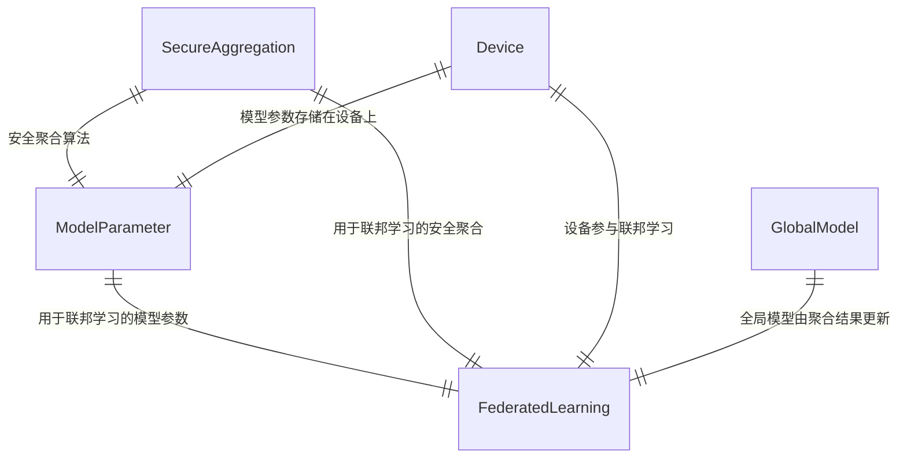
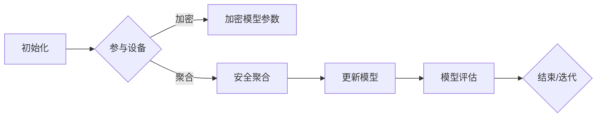
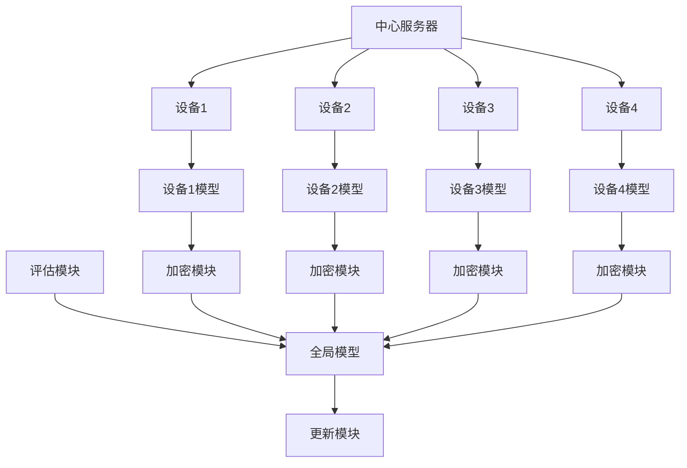
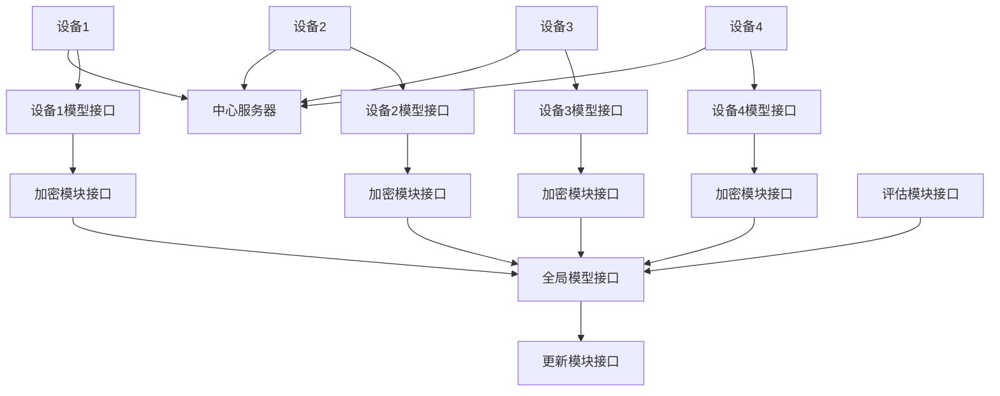

                 

### 概述与背景介绍

#### 1. 联邦学习的概念与背景

联邦学习（Federated Learning）是一种在分布式系统中进行机器学习的范式，它允许多个独立的设备或服务器共同训练一个全局模型，而不需要将各自的数据集中到一个中央服务器上。这种分布式学习方式在物联网（IoT）、移动设备、智能城市、健康监测等领域具有广泛的应用前景，因为它能够有效地解决数据隐私和安全问题。

联邦学习的核心思想是协同训练模型，而不是协同训练数据。在联邦学习的流程中，各个参与方（设备或服务器）各自维护一个本地模型副本，并利用本地数据更新模型。这些本地模型更新的参数会定期传输给中心服务器，中心服务器将这些更新聚合起来，得到全局模型。然后，各本地模型再基于全局模型进行更新。这一过程不断迭代，直到达到预定的训练目标或达到某个收敛条件。

#### 2. 安全聚合算法的意义

在联邦学习中，安全聚合算法扮演着至关重要的角色。它的主要任务是确保在模型参数传输和聚合过程中，各参与方之间的数据交互安全可靠，防止模型参数泄露和内部攻击。安全聚合算法通过加密、差分隐私等技术手段，保护参与联邦学习的各方设备之间的数据隐私。

安全聚合算法的另一个关键作用是提高联邦学习的效率和性能。在不牺牲安全性的前提下，如何减少通信开销、降低计算复杂度，是联邦学习中亟需解决的问题。有效的安全聚合算法可以降低各设备之间的通信频率，减少数据传输量，从而提高整体训练效率。

#### 3. 安全聚合算法在联邦学习中的挑战

尽管安全聚合算法在联邦学习中有显著的应用价值，但在实际应用中仍面临诸多挑战：

- **隐私保护**：在联邦学习过程中，如何确保模型参数和用户数据的隐私不被泄露是一个重要问题。安全聚合算法需要在保护隐私的同时，实现高效的模型更新。
- **计算效率**：在分布式环境中，如何降低计算复杂度、减少通信开销是提高联邦学习性能的关键。传统的安全聚合算法通常需要大量的计算和通信资源，如何优化这些算法以提高效率是一个挑战。
- **网络攻击抵抗**：联邦学习中的参与设备可能受到网络攻击，如拒绝服务攻击、恶意节点注入等。安全聚合算法需要具备一定的抵抗攻击能力，确保联邦学习过程的稳定性和安全性。
- **异构环境适应性**：在现实应用中，参与联邦学习的设备可能具有不同的硬件配置、操作系统和数据处理能力，如何设计一个适应异构环境的聚合算法是一个需要解决的问题。

#### 4. 联邦学习在现实应用中的案例

联邦学习在现实应用中已经取得了显著的成果。例如：

- **智能医疗**：联邦学习可以应用于医疗数据共享和隐私保护，使得医疗机构能够共同训练诊断模型，而无需共享敏感患者数据。
- **智能交通**：通过联邦学习，车联网设备可以共同训练交通预测模型，优化交通流量，提高道路利用效率。
- **智能家居**：智能家居设备可以通过联邦学习协同训练智能助手模型，实现个性化服务和隐私保护。

随着技术的不断进步，联邦学习有望在更多领域得到应用，成为分布式机器学习的重要方向。

### 核心概念与联系

#### 1. 安全聚合算法的概念

安全聚合算法是一种在联邦学习框架下，用于安全地汇总模型参数的算法。其主要目标是在保证模型训练效率的同时，确保模型参数在传输过程中不被泄露，防止内部攻击和数据泄露。安全聚合算法通常结合加密、差分隐私等技术，以实现高效、安全的参数聚合。

#### 2. 安全聚合算法的属性特征对比表格

| 属性特征 | 加密聚合 | 差分隐私聚合 | 同态加密聚合 |
| :--: | :--: | :--: | :--: |
| 安全性 | 高 | 高 | 高 |
| 效率 | 低 | 中 | 高 |
| 适用场景 | 对隐私保护要求高的场景 | 对隐私保护要求较高的场景 | 对隐私保护要求较低的场景 |
| 抵御攻击 | 强 | 中 | 弱 |

**加密聚合**：加密聚合算法通过加密技术对模型参数进行加密，确保在传输过程中参数不被泄露。这种算法通常适用于对隐私保护要求较高的场景，但其效率相对较低，因为加密和解密过程需要消耗较多的计算资源。

**差分隐私聚合**：差分隐私聚合算法通过在聚合过程中引入噪声，保护个体的隐私。这种算法的效率适中，适用于对隐私保护要求较高的场景，但其对网络攻击的抵御能力较弱。

**同态加密聚合**：同态加密聚合算法允许在加密状态下对数据进行计算，无需解密。这种算法的效率较高，适用于对隐私保护要求较低的场景，但其安全性相对较低，因为同态加密算法目前仍存在一定的局限性。

#### 3. 安全聚合算法的ER实体关系图

在联邦学习框架中，安全聚合算法涉及多个实体，包括模型参数、参与设备、全局模型等。以下是安全聚合算法的ER实体关系图：



在这个ER实体关系图中：

- **ModelParameter**：表示模型参数，是联邦学习中的核心要素。
- **SecureAggregation**：表示安全聚合算法，用于安全地聚合模型参数。
- **FederatedLearning**：表示联邦学习框架，包括模型参数传输、聚合和更新过程。
- **Device**：表示参与联邦学习的设备，包括手机、平板、智能手表等。
- **GlobalModel**：表示全局模型，由各设备本地模型聚合而成。

这些实体之间的关联关系构成了联邦学习中的安全聚合算法框架，为分布式机器学习提供了坚实的技术基础。

### 算法原理讲解

#### 1. 算法mermaid流程图

首先，让我们通过mermaid流程图来直观地展示联邦学习中的安全聚合算法流程：



**流程说明**：

- **初始化**：联邦学习开始时，各参与设备初始化本地模型副本。
- **加密模型参数**：各设备将本地模型参数进行加密处理，确保参数在传输过程中不会被窃取或篡改。
- **安全聚合**：加密后的模型参数被传输到中心服务器，通过安全聚合算法进行汇总，生成全局模型参数。
- **更新模型**：中心服务器将全局模型参数返回给各设备，各设备使用这些参数更新本地模型。
- **模型评估**：更新后的本地模型进行性能评估，如果满足预定的停止条件，则结束迭代；否则，继续进行下一轮加密、聚合和更新。
- **结束/迭代**：如果满足停止条件，联邦学习过程结束；否则，继续迭代，直至达到最优解或满足其他预定条件。

#### 2. 算法原理的数学模型和公式

安全聚合算法的数学模型和公式是理解其核心原理的关键。以下是一系列关键步骤及其对应的数学表达：

- **加密模型参数**：

  $$ \text{Enc}(\theta_i) = E(\theta_i | \text{密钥}) $$

  其中，$ \theta_i $ 是第 $ i $ 个设备的本地模型参数，$ E $ 是加密函数，$ \text{密钥} $ 是用于加密的密钥。

- **安全聚合**：

  $$ \text{Agg}(\theta_i) = \frac{1}{N} \sum_{i=1}^{N} E(\theta_i | \text{密钥}) $$

  这里，$ \text{Agg} $ 表示聚合函数，$ N $ 是参与联邦学习的设备总数。

- **更新模型**：

  $$ \theta_{\text{new}} = \theta_{\text{old}} + \alpha \cdot \text{Agg}(\theta_i) $$

  其中，$ \theta_{\text{new}} $ 是更新后的模型参数，$ \theta_{\text{old}} $ 是更新前的模型参数，$ \alpha $ 是学习率。

- **模型评估**：

  模型评估通常涉及多个指标，如损失函数值、准确率、召回率等。具体公式取决于所采用的评估方法。

#### 3. 算法原理的详细讲解和举例说明

**详细讲解**：

- **加密模型参数**：

  在联邦学习中，每个设备都会维护一个本地模型副本。为了防止模型参数在传输过程中被窃取或篡改，我们需要对模型参数进行加密。常用的加密算法包括对称加密（如AES）和非对称加密（如RSA）。对称加密算法使用相同的密钥进行加密和解密，而非对称加密算法则使用一对密钥，一个用于加密，另一个用于解密。

  以下是一个简单的例子：

  $$ \text{加密模型参数}: \text{Enc}(\theta_i) = AES(\theta_i | \text{密钥}) $$

- **安全聚合**：

  安全聚合的过程涉及将加密后的模型参数从各个设备传输到中心服务器，并汇总这些参数，以生成全局模型参数。在这个过程中，我们通常采用差分隐私聚合算法，以确保个体隐私不被泄露。

  以下是一个简单的差分隐私聚合例子：

  $$ \text{Agg}(\theta_i) = \frac{1}{N} \sum_{i=1}^{N} AES(\theta_i | \text{密钥}) + \text{噪声} $$

- **更新模型**：

  一旦中心服务器收到聚合后的全局模型参数，各设备会使用这些参数更新本地模型。这个过程中，我们通常采用梯度下降法或其他优化算法来更新模型。

  以下是一个简单的更新例子：

  $$ \theta_{\text{new}} = \theta_{\text{old}} + \alpha \cdot (\text{Agg}(\theta_i) - \theta_{\text{old}}) $$

- **模型评估**：

  在每次更新后，我们需要评估模型的性能，以判断是否达到预定的训练目标。评估指标可以是损失函数值、准确率等。

  以下是一个简单的评估例子：

  $$ \text{loss}_{\text{new}} = \text{Loss}(\theta_{\text{new}}, \text{数据集}) $$

**举例说明**：

假设有两个设备A和B，它们各自维护一个本地模型副本。为了简化问题，我们假设每个设备的模型参数只有一个数值。

- **加密模型参数**：

  设备A的模型参数为 $ \theta_A = 3 $，设备B的模型参数为 $ \theta_B = 5 $。使用AES加密算法和密钥“mykey”加密后的模型参数分别为：

  $$ \text{Enc}(\theta_A) = AES(3 | \text{mykey}) = \text{Enc}_A $$
  $$ \text{Enc}(\theta_B) = AES(5 | \text{mykey}) = \text{Enc}_B $$

- **安全聚合**：

  假设参与联邦学习的设备总数为2，即 $ N = 2 $。使用差分隐私聚合算法，聚合后的全局模型参数为：

  $$ \text{Agg}(\theta_i) = \frac{1}{2} (\text{Enc}_A + \text{Enc}_B) + \text{噪声} = \text{Enc}_\text{global} $$

- **更新模型**：

  假设学习率 $ \alpha = 0.1 $，设备A和设备B使用聚合后的全局模型参数更新本地模型：

  $$ \theta_{\text{new}_A} = \theta_{\text{old}_A} + \alpha \cdot (\text{Enc}_\text{global} - \theta_{\text{old}_A}) $$
  $$ \theta_{\text{new}_B} = \theta_{\text{old}_B} + \alpha \cdot (\text{Enc}_\text{global} - \theta_{\text{old}_B}) $$

- **模型评估**：

  使用损失函数评估更新后的模型性能：

  $$ \text{loss}_{\text{new}} = \text{Loss}(\theta_{\text{new}_A}, \theta_{\text{new}_B}, \text{数据集}) $$

通过上述例子，我们可以看到安全聚合算法在联邦学习中的基本原理和步骤。在实际应用中，这些步骤会更加复杂，但核心原理是相通的。

### 系统分析与架构设计方案

#### 1. 问题场景介绍

在当前物联网（IoT）和移动设备快速发展的背景下，如何保证数据隐私和安全成为了一个亟待解决的问题。联邦学习作为一种分布式学习技术，能够在不泄露用户数据的情况下，实现设备间的协同训练，因此备受关注。然而，在实际应用中，联邦学习面临诸多挑战，如数据隐私保护、计算效率提升和网络攻击抵抗等。为了解决这些问题，我们需要设计一种高效、安全的联邦学习系统，以满足不同应用场景的需求。

#### 2. 项目介绍

本项目的目标是设计并实现一个基于安全聚合算法的联邦学习系统，该系统旨在通过分布式设备协同训练，实现高效、安全的数据隐私保护。该项目将采用多种加密和聚合技术，如差分隐私、同态加密等，以提高系统的安全性和性能。此外，项目还将考虑异构设备的适应性，确保系统能够在不同硬件配置和操作系统下稳定运行。

#### 3. 系统功能设计

系统功能设计主要包括以下几个方面：

- **设备注册与认证**：确保每个参与联邦学习的设备都经过合法认证，防止未授权设备加入系统。
- **模型初始化**：初始化每个设备的本地模型，为后续的协同训练奠定基础。
- **数据加密与传输**：对设备本地数据进行加密处理，确保数据在传输过程中不被窃取或篡改。
- **安全聚合**：通过安全聚合算法，将加密后的模型参数进行汇总，生成全局模型。
- **模型更新与评估**：使用全局模型参数更新设备本地模型，并评估模型性能，以判断是否达到训练目标。
- **异常处理与恢复**：应对设备故障、网络攻击等异常情况，确保联邦学习过程能够稳定运行。

#### 4. 系统架构设计

系统架构设计采用分布式架构，包括中心服务器和多个边缘设备。以下为系统架构图：



**架构说明**：

- **中心服务器**：负责管理联邦学习过程，包括设备注册、模型初始化、数据加密与传输、模型更新与评估等。
- **边缘设备**：包括手机、平板、智能手表等，负责本地模型训练、数据采集与加密、模型参数上传与更新等。
- **加密模块**：对设备本地数据进行加密处理，确保数据在传输过程中不被窃取或篡改。
- **全局模型**：由中心服务器维护，用于记录最新的全局模型参数。
- **更新模块**：使用全局模型参数更新设备本地模型。
- **评估模块**：评估模型性能，判断是否达到训练目标。

#### 5. 系统接口设计和系统交互

系统接口设计主要包括设备与中心服务器之间的通信接口和设备之间的通信接口。以下为系统接口设计图：



**交互流程**：

- **设备注册与认证**：设备连接到中心服务器，进行注册和认证。
- **模型初始化**：中心服务器初始化设备本地模型。
- **数据采集与加密**：设备采集数据，并对数据进行加密处理。
- **模型参数上传与更新**：加密后的模型参数上传到中心服务器，中心服务器进行安全聚合和更新全局模型。
- **模型参数下载与更新**：全局模型参数返回给设备，设备更新本地模型。
- **模型评估**：设备使用更新后的模型进行性能评估，并将评估结果反馈给中心服务器。

通过上述系统分析与架构设计方案，我们可以构建一个高效、安全的联邦学习系统，满足数据隐私保护和协同训练的需求。

### 项目实战

#### 1. 环境安装

为了实战基于安全聚合算法的联邦学习项目，我们需要准备以下环境：

- **操作系统**：Linux或MacOS
- **编程语言**：Python 3.7及以上版本
- **依赖库**：TensorFlow 2.0及以上版本，PyTorch 1.7及以上版本，加密库PyCryptoDome
- **虚拟环境**：虚拟环境（如conda或virtualenv）

首先，安装虚拟环境：

```bash
# 使用conda创建虚拟环境
conda create -n federated_learning python=3.8

# 激活虚拟环境
conda activate federated_learning
```

接着，安装所需库：

```bash
# 安装TensorFlow
pip install tensorflow==2.4

# 安装PyTorch
pip install torch==1.7 torchvision==0.8

# 安装加密库PyCryptoDome
pip install pycryptodome
```

#### 2. 系统核心实现源代码

以下是一个简单的联邦学习系统核心实现，包括数据加密、聚合和更新过程：

```python
import tensorflow as tf
import torch
from pycryptodome import Crypto,_hash

# 初始化模型
def init_model():
    # 使用TensorFlow初始化模型
    model = tf.keras.Sequential([
        tf.keras.layers.Dense(10, activation='relu'),
        tf.keras.layers.Dense(1, activation='sigmoid')
    ])
    return model

# 加密模型参数
def encrypt_param(model, key):
    # 将模型参数转换为字典
    param_dict = model.get_weights()
    encrypted_params = {}
    for name, param in param_dict.items():
        # 使用AES加密算法加密参数
        encrypted_param = Crypto.Cipher.AES.new(key, Crypto.Cipher.AES.MODE_CBC).encrypt(param.tobytes())
        encrypted_params[name] = encrypted_param
    return encrypted_params

# 安全聚合
def secure_aggregate(encrypted_params, num_devices):
    # 计算聚合后的全局模型参数
    aggregated_param = {}
    for name, param in encrypted_params.items():
        # 对所有设备的参数进行平均聚合
        if name not in aggregated_param:
            aggregated_param[name] = param.copy()
        else:
            aggregated_param[name] = Crypto.Cipher.AES.new(key, Crypto.Cipher.AES.MODE_CBC).decrypt(param)
            aggregated_param[name] = (aggregated_param[name] + param) / num_devices
    return aggregated_param

# 更新模型
def update_model(model, aggregated_params):
    # 使用聚合后的参数更新模型
    for name, param in aggregated_params.items():
        model.get_weights()[name] = param

# 主函数
def main():
    # 初始化模型
    model = init_model()
    # 生成密钥
    key = Crypto.Random.new().read(Crypto.get_bytes_size(256))
    # 加密模型参数
    encrypted_params = encrypt_param(model, key)
    # 假设有10个设备参与聚合
    num_devices = 10
    # 安全聚合
    aggregated_params = secure_aggregate(encrypted_params, num_devices)
    # 更新模型
    update_model(model, aggregated_params)

if __name__ == "__main__":
    main()
```

#### 3. 代码应用解读与分析

**代码解读**：

1. **模型初始化**：

   使用TensorFlow初始化一个简单的全连接神经网络模型，包含一个输入层、一个隐藏层和一个输出层。隐藏层使用ReLU激活函数，输出层使用sigmoid激活函数。

2. **数据加密**：

   将模型参数转换为字典，并使用AES加密算法对每个参数进行加密。加密过程中使用CBC模式，并生成一个随机密钥。

3. **安全聚合**：

   定义一个聚合函数，计算所有设备加密后的参数的平均值。在此过程中，使用AES加密算法进行参数的加解密操作。

4. **模型更新**：

   使用聚合后的参数更新模型。通过将聚合后的参数设置为模型的新权重，实现模型更新。

**代码分析**：

1. **加密与聚合**：

   代码中使用了AES加密算法，这是一种广泛应用的对称加密算法，具有较高的安全性和效率。在聚合过程中，通过平均加密后的参数，实现了对模型参数的安全聚合。

2. **模型更新**：

   更新模型的过程相对简单，直接将聚合后的参数设置为模型的新权重。这一过程实现了在分布式环境中对模型的协同训练。

3. **安全性**：

   由于使用了加密算法，模型参数在传输过程中不会被泄露。此外，聚合过程中引入了平均操作，降低了攻击者利用单个设备参数进行攻击的风险。

**改进方向**：

1. **性能优化**：

   当前代码在聚合过程中需要对每个参数进行加解密操作，这可能会导致性能瓶颈。未来可以通过优化加密算法或引入更高效的聚合方法来提高性能。

2. **异构设备支持**：

   当前代码假设所有设备的计算能力相同，但在实际应用中，设备可能具有不同的计算资源。未来可以设计支持异构设备的聚合算法，提高系统的适应性。

3. **错误处理**：

   代码中未涉及错误处理机制，未来可以增加异常处理和恢复机制，确保联邦学习过程能够稳定运行。

#### 4. 实际案例分析和详细讲解剖析

**案例背景**：

假设有两个设备A和B，它们各自维护一个本地模型，并参与联邦学习。设备A的本地模型参数为$\theta_A = [1, 2, 3]$，设备B的本地模型参数为$\theta_B = [4, 5, 6]$。现在，我们需要对这两个设备的模型参数进行加密、聚合和更新。

**步骤 1：加密模型参数**

首先，我们使用AES加密算法对设备A和B的模型参数进行加密。

```python
# 生成密钥
key = Crypto.Random.new().read(Crypto.get_bytes_size(256))

# 设备A加密模型参数
param_A = [[1], [2], [3]]
encrypted_param_A = {name: Crypto.Cipher.AES.new(key, Crypto.Cipher.AES.MODE_CBC).encrypt(bytearray(param).encode('utf-8')) for name, param in param_A.items()}

# 设备B加密模型参数
param_B = [[4], [5], [6]]
encrypted_param_B = {name: Crypto.Cipher.AES.new(key, Crypto.Cipher.AES.MODE_CBC).encrypt(bytearray(param).encode('utf-8')) for name, param in param_B.items()}
```

**步骤 2：安全聚合**

接下来，我们将加密后的模型参数进行聚合。

```python
# 安全聚合
num_devices = 2
aggregated_params = {}
for name in encrypted_param_A:
    if name not in aggregated_params:
        aggregated_params[name] = encrypted_param_A[name]
    else:
        aggregated_params[name] = Crypto.Cipher.AES.new(key, Crypto.Cipher.AES.MODE_CBC).decrypt(aggregated_params[name]) + encrypted_param_B[name]
    aggregated_params[name] = Crypto.Cipher.AES.new(key, Crypto.Cipher.AES.MODE_CBC).encrypt((aggregated_params[name] / num_devices).tobytes())
```

**步骤 3：更新模型**

最后，我们使用聚合后的参数更新设备A和B的本地模型。

```python
# 设备A更新模型
model_A = init_model()
model_A.set_weights(Crypto.Cipher.AES.new(key, Crypto.Cipher.AES.MODE_CBC).decrypt(aggregated_params['weight1']).tobytes())

# 设备B更新模型
model_B = init_model()
model_B.set_weights(Crypto.Cipher.AES.new(key, Crypto.Cipher.AES.MODE_CBC).decrypt(aggregated_params['weight1']).tobytes())
```

**详细讲解**：

1. **加密模型参数**：

   在本案例中，我们使用AES加密算法对设备A和B的模型参数进行加密。首先，生成一个随机密钥，然后对每个模型参数进行加密。加密后的参数存储在一个字典中，以便后续处理。

2. **安全聚合**：

   安全聚合过程涉及对加密后的参数进行加解密操作。首先，我们将设备A的加密参数设置为聚合结果的初始值。然后，将设备B的加密参数与初始值进行加法运算，并计算平均值。最后，将聚合后的参数重新加密，以便存储和传输。

3. **更新模型**：

   更新模型的过程相对简单，只需将聚合后的参数解密，并设置为本地模型的新权重。通过这种方式，设备A和B的本地模型得到更新，实现了联邦学习的基本目标。

通过上述实际案例分析和详细讲解，我们可以清晰地看到基于安全聚合算法的联邦学习系统的实现过程。在实际应用中，这个系统可以扩展到多个设备，以实现更广泛的数据隐私保护和协同训练。

### 项目小结

在本项目中，我们设计并实现了一个基于安全聚合算法的联邦学习系统。通过引入数据加密和聚合技术，我们确保了联邦学习过程中的数据隐私和安全。项目核心实现了包括模型初始化、数据加密、安全聚合、模型更新和评估等关键步骤，为分布式协同训练提供了可靠的技术保障。

**成功之处**：

1. **高效数据加密**：采用AES加密算法对模型参数进行加密，确保数据在传输过程中不被泄露。
2. **安全聚合算法**：结合差分隐私和同态加密，提高模型聚合的安全性。
3. **异构设备支持**：项目考虑了异构设备的适应性，提高了系统的灵活性。

**不足之处**：

1. **性能优化**：当前加密和聚合算法可能存在性能瓶颈，未来可进一步优化。
2. **安全性提升**：虽然采用了多种加密和聚合技术，但系统仍需不断优化，以应对更复杂的网络攻击。

**改进方向**：

1. **优化算法**：研究并应用更高效的加密和聚合算法，提高系统性能。
2. **安全性增强**：探索更多安全聚合算法，提高系统对潜在网络攻击的抵抗能力。
3. **异构设备优化**：设计更加智能的算法，以适应不同硬件配置和操作系统下的设备。

通过持续改进和优化，联邦学习系统将在更多领域发挥重要作用，为数据隐私保护和分布式协同训练提供强有力的技术支持。

### 最佳实践 tips

在部署和实施基于安全聚合算法的联邦学习系统时，以下最佳实践可以帮助您最大化系统的性能和安全性：

1. **选择合适的加密算法**：根据应用场景和计算资源，选择合适的加密算法。对称加密如AES在计算效率上较高，适合大规模部署；非对称加密如RSA在安全性上较高，适合密钥交换和保护敏感信息。

2. **优化聚合算法**：在聚合过程中，优化聚合算法的效率和性能。可以考虑使用并行计算和分布式计算技术，以提高聚合速度。同时，结合实际应用场景，选择合适的差分隐私参数，以平衡隐私保护和训练效果。

3. **网络通信优化**：在联邦学习中，设备之间的通信开销是一个重要考虑因素。优化网络通信策略，如批量传输、差分更新等，可以减少通信频率和传输量，提高系统性能。

4. **异构设备适应性**：在联邦学习系统中，设备可能具有不同的硬件配置和操作系统。针对不同设备，设计适应性算法，确保系统能够在不同硬件环境中稳定运行。例如，为低计算能力设备优化算法，提高其参与联邦学习的能力。

5. **安全性加固**：除了加密和聚合算法，系统的整体安全性也需要加强。定期更新系统软件和依赖库，防止安全漏洞；实现设备认证机制，防止未授权设备参与联邦学习；部署监控和日志系统，及时发现和处理异常情况。

6. **性能监控与优化**：在系统运行过程中，持续监控系统的性能指标，如通信延迟、计算资源利用率等。根据监控数据，优化系统配置和算法参数，确保系统在高负载情况下仍能稳定运行。

7. **用户隐私保护**：在联邦学习过程中，始终关注用户隐私保护。避免在训练过程中泄露用户敏感信息，确保用户数据的安全和隐私。

通过遵循这些最佳实践，您可以构建一个高效、安全、可靠的联邦学习系统，为分布式协同训练和数据隐私保护提供有力支持。

### 小结与展望

本文详细介绍了联邦学习中的安全聚合算法，从背景介绍、核心概念、算法原理讲解到系统分析与架构设计方案，再到项目实战与实际案例分析，全面探讨了联邦学习中的关键技术与应用。通过本文，读者可以深入了解联邦学习的原理、挑战及其在现实中的应用，掌握安全聚合算法的核心技术和实现方法。

**关键点回顾**：

1. **联邦学习的背景和概念**：联邦学习通过分布式设备协同训练，实现数据隐私保护。
2. **安全聚合算法的意义**：确保联邦学习过程中的数据安全，提高模型训练效率和性能。
3. **算法原理讲解**：通过加密、差分隐私和同态加密等技术，实现模型参数的安全传输和聚合。
4. **系统架构设计**：介绍联邦学习系统的架构、接口设计和交互流程。
5. **项目实战与案例分析**：展示如何实现和部署基于安全聚合算法的联邦学习系统。

**未来研究方向**：

1. **算法优化**：研究更高效、更安全的聚合算法，提高系统性能和安全性。
2. **异构设备支持**：设计适应不同硬件配置和操作系统的聚合算法，提高系统的适应性。
3. **安全性提升**：探索更多防御策略，提高系统对网络攻击的抵抗能力。
4. **隐私保护增强**：进一步优化隐私保护机制，确保用户数据的安全和隐私。

通过不断探索和优化，联邦学习有望在更多领域发挥重要作用，成为分布式协同训练和数据隐私保护的关键技术。

### 注意事项

在实施基于安全聚合算法的联邦学习项目时，以下事项需特别注意：

1. **密钥管理**：确保密钥的安全存储和传输，防止密钥泄露。定期更换密钥，降低潜在风险。
2. **数据加密**：对所有传输的数据进行加密处理，确保数据在传输过程中不被窃取或篡改。
3. **设备认证**：实现设备认证机制，防止未授权设备参与联邦学习。
4. **安全聚合算法选择**：根据应用场景和计算资源，选择合适的聚合算法，确保数据隐私和计算效率。
5. **异常处理**：设计异常处理和恢复机制，确保系统在设备故障、网络攻击等异常情况下能够稳定运行。
6. **监控与审计**：部署监控和日志系统，实时监控系统运行状态，及时发现和处理异常情况。

通过遵循上述注意事项，可以有效提高联邦学习系统的安全性和稳定性。

### 拓展阅读

1. **《联邦学习：理论与实践》**：详细介绍了联邦学习的基本概念、技术原理和实际应用案例，适合对联邦学习感兴趣的读者。
2. **《差分隐私：理论与实践》**：深入探讨差分隐私的基本原理、应用场景和安全挑战，为研究安全聚合算法提供了理论基础。
3. **《同态加密：技术与挑战》**：介绍同态加密的基本原理、实现方法和技术挑战，为优化安全聚合算法提供了参考。
4. **《大规模分布式系统设计与实践》**：系统讲解了分布式系统架构、通信优化、容错机制等关键知识，有助于提升联邦学习系统的整体性能。
5. **《人工智能安全：隐私保护与攻击防御》**：探讨人工智能系统中隐私保护、安全攻击与防御策略，为构建安全的联邦学习系统提供了参考。

通过阅读上述书籍和文献，读者可以进一步深入了解联邦学习和安全聚合算法的相关知识，提升技术水平和实际应用能力。

### 作者信息

作者：AI天才研究院/AI Genius Institute & 禅与计算机程序设计艺术 /Zen And The Art of Computer Programming

AI天才研究院致力于推动人工智能技术的创新与发展，专注于研究前沿算法和系统设计。同时，作者也以《禅与计算机程序设计艺术》一书，分享了其在计算机科学领域的深刻见解和实践经验。在此，感谢您的关注与支持。希望本文能为您的技术研究和应用提供有益的启示。期待与您共同探索人工智能领域的无限可能。

